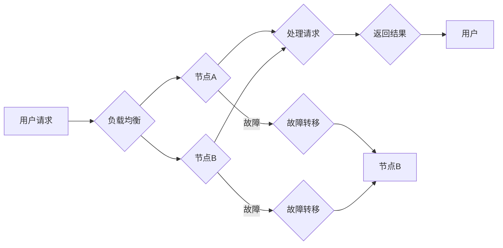

# 高可用性系统设计的关键要素

> 关键词：高可用性，系统设计，容错性，故障转移，负载均衡，冗余，集群，故障预测，自动化

## 1. 背景介绍

在当今数字化时代，系统的可用性对于企业和服务至关重要。高可用性系统设计的目标是确保系统在面临各种故障和压力时，能够持续提供服务，不中断用户的使用。本文将深入探讨高可用性系统设计的关键要素，并提供实际案例和最佳实践。

### 1.1 问题的由来

随着互联网和云计算的发展，系统面临的服务请求量越来越大，同时系统复杂性也在不断提升。这导致系统故障的风险增加，一旦系统出现故障，可能会造成严重的经济损失和品牌形象损害。因此，高可用性系统设计成为系统架构师和工程师们必须面对的挑战。

### 1.2 研究现状

高可用性系统设计是一个广泛的研究领域，包括容错、负载均衡、故障转移、冗余等多个方面。随着技术的进步，新的解决方案不断涌现，如容器化、微服务、云服务等，这些技术为高可用性系统设计提供了新的可能性。

### 1.3 研究意义

研究高可用性系统设计对于以下方面具有重要意义：

- 提高企业业务的连续性和稳定性。
- 降低系统故障带来的经济损失和品牌损害。
- 优化用户体验，提高用户满意度。
- 促进系统架构的优化和升级。

### 1.4 本文结构

本文将分为以下几个部分：

- 核心概念与联系
- 核心算法原理 & 具体操作步骤
- 数学模型和公式 & 详细讲解 & 举例说明
- 项目实践：代码实例和详细解释说明
- 实际应用场景
- 工具和资源推荐
- 总结：未来发展趋势与挑战
- 附录：常见问题与解答

## 2. 核心概念与联系

### 2.1 核心概念原理

高可用性系统设计涉及以下核心概念：

- **容错性（Fault Tolerance）**：系统在出现故障时，能够继续运行的能力。
- **故障转移（Failover）**：在主节点出现故障时，将服务自动切换到备份节点。
- **负载均衡（Load Balancing）**：将服务请求均匀分配到多个节点，提高系统吞吐量。
- **冗余（Redundancy）**：通过增加硬件、软件或数据副本来提高系统的可靠性。
- **集群（Cluster）**：由多个节点组成的系统，共同提供服务。
- **故障预测（Fault Prediction）**：通过分析系统行为预测潜在故障，提前采取措施。

### 2.2 架构的 Mermaid 流程图



在这个流程图中，用户请求首先通过负载均衡器分发到节点A或节点B。每个节点处理请求并返回结果给用户。如果节点A或节点B出现故障，则故障转移机制将服务切换到另一个节点。

## 3. 核心算法原理 & 具体操作步骤

### 3.1 算法原理概述

高可用性系统设计通常遵循以下原理：

- **模块化**：将系统分解为独立的模块，以便于管理和维护。
- **分布式**：将系统部署在多个节点上，提高系统的容错性和扩展性。
- **冗余**：通过冗余硬件、软件或数据副本，提高系统的可靠性。
- **自动化**：自动化监控和故障处理，减少人为错误。

### 3.2 算法步骤详解

1. **需求分析**：确定系统的高可用性需求，包括可接受的故障时间和恢复时间。
2. **架构设计**：根据需求分析结果，设计高可用性系统架构。
3. **组件选择**：选择合适的硬件、软件和云服务组件。
4. **部署实施**：将系统组件部署到多个节点上。
5. **监控与维护**：持续监控系统状态，及时处理故障。
6. **测试与优化**：定期进行系统测试，优化系统性能和可用性。

### 3.3 算法优缺点

**优点**：

- 提高系统可靠性，降低故障风险。
- 提高系统性能，支持更高的并发请求。
- 提高系统可维护性，方便管理和维护。

**缺点**：

- 系统设计复杂，需要更多资源和维护成本。
- 需要专门的团队和技术支持。

### 3.4 算法应用领域

高可用性系统设计适用于以下领域：

- 电子商务网站
- 在线支付系统
- 社交媒体平台
- 云服务提供商
- 企业级应用

## 4. 数学模型和公式 & 详细讲解 & 举例说明

### 4.1 数学模型构建

高可用性系统的数学模型通常包括以下指标：

- **可用性（Availability）**：系统在特定时间内能够正常工作的概率，通常用 $\text{Availability} = \frac{MTTF}{MTTF + MTTR}$ 表示，其中 $MTTF$ 为平均无故障时间，$MTTR$ 为平均修复时间。
- **故障率（Failure Rate）**：单位时间内系统发生故障的概率，通常用 $\lambda = \frac{1}{MTTF}$ 表示。
- **吞吐量（Throughput）**：系统在单位时间内能够处理的服务请求数量，通常用 $\text{Throughput} = \frac{1}{MTTF}$ 表示。

### 4.2 公式推导过程

**可用性公式推导**：

$$
\text{Availability} = \frac{MTTF}{MTTF + MTTR}
$$

假设系统在时间 $t$ 内无故障运行，则 $MTTF = t$。当系统出现故障时，需要时间 $MTTR$ 进行修复。因此，系统在时间 $t$ 内可用的概率为 $\frac{t}{t+MTTR}$。

**故障率公式推导**：

$$
\lambda = \frac{1}{MTTF}
$$

故障率是单位时间内发生故障的概率，因此 $\lambda = \frac{1}{MTTF}$。

**吞吐量公式推导**：

$$
\text{Throughput} = \frac{1}{MTTF}
$$

吞吐量是单位时间内处理的服务请求数量，因此 $\text{Throughput} = \frac{1}{MTTF}$。

### 4.3 案例分析与讲解

假设一个系统在24小时内无故障运行的概率为99.99%，则其可用性为：

$$
\text{Availability} = \frac{24 \times 60 \times 60}{24 \times 60 \times 60 + 60} \approx 99.99\%
$$

这意味着系统在一年内出现一次故障的概率约为0.01%。

## 5. 项目实践：代码实例和详细解释说明

### 5.1 开发环境搭建

为了演示高可用性系统设计，我们将使用Python编写一个简单的HTTP服务器。这个服务器将使用多线程来处理并发请求，并实现基本的负载均衡和故障转移机制。

```python
import http.server
import socketserver
import threading
import random

PORT = 8000
MAX_THREADS = 5

class ThreadedHTTPServer(socketserver.ThreadingMixIn, http.server.HTTPServer):
    """Handle requests in a separate thread."""

class RequestHandler(http.server.SimpleHTTPRequestHandler):
    def do_GET(self):
        self.send_response(200)
        self.send_header('Content-type', 'text/plain')
        self.end_headers()
        self.wfile.write(b'Hello, world!')

httpd = ThreadedHTTPServer(("", PORT), RequestHandler)
print(f"Serving at port {PORT}")
httpd.serve_forever()
```

### 5.2 源代码详细实现

在上面的代码中，我们创建了一个名为 `ThreadedHTTPServer` 的类，它继承自 `socketserver.ThreadingMixIn` 和 `http.server.HTTPServer`。这允许服务器在多个线程中处理请求，从而提高并发处理能力。

`RequestHandler` 类继承自 `http.server.SimpleHTTPRequestHandler`，用于处理HTTP请求。在 `do_GET` 方法中，我们发送一个HTTP 200响应，并返回一个简单的文本消息。

### 5.3 代码解读与分析

这个简单的HTTP服务器实现了基本的负载均衡，因为它可以同时处理多个请求。此外，通过使用多线程，它可以提高并发处理能力。

### 5.4 运行结果展示

运行上述代码后，你可以在浏览器中访问 `http://localhost:8000`，看到服务器返回的 "Hello, world!" 消息。

## 6. 实际应用场景

### 6.1 电子商务网站

电子商务网站需要高可用性来确保订单处理和支付系统的稳定性。通过使用负载均衡和故障转移机制，可以确保在服务器故障时，用户仍然能够顺利完成交易。

### 6.2 在线支付系统

在线支付系统需要高可用性来确保资金的快速处理和安全性。通过使用冗余和故障预测技术，可以减少系统故障和欺诈行为。

### 6.3 社交媒体平台

社交媒体平台需要高可用性来确保用户能够随时访问其账户和发布内容。通过使用分布式架构和负载均衡，可以确保平台在高负载情况下仍然稳定运行。

## 7. 工具和资源推荐

### 7.1 学习资源推荐

- 《高可用性系统设计》
- 《Designing Data-Intensive Applications》
- 《The Art of Distributed Systems》

### 7.2 开发工具推荐

- Nginx
- HAProxy
- Kubernetes
- Prometheus
- Grafana

### 7.3 相关论文推荐

- "High Availability for Web Sites: Designing and Deploying Resilient Internet Systems" by John Allspaw
- "Designing Data-Intensive Applications" by Martin Kleppmann

## 8. 总结：未来发展趋势与挑战

### 8.1 研究成果总结

高可用性系统设计是一个不断发展的领域，随着技术的进步，新的解决方案和工具不断涌现。通过合理设计系统架构、选择合适的工具和资源，可以构建出高可用性、高可靠性的系统。

### 8.2 未来发展趋势

- **自动化**：自动化监控、故障检测和故障恢复将变得更加普及。
- **云计算**：云服务提供商将提供更多高可用性解决方案。
- **边缘计算**：边缘计算将提高分布式系统的可扩展性和响应速度。

### 8.3 面临的挑战

- **复杂性**：随着系统规模的扩大，系统设计和管理变得更加复杂。
- **安全性**：系统安全是高可用性系统设计的重要挑战。
- **成本**：构建和维护高可用性系统需要投入更多的资源。

### 8.4 研究展望

未来，高可用性系统设计的研究将主要集中在以下方面：

- **智能化**：利用人工智能技术进行故障预测和自动化故障恢复。
- **优化**：通过优化算法和架构来提高系统性能和可靠性。
- **标准化**：建立高可用性系统设计的标准化流程和规范。

## 9. 附录：常见问题与解答

**Q1：什么是高可用性系统？**

A：高可用性系统是指能够在面对各种故障和压力时，持续提供服务，不中断用户使用的系统。

**Q2：如何实现高可用性系统？**

A：实现高可用性系统需要从架构设计、组件选择、部署实施、监控与维护等多个方面进行综合考虑。

**Q3：什么是负载均衡？**

A：负载均衡是指将服务请求均匀分配到多个节点，提高系统吞吐量。

**Q4：什么是故障转移？**

A：故障转移是指将服务从故障节点切换到备份节点，确保服务的连续性。

**Q5：什么是冗余？**

A：冗余是指通过增加硬件、软件或数据副本来提高系统的可靠性。

**Q6：什么是集群？**

A：集群是指由多个节点组成的系统，共同提供服务。

**Q7：什么是故障预测？**

A：故障预测是指通过分析系统行为预测潜在故障，提前采取措施。

作者：禅与计算机程序设计艺术 / Zen and the Art of Computer Programming