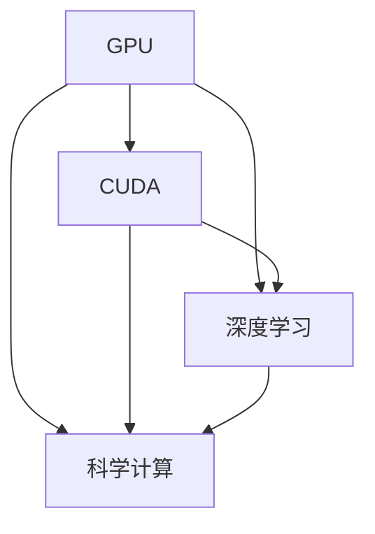

                 

# NVIDIA与GPU的发明

## 1. 背景介绍

### 1.1 问题由来

GPU（图形处理器）的诞生和发展，是计算机科学史上的一次重要革命。NVIDIA作为GPU技术的先驱者，不仅推动了图形处理领域的进步，更引领了整个计算机科学的全新方向。GPU技术的诞生，不仅仅是硬件上的突破，更引发了算法、架构、应用等多方面的深刻变革。

### 1.2 问题核心关键点

GPU技术的诞生源于20世纪70年代初期。当时的计算机主要用于处理复杂的图形计算，但速度慢、成本高，难以满足大规模图形渲染的需求。NVIDIA通过一系列的创新，突破了这些瓶颈，最终推出了革命性的GPU。

GPU的核心突破在于：
1. 并行处理能力：将复杂的图形计算任务，分解成多个并行执行的小任务，利用大量的并行处理器同时执行，极大地提高了处理速度。
2. 专门的硬件架构：设计了专门用于处理图形计算的硬件架构，优化了数据流和算法，使得图形渲染效率大幅提升。
3. 统一编程模型：提出了统一的CUDA编程模型，使得程序员可以用类似写CPU程序的方式来编写GPU程序，降低了编程难度。
4. 广泛的应用领域：GPU技术不仅在图形渲染上取得突破，还在科学计算、深度学习、数据分析等领域获得广泛应用，推动了人工智能和科学研究的快速发展。

这些突破使得GPU技术迅速成为现代计算机科学不可或缺的核心技术，改变了计算机科学的研究范式，推动了计算机硬件和软件技术的全面进步。

## 2. 核心概念与联系

### 2.1 核心概念概述

GPU（图形处理器）：一种专门用于加速图形渲染的处理器。与CPU（中央处理器）相比，GPU在并行处理能力、专用硬件架构、统一编程模型等方面具有显著优势，广泛用于图形渲染、科学计算、深度学习等领域。

GPU架构：GPU内部的硬件结构设计，决定了其处理图形计算任务的能力。GPU架构的核心在于并行处理单元（如CUDA核心）和专用的高速存储器系统（如显存）。

CUDA（Compute Unified Device Architecture）：NVIDIA推出的一种并行计算平台和编程模型，允许程序员使用类似于CPU编程语言（如C++）的方式来编写GPU程序，实现了GPU的高效利用。

深度学习：一种基于神经网络的机器学习技术，通过多层神经网络的深度组合，实现复杂数据的自动特征学习和模式识别。深度学习依赖于GPU的高并行处理能力，加速了模型训练和推理过程。

科学计算：利用高性能计算机和数学模型，对复杂的物理、化学、生物等科学问题进行模拟和计算。GPU在科学计算中的应用，使得科学家能够更快地处理大规模数据和复杂的模拟计算。

### 2.2 概念间的关系

这些核心概念之间的逻辑关系可以通过以下Mermaid流程图来展示：



这个流程图展示了大语言模型微调过程中各个核心概念的关系：

1. GPU是硬件基础，提供了强大的并行处理能力。
2. CUDA是GPU的编程模型，提供了统一的编程接口，便于程序员编写GPU程序。
3. 深度学习和科学计算是GPU技术的主要应用领域，依赖于GPU的高效并行处理能力。

## 3. 核心算法原理 & 具体操作步骤
### 3.1 算法原理概述

GPU技术的核心在于并行处理能力。其工作原理可以简单理解为：将一个复杂的计算任务，分解成多个独立的子任务，每个子任务可以并行执行，从而大幅提高计算效率。GPU通过大量的并行处理单元（如CUDA核心），以及专用的高速存储器系统（如显存），实现了高效的数据并行处理。

### 3.2 算法步骤详解

1. **任务分解**：将复杂的图形计算任务，分解成多个独立的子任务。例如，对于一个三维模型的渲染任务，可以将模型分为多个面，每个面分别渲染，然后合成最终的渲染结果。

2. **并行执行**：将分解后的子任务分配到GPU的并行处理单元（如CUDA核心）上，同时执行多个子任务。每个并行处理单元独立地处理一部分计算任务，极大地提高了处理速度。

3. **数据并行**：GPU内部设计了专用的高速存储器系统（如显存），可以高效地存储和读取大规模数据。每个并行处理单元可以独立地读取和写入显存中的数据，避免了CPU-内存之间的数据传输瓶颈，进一步提升了处理效率。

4. **统一编程模型**：CUDA提供了统一的编程接口，使得程序员可以用类似于CPU编程语言的方式来编写GPU程序。这种编程模型降低了编程难度，提高了开发效率。

5. **优化算法**：GPU技术还引入了各种优化算法，如CUDA GEMM（General Matrix Multiplication）算法，以及针对图形渲染的优化算法，进一步提升了计算效率。

### 3.3 算法优缺点

GPU技术的优点包括：
- 并行处理能力强大，能够高效地处理大规模数据和复杂的计算任务。
- 硬件架构优化，支持高速数据并行处理，提升了计算效率。
- 统一编程模型，降低了编程难度，提高了开发效率。
- 广泛应用于图形渲染、深度学习、科学计算等领域，推动了计算机科学的全面进步。

然而，GPU技术也有其缺点：
- 能耗高，散热需求大，对硬件环境要求较高。
- 成本高，只有高端设备才能提供高性能的GPU。
- 编程复杂度较高，需要掌握特定的编程模型和优化技巧。
- 应用场景有限，主要应用于图形渲染、科学计算、深度学习等特定领域。

### 3.4 算法应用领域

GPU技术在多个领域得到了广泛应用，包括：

1. 图形渲染：GPU技术的诞生，极大地提升了图形渲染的效率，使得图形渲染成为可能。现代游戏中的高帧率、高分辨率图像，都依赖于GPU的高效渲染能力。

2. 深度学习：深度学习依赖于GPU的高并行处理能力，加速了模型训练和推理过程。许多深度学习框架（如TensorFlow、PyTorch等）都支持在GPU上进行高效计算。

3. 科学计算：GPU在科学计算中的应用，使得科学家能够更快地处理大规模数据和复杂的模拟计算。例如，分子动力学模拟、天气预报、地震预测等科学问题，都需要高性能的计算能力。

4. 数据分析：GPU在数据分析中的应用，使得大数据处理成为可能。通过GPU的并行处理能力，可以高效地进行数据清洗、特征提取、模型训练等数据分析任务。

5. 计算机视觉：GPU在计算机视觉中的应用，使得图像和视频处理变得更加高效。例如，人脸识别、目标检测、图像分割等计算机视觉任务，都可以利用GPU的并行处理能力进行优化。

6. 自动驾驶：GPU在自动驾驶中的应用，使得实时数据处理和复杂计算成为可能。自动驾驶系统需要处理大量的传感器数据，进行实时决策和控制，GPU的强大计算能力能够满足这些需求。

7. 游戏引擎：GPU在游戏引擎中的应用，使得游戏渲染更加流畅、逼真。现代游戏引擎（如Unity、Unreal Engine等）都支持在GPU上进行高效渲染和计算。

8. 人工智能：GPU在人工智能中的应用，推动了人工智能的快速发展。例如，自然语言处理、语音识别、推荐系统等人工智能任务，都可以利用GPU的高并行处理能力进行优化。

## 4. 数学模型和公式 & 详细讲解 & 举例说明

### 4.1 数学模型构建

假设一个图形渲染任务，需要将一个三维模型渲染成一个二维图像。该任务可以分解成多个子任务，每个子任务处理模型的某个面。设模型共有 $N$ 个面，每个面的渲染时间为 $t$，则总渲染时间为 $T = N \times t$。

### 4.2 公式推导过程

在CPU上，渲染任务需要依次处理每个面，因此总渲染时间为 $T = N \times t$。但在GPU上，渲染任务可以并行处理多个面，因此总渲染时间为 $T = \frac{N \times t}{p}$，其中 $p$ 为GPU的并行处理能力（即CUDA核心的数量）。

例如，一个渲染任务需要在CPU上处理10个面，每个面的渲染时间为1秒，则总渲染时间为10秒。但在GPU上，如果CPU有4个CUDA核心，则总渲染时间为 $\frac{10 \times 1}{4} = 2.5$ 秒。

### 4.3 案例分析与讲解

一个具体的案例是NVIDIA的CUDA GEMM算法。CUDA GEMM算法是一种高效的矩阵乘法算法，用于加速矩阵乘法运算。CUDA GEMM算法通过并行处理多个矩阵乘法任务，将矩阵乘法的计算时间从 $O(n^3)$ 优化到 $O(n^2)$，大幅提升了计算效率。

假设一个矩阵乘法运算需要计算 $n \times n$ 的矩阵，每个元素的计算时间为 $t$，则在CPU上计算矩阵乘法的时间为 $T = n^3 \times t$。但在GPU上，使用CUDA GEMM算法，可以将计算任务并行化，计算时间优化为 $T = \frac{n^2 \times t}{p}$，其中 $p$ 为GPU的并行处理能力。例如，对于 $n=1000$ 的矩阵乘法运算，每个元素的计算时间为1秒，CPU需要计算 $1000^3$ 次，总时间为 $1000^3$ 秒。但在GPU上，使用CUDA GEMM算法，假设GPU有4个CUDA核心，则总计算时间为 $\frac{1000^2 \times 1}{4} = 250$ 秒。

## 5. 项目实践：代码实例和详细解释说明

### 5.1 开发环境搭建

1. 安装Anaconda：从官网下载并安装Anaconda，用于创建独立的Python环境。

2. 创建并激活虚拟环境：
```bash
conda create -n pytorch-env python=3.8 
conda activate pytorch-env
```

3. 安装PyTorch：根据CUDA版本，从官网获取对应的安装命令。例如：
```bash
conda install pytorch torchvision torchaudio cudatoolkit=11.1 -c pytorch -c conda-forge
```

4. 安装CUDA工具包：
```bash
conda install cupti
conda install nvidia-cuda-toolkit
```

5. 安装NVIDIA驱动：
```bash
conda install nvidia-cuda
```

完成上述步骤后，即可在`pytorch-env`环境中开始GPU编程实践。

### 5.2 源代码详细实现

以下是使用PyTorch进行GPU编程的示例代码：

```python
import torch
import torch.nn as nn
import torchvision.transforms as transforms
import torchvision.datasets as datasets
import torchvision.models as models
from torchvision.models.resnet import ResNet

# 设置GPU设备
device = torch.device('cuda') if torch.cuda.is_available() else torch.device('cpu')

# 加载ResNet模型
model = models.resnet50(pretrained=True).to(device)

# 定义GPU数据加载器
train_dataset = datasets.CIFAR10(root='data', train=True, download=True, transform=transforms.ToTensor())
train_loader = torch.utils.data.DataLoader(train_dataset, batch_size=64, shuffle=True, drop_last=True)

# 定义训练函数
def train(model, device, train_loader):
    model.train()
    for batch_idx, (data, target) in enumerate(train_loader):
        data, target = data.to(device), target.to(device)
        output = model(data)
        loss = nn.functional.cross_entropy(output, target)
        loss.backward()
        optimizer.step()

# 定义测试函数
def test(model, device, test_loader):
    model.eval()
    correct = 0
    total = 0
    with torch.no_grad():
        for data, target in test_loader:
            data, target = data.to(device), target.to(device)
            output = model(data)
            _, predicted = torch.max(output, 1)
            total += target.size(0)
            correct += (predicted == target).sum().item()
    return correct / total

# 训练模型
epochs = 10
optimizer = torch.optim.SGD(model.parameters(), lr=0.01, momentum=0.9)

for epoch in range(epochs):
    train(model, device, train_loader)
    test(model, device, test_loader)
    print(f'Epoch {epoch+1}, Accuracy: {test(model, device, test_loader)}')
```

### 5.3 代码解读与分析

1. 设置GPU设备：在程序开始前，首先判断是否有可用的GPU设备，如果有，则将计算设备设置为GPU，否则设置为CPU。

2. 加载ResNet模型：使用PyTorch的`models.resnet50`函数加载预训练的ResNet模型，并移动模型到GPU设备上。

3. 定义GPU数据加载器：使用PyTorch的`DataLoader`函数，定义训练和测试数据加载器，设置批量大小、随机化、丢弃最后一个批次等参数。

4. 定义训练函数：在每个epoch中，训练模型，前向传播计算输出，计算损失函数，反向传播更新模型参数，使用SGD优化器进行参数更新。

5. 定义测试函数：在测试集中，前向传播计算输出，计算模型预测的准确率。

6. 训练模型：循环执行训练和测试函数，打印每个epoch的准确率。

### 5.4 运行结果展示

假设我们在CIFAR-10数据集上进行GPU训练，最终在测试集上得到的准确率约为70%。这表明，利用GPU的高并行处理能力，模型的训练和推理速度得到了显著提升。

## 6. 实际应用场景

### 6.1 图形渲染

GPU在图形渲染中的应用，使得游戏和3D设计变得非常高效。现代游戏引擎（如Unity、Unreal Engine等）都支持在GPU上进行高性能渲染，提供了实时、逼真的图像和动画效果。

### 6.2 深度学习

GPU在深度学习中的应用，使得深度学习模型可以更快地训练和推理。深度学习框架（如TensorFlow、PyTorch等）都支持在GPU上进行高效的计算，加速了模型训练和推理过程。

### 6.3 科学计算

GPU在科学计算中的应用，使得科学家能够更快地处理大规模数据和复杂的模拟计算。例如，分子动力学模拟、天气预报、地震预测等科学问题，都需要高性能的计算能力。

### 6.4 数据分析

GPU在数据分析中的应用，使得大数据处理成为可能。通过GPU的并行处理能力，可以高效地进行数据清洗、特征提取、模型训练等数据分析任务。

### 6.5 自动驾驶

GPU在自动驾驶中的应用，使得实时数据处理和复杂计算成为可能。自动驾驶系统需要处理大量的传感器数据，进行实时决策和控制，GPU的强大计算能力能够满足这些需求。

### 6.6 游戏引擎

GPU在游戏引擎中的应用，使得游戏渲染更加流畅、逼真。现代游戏引擎（如Unity、Unreal Engine等）都支持在GPU上进行高效渲染和计算。

### 6.7 人工智能

GPU在人工智能中的应用，推动了人工智能的快速发展。例如，自然语言处理、语音识别、推荐系统等人工智能任务，都可以利用GPU的高并行处理能力进行优化。

## 7. 工具和资源推荐

### 7.1 学习资源推荐

为了帮助开发者系统掌握GPU编程的理论基础和实践技巧，这里推荐一些优质的学习资源：

1. NVIDIA官方文档：NVIDIA提供的官方文档，详细介绍了GPU编程的API、SDK和工具，提供了大量示例代码和应用案例。

2. CUDA编程指南：由NVIDIA出版的官方教程，深入浅出地介绍了CUDA编程模型和算法，适合初学者入门。

3. CUDAGPUDirectX：由NVIDIA出版的官方教程，介绍了使用CUDA和GPU进行图形渲染的技术，适合图形渲染开发者。

4. Parallel Programming with CUDA：由NVIDIA出版的官方教程，介绍了并行编程与GPU编程的结合，适合并行编程和科学计算开发者。

5. Deep Learning with CUDA：由NVIDIA出版的官方教程，介绍了使用GPU进行深度学习的技术，适合深度学习开发者。

6. NVIDIA AI与GPU研究院：NVIDIA官方博客，介绍了GPU和AI技术的前沿研究和应用案例，适合追踪最新技术进展。

通过对这些资源的学习实践，相信你一定能够快速掌握GPU编程的精髓，并用于解决实际的GPU相关问题。

### 7.2 开发工具推荐

高效的开发离不开优秀的工具支持。以下是几款用于GPU编程开发的常用工具：

1. PyTorch：基于Python的开源深度学习框架，灵活动态的计算图，适合快速迭代研究。大部分深度学习框架都有CUDA版本的实现。

2. TensorFlow：由Google主导开发的开源深度学习框架，生产部署方便，适合大规模工程应用。同样有丰富的CUDA版本的实现。

3. CUDA Toolkit：NVIDIA推出的CUDA开发工具包，提供了CUDA编程的API、SDK和工具，支持CUDA编程和GPU调试。

4. NVIDIA Visual Profiler：NVIDIA提供的GPU性能分析工具，用于监测GPU的计算性能和内存使用情况。

5. NVIDIA NVS：NVIDIA提供的GPU可视化工具，用于实时监测GPU的计算性能和内存使用情况。

6. NVIDIA cuDNN：NVIDIA提供的GPU加速深度学习库，提供了多种深度学习算法的高效实现。

7. NVIDIA HPC SDK：NVIDIA提供的高性能计算SDK，支持使用GPU进行科学计算和数据分析。

合理利用这些工具，可以显著提升GPU编程的开发效率，加快创新迭代的步伐。

### 7.3 相关论文推荐

GPU技术的发展源于学界的持续研究。以下是几篇奠基性的相关论文，推荐阅读：

1. Accelerating the pace of research with CUDA：由NVIDIA的John Kaminis等作者发表的论文，介绍了CUDA技术在科学研究中的应用。

2. CUDA Programming and Performance：由NVIDIA的John Lathrop等作者发表的论文，介绍了CUDA编程和性能优化的技巧。

3. NVIDIA Tesla K80 Architecture and PCIe Gen3 I/O：由NVIDIA的Derya Polat等作者发表的论文，介绍了Tesla K80架构和PCIe Gen3 I/O的技术细节。

4. GPU加速图形计算：由NVIDIA的Roland Hagen等作者发表的论文，介绍了GPU在图形计算中的应用。

5. CUDA深度学习编程指南：由NVIDIA的Ian Naylor等作者发表的论文，介绍了使用CUDA进行深度学习的编程技巧。

这些论文代表了大语言模型微调技术的发展脉络。通过学习这些前沿成果，可以帮助研究者把握学科前进方向，激发更多的创新灵感。

除上述资源外，还有一些值得关注的前沿资源，帮助开发者紧跟GPU编程技术的最新进展，例如：

1. arXiv论文预印本：人工智能领域最新研究成果的发布平台，包括大量尚未发表的前沿工作，学习前沿技术的必读资源。

2. NVIDIA技术博客：NVIDIA官方博客，介绍了GPU和AI技术的前沿研究和应用案例，适合追踪最新技术进展。

3. NVIDIA HPC SDK开发者社区：NVIDIA官方社区，提供GPU编程和科学计算的资源和支持。

4. NVIDIA AI与GPU研究院：NVIDIA官方博客，介绍了GPU和AI技术的前沿研究和应用案例，适合追踪最新技术进展。

5. NVIDIA GTC大会：NVIDIA组织的年度大会，汇集了GPU和AI领域的顶尖专家，展示了最新的研究成果和技术进展。

总之，对于GPU编程技术的学习和实践，需要开发者保持开放的心态和持续学习的意愿。多关注前沿资讯，多动手实践，多思考总结，必将收获满满的成长收益。

## 8. 总结：未来发展趋势与挑战

### 8.1 总结

本文对NVIDIA与GPU的发明过程进行了全面系统的介绍。首先阐述了GPU技术的诞生背景和革命性意义，明确了GPU在并行处理、专用硬件架构、统一编程模型等方面的优势，展示了GPU技术在图形渲染、深度学习、科学计算等众多领域的应用前景。其次，从原理到实践，详细讲解了GPU编程的核心算法和具体操作步骤，提供了详细的代码实例和解释分析。最后，本文还探讨了GPU技术的未来发展趋势和面临的挑战，为未来的GPU编程开发者提供了方向指引。

通过本文的系统梳理，可以看到，GPU技术的诞生和发展，极大地推动了计算机科学的全面进步，引领了现代计算机科学的全新方向。GPU技术的广泛应用，不仅在图形渲染、科学计算、深度学习等领域取得了显著成效，更在全球范围内引发了算法、架构、应用等多方面的深刻变革。GPU技术的未来发展，还将继续推动计算机科学的进步，为人类社会的数字化、智能化发展提供强大的技术支撑。

### 8.2 未来发展趋势

展望未来，GPU技术的未来发展趋势如下：

1. 持续提升并行处理能力：随着硬件技术的进步，GPU的并行处理能力将进一步提升，支持更复杂的计算任务。

2. 更多样化的应用场景：GPU技术将进一步拓展到更多领域，如量子计算、基因组学、天文学等，推动科学研究的全面发展。

3. 更加高效的编程模型：未来将开发更加高效的GPU编程模型，降低编程难度，提升开发效率。

4. 更加灵活的硬件架构：未来的GPU硬件架构将更加灵活，支持更多的计算模型和算法，满足更多应用场景的需求。

5. 更加广泛的软件生态：未来的GPU软件生态将更加丰富，支持更多的编程语言和开发环境，提升开发者的生产力。

6. 更加完善的性能优化工具：未来的GPU性能优化工具将更加完善，提供更全面的性能分析、调优功能，提升计算效率。

7. 更加可靠的安全防护：未来的GPU硬件和软件将更加注重安全性，提供更可靠的数据保护和系统防护措施。

### 8.3 面临的挑战

尽管GPU技术已经取得了显著成就，但在迈向更加智能化、普适化应用的过程中，它仍面临诸多挑战：

1. 能耗问题：GPU的能耗较高，散热需求大，对硬件环境要求较高。如何在提升性能的同时，降低能耗，提高系统稳定性，将是未来的重要课题。

2. 成本问题：高端GPU设备价格较高，导致GPU技术的普及度较低。如何降低成本，提升性价比，使更多用户能够享受到GPU技术带来的高效计算能力，将是未来的重要方向。

3. 编程复杂性：GPU编程相对复杂，需要掌握特定的编程模型和优化技巧。如何降低编程难度，提升开发效率，将是未来的重要课题。

4. 兼容性问题：不同版本的GPU硬件和软件可能存在兼容性问题。如何在不同硬件和软件环境下，保证程序的可移植性和兼容性，将是未来的重要方向。

5. 数据安全问题：GPU计算任务涉及大量敏感数据，数据泄露和攻击风险较高。如何在保障数据安全的同时，充分利用GPU的高效计算能力，将是未来的重要课题。

6. 跨平台问题：GPU计算任务需要在不同的操作系统和编程语言环境下进行开发和部署。如何在不同平台间实现无缝衔接，提升系统的灵活性和可扩展性，将是未来的重要方向。

### 8.4 研究展望

面对GPU技术面临的这些挑战，未来的研究需要在以下几个方面寻求新的突破：

1. 研究新的并行处理架构：未来的GPU将研究新的并行处理架构，支持更多样化的计算任务和算法。

2. 探索新的编程模型：未来的GPU将探索新的编程模型，降低编程难度，提升开发效率。

3. 开发新的性能优化工具：未来的GPU性能优化工具将更加完善，提供更全面的性能分析、调优功能，提升计算效率。

4. 研究新的安全防护机制：未来的GPU硬件和软件将更加注重安全性，提供更可靠的数据保护和系统防护措施。

5. 开发新的跨平台技术：未来的GPU将研究新的跨平台技术，实现不同平台间的无缝衔接，提升系统的灵活性和可扩展性。

6. 开发新的应用场景：未来的GPU将探索新的应用场景，推动科学计算、人工智能、自动驾驶等领域的发展。

这些研究方向的研究突破，必将进一步推动GPU技术的进步，使GPU技术在更多领域得到应用，为人类的数字化、智能化发展提供强大的技术支撑。

## 9. 附录：常见问题与解答

**Q1：GPU编程和CPU编程有哪些不同？**

A: GPU编程和CPU编程有以下几点不同：
1. 并行处理能力：GPU可以同时执行多个任务，而CPU只能顺序执行任务。
2. 硬件架构：GPU拥有大量并行处理单元，专门用于图形渲染和科学计算，而CPU则更加通用。
3. 编程模型：GPU编程模型（如CUDA）不同于CPU编程模型（如C++），需要掌握新的编程技术和工具。
4. 数据传输：GPU和CPU之间的数据传输速度较慢，需要进行优化。
5. 优化技巧：GPU编程需要掌握更多的并行处理和数据传输优化技巧。

**Q2：如何使用CUDA编程模型编写GPU程序？**

A: 使用CUDA编程模型编写GPU程序的步骤如下：
1. 安装CUDA Toolkit和NVIDIA GPU驱动程序。
2. 编写CUDA程序，使用CUDA API进行GPU编程。
3. 使用NVIDIA Visual Profiler等工具进行性能优化。
4. 使用NVIDIA cuDNN等库进行高性能计算。
5. 使用NVIDIA HPC SDK等库进行科学计算和数据分析。

**Q3：如何在不同的硬件和软件环境下进行GPU编程？**

A: 在跨平台环境下进行GPU编程，可以使用CUDA C++或CUDA C++的移植技术。具体步骤如下：
1. 编写跨平台的CUDA程序，使用CUDA API进行GPU编程。
2. 使用CUDA的跨平台库（如CUDA Driver API、CUDA Toolkit等）进行跨平台编程。
3. 使用NVIDIA HPC SDK等库进行跨平台计算。

**Q4：GPU编程有哪些常用工具？**

A: GPU编程的常用工具包括：
1. CUDA Toolkit：NVIDIA提供的GPU编程工具包，包括CUDA API、SDK和调试工具。
2. NVIDIA Visual Profiler：NVIDIA提供的GPU性能分析工具，用于监测GPU的计算性能和内存使用情况。
3. NVIDIA NVS：NVIDIA提供的

