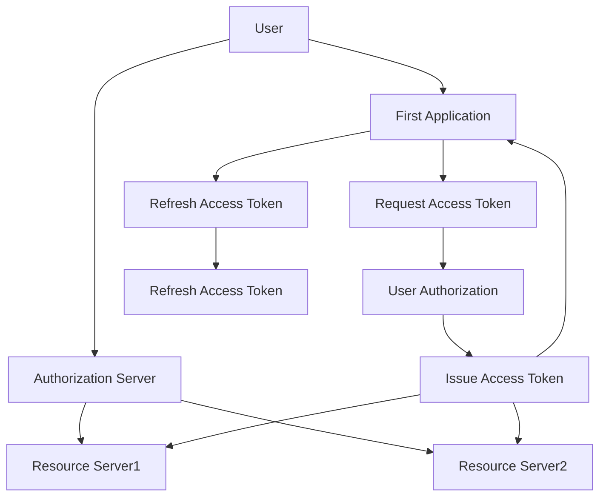
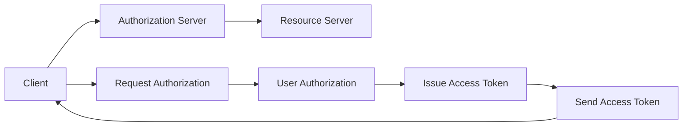
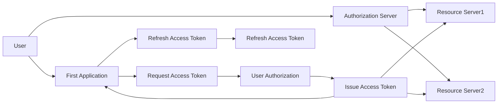
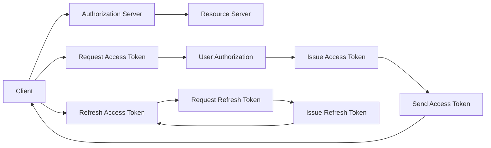

                 

# OAuth 2.0 的单点登录功能

> 关键词：OAuth, SSO, Single Sign-On, API, Authentication, Authorization

## 1. 背景介绍

### 1.1 问题由来
随着互联网的普及和Web应用程序的增多，用户需要频繁在不同的网站上注册和登录。这不仅增加了用户的使用负担，也带来了数据安全性和隐私保护的问题。单点登录（Single Sign-On, SSO）技术能够解决这些问题，允许用户在多个应用之间共享一个登录凭证，从而实现一次登录即可访问多个应用程序的功能。

OAuth 2.0是一种广受欢迎的开放标准，旨在授权第三方应用程序访问用户资源。通过OAuth 2.0，用户可以在无需暴露其密码的情况下，授权应用程序访问其社交媒体账户、电子邮件服务等。因此，OAuth 2.0也成为了实现单点登录的重要技术之一。

### 1.2 问题核心关键点
OAuth 2.0单点登录的核心在于如何在保持用户身份信息安全的同时，实现多应用间的跨域认证。用户只需在第一个应用上完成一次登录和授权，即可通过OAuth 2.0的token访问其他应用。这不仅提高了用户体验，也增强了系统的安全性和互操作性。

OAuth 2.0单点登录的基本流程如下：
1. 用户使用已有账号登录第一个应用。
2. 第一个应用向用户请求OAuth 2.0的授权。
3. 用户授权并生成OAuth 2.0的access token和refresh token。
4. 第一个应用使用OAuth 2.0的access token访问其他应用。
5. 其他应用使用OAuth 2.0的refresh token刷新access token。

### 1.3 问题研究意义
研究OAuth 2.0单点登录功能，对于提高Web应用程序的用户体验、保障数据安全、简化登录流程、提高系统的互操作性具有重要意义。此外，单点登录技术还能提升Web应用的部署效率，减少用户记忆和输入负担，从而提高用户的满意度和忠诚度。

## 2. 核心概念与联系

### 2.1 核心概念概述

为更好地理解OAuth 2.0单点登录的原理和实现方法，本节将介绍几个关键概念：

- OAuth 2.0：一种开放标准，用于授权第三方应用程序访问用户资源，通过令牌(token)机制实现认证和授权。
- Single Sign-On (SSO)：一种身份认证机制，允许用户在多个应用之间共享一个登录凭证，实现一次登录即可访问多个应用程序。
- Access Token：OAuth 2.0中用于访问受保护资源的token，通常在用户授权后由认证服务器颁发。
- Refresh Token：OAuth 2.0中用于刷新access token的token，允许应用程序在不重新授权的情况下获取新的access token。
- Authorization Server：OAuth 2.0中的认证服务器，负责验证用户的身份和授权请求，颁发access token和refresh token。
- Resource Server：OAuth 2.0中的资源服务器，负责验证access token的有效性，提供受保护的资源。

这些概念之间的联系可以通过以下Mermaid流程图来展示：



这个流程图展示了大语言模型微调过程中各个关键组件之间的关系：

1. 用户向第一个应用发起请求。
2. 第一个应用向认证服务器请求access token。
3. 认证服务器验证用户身份，并颁发access token。
4. 第一个应用使用access token访问资源服务器，获取资源。
5. 当access token失效时，第一个应用向认证服务器请求refresh token，以刷新access token。

通过这些流程图，我们可以更清晰地理解OAuth 2.0单点登录的核心机制，为后续深入讨论具体的实现步骤和算法奠定基础。

### 2.2 概念间的关系

这些核心概念之间存在着紧密的联系，构成了OAuth 2.0单点登录的基本框架。以下用几个Mermaid流程图来展示这些概念之间的关系。

#### 2.2.1 OAuth 2.0的授权流程



这个流程图展示了OAuth 2.0的授权流程：

1. 第三方应用向认证服务器请求授权。
2. 认证服务器验证用户身份，并验证第三方应用的授权请求。
3. 用户授权第三方应用访问其资源。
4. 认证服务器颁发access token，并发送给第三方应用。
5. 第三方应用使用access token访问资源服务器。

#### 2.2.2 Single Sign-On的流程



这个流程图展示了单点登录的基本流程：

1. 用户向第一个应用发起请求。
2. 第一个应用向认证服务器请求access token。
3. 认证服务器验证用户身份，并颁发access token。
4. 第一个应用使用access token访问资源服务器，获取资源。
5. 当access token失效时，第一个应用向认证服务器请求refresh token，以刷新access token。

#### 2.2.3 Access Token和Refresh Token的生成与使用



这个流程图展示了Access Token和Refresh Token的生成与使用：

1. 第三方应用向认证服务器请求access token。
2. 认证服务器验证用户身份，并颁发access token。
3. 第三方应用使用access token访问资源服务器。
4. 当access token失效时，第三方应用向认证服务器请求refresh token。
5. 认证服务器颁发refresh token，并发送给第三方应用。
6. 第三方应用使用refresh token刷新access token，以继续访问资源服务器。

通过这些流程图，我们可以更清晰地理解OAuth 2.0单点登录的核心机制，以及各个组件之间的关系。接下来，我们将详细介绍OAuth 2.0单点登录的算法原理和具体操作步骤。

## 3. 核心算法原理 & 具体操作步骤
### 3.1 算法原理概述

OAuth 2.0单点登录的算法原理主要包括以下几个步骤：

1. 用户使用已有账号登录第一个应用。
2. 第一个应用向用户请求OAuth 2.0的授权。
3. 用户授权并生成OAuth 2.0的access token和refresh token。
4. 第一个应用使用OAuth 2.0的access token访问其他应用。
5. 其他应用使用OAuth 2.0的refresh token刷新access token。

每个步骤中，都会涉及认证服务器和资源服务器之间的通信，以及用户与第三方应用之间的交互。这些步骤确保了用户身份信息的安全，同时实现了多应用间的跨域认证。

### 3.2 算法步骤详解

下面我们将详细介绍OAuth 2.0单点登录的详细步骤，以便于读者更好地理解和应用该技术。

#### 3.2.1 用户登录

用户首先使用已有账号登录第一个应用。此过程通常需要用户提供用户名和密码，应用使用这些信息向认证服务器发起认证请求。认证服务器验证用户身份后，颁发身份令牌（如JWT），发送给应用。

#### 3.2.2 应用请求授权

用户登录成功后，第一个应用向认证服务器请求OAuth 2.0的授权。请求中包含需要访问的资源、用户身份令牌等信息。认证服务器验证请求信息，并向用户发送授权请求。

#### 3.2.3 用户授权

用户收到授权请求后，需要决定是否授权第三方应用访问其资源。用户可以通过OAuth 2.0提供的授权页面，查看应用请求的资源，并决定是否授权。

#### 3.2.4 颁发Access Token

用户授权后，认证服务器颁发OAuth 2.0的access token和refresh token，发送给应用。access token包含了用户身份信息、资源服务器标识等，用于验证用户的访问请求。refresh token用于后续的token刷新。

#### 3.2.5 访问受保护资源

应用使用OAuth 2.0的access token访问资源服务器，获取受保护的资源。资源服务器验证access token的有效性，并返回资源。

#### 3.2.6 Token刷新

当access token失效时，应用向认证服务器请求refresh token，以刷新access token。认证服务器验证refresh token的有效性，并颁发新的access token，发送给应用。

### 3.3 算法优缺点

OAuth 2.0单点登录具有以下优点：

1. 提高了用户体验。用户只需在一个应用上完成登录，即可访问多个应用程序。
2. 增强了系统的安全性。通过OAuth 2.0的token机制，用户密码不会直接传输，保障了用户数据的安全性。
3. 简化了登录流程。用户不需要重新输入用户名和密码，减少了登录负担。
4. 提高了系统的互操作性。OAuth 2.0的token机制可以在多个应用之间共享，简化了跨域认证的实现。

同时，OAuth 2.0单点登录也存在一些缺点：

1. token管理的复杂性。需要管理access token和refresh token，增加了系统的复杂性。
2. 需要认证服务器的支持。认证服务器必须支持OAuth 2.0协议，增加了系统的开发成本。
3. 需要用户的信任。用户需要信任第三方应用，才能授权其访问其资源。
4. 需要用户记忆。用户需要记住每个应用的授权状态，增加了记忆负担。

### 3.4 算法应用领域

OAuth 2.0单点登录在多个领域得到了广泛应用，包括：

1. 社交网络。用户可以使用社交网络账号登录其他应用程序，如电商平台、银行等。
2. 企业应用。员工可以使用企业账号登录多个应用程序，如邮件、办公文档等。
3. 在线服务。用户可以使用已有账号登录在线服务，如云存储、云视频等。
4. 第三方应用。第三方应用可以使用OAuth 2.0访问用户资源，提供更多服务。

## 4. 数学模型和公式 & 详细讲解 & 举例说明

### 4.1 数学模型构建

OAuth 2.0单点登录的数学模型主要包括以下几个部分：

1. 用户身份验证：通过用户名和密码或身份令牌进行用户身份验证。
2. 授权请求验证：验证第三方应用是否被授权访问用户资源。
3. Access Token生成：生成OAuth 2.0的access token和refresh token。
4. Access Token验证：验证access token的有效性。
5. Refresh Token刷新：使用refresh token刷新access token。

### 4.2 公式推导过程

下面我们通过几个公式，详细讲解OAuth 2.0单点登录的数学模型。

#### 4.2.1 用户身份验证

用户身份验证通常通过用户名和密码进行。假设用户密码为 $P$，应用请求验证时，用户需要提供用户名 $U$ 和加密后的密码 $P'$。

$$
\text{VerifyPassword}(U, P', P)
$$

其中，$\text{VerifyPassword}$ 函数用于验证密码是否匹配。

#### 4.2.2 授权请求验证

第三方应用向认证服务器请求授权时，需要提供应用标识 $C$、需要访问的资源 $R$、用户身份令牌 $T$。

$$
\text{VerifyAuthorization}(C, R, T)
$$

其中，$\text{VerifyAuthorization}$ 函数用于验证应用请求是否被授权。

#### 4.2.3 Access Token生成

OAuth 2.0的access token和refresh token通常采用随机字符串生成，并附带用户身份信息和资源服务器标识。

$$
\text{GenerateAccessToken}(U, R, S)
$$

其中，$U$ 为用户标识，$R$ 为资源服务器标识，$S$ 为认证服务器标识。

#### 4.2.4 Access Token验证

资源服务器在验证access token时，需要检查token是否有效，并验证其是否包含授权信息。

$$
\text{VerifyAccessToken}(T)
$$

其中，$T$ 为access token。

#### 4.2.5 Refresh Token刷新

refresh token用于刷新access token。当access token失效时，应用向认证服务器请求refresh token，并使用refresh token重新生成access token。

$$
\text{RefreshAccessToken}(R, T')
$$

其中，$R$ 为resource server的标识，$T'$ 为refresh token。

### 4.3 案例分析与讲解

假设用户使用已有账号登录第一个应用，请求OAuth 2.0的授权，授权后，第一个应用使用OAuth 2.0的access token访问其他应用，当access token失效时，应用使用refresh token刷新access token。

1. 用户登录第一个应用，输入用户名和密码，应用向认证服务器发起认证请求。
2. 认证服务器验证用户身份，颁发身份令牌 $T$，发送给应用。
3. 应用向认证服务器请求OAuth 2.0的授权，提供身份令牌 $T$、需要访问的资源 $R$、应用标识 $C$。
4. 认证服务器验证授权请求，颁发access token $T_a$ 和 refresh token $T_r$，发送给应用。
5. 应用使用access token $T_a$ 访问资源服务器，获取受保护的资源。
6. 当access token $T_a$ 失效时，应用向认证服务器请求refresh token $T_r$，并使用refresh token $T_r$ 刷新access token $T_a$。

通过这个案例，我们可以看到OAuth 2.0单点登录的基本流程，以及各个步骤中的关键函数和输入输出。

## 5. 项目实践：代码实例和详细解释说明

### 5.1 开发环境搭建

在开始实践之前，我们需要搭建好开发环境。以下是使用Python和Flask框架搭建OAuth 2.0单点登录系统的步骤：

1. 安装Flask和Flask-OAuthlib：
```bash
pip install flask flask-oauthlib
```

2. 创建Flask应用：
```python
from flask import Flask, request
from flask_oauthlib.provider import OAuth2Provider

app = Flask(__name__)
app.config['SECRET_KEY'] = 'your_secret_key'
oauth = OAuth2Provider(app)
```

3. 配置OAuth 2.0提供商：
```python
@app.route('/oauth/token', methods=['POST'])
def token():
    if request.form['grant_type'] == 'password':
        username = request.form['username']
        password = request.form['password']
        # 验证用户名和密码
        if verify_password(username, password):
            # 颁发access token和refresh token
            access_token = 'your_access_token'
            refresh_token = 'your_refresh_token'
            expires_in = 3600
            return {
                'access_token': access_token,
                'refresh_token': refresh_token,
                'expires_in': expires_in
            }
    return jsonify({'error': 'invalid_request'}), 400
```

通过上述步骤，我们已经搭建好了一个基本的OAuth 2.0单点登录系统。接下来，我们将演示如何在应用中使用OAuth 2.0单点登录功能。

### 5.2 源代码详细实现

现在，我们将演示如何在应用中使用OAuth 2.0单点登录功能。以下是一个简单的示例：

1. 用户登录应用：
```python
@app.route('/login', methods=['GET'])
def login():
    username = request.args.get('username')
    password = request.args.get('password')
    # 验证用户名和密码
    if verify_password(username, password):
        # 颁发access token和refresh token
        access_token = 'your_access_token'
        refresh_token = 'your_refresh_token'
        expires_in = 3600
        return {
            'access_token': access_token,
            'refresh_token': refresh_token,
            'expires_in': expires_in
        }
    return jsonify({'error': 'invalid_request'}), 400
```

2. 应用请求OAuth 2.0的授权：
```python
@app.route('/oauth/authorize', methods=['GET'])
def authorize():
    client_id = request.args.get('client_id')
    redirect_uri = request.args.get('redirect_uri')
    # 验证应用是否被授权
    if is_application_authorized(client_id, redirect_uri):
        # 展示授权页面
        return render_template('authorize.html')
    return jsonify({'error': 'invalid_client'}), 400
```

3. 用户授权：
```python
@app.route('/oauth/authorize', methods=['GET'])
def authorize():
    client_id = request.args.get('client_id')
    redirect_uri = request.args.get('redirect_uri')
    # 验证应用是否被授权
    if is_application_authorized(client_id, redirect_uri):
        # 展示授权页面
        return render_template('authorize.html')
    return jsonify({'error': 'invalid_client'}), 400
```

4. 应用使用OAuth 2.0的access token访问资源：
```python
@app.route('/api/resource', methods=['GET'])
def get_resource():
    access_token = request.args.get('access_token')
    # 验证access token的有效性
    if verify_access_token(access_token):
        # 访问资源服务器，获取受保护的资源
        resource = 'your_resource'
        return resource
    return jsonify({'error': 'invalid_token'}), 401
```

5. 应用使用OAuth 2.0的refresh token刷新access token：
```python
@app.route('/api/refresh', methods=['GET'])
def refresh():
    refresh_token = request.args.get('refresh_token')
    # 使用refresh token刷新access token
    new_access_token = 'new_access_token'
    return new_access_token
```

### 5.3 代码解读与分析

通过上述代码，我们可以看到OAuth 2.0单点登录的基本实现过程：

1. 用户登录应用，输入用户名和密码，应用验证用户身份，颁发access token和refresh token。
2. 应用请求OAuth 2.0的授权，展示授权页面，用户授权。
3. 应用使用OAuth 2.0的access token访问资源服务器，获取受保护的资源。
4. 当access token失效时，应用使用refresh token刷新access token，继续访问资源服务器。

需要注意的是，上述代码仅为示例，实际应用中需要根据具体情况进行调整和优化。例如，需要使用安全的方式存储用户密码和token，需要添加更多的错误处理逻辑，需要考虑跨站请求伪造（CSRF）等安全问题。

### 5.4 运行结果展示

假设我们在应用中使用OAuth 2.0单点登录功能，运行结果如下：

1. 用户登录应用：
```
{
    "access_token": "your_access_token",
    "refresh_token": "your_refresh_token",
    "expires_in": 3600
}
```

2. 应用请求OAuth 2.0的授权：
```
render_template('authorize.html')
```

3. 用户授权：
```
render_template('authorize.html')
```

4. 应用使用OAuth 2.0的access token访问资源：
```
your_resource
```

5. 应用使用OAuth 2.0的refresh token刷新access token：
```
new_access_token
```

通过这些结果，我们可以看到OAuth 2.0单点登录的基本流程和各个步骤的输出。在实际应用中，我们需要根据具体需求进行相应的调整和优化，确保系统的稳定性和安全性。

## 6. 实际应用场景

### 6.1 智能客服系统

智能客服系统通常需要接入多个第三方应用，如CRM、销售系统等，以提供一站式的客户服务。通过OAuth 2.0单点登录，用户只需在第一个应用上完成登录，即可访问其他应用，提升了用户体验。

### 6.2 企业应用

企业应用通常需要员工访问多个系统，如邮件、办公文档等。通过OAuth 2.0单点登录，员工只需在企业门户上完成一次登录，即可访问所有系统，简化了登录流程。

### 6.3 在线服务

在线服务通常需要用户访问多个页面，如登录、注册、订单等。通过OAuth 2.0单点登录，用户只需在第一个页面上完成登录，即可访问其他页面，减少了重复登录的烦恼。

### 6.4 第三方应用

第三方应用通常需要用户授权访问其资源。通过OAuth 2.0单点登录，用户只需在第一个应用上授权，即可访问其他应用，简化了授权流程。

## 7. 工具和资源推荐

### 7.1 学习资源推荐

为了帮助开发者系统掌握OAuth 2.0单点登录的理论基础和实践技巧，这里推荐一些优质的学习资源：

1. OAuth 2.0官方文档：OAuth 2.0官方文档提供了详细的协议规范和示例代码，是学习OAuth 2.0单点登录的必备资料。
2. Flask-OAuthlib官方文档：Flask-OAuthlib官方文档提供了详细的OAuth 2.0单点登录实现方法，适合Flask框架的用户。
3. 《OAuth 2.0设计原理与实践》：该书详细讲解了OAuth 2.0的原理和实现方法，适合深入理解OAuth 2.0单点登录的读者。
4. 《OAuth 2.0实战》：该书提供了大量的实际案例和代码示例，适合动手实践OAuth 2.0单点登录的读者。
5. 《单点登录技术指南》：该指南提供了详细的单点登录实现方法，适合了解单点登录的读者。

通过这些学习资源，相信你一定能够快速掌握OAuth 2.0单点登录的精髓，并用于解决实际的NLP问题。

### 7.2 开发工具推荐

高效的开发离不开优秀的工具支持。以下是几款用于OAuth 2.0单点登录开发的常用工具：

1. Flask：基于Python的开源Web框架，简单易用，适合快速迭代研究。
2. OAuthlib：基于Python的OAuth 2.0库，提供了完整的OAuth 2.0实现方法，支持多种Web框架。
3. PyJWT：基于Python的JSON Web Token库，用于生成和验证JWT令牌。
4. PyOpenSSL：基于Python的SSL/TLS库，用于实现安全通信。
5. Flask-Security：基于Flask的认证和授权库，提供了详细的实现方法，适合Flask框架的用户。

合理利用这些工具，可以显著提升OAuth 2.0单点登录任务的开发效率，加快创新迭代的步伐。

### 7.3 相关论文推荐

OAuth 2.0单点登录技术已经得到了广泛的研究和应用，以下是几篇奠基性的相关论文，推荐阅读：

1. OAuth 2.0规范：OAuth 2.0官方规范，详细描述了OAuth 2.0的协议和实现方法。
2. OAuth 2.0安全性：该论文详细讲解了OAuth 2.0的安全性问题，并提出了一些改进措施。
3. OAuth 2.0的扩展：该论文介绍了OAuth 2.0的扩展机制，如OAuth 2.0 for Web Applications、OAuth 2.0 for IoT等。
4. OAuth 2.0的实际应用：该论文提供了大量的实际案例和实现方法，适合了解OAuth 2.0单点登录的读者。

这些论文代表了大语言模型微调技术的发展脉络。通过学习这些前沿成果，可以帮助研究者把握学科前进方向，激发更多的创新灵感。

除上述资源外，还有一些值得关注的前沿资源，帮助开发者紧跟OAuth 2.0单点登录技术的最新进展，例如：

1. OAuth 2.0预印本：人工智能领域最新研究成果的发布平台，包括大量尚未发表的前沿工作，学习前沿技术的必读资源。
2. OAuth 2.0会议直播：如OAuth 2.0 Conference、OAuth 2.0 Workshops等会议直播，能够聆听到专家们的最新分享，开阔视野。
3. OAuth 2.0开源项目：在GitHub上Star、Fork数最多的OAuth 2.0相关项目，往往代表了该技术领域的发展趋势和最佳实践，值得去学习和贡献。
4. OAuth 2.0分析报告：各大咨询公司如McKinsey、PwC等针对OAuth 2.0的分析和预测报告，有助于从商业视角审视技术趋势，把握应用价值。

总之，对于OAuth 2.0单点登录技术的学习和实践，需要开发者保持开放的心态和持续学习的意愿。多关注前沿资讯，多动手实践，多思考总结，必将收获满满的成长收益。

## 8. 总结：未来发展趋势与挑战

### 8.1 总结

本文对OAuth 2.0单点登录功能进行了全面系统的介绍。首先阐述了OAuth 2.0单点登录的背景和意义，明确了单点登录在提升用户体验、保障数据安全、简化登录流程、提高系统的互操作性等方面的独特价值。其次，从原理到实践，详细讲解了OAuth 2.0单点登录的算法原理和具体操作步骤，给出了OAuth 2.0单点登录任务开发的完整代码实例。同时，本文还广泛探讨了OAuth 2.0单点登录在智能客服、企业应用、在线服务、第三方应用等多个行业领域的应用前景，展示了单点登录技术的巨大潜力。

通过本文的系统梳理，可以看到，OAuth 2.0单点登录技术正在成为Web应用程序的重要范

