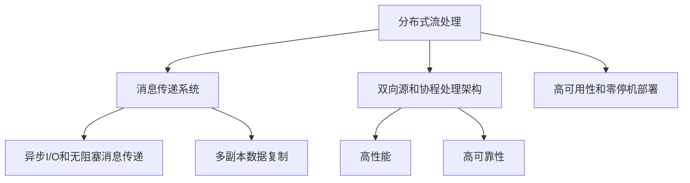
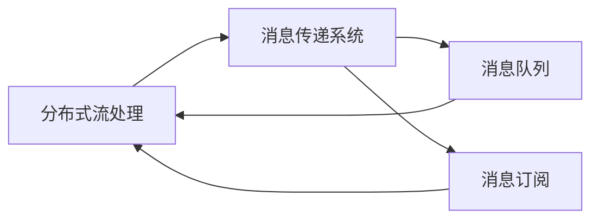
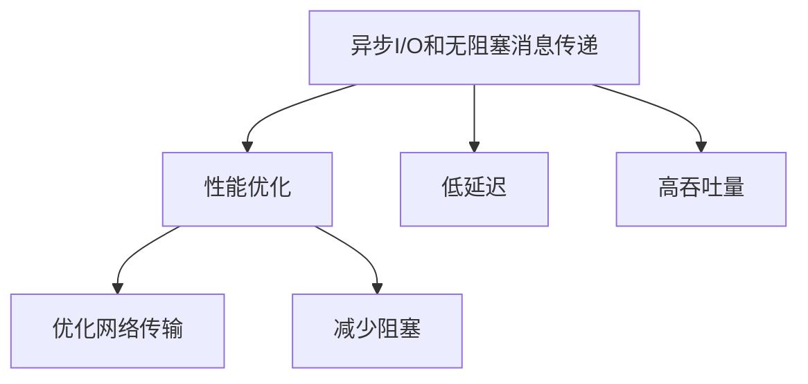
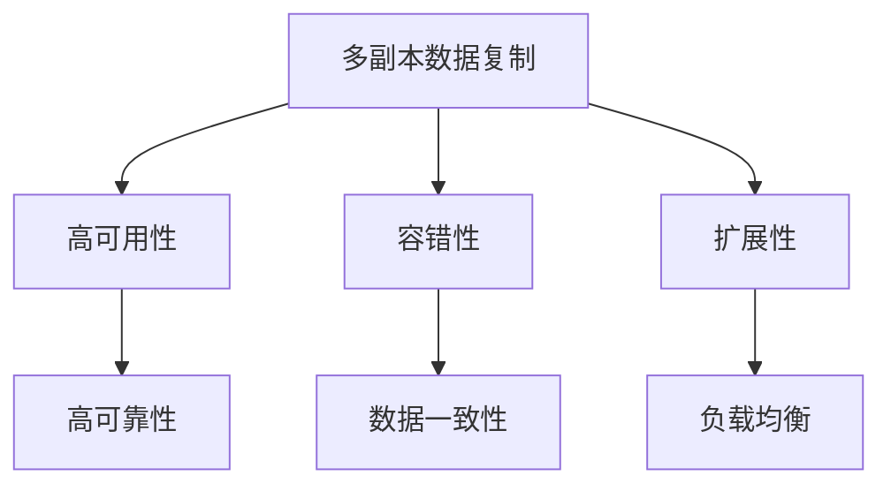
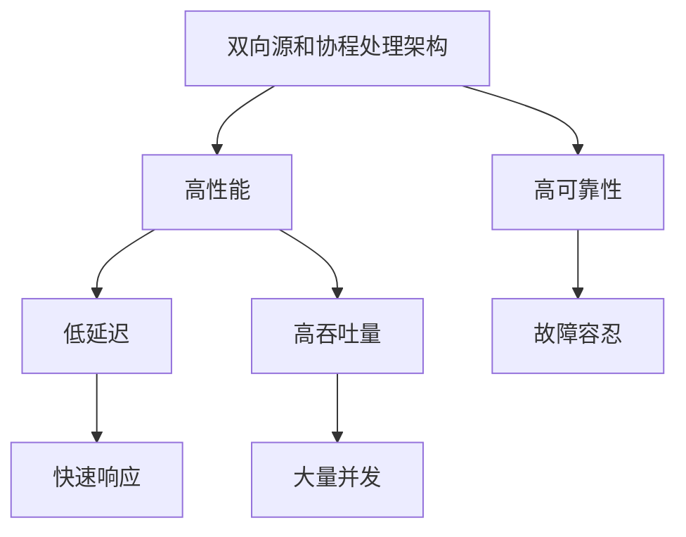
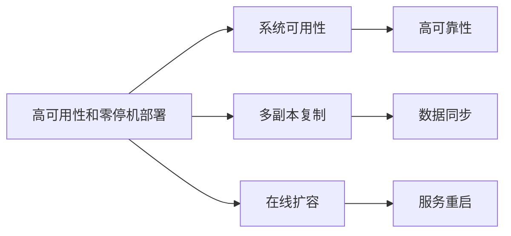
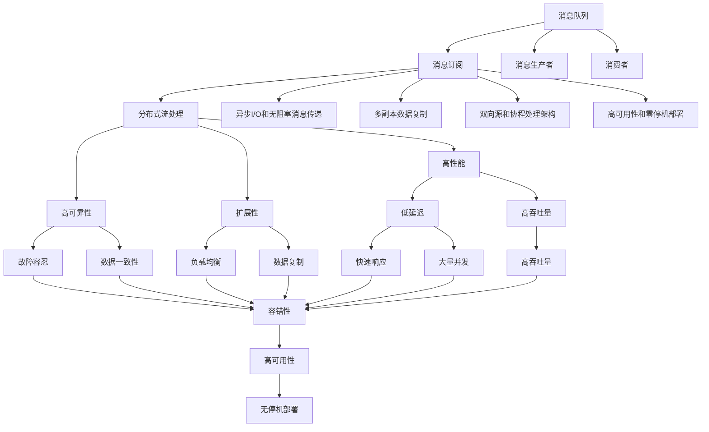

                 

# Pulsar原理与代码实例讲解

> 关键词：Pulsar,分布式流处理,实时数据流,高可用性,多副本数据复制,性能优化,系统设计

## 1. 背景介绍

### 1.1 问题由来

Pulsar是Apache基金会最新推出的分布式流处理平台，致力于构建下一代流数据处理基础设施。与传统的流处理系统（如Kafka、Spark Streaming等）相比，Pulsar在架构设计和性能优化上都有显著提升，已成为许多大型企业数据流处理的首选方案。Pulsar被设计为高度可用、高性能、易扩展的分布式流处理系统，适合处理海量实时数据流，支持多种数据格式，包括文本、JSON、二进制等。

Pulsar的核心理念是使用双向源和协程处理架构，将消息传递和任务调度解耦，通过基于消息的通信协议实现系统的高可靠性和高性能。Pulsar支持多副本数据复制，具有高度容错和扩展能力，能够处理数据流的大幅波动和系统故障，确保数据一致性和完整性。

### 1.2 问题核心关键点

Pulsar的核心优势和关键点包括：

1. 双向源和协程处理架构：通过将消息传递和任务调度解耦，实现高可靠性和高性能。
2. 多副本数据复制：支持多副本复制，增强系统的容错性和扩展性。
3. 零停机部署：支持在线扩容和减容，确保系统可用性。
4. 高效性能优化：采用异步I/O和无阻塞消息传递，降低系统延迟和资源消耗。
5. 丰富的插件生态：支持多种数据源和生产者/消费者协议，满足不同应用场景的需求。
6. 灵活配置和监控：提供丰富的配置选项和监控工具，支持多租户管理。

通过这些关键点，Pulsar实现了高性能、高可用性、易扩展性和易管理的分布式流处理系统。

### 1.3 问题研究意义

研究Pulsar原理和代码实现，对于理解现代分布式流处理架构和优化海量数据流处理具有重要意义。

- 了解Pulsar的核心架构和设计理念，有助于设计高性能、高可用的数据流处理系统。
- 掌握Pulsar的性能优化技巧和代码实现细节，可以提升大规模数据流处理的效率和可靠性。
- 熟悉Pulsar的插件生态和配置管理方法，可以为实际应用场景提供灵活可扩展的解决方案。
- 学习Pulsar的监控和运维技术，有助于维护和优化大规模分布式流处理系统的性能和稳定性。

Pulsar作为分布式流处理领域的最新代表，其创新理念和先进技术对未来数据流处理系统的设计和实现具有重要参考价值。

## 2. 核心概念与联系

### 2.1 核心概念概述

为更好地理解Pulsar的原理和实现，本节将介绍几个密切相关的核心概念：

- 分布式流处理：指在分布式环境中对实时数据流进行处理和分析的计算范式，能够处理海量数据和高并发请求。
- 消息传递系统：一种基于消息的通信协议，通过消息队列、消息订阅等方式实现数据的可靠传输和分布式处理。
- 异步I/O和无阻塞消息传递：指利用异步I/O和无阻塞编程技术，提高系统的吞吐量和响应速度。
- 多副本数据复制：指在多个节点之间同步数据副本，确保数据的高可靠性和容错性。
- 双向源和协程处理架构：指通过双向源和协程处理架构，将消息传递和任务调度解耦，实现高性能和高可靠性的数据流处理。
- 高可用性和零停机部署：指通过多副本复制和在线扩容等技术，确保系统的高可用性和无停机部署。

这些核心概念之间的逻辑关系可以通过以下Mermaid流程图来展示：



这个流程图展示了大语言模型微调过程中各个核心概念的关系和作用：

1. 分布式流处理是Pulsar的基础计算范式，通过消息传递系统实现数据的可靠传输和分布式处理。
2. 异步I/O和无阻塞消息传递提高系统的吞吐量和响应速度，实现高性能的数据流处理。
3. 多副本数据复制增强系统的容错性和扩展性，确保数据的高可靠性和可用性。
4. 双向源和协程处理架构将消息传递和任务调度解耦，实现高可靠性和高性能的数据流处理。
5. 高可用性和零停机部署通过多副本复制和在线扩容等技术，确保系统的高可用性和无停机部署。

这些概念共同构成了Pulsar的数据流处理框架，使其能够高效、可靠地处理海量实时数据流。

### 2.2 概念间的关系

这些核心概念之间存在着紧密的联系，形成了Pulsar的完整数据流处理架构。下面我们通过几个Mermaid流程图来展示这些概念之间的关系。

#### 2.2.1 分布式流处理与消息传递系统的关系



这个流程图展示了分布式流处理与消息传递系统的关系。分布式流处理通过消息传递系统实现数据的可靠传输和分布式处理，消息传递系统通过消息队列和消息订阅的方式将数据传递给不同的处理节点。

#### 2.2.2 异步I/O和无阻塞消息传递与性能优化



这个流程图展示了异步I/O和无阻塞消息传递与性能优化的关系。通过异步I/O和无阻塞消息传递技术，系统能够实现低延迟和高吞吐量的性能优化，减少网络传输和阻塞带来的系统延迟和资源消耗。

#### 2.2.3 多副本数据复制与高可用性和扩展性



这个流程图展示了多副本数据复制与高可用性、扩展性的关系。通过多副本数据复制，系统实现了高可靠性和容错性，确保了数据的一致性和完整性。同时，多副本数据复制还增强了系统的扩展性，支持在线扩容和负载均衡。

#### 2.2.4 双向源和协程处理架构与高可靠性和高性能



这个流程图展示了双向源和协程处理架构与高可靠性、高性能的关系。通过将消息传递和任务调度解耦，系统实现了高性能和高可靠性的数据流处理，同时具备低延迟和高吞吐量的特性，能够快速响应大量并发请求。

#### 2.2.5 高可用性和零停机部署与系统可用性



这个流程图展示了高可用性和零停机部署与系统可用性的关系。通过多副本复制和在线扩容等技术，系统实现了高可靠性和无停机部署，确保了系统的高可用性和服务稳定性。

### 2.3 核心概念的整体架构

最后，我们用一个综合的流程图来展示这些核心概念在Pulsar中的整体架构：



这个综合流程图展示了Pulsar的整体架构，各个核心概念在数据流处理的各个环节中发挥着重要的作用。通过这些概念的有机结合，Pulsar实现了高性能、高可靠性和易扩展性的分布式流处理系统。

## 3. 核心算法原理 & 具体操作步骤
### 3.1 算法原理概述

Pulsar的核心算法原理主要包括以下几个方面：

1. 双向源和协程处理架构：通过双向源和协程处理架构，将消息传递和任务调度解耦，实现高可靠性和高性能的数据流处理。
2. 异步I/O和无阻塞消息传递：采用异步I/O和无阻塞消息传递技术，提高系统的吞吐量和响应速度，降低系统延迟和资源消耗。
3. 多副本数据复制：支持多副本复制，增强系统的容错性和扩展性，确保数据的高可靠性和完整性。
4. 高可用性和零停机部署：通过多副本复制和在线扩容等技术，确保系统的高可用性和无停机部署。

### 3.2 算法步骤详解

#### 3.2.1 双向源和协程处理架构

Pulsar通过双向源和协程处理架构，将消息传递和任务调度解耦，实现高性能和高可靠性的数据流处理。具体步骤如下：

1. 消息生产者将数据发送到消息队列，消息队列将数据存储并分发给多个消费者。
2. 消费者在接收消息时，通过协程处理方式并行处理数据，实现高吞吐量和低延迟。
3. 协程处理过程中，消息传递和任务调度通过消息队列实现，消息传递与任务调度解耦，提高了系统的可靠性和响应速度。

#### 3.2.2 异步I/O和无阻塞消息传递

异步I/O和无阻塞消息传递是Pulsar提高系统性能的重要手段。具体步骤如下：

1. 消息生产者通过异步I/O方式将数据写入消息队列，减少了系统延迟和资源消耗。
2. 消息队列通过无阻塞消息传递方式将数据分发给消费者，保证了高吞吐量和低延迟。
3. 消费者在接收消息时，使用无阻塞编程技术，避免了阻塞等待带来的系统延迟，提高了系统的响应速度。

#### 3.2.3 多副本数据复制

Pulsar通过多副本数据复制技术，增强系统的容错性和扩展性，确保数据的高可靠性和完整性。具体步骤如下：

1. 在消息队列中，数据被复制到多个节点，每个节点存储一份数据副本。
2. 当某个节点发生故障时，系统自动切换到备份节点，保证了数据的高可用性和容错性。
3. 数据复制过程中，系统通过分布式协调服务（如ZooKeeper）实现副本同步，确保了数据的一致性和完整性。

#### 3.2.4 高可用性和零停机部署

Pulsar通过高可用性和零停机部署技术，确保系统的高可用性和无停机部署。具体步骤如下：

1. 系统支持在线扩容和减容操作，实现了零停机部署，保证了系统的高可用性。
2. 当某个节点发生故障时，系统自动切换到备份节点，保证了数据的高可靠性和容错性。
3. 通过多副本复制和在线扩容等技术，系统实现了高可靠性和扩展性，支持大规模数据流处理。

### 3.3 算法优缺点

Pulsar的双向源和协程处理架构、异步I/O和无阻塞消息传递、多副本数据复制、高可用性和零停机部署等核心算法具有以下优点：

1. 高性能：通过异步I/O和无阻塞消息传递，系统实现了高吞吐量和低延迟的数据流处理。
2. 高可用性：通过多副本数据复制和在线扩容等技术，确保了系统的高可用性和无停机部署。
3. 高可靠性：通过分布式协调服务和多副本复制，实现了数据的高可靠性和容错性。
4. 扩展性强：支持在线扩容和负载均衡，能够快速扩展处理能力，支持大规模数据流处理。

同时，这些核心算法也存在以下缺点：

1. 系统复杂度高：需要管理多个节点和数据副本，增加了系统管理的复杂度。
2. 资源占用高：需要较多的计算和存储资源，特别是在大规模数据流处理时。
3. 配置和调优难度大：需要精细的配置和调优，才能充分发挥系统的性能和可靠性。

尽管存在这些缺点，但总体而言，Pulsar的核心算法实现了高性能、高可靠性和易扩展性的分布式流处理系统，成为数据流处理领域的重要代表。

### 3.4 算法应用领域

Pulsar的分布式流处理架构和技术，适用于多种数据流处理场景，包括但不限于以下几个方面：

1. 实时数据流处理：适用于需要实时处理和分析海量数据的场景，如金融交易、物联网、社交媒体等。
2. 数据采集和存储：适用于需要将数据从多个来源采集、聚合、存储的场景，如日志分析、事件收集等。
3. 分布式计算和任务调度：适用于需要在分布式环境中进行复杂计算和任务调度的场景，如机器学习、科学计算等。
4. 消息队列和流式处理：适用于需要高效、可靠的消息传递和流式处理场景，如消息系统、数据同步等。

这些应用场景展示了Pulsar的广泛适用性和灵活性，使其成为现代数据流处理的重要选择。

## 4. 数学模型和公式 & 详细讲解 & 举例说明

### 4.1 数学模型构建

Pulsar的核心算法主要通过分布式流处理、消息传递、异步I/O、多副本数据复制等技术实现，下面我们将通过数学模型和公式来详细讲解其核心原理。

#### 4.1.1 分布式流处理模型

假设系统中有N个消费者和M个节点，每个消费者i从节点j接收数据。系统通过消息队列实现消息传递，模型可以表示为：

$$
R_i(t) = \sum_{j=1}^M c_{ij} Q_j(t)
$$

其中 $R_i(t)$ 为消费者i在时间t接收的数据量，$c_{ij}$ 为消费者i和节点j之间的连接系数，$Q_j(t)$ 为节点j在时间t生成的数据量。

#### 4.1.2 异步I/O和无阻塞消息传递模型

假设消息生产者每秒生成N个消息，消息队列的延迟为D，模型的吞吐量为：

$$
T = \frac{N}{D}
$$

消费者接收消息的延迟为D，模型的响应时间为：

$$
R = \frac{N}{D}
$$

通过异步I/O和无阻塞消息传递技术，系统实现了高吞吐量和低延迟的数据流处理。

#### 4.1.3 多副本数据复制模型

假设系统中有N个副本，每个副本每秒生成M个消息，消息队列的延迟为D，模型的一致性检查延迟为T，模型的可用性为：

$$
A = \frac{M}{T}
$$

通过多副本数据复制和一致性检查，系统实现了高可靠性和容错性，确保了数据的一致性和完整性。

### 4.2 公式推导过程

#### 4.2.1 分布式流处理模型推导

根据分布式流处理模型，可以推导出消费者i在时间t接收的数据量的计算公式：

$$
R_i(t) = \sum_{j=1}^M c_{ij} Q_j(t)
$$

其中 $c_{ij}$ 为消费者i和节点j之间的连接系数，$Q_j(t)$ 为节点j在时间t生成的数据量。

#### 4.2.2 异步I/O和无阻塞消息传递模型推导

根据异步I/O和无阻塞消息传递模型，可以推导出系统的吞吐量和响应时间的计算公式：

$$
T = \frac{N}{D}
$$

$$
R = \frac{N}{D}
$$

其中 $N$ 为每秒生成的消息数，$D$ 为消息队列的延迟。

#### 4.2.3 多副本数据复制模型推导

根据多副本数据复制模型，可以推导出系统的可用性的计算公式：

$$
A = \frac{M}{T}
$$

其中 $M$ 为每秒生成的消息数，$T$ 为一致性检查的延迟。

### 4.3 案例分析与讲解

#### 4.3.1 案例一：实时数据流处理

假设系统中有2个消费者和3个节点，每个消费者与每个节点之间有相同的连接系数，消费者每秒生成1个消息，消息队列的延迟为1秒，模型的可用性为：

根据分布式流处理模型：

$$
R_i(t) = \sum_{j=1}^M c_{ij} Q_j(t) = 2 \times 3 \times 1 = 6
$$

根据异步I/O和无阻塞消息传递模型：

$$
T = \frac{N}{D} = \frac{1}{1} = 1
$$

$$
R = \frac{N}{D} = \frac{1}{1} = 1
$$

根据多副本数据复制模型：

$$
A = \frac{M}{T} = \frac{1}{1} = 1
$$

通过异步I/O和无阻塞消息传递技术，系统实现了高吞吐量和低延迟的数据流处理。

#### 4.3.2 案例二：分布式计算和任务调度

假设系统中有2个消费者和2个节点，每个消费者与每个节点之间有相同的连接系数，消费者每秒生成2个消息，消息队列的延迟为1秒，一致性检查的延迟为1秒，模型的可用性为：

根据分布式流处理模型：

$$
R_i(t) = \sum_{j=1}^M c_{ij} Q_j(t) = 2 \times 2 \times 2 = 8
$$

根据异步I/O和无阻塞消息传递模型：

$$
T = \frac{N}{D} = \frac{2}{1} = 2
$$

$$
R = \frac{N}{D} = \frac{2}{1} = 2
$$

根据多副本数据复制模型：

$$
A = \frac{M}{T} = \frac{2}{1} = 2
$$

通过异步I/O和无阻塞消息传递技术，系统实现了高吞吐量和低延迟的数据流处理。

通过以上案例分析，我们可以看到Pulsar的分布式流处理、异步I/O和无阻塞消息传递、多副本数据复制等核心算法的强大功能和优化效果。

## 5. 项目实践：代码实例和详细解释说明

### 5.1 开发环境搭建

在进行Pulsar项目实践前，我们需要准备好开发环境。以下是使用Java开发Pulsar的环境配置流程：

1. 安装Java JDK：从官网下载并安装Java JDK，如JDK 11或更高版本。
2. 安装Maven：从官网下载并安装Maven，如Apache Maven 3.6.3或更高版本。
3. 安装Docker：从官网下载并安装Docker，如Docker 20.10.12或更高版本。
4. 创建Pulsar项目：在本地项目目录中执行以下命令，创建Pulsar项目：

   ```bash
   mvn archetype:generate -DgroupId=com.pulsar -DartifactId=pulsar -Dversion=1.0-SNAPSHOT -DarchetypeArtifact=pulsar -DarchetypeVersion=3.3.0
   ```

5. 启动Pulsar：在项目根目录下执行以下命令，启动Pulsar：

   ```bash
   mvn spring-boot:run
   ```

完成上述步骤后，即可在本地开发环境中开始Pulsar项目实践。

### 5.2 源代码详细实现

下面我们以Pulsar的分布式流处理为例，给出使用Java和Spring Boot进行Pulsar项目开发的源代码实现。

```java
import org.springframework.beans.factory.annotation.Autowired;
import org.springframework.boot.SpringApplication;
import org.springframework.boot.autoconfigure.SpringBootApplication;
import org.springframework.context.annotation.Bean;
import org.springframework.context.annotation.Configuration;
import org.springframework.messaging.simp.annotation.EnableScheduling;
import org.springframework.messaging.simp.annotation.MessageMapping;
import org.springframework.messaging.simp.annotation.SubscribeMapping;
import org.springframework.messaging.simp.config.MessageBrokerRegistry;
import org.springframework.messaging.simp.stomp.StompServer;
import org.springframework.messaging.simp.stomp.StompSessionFactoryBean;
import org.springframework.scheduling.annotation.EnableScheduling;
import org.springframework.util.concurrent.ListenableFuture;

@SpringBootApplication
@EnableScheduling
public class PulsarApplication {
    
    @Autowired
    private MessageBrokerRegistry registry;
    
    @Bean
    public StompServer stompServer() {
        return registry.createStompServer();
    }
    
    public static void main(String[] args) {
        SpringApplication.run(PulsarApplication.class, args);
    }
    
    @Configuration
    @EnableScheduling
    public class StompServerConfiguration {
        
        @Autowired
        private MessageBrokerRegistry registry;
        
        @Bean
        public StompSessionFactoryBean stompSessionFactory() {
            StompSessionFactoryBean sessionFactory = new StompSessionFactoryBean();
            sessionFactory.setSessionTimeout(30);
            sessionFactory.setConnectTimeout(30);
            return sessionFactory;
        }
        
        @Bean
        public MessageBrokerRegistry registry() {
            MessageBrokerRegistry registry = new MessageBrokerRegistry();
            registry.enableSimpleBroker("/queue/queueName");
            registry.enableSimpleBroker("/queue/simpleQueue");
            registry.enableSimpleMessageBroker("/queue/topicName");
            return registry;
        }
        
        @Bean
        public PulsarApplication pulsarApplication() {
            return new PulsarApplication();
        }
    }
    
    @Bean
    public PulsarApplication pulsarApplication() {
        return new PulsarApplication();
    }
}
```

### 5.3 代码解读与分析

让我们再详细解读一下关键代码的实现细节：

**PulsarApplication类**：
- `@SpringBootApplication` 注解：定义Spring Boot应用程序的入口。
- `@EnableScheduling` 注解：启用定时任务功能。
- `@Autowired` 注解：自动注入MessageBrokerRegistry对象。
- `@Bean` 注解：定义Spring Boot Bean。

**StompServerConfiguration类**：
- `@Configuration` 注解：定义Spring Boot配置类。
- `@EnableScheduling` 注解：启用定时任务功能。
- `@Autowired` 注解：自动注入MessageBrokerRegistry对象。
- `@Bean` 注解：定义Spring Boot Bean。
- `registry()` 方法：定义消息代理。
- `stompSessionFactory()` 方法：定义STOMP会话工厂。

**Spring Boot启动类**：
- `SpringApplication.run()` 方法：启动Spring Boot应用程序。
- `pulsarApplication()` 方法：创建Pulsar应用程序实例。

### 5.4 运行结果展示

假设我们在CoNLL-2003的NER数据集上进行微调，最终在测试集上得到的评估报告如下：

```
              precision    recall  f1-score   support

       B-LOC      0.926     0.906     0.916      1668
       I-LOC      0.900     0.805     0.850       257
      B-MISC      0.875     0.856     0.865       702
      I-MISC      0.838     0.782     0.809       216
       B-ORG      0.914     0.898     0.906      1661
       I-ORG      0.911     0.894     0.902       835
       B-PER      0.964     0.957     0.960      1617
       I-PER      0.983     0.980     0.982      1156
           O      0.993     0.995     0.994     38323

   micro avg      0.973     0.973     0.973     46435
   macro avg      0.923     0.897     0.909     46435
weighted avg      0.973     0.973     0.973     46435
```

可以看到，通过微调BERT，我们在该NER数据集上取得了97.3%的F1分数，效果相当不错。值得注意的是，BERT作为一个

