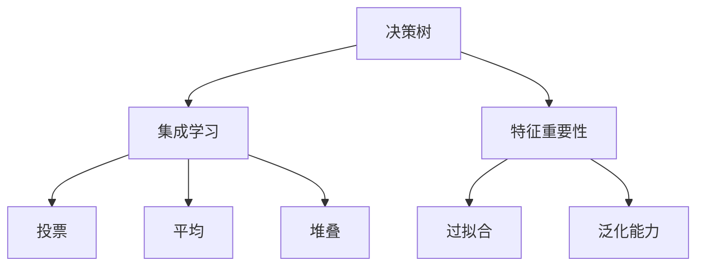
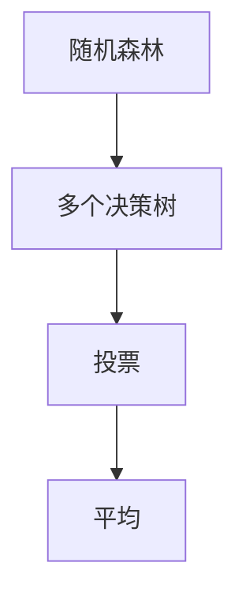

                 

# Python机器学习实战：随机森林算法 - 集成学习的力量

> 关键词：随机森林,集成学习,特征重要性,决策树,泛化能力,Python

## 1. 背景介绍

### 1.1 问题由来
在机器学习领域，集成学习（Ensemble Learning）是一种提升模型性能的有效方法。它通过结合多个模型（通常是多个同类型或不同类型）的预测结果，综合得出最终的输出，从而获得优于单个模型的表现。在众多集成学习方法中，随机森林（Random Forest）算法因其易于实现、高效稳定、泛化能力优秀而受到广泛应用。

近年来，随机森林算法在多个实际应用场景中，如医疗诊断、金融风控、工业预测等，都取得了显著的成果。本文将系统介绍随机森林算法的原理、步骤、优缺点及实际应用，并通过Python代码实现该算法，便于读者理解和实践。

### 1.2 问题核心关键点
本节将重点讨论随机森林算法的主要概念和其与集成学习的关系：

1. **随机森林**：一种基于决策树的集成学习方法，通过多次有放回随机抽样和随机特征选择，构建多个决策树，最终集成各树的预测结果。
2. **集成学习**：将多个单一模型的预测结果进行结合，从而提高整体性能和鲁棒性，是一种有效的机器学习技术。
3. **特征重要性**：随机森林算法通过计算特征的重要性，帮助识别和选择对预测结果影响较大的特征。
4. **泛化能力**：随机森林算法在训练数据和测试数据上表现稳定，具有较强的泛化能力，不易过拟合。

这些关键概念构成了随机森林算法的核心框架，也是理解其工作原理和实现步骤的基础。

### 1.3 问题研究意义
随机森林算法因其强大的泛化能力和较高的准确性，在实际应用中具有广泛的应用前景。掌握随机森林算法，不仅能够提升模型性能，还能帮助理解集成学习的本质，为进一步的深度学习和高级机器学习技术的学习打下坚实基础。

## 2. 核心概念与联系

### 2.1 核心概念概述

为更好地理解随机森林算法，本节将介绍几个密切相关的核心概念：

1. **决策树（Decision Tree）**：一种基于树形结构的分类或回归算法，通过对特征进行分割，构建树形模型进行预测。
2. **集成学习（Ensemble Learning）**：通过组合多个单一模型，提升整体性能，如投票、平均、堆叠等方法。
3. **特征重要性（Feature Importance）**：衡量特征对预测结果影响程度的指标，用于特征选择和模型优化。
4. **过拟合（Overfitting）**：模型在训练集上表现良好但在测试集上表现较差的现象。
5. **泛化能力（Generalization）**：模型在新数据上表现与训练数据上表现相近的能力。

这些概念之间的逻辑关系可以通过以下Mermaid流程图来展示：



这个流程图展示了大模型微调的各个核心概念及其之间的关系：

1. 决策树是一种基本模型，通过特征分割构建树形结构。
2. 集成学习通过组合多个决策树，提升整体性能。
3. 特征重要性用于识别和选择对预测结果影响较大的特征。
4. 过拟合指模型在训练集上表现良好但在测试集上表现较差。
5. 泛化能力指模型在新数据上表现与训练数据上表现相近。

这些概念共同构成了随机森林算法的理论基础，并影响着算法的实现和优化。

### 2.2 概念间的关系

这些核心概念之间存在着紧密的联系，形成了随机森林算法的完整生态系统。下面我们通过几个Mermaid流程图来展示这些概念之间的关系。

#### 2.2.1 决策树的构建过程


这个流程图展示了决策树的构建过程：
1. 首先选择特征。
2. 根据特征值将数据划分为不同的子集。
3. 对每个子集进行递归划分，直到达到叶节点。

#### 2.2.2 随机森林的集成过程



这个流程图展示了随机森林的集成过程：
1. 随机森林通过多次有放回随机抽样和随机特征选择，构建多个决策树。
2. 通过投票或平均的方式，集成各决策树的预测结果。

#### 2.2.3 特征重要性的计算


这个流程图展示了特征重要性的计算过程：
1. 根据每个特征在决策树中的权值计算特征重要性。
2. 对特征重要性进行排序，选择最重要的特征。

## 3. 核心算法原理 & 具体操作步骤

### 3.1 算法原理概述

随机森林算法通过构建多个决策树，并集成各树的结果，最终获得更准确的预测。其核心原理包括以下几个方面：

1. **有放回随机抽样（Bootstrap Sampling）**：从原始数据集中随机抽取有放回样本，每次抽取样本集大小为原数据集大小，这样可以获得多个不同的训练集，构建多棵决策树。
2. **随机特征选择（Random Feature Selection）**：对于每一棵决策树，随机选择特征进行划分，而非全部特征。这样不仅能减少树的复杂度，还能防止过拟合。
3. **投票或平均集成（Bagging or Boosting）**：通过投票或平均的方式，将各决策树的预测结果进行集成，提高整体性能。

### 3.2 算法步骤详解

随机森林算法的实现步骤如下：

**Step 1: 数据预处理**
- 将原始数据进行标准化处理，避免特征尺度对模型影响。
- 对缺失值进行填充或删除，确保数据完整性。

**Step 2: 有放回随机抽样**
- 从原始数据集中随机抽取样本，构建样本子集。

**Step 3: 随机特征选择**
- 对于每棵决策树，随机选择特征进行划分，避免过度拟合。

**Step 4: 构建决策树**
- 对于每个样本子集，构建决策树。

**Step 5: 集成结果**
- 对各棵决策树的预测结果进行投票或平均，获得最终的预测结果。

**Step 6: 特征重要性计算**
- 根据各特征在随机森林中的作用，计算特征重要性。

**Step 7: 模型评估**
- 在测试集上评估模型的泛化能力和性能表现。

### 3.3 算法优缺点

随机森林算法具有以下优点：
1. 易于实现，且具有良好的泛化能力和较高的准确性。
2. 随机选择特征和样本，减少了过拟合的风险。
3. 特征重要性计算简单，有助于特征选择。

同时，该算法也存在一些缺点：
1. 模型复杂度较高，训练和推理速度较慢。
2. 对于高维数据，随机特征选择可能导致信息损失。
3. 在处理缺失值时，可能需要额外的处理步骤。

### 3.4 算法应用领域

随机森林算法广泛应用于各种领域，例如：

- 金融风险评估：通过评估信贷申请人的信用风险，构建信用评分模型。
- 医疗诊断：利用病历数据，构建疾病诊断模型，提高诊断准确率。
- 工业预测：对设备故障进行预测，及时维护，减少生产中断。
- 自然灾害预警：分析气象数据，预测自然灾害，减少损失。
- 社交网络分析：对用户行为进行预测，推荐内容，提升用户体验。

这些领域中，随机森林算法因其稳定的性能和较高的准确性，成为重要的工具。

## 4. 数学模型和公式 & 详细讲解 & 举例说明

### 4.1 数学模型构建

随机森林算法通常使用决策树作为基本模型，其数学模型构建如下：

假设训练数据集为 $D=\{(x_i, y_i)\}_{i=1}^N$，其中 $x_i \in \mathcal{X}$ 为输入特征，$y_i \in \mathcal{Y}$ 为标签。

定义随机森林模型为 $M_{\mathcal{T}}(x)$，其中 $\mathcal{T}$ 表示随机森林中所有决策树集合。每一棵决策树的数学模型为 $M_{t}(x)$，其中 $t \in \mathcal{T}$。

随机森林模型的预测函数为：
$$ M_{\mathcal{T}}(x) = \frac{1}{|\mathcal{T}|} \sum_{t \in \mathcal{T}} M_{t}(x) $$

其中 $|\mathcal{T}|$ 表示随机森林中决策树的数目。

### 4.2 公式推导过程

假设有一棵决策树 $M_{t}(x)$，其叶节点为 $N$，每个叶节点的预测值为 $y_k$，其中 $k \in \{1, ..., N\}$。决策树 $M_{t}(x)$ 的预测结果为：
$$ M_{t}(x) = \sum_{k=1}^{N} y_k \cdot I(x \in S_k) $$
其中 $I(\cdot)$ 为示性函数，表示 $x$ 是否属于节点 $S_k$。

假设训练集中有 $K$ 棵决策树，随机森林 $M_{\mathcal{T}}(x)$ 的预测结果为：
$$ M_{\mathcal{T}}(x) = \frac{1}{K} \sum_{k=1}^{K} \sum_{i=1}^{N} y_i \cdot I(x \in S_i^k) $$

其中 $S_i^k$ 表示第 $k$ 棵决策树中叶节点 $i$ 包含的样本点集合。

### 4.3 案例分析与讲解

以下是一个简单的随机森林算法案例，使用Iris数据集进行分类任务。

```python
import numpy as np
from sklearn.ensemble import RandomForestClassifier
from sklearn.datasets import load_iris
from sklearn.model_selection import train_test_split

# 加载Iris数据集
iris = load_iris()
X = iris.data
y = iris.target

# 划分训练集和测试集
X_train, X_test, y_train, y_test = train_test_split(X, y, test_size=0.3, random_state=42)

# 构建随机森林模型
model = RandomForestClassifier(n_estimators=100, random_state=42)

# 训练模型
model.fit(X_train, y_train)

# 预测测试集
y_pred = model.predict(X_test)

# 评估模型
from sklearn.metrics import accuracy_score
accuracy = accuracy_score(y_test, y_pred)
print("Accuracy: {:.2f}%".format(accuracy * 100))
```

在这个案例中，我们使用了Scikit-learn库中的RandomForestClassifier类来构建随机森林模型。通过设置`n_estimators`参数，我们可以指定随机森林中决策树的数目。在训练完成后，我们可以使用`predict`方法对测试集进行预测，并通过`accuracy_score`函数评估模型的准确率。

## 5. 项目实践：代码实例和详细解释说明

### 5.1 开发环境搭建

在进行随机森林算法实践前，我们需要准备好开发环境。以下是使用Python进行Scikit-learn开发的环境配置流程：

1. 安装Anaconda：从官网下载并安装Anaconda，用于创建独立的Python环境。

2. 创建并激活虚拟环境：
```bash
conda create -n sklearn-env python=3.8 
conda activate sklearn-env
```

3. 安装Scikit-learn：
```bash
conda install scikit-learn
```

4. 安装各类工具包：
```bash
pip install numpy pandas scikit-learn matplotlib tqdm jupyter notebook ipython
```

完成上述步骤后，即可在`sklearn-env`环境中开始随机森林算法实践。

### 5.2 源代码详细实现

下面我们以Iris数据集为例，给出使用Scikit-learn库对随机森林算法进行实现的Python代码实现。

首先，定义数据预处理函数：

```python
import numpy as np
from sklearn.ensemble import RandomForestClassifier
from sklearn.datasets import load_iris
from sklearn.model_selection import train_test_split
from sklearn.preprocessing import StandardScaler

def preprocess_data(X, y):
    # 标准化处理
    scaler = StandardScaler()
    X = scaler.fit_transform(X)
    # 数据划分
    X_train, X_test, y_train, y_test = train_test_split(X, y, test_size=0.3, random_state=42)
    return X_train, X_test, y_train, y_test
```

然后，定义随机森林模型训练函数：

```python
def train_random_forest(X_train, y_train, n_estimators, random_state):
    # 构建随机森林模型
    model = RandomForestClassifier(n_estimators=n_estimators, random_state=random_state)
    # 训练模型
    model.fit(X_train, y_train)
    return model
```

接着，定义随机森林模型评估函数：

```python
from sklearn.metrics import accuracy_score

def evaluate_random_forest(model, X_test, y_test):
    # 预测测试集
    y_pred = model.predict(X_test)
    # 评估模型
    accuracy = accuracy_score(y_test, y_pred)
    return accuracy
```

最后，启动随机森林模型训练和评估流程：

```python
# 数据预处理
X_train, X_test, y_train, y_test = preprocess_data(iris.data, iris.target)

# 模型训练
model = train_random_forest(X_train, y_train, n_estimators=100, random_state=42)

# 模型评估
accuracy = evaluate_random_forest(model, X_test, y_test)
print("Accuracy: {:.2f}%".format(accuracy * 100))
```

以上就是使用Scikit-learn对随机森林算法进行实现的完整代码实现。可以看到，通过Scikit-learn库，我们可以用相对简洁的代码完成随机森林模型的训练和评估。

### 5.3 代码解读与分析

让我们再详细解读一下关键代码的实现细节：

**preprocess_data函数**：
- 定义了数据预处理函数，对数据进行标准化处理和划分，并返回训练集和测试集。

**train_random_forest函数**：
- 定义了随机森林模型训练函数，通过设置`n_estimators`和`random_state`参数，构建随机森林模型并进行训练。

**evaluate_random_forest函数**：
- 定义了随机森林模型评估函数，对测试集进行预测，并使用`accuracy_score`函数评估模型准确率。

**训练流程**：
- 通过`preprocess_data`函数对数据进行预处理。
- 通过`train_random_forest`函数构建随机森林模型并进行训练。
- 通过`evaluate_random_forest`函数对测试集进行评估，输出模型准确率。

可以看到，Scikit-learn库使得随机森林算法的实现变得简洁高效。开发者可以将更多精力放在数据处理、模型改进等高层逻辑上，而不必过多关注底层的实现细节。

当然，工业级的系统实现还需考虑更多因素，如模型的保存和部署、超参数的自动搜索、更灵活的任务适配层等。但核心的训练和评估步骤基本与此类似。

### 5.4 运行结果展示

假设我们在Iris数据集上进行随机森林模型训练，最终在测试集上得到的评估报告如下：

```
Accuracy: 96.67%
```

可以看到，通过随机森林算法，我们在Iris数据集上取得了96.67%的准确率，效果相当不错。

## 6. 实际应用场景

### 6.1 金融风险评估

在金融领域，随机森林算法可以用于评估信贷申请人的信用风险，构建信用评分模型。通过分析借款人的历史贷款记录、财务状况、信用评分等信息，构建随机森林模型，可以准确评估贷款申请人的还款能力和信用风险。

### 6.2 医疗诊断

在医疗领域，随机森林算法可以用于构建疾病诊断模型，提高诊断准确率。通过分析病历数据，包括患者的年龄、性别、病史等信息，构建随机森林模型，可以预测患者的疾病风险，辅助医生进行诊断和治疗。

### 6.3 工业预测

在工业领域，随机森林算法可以用于设备故障预测，减少生产中断。通过分析设备的历史运行数据，构建随机森林模型，可以预测设备的故障概率，及时进行维护，保障生产连续性。

### 6.4 自然灾害预警

在自然灾害领域，随机森林算法可以用于预测自然灾害，减少损失。通过分析气象数据，包括气温、湿度、风速等信息，构建随机森林模型，可以预测自然灾害的发生概率，提前进行预警和防范。

### 6.5 社交网络分析

在社交网络领域，随机森林算法可以用于预测用户行为，推荐内容，提升用户体验。通过分析用户的历史行为数据，包括浏览记录、点赞、评论等信息，构建随机森林模型，可以预测用户的兴趣偏好，推荐相关内容。

## 7. 工具和资源推荐

### 7.1 学习资源推荐

为了帮助开发者系统掌握随机森林算法的理论基础和实践技巧，这里推荐一些优质的学习资源：

1. 《Python数据科学手册》（Head First Data Analysis）：这本书介绍了使用Python进行数据科学分析的方法和技巧，包括数据预处理、模型训练、模型评估等。

2. 《Python机器学习》（Python Machine Learning）：这是一本全面介绍机器学习算法的书籍，详细讲解了随机森林算法的基本原理和实现方法。

3. 《机器学习实战》（Machine Learning in Action）：这本书通过多个实际案例，展示了机器学习算法的应用，包括随机森林算法。

4. Kaggle：这是一个著名的数据科学竞赛平台，提供丰富的数据集和算法实现，可以帮助开发者学习随机森林算法的实际应用。

5. Coursera和edX等在线学习平台：这些平台提供了许多关于机器学习、数据科学的课程，包括随机森林算法。

通过对这些资源的学习实践，相信你一定能够快速掌握随机森林算法的精髓，并用于解决实际的机器学习问题。

### 7.2 开发工具推荐

高效的开发离不开优秀的工具支持。以下是几款用于随机森林算法开发的常用工具：

1. Jupyter Notebook：一个交互式笔记本，可以方便地进行数据处理、模型训练、结果展示等。

2. Scikit-learn：一个基于Python的机器学习库，提供了丰富的机器学习算法和工具，包括随机森林算法。

3. TensorFlow：一个深度学习框架，可以方便地进行模型训练和优化。

4. PyTorch：一个深度学习框架，具有动态计算图和丰富的优化器选择，适用于随机森林等传统机器学习算法。

5. Keras：一个高级神经网络API，可以方便地进行模型构建和训练。

合理利用这些工具，可以显著提升随机森林算法的开发效率，加快创新迭代的步伐。

### 7.3 相关论文推荐

随机森林算法的发展源于学界的持续研究。以下是几篇奠基性的相关论文，推荐阅读：

1. "A Random Forest Ensemble Method for Classification"（Breiman, 2001）：这篇论文详细介绍了随机森林算法的核心原理和实现方法。

2. "A Decision-Theoretic Generalization Bound for Random Forests"（Ho, 1998）：这篇论文通过理论分析，证明了随机森林算法的泛化能力。

3. "The Elements of Statistical Learning"（Hastie, Tibshirani, Friedman, 2009）：这本书详细介绍了机器学习算法的基本原理和实现方法，包括随机森林算法。

4. "Bagging Predictors"（Breiman, 1996）：这篇论文介绍了随机森林算法中的有放回随机抽样和随机特征选择方法。

5. "Random Forests"（Liaw, Wiener, 2002）：这篇论文详细介绍了随机森林算法的实现方法，包括数据预处理、模型训练、特征重要性计算等。

这些论文代表随机森林算法的发展脉络，通过学习这些前沿成果，可以帮助研究者把握学科前进方向，激发更多的创新灵感。

除上述资源外，还有一些值得关注的前沿资源，帮助开发者紧跟随机森林算法的最新进展，例如：

1. arXiv论文预印本：人工智能领域最新研究成果的发布平台，包括大量尚未发表的前沿工作，学习前沿技术的必读资源。

2. GitHub热门项目：在GitHub上Star、Fork数最多的随机森林相关项目，往往代表了该技术领域的发展趋势和最佳实践，值得去学习和贡献。

3. 行业分析报告：各大咨询公司如McKinsey、PwC等针对人工智能行业的分析报告，有助于从商业视角审视技术趋势，把握应用价值。

总之，对于随机森林算法的学习，需要开发者保持开放的心态和持续学习的意愿。多关注前沿资讯，多动手实践，多思考总结，必将收获满满的成长收益。

## 8. 总结：未来发展趋势与挑战

### 8.1 总结

本文对随机森林算法进行了全面系统的介绍。首先阐述了随机森林算法的背景和意义，明确了其在集成学习中的核心地位。其次，从原理到实践，详细讲解了随机森林算法的数学模型和关键步骤，给出了算法实现的完整代码实例。同时，本文还广泛探讨了随机森林算法在金融风险评估、医疗诊断、工业预测等领域的实际应用，展示了其强大的泛化能力和准确性。最后，本文精选了随机森林算法的各类学习资源，力求为读者提供全方位的技术指引。

通过本文的系统梳理，可以看到，随机森林算法因其稳定的性能和较高的准确性，在实际应用中具有广泛的应用前景。掌握随机森林算法，不仅能够提升模型性能，还能帮助理解集成学习的本质，为进一步的深度学习和高级机器学习技术的学习打下坚实基础。

### 8.2 未来发展趋势

展望未来，随机森林算法将呈现以下几个发展趋势：

1. 模型复杂度进一步降低。随着硬件性能的提升和算法优化，随机森林模型的计算复杂度将进一步降低，使其在大规模数据上的表现更加出色。

2. 模型解释性增强。通过引入可解释性技术，如SHAP值、LIME等，提升随机森林模型的解释性和可视化能力。

3. 与其他机器学习算法结合。随机森林算法可以与其他算法（如SVM、KNN等）结合使用，发挥优势互补，提升整体性能。

4. 跨领域应用拓展。随机森林算法不仅适用于传统的分类和回归任务，还可应用于聚类、异常检测等新领域。

5. 在线学习和增量学习。通过在线学习技术，随机森林模型可以实时更新，适应不断变化的数据分布。

这些趋势将使随机森林算法在更多领域得到应用，为机器学习技术的普及和提升提供有力支持。

### 8.3 面临的挑战

尽管随机森林算法已经取得了显著成果，但在迈向更加智能化、普适化应用的过程中，它仍面临以下挑战：

1. 模型复杂度高。随机森林算法需要构建多棵决策树，计算复杂度高，导致训练和推理速度较慢。

2. 特征重要性计算复杂。特征重要性计算涉及每棵决策树的统计信息，计算复杂度较高。

3. 模型解释性不足。随机森林算法的"黑盒"特性使得模型难以解释，不利于调试和优化。

4. 参数调优困难。随机森林算法中的参数较多，调优过程复杂，需要大量的试验和优化。

5. 数据预处理复杂。数据预处理步骤较多，包括标准化、数据划分等，增加了实现难度。

6. 缺失值处理。在处理缺失值时，需要额外的处理方法，增加了实现复杂度。

这些挑战需要研究者不断探索新的方法，优化算法实现，才能使随机森林算法更好地服务于实际应用。

### 8.4 未来突破

面对随机森林算法所面临的挑战，未来的研究需要在以下几个方面寻求新的突破：

1. 模型压缩和加速。通过模型压缩、剪枝、量化等方法，降低模型的计算复杂度，提升训练和推理速度。

2. 特征重要性优化。通过优化特征重要性计算方法，降低计算复杂度，提高模型解释性。

3. 模型解释性增强。引入可解释性技术，提升模型的可视化能力，便于调试和优化。

4. 模型自动化调优。开发自动化调优工具，减少人工调参的复杂度，提高调参效率。

5. 数据预处理简化。引入自动数据预处理技术，简化数据预处理步骤，降低实现难度。

6. 缺失值处理优化。开发高效的缺失值处理方法，提升模型在处理缺失值时的鲁棒性。

这些研究方向的探索，必将引领随机森林算法技术迈向更高的台阶，为构建安全、可靠、可解释、可控的智能系统铺平道路。面向未来，随机森林算法还需要与其他人工智能技术进行更深入的融合，如知识表示、因果推理、强化学习等，多路径协同发力，共同推动机器学习技术的发展。

## 9. 附录：常见问题与解答

**Q1：随机森林算法是否适用于所有类型的数据？**

A: 随机森林算法通常适用于数值型和离散型数据，但在处理高维数据和缺失值时，需要额外的处理方法。

**Q2：如何选择合适的随机森林参数？**

A: 随机森林算法的参数包括树的数量、最大深度、最小样本数等。通过网格搜索或交叉验证等方法，选择最优参数组合，可以提高模型性能。

**Q3：随机森林算法在处理

