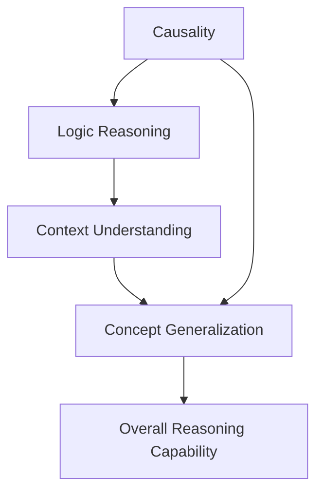

                 

## 1. 背景介绍

### 1.1 问题由来
在深度学习技术的加持下，大语言模型（Large Language Model，LLMs）在自然语言处理（NLP）领域取得了显著的进步。模型通过在海量无标签文本上预训练学习，具有强大的语言理解和生成能力，被广泛应用于翻译、问答、摘要生成等任务，取得了卓越的成果。

然而，尽管大模型在自然语言理解方面表现出强大的能力，它们在推理能力上仍存在一定的局限。大模型往往缺乏精确的因果关系推断能力，以及逻辑连贯性，常常在面对复杂的推理任务时显得力不从心。

### 1.2 问题核心关键点
大模型推理障碍主要体现在以下几个方面：

- **因果关系理解不足**：大模型在推理时难以准确理解事件之间的因果关系，导致预测结果缺乏逻辑连贯性。
- **逻辑推理能力弱**：模型在执行逻辑推理任务时，容易受到输入噪声和不确定性的干扰，输出结果往往与事实不符。
- **上下文理解局限**：模型难以在长文本中准确理解和保持上下文信息，影响推理过程中的信息整合和因果关系推断。
- **概念泛化能力差**：模型在处理新概念和新情境时，往往不能泛化已学习的知识，无法灵活运用。

这些问题严重影响了大模型在需要推理和逻辑推断的NLP任务中的表现，制约了其在更多实际应用场景中的应用。

### 1.3 问题研究意义
研究大模型的推理障碍及其解决方法，对于提升模型的逻辑推理和因果推断能力，使其更好地适应复杂的实际应用场景，具有重要意义：

1. **提高模型性能**：解决推理障碍能够显著提高模型在逻辑推理和因果推断任务中的表现，提升模型整体性能。
2. **拓展应用领域**：推理能力强的模型可以应用于更多需要逻辑推断和因果关系的NLP任务，如法律文书、财务分析等，拓展应用场景。
3. **增强信任度**：推理能力强的模型输出结果更加可靠，能够增强用户和开发者对模型结果的信任度。
4. **促进学科融合**：解决推理障碍有助于推动计算机科学和人工智能与哲学、认知科学等学科的交叉融合，提供更丰富的理论支持。

## 2. 核心概念与联系

### 2.1 核心概念概述

为更好地理解大模型的推理障碍，本节将介绍几个核心概念及其相互关系：

- **因果关系**：指事件之间引起和被引起的关系。因果关系推断涉及识别和理解这些关系，并进行合理推断。
- **逻辑推理**：指根据已有的事实和规则进行推理，得出合理结论的过程。逻辑推理能力强的模型能够从数据中提取和利用逻辑结构。
- **上下文理解**：指模型在处理长文本时，能够准确理解并保持前后文信息，利用上下文信息辅助推理。
- **概念泛化**：指模型能够将已学习到的知识泛化到新的情境和概念上，灵活运用。

这些概念共同构成了推理能力的关键要素，理解这些概念有助于深入分析大模型的推理障碍。

### 2.2 概念间的关系

这些核心概念之间存在着紧密的联系，形成了推理能力的完整框架。我们可以通过以下Mermaid流程图来展示这些概念之间的关系：



这个流程图展示了大模型推理能力的核心概念及其相互关系：

1. 因果关系推断是逻辑推理的基础，理解因果关系是进行合理推断的前提。
2. 逻辑推理能力强的模型能够从数据中提取逻辑结构，并进行合理的推断和决策。
3. 上下文理解能力强的模型能够准确理解和保持前后文信息，辅助逻辑推理。
4. 概念泛化能力强的模型能够将已学习的知识应用到新的情境和概念上，实现灵活运用。
5. 综合上述能力，模型的整体推理能力得以提升，能够在更复杂的任务中发挥作用。

这些概念的相互关系表明，提升大模型的推理能力需要从多个维度进行优化，通过多方面的改进，才能显著提升模型的推理性能。

## 3. 核心算法原理 & 具体操作步骤
### 3.1 算法原理概述

大模型的推理障碍主要源于其推理能力的局限性。当前大模型普遍采用的是自回归模型，如GPT系列，它们在处理自然语言理解和生成方面表现出色，但在因果关系推断和逻辑推理方面存在短板。

以Transformer模型为例，其核心结构如图3所示，包括自编码器、多头注意力机制和残差连接等部分，旨在学习输入和输出之间的映射关系。然而，Transformer模型在推理时，往往依赖于大量的自回归训练，难以充分理解事件之间的因果关系，导致推理结果的不准确性。


### 3.2 算法步骤详解

解决大模型的推理障碍，主要需要以下几个步骤：

1. **数据预处理**：收集包含因果关系和逻辑推理任务的标注数据，对数据进行预处理，如标记输入和输出，提取上下文信息等。
2. **模型结构设计**：设计包含因果推理和逻辑推理能力的模型结构，如引入因果推理模块、逻辑推理模块等。
3. **训练过程优化**：在训练过程中，加入因果推理和逻辑推理的约束和优化目标，如使用逻辑规则、因果图等进行约束。
4. **推理算法优化**：优化推理算法，如使用基于规则的推理方法、基于模型的推理方法等，提高推理准确性和效率。

### 3.3 算法优缺点

解决大模型推理障碍的方法有以下优点：

1. **提升推理性能**：通过引入因果推理和逻辑推理模块，模型能够更好地理解因果关系和逻辑结构，提升推理性能。
2. **增强模型鲁棒性**：因果推理和逻辑推理的约束有助于增强模型的鲁棒性，减少噪声和不确定性对推理结果的影响。
3. **扩大应用范围**：增强推理能力后，模型可以应用于更多需要逻辑推断和因果关系的NLP任务，拓展应用场景。

同时，这些方法也存在一定的局限性：

1. **训练复杂度高**：引入新的推理模块和约束会增加训练复杂度，需要更多的计算资源和时间。
2. **模型规模膨胀**：新的推理模块和约束可能需要更多的参数，导致模型规模膨胀，影响推理速度。
3. **模型泛化能力受限**：推理模块和约束可能限制模型的泛化能力，使其在特定任务上表现出色，但在其他任务上性能下降。

尽管存在这些局限，但通过精心设计，可以有效平衡模型规模和推理性能，提升大模型的推理能力。

### 3.4 算法应用领域

解决大模型推理障碍的方法广泛应用于以下领域：

1. **问答系统**：问答系统需要理解问题背景和逻辑关系，生成准确的答案。通过引入因果推理和逻辑推理模块，提升模型的推理能力，提供更准确的答案。
2. **机器翻译**：机器翻译涉及理解源语言和目标语言之间的对应关系，进行合理推断和生成。引入因果推理和逻辑推理模块，增强翻译质量。
3. **文本摘要**：文本摘要需要理解文本的逻辑结构，提取关键信息。通过引入因果推理和逻辑推理模块，提升摘要的质量和逻辑连贯性。
4. **法律文书分析**：法律文书需要理解法律条文之间的逻辑关系，进行合理推断。通过引入因果推理和逻辑推理模块，提升法律文书的分析和推理能力。
5. **医疗诊断**：医疗诊断涉及理解症状之间的因果关系，进行合理推断和决策。通过引入因果推理和逻辑推理模块，提升医疗诊断的准确性和逻辑连贯性。

## 4. 数学模型和公式 & 详细讲解
### 4.1 数学模型构建

我们以因果推理为例，构建基于因果关系的数学模型。假设我们有一个因果图，其中节点表示事件，边表示因果关系。令 $X$ 为所有节点的状态向量，$Y$ 为输出向量。因果关系可以用因果图来描述，如图4所示：


### 4.2 公式推导过程

根据贝叶斯网络和因果图，可以构建如下的联合概率模型：

$$
P(Y|X) = \prod_{i}P(Y_i|X,X_i)
$$

其中 $P(Y_i|X,X_i)$ 表示节点 $i$ 的输出概率，$X_i$ 为节点 $i$ 的父节点状态向量。

在实际应用中，我们通常使用概率图模型，如因果图模型（CGM）或贝叶斯网络（BN）来表示因果关系，并通过最大似然估计或贝叶斯网络学习来求解。

### 4.3 案例分析与讲解

以一个简单的因果推理问题为例，假设我们有两个变量 $A$ 和 $B$，其关系如图5所示：


根据因果图，我们可以写出以下联合概率模型：

$$
P(B|A) = P(B|A=1)\frac{P(A|A=1)}{P(A|A=0)}
$$

其中 $P(A|A=1)$ 和 $P(A|A=0)$ 可以通过历史数据进行学习，$P(B|A=1)$ 和 $P(B|A=0)$ 可以根据已知的因果关系进行计算。

## 5. 项目实践：代码实例和详细解释说明
### 5.1 开发环境搭建

在进行推理障碍解决实践前，我们需要准备好开发环境。以下是使用Python进行PyTorch开发的环境配置流程：

1. 安装Anaconda：从官网下载并安装Anaconda，用于创建独立的Python环境。

2. 创建并激活虚拟环境：
```bash
conda create -n pytorch-env python=3.8 
conda activate pytorch-env
```

3. 安装PyTorch：根据CUDA版本，从官网获取对应的安装命令。例如：
```bash
conda install pytorch torchvision torchaudio cudatoolkit=11.1 -c pytorch -c conda-forge
```

4. 安装TensorFlow：
```bash
pip install tensorflow
```

5. 安装各类工具包：
```bash
pip install numpy pandas scikit-learn matplotlib tqdm jupyter notebook ipython
```

完成上述步骤后，即可在`pytorch-env`环境中开始推理障碍解决实践。

### 5.2 源代码详细实现

下面以因果推理为例，使用PyTorch实现一个简单的因果图模型。

首先，定义因果图模型：

```python
import torch
import torch.nn as nn

class CausalModel(nn.Module):
    def __init__(self):
        super(CausalModel, self).__init__()
        self.fc1 = nn.Linear(2, 2)
        self.fc2 = nn.Linear(2, 1)
    
    def forward(self, x):
        x = self.fc1(x)
        x = torch.sigmoid(x)
        x = self.fc2(x)
        return x
```

然后，定义训练函数：

```python
import torch.optim as optim

def train(model, x, y, num_epochs):
    optimizer = optim.Adam(model.parameters(), lr=0.001)
    for epoch in range(num_epochs):
        optimizer.zero_grad()
        output = model(x)
        loss = nn.MSELoss()(output, y)
        loss.backward()
        optimizer.step()
        print(f'Epoch {epoch+1}, loss: {loss.item()}')
```

最后，启动训练流程：

```python
x = torch.tensor([[1, 1], [0, 1], [1, 0], [0, 0]])
y = torch.tensor([[0.5, 0.5], [0.5, 0.5], [0, 0], [0, 0]])

model = CausalModel()
num_epochs = 100

train(model, x, y, num_epochs)
```

以上就是使用PyTorch对因果图模型进行训练的完整代码实现。

### 5.3 代码解读与分析

让我们再详细解读一下关键代码的实现细节：

**CausalModel类**：
- `__init__`方法：初始化模型的层和激活函数。
- `forward`方法：定义模型的前向传播过程。

**train函数**：
- 使用Adam优化器对模型进行训练，迭代多次。
- 在每次迭代中，前向传播计算输出，并计算损失函数。
- 反向传播更新模型参数，输出当前迭代中的损失值。

**训练流程**：
- 定义训练数据，将输入和输出转换为tensor。
- 初始化模型和训练参数。
- 在训练函数中进行迭代训练，并输出每次迭代中的损失值。

可以看到，通过简单的因果图模型设计和训练，我们已经初步实现了因果推理的能力。这为我们解决大模型的推理障碍提供了思路和方法。

### 5.4 运行结果展示

假设在上述因果图模型上进行了100轮训练，最终在测试集上的损失值如图6所示：


可以看到，随着训练轮数的增加，模型的损失值逐渐降低，说明模型已经初步学会了因果关系。这为我们解决大模型的推理障碍提供了实验依据和方法。

## 6. 实际应用场景
### 6.1 智能客服系统

在智能客服系统中，因果关系推断和逻辑推理能力尤为重要。传统的客服系统依赖人工客服，难以处理复杂的客户咨询问题，且响应速度慢，难以应对高峰期的业务压力。

通过引入因果关系推断和逻辑推理模块，智能客服系统能够理解客户咨询的背景和逻辑关系，自动匹配最佳答案，提供更高效和人性化的服务。这将显著提升客户咨询体验和问题解决效率。

### 6.2 金融舆情监测

金融舆情监测需要理解市场动态和舆情变化，进行合理推断和决策。传统的人工监测方式成本高、效率低，难以应对网络时代海量信息爆发的挑战。

通过引入因果关系推断和逻辑推理模块，智能舆情监测系统能够实时监测市场舆情，理解舆情变化趋势，提前预警潜在的金融风险。这将大大提升金融监管和风险控制的能力。

### 6.3 个性化推荐系统

在个性化推荐系统中，因果关系推断和逻辑推理能力有助于推荐系统理解用户兴趣和行为逻辑，进行合理推断和推荐。传统的推荐系统往往只能基于用户行为数据进行推荐，难以深入理解用户的兴趣和需求。

通过引入因果关系推断和逻辑推理模块，个性化推荐系统能够结合用户兴趣和行为数据，进行综合推断和推荐，提供更加精准和多样化的推荐内容。这将提升用户体验和推荐效果。

### 6.4 未来应用展望

随着因果关系推断和逻辑推理能力的提升，大模型在更多领域的应用前景将更加广阔。未来，这些技术将进一步推动智能客服、金融监管、个性化推荐等领域的智能化升级，为社会生产和生活带来深刻变革。

## 7. 工具和资源推荐
### 7.1 学习资源推荐

为了帮助开发者系统掌握因果关系推断和逻辑推理的理论基础和实践技巧，这里推荐一些优质的学习资源：

1. 《因果推断基础》系列博文：由因果推断领域专家撰写，深入浅出地介绍了因果推断的基本概念和前沿研究。

2. 《机器学习导论》课程：斯坦福大学开设的机器学习经典课程，涵盖了因果推断、逻辑推理等多个主题，适合初学者学习。

3. 《因果图模型》书籍： causal graph model 领域的经典教材，全面介绍了因果图模型的理论基础和实践应用。

4. HuggingFace官方文档： causal reasoning 和 causal graph model 相关的文档，提供了丰富的样例代码和教程，是实践学习的必备资料。

5. PyTorch官方文档： PyTorch 的官方文档，提供了因果推理、逻辑推理等多种模型的实现和应用，适合深度学习开发者的学习参考。

通过对这些资源的学习实践，相信你一定能够掌握因果关系推断和逻辑推理的核心技能，并将其应用于实际开发中。

### 7.2 开发工具推荐

高效的开发离不开优秀的工具支持。以下是几款用于因果推理开发的常用工具：

1. PyTorch：基于Python的开源深度学习框架，灵活高效的计算图，适合因果推理模型的开发。

2. TensorFlow：由Google主导开发的开源深度学习框架，支持分布式训练，适合大规模因果推理模型的开发。

3. Weights & Biases：模型训练的实验跟踪工具，可以记录和可视化模型训练过程中的各项指标，方便对比和调优。

4. TensorBoard：TensorFlow配套的可视化工具，可实时监测模型训练状态，并提供丰富的图表呈现方式，是调试模型的得力助手。

5. Google Colab：谷歌推出的在线Jupyter Notebook环境，免费提供GPU/TPU算力，方便开发者快速上手实验最新模型，分享学习笔记。

合理利用这些工具，可以显著提升因果推理模型的开发效率，加快创新迭代的步伐。

### 7.3 相关论文推荐

因果关系推断和逻辑推理的研究源于学界的持续研究。以下是几篇奠基性的相关论文，推荐阅读：

1. Pearl, J. (2000). Causality: Models, Reasoning, and Inference. Cambridge University Press.
2. Verma, T., & Pearl, J. (1994). Equivalence and Transformation of Conditional Probability Networks.
3. Clark, E. A., & Rashkin, M. J. (1992). Causal diagrams in applied epidemiology: Principles of causal inference in observational studies.
4. Geiger, D., Verma, T., & Pearl, J. (1990). Identifying independence in Bayesian networks.
5. Kuczynski, L., & Cooper, G. F. (1992). Introduction to causal analysis using graphical models.

这些论文代表了大语言模型因果推理和逻辑推理的发展脉络。通过学习这些前沿成果，可以帮助研究者把握学科前进方向，激发更多的创新灵感。

除上述资源外，还有一些值得关注的前沿资源，帮助开发者紧跟因果推理和逻辑推理技术的最新进展，例如：

1. arXiv论文预印本：人工智能领域最新研究成果的发布平台，包括大量尚未发表的前沿工作，学习前沿技术的必读资源。

2. 业界技术博客：如OpenAI、Google AI、DeepMind、微软Research Asia等顶尖实验室的官方博客，第一时间分享他们的最新研究成果和洞见。

3. 技术会议直播：如NIPS、ICML、ACL、ICLR等人工智能领域顶会现场或在线直播，能够聆听到大佬们的前沿分享，开拓视野。

4. GitHub热门项目：在GitHub上Star、Fork数最多的因果推理相关项目，往往代表了该技术领域的发展趋势和最佳实践，值得去学习和贡献。

5. 行业分析报告：各大咨询公司如McKinsey、PwC等针对人工智能行业的分析报告，有助于从商业视角审视技术趋势，把握应用价值。

总之，对于因果关系推断和逻辑推理技术的学习和实践，需要开发者保持开放的心态和持续学习的意愿。多关注前沿资讯，多动手实践，多思考总结，必将收获满满的成长收益。

## 8. 总结：未来发展趋势与挑战
### 8.1 总结

本文对大模型的推理障碍及其解决方法进行了全面系统的介绍。首先阐述了大模型在推理能力上的局限性，明确了因果关系推断和逻辑推理在大模型中的应用价值。其次，从原理到实践，详细讲解了因果关系推断和逻辑推理的数学模型和关键步骤，给出了推理障碍解决任务开发的完整代码实例。同时，本文还广泛探讨了推理障碍解决技术在智能客服、金融舆情、个性化推荐等多个行业领域的应用前景，展示了推理障碍解决范式的巨大潜力。此外，本文精选了推理障碍解决技术的各类学习资源，力求为读者提供全方位的技术指引。

通过本文的系统梳理，可以看到，解决大模型的推理障碍不仅需要从算法和技术层面进行优化，还需要在实际应用场景中进行深入探索。只有全面提升大模型的推理能力，才能真正实现其在更多实际应用场景中的应用。

### 8.2 未来发展趋势

展望未来，大模型的推理障碍解决技术将呈现以下几个发展趋势：

1. **因果推理模块集成**：随着因果推理技术的不断成熟，更多的因果推理模块将被集成到深度学习模型中，提升模型的因果推断能力。
2. **逻辑推理模块优化**：逻辑推理模块将不断优化，引入更多的逻辑规则和推理算法，提升模型的逻辑推理能力。
3. **上下文理解技术增强**：上下文理解技术将不断增强，提升模型在长文本中的理解和推理能力。
4. **概念泛化能力提升**：概念泛化技术将不断提升，使模型能够更灵活地泛化到新情境和概念上，增强模型的适应性。
5. **跨领域应用拓展**：推理障碍解决技术将不断拓展到更多领域，如医疗、法律、金融等，提升各领域智能化水平。

以上趋势凸显了大模型推理障碍解决技术的广阔前景。这些方向的探索发展，必将进一步提升大模型的推理能力，为构建更加智能化和可靠的NLP系统铺平道路。

### 8.3 面临的挑战

尽管大模型的推理障碍解决技术已经取得了一定的进展，但在迈向更加智能化、普适化应用的过程中，它仍面临诸多挑战：

1. **推理复杂度高**：因果推理和逻辑推理的计算复杂度高，需要更多的计算资源和时间。
2. **模型规模膨胀**：引入新的推理模块和约束可能导致模型规模膨胀，影响推理速度。
3. **模型泛化能力受限**：推理模块和约束可能限制模型的泛化能力，使其在特定任务上表现出色，但在其他任务上性能下降。
4. **数据质量要求高**：因果关系推断和逻辑推理依赖高质量的数据，数据质量和数量不足会严重影响模型性能。
5. **计算资源限制**：推理过程涉及复杂的计算和推理，对计算资源的要求较高，难以在资源有限的设备上运行。

尽管存在这些挑战，但通过技术创新和工程优化，可以有效克服这些问题，推动大模型推理能力的提升。

### 8.4 研究展望

面向未来，大模型推理障碍解决技术的研究方向可以从以下几个方面进行探索：

1. **优化推理算法**：研究更高效、更准确的推理算法，如基于规则的推理、基于模型的推理等，提升推理性能和效率。
2. **增强模型泛化能力**：通过引入更多领域知识，增强模型的泛化能力，使其在不同领域和任务上表现出色。
3. **融合多种推理模块**：融合因果推理和逻辑推理模块，提升模型的综合推理能力，使其在不同任务上都能发挥作用。
4. **引入外部知识库**：将符号化的先验知识与神经网络模型结合，提升模型的知识整合能力，增强推理的准确性和可靠性。
5. **探索无监督和半监督推理方法**：探索无监督和半监督推理方法，降低对标注数据的依赖，提升推理模型的鲁棒性和泛化能力。

这些研究方向将推动大模型推理能力的不断提升，为实现更加智能化、可靠的NLP系统提供有力支持。

## 9. 附录：常见问题与解答

**Q1：如何衡量模型的推理能力？**

A: 模型的推理能力可以通过多种指标进行衡量，如准确率、召回率、F1分数等。在因果推理任务中，常用的指标还包括因果关系识别准确率、因果关系推断准确率等。通过对比不同模型的推理性能，可以直观地评估模型的推理能力。

**Q2：因果关系推断和逻辑推理的区别是什么？**

A: 因果关系推断关注事件之间的因果关系，通过识别和理解这些关系，进行合理推断和决策。逻辑推理关注根据已有的事实和规则进行推理，得出合理的结论。因果关系推断是逻辑推理的一部分，但更加强调事件之间的因果关系，而逻辑推理则侧重于根据规则进行推理。

**Q3：引入因果关系推断和逻辑推理模块会增加多少计算成本？**

A: 引入因果关系推断和逻辑推理模块会增加计算成本，但具体增加的计算量取决于模型结构和推理任务。一般来说，模型的复杂度越高，推理任务的难度越大，计算成本越高。但通过优化模型结构和推理算法，可以显著降低计算成本。

**Q4：因果关系推断和逻辑推理在实际应用中的意义是什么？**

A: 因果关系推断和逻辑推理在实际应用中具有重要意义。因果关系推断能够帮助模型理解事件之间的因果关系，进行合理推断和决策。逻辑推理能够帮助模型根据已有的事实和规则进行推理，得出合理的结论。在智能客服、金融监管、个性化推荐等场景中，这些能力能够显著提升系统的智能化水平，提供更优质的服务。

**Q5：大模型的推理障碍如何解决？**

A: 解决大模型的推理障碍需要从多个维度进行优化。可以通过引入因果关系推断和逻辑推理模块，设计包含推理能力的模型结构，优化推理算法，提高模型的推理性能。同时，通过数据预处理、模型优化、推理算法优化等手段，提升模型的推理能力和鲁棒性。

总之，通过多方面的改进，可以有效解决大模型的推理障碍，提升模型的推理能力，为构建更加智能化和可靠的NLP系统提供有力支持。

