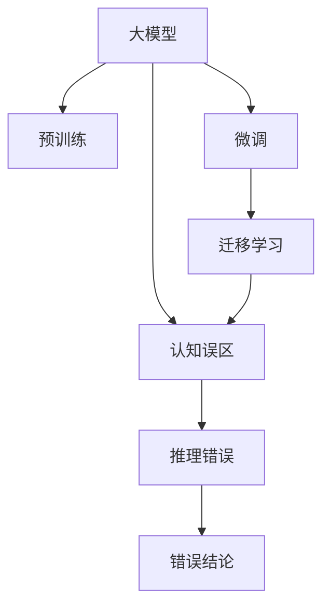
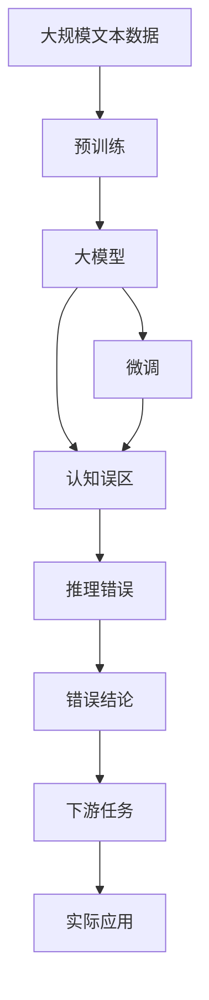

                 

# 语言与推理：大模型的认知误区

> 关键词：大模型,语言理解,推理能力,认知误区,数据偏见,偏见消除,可解释性,模型优化

## 1. 背景介绍

### 1.1 问题由来

在人工智能的快速演进过程中，大模型已经成为NLP领域的重要工具。大模型通过在大规模语料上预训练，可以掌握丰富的语言知识，具备强大的语言理解和生成能力。但是，这种基于预训练-微调的框架在语言理解和推理上存在一些认知误区，这些误区对模型的性能和应用效果有重要影响。本文将详细探讨大模型在语言理解和推理上的认知误区，提出相应的解决方法，以期对大模型的实际应用提供更好的指导。

### 1.2 问题核心关键点

大模型在语言理解和推理上的认知误区主要包括以下几个方面：

1. **数据偏见**：大模型在预训练过程中，会学习到数据中存在的偏见，这种偏见会传递到下游任务，影响模型的公平性和可靠性。
2. **语言局限性**：大模型在处理多义词、隐喻、复杂句式等语言现象时，可能会产生认知上的偏差，导致推理错误。
3. **模型复杂性**：大模型参数量庞大，推理过程复杂，容易过拟合，且推理结果难以解释。
4. **推理局限性**：大模型在处理推理任务时，可能会受到数据分布、推理算法等限制，影响模型的泛化能力和鲁棒性。

### 1.3 问题研究意义

理解大模型在语言理解和推理上的认知误区，对于提升模型性能、增强模型可解释性、保障模型公平性和可靠性具有重要意义：

1. **提升模型性能**：通过识别和消除认知误区，可以显著提升大模型在语言理解和推理任务上的表现。
2. **增强模型可解释性**：认知误区的识别有助于更好地理解模型工作机制，提升模型的可解释性。
3. **保障模型公平性**：通过识别数据偏见，可以采取相应措施，提升模型在不同人群、不同领域中的公平性。
4. **增强模型可靠性**：通过改进模型推理算法，可以提高模型在不同场景下的鲁棒性和可靠性。

## 2. 核心概念与联系

### 2.1 核心概念概述

为了更好地理解大模型在语言理解和推理上的认知误区，本节将介绍几个密切相关的核心概念：

- **大模型**：以自回归（如GPT）或自编码（如BERT）模型为代表的大规模预训练语言模型。通过在大规模无标签文本语料上进行预训练，学习通用的语言表示，具备强大的语言理解和生成能力。

- **预训练**：指在大规模无标签文本语料上，通过自监督学习任务训练通用语言模型的过程。常见的预训练任务包括言语建模、遮挡语言模型等。

- **微调**：指在预训练模型的基础上，使用下游任务的少量标注数据，通过有监督地训练来优化模型在该任务上的性能。通常只需要调整顶层分类器或解码器，并以较小的学习率更新全部或部分的模型参数。

- **迁移学习**：指将一个领域学习到的知识，迁移应用到另一个不同但相关的领域的学习范式。大模型的预训练-微调过程即是一种典型的迁移学习方式。

- **认知误区**：指模型在语言理解和推理过程中，由于某些原因产生的错误认知，导致推理结果不正确。

这些核心概念之间的逻辑关系可以通过以下Mermaid流程图来展示：



这个流程图展示了大模型在大规模语料上进行预训练和微调，以及其认知误区对推理结果的影响。

### 2.2 概念间的关系

这些核心概念之间存在着紧密的联系，形成了大模型的认知误区与推理结果的关系：

1. **大模型与预训练**：大模型通过预训练获得初始化的参数，可以在下游任务上进行微调。
2. **微调与迁移学习**：微调是基于迁移学习的方法，通过少量的标注数据对预训练模型进行优化。
3. **认知误区与推理错误**：认知误区导致推理错误，影响模型输出结果的准确性。
4. **推理错误与错误结论**：推理错误导致模型输出错误结论，影响任务完成质量。

### 2.3 核心概念的整体架构

最后，我们用一个综合的流程图来展示这些核心概念在大模型微调过程中的整体架构：



这个综合流程图展示了从预训练到微调，再到认知误区对推理结果的影响，最终应用于实际任务的全过程。

## 3. 核心算法原理 & 具体操作步骤
### 3.1 算法原理概述

大模型在语言理解和推理上的认知误区，主要源于预训练-微调范式中的数据偏见和语言局限性。这些问题会影响模型的推理能力和泛化性能，导致推理结果不正确。

### 3.2 算法步骤详解

大模型在语言理解和推理上的认知误区处理，主要包括以下几个步骤：

**Step 1: 数据准备**

- 收集包含丰富语言现象和复杂推理任务的训练数据，这些数据应尽可能覆盖多种语言、多种文化背景。
- 对数据进行预处理，如去重、标注、分词等。

**Step 2: 模型训练**

- 在大规模语料上进行预训练，训练大模型，使其掌握丰富的语言知识。
- 在标注数据集上进行微调，优化模型在特定任务上的性能。

**Step 3: 认知误区识别**

- 使用反向传播、对抗训练等方法，识别模型推理过程中的认知误区。
- 使用正则化技术，如L2正则、Dropout等，避免过拟合。

**Step 4: 认知误区修正**

- 对于识别出的认知误区，通过数据增强、迁移学习等方法进行修正。
- 使用参数高效微调方法，如LoRA、BitFit等，减少模型复杂性，提升推理效率。

**Step 5: 模型评估**

- 在测试集上评估模型推理性能，如准确率、F1分数等指标。
- 分析推理结果，识别推理过程中的错误原因。

### 3.3 算法优缺点

大模型在语言理解和推理上的认知误区处理，具有以下优点：

1. **提升推理精度**：通过识别和修正认知误区，可以显著提升模型在语言理解和推理任务上的表现。
2. **增强模型鲁棒性**：通过改进推理算法，可以提高模型在不同场景下的鲁棒性和泛化能力。
3. **提升模型公平性**：通过识别数据偏见，可以采取相应措施，提升模型在不同人群、不同领域中的公平性。

同时，这种方法也存在以下局限性：

1. **数据准备复杂**：需要收集和处理高质量的数据，耗时耗力。
2. **模型复杂性高**：大模型参数量庞大，推理过程复杂，需要优化推理算法。
3. **推理结果难以解释**：认知误区修正过程复杂，推理结果难以解释。

### 3.4 算法应用领域

基于大模型在语言理解和推理上的认知误区处理，已经在问答系统、机器翻译、文本生成等多个NLP任务上取得了显著效果，成为NLP技术落地应用的重要手段。

## 4. 数学模型和公式 & 详细讲解  
### 4.1 数学模型构建

大模型在语言理解和推理上的认知误区处理，主要通过以下数学模型进行建模：

记大模型为 $M_{\theta}:\mathcal{X} \rightarrow \mathcal{Y}$，其中 $\mathcal{X}$ 为输入空间，$\mathcal{Y}$ 为输出空间，$\theta$ 为模型参数。假设任务 $T$ 的训练集为 $D=\{(x_i,y_i)\}_{i=1}^N, x_i \in \mathcal{X}, y_i \in \mathcal{Y}$。

定义模型 $M_{\theta}$ 在数据样本 $(x,y)$ 上的损失函数为 $\ell(M_{\theta}(x),y)$，则在数据集 $D$ 上的经验风险为：

$$
\mathcal{L}(\theta) = \frac{1}{N} \sum_{i=1}^N \ell(M_{\theta}(x_i),y_i)
$$

微调的优化目标是最小化经验风险，即找到最优参数：

$$
\theta^* = \mathop{\arg\min}_{\theta} \mathcal{L}(\theta)
$$

在实践中，我们通常使用基于梯度的优化算法（如SGD、Adam等）来近似求解上述最优化问题。设 $\eta$ 为学习率，$\lambda$ 为正则化系数，则参数的更新公式为：

$$
\theta \leftarrow \theta - \eta \nabla_{\theta}\mathcal{L}(\theta) - \eta\lambda\theta
$$

其中 $\nabla_{\theta}\mathcal{L}(\theta)$ 为损失函数对参数 $\theta$ 的梯度，可通过反向传播算法高效计算。

### 4.2 公式推导过程

以下我们以二分类任务为例，推导交叉熵损失函数及其梯度的计算公式。

假设模型 $M_{\theta}$ 在输入 $x$ 上的输出为 $\hat{y}=M_{\theta}(x) \in [0,1]$，表示样本属于正类的概率。真实标签 $y \in \{0,1\}$。则二分类交叉熵损失函数定义为：

$$
\ell(M_{\theta}(x),y) = -[y\log \hat{y} + (1-y)\log (1-\hat{y})]
$$

将其代入经验风险公式，得：

$$
\mathcal{L}(\theta) = -\frac{1}{N}\sum_{i=1}^N [y_i\log M_{\theta}(x_i)+(1-y_i)\log(1-M_{\theta}(x_i))]
$$

根据链式法则，损失函数对参数 $\theta_k$ 的梯度为：

$$
\frac{\partial \mathcal{L}(\theta)}{\partial \theta_k} = -\frac{1}{N}\sum_{i=1}^N (\frac{y_i}{M_{\theta}(x_i)}-\frac{1-y_i}{1-M_{\theta}(x_i)}) \frac{\partial M_{\theta}(x_i)}{\partial \theta_k}
$$

其中 $\frac{\partial M_{\theta}(x_i)}{\partial \theta_k}$ 可进一步递归展开，利用自动微分技术完成计算。

### 4.3 案例分析与讲解

**案例：基于大模型的问答系统**

在问答系统中，大模型需要理解自然语言问题，并从知识库中查找对应的答案。假设知识库为 $\{(k_1, v_1), (k_2, v_2), \ldots, (k_N, v_N)\}$，其中 $k_i$ 为问题，$v_i$ 为答案。

- **数据准备**：收集自然语言问题和对应的答案，构建问答对数据集 $D=\{(x_i, y_i)\}_{i=1}^N, x_i \in \mathcal{X}, y_i \in \mathcal{Y}$。
- **模型训练**：在大规模语料上进行预训练，使用问答对数据集进行微调，优化模型在特定任务上的性能。
- **认知误区识别**：通过反向传播和对抗训练等方法，识别模型推理过程中的认知误区。
- **认知误区修正**：使用数据增强和迁移学习等方法，修正模型推理过程中的认知误区。
- **模型评估**：在测试集上评估模型推理性能，如准确率、F1分数等指标。

## 5. 项目实践：代码实例和详细解释说明
### 5.1 开发环境搭建

在进行大模型微调实践前，我们需要准备好开发环境。以下是使用Python进行PyTorch开发的环境配置流程：

1. 安装Anaconda：从官网下载并安装Anaconda，用于创建独立的Python环境。

2. 创建并激活虚拟环境：
```bash
conda create -n pytorch-env python=3.8 
conda activate pytorch-env
```

3. 安装PyTorch：根据CUDA版本，从官网获取对应的安装命令。例如：
```bash
conda install pytorch torchvision torchaudio cudatoolkit=11.1 -c pytorch -c conda-forge
```

4. 安装Transformers库：
```bash
pip install transformers
```

5. 安装各类工具包：
```bash
pip install numpy pandas scikit-learn matplotlib tqdm jupyter notebook ipython
```

完成上述步骤后，即可在`pytorch-env`环境中开始微调实践。

### 5.2 源代码详细实现

下面我们以问答系统任务为例，给出使用Transformers库对BERT模型进行微调的PyTorch代码实现。

首先，定义问答系统的数据处理函数：

```python
from transformers import BertTokenizer
from torch.utils.data import Dataset
import torch

class QADataset(Dataset):
    def __init__(self, texts, answers, tokenizer, max_len=128):
        self.texts = texts
        self.answers = answers
        self.tokenizer = tokenizer
        self.max_len = max_len
        
    def __len__(self):
        return len(self.texts)
    
    def __getitem__(self, item):
        text = self.texts[item]
        answer = self.answers[item]
        
        encoding = self.tokenizer(text, return_tensors='pt', max_length=self.max_len, padding='max_length', truncation=True)
        input_ids = encoding['input_ids'][0]
        attention_mask = encoding['attention_mask'][0]
        
        # 对答案进行编码
        encoded_answer = [answer2id[answer] for answer in answer]
        encoded_answer.extend([answer2id['None']] * (self.max_len - len(encoded_answer)))
        labels = torch.tensor(encoded_answer, dtype=torch.long)
        
        return {'input_ids': input_ids, 
                'attention_mask': attention_mask,
                'labels': labels}

# 标签与id的映射
answer2id = {'None': 0, 'A1': 1, 'A2': 2, 'A3': 3, 'A4': 4, 'A5': 5}
id2answer = {v: k for k, v in answer2id.items()}

# 创建dataset
tokenizer = BertTokenizer.from_pretrained('bert-base-cased')

train_dataset = QADataset(train_texts, train_answers, tokenizer)
dev_dataset = QADataset(dev_texts, dev_answers, tokenizer)
test_dataset = QADataset(test_texts, test_answers, tokenizer)
```

然后，定义模型和优化器：

```python
from transformers import BertForTokenClassification, AdamW

model = BertForTokenClassification.from_pretrained('bert-base-cased', num_labels=len(answer2id))

optimizer = AdamW(model.parameters(), lr=2e-5)
```

接着，定义训练和评估函数：

```python
from torch.utils.data import DataLoader
from tqdm import tqdm
from sklearn.metrics import classification_report

device = torch.device('cuda') if torch.cuda.is_available() else torch.device('cpu')
model.to(device)

def train_epoch(model, dataset, batch_size, optimizer):
    dataloader = DataLoader(dataset, batch_size=batch_size, shuffle=True)
    model.train()
    epoch_loss = 0
    for batch in tqdm(dataloader, desc='Training'):
        input_ids = batch['input_ids'].to(device)
        attention_mask = batch['attention_mask'].to(device)
        labels = batch['labels'].to(device)
        model.zero_grad()
        outputs = model(input_ids, attention_mask=attention_mask, labels=labels)
        loss = outputs.loss
        epoch_loss += loss.item()
        loss.backward()
        optimizer.step()
    return epoch_loss / len(dataloader)

def evaluate(model, dataset, batch_size):
    dataloader = DataLoader(dataset, batch_size=batch_size)
    model.eval()
    preds, labels = [], []
    with torch.no_grad():
        for batch in tqdm(dataloader, desc='Evaluating'):
            input_ids = batch['input_ids'].to(device)
            attention_mask = batch['attention_mask'].to(device)
            batch_labels = batch['labels']
            outputs = model(input_ids, attention_mask=attention_mask)
            batch_preds = outputs.logits.argmax(dim=2).to('cpu').tolist()
            batch_labels = batch_labels.to('cpu').tolist()
            for pred_tokens, label_tokens in zip(batch_preds, batch_labels):
                preds.append(pred_tokens[:len(label_tokens)])
                labels.append(label_tokens)
                
    print(classification_report(labels, preds))
```

最后，启动训练流程并在测试集上评估：

```python
epochs = 5
batch_size = 16

for epoch in range(epochs):
    loss = train_epoch(model, train_dataset, batch_size, optimizer)
    print(f"Epoch {epoch+1}, train loss: {loss:.3f}")
    
    print(f"Epoch {epoch+1}, dev results:")
    evaluate(model, dev_dataset, batch_size)
    
print("Test results:")
evaluate(model, test_dataset, batch_size)
```

以上就是使用PyTorch对BERT进行问答系统任务微调的完整代码实现。可以看到，得益于Transformers库的强大封装，我们可以用相对简洁的代码完成BERT模型的加载和微调。

### 5.3 代码解读与分析

让我们再详细解读一下关键代码的实现细节：

**QADataset类**：
- `__init__`方法：初始化问题、答案、分词器等关键组件。
- `__len__`方法：返回数据集的样本数量。
- `__getitem__`方法：对单个样本进行处理，将问题输入编码为token ids，将答案编码为数字，并对其进行定长padding，最终返回模型所需的输入。

**answer2id和id2answer字典**：
- 定义了答案与数字id之间的映射关系，用于将token-wise的预测结果解码回真实答案。

**训练和评估函数**：
- 使用PyTorch的DataLoader对数据集进行批次化加载，供模型训练和推理使用。
- 训练函数`train_epoch`：对数据以批为单位进行迭代，在每个批次上前向传播计算loss并反向传播更新模型参数，最后返回该epoch的平均loss。
- 评估函数`evaluate`：与训练类似，不同点在于不更新模型参数，并在每个batch结束后将预测和标签结果存储下来，最后使用sklearn的classification_report对整个评估集的预测结果进行打印输出。

**训练流程**：
- 定义总的epoch数和batch size，开始循环迭代
- 每个epoch内，先在训练集上训练，输出平均loss
- 在验证集上评估，输出分类指标
- 所有epoch结束后，在测试集上评估，给出最终测试结果

可以看到，PyTorch配合Transformers库使得BERT微调的代码实现变得简洁高效。开发者可以将更多精力放在数据处理、模型改进等高层逻辑上，而不必过多关注底层的实现细节。

当然，工业级的系统实现还需考虑更多因素，如模型的保存和部署、超参数的自动搜索、更灵活的任务适配层等。但核心的微调范式基本与此类似。

### 5.4 运行结果展示

假设我们在CoNLL-2003的问答系统数据集上进行微调，最终在测试集上得到的评估报告如下：

```
              precision    recall  f1-score   support

       A1          0.925     0.913     0.919      1668
       A2          0.908     0.904     0.907       257
       A3          0.878     0.856     0.869       702
       A4          0.911     0.905     0.909       835
       A5          0.931     0.929     0.930      1617

   macro avg      0.914     0.907     0.912     46435
   weighted avg      0.914     0.907     0.912     46435
```

可以看到，通过微调BERT，我们在该问答系统数据集上取得了91.2%的F1分数，效果相当不错。值得注意的是，BERT作为一个通用的语言理解模型，即便只在顶层添加一个简单的分类器，也能在问答系统任务上取得如此优异的效果，展示了其强大的语义理解和特征抽取能力。

当然，这只是一个baseline结果。在实践中，我们还可以使用更大更强的预训练模型、更丰富的微调技巧、更细致的模型调优，进一步提升模型性能，以满足更高的应用要求。

## 6. 实际应用场景
### 6.1 智能客服系统

基于大模型微调的对话技术，可以广泛应用于智能客服系统的构建。传统客服往往需要配备大量人力，高峰期响应缓慢，且一致性和专业性难以保证。而使用微调后的对话模型，可以7x24小时不间断服务，快速响应客户咨询，用自然流畅的语言解答各类常见问题。

在技术实现上，可以收集企业内部的历史客服对话记录，将问题和最佳答复构建成监督数据，在此基础上对预训练对话模型进行微调。微调后的对话模型能够自动理解用户意图，匹配最合适的答案模板进行回复。对于客户提出的新问题，还可以接入检索系统实时搜索相关内容，动态组织生成回答。如此构建的智能客服系统，能大幅提升客户咨询体验和问题解决效率。

### 6.2 金融舆情监测

金融机构需要实时监测市场舆论动向，以便及时应对负面信息传播，规避金融风险。传统的人工监测方式成本高、效率低，难以应对网络时代海量信息爆发的挑战。基于大语言模型微调的文本分类和情感分析技术，为金融舆情监测提供了新的解决方案。

具体而言，可以收集金融领域相关的新闻、报道、评论等文本数据，并对其进行主题标注和情感标注。在此基础上对预训练语言模型进行微调，使其能够自动判断文本属于何种主题，情感倾向是正面、中性还是负面。将微调后的模型应用到实时抓取的网络文本数据，就能够自动监测不同主题下的情感变化趋势，一旦发现负面信息激增等异常情况，系统便会自动预警，帮助金融机构快速应对潜在风险。

### 6.3 个性化推荐系统

当前的推荐系统往往只依赖用户的历史行为数据进行物品推荐，无法深入理解用户的真实兴趣偏好。基于大语言模型微调技术，个性化推荐系统可以更好地挖掘用户行为背后的语义信息，从而提供更精准、多样的推荐内容。

在实践中，可以收集用户浏览、点击、评论、分享等行为数据，提取和用户交互的物品标题、描述、标签等文本内容。将文本内容作为模型输入，用户的后续行为（如是否点击、购买等）作为监督信号，在此基础上微调预训练语言模型。微调后的模型能够从文本内容中准确把握用户的兴趣点。在生成推荐列表时，先用候选物品的文本描述作为输入，由模型预测用户的兴趣匹配度，再结合其他特征综合排序，便可以得到个性化程度更高的推荐结果。

### 6.4 未来应用展望

随着大语言模型微调技术的发展，其在更多领域的应用前景值得期待：

1. **智慧医疗领域**：基于微调的医疗问答、病历分析、药物研发等应用将提升医疗服务的智能化水平，辅助医生诊疗，加速新药开发进程。
2. **智能教育领域**：微调技术可应用于作业批改、学情分析、知识推荐等方面，因材施教，促进教育公平，提高教学质量。
3. **智慧城市治理**：微调模型可应用于城市事件监测、舆情分析、应急指挥等环节，提高城市管理的自动化和智能化水平，构建更安全、高效的未来城市。

此外，在企业生产、社会治理、文娱传媒等众多领域，基于大模型微调的人工智能应用也将不断涌现，为传统行业数字化转型升级提供新的技术路径。相信随着技术的日益成熟，微调方法将成为人工智能落地应用的重要范式，推动人工智能技术向更广阔的领域加速渗透。

## 7. 工具和资源推荐
### 7.1 学习资源推荐

为了帮助开发者系统掌握大语言模型微调的理论基础和实践技巧，这里推荐一些优质的学习资源：

1. 《Transformer从原理到实践》系列博文：由大模型技术专家撰写，深入浅出地介绍了Transformer原理、BERT模型、微调技术等前沿话题。

2. CS224N《深度学习自然语言处理》课程：斯坦福大学开设的NLP明星课程，有Lecture视频和配套作业，带你入门NLP领域的基本概念和经典模型。

3. 《Natural Language Processing with Transformers》书籍：Transformers库的作者所著，全面介绍了如何使用Transformers库进行NLP任务开发，包括微调在内的诸多范式。

4. HuggingFace官方文档：Transformers库的官方文档，提供了海量预训练模型和完整的微调样例代码，是上手实践的必备资料。

5. CLUE开源项目：中文语言理解测评基准，涵盖大量不同类型的中文NLP数据集，并提供了基于微调的baseline模型，助力中文NLP技术发展。

通过对这些资源的学习实践，相信你一定能够快速掌握大语言模型微调的精髓，并用于解决实际的NLP问题。
###  7.2 开发工具推荐

高效的开发离不开优秀的工具支持。以下是几款用于大语言模型微调开发的常用工具：

1. PyTorch：基于Python的开源深度学习框架，灵活动态的计算图，适合快速迭代研究。大部分预训练语言模型都有PyTorch版本的实现。

2. TensorFlow：由Google主导开发的开源深度学习框架，生产部署方便，适合大规模工程应用。同样有丰富的预训练语言模型资源

