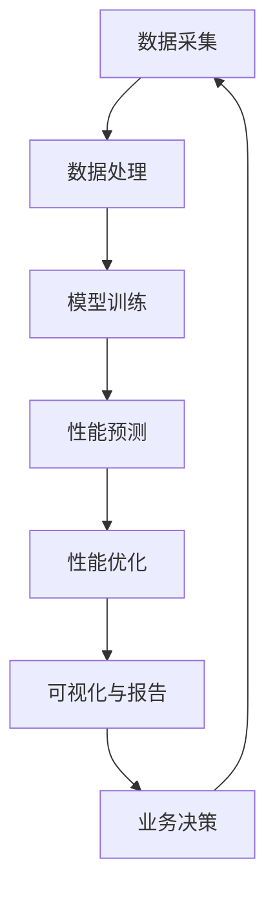

                 

# 软件2.0的性能监控与分析

## 1. 背景介绍

软件2.0（Software 2.0）代表了以人工智能为核心的新一代软件开发模式，利用机器学习和深度学习技术，使软件开发从“以程序员为主”转向“以数据为主”。在这个过程中，性能监控与分析成为了提高软件质量和效率的关键手段。然而，传统的软件开发模式难以适应快速迭代、高并发的软件环境，亟需一种新的性能监控与分析范式来支持软件2.0的发展。本文旨在探索基于人工智能的软件2.0性能监控与分析方法，介绍相关技术原理和应用实践，帮助开发者提升软件性能，推动软件开发模式的革新。

## 2. 核心概念与联系

### 2.1 核心概念概述

- **软件2.0**：以人工智能和数据为中心的软件开发模式，强调数据驱动和机器学习的运用。

- **性能监控与分析**：通过收集软件运行时的数据，利用算法和模型对性能瓶颈进行诊断和优化，提升软件性能。

- **机器学习与深度学习**：用于训练性能监控与分析模型，预测和优化软件性能。

- **模型训练与优化**：利用历史数据训练性能监控与分析模型，通过超参数调优、模型融合等技术提升模型精度。

- **可视化与报告**：将性能数据以可视化形式展现，帮助开发者直观理解软件性能问题，进行决策和优化。

### 2.2 核心概念的联系

软件2.0的性能监控与分析是一个将数据、模型和业务结合起来的闭环系统。在软件运行时收集性能数据，通过机器学习和深度学习模型进行分析和优化，最终生成可视化的性能报告和优化建议。这一过程涉及到数据采集、数据处理、模型训练、性能预测和优化反馈等多个环节，如图：



## 3. 核心算法原理 & 具体操作步骤

### 3.1 算法原理概述

基于人工智能的软件2.0性能监控与分析，主要利用机器学习和深度学习模型对软件性能进行预测和优化。其基本原理如下：

1. **数据采集**：从软件运行时日志、网络流量、资源使用情况等渠道收集性能数据。
2. **数据预处理**：对原始数据进行清洗、归一化、降维等处理，减少噪音和冗余。
3. **模型训练**：使用历史性能数据训练预测模型，如线性回归、随机森林、神经网络等。
4. **性能预测**：利用训练好的模型对新数据进行性能预测。
5. **性能优化**：根据预测结果和业务需求，调整软件配置或重构代码，提升性能。
6. **可视化与报告**：将性能预测和优化结果以图表、报告等形式展示，辅助开发者进行决策。

### 3.2 算法步骤详解

#### 3.2.1 数据采集

- **日志数据采集**：通过API接口或SDK将日志数据传输到性能监控平台。
- **网络流量采集**：利用网络分析工具，如Wireshark、tcpdump等，抓取网络数据包。
- **资源使用情况采集**：监控CPU、内存、磁盘等系统资源使用情况。

#### 3.2.2 数据预处理

- **数据清洗**：去除无关数据、缺失值、异常值等。
- **特征工程**：提取有意义的特征，如平均响应时间、错误率、资源使用率等。
- **数据归一化**：将不同特征值域转换为相同范围。
- **数据降维**：通过PCA、LDA等方法减少数据维度，提升模型效率。

#### 3.2.3 模型训练

- **模型选择**：根据任务特点选择合适模型，如回归、分类、聚类等。
- **数据划分**：将数据集分为训练集、验证集和测试集。
- **超参数调优**：使用网格搜索、随机搜索等方法寻找最优超参数。
- **模型融合**：使用集成学习方法，如Boosting、Stacking等，提升模型精度。

#### 3.2.4 性能预测

- **模型评估**：在验证集上评估模型性能，计算精度、召回率等指标。
- **模型部署**：将训练好的模型部署到生产环境，进行实时性能预测。

#### 3.2.5 性能优化

- **问题定位**：根据性能预测结果，定位性能瓶颈。
- **代码重构**：重构关键代码，如算法优化、缓存改进等。
- **配置调整**：调整系统配置，如增加资源、优化网络配置等。

#### 3.2.6 可视化与报告

- **数据可视化**：利用图表、仪表盘等展示性能数据。
- **报告生成**：生成详细的性能报告，包含预测结果、优化建议等。

### 3.3 算法优缺点

#### 3.3.1 优点

- **高效性**：自动化的数据采集、模型训练和性能优化，节省大量人力和时间。
- **准确性**：基于历史数据的机器学习和深度学习模型，预测性能具有高精度。
- **灵活性**：模型训练和预测可针对不同任务进行定制，满足多样化的需求。

#### 3.3.2 缺点

- **数据依赖**：性能监控与分析依赖于足够的历史数据，缺乏数据时效果不佳。
- **模型复杂度**：训练和优化复杂模型需要较高的技术门槛和计算资源。
- **适应性**：对于高度动态、非线性的性能问题，模型预测和优化效果有限。

### 3.4 算法应用领域

基于人工智能的软件2.0性能监控与分析技术，可以广泛应用于以下领域：

- **软件测试**：利用性能监控与分析技术，进行负载测试、压力测试等，快速发现软件性能问题。
- **云服务优化**：监控云服务的性能指标，如响应时间、错误率等，优化云服务配置，提升服务质量。
- **移动应用优化**：分析移动应用性能瓶颈，如加载时间、页面渲染速度等，优化应用体验。
- **大数据处理**：监控大数据处理任务性能，优化任务调度、资源分配，提高大数据处理效率。
- **网络安全**：监控网络流量，识别异常流量，及时响应网络安全威胁。

## 4. 数学模型和公式 & 详细讲解  
### 4.1 数学模型构建

性能监控与分析模型的数学模型构建主要包括以下几个步骤：

1. **输入数据**：$X = [x_1, x_2, ..., x_n]$，其中 $x_i$ 表示第 $i$ 个特征。
2. **输出数据**：$Y = [y_1, y_2, ..., y_m]$，其中 $y_i$ 表示第 $i$ 个性能指标。
3. **损失函数**：$\mathcal{L} = \frac{1}{N}\sum_{i=1}^N (\hat{y_i} - y_i)^2$，其中 $\hat{y_i}$ 表示模型预测的性能指标。
4. **优化目标**：最小化损失函数 $\mathcal{L}$。

### 4.2 公式推导过程

以线性回归模型为例，进行公式推导：

设 $Y = \beta_0 + \beta_1 X_1 + \beta_2 X_2 + ... + \beta_k X_k + \epsilon$，其中 $\epsilon$ 为误差项。通过最小二乘法求解 $\beta_i$，有：

$$
\beta = (X^T X)^{-1} X^T Y
$$

则模型预测结果为：

$$
\hat{Y} = \beta_0 + \beta_1 X_1 + \beta_2 X_2 + ... + \beta_k X_k
$$

### 4.3 案例分析与讲解

**案例：云服务响应时间预测**

设云服务响应时间为 $Y$，影响因素为 CPU 利用率 $X_1$、内存利用率 $X_2$、请求量 $X_3$。通过历史数据训练线性回归模型，得到：

$$
Y = 0.2 + 0.1 X_1 + 0.3 X_2 - 0.5 X_3
$$

在生产环境中，监控 CPU 利用率、内存利用率和请求量，利用模型预测响应时间，如预测结果为 $Y=3.2$，则说明 CPU 利用率、内存利用率和请求量对响应时间的综合影响为 3.2 秒。

## 5. 项目实践：代码实例和详细解释说明

### 5.1 开发环境搭建

#### 5.1.1 安装 Python

- 安装 Python 3.8 或更高版本。
- 安装 pip 包管理工具。

#### 5.1.2 安装相关库

- 安装 pandas、numpy、matplotlib、scikit-learn 等数据处理和机器学习库。
- 安装 TensorFlow 或 PyTorch 等深度学习库。
- 安装 TSD、Prometheus 等性能监控工具的 Python SDK。

#### 5.1.3 数据采集工具

- 安装 Elasticsearch，用于数据存储和检索。
- 安装 Grafana，用于数据可视化。

### 5.2 源代码详细实现

#### 5.2.1 数据采集

```python
import requests
from elasticsearch import Elasticsearch

# 创建 Elasticsearch 连接
es = Elasticsearch()

# 从日志中采集数据
def collect_logs(index, query):
    logs = es.search(index=index, body=query)
    return [log['_source'] for log in logs['hits']['hits']]

# 从网络流量中采集数据
def collect_network_data(interval, duration):
    # 模拟网络流量采集
    # 真实应用中需使用Wireshark、tcpdump等工具
    network_data = ...  # 采集到的网络数据
    return network_data

# 从资源使用情况中采集数据
def collect_resource_usage(interval, duration):
    # 模拟资源使用情况采集
    # 真实应用中需使用系统监控工具
    resource_usage = ...  # 采集到的资源使用情况
    return resource_usage
```

#### 5.2.2 数据预处理

```python
import pandas as pd
from sklearn.preprocessing import StandardScaler

# 读取原始数据
def load_data():
    logs = collect_logs('logs-index', query)
    network_data = collect_network_data(interval, duration)
    resource_usage = collect_resource_usage(interval, duration)
    return logs, network_data, resource_usage

# 数据清洗和特征工程
def preprocess_data(logs, network_data, resource_usage):
    # 数据清洗，去除无关数据、缺失值等
    logs = clean_logs(logs)
    network_data = clean_network_data(network_data)
    resource_usage = clean_resource_usage(resource_usage)

    # 特征提取，提取有意义特征
    features = extract_features(logs, network_data, resource_usage)

    # 数据归一化
    scaler = StandardScaler()
    features = scaler.fit_transform(features)

    return features
```

#### 5.2.3 模型训练

```python
from sklearn.ensemble import RandomForestRegressor

# 数据划分
def split_data(features, labels):
    train_indices, test_indices = train_test_split(features, labels, test_size=0.2, random_state=42)
    return train_indices, test_indices

# 模型训练
def train_model(features_train, labels_train):
    model = RandomForestRegressor()
    model.fit(features_train, labels_train)
    return model

# 超参数调优
def tune_model(model):
    # 使用网格搜索、随机搜索等方法寻找最优超参数
    optimal_params = ...
    return model, optimal_params
```

#### 5.2.4 性能预测

```python
from sklearn.metrics import mean_squared_error

# 模型评估
def evaluate_model(model, features_test, labels_test):
    predictions = model.predict(features_test)
    mse = mean_squared_error(labels_test, predictions)
    return mse

# 模型部署
def deploy_model(model, features):
    predictions = model.predict(features)
    return predictions
```

### 5.3 代码解读与分析

#### 5.3.1 数据采集

数据采集是性能监控与分析的基础，通过API接口或SDK将日志数据、网络数据、资源使用情况等采集到存储系统（如Elasticsearch）中，为后续的数据处理和模型训练提供数据支撑。

#### 5.3.2 数据预处理

数据预处理是提升模型精度的关键步骤，包括数据清洗、特征提取、数据归一化等，确保数据的准确性和模型训练的有效性。

#### 5.3.3 模型训练

模型训练是性能监控与分析的核心环节，通过选择合适的模型、设置合适的超参数、使用历史数据进行训练，生成性能预测模型。

#### 5.3.4 性能预测

性能预测是性能监控与分析的直接应用，通过将训练好的模型部署到生产环境，实时预测软件性能，指导性能优化和业务决策。

### 5.4 运行结果展示

```python
# 运行结果展示
import matplotlib.pyplot as plt

# 绘制性能预测结果
def plot_predictions(predictions):
    plt.plot(predictions)
    plt.xlabel('Time')
    plt.ylabel('Response Time')
    plt.title('Cloud Service Response Time Prediction')
    plt.show()
```

## 6. 实际应用场景

### 6.1 软件测试

在软件测试阶段，利用性能监控与分析技术，可以快速识别性能瓶颈，优化测试用例，提升测试效率。

### 6.2 云服务优化

在云服务部署和运行过程中，实时监控云服务的性能指标，如响应时间、错误率等，及时发现和解决问题，优化云服务配置，提升服务质量。

### 6.3 移动应用优化

移动应用开发过程中，通过性能监控与分析技术，分析应用性能瓶颈，优化应用代码和资源配置，提升应用体验。

### 6.4 大数据处理

在大数据处理任务中，监控大数据处理任务的性能，优化任务调度、资源分配，提高大数据处理效率。

### 6.5 网络安全

在网络安全领域，监控网络流量，识别异常流量，及时响应网络安全威胁，保障网络安全。

## 7. 工具和资源推荐

### 7.1 学习资源推荐

- **书籍**：《机器学习实战》、《深度学习》、《Python数据科学手册》等。
- **在线课程**：Coursera、Udacity、edX等平台上的相关课程，如《机器学习》、《深度学习》等。
- **博客和社区**：Kaggle、GitHub、Stack Overflow等平台上的博客和社区，可以交流学习心得和获取技术资源。

### 7.2 开发工具推荐

- **Python**：Python是一种广泛使用的编程语言，易于学习和使用，是性能监控与分析的主要开发语言。
- **TensorFlow**：谷歌开源的深度学习框架，支持分布式计算，适合大规模模型训练。
- **PyTorch**：Facebook开源的深度学习框架，易于使用和扩展，适合研究型项目开发。
- **Elasticsearch**：Apache基金会支持的分布式搜索与分析引擎，适合海量数据存储和检索。
- **Grafana**：开源数据可视化平台，支持多种数据源和图表类型，适合性能数据展示和分析。

### 7.3 相关论文推荐

- **论文1**：《A Survey on Performance Modeling and Diagnosis in Software Engineering》，详细介绍了性能监控与分析的现状和未来趋势。
- **论文2**：《Predicting Software Performance Using Machine Learning》，介绍了使用机器学习进行软件性能预测的方法。
- **论文3**：《Performance Modeling and Diagnosis in Distributed Systems》，介绍了分布式系统中的性能监控与分析方法。
- **论文4**：《Software Engineering Challenges in Big Data Applications》，介绍了大数据应用中的性能监控与分析问题。

## 8. 总结：未来发展趋势与挑战

### 8.1 总结

本文介绍了基于人工智能的软件2.0性能监控与分析技术，详细讲解了数据采集、数据预处理、模型训练、性能预测等核心步骤，并提供了相关的代码实例和运行结果。文章展示了性能监控与分析技术在软件测试、云服务优化、移动应用优化、大数据处理、网络安全等实际应用场景中的应用价值，并介绍了相关工具和资源。

### 8.2 未来发展趋势

未来，性能监控与分析技术将呈现以下几个发展趋势：

- **自动化和智能化**：自动化的数据采集、模型训练和性能优化将进一步提升效率，智能化的性能预测和优化将更贴近实际需求。
- **多模态融合**：结合日志数据、网络流量、资源使用情况等多模态数据，提升性能预测的准确性。
- **边缘计算**：在边缘设备上部署性能监控与分析模型，降低延迟，提升实时性。
- **联邦学习**：在保护隐私的前提下，利用分布式数据进行模型训练，提升模型精度和泛化能力。

### 8.3 面临的挑战

性能监控与分析技术虽然带来了诸多便利，但在实际应用中也面临一些挑战：

- **数据隐私和安全**：性能监控与分析依赖于大量数据，如何在保护隐私和数据安全的前提下进行数据采集和处理。
- **模型复杂度**：训练复杂模型需要较高的计算资源和时间，如何在有限资源下优化模型训练。
- **适应性**：性能监控与分析模型在面对高度动态、非线性的性能问题时，预测效果有限。

### 8.4 研究展望

面对性能监控与分析技术面临的挑战，未来的研究需要在以下几个方面寻求新的突破：

- **数据隐私保护**：研究如何在保护隐私的前提下进行数据采集和处理，确保数据安全和隐私保护。
- **模型轻量化**：研究如何简化模型结构，降低模型复杂度，提高模型训练和推理效率。
- **跨模态融合**：研究如何更好地融合多种数据源，提升性能预测的准确性和鲁棒性。
- **边缘计算**：研究如何在边缘设备上进行高性能的性能监控与分析，降低延迟，提升实时性。
- **联邦学习**：研究如何在分布式环境下进行高性能的模型训练，提升模型泛化能力。

## 9. 附录：常见问题与解答

### Q1：什么是软件2.0？

**A1**：软件2.0是以人工智能和数据为中心的软件开发模式，强调数据驱动和机器学习的运用，利用数据和模型来指导软件开发和性能优化。

### Q2：基于人工智能的性能监控与分析方法有哪些优点？

**A2**：基于人工智能的性能监控与分析方法具有以下优点：

- **高效性**：自动化的数据采集、模型训练和性能优化，节省大量人力和时间。
- **准确性**：基于历史数据的机器学习和深度学习模型，预测性能具有高精度。
- **灵活性**：模型训练和预测可针对不同任务进行定制，满足多样化的需求。

### Q3：如何进行性能监控与分析的数据采集？

**A3**：性能监控与分析的数据采集可以通过日志数据采集、网络流量采集和资源使用情况采集等方式进行。

### Q4：数据预处理在性能监控与分析中起什么作用？

**A4**：数据预处理在性能监控与分析中起到以下作用：

- 去除无关数据、缺失值、异常值等，提高数据质量。
- 提取有意义特征，如平均响应时间、错误率、资源使用率等，确保数据相关性。
- 数据归一化，减少数据噪音和冗余。
- 数据降维，提升模型效率。

### Q5：如何使用机器学习模型进行性能预测？

**A5**：使用机器学习模型进行性能预测的步骤如下：

- 数据划分，将数据集分为训练集、验证集和测试集。
- 模型选择，选择合适的机器学习模型，如线性回归、随机森林、神经网络等。
- 模型训练，使用历史数据训练模型，寻找最优超参数。
- 模型评估，在验证集上评估模型性能，计算精度、召回率等指标。
- 模型部署，将训练好的模型部署到生产环境，进行实时性能预测。

---

作者：禅与计算机程序设计艺术 / Zen and the Art of Computer Programming

