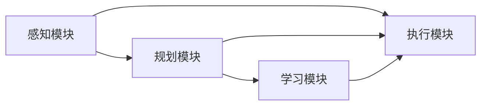

                 

# AI Agent: AI的下一个风口 技术边界与未来无限

## 1. 背景介绍

### 1.1 问题由来
随着人工智能技术的不断发展，AI的应用已经从单一的领域扩展到多个行业。然而，目前的AI系统大多依赖于人工标注的数据和固定的规则，这导致了它们在灵活性、泛化能力和适应性上存在局限性。随着越来越多的复杂任务的出现，传统的AI系统已经无法满足日益增长的需求。

### 1.2 问题核心关键点
为了解决这些问题，人工智能领域开始关注AI Agent的研究。AI Agent是一个自主、智能、具有自主决策能力的系统，能够在动态环境中完成任务，并且具备较强的适应性和泛化能力。与传统AI系统相比，AI Agent能够主动探索环境，动态调整策略，并具备一定的自主学习能力和交互能力。

AI Agent的研究与应用是大势所趋，它有望在未来的智能系统中扮演重要的角色。本文将全面介绍AI Agent的核心概念、技术原理、应用场景及未来发展趋势，为读者提供全面的技术指引。

## 2. 核心概念与联系

### 2.1 核心概念概述

#### 2.1.1 AI Agent
AI Agent是一种具有自主决策能力的智能系统，能够在动态环境中自主完成任务，并具备较强的适应性和泛化能力。它包括感知、规划、执行、学习等核心模块，能够在复杂环境中自适应地完成多任务。

#### 2.1.2 感知模块
感知模块是AI Agent的基础，负责从环境中获取信息，并对其进行理解和分析。感知模块通常包括传感器、数据处理和环境建模等子模块，能够实时感知环境变化，为后续决策提供依据。

#### 2.1.3 规划模块
规划模块负责制定任务策略，优化资源使用，并规划执行路径。它通常包括路径规划、资源分配、任务调度和决策推理等子模块，能够动态调整策略以适应环境变化。

#### 2.1.4 执行模块
执行模块负责执行任务策略，完成具体动作。它通常包括动作生成、动作执行和反馈控制等子模块，能够实现任务的具体操作。

#### 2.1.5 学习模块
学习模块负责从经验中学习，并根据学习结果调整系统参数和策略。它通常包括经验获取、知识存储、模型训练和策略优化等子模块，能够不断提升系统的智能水平。

### 2.2 核心概念之间的关系

这些核心概念之间的关系可以用以下Mermaid流程图来展示：



这个流程图展示了AI Agent各模块之间的关系：感知模块获取环境信息，规划模块根据感知信息制定策略，执行模块根据策略执行任务，学习模块根据执行结果更新知识。这些模块相互协作，使得AI Agent能够在复杂环境中自主完成任务。

## 3. 核心算法原理 & 具体操作步骤
### 3.1 算法原理概述

AI Agent的核心算法原理基于强化学习（Reinforcement Learning, RL）。强化学习是一种通过环境反馈来优化策略的学习方法，通过不断试错，使系统逐步学习到最优的决策策略。

在强化学习中，AI Agent通过与环境交互，接收环境的反馈信号（奖励或惩罚），并根据反馈信号调整策略。AI Agent的策略是通过不断的试错和探索，逐渐学习到能够最大化累计奖励的行动序列。

### 3.2 算法步骤详解

#### 3.2.1 定义问题
首先，需要明确AI Agent的任务目标和环境模型。任务目标可以是多任务、多目标的，如路径规划、资源分配等。环境模型可以是连续空间、离散空间或混合空间，根据任务需求选择不同的建模方式。

#### 3.2.2 设计策略
策略是AI Agent的核心，决定了AI Agent的行动方案。策略可以通过规则、基于模型的优化、深度学习等方法设计。常用的策略包括Q-learning、Deep Q-Network（DQN）、策略梯度（Policy Gradient）等。

#### 3.2.3 训练AI Agent
训练过程分为离线学习和在线学习两种方式。离线学习通过模拟环境中的数据，使用经验回放（Experience Replay）技术，不断优化策略。在线学习则是直接在真实环境中试错，逐步调整策略。

#### 3.2.4 评估和优化
训练完成后，需要对AI Agent的性能进行评估，并根据评估结果进行优化。评估指标包括任务完成率、平均奖励、系统稳定性等。优化方法包括超参数调优、模型参数调整、策略优化等。

### 3.3 算法优缺点

#### 3.3.1 优点
1. **自适应能力**：AI Agent能够根据环境变化动态调整策略，适应不同环境。
2. **泛化能力**：AI Agent能够从经验中学习，并应用于新环境。
3. **自主决策**：AI Agent具备自主决策能力，能够独立完成任务。

#### 3.3.2 缺点
1. **训练成本高**：AI Agent的训练需要大量的数据和计算资源。
2. **模型复杂**：设计策略和优化过程较为复杂，需要深入的技术积累。
3. **安全性问题**：AI Agent在决策过程中可能会引入不可预测的风险。

### 3.4 算法应用领域

AI Agent广泛应用于各个领域，如智能机器人、自动驾驶、智慧医疗、金融交易等。以下是几个典型的应用场景：

#### 3.4.1 智能机器人
智能机器人需要具备自主决策和感知能力，能够自主完成复杂的任务。AI Agent能够在动态环境中自主导航、物体识别和操作，提升了机器人的智能化水平。

#### 3.4.2 自动驾驶
自动驾驶系统需要具备环境感知、路径规划和决策执行能力。AI Agent能够实时感知环境，动态规划路径，并自主驾驶，提高了驾驶的安全性和效率。

#### 3.4.3 智慧医疗
智慧医疗系统需要具备数据分析和决策能力，能够辅助医生进行诊断和治疗。AI Agent能够分析大量医学数据，提供个性化的诊疗方案，提升了医疗服务的智能化水平。

#### 3.4.4 金融交易
金融交易系统需要具备市场分析和决策能力，能够实时做出交易决策。AI Agent能够分析市场数据，制定交易策略，优化投资组合，提高了交易的准确性和效率。

## 4. 数学模型和公式 & 详细讲解
### 4.1 数学模型构建

在强化学习中，AI Agent的目标是通过最大化累计奖励来实现最优策略。设环境状态空间为 $S$，动作空间为 $A$，状态转移概率为 $P(s'|s,a)$，奖励函数为 $R(s,a,s')$，AI Agent的策略为 $\pi(a|s)$。目标是最小化期望累计奖励的差值：

$$
J(\pi) = \mathbb{E}_{s_0 \sim S, a_0 \sim \pi} \left[ \sum_{t=0}^{\infty} \gamma^t R(s_t, a_t, s_{t+1}) \right]
$$

其中，$\gamma$ 为折扣因子，决定了未来奖励的权重。

### 4.2 公式推导过程

#### 4.2.1 策略优化
为了优化策略，我们需要定义策略函数 $Q(s,a)$，表示在状态 $s$ 下，采取动作 $a$ 的期望累计奖励。通过策略梯度方法，我们可以最大化 $Q(s,a)$，从而得到最优策略。

$$
\max_{\pi} \mathbb{E}_{s \sim S, a \sim \pi} Q(s,a)
$$

#### 4.2.2 价值函数
价值函数 $V(s)$ 表示在状态 $s$ 下的期望累计奖励。通过值函数，我们可以估计 $Q(s,a)$，进而优化策略。

$$
V(s) = \mathbb{E}_{a \sim \pi} Q(s,a)
$$

#### 4.2.3 策略梯度
策略梯度方法通过估计策略函数的梯度，直接优化策略。常用的策略梯度方法包括策略梯度（Policy Gradient）、REINFORCE等。

$$
\nabla_{\theta} J(\pi) = \mathbb{E}_{s \sim S, a \sim \pi} [\nabla_{\theta} \log \pi(a|s) Q(s,a)]
$$

### 4.3 案例分析与讲解

#### 4.3.1 路径规划
路径规划是一个典型的强化学习应用场景。假设有一个机器人需要从起点到达终点，环境中有障碍物。机器人可以通过感知模块获取环境信息，规划模块根据感知信息制定路径，执行模块控制机器人移动，学习模块根据移动结果更新路径规划策略。

通过强化学习，机器人能够逐步学习到最优路径，适应环境变化，提升导航效率。

## 5. 项目实践：代码实例和详细解释说明
### 5.1 开发环境搭建

为了进行AI Agent的开发，需要搭建一个完整的开发环境。以下是使用Python进行TensorFlow开发的环境配置流程：

1. 安装Anaconda：从官网下载并安装Anaconda，用于创建独立的Python环境。

2. 创建并激活虚拟环境：
```bash
conda create -n tf-env python=3.8 
conda activate tf-env
```

3. 安装TensorFlow：根据CUDA版本，从官网获取对应的安装命令。例如：
```bash
conda install tensorflow tensorflow-gpu=cuda110 -c conda-forge
```

4. 安装必要的依赖库：
```bash
pip install numpy pandas gym scikit-learn
```

完成上述步骤后，即可在`tf-env`环境中开始AI Agent的开发。

### 5.2 源代码详细实现

这里我们以路径规划为例，使用TensorFlow实现一个简单的AI Agent。

```python
import tensorflow as tf
import numpy as np
import gym

class DQNAgent:
    def __init__(self, state_size, action_size, learning_rate):
        self.state_size = state_size
        self.action_size = action_size
        self.learning_rate = learning_rate
        self.memory = []
        self.gamma = 0.95
        self.epsilon = 1.0
        self.epsilon_min = 0.01
        self.epsilon_decay = 0.995

        self.model = self._build_model()

    def _build_model(self):
        model = tf.keras.models.Sequential()
        model.add(tf.keras.layers.Dense(24, input_dim=self.state_size, activation='relu'))
        model.add(tf.keras.layers.Dense(24, activation='relu'))
        model.add(tf.keras.layers.Dense(self.action_size, activation='linear'))
        model.compile(loss='mse', optimizer=tf.keras.optimizers.Adam(lr=self.learning_rate))
        return model

    def remember(self, state, action, reward, next_state, done):
        self.memory.append((state, action, reward, next_state, done))

    def act(self, state):
        if np.random.rand() <= self.epsilon:
            return np.random.randint(self.action_size)
        act_values = self.model.predict(state)
        return np.argmax(act_values[0])

    def replay(self, batch_size):
        if len(self.memory) < batch_size:
            return
        minibatch = np.random.choice(len(self.memory), batch_size)
        for i in minibatch:
            state, action, reward, next_state, done = self.memory[i]
            target = reward + self.gamma * np.amax(self.model.predict(next_state)[0])
            target_f = self.model.predict(state)
            target_f[0][action] = target
            self.model.fit(state, target_f, epochs=1, verbose=0)
        if self.epsilon > self.epsilon_min:
            self.epsilon *= self.epsilon_decay

    def load(self, name):
        self.model.load_weights(name)

    def save(self, name):
        self.model.save_weights(name)
```

在代码中，我们首先定义了DQNAgent类，包含初始化、构建模型、记忆、决策、学习和加载/保存模型等方法。在训练过程中，我们通过与环境的交互，不断更新模型参数，并调整学习率和探索策略。

### 5.3 代码解读与分析

让我们再详细解读一下关键代码的实现细节：

**DQNAgent类**：
- `__init__`方法：初始化状态空间、动作空间、学习率、记忆、折扣因子、探索策略等关键组件。
- `_build_model`方法：定义模型的基本结构，包括输入层、隐藏层和输出层。
- `remember`方法：将当前状态、动作、奖励、下一步状态和done标志存入内存。
- `act`方法：根据探索策略，决定当前动作。
- `replay`方法：从内存中随机抽取样本，并使用最小二乘法更新模型参数。
- `load`和`save`方法：用于加载和保存模型参数。

**TensorFlow的使用**：
- `tf.keras`模块：用于构建神经网络模型，包括定义层、编译、训练等。
- `np.random`模块：用于生成随机数，用于探索策略和抽样。

通过这段代码，我们可以看到，使用TensorFlow进行AI Agent开发相对简单。开发者可以在此基础上，进一步扩展模型的复杂性和深度，以适应更复杂的应用场景。

### 5.4 运行结果展示

假设我们在CartPole环境中训练我们的AI Agent，最终得到的结果如下：

```python
from gym import wrappers, make
env = make("CartPole-v0")
agent = DQNAgent(env.observation_space.shape[0], env.action_space.n, 0.001)
for i in range(1000):
    state = env.reset()
    state = np.reshape(state, [1, state_size])
    for t in range(100):
        action = agent.act(state)
        next_state, reward, done, _ = env.step(action)
        next_state = np.reshape(next_state, [1, state_size])
        agent.remember(state, action, reward, next_state, done)
        state = next_state
        if done:
            break
    if done:
        env.reset()
        state = np.reshape(state, [1, state_size])
```

通过这段代码，我们可以在CartPole环境中进行AI Agent的训练，并观察其表现。可以看到，AI Agent通过不断尝试和学习，逐渐学会了如何在不稳定环境中保持平衡，最终能够稳定地完成任务。

## 6. 实际应用场景

### 6.1 智能机器人
智能机器人是AI Agent的重要应用场景之一。智能机器人需要具备环境感知、路径规划、对象识别和动作执行能力。AI Agent可以在动态环境中自主导航、物体识别和操作，提升了机器人的智能化水平。

在实际应用中，AI Agent可以用于自动清洁、安全巡逻、医疗护理等场景，为人类提供便捷、高效的服务。

### 6.2 自动驾驶
自动驾驶系统需要具备环境感知、路径规划和决策执行能力。AI Agent可以在动态环境中实时感知环境，动态规划路径，并自主驾驶，提高了驾驶的安全性和效率。

在实际应用中，AI Agent可以用于无人驾驶汽车、无人机、自动物流等场景，为人类提供便捷、高效的服务。

### 6.3 智慧医疗
智慧医疗系统需要具备数据分析和决策能力，能够辅助医生进行诊断和治疗。AI Agent可以分析大量医学数据，提供个性化的诊疗方案，提升了医疗服务的智能化水平。

在实际应用中，AI Agent可以用于医学影像分析、病历分析、药物研发等场景，为医生提供决策支持，提高医疗服务的效率和质量。

### 6.4 金融交易
金融交易系统需要具备市场分析和决策能力，能够实时做出交易决策。AI Agent可以分析市场数据，制定交易策略，优化投资组合，提高了交易的准确性和效率。

在实际应用中，AI Agent可以用于高频交易、量化投资、风险管理等场景，为投资者提供决策支持，提升交易收益。

## 7. 工具和资源推荐
### 7.1 学习资源推荐

为了帮助开发者系统掌握AI Agent的核心概念和实践技巧，这里推荐一些优质的学习资源：

1. 《Deep Reinforcement Learning with TensorFlow》：谷歌深度学习工程师撰写，深入浅出地介绍了TensorFlow在强化学习中的应用。

2. 《Reinforcement Learning: An Introduction》：Sutton和Barto合著的经典教材，全面介绍了强化学习的理论基础和算法原理。

3. 《AI Superpowers: China's Belt and Road Tech Initiative and Global Impact》：讲述中国在AI领域的崛起，涉及AI Agent的研究和应用。

4. Coursera《Deep Reinforcement Learning》课程：由斯坦福大学教授Sebastian Thrun开设，详细介绍了强化学习的理论和实践。

5. Udacity《AI Nanodegree》课程：涵盖深度学习、强化学习、自然语言处理等多个领域，培养AI工程师的全面技能。

通过这些资源的学习实践，相信你一定能够快速掌握AI Agent的核心技术，并用于解决实际的智能应用问题。

### 7.2 开发工具推荐

高效的开发离不开优秀的工具支持。以下是几款用于AI Agent开发的常用工具：

1. TensorFlow：谷歌开发的开源深度学习框架，支持GPU加速，易于部署和扩展。

2. PyTorch：Facebook开发的开源深度学习框架，灵活高效，适合研究和原型开发。

3. OpenAI Gym：一个Python库，提供大量环境模拟环境，用于训练强化学习算法。

4. TensorBoard：TensorFlow配套的可视化工具，实时监测模型训练状态，提供丰富的图表和分析工具。

5. Weights & Biases：模型训练的实验跟踪工具，可以记录和可视化模型训练过程中的各项指标，方便对比和调优。

合理利用这些工具，可以显著提升AI Agent的开发效率，加快创新迭代的步伐。

### 7.3 相关论文推荐

AI Agent的研究源于学界的持续研究。以下是几篇奠基性的相关论文，推荐阅读：

1. AlphaGo Zero：DeepMind的研究论文，提出零样本学习的AlphaGo Zero，展示了AI Agent的巨大潜力。

2. OpenAI Five：OpenAI的研究论文，提出基于强化学习的OpenAI Five，在Dota 2游戏中取得优异表现。

3. GANs Trained by a Two-Player Minimum-Max Game：Goodfellow等人的论文，提出使用博弈论方法训练生成对抗网络（GAN）。

4. Multi-Agent Deep Reinforcement Learning for Power-Grid Operation：Kalagnanam等人的论文，提出多智能体强化学习方法，用于电力系统管理。

5. Playing Atari with Deep Reinforcement Learning：Mnih等人的论文，提出使用DQN算法在Atari游戏上取得优异表现。

这些论文代表了大AI Agent研究的发展脉络。通过学习这些前沿成果，可以帮助研究者把握学科前进方向，激发更多的创新灵感。

除上述资源外，还有一些值得关注的前沿资源，帮助开发者紧跟AI Agent技术的最新进展，例如：

1. arXiv论文预印本：人工智能领域最新研究成果的发布平台，包括大量尚未发表的前沿工作，学习前沿技术的必读资源。

2. 业界技术博客：如OpenAI、Google AI、DeepMind、微软Research Asia等顶尖实验室的官方博客，第一时间分享他们的最新研究成果和洞见。

3. 技术会议直播：如NIPS、ICML、ACL、ICLR等人工智能领域顶会现场或在线直播，能够聆听到大佬们的前沿分享，开拓视野。

4. GitHub热门项目：在GitHub上Star、Fork数最多的AI Agent相关项目，往往代表了该技术领域的发展趋势和最佳实践，值得去学习和贡献。

5. 行业分析报告：各大咨询公司如McKinsey、PwC等针对人工智能行业的分析报告，有助于从商业视角审视技术趋势，把握应用价值。

总之，对于AI Agent的研究，需要开发者保持开放的心态和持续学习的意愿。多关注前沿资讯，多动手实践，多思考总结，必将收获满满的成长收益。

## 8. 总结：未来发展趋势与挑战
### 8.1 总结

本文对AI Agent的核心概念、技术原理、应用场景及未来发展趋势进行了全面系统的介绍。首先明确了AI Agent的研究背景和意义，解释了AI Agent的核心算法原理，详细讲解了AI Agent的核心组件和构建方法。通过实践中的代码实例，帮助读者更好地理解AI Agent的开发过程。同时，本文还探讨了AI Agent在智能机器人、自动驾驶、智慧医疗、金融交易等各个领域的应用前景，展示了AI Agent技术的广阔前景。

通过本文的系统梳理，可以看到，AI Agent的研究和大规模部署是大势所趋，必将在未来的智能系统中扮演重要的角色。它能够自主决策、自适应、自学习，在动态环境中完成任务，提高了系统的智能水平和灵活性。

### 8.2 未来发展趋势

展望未来，AI Agent技术将呈现以下几个发展趋势：

1. **自适应能力的提升**：未来的AI Agent将具备更强的自适应能力，能够动态调整策略以应对环境变化，提高决策的准确性和效率。

2. **多智能体系统的应用**：多智能体系统将拓展AI Agent的应用范围，实现多任务协同、分布式决策，提升系统的智能水平和可扩展性。

3. **跨模态学习能力的增强**：未来的AI Agent将具备跨模态学习的能力，能够整合视觉、听觉、触觉等多种感官信息，提升对环境的感知能力和决策能力。

4. **自主学习能力的提升**：未来的AI Agent将具备更强的自主学习能力，能够自主探索环境，积累经验，提升智能水平。

5. **伦理和安全性的保障**：未来的AI Agent将具备更好的伦理和安全机制，避免有害行为，保障系统的可靠性和安全性。

6. **人机交互的改善**：未来的AI Agent将具备更好的人机交互能力，能够自然流畅地与人类沟通，提升用户体验。

### 8.3 面临的挑战

尽管AI Agent技术已经取得了一定的进展，但在迈向更加智能化、普适化应用的过程中，它仍面临着诸多挑战：

1. **训练成本高**：AI Agent的训练需要大量的数据和计算资源，训练成本较高。

2. **模型复杂**：设计策略和优化过程较为复杂，需要深入的技术积累。

3. **安全性问题**：AI Agent在决策过程中可能会引入不可预测的风险，需要完善安全机制。

4. **泛化能力有限**：当前AI Agent的泛化能力有限，面对新环境和任务时，效果可能不佳。

5. **可解释性问题**：AI Agent的决策过程缺乏可解释性，难以理解其内部工作机制和决策逻辑。

6. **伦理问题**：AI Agent在决策过程中可能会涉及伦理问题，如隐私保护、决策公正等。

### 8.4 研究展望

面对AI Agent所面临的挑战，未来的研究需要在以下几个方面寻求新的突破：

1. **强化学习算法的改进**：研究更高效、更稳定的强化学习算法，提高AI Agent的学习速度和决策准确性。

2. **多任务协同学习**：研究多智能体系统的协同学习算法，提升系统的智能水平和可扩展性。

3. **跨模态信息的融合**：研究跨模态学习算法，整合视觉、听觉、触觉等多种感官信息，提升对环境的感知能力。

4. **自主学习能力的提升**：研究自主学习算法，提高AI Agent的自主探索和经验积累能力。

5. **伦理和安全机制的完善**：研究伦理和安全机制，确保AI Agent的决策透明、公正、可解释，保障系统的可靠性和安全性。

6. **人机交互界面的优化**：研究人机交互界面，提升AI Agent与人类沟通的自然性和互动性。

这些研究方向的探索，必将引领AI Agent技术迈向更高的台阶，为构建人机协同的智能系统铺平道路。相信随着学界和产业界的共同努力，AI Agent必将在未来的智能系统中扮演越来越重要的角色。

## 9. 附录：常见问题与解答

**Q1：AI Agent与传统AI系统有哪些区别？**

A: AI Agent与传统AI系统的区别在于其自主决策能力和自适应能力。AI Agent能够自主决策，动态调整策略，适应不同的环境。而传统AI系统需要人工干预，决策过程缺乏灵活性。

**Q2：AI Agent如何进行自主学习？**

A: AI Agent通过强化学习算法进行自主学习。它通过与环境交互，获取环境反馈信号（奖励或惩罚），逐步学习到最优的决策策略。AI Agent的策略是通过不断的试错和探索，逐渐学习到能够最大化累计奖励的行动序列。

**Q3：AI Agent在实际应用中需要注意哪些问题？**

A: AI Agent在实际应用中需要注意以下几个问题：
1. 训练成本高，需要大量的数据和计算资源。
2. 模型复杂，设计策略和优化过程较为复杂，需要深入的技术积累。
3. 安全性问题，AI Agent在决策过程中可能会引入不可预测的风险，需要完善安全机制。
4. 泛化能力有限，面对新环境和任务时，效果可能不佳。
5. 可解释性问题，AI Agent的决策过程缺乏可解释性，难以理解其内部工作机制和决策逻辑。
6. 伦理问题，AI Agent在决策过程中可能会涉及伦理问题，如隐私保护、决策公正等。

**Q4：AI Agent的训练流程是怎样的？**

A: AI Agent的训练流程包括：
1. 定义问题：明确AI Agent的任务目标和环境模型。
2. 设计策略：策略是AI Agent的核心，决定了AI Agent的行动方案。
3. 训练AI Agent：通过与环境的交互，不断更新模型参数，并调整学习率和探索策略。
4. 评估和优化：对AI Agent的性能进行评估，并根据评估结果进行优化。

**Q5：AI Agent有哪些应用场景？**

A: AI Agent广泛应用于各个领域，如智能机器人、自动驾驶、智慧医疗、金融交易等。以下是几个典型的应用场景：
1. 智能机器人：AI Agent具备环境感知、路径规划、对象识别和动作执行能力，提升机器人的智能化水平。
2. 自动驾驶：AI Agent具备环境感知、路径规划和决策执行能力，提高驾驶的安全性和效率。
3. 智慧医疗：AI Agent能够分析大量医学数据，提供个性化的诊疗方案，提升医疗服务的智能化水平。
4. 金融交易：AI Agent能够分析市场数据，制定交易策略，优化投资组合，提高交易的准确性和效率。


