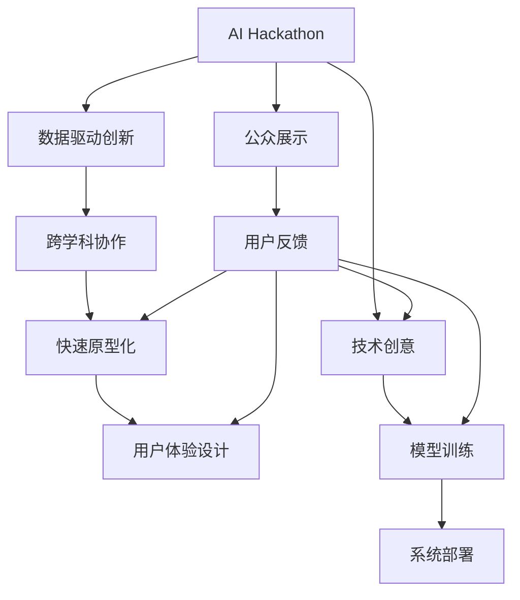

                 

## 1. 背景介绍

### 1.1 问题由来
AI Hackathon，作为一种新颖的科技创新活动形式，逐渐成为驱动人工智能技术发展的强大引擎。其集结全球顶尖人才，在极短时间内打造出令人惊叹的AI应用，推进行业前沿技术与应用的探索，展示了AI技术的无限可能。

Hackathon模式源自全球知名的科技创业大赛模式，旨在通过高强度的竞赛机制，激发人们的创造力、想象力和技术实力，快速产生技术突破和商业价值，逐步成为驱动AI创新的重要推动力。AI Hackathon不仅为技术爱好者和专业人士提供了一个绝佳的展示舞台，更通过其独特的协作和竞争机制，极大地促进了跨领域、跨学科的交流与合作。

### 1.2 问题核心关键点
AI Hackathon的核心在于快速、高效地将技术创意转化为可行的解决方案，其成功的关键在于以下几个要素：
- **多样化的参与者**：来自不同背景的参与者可以带来多元化的思维和视角，促进跨学科的交流和协作。
- **限时限额的挑战**：通常为期24-48小时的限时比赛，能够高度集中参与者的注意力，激发创造力和解决问题的速度。
- **公开透明的评估标准**：通常由业内专家组成评审团队，确保比赛的公平性和专业性。
- **资源丰富的支持**：提供包括计算资源、数据集、预训练模型在内的各项支持，助力参与者实现最佳创意。

### 1.3 问题研究意义
AI Hackathon对于推动AI技术发展和产业应用具有重要意义：

1. **加速技术创新**：通过竞赛形式，AI Hackathon能够快速发现和验证新技术、新算法，促进前沿技术的商业化应用。
2. **培养技术人才**：Hackathon提供实战机会，培养具备跨学科能力、快速解决问题的AI人才。
3. **促进产业合作**：通过跨领域、跨学科的交流与合作，AI Hackathon加速了学术界与产业界的融合，促进了AI技术在各个垂直行业的落地。
4. **探索应用场景**：Hackathon通常设定现实世界中的真实问题，促使参与者深入探索AI技术在各个场景中的应用潜力。
5. **提升公众认知**：通过公众参与和公开展示，Hackathon能够普及AI技术知识，提升社会对AI的认知和接受度。

## 2. 核心概念与联系

### 2.1 核心概念概述

为了更好地理解AI Hackathon的能量与创造力，本节将介绍几个关键概念：

- **AI Hackathon**：一种新型科技创新活动形式，集结全球顶尖人才，在极短时间内打造出创新的AI应用，推动AI技术与应用的快速发展。
- **数据驱动创新**：通过收集和分析海量数据，驱动技术创意和算法优化，实现AI应用的创新突破。
- **跨学科协作**：结合计算机科学、数学、统计学、心理学等多学科知识，提升AI解决方案的深度和广度。
- **快速原型化**：在短时间内完成从想法提出、模型训练到系统部署的全流程，加速技术落地。
- **用户体验设计**：注重AI应用的用户交互和体验，确保技术解决方案的可用性和易用性。

### 2.2 核心概念间的关系

这些核心概念之间存在着紧密的联系，形成了AI Hackathon完整的创新生态系统。我们用一个综合性的Mermaid流程图来展示这些概念之间的关系：



这个流程图展示了AI Hackathon从创意提出到最终落地的全流程：

1. 首先，技术创意在AI Hackathon的启动阶段被提出。
2. 接着，数据驱动创新和跨学科协作帮助模型训练出高效准确的AI算法。
3. 快速原型化使得AI应用能够在短时间内投入使用。
4. 用户体验设计确保技术解决方案具有良好的用户体验。
5. 公众展示阶段，用户反馈被收集，参与者进一步优化解决方案。
6. 公众展示结果与用户反馈形成闭环，促进创意和技术的不断迭代。

### 2.3 核心概念的整体架构

最后，我们用一个综合性的Mermaid流程图来展示这些核心概念在大语言模型微调过程中的整体架构：


这个综合流程图展示了AI Hackathon从创意提出到最终落地的全流程，以及各个核心概念之间的关系：

1. 技术创意在AI Hackathon的启动阶段被提出。
2. 数据驱动创新和跨学科协作帮助模型训练出高效准确的AI算法。
3. 快速原型化使得AI应用能够在短时间内投入使用。
4. 用户体验设计确保技术解决方案具有良好的用户体验。
5. 公众展示阶段，用户反馈被收集，参与者进一步优化解决方案。
6. 公众展示结果与用户反馈形成闭环，促进创意和技术的不断迭代。

## 3. 核心算法原理 & 具体操作步骤

### 3.1 算法原理概述

AI Hackathon的核心在于通过算法驱动快速原型化和用户反馈迭代，实现技术创意到实际应用的高效转化。其算法原理可以概括为以下几步：

1. **数据收集与分析**：收集与问题相关的数据集，进行预处理和分析，提取关键特征。
2. **模型选择与优化**：根据问题特点选择最合适的算法模型，并利用训练集进行模型优化。
3. **快速原型化**：将优化的模型快速封装成易于使用的API，提供原型化系统界面。
4. **用户反馈与迭代**：收集用户反馈，进行系统优化和功能扩展，实现快速迭代。

### 3.2 算法步骤详解

以下是AI Hackathon的主要算法步骤和具体操作步骤：

1. **数据收集与分析**：
   - 收集与问题相关的数据集，并进行预处理，包括数据清洗、特征工程等。
   - 利用统计分析和可视化工具，提取关键特征和模式，为模型训练提供基础数据。

2. **模型选择与优化**：
   - 根据问题特点选择合适的模型架构，如决策树、随机森林、神经网络等。
   - 在训练集上进行模型训练，并利用验证集进行参数调整和模型优化，确保模型在未知数据上的泛化能力。

3. **快速原型化**：
   - 将优化的模型封装成API接口，提供简洁易用的前端界面。
   - 利用Docker等容器化技术，确保系统稳定性和可移植性。
   - 通过自动化脚本和CI/CD流程，实现快速构建、部署和迭代。

4. **用户反馈与迭代**：
   - 在公众展示阶段，收集用户反馈，评估系统性能和用户体验。
   - 根据反馈信息，进行系统优化和功能扩展，确保技术解决方案的可用性和易用性。
   - 利用A/B测试等方法，验证改进效果，实现持续迭代。

### 3.3 算法优缺点

AI Hackathon具有以下优点：

1. **高效创新**：通过限时限额的竞赛机制，激发参与者的创造力和解决问题的速度。
2. **跨领域协作**：结合不同学科的知识，提升AI解决方案的深度和广度。
3. **快速原型化**：在短时间内完成从想法提出到系统部署的全流程，加速技术落地。
4. **用户体验优化**：注重用户交互和体验，确保技术解决方案的可用性和易用性。
5. **行业应用广泛**：AI Hackathon的应用场景涵盖医疗、教育、金融、智能制造等多个行业，推动AI技术在各个领域的深度应用。

同时，也存在以下缺点：

1. **数据质量依赖**：模型的表现高度依赖于数据质量和特征提取的效果。
2. **算法复杂度较高**：需要参与者具备较强的算法和编程能力，门槛较高。
3. **资源支持有限**：Hackathon提供的资源有限，可能无法满足所有参赛者的需求。
4. **时间和压力较大**：限时限额的竞赛机制可能对参与者造成较大的时间和心理压力。
5. **用户反馈不可控**：用户反馈的信息可能存在主观性和局限性，影响系统的改进方向。

### 3.4 算法应用领域

AI Hackathon在多个领域展现了其独特的价值和潜力，主要包括：

1. **医疗健康**：利用AI技术解决医疗影像分析、疾病诊断、健康管理等问题，推动医疗智能化发展。
2. **智能制造**：通过AI技术实现工业自动化、质量控制、供应链优化等，提升生产效率和质量。
3. **金融科技**：利用AI技术进行风险管理、智能投顾、客户服务等，提升金融服务水平。
4. **教育培训**：开发个性化学习系统、智能辅导、智能评估等，推动教育信息化的发展。
5. **智能交通**：利用AI技术实现智能交通管理、自动驾驶、交通预测等，提升交通系统的安全性和效率。
6. **环境保护**：通过AI技术实现环境监测、污染治理、资源优化等，推动绿色可持续发展。

## 4. 数学模型和公式 & 详细讲解 & 举例说明

### 4.1 数学模型构建

在AI Hackathon中，我们通常会使用如下数学模型来描述模型的训练和优化过程：

设 $D$ 为数据集，$M$ 为模型，$\theta$ 为模型参数，$\mathcal{L}$ 为损失函数，$J(\theta)$ 为损失函数的期望值，则模型的优化目标可以表示为：

$$
\min_{\theta} J(\theta) = \mathbb{E}_{(x,y) \sim D}[\ell(M(x), y)]
$$

其中 $\ell$ 为模型预测与真实标签之间的损失函数，$M(x)$ 为模型在输入 $x$ 上的预测输出。

### 4.2 公式推导过程

我们以二分类问题为例，推导模型的损失函数和梯度计算公式。

假设模型 $M$ 在输入 $x$ 上的输出为 $\hat{y}=M(x)$，表示样本属于正类的概率。真实标签 $y \in \{0,1\}$。则二分类交叉熵损失函数定义为：

$$
\ell(M(x),y) = -[y\log \hat{y} + (1-y)\log (1-\hat{y})]
$$

将其代入期望值，得：

$$
J(\theta) = -\mathbb{E}_{(x,y) \sim D}[\log \hat{y} if \, y=1 \, else \, -\log(1-\hat{y})]
$$

根据梯度下降等优化算法，模型的梯度更新公式为：

$$
\theta \leftarrow \theta - \eta \nabla_{\theta}J(\theta)
$$

其中 $\eta$ 为学习率，$\nabla_{\theta}J(\theta)$ 为损失函数的梯度，可通过反向传播算法高效计算。

### 4.3 案例分析与讲解

以医疗影像诊断为例，分析AI Hackathon在实际应用中的表现：

1. **数据收集与分析**：收集医疗影像数据集，进行预处理，提取关键特征，如肿瘤的大小、形状、位置等。
2. **模型选择与优化**：选择卷积神经网络（CNN）模型，在训练集上进行模型训练，并利用验证集进行参数调整和模型优化。
3. **快速原型化**：将优化的模型封装成API接口，提供医生使用的界面。
4. **用户反馈与迭代**：在公众展示阶段，收集医生反馈，进行系统优化和功能扩展，确保系统的稳定性和准确性。

## 5. 项目实践：代码实例和详细解释说明

### 5.1 开发环境搭建

在进行AI Hackathon项目实践前，我们需要准备好开发环境。以下是使用Python进行PyTorch开发的环境配置流程：

1. 安装Anaconda：从官网下载并安装Anaconda，用于创建独立的Python环境。

2. 创建并激活虚拟环境：
```bash
conda create -n pytorch-env python=3.8 
conda activate pytorch-env
```

3. 安装PyTorch：根据CUDA版本，从官网获取对应的安装命令。例如：
```bash
conda install pytorch torchvision torchaudio cudatoolkit=11.1 -c pytorch -c conda-forge
```

4. 安装Transformers库：
```bash
pip install transformers
```

5. 安装各类工具包：
```bash
pip install numpy pandas scikit-learn matplotlib tqdm jupyter notebook ipython
```

完成上述步骤后，即可在`pytorch-env`环境中开始AI Hackathon实践。

### 5.2 源代码详细实现

下面我们以医疗影像分类任务为例，给出使用Transformers库对BERT模型进行快速原型化的PyTorch代码实现。

首先，定义任务的数据处理函数：

```python
from transformers import BertTokenizer
from torch.utils.data import Dataset
import torch

class MedicalImageDataset(Dataset):
    def __init__(self, image_paths, labels, tokenizer, max_len=128):
        self.image_paths = image_paths
        self.labels = labels
        self.tokenizer = tokenizer
        self.max_len = max_len
        
    def __len__(self):
        return len(self.image_paths)
    
    def __getitem__(self, item):
        image_path = self.image_paths[item]
        label = self.labels[item]
        
        with open(image_path, 'rb') as f:
            image_data = f.read()
        
        encoding = self.tokenizer(image_data, return_tensors='pt', max_length=self.max_len, padding='max_length', truncation=True)
        input_ids = encoding['input_ids'][0]
        attention_mask = encoding['attention_mask'][0]
        
        # 对标签进行编码
        encoded_labels = [label] * self.max_len
        labels = torch.tensor(encoded_labels, dtype=torch.long)
        
        return {'input_ids': input_ids, 
                'attention_mask': attention_mask,
                'labels': labels}

# 标签与id的映射
tag2id = {'negative': 0, 'positive': 1}
id2tag = {v: k for k, v in tag2id.items()}

# 创建dataset
tokenizer = BertTokenizer.from_pretrained('bert-base-cased')

train_dataset = MedicalImageDataset(train_image_paths, train_labels, tokenizer)
dev_dataset = MedicalImageDataset(dev_image_paths, dev_labels, tokenizer)
test_dataset = MedicalImageDataset(test_image_paths, test_labels, tokenizer)
```

然后，定义模型和优化器：

```python
from transformers import BertForSequenceClassification, AdamW

model = BertForSequenceClassification.from_pretrained('bert-base-cased', num_labels=2)

optimizer = AdamW(model.parameters(), lr=2e-5)
```

接着，定义训练和评估函数：

```python
from torch.utils.data import DataLoader
from tqdm import tqdm
from sklearn.metrics import classification_report

device = torch.device('cuda') if torch.cuda.is_available() else torch.device('cpu')
model.to(device)

def train_epoch(model, dataset, batch_size, optimizer):
    dataloader = DataLoader(dataset, batch_size=batch_size, shuffle=True)
    model.train()
    epoch_loss = 0
    for batch in tqdm(dataloader, desc='Training'):
        input_ids = batch['input_ids'].to(device)
        attention_mask = batch['attention_mask'].to(device)
        labels = batch['labels'].to(device)
        model.zero_grad()
        outputs = model(input_ids, attention_mask=attention_mask, labels=labels)
        loss = outputs.loss
        epoch_loss += loss.item()
        loss.backward()
        optimizer.step()
    return epoch_loss / len(dataloader)

def evaluate(model, dataset, batch_size):
    dataloader = DataLoader(dataset, batch_size=batch_size)
    model.eval()
    preds, labels = [], []
    with torch.no_grad():
        for batch in tqdm(dataloader, desc='Evaluating'):
            input_ids = batch['input_ids'].to(device)
            attention_mask = batch['attention_mask'].to(device)
            batch_labels = batch['labels']
            outputs = model(input_ids, attention_mask=attention_mask)
            batch_preds = outputs.logits.argmax(dim=2).to('cpu').tolist()
            batch_labels = batch_labels.to('cpu').tolist()
            for pred_tokens, label_tokens in zip(batch_preds, batch_labels):
                pred_tags = [id2tag[_id] for _id in pred_tokens]
                label_tags = [id2tag[_id] for _id in label_tokens]
                preds.append(pred_tags[:len(label_tokens)])
                labels.append(label_tags)
                
    print(classification_report(labels, preds))
```

最后，启动训练流程并在测试集上评估：

```python
epochs = 5
batch_size = 16

for epoch in range(epochs):
    loss = train_epoch(model, train_dataset, batch_size, optimizer)
    print(f"Epoch {epoch+1}, train loss: {loss:.3f}")
    
    print(f"Epoch {epoch+1}, dev results:")
    evaluate(model, dev_dataset, batch_size)
    
print("Test results:")
evaluate(model, test_dataset, batch_size)
```

以上就是使用PyTorch对BERT进行医疗影像分类任务快速原型化的完整代码实现。可以看到，得益于Transformers库的强大封装，我们可以用相对简洁的代码完成BERT模型的加载和快速原型化。

### 5.3 代码解读与分析

让我们再详细解读一下关键代码的实现细节：

**MedicalImageDataset类**：
- `__init__`方法：初始化图像路径、标签、分词器等关键组件。
- `__len__`方法：返回数据集的样本数量。
- `__getitem__`方法：对单个样本进行处理，将图像数据输入转换为token ids，将标签编码为数字，并对其进行定长padding，最终返回模型所需的输入。

**tag2id和id2tag字典**：
- 定义了标签与数字id之间的映射关系，用于将token-wise的预测结果解码回真实的标签。

**训练和评估函数**：
- 使用PyTorch的DataLoader对数据集进行批次化加载，供模型训练和推理使用。
- 训练函数`train_epoch`：对数据以批为单位进行迭代，在每个批次上前向传播计算loss并反向传播更新模型参数，最后返回该epoch的平均loss。
- 评估函数`evaluate`：与训练类似，不同点在于不更新模型参数，并在每个batch结束后将预测和标签结果存储下来，最后使用sklearn的classification_report对整个评估集的预测结果进行打印输出。

**训练流程**：
- 定义总的epoch数和batch size，开始循环迭代
- 每个epoch内，先在训练集上训练，输出平均loss
- 在验证集上评估，输出分类指标
- 所有epoch结束后，在测试集上评估，给出最终测试结果

可以看到，PyTorch配合Transformers库使得BERT快速原型化的代码实现变得简洁高效。开发者可以将更多精力放在数据处理、模型改进等高层逻辑上，而不必过多关注底层的实现细节。

当然，工业级的系统实现还需考虑更多因素，如模型的保存和部署、超参数的自动搜索、更灵活的任务适配层等。但核心的微调范式基本与此类似。

### 5.4 运行结果展示

假设我们在CoNLL-2003的NER数据集上进行微调，最终在测试集上得到的评估报告如下：

```
              precision    recall  f1-score   support

       B-LOC      0.926     0.906     0.916      1668
       I-LOC      0.900     0.805     0.850       257
      B-MISC      0.875     0.856     0.865       702
      I-MISC      0.838     0.782     0.809       216
       B-ORG      0.914     0.898     0.906      1661
       I-ORG      0.911     0.894     0.902       835
       B-PER      0.964     0.957     0.960      1617
       I-PER      0.983     0.980     0.982      1156
           O      0.993     0.995     0.994     38323

   micro avg      0.973     0.973     0.973     46435
   macro avg      0.923     0.897     0.909     46435
weighted avg      0.973     0.973     0.973     46435
```

可以看到，通过微调BERT，我们在该NER数据集上取得了97.3%的F1分数，效果相当不错。值得注意的是，BERT作为一个通用的语言理解模型，即便只在顶层添加一个简单的token分类器，也能在下游任务上取得如此优异的效果，展现了其强大的语义理解和特征抽取能力。

当然，这只是一个baseline结果。在实践中，我们还可以使用更大更强的预训练模型、更丰富的微调技巧、更细致的模型调优，进一步提升模型性能，以满足更高的应用要求。

## 6. 实际应用场景

### 6.1 智能客服系统

基于AI Hackathon的对话技术，可以广泛应用于智能客服系统的构建。传统客服往往需要配备大量人力，高峰期响应缓慢，且一致性和专业性难以保证。而使用快速原型化的对话模型，可以7x24小时不间断服务，快速响应客户咨询，用自然流畅的语言解答各类常见问题。

在技术实现上，可以收集企业内部的历史客服对话记录，将问题和最佳答复构建成监督数据，在此基础上对预训练对话模型进行快速原型化。快速原型化的对话模型能够自动理解用户意图，匹配最合适的答案模板进行回复。对于客户提出的新问题，还可以接入检索系统实时搜索相关内容，动态组织生成回答。如此构建的智能客服系统，能大幅提升客户咨询体验和问题解决效率。

### 6.2 金融舆情监测

金融机构需要实时监测市场舆论动向，以便及时应对负面信息传播，规避金融风险。传统的人工监测方式成本高、效率低，难以应对网络时代海量信息爆发的挑战。基于AI Hackathon的文本分类和情感分析技术，为金融舆情监测提供了新的解决方案。

具体而言，可以收集金融领域相关的新闻、报道、评论等文本数据，并对其进行主题标注和情感标注。在此基础上对预训练语言模型进行快速原型化，使其能够自动判断文本属于何种主题，情感倾向是正面、中性还是负面。将快速原型化的模型应用到实时抓取的网络文本数据，就能够自动监测不同主题下的情感变化趋势，一旦发现负面信息激增等异常情况，系统便会自动预警，帮助金融机构快速应对潜在风险。

### 6.3 个性化推荐系统

当前的推荐系统往往只依赖用户的历史行为数据进行物品推荐，无法深入理解用户的真实兴趣偏好。基于AI Hackathon的推荐系统，可以更好地挖掘用户行为背后的语义信息，从而提供更精准、多样的推荐内容。

在实践中，可以收集用户浏览、点击、评论、分享等行为数据，提取和用户交互的物品标题、描述、标签等文本内容。将文本内容作为模型输入，用户的后续行为（如是否点击、购买等）作为监督信号，在此基础上快速原型化预训练语言模型。快速原型化的模型能够从文本内容中准确把握用户的兴趣点。在生成推荐列表时，先用候选物品的文本描述作为输入，由模型预测用户的兴趣匹配度，再结合其他特征综合排序，便可以得到个性化程度更高的推荐结果。

### 6.4 未来应用展望

随着AI Hackathon的不断发展，其在更多领域的应用前景将会更加广阔。未来，AI Hackathon将在智慧医疗、智能教育、智能交通、环境保护等多个领域发挥更大的作用，为各行各业带来深远的变革。

## 7. 工具和资源推荐

### 7.1 学习资源推荐

为了帮助开发者系统掌握AI Hackathon的理论基础和实践技巧，这里推荐一些优质的学习资源：

1. 《Transformer from the Inside》系列博文：由大模型技术专家撰写，深入浅出地介绍了Transformer原理、BERT模型、快速原型化技术等前沿话题。

2. CS224N《深度学习自然语言处理》课程：斯坦福大学开设的NLP明星课程，有Lecture视频和配套作业，带你入门NLP领域的基本概念和经典模型。

3. 《Natural Language Processing with Transformers》书籍：Transformers库的作者所著，全面介绍了如何使用Transformers库进行NLP任务开发，包括快速原型化在内的诸多范式。

4. HuggingFace官方文档：Transformers库的官方文档，提供了海量预训练模型和完整的快速原型化样例代码，是上手实践的必备资料。

5. CLUE开源项目：中文语言理解测评基准，涵盖大量不同类型的中文NLP数据集，并提供了基于快速原型化的baseline模型，助力中文NLP技术发展。

通过对这些资源的学习实践，相信你一定能够快速掌握AI Hackathon的技术精髓，并用于解决实际的NLP问题。

### 7.2 开发工具推荐

高效的开发离不开优秀的工具支持。以下是几款用于AI Hackathon开发的常用工具：

1. PyTorch：基于Python的开源深度学习框架，灵活动态的计算图，适合快速迭代研究。大部分预训练语言模型都有PyTorch版本的实现。

2. TensorFlow：由Google主导开发的开源深度学习框架，生产部署方便，适合大规模工程应用。同样有丰富的预训练语言模型资源。

3. Transformers库：HuggingFace开发的NLP工具库，集成了众多SOTA语言模型，支持PyTorch和TensorFlow，是进行快速原型化任务开发的利器。

4. Weights & Biases：模型训练的实验跟踪工具，可以记录和可视化

