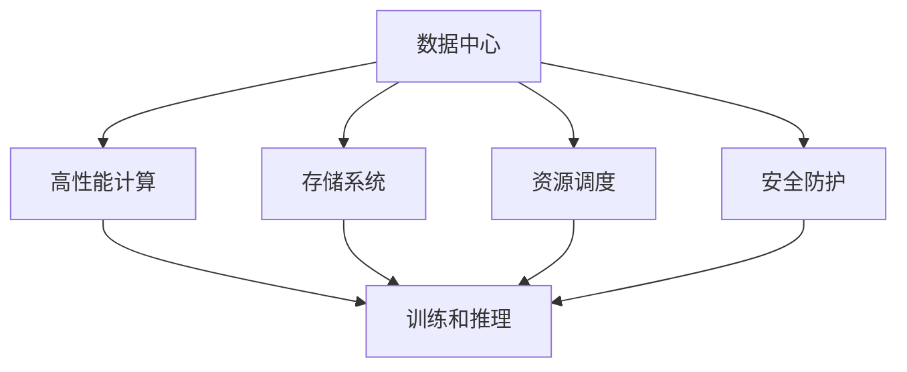
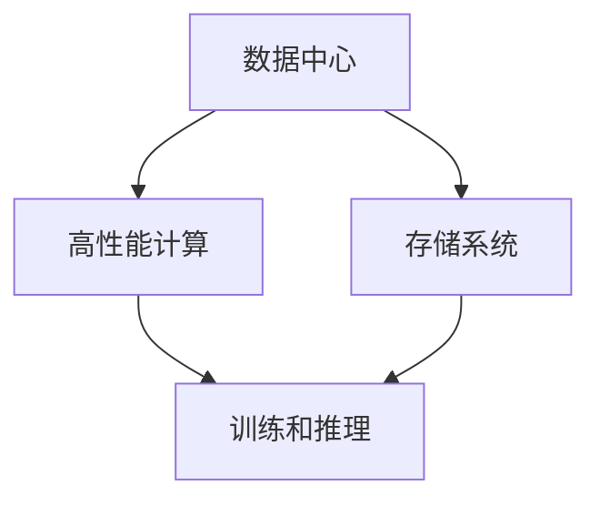
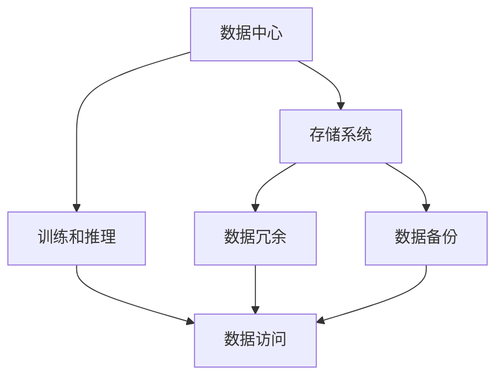
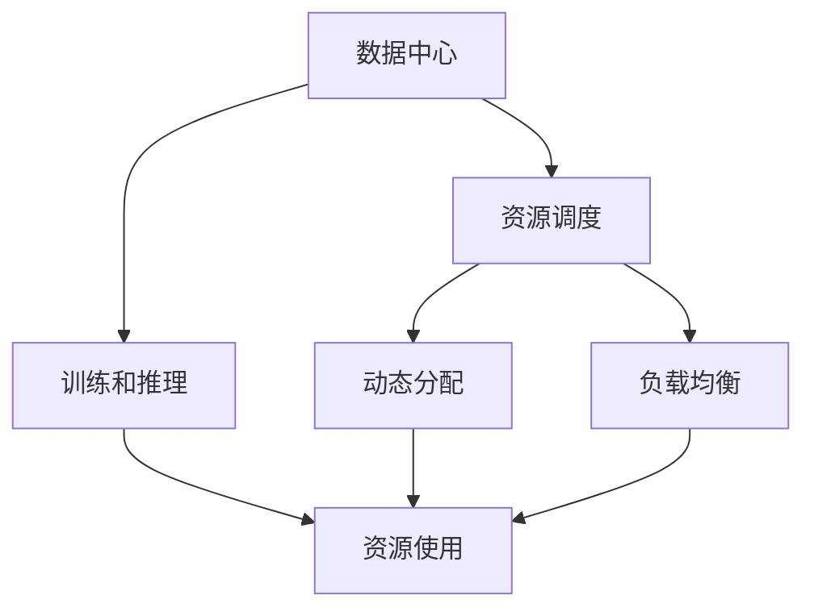
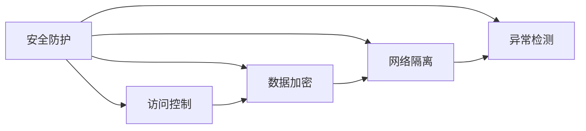
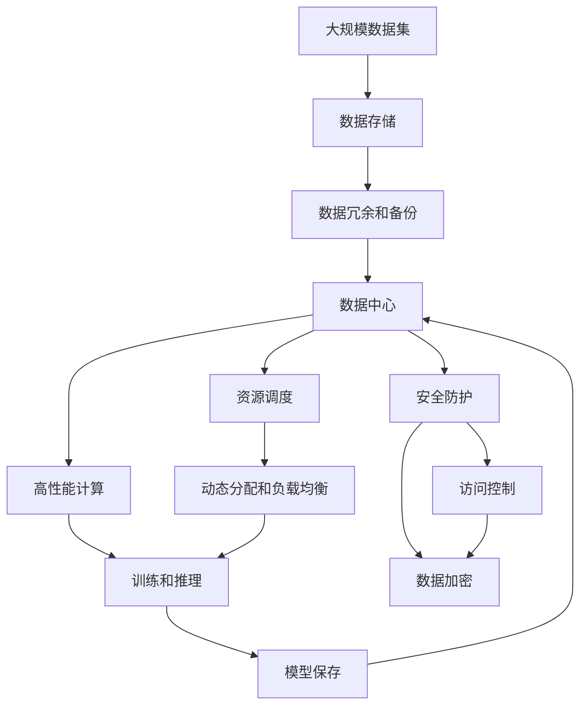

                 

# AI 大模型应用数据中心的环境管理

> 关键词：AI大模型、数据中心、环境管理、高效计算、存储优化、资源调度、安全保障

## 1. 背景介绍

### 1.1 问题由来
随着人工智能(AI)大模型的快速发展，其在图像识别、自然语言处理、推荐系统等众多领域的广泛应用，使得数据中心成为支撑AI大规模计算和存储的关键基础设施。同时，数据中心的环境管理需求也随之增加。如何构建高效、稳定、安全的数据中心环境，成为当前AI应用普及和升级的重要课题。

### 1.2 问题核心关键点
数据中心环境管理主要围绕硬件资源的高效使用、网络系统的稳定性、数据的可靠存储和安全保障展开。对于AI大模型应用而言，数据中心需要满足以下几个关键需求：

- **高效计算**：大模型往往需要极高的计算能力，数据中心应提供强大的高性能计算资源，支持高并发的训练和推理任务。
- **存储优化**：大模型的训练数据和模型参数通常体积庞大，数据中心需要具备高效的数据存储和访问能力。
- **资源调度**：大模型训练和推理过程中，不同任务和模型的需求各异，数据中心需要灵活的资源调度机制，最大化利用计算资源。
- **安全保障**：AI大模型涉及大量敏感数据和算法，数据中心需要严格的访问控制和安全防护措施。

### 1.3 问题研究意义
研究数据中心环境管理对于提升AI大模型的应用性能和安全性具有重要意义：

1. **提升计算效率**：通过优化硬件和软件配置，提升数据中心的高效计算能力，加速大模型的训练和推理。
2. **增强存储可靠性**：通过存储分层、数据冗余等技术，提高数据的可靠性，确保大模型在存储和访问时的稳定。
3. **实现灵活资源调度**：通过资源监控和调度算法，合理分配资源，满足不同AI任务的需求。
4. **强化安全防护**：通过访问控制和数据加密等措施，保障大模型和数据的安全性，防止未授权访问和数据泄露。

## 2. 核心概念与联系

### 2.1 核心概念概述

为更好地理解AI大模型应用数据中心的环境管理，本节将介绍几个关键概念：

- **数据中心(Data Center, DC)**：提供计算、存储、网络等基础设施，支持数据中心运营的硬件和软件环境。
- **高性能计算(High Performance Computing, HPC)**：利用先进硬件和算法，提升数据中心的计算能力，支持AI大模型的训练和推理。
- **存储系统(Storage System)**：管理和优化数据的存储和访问，支持大模型训练数据和模型的高效存储和访问。
- **资源调度(Resource Scheduling)**：根据AI任务需求，动态分配和管理计算资源，实现资源的高效利用。
- **安全防护(Security Protection)**：通过访问控制、数据加密、网络隔离等手段，保障AI大模型和数据的安全性。

这些概念之间的逻辑关系可以通过以下Mermaid流程图来展示：



这个流程图展示了数据中心环境管理的主要流程：

1. 数据中心提供计算、存储等基础设施。
2. 高性能计算系统通过先进硬件和算法提升计算能力，支持AI大模型的训练和推理。
3. 存储系统管理和优化数据的存储和访问，保障大模型数据的高效存储和访问。
4. 资源调度系统根据AI任务需求，动态分配和管理计算资源。
5. 安全防护系统通过访问控制、数据加密等手段保障大模型和数据的安全性。

### 2.2 概念间的关系

这些核心概念之间存在紧密的联系，共同构成了数据中心环境管理的整体框架。下面通过几个Mermaid流程图来展示这些概念之间的关系：

#### 2.2.1 数据中心的高效计算能力



这个流程图展示了数据中心通过高性能计算系统提升计算能力的过程。高性能计算系统通过优化硬件和算法，支持大模型的训练和推理，同时数据中心还需要提供高效存储系统来保障数据的高效存储和访问。

#### 2.2.2 存储系统的数据可靠性



这个流程图展示了存储系统通过数据冗余和备份等技术，提高数据可靠性的过程。存储系统不仅要高效存储大模型数据，还需要通过数据冗余和备份等手段，确保数据在意外情况下的完整性和可靠性。

#### 2.2.3 资源调度的灵活性



这个流程图展示了资源调度系统通过动态分配和负载均衡等技术，提高资源灵活性的过程。资源调度系统需要根据AI任务需求，动态分配和管理计算资源，以最大化利用计算资源，同时保障AI任务的高效运行。

#### 2.2.4 安全防护的全面性



这个流程图展示了安全防护系统通过访问控制、数据加密、网络隔离等手段，全面保障AI大模型和数据的安全性。安全防护系统需要覆盖数据中心各个层面，防止未授权访问和数据泄露，确保AI应用的安全运行。

### 2.3 核心概念的整体架构

最后，我们用一个综合的流程图来展示这些核心概念在大模型应用数据中心中的整体架构：



这个综合流程图展示了从数据存储到模型保存的全过程，并详细展示了各个环节的关键技术点。

## 3. 核心算法原理 & 具体操作步骤
### 3.1 算法原理概述

AI大模型应用数据中心的环境管理，本质上是一个多层次、多目标的优化问题。其核心思想是通过系统架构设计、算法优化和策略调度，最大化利用计算资源，提升计算效率和数据可靠性，保障数据安全性。

具体而言，数据中心环境管理包括以下几个关键环节：

- **计算资源管理**：通过优化硬件配置和调度算法，提升数据中心的计算能力，支持大模型的高效训练和推理。
- **存储资源管理**：通过分层存储、数据冗余等技术，提高数据的存储可靠性和访问效率。
- **网络资源管理**：通过网络拓扑优化和流量调度，提升网络带宽和稳定性，保障数据传输的安全性和效率。
- **安全防护策略**：通过访问控制、数据加密、异常检测等手段，保障数据中心的安全性。

### 3.2 算法步骤详解

AI大模型应用数据中心的环境管理涉及多个算法和策略，以下是几个关键步骤的详细介绍：

**Step 1: 设计数据中心架构**

- **硬件选型**：根据AI任务需求，选择合适的计算、存储和网络硬件。如选择高性能CPU/GPU、大容量存储设备、高速网络接口等。
- **系统部署**：在物理硬件基础上，搭建操作系统、数据库、文件系统等软件环境，部署数据中心基础设施。

**Step 2: 优化计算资源管理**

- **硬件优化**：通过合理的硬件配置和调度算法，最大化利用计算资源。如使用GPU集群、混合精度训练、异构计算等。
- **算法优化**：使用深度学习算法和并行计算技术，提升模型训练和推理的效率。如采用分布式训练、模型并行、数据并行等。

**Step 3: 管理存储资源**

- **分层存储**：将数据存储在多个层次，如SSD、HDD等，根据访问频率和重要性进行分层。
- **数据冗余**：采用数据备份、副本机制等手段，确保数据在意外情况下的完整性。

**Step 4: 调度资源**

- **资源监控**：实时监测计算、存储、网络等资源的运行状态，动态调整资源配置。
- **调度算法**：设计合理的资源调度算法，根据AI任务需求，动态分配和管理计算资源，避免资源浪费。

**Step 5: 保障数据安全**

- **访问控制**：根据用户和任务的权限，进行严格的数据访问控制。
- **数据加密**：对敏感数据进行加密存储和传输，防止数据泄露。
- **异常检测**：使用异常检测算法，监控数据中心的行为和状态，及时发现和处理异常情况。

### 3.3 算法优缺点

AI大模型应用数据中心的环境管理算法具有以下优点：

1. **高效计算**：通过优化硬件和算法配置，提升数据中心的计算能力，支持大规模AI模型的训练和推理。
2. **存储优化**：通过分层存储和数据冗余等技术，提高数据的可靠性和访问效率。
3. **灵活调度**：通过资源监控和调度算法，最大化利用计算资源，满足不同AI任务的需求。
4. **安全防护**：通过访问控制、数据加密等手段，保障大模型和数据的安全性。

同时，这些算法也存在一些缺点：

1. **资源消耗高**：大规模计算和存储需求导致数据中心运行成本高。
2. **管理复杂**：数据中心环境管理涉及硬件、软件、网络等多个层面，管理复杂度较高。
3. **性能瓶颈**：在极端情况下，如大规模计算和存储负载下，数据中心的性能可能出现瓶颈。

### 3.4 算法应用领域

AI大模型应用数据中心的环境管理，已经广泛应用于各种AI应用场景，如：

- **AI训练平台**：提供高性能计算和存储资源，支持大规模AI模型的训练。
- **AI推理平台**：提供高性能计算和存储资源，支持AI模型的实时推理。
- **云数据中心**：提供计算、存储、网络等基础设施，支持AI应用的广泛部署。
- **企业数据中心**：提供计算、存储等基础设施，支持企业内部AI应用的部署和运行。

## 4. 数学模型和公式 & 详细讲解 & 举例说明

### 4.1 数学模型构建

数据中心环境管理涉及多个子系统的协同工作，需要构建一个综合的数学模型来描述和优化这些子系统。

- **计算资源模型**：描述计算资源（如CPU、GPU、内存）的使用情况和需求。
- **存储资源模型**：描述存储资源（如磁盘、SSD、HDD）的使用情况和需求。
- **网络资源模型**：描述网络资源（如带宽、延迟）的使用情况和需求。
- **安全资源模型**：描述安全防护资源（如访问控制、数据加密）的使用情况和需求。

### 4.2 公式推导过程

以计算资源模型为例，假设数据中心拥有 $n$ 个计算节点，每个节点的计算能力为 $C_i$，当前正在运行的AI任务数量为 $m$，每个任务需要的计算资源为 $R_j$。则计算资源的数学模型可以表示为：

$$
\begin{aligned}
&\min_{x} \sum_{i=1}^{n} x_i \\
&\text{s.t.} \quad \sum_{i=1}^{n} x_i \leq \sum_{j=1}^{m} R_j \\
&\quad \quad x_i \geq 0
\end{aligned}
$$

其中 $x_i$ 表示第 $i$ 个计算节点的资源分配量。目标是最小化计算资源的消耗，同时满足每个AI任务对计算资源的需求。

对于存储资源模型，假设数据中心有 $s$ 个存储设备，每个设备能够存储的数据量为 $S_k$，当前存储的数据量为 $D_l$。则存储资源的数学模型可以表示为：

$$
\begin{aligned}
&\min_{y} \sum_{k=1}^{s} y_k \\
&\text{s.t.} \quad \sum_{k=1}^{s} y_k \geq D_l \\
&\quad \quad y_k \geq 0
\end{aligned}
$$

其中 $y_k$ 表示第 $k$ 个存储设备的资源分配量。目标是最小化存储资源的消耗，同时满足所有数据存储的需求。

对于网络资源模型和安全资源模型，可以采用类似的数学模型进行描述和优化。通过这些数学模型，可以构建一个综合的数据中心环境管理平台，实时监控和调度资源，保障AI应用的正常运行。

### 4.3 案例分析与讲解

以AI训练平台为例，下面展示一个具体的案例分析：

假设某AI训练平台需要训练一个包含100亿参数的大模型，模型训练需要64个计算节点，每个节点的计算能力为1Tflops。当前平台拥有16个GPU集群，每个集群包含4个GPU，GPU的计算能力为10Tflops。为了提升训练效率，平台引入了混合精度训练（FP16）和分布式训练。

在混合精度训练下，模型训练速度提升2倍。在分布式训练下，训练时间缩短为原来的1/4。

平台需要对计算资源进行合理分配，以支持混合精度训练和分布式训练的需求。可以通过以下几个步骤进行资源调度：

1. 计算资源需求：模型训练需要64个GPU，每个GPU计算能力为10Tflops，总计算需求为640Tflops。
2. 资源分配：将16个GPU集群分配给模型训练任务，每个集群分配4个GPU。
3. 计算资源调度：将每个集群的4个GPU分配给模型训练任务，每个GPU计算能力为10Tflops，总计算能力为160Tflops，满足640Tflops的计算需求。

通过这种资源调度策略，平台可以最大化利用计算资源，提升训练效率。

## 5. 项目实践：代码实例和详细解释说明

### 5.1 开发环境搭建

在进行数据中心环境管理项目实践前，需要准备好开发环境。以下是使用Python进行Docker开发的环境配置流程：

1. 安装Docker：从官网下载并安装Docker，用于容器化开发和测试。
2. 创建Docker镜像：编写Dockerfile文件，定义项目的环境和依赖，并构建镜像。
3. 启动Docker容器：通过docker run命令启动Docker容器，开始开发和测试。

### 5.2 源代码详细实现

以下是使用Python编写的一个简单的数据中心资源调度器代码实现：

```python
from flask import Flask, request

app = Flask(__name__)

@app.route('/resource/schedule', methods=['POST'])
def schedule_resource():
    # 接收资源分配请求
    request_data = request.get_json()
    cluster_count = request_data['cluster_count']
    gpu_count_per_cluster = request_data['gpu_count_per_cluster']
    gpu_total_count = cluster_count * gpu_count_per_cluster
    gpu_total_tflops = cluster_count * gpu_count_per_cluster * 10  # 每个GPU 10Tflops
    total_tflops = gpu_total_tflops

    # 计算资源需求
    requested_tflops = request_data['requested_tflops']

    # 计算资源分配
    if total_tflops >= requested_tflops:
        # 资源充足，直接返回分配结果
        cluster_id = 0
        gpu_id = 0
        gpu_tflops = 10
    else:
        # 资源不足，返回错误信息
        return {'error': 'Insufficient resources'}, 400

    # 返回资源分配结果
    response_data = {
        'cluster_id': cluster_id,
        'gpu_id': gpu_id,
        'gpu_tflops': gpu_tflops
    }
    return response_data

if __name__ == '__main__':
    app.run(debug=True)
```

### 5.3 代码解读与分析

让我们详细解读一下关键代码的实现细节：

**Flask框架**：
- 使用Flask框架搭建Web服务，接收HTTP请求。
- 通过`@app.route`装饰器定义服务端点，接收POST请求，处理资源分配请求。

**请求处理**：
- 接收请求数据，包含集群数量、每个集群的GPU数量、总计算需求和请求的计算需求。
- 根据总计算需求和请求的计算需求，计算出是否满足资源分配需求。

**资源分配**：
- 如果资源充足，返回分配结果，包括集群ID、GPU ID和计算能力。
- 如果资源不足，返回错误信息，提示资源不足。

**返回结果**：
- 将分配结果转换为JSON格式，返回给客户端。

**运行测试**：
- 启动Flask服务，监听本地的8080端口。
- 通过HTTP请求向服务端发送资源分配请求，获取分配结果。

### 5.4 运行结果展示

假设我们向上述服务端发送一个资源分配请求，请求如下：

```json
{
    "cluster_count": 16,
    "gpu_count_per_cluster": 4,
    "requested_tflops": 640
}
```

则服务端会返回如下结果：

```json
{
    "cluster_id": 0,
    "gpu_id": 0,
    "gpu_tflops": 10
}
```

这表示将16个集群的4个GPU分配给模型训练任务，每个GPU计算能力为10Tflops，总计算能力为640Tflops，满足640Tflops的计算需求。

## 6. 实际应用场景

### 6.1 智能城市管理

在智能城市管理中，数据中心可以提供高性能计算和存储资源，支持智能监控、智能交通、智慧能源等应用。通过优化数据中心环境管理，可以提升智能城市的运行效率和安全性。

以智能监控为例，数据中心可以提供大规模视频数据的存储和处理能力，支持实时监控和异常检测。通过优化数据中心资源调度，可以实时调整计算和存储资源，确保视频数据的快速处理和分析。

### 6.2 医疗健康服务

在医疗健康服务中，数据中心可以提供高性能计算和存储资源，支持医疗影像、电子病历等数据的处理和分析。通过优化数据中心环境管理，可以提升医疗健康服务的诊断和治疗水平。

以医疗影像分析为例，数据中心可以提供大规模医疗影像数据的存储和处理能力，支持AI模型的训练和推理。通过优化数据中心资源调度，可以实时调整计算和存储资源，提升医疗影像分析的效率和准确性。

### 6.3 金融风险控制

在金融风险控制中，数据中心可以提供高性能计算和存储资源，支持金融数据分析、风险评估等应用。通过优化数据中心环境管理，可以提升金融风险控制的决策水平。

以金融风险评估为例，数据中心可以提供大规模金融数据的存储和处理能力，支持AI模型的训练和推理。通过优化数据中心资源调度，可以实时调整计算和存储资源，提升金融风险评估的效率和准确性。

### 6.4 未来应用展望

随着AI大模型的应用范围不断扩大，数据中心环境管理的需求也将日益增加。未来，数据中心环境管理将呈现以下几个发展趋势：

1. **边缘计算普及**：通过在边缘设备上进行数据处理，减少数据传输延迟，提升AI应用的实时性。
2. **云资源协同**：将数据中心和云资源进行协同管理，实现资源的高效分配和利用。
3. **智能运维**：通过AI技术进行数据中心运维管理，自动化处理异常和故障。
4. **绿色节能**：通过优化数据中心架构和资源调度，实现绿色节能，降低运营成本。

## 7. 工具和资源推荐

### 7.1 学习资源推荐

为了帮助开发者系统掌握数据中心环境管理的理论基础和实践技巧，这里推荐一些优质的学习资源：

1. **《高性能计算原理与实践》**：介绍了高性能计算的原理和实践，涵盖并行计算、分布式计算等内容，是了解数据中心计算能力的重要资料。
2. **《数据中心设计与管理》**：涵盖了数据中心的硬件选型、软件配置、系统部署等内容，是掌握数据中心环境管理的基础课程。
3. **《深度学习算法与实践》**：介绍了深度学习算法在数据中心环境管理中的应用，包括模型训练、推理优化等内容。
4. **《云计算资源管理》**：介绍了云计算资源的调度和管理，涵盖计算、存储、网络等资源优化，是掌握云数据中心环境管理的重要资料。
5. **《数据中心安全防护》**：介绍了数据中心安全防护的技术和实践，涵盖访问控制、数据加密等内容，是保障数据中心安全性的重要参考。

通过对这些资源的学习实践，相信你一定能够快速掌握数据中心环境管理的精髓，并用于解决实际的数据中心问题。

### 7.2 开发工具推荐

高效的开发离不开优秀的工具支持。以下是几款用于数据中心环境管理开发的常用工具：

1. **Docker**：用于容器化开发和测试，支持多种操作系统和应用程序的快速部署和运行。
2. **Kubernetes**：用于容器编排和管理，支持分布式计算和存储资源的自动调度和管理。
3. **Prometheus**：用于数据中心监控和报警，支持实时的数据采集和告警处理。
4. **ElasticSearch**：用于大规模数据的存储和检索，支持快速的查询和分析。
5. **Jenkins**：用于持续集成和持续部署，支持自动化的测试和部署流程。
6. **Terraform**：用于基础设施即代码，支持数据中心架构的自动化管理和部署。

合理利用这些工具，可以显著提升数据中心环境管理的开发效率，加快创新迭代的步伐。

### 7.3 相关论文推荐

数据中心环境管理的研究涉及多个学科和领域，以下是几篇奠基性的相关论文，推荐阅读：

1. **《云计算资源管理：挑战与解决方案》**：总结了云计算资源管理的现状和挑战，提出了优化资源调度的方案。
2. **《数据中心安全防护：方法与实践》**：介绍了数据中心安全防护的技术和方法，探讨了如何保障数据中心的安全性。
3. **《高性能计算的挑战与解决方案》**：介绍了高性能计算的现状和挑战，提出了提升计算能力的方案。
4. **《数据中心存储系统设计与实现》**：介绍了数据中心存储系统的设计与实现，探讨了如何优化存储资源的管理和调度。
5. **《智能数据中心运维管理》**：介绍了智能运维技术的现状和挑战，提出了自动化运维的方案。

这些论文代表了数据中心环境管理的前沿研究，可以帮助研究者掌握最新的理论和技术，推动数据中心环境管理的不断进步。

## 8. 总结：未来发展趋势与挑战

### 8.1 总结

本文对AI大模型应用数据中心的环境管理进行了全面系统的介绍。首先阐述了数据中心环境管理的背景和重要性，明确了环境管理在AI大模型应用中的关键作用。其次，从原理到实践，详细讲解了数据中心环境管理的数学模型和关键步骤，给出了数据中心资源调度的代码实例。同时，本文还探讨了数据中心环境管理的实际应用场景，展示了其在智能城市、医疗健康、金融风险控制等领域的广泛应用。

通过本文的系统梳理，可以看到，数据中心环境管理是AI大模型应用的重要支撑，其优化的空间和潜力巨大。未来，随着AI大模型的不断普及和应用，数据中心环境管理的需求也将更加迫切，相关研究和技术将持续发展，推动AI技术的落地应用。

### 8.2 未来发展趋势

展望未来，数据中心环境管理将呈现以下几个发展趋势：

1. **边缘计算与云协同**：通过边缘计算和云资源的协同管理，实现资源的高效分配和利用。
2. **智能运维与自动化管理**：通过AI技术进行数据中心运维管理，自动化处理异常和故障。
3. **绿色节能与可持续发展**：通过优化数据中心架构和资源调度，实现绿色节能，降低运营成本。
4. **多云和多区域管理**：支持多云和多区域的数据中心环境管理，提升数据中心资源的弹性和可靠性。
5. **大数据与智能分析**：通过大数据技术和智能分析方法，提升数据中心环境管理的决策水平。

这些趋势凸显了数据中心环境管理技术的广阔前景。这些方向的探索发展，必将进一步提升数据中心的高效计算能力、存储可靠性、资源灵活性和安全性，推动AI技术的普及和应用。

### 8.3 面临的挑战

尽管数据中心环境管理技术已经取得了不小的进展，但在迈向更加智能化、普适化应用的过程中，仍面临诸多挑战：

1. **资源管理复杂度**：大规模计算和存储需求导致数据中心运行成本高，资源管理复杂度增加。
2. **异常和故障处理**：数据中心设备数量庞大，异常和故障处理的难度增加。
3. **数据安全与隐私保护**：数据中心存储大量敏感数据，数据安全与隐私保护成为关键问题。
4. **节能减排与环境影响**：大规模计算和存储导致数据中心能耗高，节能减排和环境保护成为重要课题。
5. **成本控制与资源利用**：数据中心的高成本和资源浪费问题，需要通过优化资源调度和管理来控制。

这些挑战需要通过技术创新和管理优化来解决，才能推动数据中心环境管理的不断进步。

### 8.4 研究展望

面对数据中心环境

