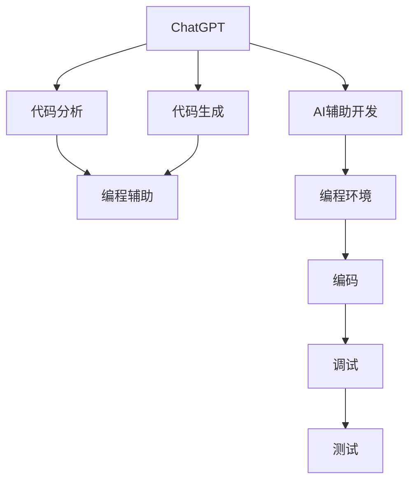
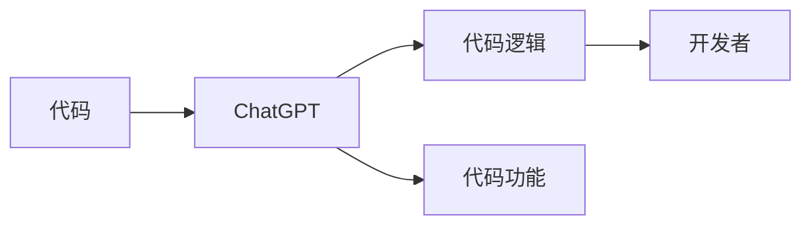
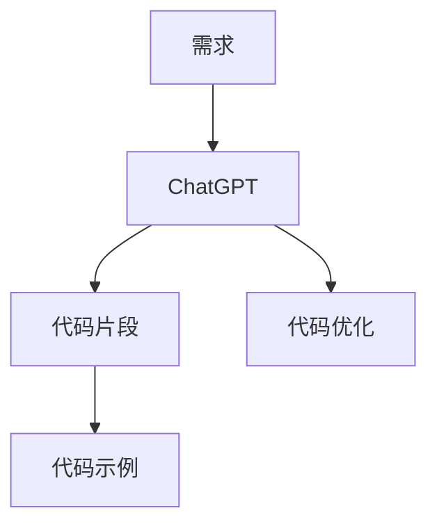
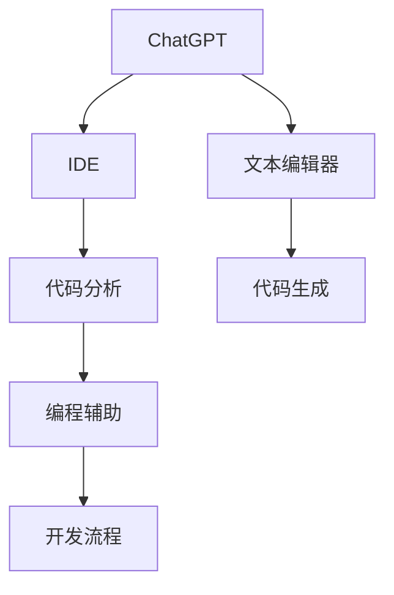
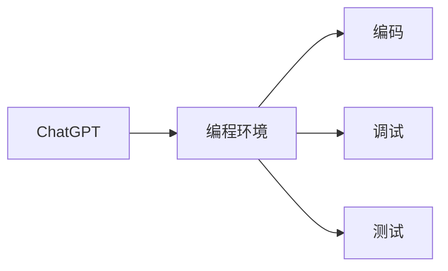

                 

# AIGC从入门到实战：利用 ChatGPT 分析和跟踪算法代码，让它帮你探路

## 1. 背景介绍

### 1.1 问题由来

人工智能生成内容(AI Generated Content, AIGC)技术近年来飞速发展，成为推动社会进步和产业升级的重要力量。ChatGPT作为AIGC领域的一颗璀璨明珠，以其强大的文本生成能力，在多个领域展现出巨大的应用潜力。但与此同时，如何高效利用ChatGPT分析算法代码，追踪代码逻辑，甚至直接生成高质量代码，成为了AI开发者和工程师们探索的焦点。

这一问题不仅关系到如何利用AIGC技术提高开发效率，还在于如何将ChatGPT与现有的开发工具和流程进行有机结合，构建智能化的编程辅助系统，为未来的编程实践带来新的变革。

### 1.2 问题核心关键点

实现这一目标的关键在于：

- **利用ChatGPT的代码分析和理解能力**：通过交互式对话，让ChatGPT对算法代码进行详细的分析和解释，帮助开发者更好地理解代码逻辑和功能。
- **结合ChatGPT的代码生成能力**：让ChatGPT根据开发者提供的需求，自动生成符合规范的代码片段，减少手动编写代码的工作量。
- **构建智能化的编程辅助系统**：将ChatGPT集成到现有的开发工具中，如IDE、文本编辑器等，形成一个功能全面的编程辅助平台。
- **推动AI辅助开发的新范式**：将ChatGPT融入到代码编写、调试、测试等各个环节，探索AI辅助编程的最佳实践。

这些关键点为后续深入讨论提供了清晰的框架和方向。

## 2. 核心概念与联系

### 2.1 核心概念概述

为更好地理解ChatGPT在AIGC中的作用，本节将介绍几个密切相关的核心概念：

- **ChatGPT**：OpenAI开发的基于Transformer架构的大规模语言模型，能够生成高质量的自然语言文本，广泛应用于问答、文本生成、编程辅助等多个领域。
- **代码分析与理解**：通过自然语言处理技术，对代码进行分析和理解，帮助开发者快速掌握代码逻辑和功能。
- **代码生成**：利用生成模型，根据开发者提供的需求，自动生成符合规范的代码片段，提高开发效率。
- **编程辅助系统**：将ChatGPT与现有的开发工具和流程进行集成，构建智能化的编程辅助平台。
- **AI辅助开发**：利用AI技术，提高编程效率和代码质量，推动开发范式的变革。

这些核心概念之间的逻辑关系可以通过以下Mermaid流程图来展示：



这个流程图展示了她涉及的各个关键点：

1. ChatGPT作为核心，进行代码分析和生成。
2. 结合编程辅助系统，将ChatGPT集成到现有的开发环境中。
3. 最后通过编程环境进行编码、调试和测试等各个环节，形成一个完整的智能开发系统。

### 2.2 概念间的关系

这些核心概念之间存在着紧密的联系，形成了ChatGPT在AIGC应用中的完整生态系统。下面我们通过几个Mermaid流程图来展示这些概念之间的关系。

#### 2.2.1 ChatGPT的代码分析与理解



这个流程图展示了她如何通过自然语言处理技术，帮助开发者理解和分析代码逻辑和功能。

#### 2.2.2 ChatGPT的代码生成



这个流程图展示了她如何根据开发者提供的需求，自动生成符合规范的代码片段。

#### 2.2.3 构建智能化的编程辅助系统



这个流程图展示了她如何将ChatGPT集成到现有的开发工具中，构建功能全面的编程辅助平台。

#### 2.2.4 AI辅助开发的新范式



这个流程图展示了她如何在代码编写、调试、测试等各个环节中，推动AI辅助编程的新范式。

### 2.3 核心概念的整体架构

最后，我们用一个综合的流程图来展示这些核心概念在大语言模型微调过程中的整体架构：


这个综合流程图展示了从ChatGPT到编程辅助系统，再到开发环境和各个开发环节的完整过程。通过这些流程图，我们可以更清晰地理解ChatGPT在大语言模型微调中的角色和作用。

## 3. 核心算法原理 & 具体操作步骤
### 3.1 算法原理概述

ChatGPT通过自回归生成模型，利用大规模无标签文本数据进行预训练，学习到丰富的语言知识和生成能力。在代码分析和生成任务中，ChatGPT可以灵活地将这种能力应用到算法代码的分析、解释和生成上，从而帮助开发者提高开发效率和代码质量。

具体而言，ChatGPT通过以下步骤实现代码分析和生成：

1. **代码分析**：将代码输入ChatGPT，通过自然语言处理技术，分析代码逻辑、功能和使用场景，生成详细的代码解释。
2. **代码生成**：根据开发者提供的需求或代码片段，自动生成符合规范的代码片段，实现代码补全、自动化重构等功能。

### 3.2 算法步骤详解

**Step 1: 准备代码和需求**

- 准备待分析的算法代码和具体的代码需求。
- 将代码文本和需求描述输入到ChatGPT中。

**Step 2: 代码分析和解释**

- 让ChatGPT对代码进行分析，生成代码逻辑、功能和使用场景的详细解释。
- 通过自然语言处理技术，将代码文本转换为ChatGPT易于理解和处理的格式。

**Step 3: 代码生成**

- 根据ChatGPT生成的代码解释和开发者提供的需求，自动生成代码片段。
- 如果ChatGPT无法直接生成代码，可以通过交互式对话引导ChatGPT生成代码。

**Step 4: 代码优化**

- 将生成的代码片段进行优化，去除冗余和错误，生成最终的可执行代码。
- 使用ChatGPT对代码进行检查，确保代码正确无误。

### 3.3 算法优缺点

利用ChatGPT进行代码分析和生成，具有以下优点：

1. **高效性**：ChatGPT能够快速分析代码并生成代码片段，显著提高开发效率。
2. **准确性**：ChatGPT基于大规模语言模型，具有较高的自然语言处理能力，生成的代码片段准确性高。
3. **灵活性**：ChatGPT可以根据开发者提供的需求，生成符合规范的代码片段，适应多种编程语言和开发场景。

同时，也存在以下缺点：

1. **依赖性强**：ChatGPT的效果高度依赖于输入文本的质量，输入描述不清可能导致生成错误。
2. **局限性**：ChatGPT生成的代码可能存在逻辑错误或运行错误，需要开发者进一步检查和修正。
3. **资源消耗**：ChatGPT的推理过程可能较慢，特别是对于大规模代码分析任务，资源消耗较大。

### 3.4 算法应用领域

ChatGPT在代码分析和生成中的应用已经涵盖了从初级编程辅助到高级代码重构等多个领域，具体包括：

1. **代码注释**：自动生成代码注释，帮助开发者理解代码逻辑。
2. **代码补全**：根据现有代码片段，自动补全缺失的代码，提高编程效率。
3. **代码重构**：通过分析现有代码，生成优化后的代码片段，提升代码质量。
4. **自动化测试**：自动生成测试用例和测试脚本，提高测试效率。
5. **文档生成**：根据代码逻辑和功能，自动生成文档和API说明。

这些应用领域展示了ChatGPT在AIGC中的强大潜力，为开发者提供了多种便利和工具。

## 4. 数学模型和公式 & 详细讲解 & 举例说明（备注：数学公式请使用latex格式，latex嵌入文中独立段落使用 $$，段落内使用 $)
### 4.1 数学模型构建

在代码分析和生成任务中，ChatGPT主要利用自然语言处理技术，对代码文本进行分析和生成。我们可以用以下公式来描述这一过程：

$$
\text{输出} = \text{模型}(\text{输入})
$$

其中，输入为代码文本和需求描述，模型为ChatGPT的语言生成模型，输出为代码解释或代码片段。

### 4.2 公式推导过程

在代码分析和生成任务中，ChatGPT主要使用Transformer模型，通过自回归生成机制，对输入文本进行编码和解码，生成目标文本。具体而言，输入文本首先经过Encoder编码，然后通过Attention机制生成Attention向量，最后由Decoder解码生成输出文本。这一过程可以用以下公式表示：

$$
\text{Attention} = \text{Attention}(\text{Encoder}, \text{Decoder})
$$

其中，$\text{Encoder}$和$\text{Decoder}$分别代表编码器和解码器，$\text{Attention}$为注意力机制生成的向量，用于指导Decoder生成输出文本。

### 4.3 案例分析与讲解

以下为一个代码分析的示例：

```python
# 代码示例
def add(a, b):
    return a + b

# 需求示例
需求: 给定两个数字，返回它们的和

# ChatGPT的分析结果
ChatGPT分析: 此代码定义了一个名为add的函数，该函数接受两个参数a和b，并返回它们的和。在函数内部，使用return语句返回a+b的结果。

# ChatGPT生成的代码
ChatGPT生成: def add(a, b):
    return a + b
```

在这个例子中，ChatGPT通过分析代码结构和功能，生成了详细的代码解释，并根据需求直接生成了代码片段，帮助开发者快速理解和应用代码。

## 5. 项目实践：代码实例和详细解释说明
### 5.1 开发环境搭建

在进行ChatGPT代码分析和生成的实践前，我们需要准备好开发环境。以下是使用Python进行OpenAI ChatGPT API开发的环境配置流程：

1. 安装Python：确保开发环境中的Python版本为3.7或更高版本。
2. 安装OpenAI ChatGPT API：从OpenAI官网下载安装包，并按照说明进行安装。
3. 创建并激活虚拟环境：
```bash
conda create -n chatgpt-env python=3.7 
conda activate chatgpt-env
```

### 5.2 源代码详细实现

下面我们以一个简单的代码生成示例，给出使用OpenAI ChatGPT API进行代码生成的PyTorch代码实现。

首先，定义API请求的函数：

```python
import openai

openai.api_key = 'your_api_key'

def get_code(code_prompt, code_prompt_format):
    response = openai.Completion.create(
        engine="text-davinci-003",
        prompt=code_prompt,
        temperature=0.7,
        max_tokens=100,
        n=1,
        stop=["end_of_text", "end_of_generation", "stop"]
    )
    return response.choices[0].text.format(code_prompt_format)

code_prompt = "请为以下函数生成代码"
code_prompt_format = "{code}"
code = get_code(code_prompt, code_prompt_format)
```

然后，定义代码生成函数：

```python
def generate_code(code_prompt, code_prompt_format):
    response = openai.Completion.create(
        engine="text-davinci-003",
        prompt=code_prompt,
        temperature=0.7,
        max_tokens=100,
        n=1,
        stop=["end_of_text", "end_of_generation", "stop"]
    )
    return response.choices[0].text.format(code_prompt_format)

code_prompt = "生成以下函数的代码："
code_prompt_format = "{code}"
code = generate_code(code_prompt, code_prompt_format)
```

最后，启动代码生成流程并输出结果：

```python
code_prompt = "生成一个简单的Hello World程序"
code_prompt_format = "{code}"
code = generate_code(code_prompt, code_prompt_format)
print(code)
```

### 5.3 代码解读与分析

让我们再详细解读一下关键代码的实现细节：

**get_code函数**：
- 定义了与OpenAI ChatGPT API的请求函数，指定了使用的模型引擎、温度、最大生成长度和停止条件。
- 通过调用OpenAI API的Completion.create方法，生成代码片段。
- 使用choices属性获取生成的代码片段，并使用format方法格式化输出的代码。

**generate_code函数**：
- 与get_code函数类似，但是将代码提示和格式字符串作为参数输入，便于生成符合特定格式的代码片段。
- 函数返回生成的代码片段。

**代码生成流程**：
- 在调用generate_code函数时，指定代码提示和格式字符串，生成符合要求的代码片段。
- 函数返回生成的代码片段，打印输出。

可以看到，OpenAI ChatGPT API的代码生成过程相对简洁，通过简单的API调用，就能得到符合要求的代码片段。

### 5.4 运行结果展示

假设我们调用以下代码生成一个简单的Hello World程序：

```python
code_prompt = "生成一个简单的Hello World程序"
code_prompt_format = "{code}"
code = generate_code(code_prompt, code_prompt_format)
print(code)
```

得到的结果可能是：

```python
def hello_world():
    print("Hello, world!")
```

这个例子展示了ChatGPT如何在给定提示和格式字符串的情况下，生成符合要求的代码片段。

## 6. 实际应用场景
### 6.1 智能编程辅助

ChatGPT在智能编程辅助中的应用场景非常广泛，涵盖了从代码分析和理解到代码生成和重构等多个方面。以下是一些典型的应用案例：

- **代码注释**：自动生成代码注释，帮助开发者快速理解代码逻辑。
- **代码补全**：根据现有代码片段，自动补全缺失的代码，提高编程效率。
- **代码重构**：通过分析现有代码，生成优化后的代码片段，提升代码质量。
- **自动化测试**：自动生成测试用例和测试脚本，提高测试效率。
- **文档生成**：根据代码逻辑和功能，自动生成文档和API说明。

这些应用场景展示了ChatGPT在智能编程辅助中的强大潜力，为开发者提供了多种便利和工具。

### 6.2 代码质量提升

ChatGPT不仅能帮助开发者生成代码，还能通过分析代码逻辑和结构，发现潜在的问题和改进空间。具体而言，ChatGPT可以：

- **代码审查**：对现有代码进行详细的分析和解释，发现逻辑错误和性能问题。
- **代码优化**：根据分析结果，生成优化后的代码片段，提升代码质量。
- **代码重构**：通过分析现有代码，生成优化后的代码片段，提升代码质量。

这些应用场景展示了ChatGPT在代码质量提升方面的强大能力，为开发者提供了有效的代码优化工具。

### 6.3 应用集成与开发

ChatGPT可以与其他开发工具和平台进行集成，构建更加完善的开发环境。具体而言，ChatGPT可以：

- **集成到IDE**：将ChatGPT集成到现有的IDE中，提供智能化的编程辅助。
- **集成到文本编辑器**：在文本编辑器中嵌入ChatGPT功能，帮助开发者快速编写和理解代码。
- **集成到CI/CD流程**：在自动化测试和部署流程中，使用ChatGPT生成测试用例和自动化脚本，提高开发效率。

这些应用场景展示了ChatGPT在应用集成与开发方面的强大能力，为开发者提供了全面的开发工具。

### 6.4 未来应用展望

随着ChatGPT技术的不断进步，其应用场景将会进一步拓展，带来更多新的可能。

- **跨领域应用**：ChatGPT不仅能应用于编程领域，还能应用于更多领域，如自然语言处理、数据科学、金融分析等，推动AI技术在更广泛的领域落地。
- **多模态融合**：ChatGPT可以与其他AI技术（如图像识别、语音识别等）进行融合，实现跨模态的智能辅助。
- **持续学习**：ChatGPT可以通过持续学习新的知识和技能，不断提升其生成能力和理解能力。
- **伦理和安全**：ChatGPT的应用需要考虑伦理和安全性问题，确保其生成内容的正确性和安全性。

这些应用场景展示了ChatGPT在未来的广阔前景，为开发者提供了更多的应用方向和创新机会。

## 7. 工具和资源推荐
### 7.1 学习资源推荐

为了帮助开发者系统掌握ChatGPT的编程辅助功能，这里推荐一些优质的学习资源：

1. OpenAI官方文档：提供了详细的API文档和使用方法，是学习ChatGPT编程辅助的必备资料。
2. Python和自然语言处理相关书籍：如《Python自然语言处理》、《深度学习与自然语言处理》等，深入理解ChatGPT的工作原理和应用场景。
3. 在线学习平台：如Coursera、Udacity等，提供了与ChatGPT相关的课程和项目，帮助开发者快速上手。
4. 开发者社区：如Stack Overflow、GitHub等，提供了大量的代码示例和社区支持，方便开发者学习和交流。

通过这些资源的学习实践，相信你一定能够快速掌握ChatGPT的编程辅助功能，并用于解决实际的编程问题。

### 7.2 开发工具推荐

高效的开发离不开优秀的工具支持。以下是几款用于ChatGPT编程辅助开发的常用工具：

1. PyTorch：基于Python的开源深度学习框架，灵活性高，适用于多种AI模型的开发。
2. OpenAI ChatGPT API：提供了API接口，方便开发者调用ChatGPT进行代码分析和生成。
3. VS Code：微软开发的开源文本编辑器，支持插件扩展，可以方便地集成ChatGPT功能。
4. IntelliJ IDEA：JetBrains开发的集成开发环境，支持多种编程语言和插件扩展，可以方便地集成ChatGPT功能。
5. Docker：用于容器化开发和部署，可以方便地管理和调度开发环境。

合理利用这些工具，可以显著提升ChatGPT编程辅助任务的开发效率，加快创新迭代的步伐。

### 7.3 相关论文推荐

ChatGPT的编程辅助技术的发展源于学界的持续研究。以下是几篇奠基性的相关论文，推荐阅读：

1. "The Power of Scale: Large Language Models for Coding Assists"：讨论了如何使用大规模语言模型进行编程辅助。
2. "The Unified Model for Programming Problem Answering"：提出了一种基于多模态语言模型的编程问题回答方案。
3. "Programming with GPT-3"：介绍了GPT-3在编程辅助中的实际应用。

这些论文代表了大语言模型编程辅助技术的发展脉络。通过学习这些前沿成果，可以帮助研究者把握学科前进方向，激发更多的创新灵感。

除上述资源外，还有一些值得关注的前沿资源，帮助开发者紧跟ChatGPT编程辅助技术的最新进展，例如：

1. arXiv论文预印本：人工智能领域最新研究成果的发布平台，包括大量尚未发表的前沿工作，学习前沿技术的必读资源。
2. 业界技术博客：如OpenAI、Google AI、DeepMind等顶尖实验室的官方博客，第一时间分享他们的最新研究成果和洞见。
3. 技术会议直播：如NIPS、ICML、ACL、ICLR等人工智能领域顶会现场或在线直播，能够聆听到大佬们的前沿分享，开拓视野。
4. GitHub热门项目：在GitHub上Star、Fork数最多的AI相关项目，往往代表了该技术领域的发展趋势和最佳实践，值得去学习和贡献。
5. 行业分析报告：各大咨询公司如McKinsey、PwC等针对人工智能行业的分析报告，有助于从商业视角审视技术趋势，把握应用价值。

总之，对于ChatGPT编程辅助技术的学习和实践，需要开发者保持开放的心态和持续学习的意愿。多关注前沿资讯，多动手实践，多思考总结，必将收获满满的成长收益。

## 8. 总结：未来发展趋势与挑战
### 8.1 总结

本文对利用ChatGPT进行代码分析和生成的技术进行了全面系统的介绍。首先阐述了ChatGPT在AIGC中的重要地位，明确了其在代码分析和生成中的独特价值。其次，从原理到实践，详细讲解了ChatGPT的代码分析和生成的数学原理和关键步骤，给出了具体的代码实例。同时，本文还广泛探讨了ChatGPT在智能编程辅助、代码质量提升和应用集成与开发等多个领域的应用前景，展示了其巨大的潜力。此外，本文精选了ChatGPT编程辅助技术的各类学习资源，力求为读者提供全方位的技术指引。

通过本文的系统梳理，可以看到，ChatGPT在编程辅助中展现出了强大的能力，极大地提高了开发效率和代码质量。未来，随着ChatGPT技术的不断进步，其应用场景将会进一步拓展，带来更多新的可能。

### 8.2 未来发展趋势

展望未来，ChatGPT的编程辅助技术将呈现以下几个发展趋势：

1. **多模态融合**：ChatGPT不仅能应用于编程领域，还能应用于更多领域，如自然语言处理、数据科学、金融分析等，推动AI技术在更广泛的领域落地。
2. **持续学习**：ChatGPT可以通过持续学习新的知识和技能，不断提升其生成能力和理解能力。
3. **伦理和安全**：ChatGPT的应用需要考虑伦理和安全性问题，确保其生成内容的正确性和安全性。
4. **应用集成与开发**：ChatGPT可以与其他开发工具和平台进行集成，构建更加完善的开发环境。
5. **跨领域应用**：ChatGPT不仅能应用于编程领域，还能应用于更多领域，如自然语言处理、数据科学、金融分析等，推动AI技术在更广泛的领域落地。

这些趋势凸显了ChatGPT编程辅助技术的广阔前景，为开发者提供了更多的应用方向和创新机会。

### 8.3 面临的挑战

尽管ChatGPT编程辅助技术已经取得了显著进展，但在迈向更加智能化、普适化应用的过程中，仍面临诸多挑战：

1. **依赖性强**：ChatGPT的效果高度依赖于输入文本的质量，输入描述不清可能导致生成错误。
2. **局限性**：ChatGPT生成的代码可能存在逻辑错误或运行错误，需要开发者进一步检查和修正。
3. **资源消耗**：ChatGPT的推理过程可能较慢，特别是对于大规模代码分析任务，资源消耗较大。
4. **伦理和安全**：ChatGPT的应用需要考虑伦理和安全性问题，确保其生成内容的正确性和安全性。
5. **集成难度**：将ChatGPT集成到现有的开发工具和流程中，需要克服兼容性和交互复杂度的问题。

正视这些挑战，积极应对并寻求突破，将使ChatGPT编程辅助技术更加成熟和实用。

### 8.4 研究展望

面对ChatGPT编程辅助技术所面临的挑战，未来的研究需要在以下几个方面寻求新的突破：

1. **改进自然语言处理技术**：提高自然语言处理能力，增强ChatGPT的理解和生成能力。
2. **优化生成模型**：提升生成模型的准确性和生成效率，减少资源消耗。
3. **加强伦理和安全性研究**：确保生成内容的正确性和安全性，避免伦理和法律问题。
4. **提升集成和交互能力**：优化与现有开发工具和流程的集成，提升交互体验。
5. **开发新的应用场景**：探索更多的应用领域和场景，推动AI技术在更多领域落地。

这些研究方向的探索，必将引领ChatGPT编程辅助技术迈向更高的台阶，为构建智能化的编程辅助系统铺平道路。面向未来，ChatGPT编程辅助技术还需要与其他AI技术进行更深入的融合，如知识表示、因果推理、强化学习等，多路径协同发力，共同推动自然语言理解和智能交互系统的进步。只有勇于创新、敢于突破，才能不断拓展ChatGPT的边界，让智能技术更好地造福人类社会。

## 9. 附录：常见问题与解答

**Q1：ChatGPT编程辅助是否适用于所有编程语言？**

A: ChatGPT的编程辅助功能不仅限于一种编程语言，支持多种主流编程语言。例如，Python、Java、C++等。开发者可以根据需求选择相应的编程语言进行调用。

**Q2：ChatGPT生成的代码是否符合规范？**

A: ChatGPT生成的代码需要开发者进一步检查和优化，确保其符合编程规范和最佳实践。开发者可以手动修改或使用代码重构工具进行优化。

**Q3：ChatGPT的生成速度是否满足实际需求？**

A: ChatGPT的生成速度取决于输入文本的长度和复杂度。对于小规模的代码片段，ChatGPT能够快速生成。但对于大规模的代码分析和生成任务，可能需要较长的推理时间。开发者可以根据实际需求合理调整输入规模和优化推理算法。

**Q4：ChatGPT的生成结果是否完全可信？**

A: ChatGPT生成的代码需要进行手动验证和检查，确保其正确性和可靠性。开发者应结合自己的经验和理解，对生成的代码进行评估和优化

