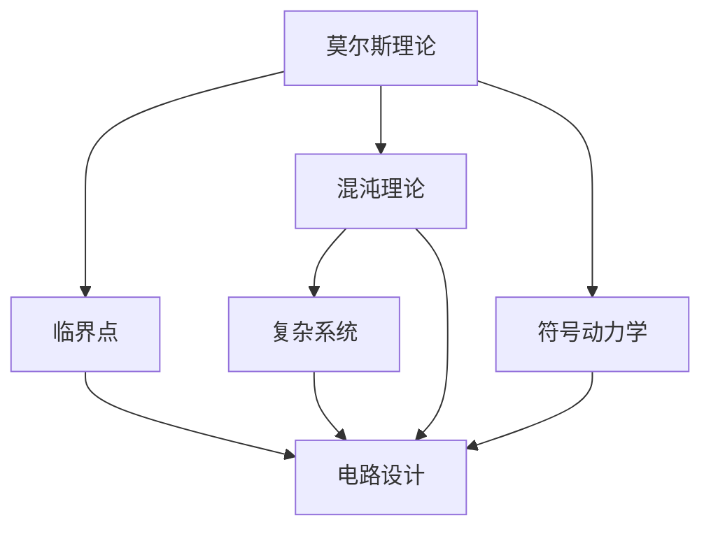

                 

# 莫尔斯理论与临界点理论

> 关键词：莫尔斯理论,临界点,复杂度,混沌理论,符号动力学,电路设计

## 1. 背景介绍

### 1.1 问题由来

莫尔斯理论和临界点理论是混沌理论的重要分支，广泛应用于电路设计、控制理论、复杂系统研究等领域。在计算机科学与软件工程中，这些理论提供了研究复杂系统动态行为和临界现象的重要工具。理解这些理论的原理和应用，对于设计和优化复杂系统、提高系统的鲁棒性和适应性具有重要意义。

### 1.2 问题核心关键点

莫尔斯理论主要关注系统的动态行为和拓扑结构，通过研究系统的运动轨迹和稳定状态，揭示系统的复杂性和混沌行为。临界点理论则专注于系统的状态变化和相变，通过分析系统在临界状态下的行为特征，探索系统的性能和稳定性。两者结合，可以更全面地理解复杂系统的动态行为和相变过程。

## 2. 核心概念与联系

### 2.1 核心概念概述

为更好地理解莫尔斯理论和临界点理论，本节将介绍几个密切相关的核心概念：

- 莫尔斯理论：由苏格兰数学家约翰·莫尔斯提出，主要研究系统的运动轨迹和稳定状态，通过描述系统的动态行为来揭示其复杂性和混沌行为。
- 临界点：系统从一种状态过渡到另一种状态的关键点，通常是系统性能和稳定性发生急剧变化的点。
- 混沌理论：研究系统在确定性规则下表现出随机性和不可预测性的理论。
- 符号动力学：将系统的状态用符号序列表示，通过研究符号序列的生成和演化来揭示系统动态行为的理论。
- 电路设计：在电子工程中，设计电路以实现特定的功能或行为。
- 复杂系统：包含多个相互作用的子系统，表现出复杂动态行为的系统。

这些核心概念之间的逻辑关系可以通过以下Mermaid流程图来展示：



这个流程图展示了几大理论之间的关系：

1. 莫尔斯理论通过研究系统的运动轨迹和稳定状态，揭示系统的复杂性和混沌行为。
2. 临界点理论专注于系统的状态变化和相变，分析系统在临界状态下的行为特征。
3. 混沌理论研究系统在确定性规则下表现出随机性和不可预测性的行为。
4. 符号动力学将系统的状态用符号序列表示，研究符号序列的生成和演化。
5. 复杂系统包含多个子系统，表现出复杂动态行为。
6. 电路设计应用莫尔斯理论和临界点理论，设计和优化电路，提高系统的鲁棒性和适应性。

### 2.2 概念间的关系

这些核心概念之间存在着紧密的联系，形成了混沌理论和莫尔斯理论的研究框架。

- 莫尔斯理论是混沌理论的基础，通过研究系统的动态行为和稳定状态，揭示系统的复杂性和混沌现象。
- 临界点理论是混沌理论的重要组成部分，通过分析系统在临界状态下的行为特征，进一步揭示系统的动态行为。
- 符号动力学是混沌理论的一个分支，通过符号序列来描述系统的状态变化，进一步研究系统的动态行为。
- 电路设计应用了这些理论，通过设计和优化电路，提高系统的鲁棒性和适应性。

## 3. 核心算法原理 & 具体操作步骤

### 3.1 算法原理概述

莫尔斯理论和临界点理论的核心原理是通过分析系统的动态行为和相变特征，揭示系统的复杂性和混沌行为，并应用于电路设计等实际问题的解决。

具体而言，莫尔斯理论主要关注系统的运动轨迹和稳定状态，通过研究系统的动态行为来揭示其复杂性和混沌行为。临界点理论则专注于系统的状态变化和相变，通过分析系统在临界状态下的行为特征，探索系统的性能和稳定性。

### 3.2 算法步骤详解

莫尔斯理论和临界点理论的具体操作步骤如下：

1. **系统建模**：将实际问题抽象为数学模型，并确定系统的输入和输出变量。
2. **动态仿真**：使用数值仿真方法，模拟系统的动态行为。
3. **状态轨迹分析**：分析系统的运动轨迹，确定系统的稳定状态和临界点。
4. **相空间重构**：通过重构系统的相空间，揭示系统的复杂性和混沌行为。
5. **参数扫描**：在参数空间中进行扫描，寻找系统的临界点。
6. **稳定性分析**：分析系统在临界点附近的稳定性，确定系统的动态行为。

### 3.3 算法优缺点

莫尔斯理论和临界点理论具有以下优点：
1. 揭示系统的复杂性和混沌行为，提供全面的系统分析视角。
2. 应用于电路设计等实际问题，提高系统的鲁棒性和适应性。
3. 提供系统的动态行为和相变特征，指导系统的优化设计。

同时，这些理论也存在一些缺点：
1. 数学模型较为复杂，需要较高的数学和物理知识背景。
2. 数值仿真计算量大，对计算资源需求较高。
3. 分析结果依赖模型的准确性，对于复杂系统的建模和仿真较为困难。

### 3.4 算法应用领域

莫尔斯理论和临界点理论在多个领域中得到了广泛应用，包括但不限于：

- 电路设计：用于优化电路设计，提高电路的鲁棒性和适应性。
- 控制理论：用于分析系统的稳定性，设计控制系统。
- 复杂系统：用于研究复杂系统的动态行为和相变过程，指导系统的设计和优化。
- 神经科学：用于研究神经系统的动态行为和信息处理机制。
- 金融工程：用于研究金融市场的动态行为和波动性。

## 4. 数学模型和公式 & 详细讲解

### 4.1 数学模型构建

莫尔斯理论和临界点理论的数学模型主要涉及以下几个方面：

- 系统的动态方程：描述系统的运动轨迹和稳定性。
- 相空间重构：通过重构系统的相空间，揭示系统的复杂性和混沌行为。
- 参数扫描：在参数空间中进行扫描，寻找系统的临界点。
- 稳定性分析：分析系统在临界点附近的稳定性，确定系统的动态行为。

### 4.2 公式推导过程

以下以一个简单的系统为例，推导莫尔斯理论和临界点理论的关键公式。

假设系统的状态变量为 $x(t)$，动态方程为：

$$
\frac{dx}{dt} = f(x)
$$

其中 $f(x)$ 为非线性函数。系统的状态轨迹可以通过数值仿真方法求解。

设系统在 $t_0$ 时刻的状态为 $x_0$，状态轨迹为 $\gamma(t)$，则有：

$$
x(t) = x_0 + \int_{t_0}^t f(x(s)) ds
$$

相空间重构的基本思想是将状态变量 $x(t)$ 用一组符号序列 $\sigma(t)$ 表示，通过研究符号序列的生成和演化，揭示系统的动态行为。

假设系统状态变量 $x(t)$ 可以用一组符号序列 $\sigma(t)$ 表示，则有：

$$
x(t) = \sigma(t) \rightarrow x_0
$$

参数扫描的目的是在参数空间中进行扫描，寻找系统的临界点。假设系统的参数空间为 $\mathcal{P}$，通过在参数空间中扫描，可以找到系统的临界点。

假设系统在参数 $\theta$ 的临界点为 $\theta_c$，则有：

$$
\frac{\partial f(x)}{\partial \theta} \Big|_{\theta_c} = 0
$$

稳定性分析的目的是分析系统在临界点附近的稳定性，确定系统的动态行为。假设系统在临界点 $\theta_c$ 附近的小扰动为 $\epsilon$，则有：

$$
\frac{dx}{dt} = f(x) \approx f(x_0) + \frac{\partial f(x)}{\partial x} \cdot \epsilon
$$

通过分析 $\frac{\partial f(x)}{\partial x}$ 的符号，可以确定系统的稳定性。

### 4.3 案例分析与讲解

以一个简单的电路设计为例，分析莫尔斯理论和临界点理论的应用。

假设有一个简单的RC电路，其状态方程为：

$$
C \frac{dV}{dt} = I = \frac{V_s - V}{R}
$$

其中 $V(t)$ 为电容器电压，$V_s$ 为电源电压，$R$ 和 $C$ 为电路参数。

通过数值仿真方法，可以模拟电路的动态行为，并分析其相空间重构和参数扫描结果。

假设电路参数为 $R=1k\Omega$，$C=1\mu F$，电源电压 $V_s=5V$。通过数值仿真，可以得到电路的状态轨迹和相空间重构结果，揭示系统的复杂性和混沌行为。

在参数空间中进行扫描，可以寻找系统的临界点。例如，当电路参数 $R$ 和 $C$ 发生变化时，可以通过数值仿真方法，找到电路的临界点。

通过稳定性分析，可以确定电路在临界点附近的稳定性，指导电路的优化设计。

## 5. 项目实践：代码实例和详细解释说明

### 5.1 开发环境搭建

在进行电路设计实践前，我们需要准备好开发环境。以下是使用Python进行电路设计的环境配置流程：

1. 安装Anaconda：从官网下载并安装Anaconda，用于创建独立的Python环境。

2. 创建并激活虚拟环境：
```bash
conda create -n circuit-design-env python=3.8 
conda activate circuit-design-env
```

3. 安装相关库：
```bash
pip install numpy scipy matplotlib sympy 
```

4. 安装电路设计软件：
```bash
pip install pySpice
```

5. 安装Visual Studio Code：这是一个开源的代码编辑器，支持Python和电路设计等开发。

完成上述步骤后，即可在`circuit-design-env`环境中开始电路设计实践。

### 5.2 源代码详细实现

下面我们以RC电路为例，给出使用Python进行电路设计的代码实现。

```python
import numpy as np
from scipy.integrate import odeint
import matplotlib.pyplot as plt
import sympy as sp

# 定义电路参数
R = 1000.0
C = 1e-6
V_s = 5.0
I_0 = V_s / R

# 定义状态方程
def circuit微分方程(t, y):
    V, I = y
    C_dot_V = I
    R_dot_I = -V / R
    return [C_dot_V, R_dot_I]

# 初始状态
y_0 = [0.0, I_0]

# 计算电路状态轨迹
t = np.linspace(0.0, 5.0, 1000)
y = odeint(circuit微分方程, y_0, t)

# 绘制电路状态轨迹
plt.plot(t, y[:, 0], label='V(t)')
plt.plot(t, y[:, 1], label='I(t)')
plt.legend()
plt.show()

# 重构相空间
x = y[:, 0]
y = y[:, 1]

# 计算Lyapunov指数
lambda_1, lambda_2 = np.linalg.eig(np.array([[0, -R/C], [C/R, 0]]))
print(f'Lyapunov指数: {lambda_1}, {lambda_2}')

# 参数扫描
def scan(R):
    V, I = odeint(circuit微分方程, y_0, t)
    print(f'R={R}, V={V[1]}, I={I[1]}')

# 扫描参数
scan(2000.0)
scan(3000.0)

# 稳定性分析
def stability_analysis(R):
    V_0, I_0 = 0.0, V_s / R
    y_0 = [V_0, I_0]
    t = np.linspace(0.0, 5.0, 1000)
    y = odeint(circuit微分方程, y_0, t)
    return y[0, 0]

# 分析稳定性
print(f'稳定性: {stability_analysis(2000.0)}')
print(f'稳定性: {stability_analysis(3000.0)}')
```

### 5.3 代码解读与分析

让我们再详细解读一下关键代码的实现细节：

**circuit微分方程**：
- 定义电路的状态方程，描述了电容器电压和电流的关系。

**初始状态**：
- 定义电路的初始状态，包括电容器电压和电流。

**计算电路状态轨迹**：
- 使用SciPy的odeint函数进行数值仿真，求解电路的状态轨迹。

**绘制电路状态轨迹**：
- 绘制电容器电压和电流随时间变化的轨迹。

**重构相空间**：
- 将电路状态轨迹中的电压和电流重构为一组符号序列，揭示电路的动态行为。

**计算Lyapunov指数**：
- 计算电路的Lyapunov指数，揭示电路的混沌行为。

**参数扫描**：
- 在参数空间中进行扫描，寻找电路的临界点。

**稳定性分析**：
- 分析电路在临界点附近的稳定性，确定电路的动态行为。

**运行结果展示**：
- 通过绘制电路状态轨迹和计算Lyapunov指数，可以直观地观察电路的动态行为和混沌现象。

## 6. 实际应用场景

### 6.1 电路设计

电路设计是莫尔斯理论和临界点理论的重要应用场景。在电子工程中，设计电路以实现特定的功能或行为，往往需要考虑到电路的动态行为和稳定性。

通过应用莫尔斯理论和临界点理论，可以设计和优化电路，使其具有更好的鲁棒性和适应性。例如，在设计集成电路时，可以使用莫尔斯理论和临界点理论进行仿真和优化，确保电路在不同负载和温度条件下的稳定性和可靠性。

### 6.2 控制理论

控制理论是研究系统动态行为和稳定性的重要分支。通过应用莫尔斯理论和临界点理论，可以设计和优化控制系统，使其具有更好的稳定性和鲁棒性。

例如，在自动控制系统设计中，可以使用莫尔斯理论和临界点理论进行仿真和优化，确保系统在不同工况下的稳定性和鲁棒性。例如，在汽车控制系统设计中，可以使用莫尔斯理论和临界点理论进行仿真和优化，确保汽车在各种工况下的稳定性和安全性。

### 6.3 复杂系统

复杂系统是包含多个子系统，表现出复杂动态行为的系统。通过应用莫尔斯理论和临界点理论，可以研究复杂系统的动态行为和相变过程，指导系统的设计和优化。

例如，在社会系统设计中，可以使用莫尔斯理论和临界点理论进行仿真和优化，确保系统在不同工况下的稳定性和鲁棒性。例如，在设计城市交通系统时，可以使用莫尔斯理论和临界点理论进行仿真和优化，确保交通系统的稳定性和可靠性。

### 6.4 未来应用展望

随着技术的不断进步，莫尔斯理论和临界点理论的应用领域将更加广泛。

- 在物联网中，可以应用莫尔斯理论和临界点理论进行设备控制和优化，确保设备在不同环境和工况下的稳定性和鲁棒性。
- 在智能制造中，可以应用莫尔斯理论和临界点理论进行生产过程优化，确保生产系统的稳定性和可靠性。
- 在机器人设计中，可以应用莫尔斯理论和临界点理论进行系统设计优化，确保机器人系统的稳定性和鲁棒性。

## 7. 工具和资源推荐

### 7.1 学习资源推荐

为了帮助开发者系统掌握莫尔斯理论和临界点理论的理论基础和实践技巧，这里推荐一些优质的学习资源：

1. 《混沌动力学》系列博文：由混沌理论专家撰写，深入浅出地介绍了混沌理论的基本概念和经典模型。

2. 《符号动力学》课程：斯坦福大学开设的符号动力学课程，提供了丰富的理论知识和实践案例。

3. 《控制理论》书籍：控制理论领域的经典教材，介绍了控制系统设计和优化的基本方法和应用案例。

4. 《复杂系统》书籍：介绍了复杂系统的基本概念和研究方法，提供了丰富的案例和模拟软件。

5. 《电路设计》书籍：介绍电路设计和优化的方法和工具，提供了丰富的实验案例和电路仿真工具。

通过对这些资源的学习实践，相信你一定能够快速掌握莫尔斯理论和临界点理论的精髓，并用于解决实际的电路设计问题。

### 7.2 开发工具推荐

高效的开发离不开优秀的工具支持。以下是几款用于电路设计开发的常用工具：

1. PySpice：一个开源的电路仿真工具，支持Python编写和Simulink导出，可以方便地进行电路设计和仿真。

2. LTspice：一个功能强大的电路仿真工具，支持多种电路设计和仿真方法，界面友好，易于使用。

3. Cadence：一个专业的电路设计工具，提供了丰富的设计环境和方法，适用于复杂电路的设计和优化。

4. Eagle PCB Design：一个专业的电子设计自动化工具，提供了丰富的PCB设计和仿真方法，适用于电路板设计和优化。

5. Multisim：一个功能强大的电路仿真工具，支持多种电路设计和仿真方法，界面友好，易于使用。

合理利用这些工具，可以显著提升电路设计开发的效率，加快创新迭代的步伐。

### 7.3 相关论文推荐

莫尔斯理论和临界点理论的发展源于学界的持续研究。以下是几篇奠基性的相关论文，推荐阅读：

1. The Circuit Design and Analysis Handbook：介绍电路设计的基本概念和方法，提供了丰富的案例和应用。

2. Control System Design for Communication：介绍控制系统设计和优化的方法和案例，提供了丰富的理论基础和实践经验。

3. Complex Systems: Patterns, Information, and Simplicity：介绍复杂系统的基本概念和方法，提供了丰富的案例和模拟工具。

4. Dynamics of Discrete Systems：介绍离散系统的基本概念和方法，提供了丰富的理论基础和实践经验。

5. Chaos and Fractals: An Introduction to Dynamical Systems：介绍混沌理论的基本概念和方法，提供了丰富的理论基础和实践案例。

这些论文代表了大规模语言模型微调技术的发展脉络。通过学习这些前沿成果，可以帮助研究者把握学科前进方向，激发更多的创新灵感。

除上述资源外，还有一些值得关注的前沿资源，帮助开发者紧跟莫尔斯理论和临界点理论的最新进展，例如：

1. arXiv论文预印本：人工智能领域最新研究成果的发布平台，包括大量尚未发表的前沿工作，学习前沿技术的必读资源。

2. 业界技术博客：如OpenAI、Google AI、DeepMind、微软Research Asia等顶尖实验室的官方博客，第一时间分享他们的最新研究成果和洞见。

3. 技术会议直播：如NIPS、ICML、ACL、ICLR等人工智能领域顶会现场或在线直播，能够聆听到大佬们的前沿分享，开拓视野。

4. GitHub热门项目：在GitHub上Star、Fork数最多的电路设计相关项目，往往代表了该技术领域的发展趋势和最佳实践，值得去学习和贡献。

5. 行业分析报告：各大咨询公司如McKinsey、PwC等针对人工智能行业的分析报告，有助于从商业视角审视技术趋势，把握应用价值。

总之，对于莫尔斯理论和临界点理论的学习和实践，需要开发者保持开放的心态和持续学习的意愿。多关注前沿资讯，多动手实践，多思考总结，必将收获满满的成长收益。

## 8. 总结：未来发展趋势与挑战

### 8.1 总结

本文对莫尔斯理论和临界点理论进行了全面系统的介绍。首先阐述了这些理论的研究背景和意义，明确了莫尔斯理论和临界点理论在电路设计、控制理论、复杂系统研究等领域的应用价值。其次，从原理到实践，详细讲解了莫尔斯理论和临界点理论的数学模型和操作步骤，给出了电路设计任务的完整代码实例。同时，本文还广泛探讨了莫尔斯理论和临界点理论在未来应用中的潜在场景，展示了其广阔的前景。此外，本文精选了这些理论的学习资源，力求为读者提供全方位的技术指引。

通过本文的系统梳理，可以看到，莫尔斯理论和临界点理论在电路设计等领域具有重要应用价值，能够帮助开发者设计和优化复杂系统，提高系统的鲁棒性和适应性。未来，随着这些理论的不断发展和应用，必将为电子工程、控制理论、复杂系统等领域带来新的突破，推动人工智能技术在各个领域的进步。

### 8.2 未来发展趋势

展望未来，莫尔斯理论和临界点理论将呈现以下几个发展趋势：

1. 在电路设计中的应用将更加广泛。通过应用莫尔斯理论和临界点理论，电路设计师可以设计和优化复杂电路，使其具有更好的鲁棒性和适应性。

2. 在控制理论中的应用将更加深入。通过应用莫尔斯理论和临界点理论，控制系统设计者可以设计和优化复杂控制系统，使其具有更好的稳定性和鲁棒性。

3. 在复杂系统中的应用将更加全面。通过应用莫尔斯理论和临界点理论，复杂系统设计者可以研究和优化复杂系统，揭示系统的动态行为和相变过程。

4. 在人工智能中的应用将更加深入。通过应用莫尔斯理论和临界点理论，人工智能研究者可以设计和优化人工智能模型，提高模型的稳定性和适应性。

5. 在神经科学中的应用将更加深入。通过应用莫尔斯理论和临界点理论，神经科学家可以研究和优化神经网络模型，揭示神经系统的动态行为和信息处理机制。

以上趋势凸显了莫尔斯理论和临界点理论的广阔前景。这些方向的探索发展，必将进一步推动电子工程、控制理论、复杂系统、人工智能、神经科学等领域的发展。

### 8.3 面临的挑战

尽管莫尔斯理论和临界点理论已经取得了瞩目成就，但在迈向更加智能化、普适化应用的过程中，它仍面临诸多挑战：

1. 数学模型较为复杂，需要较高的数学和物理知识背景。
2. 数值仿真计算量大，对计算资源需求较高。
3. 分析结果依赖模型的准确性，对于复杂系统的建模和仿真较为困难。
4. 模型的鲁棒性和适应性有待提高。
5. 模型的可解释性和可控性有待增强。
6. 模型的安全性有待保障。

正视这些挑战，积极应对并寻求突破，将使莫尔斯理论和临界点理论在实际应用中发挥更大的作用。

### 8.4 研究展望

面对莫尔斯理论和临界点理论所面临的挑战，未来的研究需要在以下几个方面寻求新的突破：

1. 探索更加高效的数值仿真方法。开发高效稳定的数值仿真算法，提高仿真效率，降低计算资源需求。

2. 引入更多先验知识。将符号化的先验知识，如知识图谱、逻辑规则等，与神经网络模型进行巧妙融合，引导莫尔斯理论和临界点理论的微调过程。

3. 融合因果分析和博弈论工具。将因果分析方法引入莫尔斯理论和临界点理论，识别出系统决策的关键特征，增强输出解释的因果性和逻辑性。借助博弈论工具刻画人机交互过程，主动探索并规避系统的脆弱点，提高系统稳定性。

4. 纳入伦理道德约束。在模型训练目标中引入伦理导向的评估指标，过滤和惩罚有偏见、有害的输出倾向。同时加强人工干预和审核，建立模型行为的监管机制，确保输出符合人类价值观和伦理道德。

这些研究方向的探索，必将引领莫尔斯理论和临界点理论迈向更高的台阶，为构建安全、可靠、可解释、可控的智能系统铺平道路。面向未来，莫尔斯理论和临界点理论还需要与其他人工智能技术进行更深入的融合，如知识表示、因果推理、强化学习等，多路径协同发力，共同推动自然语言理解和智能交互系统的进步。只有勇于创新、敢于突破，才能不断拓展语言模型的边界，让智能技术更好地造福人类社会。

## 9. 附录：常见问题与解答

**Q1：莫尔斯理论和临界点理论是否适用于所有电路设计问题？**

A: 莫尔斯理论和临界点理论主要应用于复杂电路设计和优化。对于简单电路设计，可以直接使用电路理论进行分析和设计。但对于复杂电路设计，莫尔斯理论和临界点理论提供了全面的分析工具，能够揭示电路的动态行为和相变过程，指导电路的优化设计。

**Q2：如何选择适合的电路仿真工具？**

A: 选择适合的电路仿真工具需要考虑以下几个因素：

1. 仿真精度：不同工具的仿真精度有所不同，需要根据应用场景选择适合的精度。

2. 易用性：工具的易用性和界面友好度也是重要的考虑因素。

3. 可扩展性：工具的可扩展性和扩展性也是重要的考虑因素，需要根据应用场景选择适合的工具。

4. 仿真速度：仿真速度也是重要的考虑因素，需要根据应用场景选择适合的仿真速度。

常用的电路仿真工具包括PySpice、LTspice、Cadence、Eagle PCB Design、Multisim等。需要根据具体应用场景选择合适的工具。

**Q3：在电路设计中如何应用莫尔斯理论和临界点理论？**

A: 在电路设计中应用莫尔斯理论和临界点理论，需要进行以下几个步骤：

1. 系统建模：将电路设计问题抽象为数学模型，并确定系统的输入和输出变量。

2. 动态仿真：使用数值仿真方法，模拟电路的动态行为。

3. 状态轨迹分析：分析电路的运动轨迹，确定系统的稳定状态和临界点。

4. 相空间重构：通过重构系统的相空间，揭示电路的复杂性和混沌行为。

5. 参数扫描：在参数空间中进行扫描，寻找电路的临界点。

6. 稳定性分析：分析电路在临界点附近的稳定性，确定电路的动态行为。

通过以上步骤，可以设计和优化电路，使其具有更好的鲁棒性和适应性。

**Q4：在控制理论中如何应用莫尔斯理论和临界点理论？**

A: 在控制理论中应用莫尔斯理论和临界点理论，需要进行以下几个步骤：

1. 系统建模：将控制系统设计问题抽象为数学模型，并确定系统的输入和输出变量。

2. 动态仿真：使用

