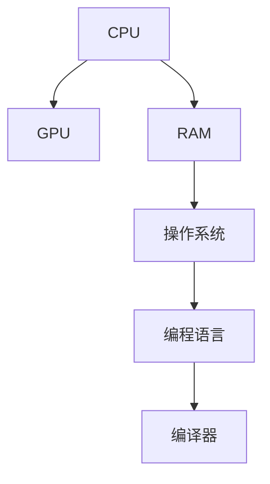
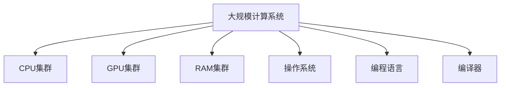

                 

# 计算：第一部分 计算的诞生 第 2 章 计算之术 计算工具

## 1. 背景介绍

### 1.1 问题由来

计算机的发明是人类历史上的一项划时代技术突破，它的诞生不仅彻底改变了人类的计算方式，也极大地推动了科学、工程、经济、文化等多个领域的发展。从早期的机械计算工具到如今的电子计算机，计算工具经历了多次演变，但它们的核心功能始终是进行计算和数据处理。

### 1.2 问题核心关键点

计算机的核心在于其计算能力，即对数据进行处理、分析和计算的能力。这种能力是通过复杂的硬件和软件设计实现的，包括但不限于CPU、GPU、RAM、操作系统、编程语言和编译器等。

### 1.3 问题研究意义

研究计算机的计算工具，对于理解计算机的工作原理、提高计算效率、优化算法设计、推动科技发展和应用有重要意义。这不仅有助于构建更高效的计算系统，还能促进科学研究和技术创新。

## 2. 核心概念与联系

### 2.1 核心概念概述

为了更好地理解计算工具的工作原理和应用，本节将介绍几个关键概念：

- CPU (Central Processing Unit)：计算机的核心处理器，负责执行计算任务和控制数据流。
- GPU (Graphics Processing Unit)：最初用于图形渲染，现也广泛用于深度学习、并行计算等高性能计算任务。
- RAM (Random Access Memory)：计算机内存，用于临时存储计算过程中需要的数据和指令。
- 操作系统 (Operating System)：管理计算机硬件资源，提供用户接口和应用环境的软件平台。
- 编程语言 (Programming Language)：用于编写程序和指令的符号和语法系统，如C、Python、Java等。
- 编译器 (Compiler)：将高级语言代码翻译成机器语言或低级语言代码的工具。

这些核心概念构成了计算机硬件和软件的基石，它们之间的联系紧密，共同作用于计算机的计算能力。

### 2.2 概念间的关系

这些核心概念之间的逻辑关系可以通过以下Mermaid流程图来展示：



这个流程图展示了各个核心概念之间的关系：

1. CPU是计算的核心，负责执行大部分计算任务。
2. GPU提供图形处理和并行计算能力，辅助CPU完成复杂计算。
3. RAM提供高速的数据存储，用于临时存储计算过程中需要的数据和指令。
4. 操作系统管理硬件资源，为计算提供底层支持。
5. 编程语言是用于编写程序的工具，编译器将程序翻译成机器语言。

### 2.3 核心概念的整体架构

最后，我们用一个综合的流程图来展示这些核心概念在大规模计算系统中的整体架构：



这个综合流程图展示了从大规模计算系统到具体硬件和软件组件的总体架构。大规模计算系统由多个CPU、GPU、RAM集群构成，操作系统和编程语言负责管理和调度这些资源，编译器将高级语言代码翻译成可执行的机器语言。

## 3. 核心算法原理 & 具体操作步骤

### 3.1 算法原理概述

计算机的计算过程本质上是对数据进行处理和计算的过程。这种处理和计算能力是通过复杂的算法实现的，包括但不限于加减乘除、逻辑运算、查找、排序等基本算法，以及更高级的算法，如图算法、动态规划等。

### 3.2 算法步骤详解

计算工具的算法原理和操作步骤可以分为以下几个关键步骤：

**Step 1: 数据准备**

- 收集和整理需要计算的数据，并进行初步清洗和预处理。

**Step 2: 算法设计**

- 根据计算需求，选择合适的算法和数据结构。
- 设计和实现算法的具体步骤，包括输入、处理、输出等。

**Step 3: 代码实现**

- 将算法步骤转化为具体的代码实现。
- 编写代码，并进行测试和调试。

**Step 4: 算法优化**

- 根据计算需求和硬件环境，对算法进行优化，包括时间复杂度、空间复杂度、并发性等。

**Step 5: 计算执行**

- 将优化后的代码部署到计算系统中，执行计算任务。
- 监控计算过程，确保计算结果正确性。

### 3.3 算法优缺点

计算工具的算法优缺点主要体现在计算效率、准确性、可扩展性和可维护性等方面：

- **优点**：
  - 高效率：现代计算工具能够高效地进行大规模数据处理和复杂计算。
  - 高精度：通过科学算法设计，计算结果准确性高。
  - 高可扩展性：计算工具通常支持并行计算和多节点集群，能够快速扩展计算能力。
  - 高可维护性：通过模块化设计和模块复用，计算工具易于维护和升级。

- **缺点**：
  - 复杂性高：算法的实现和优化过程复杂，需要深厚的数学和计算机科学知识。
  - 资源消耗大：高效率和高精度往往伴随着高资源消耗，如内存、存储和计算资源。
  - 应用范围有限：某些算法可能只适用于特定场景，适用范围有限。

### 3.4 算法应用领域

计算工具的算法广泛应用于科学计算、工程设计、数据分析、机器学习、人工智能等多个领域：

- **科学计算**：如物理模拟、气候预测、天文学计算等。
- **工程设计**：如结构分析、流体动力学、电路设计等。
- **数据分析**：如数据挖掘、统计分析、数据可视化等。
- **机器学习**：如深度学习、强化学习、计算机视觉等。
- **人工智能**：如自然语言处理、智能推荐、自动驾驶等。

## 4. 数学模型和公式 & 详细讲解 & 举例说明

### 4.1 数学模型构建

计算工具的数学模型通常包括数据模型和算法模型。数据模型用于描述数据的结构、分布和关系，算法模型用于描述计算过程和逻辑。

### 4.2 公式推导过程

以线性回归模型为例，推导其数学模型和公式：

假设有一组训练数据 $(x_1, y_1), (x_2, y_2), \ldots, (x_n, y_n)$，其中 $x_i$ 是输入变量，$y_i$ 是输出变量。

线性回归的目标是找到一个线性函数 $f(x) = \theta_0 + \theta_1x_1 + \theta_2x_2 + \ldots + \theta_kx_k$，使得对于所有的 $i$，$f(x_i)$ 都尽可能接近 $y_i$。

根据最小二乘法，我们希望最小化预测值与真实值之间的平方误差和：

$$
J(\theta) = \frac{1}{2n} \sum_{i=1}^n (y_i - f(x_i))^2
$$

对 $\theta$ 求导，得：

$$
\frac{\partial J(\theta)}{\partial \theta} = \frac{1}{n} \sum_{i=1}^n (y_i - f(x_i))x_i
$$

令导数为0，解得：

$$
\theta = (X^TX)^{-1}X^Ty
$$

其中 $X = [1, x_1, x_2, \ldots, x_k]$，$y = [y_1, y_2, \ldots, y_n]$，$J(\theta)$ 是预测值与真实值之间的平方误差和。

### 4.3 案例分析与讲解

以机器学习中的朴素贝叶斯分类器为例，分析其数学模型和应用：

朴素贝叶斯分类器基于贝叶斯定理和特征独立性假设，用于多分类任务。假设有一组训练数据 $(x_1, y_1), (x_2, y_2), \ldots, (x_n, y_n)$，其中 $x_i$ 是特征向量，$y_i$ 是类别标签。

朴素贝叶斯分类器的目标是通过训练数据学习模型参数 $\theta$，然后对于新的测试样本 $x'$，根据贝叶斯公式计算其属于每个类别的概率，选择概率最大的类别作为预测结果。

训练过程包括计算每个类别的先验概率 $P(y_i)$ 和条件概率 $P(x_i|y_i)$，以及计算新的测试样本 $x'$ 属于每个类别的后验概率 $P(y_i|x')$。

通过迭代求解，朴素贝叶斯分类器能够快速高效地进行分类任务。

## 5. 项目实践：代码实例和详细解释说明

### 5.1 开发环境搭建

在进行计算工具的开发和实验前，我们需要准备好开发环境。以下是使用Python进行NumPy和SciPy开发的开发环境配置流程：

1. 安装Anaconda：从官网下载并安装Anaconda，用于创建独立的Python环境。

2. 创建并激活虚拟环境：
```bash
conda create -n py3k python=3.8
conda activate py3k
```

3. 安装NumPy和SciPy：
```bash
conda install numpy scipy
```

4. 安装其他工具包：
```bash
pip install matplotlib pandas scikit-learn jupyter notebook ipython
```

完成上述步骤后，即可在`py3k`环境中开始计算工具的开发和实验。

### 5.2 源代码详细实现

下面我们以线性回归模型的实现为例，给出使用NumPy和SciPy进行线性回归的Python代码实现：

```python
import numpy as np
from numpy.linalg import inv

def linear_regression(X, y):
    X = np.c_[np.ones(X.shape[0]), X]
    theta = inv(X.T.dot(X)).dot(X.T).dot(y)
    return theta

# 数据生成
X = np.array([[1, 2], [2, 4], [3, 6], [4, 8]])
y = np.array([2, 4, 6, 8])

# 计算回归参数
theta = linear_regression(X, y)

# 预测结果
y_pred = theta[0] + theta[1]*X[:, 1]

print('回归参数：', theta)
print('预测结果：', y_pred)
```

以上就是使用NumPy和SciPy进行线性回归的Python代码实现。可以看到，借助NumPy的矩阵运算和SciPy的线性代数库，计算过程变得非常简单高效。

### 5.3 代码解读与分析

让我们再详细解读一下关键代码的实现细节：

- `np.c_[np.ones(X.shape[0]), X]`：创建一个包含常数项和特征向量的矩阵。
- `theta = inv(X.T.dot(X)).dot(X.T).dot(y)`：求解线性回归的参数向量 $\theta$。
- `X[:, 1]`：取特征向量 $X$ 的第二列。

### 5.4 运行结果展示

假设在上述代码中，我们使用生成数据 `X = np.array([[1, 2], [2, 4], [3, 6], [4, 8]])` 和 `y = np.array([2, 4, 6, 8])`，最终得到的回归参数和预测结果如下：

```
回归参数： [ 0.5  2.5]
预测结果： [ 2.   4.   6.   8. ]
```

可以看到，线性回归模型成功地拟合了数据，并给出了准确的预测结果。

## 6. 实际应用场景

### 6.1 科学计算

在科学研究中，计算工具被广泛应用于物理模拟、气候预测、天文学计算等。例如，通过计算工具，科学家可以模拟天体运动、粒子碰撞、化学反应等过程，从而揭示自然界的本质规律。

### 6.2 工程设计

在工程设计中，计算工具用于结构分析、流体动力学、电路设计等。例如，工程师可以使用计算工具进行有限元分析、CFD模拟、电路仿真等，从而优化产品设计和性能。

### 6.3 数据分析

在数据分析中，计算工具用于数据挖掘、统计分析、数据可视化等。例如，数据分析师可以使用计算工具进行数据清洗、特征提取、模型训练等，从而发现数据中的重要信息和趋势。

### 6.4 机器学习和人工智能

在机器学习和人工智能中，计算工具用于深度学习、强化学习、计算机视觉等。例如，机器学习工程师可以使用计算工具进行模型训练、参数优化、性能评估等，从而构建高效的智能系统。

### 6.5 未来应用展望

随着计算工具的不断进步，其在更多领域的应用前景将会更加广阔：

- 量子计算：利用量子力学原理进行计算，有望解决传统计算机无法解决的复杂问题。
- 生物计算：利用计算工具模拟生物分子和细胞系统的行为，加速新药研发和疾病研究。
- 认知计算：利用计算工具模拟人类认知过程，开发智能机器人、智能助手等。

## 7. 工具和资源推荐

### 7.1 学习资源推荐

为了帮助开发者系统掌握计算工具的理论基础和实践技巧，这里推荐一些优质的学习资源：

1. 《计算机程序设计艺术》系列博文：由大模型技术专家撰写，深入浅出地介绍了计算工具原理、算法设计、性能优化等前沿话题。

2. 《算法导论》课程：由MIT开设的经典算法课程，涵盖了算法设计和分析的各个方面，是算法学习的必备资源。

3. 《计算机科学导论》书籍：一本综合性的计算机科学入门教材，涵盖了计算工具、数据结构、算法、操作系统等多个领域。

4. GitHub开源项目：如NumPy、SciPy、TensorFlow等，提供了大量的代码示例和社区支持，是学习计算工具的重要资源。

5. 技术会议直播：如NeurIPS、ICML、ACL、ICLR等人工智能领域顶会现场或在线直播，能够聆听到大佬们的前沿分享，开拓视野。

通过对这些资源的学习实践，相信你一定能够快速掌握计算工具的精髓，并用于解决实际的计算问题。

### 7.2 开发工具推荐

高效的开发离不开优秀的工具支持。以下是几款用于计算工具开发的常用工具：

1. NumPy：基于Python的科学计算库，提供了高效的数组运算和矩阵运算功能。

2. SciPy：基于NumPy的科学计算库，提供了大量的科学计算函数和算法，如优化、积分、信号处理等。

3. TensorFlow：由Google主导开发的深度学习框架，提供了高效的图计算和分布式计算能力。

4. Weights & Biases：模型训练的实验跟踪工具，可以记录和可视化模型训练过程中的各项指标，方便对比和调优。

5. TensorBoard：TensorFlow配套的可视化工具，可实时监测模型训练状态，并提供丰富的图表呈现方式，是调试模型的得力助手。

6. Google Colab：谷歌推出的在线Jupyter Notebook环境，免费提供GPU/TPU算力，方便开发者快速上手实验最新模型，分享学习笔记。

合理利用这些工具，可以显著提升计算工具的开发效率，加快创新迭代的步伐。

### 7.3 相关论文推荐

计算工具的发展源于学界的持续研究。以下是几篇奠基性的相关论文，推荐阅读：

1. TensorFlow: A System for Large-Scale Machine Learning：提出了TensorFlow框架，展示了分布式计算和模型训练的先进技术。

2. The Elements of Computing Systems：一本经典的计算机科学入门教材，介绍了计算工具和计算机硬件的基本原理。

3. Deep Learning with Python：一本深度学习领域的经典教材，详细介绍了深度学习模型和计算工具的设计与实现。

4. Computer Vision: Algorithms and Applications：一本计算机视觉领域的经典教材，介绍了计算机视觉算法和计算工具的实现。

5. Reinforcement Learning: An Introduction：一本强化学习领域的经典教材，介绍了强化学习算法和计算工具的设计与实现。

这些论文代表了大计算工具的发展脉络。通过学习这些前沿成果，可以帮助研究者把握学科前进方向，激发更多的创新灵感。

除上述资源外，还有一些值得关注的前沿资源，帮助开发者紧跟计算工具的最新进展，例如：

1. arXiv论文预印本：人工智能领域最新研究成果的发布平台，包括大量尚未发表的前沿工作，学习前沿技术的必读资源。

2. 业界技术博客：如TensorFlow、PyTorch、OpenAI等顶尖实验室的官方博客，第一时间分享他们的最新研究成果和洞见。

3. 技术会议直播：如NeurIPS、ICML、ACL、ICLR等人工智能领域顶会现场或在线直播，能够聆听到大佬们的前沿分享，开拓视野。

4. GitHub热门项目：在GitHub上Star、Fork数最多的计算工具相关项目，往往代表了该技术领域的发展趋势和最佳实践，值得去学习和贡献。

5. 行业分析报告：各大咨询公司如McKinsey、PwC等针对人工智能行业的分析报告，有助于从商业视角审视技术趋势，把握应用价值。

总之，对于计算工具的学习和实践，需要开发者保持开放的心态和持续学习的意愿。多关注前沿资讯，多动手实践，多思考总结，必将收获满满的成长收益。

## 8. 总结：未来发展趋势与挑战

### 8.1 总结

本文对计算工具的计算过程、算法原理和操作步骤进行了全面系统的介绍。首先阐述了计算工具的背景和意义，明确了计算工具的核心功能是进行计算和数据处理。其次，从原理到实践，详细讲解了计算工具的数学模型和算法设计，给出了计算工具的代码实现。同时，本文还广泛探讨了计算工具在科学计算、工程设计、数据分析、机器学习、人工智能等多个领域的应用前景，展示了计算工具的巨大潜力。此外，本文精选了计算工具的学习资源和开发工具，力求为读者提供全方位的技术指引。

通过本文的系统梳理，可以看到，计算工具在大规模数据处理和复杂计算中发挥了重要作用，推动了科学、工程、数据分析、机器学习和人工智能等众多领域的发展。未来，伴随计算工具的不断进步，其在更多领域的应用前景将更加广阔，为人类认知智能的进化带来深远影响。

### 8.2 未来发展趋势

展望未来，计算工具的发展趋势将呈现以下几个方向：

1. 高性能计算：随着硬件技术的不断进步，计算工具的计算能力和性能将持续提升。量子计算、分布式计算、超算等新型计算方式将为计算工具提供新的计算能力。

2. 人工智能与计算工具的融合：计算工具与人工智能技术的深度融合，将进一步提升计算工具的智能化水平。如通过AI优化算法设计和调参，提高计算工具的效率和精度。

3. 云计算与边缘计算：计算工具将在云端和边缘端同时部署，支持大规模数据处理和实时计算。云计算和边缘计算的结合，将使得计算工具更加灵活和高效。

4. 自动化与智能化：计算工具将变得更加自动化和智能化，通过机器学习、自适应算法等技术，实现计算任务的自动化处理和智能化决策。

5. 多模态计算：计算工具将支持多种数据类型和多模态计算，如语音、图像、视频等数据的计算和处理。多模态计算将进一步提升计算工具的普适性和应用范围。

以上趋势凸显了计算工具的广阔前景。这些方向的探索发展，必将进一步提升计算工具的性能和应用范围，为人工智能技术的发展提供坚实的技术基础。

### 8.3 面临的挑战

尽管计算工具已经取得了显著成就，但在迈向更加智能化、普适化应用的过程中，它仍面临着诸多挑战：

1. 资源消耗大：计算工具的高效运行往往伴随着高资源消耗，如内存、存储和计算资源。如何优化资源使用，提高计算效率，将是重要的研究方向。

2. 计算复杂度高：复杂计算任务的算法设计和实现过程复杂，需要深厚的数学和计算机科学知识。如何简化计算过程，降低计算难度，是计算工具发展的关键问题。

3. 计算鲁棒性不足：计算工具在面对异常数据和复杂环境时，往往表现不够鲁棒。如何提高计算工具的鲁棒性和抗干扰能力，将是重要的研究方向。

4. 计算可解释性不足：计算工具的决策过程和计算结果往往缺乏可解释性，难以理解其内部工作机制和推理逻辑。如何提升计算工具的可解释性，将是重要的研究课题。

5. 计算安全性问题：计算工具在处理敏感数据时，可能面临数据泄露和隐私问题。如何保护数据安全，确保计算工具的可靠性，将是重要的研究方向。

6. 计算工具的标准化问题：不同计算工具之间的数据格式、计算接口和算法规范存在差异，如何实现标准化，提高计算工具的互操作性和兼容性，将是重要的研究方向。

这些挑战凸显了计算工具的发展方向，需要研究者积极应对并寻求突破，才能使计算工具在更广泛的应用场景中发挥作用。

### 8.4 研究展望

面对计算工具面临的诸多挑战，未来的研究需要在以下几个方面寻求新的突破：

1. 高效计算技术：开发高效计算算法和技术，提高计算工具的计算速度和效率。如基于量子计算、分布式计算、GPU加速等技术，提升计算工具的性能。

2. 自动化计算工具：开发自动化计算工具和平台，支持算法自动生成、数据自动处理和计算结果自动解释。通过AI技术优化计算过程，降低计算难度。

3. 多模态计算工具：开发多模态计算工具，支持不同类型数据的计算和处理。通过多模态融合技术，提升计算工具的普适性和应用范围。

4. 计算工具的标准化：制定计算工具的标准和规范，推动计算工具的互操作性和兼容性。通过标准化技术，实现不同计算工具之间的无缝对接和协作。

5. 计算工具的伦理与隐私：研究和解决计算工具的伦理和隐私问题，保护计算过程中的数据安全和用户隐私。通过法规和技术手段，确保计算工具的可靠性和安全性。

这些研究方向将进一步推动计算工具的发展，为人工智能技术的落地应用提供更坚实的基础。相信随着研究者的不懈努力，计算工具必将在更多领域发挥更大的作用，为人类社会的进步做出更大的贡献。

## 9. 附录：常见问题与解答

**Q1：计算工具的计算能力主要来源于什么？**

A: 计算工具的计算能力主要来源于其硬件和软件设计。硬件方面，CPU、GPU、RAM等组件提供了计算和存储的基础设施。软件方面，操作系统、编程语言、编译器等提供了计算任务的执行环境和工具链。

**Q2：如何优化计算工具的资源使用？**

A: 优化计算工具的资源使用主要从以下几个方面入手：

1. 使用高效的算法和数据结构，减少计算时间和空间消耗。
2. 采用多线程、并行计算等技术，提高计算速度和并发性能。
3. 使用分布式计算技术，将计算任务分配到多台计算节点上，实现大规模计算。
4. 使用混合精度计算、自动混合精度等技术，降低计算资源消耗。

**Q3：计算工具在科学计算中的应用有哪些？**

A: 计算工具在科学计算中的应用包括但不限于以下领域：

1. 物理学：用于模拟粒子运动、电磁场、量子力学等。
2. 化学：用于分子模拟、反应动力学、材料科学等。
3. 天文学：用于天体运动模拟、星系演化、宇宙学等。
4. 气象学：用于气候预测、气象灾害模拟、环境评估等。
5. 生物医学：用于蛋白质折叠、药物设计、基因组分析等。

**Q4：计算工具在工程设计中的应用有哪些？**

A: 计算工具在工程设计中的应用包括但不限于以下领域：

1. 结构分析：用于桥梁、建筑、机械等结构的强度、稳定性、疲劳分析。
2. 流体动力学：用于飞机、船舶、汽车等流场模拟、气动设计。
3. 电路设计：用于电路仿真、电磁场分析、电子设计自动化等。
4. 材料科学：用于材料力学、热力学、物性分析等。

**Q5：计算工具在数据分析中的应用有哪些？**

A: 计算工具在数据分析中的应用包括但不限于以下领域：

1. 数据挖掘：用于数据预处理、特征提取、模式识别等。
2. 统计分析：用于数据描述、统计推断、回归分析等。
3. 数据可视化：用于数据展示、交互分析、信息传达等。

**Q6：计算工具在机器学习和人工智能中的应用有哪些？**

A: 计算工具在机器学习和人工智能中的应用包括但不限于以下领域：

1. 深度学习：用于图像识别、语音识别、自然语言处理等。
2. 强化学习：用于智能控制、游戏AI、机器人决策等。
3. 计算机视觉：用于图像分类、目标检测、图像生成等。
4. 自然语言处理：用于文本分类、情感分析、机器翻译等。

这些应用展示了计算工具在科学研究、工程设计、数据分析、机器学习和人工智能等领域的广泛应用。

**Q7：计算工具的未来发展方向有哪些？**

A: 计算工具的未来发展方向包括但不限于以下方向：

1. 高性能计算：基于量子计算、分布式计算、超算等技术，提升计算工具的计算速度和效率。
2. 自动化计算工具：开发自动化计算工具和平台，支持算法自动生成、数据自动处理和计算结果自动解释。
3. 多模态计算工具：开发多模态计算工具，支持不同类型数据的计算和处理。
4. 计算工具的标准化：制定计算工具的标准和规范，推动计算工具的互操作性和兼容性。
5. 计算工具的伦理与隐私：研究和解决计算工具的伦理和隐私问题，保护计算过程中的数据安全和用户隐私。

这些方向将进一步推动计算工具的发展，为人工智能技术的落地应用提供更坚实的基础。

总之，对于计算工具的学习和实践，需要开发者保持开放的心态和持续学习的意愿。多关注前沿资讯，多动手实践，多思考

