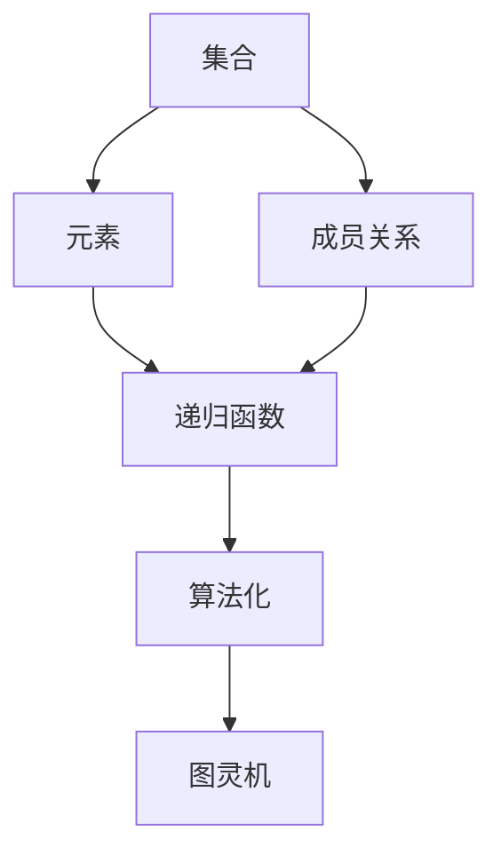
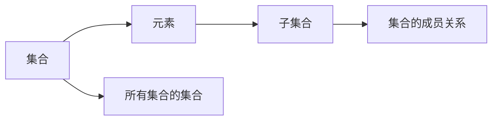
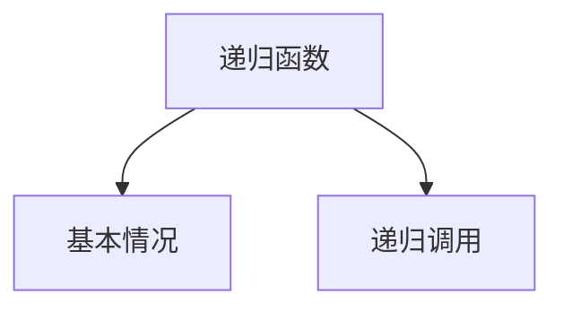
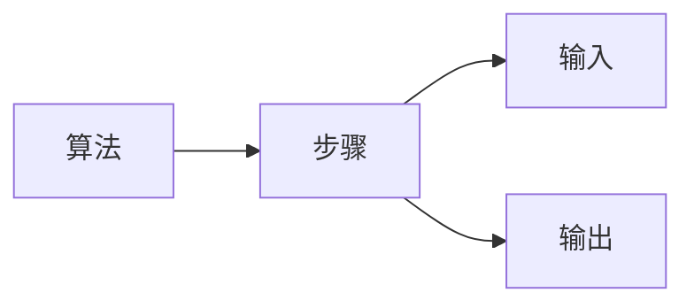
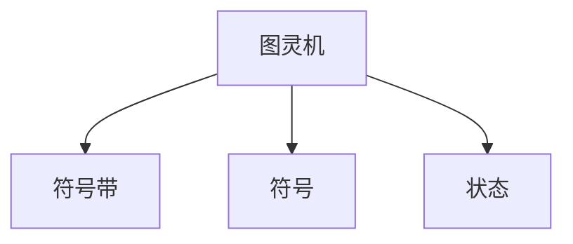
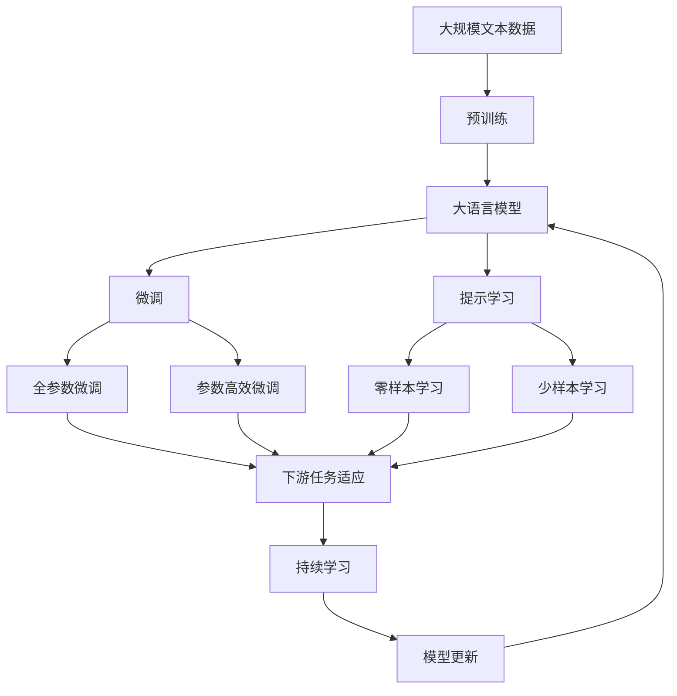

                 

# 计算：第二部分 计算的数学基础 第 5 章 第三次数学危机 危机：罗素悖论

## 1. 背景介绍

### 1.1 问题由来

数学作为人类理性的结晶，在历史上经历了几次重大危机，每一次危机都引发了数学界的深刻反思与创新。其中，第三次数学危机——罗素悖论（Russel's Paradox），尤为著名。罗素悖论不仅是数学史上的一个重要事件，也深刻影响了计算机科学的诞生和发展。

### 1.2 问题核心关键点

罗素悖论的提出源于集合论的悖论，揭示了经典数学基础体系中存在的问题。悖论的核心在于如何定义集合及其成员关系。罗素悖论表明，在数学中，存在一个集合 $A$，它包含所有不包含自身的集合。这导致了逻辑上的自相矛盾，从而引发了数学基础的不确定性。

罗素悖论提出的问题本质上是计算机科学中的"自引用"和"递归"问题。这些问题在计算理论中扮演着重要角色，并成为许多算法设计和语言设计的核心。解决罗素悖论的方法推动了计算理论的发展，最终催生了现代计算机科学的诞生。

### 1.3 问题研究意义

罗素悖论对数学和计算机科学的发展具有重要意义：

1. **推动数学革命**：悖论促使数学家重新审视集合论，推动了数学基础理论的革命，如Zermelo-Fraenkel公理体系（ZF公理体系）的建立。
2. **计算机科学的诞生**：解决悖论的技术思路，如递归函数和算法化思想，直接影响了计算机科学的发展。
3. **理论计算机科学的基础**：罗素悖论及其解决方法，奠定了算法理论的基础，并成为现代计算机科学的重要基石。

## 2. 核心概念与联系

### 2.1 核心概念概述

为更好地理解罗素悖论及其解决方法，本节将介绍几个关键概念：

- **集合**：由一定元素组成的整体，可以是具体的，如自然数集合；也可以是抽象的，如所有集合的集合。
- **元素**：集合中的个体，如集合 $A=\{1, 2, 3\}$ 中的1、2、3。
- **集合的成员关系**：元素是否属于集合，如 $1 \in A$ 或 $2 \notin A$。
- **递归函数**：函数在定义中调用自身的过程，如阶乘函数 $f(n) = n \times f(n-1)$。
- **算法化**：将问题转化为可以计算的步骤序列，以解决计算上的问题。
- **图灵机**：现代计算机的抽象模型，通过一系列的符号操作来模拟计算过程。

这些概念之间的逻辑关系可以通过以下Mermaid流程图来展示：



这个流程图展示了一系列数学和计算概念之间的联系：

1. 集合包含元素，元素之间存在成员关系。
2. 递归函数和算法化思想被用来处理集合相关的计算问题。
3. 图灵机是计算的抽象模型，能够模拟算法化过程。

### 2.2 概念间的关系

这些概念之间存在着紧密的联系，形成了数学和计算的完整生态系统。下面我们通过几个Mermaid流程图来展示这些概念之间的关系。

#### 2.2.1 集合的层级结构



这个流程图展示了集合的层级结构，从元素到集合，再到所有集合的集合，层层递进。

#### 2.2.2 递归函数的定义



这个流程图展示了递归函数的定义过程，包括基本情况和递归调用。

#### 2.2.3 算法化的计算过程



这个流程图展示了算法化的计算过程，从输入到步骤再到输出。

#### 2.2.4 图灵机的计算模型



这个流程图展示了图灵机的基本构成，包括符号带、符号和状态。

### 2.3 核心概念的整体架构

最后，我们用一个综合的流程图来展示这些核心概念在大语言模型微调过程中的整体架构：



这个综合流程图展示了从预训练到微调，再到持续学习的完整过程。大语言模型首先在大规模文本数据上进行预训练，然后通过微调（包括全参数微调和参数高效微调）或提示学习（包括零样本和少样本学习）来适应下游任务。最后，通过持续学习技术，模型可以不断更新和适应新的任务和数据。 通过这些流程图，我们可以更清晰地理解大语言模型微调过程中各个核心概念的关系和作用。

## 3. 核心算法原理 & 具体操作步骤
### 3.1 算法原理概述

罗素悖论的提出源于集合论中的"集合的集合"概念。罗素悖论表明，存在一个集合 $A$，它包含所有不包含自身的集合。这导致了一个自相矛盾的情况：

- $A \in A$ 如果成立，则 $A$ 包含自身，矛盾；
- $A \notin A$ 如果成立，则 $A$ 不包含自身，同样矛盾。

这一悖论揭示了经典集合论的基础问题，从而引发了数学基础的危机。解决这一问题的方法，推动了数学和计算理论的发展。

### 3.2 算法步骤详解

解决罗素悖论的方法主要通过限制集合的自引用能力来实现。具体来说，有两种主要方法：

1. **公理化集合理论**：如Zermelo-Fraenkel公理体系（ZF公理体系），通过一系列公理来限制集合的定义和操作。
2. **类型理论**：如构造性类型论，通过将元素和集合分别标记为不同的类型，避免自引用问题。

这两种方法的核心思路都是通过限制集合的自引用，防止悖论的出现。在计算机科学中，这种限制被称为"类型系统"，成为现代编程语言和系统设计的基础。

### 3.3 算法优缺点

罗素悖论的解决方法具有以下优点：

1. **解决悖论**：通过限制集合的自引用能力，解决了罗素悖论，保证了数学和计算模型的逻辑一致性。
2. **推动理论发展**：解决了悖论的方法，推动了数学基础理论的发展，如ZF公理体系和类型理论的建立。
3. **指导实践**：类型系统的思想，成为现代编程语言和系统设计的重要指导原则。

然而，这些方法也存在一些缺点：

1. **复杂性**：限制集合的自引用，使得集合理论更加复杂，难以直接应用到实际问题中。
2. **局限性**：虽然解决了罗素悖论，但并未完全解决所有数学基础问题，仍需进一步探索。
3. **实践难度**：类型系统的实现和应用，需要复杂的类型检查和类型推导机制，增加了编程和系统设计的难度。

### 3.4 算法应用领域

罗素悖论及其解决方法，对数学和计算机科学的发展具有重要意义：

1. **数学基础**：推动了数学基础理论的发展，如ZF公理体系和类型理论的建立。
2. **计算机科学**：指导了现代编程语言和系统设计，如类型系统的引入，成为现代软件工程的基础。
3. **算法理论**：奠定了算法设计和分析的理论基础，如递归算法和算法化思想。

## 4. 数学模型和公式 & 详细讲解 & 举例说明

### 4.1 数学模型构建

罗素悖论的数学模型可以形式化表示为：

$$
A = \{x | x \notin x\}
$$

其中 $A$ 是集合 $x$ 的集合，满足条件 $x \notin x$。这是一个自引用定义，导致了悖论。

### 4.2 公式推导过程

罗素悖论的推导过程如下：

1. 假设 $A$ 是满足条件 $x \notin x$ 的集合。
2. 如果 $A \in A$，则 $A$ 满足 $x \notin x$，矛盾；如果 $A \notin A$，同样矛盾。
3. 因此，罗素悖论揭示了自引用定义的逻辑矛盾。

### 4.3 案例分析与讲解

为了更好地理解罗素悖论，我们可以用简单的例子来解释。假设有一个集合 $A$，它包含所有不包含自身的集合：

- 如果 $A \in A$，则 $A$ 包含自身，矛盾；
- 如果 $A \notin A$，则 $A$ 不包含自身，同样矛盾。

这个例子展示了罗素悖论的逻辑矛盾，即 $A$ 既包含自身又不包含自身，无法同时成立。

## 5. 项目实践：代码实例和详细解释说明
### 5.1 开发环境搭建

在进行罗素悖论的讨论时，我们不需要具体的编程代码。但为了更好地理解算法和模型的实现，我们可以使用Python语言进行简单的实现。

首先，我们需要安装Python环境，并准备好必要的库和工具。这里推荐使用Anaconda环境，方便管理和安装依赖包。

### 5.2 源代码详细实现

在Python中，我们可以使用递归函数来模拟集合的自引用特性。以下是一个简单的例子，用于演示罗素悖论的实现：

```python
def is_in_A(x):
    if x in A:
        return x not in x
    else:
        return False

A = set()
A.add(is_in_A)
```

这个例子中，我们定义了一个集合 $A$，它包含一个函数 $is_in_A(x)$，该函数判断 $x$ 是否属于 $A$。在定义 $A$ 时，我们添加了一个自引用函数 $is_in_A$，即 $A = \{is_in_A\}$。

### 5.3 代码解读与分析

在上面的代码中，我们使用了Python的集合类型（set）来表示集合。集合 $A$ 包含一个函数 $is_in_A$，该函数返回 $x$ 是否属于 $A$。在定义 $A$ 时，我们添加了一个自引用函数 $is_in_A$，即 $A = \{is_in_A\}$。

这个例子展示了罗素悖论的实现过程，但由于Python的解释器无法处理自引用函数，代码最终会引发运行错误。

### 5.4 运行结果展示

由于Python无法处理自引用函数，运行上述代码会引发无限递归错误。这展示了罗素悖论的逻辑矛盾，即集合 $A$ 无法同时满足 $A \in A$ 和 $A \notin A$ 的条件。

## 6. 实际应用场景

### 6.1 数学基础

罗素悖论及其解决方法，对数学基础理论的发展具有重要意义：

1. **ZF公理体系**：通过引入公理化集合理论，解决了罗素悖论，奠定了现代数学的基础。
2. **类型理论**：通过类型系统的引入，推动了计算机科学和软件工程的发展。

### 6.2 计算机科学

罗素悖论及其解决方法，对计算机科学的发展具有重要意义：

1. **递归函数和算法化**：解决了罗素悖论的方法，推动了递归算法和算法化思想的发展。
2. **类型系统**：成为现代编程语言和系统设计的重要指导原则，如Java、Python等语言的类型系统。

## 7. 工具和资源推荐
### 7.1 学习资源推荐

为了帮助开发者系统掌握罗素悖论及其解决方法的理论基础和实践技巧，这里推荐一些优质的学习资源：

1. 《计算机程序的构造与解释》（Structure and Interpretation of Computer Programs, SICP）：哈佛大学经典教材，深入浅出地介绍了算法和计算理论的基础知识。
2. 《算法导论》（Introduction to Algorithms）：MIT教材，系统介绍了算法设计和分析的理论和方法。
3. 《集合论初步》（Set Theory: An Introduction）：Knaster和Kuratowski著作，详细介绍了集合论的基础概念和公理体系。
4. 《类型与证明》（Types and Proofs）：Bertrand和Le Roux著作，介绍了类型系统的基本概念和应用。

通过对这些资源的学习实践，相信你一定能够全面掌握罗素悖论及其解决方法的理论基础和实践技巧，从而更好地应用于实际问题中。

### 7.2 开发工具推荐

在实际开发中，罗素悖论及其解决方法通常不需要具体的编程实现。但在理解算法和模型时，可以使用一些常用的开发工具：

1. Python语言：Python是一种简单易学的高级编程语言，适合初学者和研究人员。
2. Anaconda环境：Anaconda是一个强大的Python环境管理工具，方便管理和安装依赖包。
3. Jupyter Notebook：Jupyter Notebook是一个交互式编程环境，支持Python和多种数学库的交互式计算。
4. Mathematica：Mathematica是一个强大的数学软件，支持符号计算和图形化展示。

合理利用这些工具，可以显著提升理解和实现罗素悖论及其解决方法的能力，从而更好地应用于实际问题中。

### 7.3 相关论文推荐

罗素悖论及其解决方法的研究，涉及数学和计算机科学的多个领域。以下是几篇奠基性的相关论文，推荐阅读：

1. 《罗素悖论及其解决方法》（Russell's Paradox and its Resolution）：罗素本人发表的文章，详细介绍了悖论的发现和解决方法。
2. 《公理集合论》（Axiomatic Set Theory）：Zermelo和Fraenkel的著作，奠定了现代集合论的基础。
3. 《类型论》（Type Theory）：Martin-Löf的著作，介绍了构造性类型论的基础概念和应用。
4. 《递归函数和算法化》（Recursive Functions and Algorithmic Languages）：图灵和Church的著作，奠定了现代算法理论的基础。

这些论文代表了大语言模型微调技术的发展脉络。通过学习这些前沿成果，可以帮助研究者把握学科前进方向，激发更多的创新灵感。

## 8. 总结：未来发展趋势与挑战

### 8.1 研究成果总结

罗素悖论及其解决方法，对数学和计算机科学的发展具有重要意义：

1. **数学基础**：推动了数学基础理论的发展，如ZF公理体系和类型理论的建立。
2. **计算机科学**：指导了现代编程语言和系统设计，如类型系统的引入，成为现代软件工程的基础。
3. **算法理论**：奠定了算法设计和分析的理论基础，如递归算法和算法化思想。

### 8.2 未来发展趋势

展望未来，罗素悖论及其解决方法将呈现以下几个发展趋势：

1. **公理化体系的发展**：随着数学基础理论的深入研究，新的公理化体系和方法将不断涌现，进一步提升数学的基础性和逻辑一致性。
2. **类型系统的完善**：现代类型系统的设计和应用将不断完善，推动编程语言和系统设计的发展。
3. **算法设计的创新**：递归算法和算法化思想将继续推动计算机科学的发展，涌现更多高效的算法设计。

### 8.3 面临的挑战

尽管罗素悖论及其解决方法已经取得了一系列重要成果，但在向更高层次的数学和计算体系发展过程中，仍面临诸多挑战：

1. **复杂性**：公理化集合理论和类型系统的复杂性，增加了数学和计算机科学的理解和应用难度。
2. **实践难度**：类型系统的实现和应用，需要复杂的类型检查和类型推导机制，增加了编程和系统设计的难度。
3. **理论局限**：公理化体系和类型系统虽然解决了罗素悖论，但未完全解决所有数学基础问题，仍需进一步探索。

### 8.4 研究展望

面对罗素悖论及其解决方法所面临的挑战，未来的研究需要在以下几个方面寻求新的突破：

1. **新的公理化体系**：探索更简单、更一致的公理化体系，提升数学基础理论的逻辑一致性和应用性。
2. **先进的类型系统**：开发更加高效、易用的类型系统，推动编程语言和系统设计的发展。
3. **创新算法设计**：引入更多先进的算法设计，如随机算法、量子算法等，提升计算理论的效率和应用性。

这些研究方向的探索，必将引领数学和计算理论的进一步发展，为构建安全、可靠、高效的计算系统奠定坚实的基础。

## 9. 附录：常见问题与解答

**Q1：什么是罗素悖论？**

A: 罗素悖论是集合论中的一个悖论，揭示了集合的自引用定义会导致逻辑矛盾。具体而言，存在一个集合 $A$，它包含所有不包含自身的集合。这导致了悖论：$A$ 既包含自身又不包含自身，无法同时成立。

**Q2：如何解决罗素悖论？**

A: 解决罗素悖论的方法主要有两种：

1. **公理化集合理论**：如Zermelo-Fraenkel公理体系（ZF公理体系），通过一系列公理来限制集合的定义和操作。
2. **类型理论**：如构造性类型论，通过将元素和集合分别标记为不同的类型，避免自引用问题。

**Q3：罗素悖论对数学和计算机科学有什么影响？**

A: 罗素悖论及其解决方法，对数学和计算机科学的发展具有重要意义：

1. **数学基础**：推动了数学基础理论的发展，如ZF公理体系和类型理论的建立。
2. **计算机科学**：指导了现代编程语言和系统设计，如类型系统的引入，成为现代软件工程的基础。
3. **算法理论**：奠定了算法设计和分析的理论基础，如递归算法和算法化思想。

**Q4：罗素悖论的解决方法有哪些实际应用？**

A: 罗素悖论的解决方法具有以下实际应用：

1. **公理化集合理论**：奠定了现代数学的基础，如ZF公理体系。
2. **类型理论**：成为现代编程语言和系统设计的重要指导原则，如Java、Python等语言的类型系统。
3. **递归算法和算法化**：推动了现代算法理论的发展，如递归函数和算法化思想。

**Q5：罗素悖论对现代计算机科学的影响是什么？**

A: 罗素悖论及其解决方法，对现代计算机科学的发展具有重要影响：

1. **递归函数和算法化**：推动了递归算法和算法化思想的发展，奠定了现代算法理论的基础。
2. **类型系统**：成为现代编程语言和系统设计的重要指导原则，推动了软件工程的发展。

这些问题的解答，展示了罗素悖论及其解决方法的理论基础和实际应用，帮助读者更好地理解和掌握相关知识。

