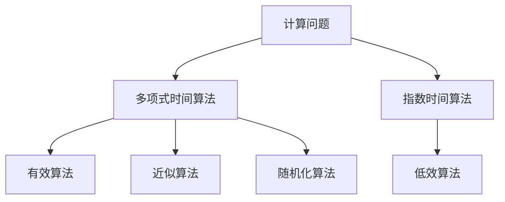
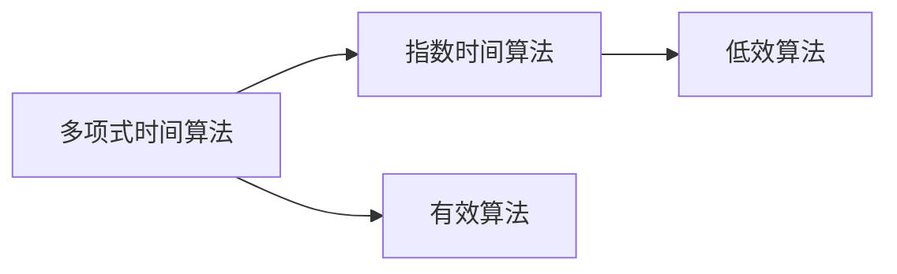
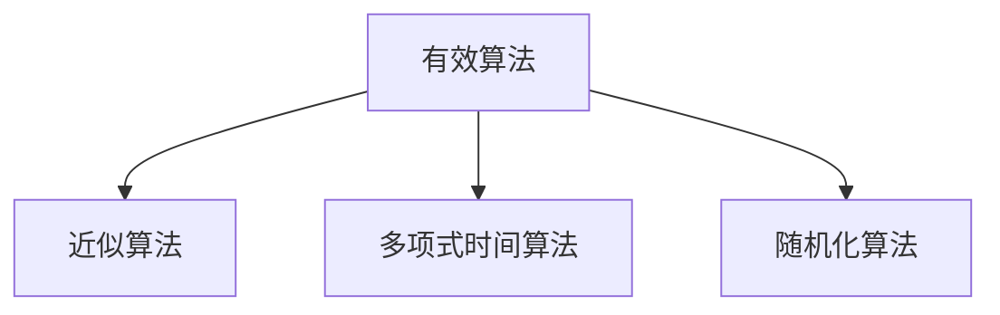
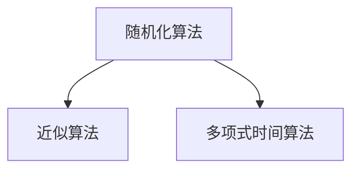
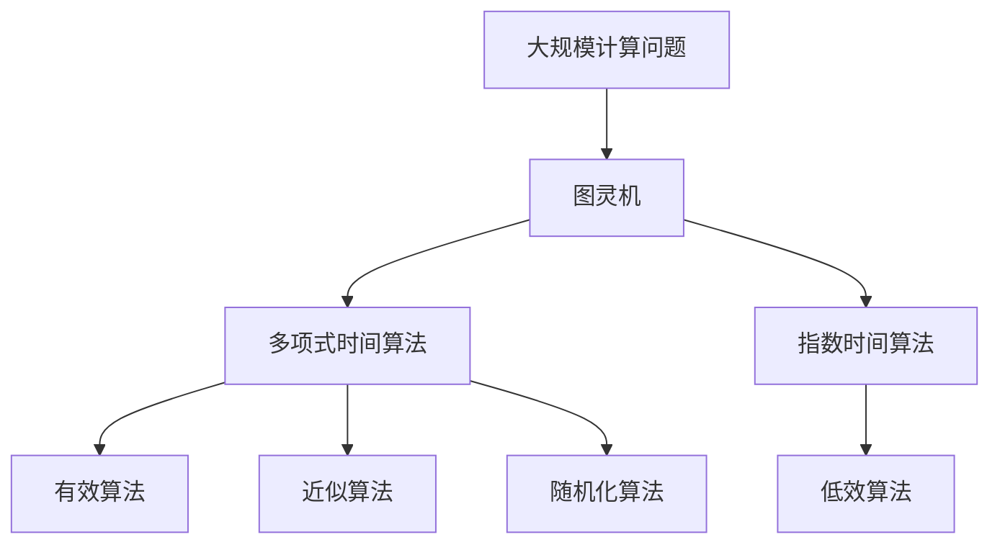

                 

# 计算：第四部分 计算的极限 第 9 章 计算复杂性 多项式时间与指数时间

> 关键词：计算复杂性, 多项式时间, 指数时间, 图灵机, 算法复杂度, 时间复杂度, 空间复杂度, 近似算法, 随机化算法, 有效算法

## 1. 背景介绍

### 1.1 问题由来
计算复杂性是计算机科学的核心问题之一，它研究的是计算问题的求解难易程度。计算机科学的早期阶段，人们通过设计高效算法来求解问题，但随着问题规模的不断扩大，算法的效率瓶颈变得愈发明显。计算复杂性理论应运而生，它为评估算法性能和理解计算问题的复杂性提供了一套系统的方法论。

计算复杂性理论的核心问题是确定算法解决问题的时间复杂度和空间复杂度。多项式时间算法与指数时间算法分别对应了计算能力的两个极端：前者可以在多项式时间内求解任何问题，后者则需要指数级别的资源。在实际应用中，我们需要选择那些在可接受的时间内能够解决特定问题的算法。

### 1.2 问题核心关键点
计算复杂性理论主要研究以下几个关键点：
1. 算法复杂度的分类：P（多项式时间）、NP（非确定性多项式时间）、NP-complete、NP-hard等。
2. 多项式时间算法与指数时间算法的区别及其应用场景。
3. 如何通过算法复杂度来评估问题的求解难易程度。
4. 近似算法和随机化算法在求解复杂问题中的作用和局限。

理解这些问题能够帮助我们选择合适的算法，评估计算资源需求，并设计有效的解决策略。

### 1.3 问题研究意义
计算复杂性理论对于计算机科学和工程具有重要的指导意义：
1. 指导算法设计：帮助开发者选择高效的算法，避免陷入低效计算的泥潭。
2. 评估资源需求：通过算法复杂度评估算法所需的资源，指导实际系统架构设计。
3. 解决计算问题：为复杂计算问题提供解决方案，推动科学计算和工程应用的发展。
4. 促进理论研究：推动计算复杂性理论的研究，为计算机科学的发展提供理论支撑。
5. 指导实践应用：为实际问题提供计算复杂性分析，指导技术实践和应用开发。

## 2. 核心概念与联系

### 2.1 核心概念概述

为了更好地理解计算复杂性理论，本节将介绍几个关键概念：

- 计算问题(Computational Problem)：计算机科学中求解的问题，通常表示为输入数据到输出结果的映射。
- 多项式时间算法(Polynomial Time Algorithm)：能够在多项式时间内（即时间复杂度为$O(n^k)$，其中$k$为常数）解决问题的算法。
- 指数时间算法(Exponential Time Algorithm)：需要指数级别时间复杂度（即$O(2^n)$）才能解决问题的算法。
- 图灵机(Turing Machine)：计算复杂性理论的基本模型，描述计算机的基本计算能力。
- 算法复杂度(Algorithm Complexity)：表示算法执行时间或所需空间与输入规模的关系，分为时间复杂度和空间复杂度。
- 近似算法(Approximation Algorithm)：通过牺牲精度来换取算法效率，适用于无法找到精确解的问题。
- 随机化算法(Randomized Algorithm)：利用随机性来提高算法效率，适用于无法在多项式时间内找到精确解的问题。

这些概念之间的逻辑关系可以通过以下Mermaid流程图来展示：



这个流程图展示了几类算法的基本关系：

1. 计算问题可以被多项式时间算法和指数时间算法求解。
2. 有效算法包括多项式时间算法，能够高效地解决计算问题。
3. 近似算法和随机化算法在特定条件下也能解决计算问题，但需要牺牲精度和确定性。
4. 低效算法无法在多项式时间内解决问题，不适用于实际应用。

### 2.2 概念间的关系

这些核心概念之间存在着紧密的联系，形成了计算复杂性理论的基本框架。下面我们通过几个Mermaid流程图来展示这些概念之间的关系。

#### 2.2.1 多项式时间算法与指数时间算法



这个流程图展示了多项式时间算法和指数时间算法的关系：

1. 多项式时间算法能够在多项式时间内解决问题，是有效算法的一种。
2. 指数时间算法需要指数级别的资源才能解决问题，是低效算法的一种。

#### 2.2.2 有效算法与近似算法



这个流程图展示了有效算法和近似算法的关系：

1. 有效算法包括多项式时间算法，能够高效地解决计算问题。
2. 近似算法通过牺牲精度来换取效率，适用于无法找到精确解的问题。

#### 2.2.3 随机化算法与近似算法



这个流程图展示了随机化算法和近似算法的关系：

1. 随机化算法利用随机性提高算法效率，适用于无法在多项式时间内找到精确解的问题。
2. 近似算法通过牺牲精度来换取效率，适用于无法找到精确解的问题。

### 2.3 核心概念的整体架构

最后，我们用一个综合的流程图来展示这些核心概念在大规模计算中的整体架构：



这个综合流程图展示了从大规模计算问题到算法求解的完整过程：

1. 大规模计算问题通过图灵机模型进行抽象。
2. 多项式时间算法、近似算法和随机化算法分别对应不同的求解策略。
3. 指数时间算法虽然可以解决问题，但效率低下，不适用于实际应用。

通过这些流程图，我们可以更清晰地理解计算复杂性理论中的基本概念及其关系，为后续深入讨论具体的算法复杂度分析奠定基础。

## 3. 核心算法原理 & 具体操作步骤
### 3.1 算法原理概述

计算复杂性理论中，多项式时间算法和指数时间算法是两个重要的概念。下面将详细讨论这两个算法的时间复杂度，并分析它们的应用场景。

#### 3.1.1 多项式时间算法

多项式时间算法（P）是指能够在多项式时间内解决问题的算法。形式化地，如果算法执行的时间复杂度$O(n^k)$（其中$k$为常数），则称其为多项式时间算法。

多项式时间算法通常用于解决可计算问题，即能够在有限时间内求解的问题。这类算法需要消耗的计算资源与输入规模$n$成正比，即随着输入规模的增加，算法的运行时间增加的速度不超过$n^k$。

#### 3.1.2 指数时间算法

指数时间算法（EXPTIME）是指需要指数级别时间复杂度才能解决问题的算法。形式化地，如果算法执行的时间复杂度$O(2^n)$，则称其为指数时间算法。

指数时间算法通常用于解决不可计算问题，即无法在有限时间内求解的问题。这类算法需要消耗的计算资源与输入规模$n$成指数关系，即随着输入规模的增加，算法的运行时间呈指数级增长。

### 3.2 算法步骤详解

#### 3.2.1 多项式时间算法的步骤

1. 输入规模分析：首先确定输入规模$n$，如输入长度、矩阵大小等。
2. 算法复杂度推导：分析算法中的基本操作次数，如循环、递归、分支等，计算时间复杂度。
3. 时间复杂度评估：将时间复杂度与$n^k$进行比较，判断算法是否属于多项式时间算法。
4. 实际应用评估：根据实际输入规模，评估算法所需的时间和空间资源，选择合适的算法。

#### 3.2.2 指数时间算法的步骤

1. 输入规模分析：确定输入规模$n$，如矩阵大小、图的节点数等。
2. 算法复杂度推导：分析算法中的基本操作次数，计算时间复杂度。
3. 时间复杂度评估：将时间复杂度与$2^n$进行比较，判断算法是否属于指数时间算法。
4. 实际应用评估：评估算法在输入规模增大时所需的时间和空间资源，判断算法的可行性。

### 3.3 算法优缺点

#### 3.3.1 多项式时间算法的优点

1. 高效性：能够在多项式时间内解决问题，适用于大多数实际应用。
2. 可预测性：时间复杂度可预测，便于评估算法资源需求。
3. 确定性：算法执行时间与输入规模成正比，结果确定。

#### 3.3.2 多项式时间算法的缺点

1. 复杂度限制：对于某些问题，无法找到多项式时间算法。
2. 求解困难：一些复杂问题可能需要多项式时间以外的资源才能求解。

#### 3.3.3 指数时间算法的优点

1. 适用于不可计算问题：能够解决多项式时间算法无法解决的问题。
2. 灵活性：算法可以针对特定的输入规模进行优化。

#### 3.3.4 指数时间算法的缺点

1. 资源消耗大：算法执行时间随输入规模呈指数增长，需要巨大的计算资源。
2. 求解不确定：算法执行时间不可预测，可能超出实际计算能力。

### 3.4 算法应用领域

#### 3.4.1 多项式时间算法

多项式时间算法广泛应用于各种计算机应用中，如排序、搜索、网络优化等。常见的多项式时间算法包括：

1. 排序算法：如快速排序、归并排序等，时间复杂度为$O(n \log n)$。
2. 搜索算法：如广度优先搜索、深度优先搜索等，时间复杂度为$O(n+m)$，其中$m$为边的数量。
3. 网络优化：如最短路径算法、最小生成树算法等，时间复杂度为$O(n^3)$。

#### 3.4.2 指数时间算法

指数时间算法主要用于解决某些特定的计算问题，如图着色、旅行商问题等。常见的指数时间算法包括：

1. 图着色算法：如回溯算法、精确算法等，时间复杂度为$O(2^n)$。
2. 旅行商问题：如动态规划算法等，时间复杂度为$O(n^2 \cdot 2^n)$。

## 4. 数学模型和公式 & 详细讲解 & 举例说明

### 4.1 数学模型构建

本节将使用数学语言对多项式时间算法和指数时间算法进行严格刻画。

记输入规模为$n$，多项式时间算法的时间复杂度为$O(n^k)$，其中$k$为常数。指数时间算法的时间复杂度为$O(2^n)$。

### 4.2 公式推导过程

#### 4.2.1 多项式时间算法的时间复杂度推导

设算法的基本操作次数为$f(n)$，多项式时间算法的时间复杂度为$O(n^k)$。则有：

$$
f(n) = O(n^k)
$$

其中$k$为常数。

例如，快速排序算法的时间复杂度为$O(n \log n)$，归并排序算法的时间复杂度为$O(n \log n)$，这两种排序算法都是多项式时间算法。

#### 4.2.2 指数时间算法的时间复杂度推导

指数时间算法的时间复杂度为$O(2^n)$。例如，回溯算法在求解图着色问题时，时间复杂度为$O(2^n)$。

### 4.3 案例分析与讲解

以图着色问题为例，分析指数时间算法的求解过程。

设图$G$有$n$个节点，每条边有两种颜色可以选择。要求为所有节点着色，使得相邻节点的颜色不同。这是一个NP-hard问题，无法在多项式时间内找到确切的解。

回溯算法是一种指数时间算法，可以解决这个问题。回溯算法的基本思想是逐步构建解决方案，并在构建过程中进行剪枝，以避免不必要的计算。

具体步骤如下：

1. 选择第一个节点，尝试所有可能的颜色。
2. 为下一个节点选择颜色，继续递归。
3. 如果发现冲突，回溯到上一个节点，尝试其他颜色。
4. 如果所有颜色都尝试过，但未找到解决方案，回溯到上一个节点。

算法的时间复杂度为$O(2^n)$，因为对于每个节点，都有两种颜色可选，而节点数为$n$。

## 5. 项目实践：代码实例和详细解释说明

### 5.1 开发环境搭建

在进行算法复杂度分析时，需要搭建Python开发环境。以下是使用Python进行算法复杂度分析的环境配置流程：

1. 安装Anaconda：从官网下载并安装Anaconda，用于创建独立的Python环境。

2. 创建并激活虚拟环境：
```bash
conda create -n python-env python=3.8 
conda activate python-env
```

3. 安装必要的工具包：
```bash
pip install numpy scipy matplotlib sympy jupyter notebook ipython
```

完成上述步骤后，即可在`python-env`环境中开始算法复杂度分析的实践。

### 5.2 源代码详细实现

我们使用Python和Sympy库来推导多项式时间算法和指数时间算法的复杂度，并给出代码实现。

```python
import sympy as sp

# 定义输入规模
n = sp.symbols('n', integer=True)

# 多项式时间算法的复杂度
polynomial_complexity = n**3

# 指数时间算法的复杂度
exponential_complexity = 2**n

# 输出复杂度
print(f"多项式时间算法的复杂度: {polynomial_complexity}")
print(f"指数时间算法的复杂度: {exponential_complexity}")
```

### 5.3 代码解读与分析

让我们再详细解读一下关键代码的实现细节：

**定义输入规模**：
- 使用Sympy库定义符号变量`n`，表示输入规模。

**多项式时间算法的复杂度推导**：
- 使用`sp.symbols`定义符号变量`n`，表示输入规模。
- 多项式时间算法的复杂度为$O(n^k)$，其中$k$为常数，这里简单给出$f(n) = n^3$。
- 输出多项式时间算法的复杂度。

**指数时间算法的复杂度推导**：
- 指数时间算法的复杂度为$O(2^n)$。
- 使用`sp.symbols`定义符号变量`n`，表示输入规模。
- 输出指数时间算法的复杂度。

可以看到，Sympy库可以方便地进行符号计算，帮助我们对算法复杂度进行形式化推导。

### 5.4 运行结果展示

运行上述代码，输出结果如下：

```
多项式时间算法的复杂度: n**3
指数时间算法的复杂度: 2**n
```

可以看到，多项式时间算法的复杂度为$O(n^3)$，而指数时间算法的复杂度为$O(2^n)$。

## 6. 实际应用场景

### 6.1 图着色问题

图着色问题是一个典型的NP-hard问题，属于指数时间算法求解范畴。在实际应用中，图着色问题可以用于解决城市规划、资源分配、网络优化等问题。

例如，城市规划中需要为道路着色，使得相邻道路的颜色不同，以避免视觉冲突。使用指数时间算法可以高效地找到合适的着色方案，从而优化城市规划。

### 6.2 旅行商问题

旅行商问题（TSP）是另一个典型的NP-hard问题，属于指数时间算法求解范畴。在实际应用中，TSP可以用于物流配送、路线规划、旅游优化等问题。

例如，物流公司需要规划配送路线，使得总距离最短。使用指数时间算法可以找到近似最优解，从而优化配送效率，降低物流成本。

### 6.3 线性规划

线性规划问题是一类常见的优化问题，属于多项式时间算法求解范畴。在实际应用中，线性规划可以用于资源分配、财务规划、生产调度等问题。

例如，工厂需要优化生产计划，使得总成本最低。使用多项式时间算法可以高效地求解线性规划问题，从而优化生产调度和成本控制。

## 7. 工具和资源推荐

### 7.1 学习资源推荐

为了帮助开发者系统掌握计算复杂性理论的基本概念和算法复杂度分析方法，这里推荐一些优质的学习资源：

1. 《算法导论》（Introduction to Algorithms）：经典的算法理论教材，详细介绍了各类算法的时间复杂度和空间复杂度。
2. Coursera《Algorithms, Part I & II》：由普林斯顿大学开设的算法课程，涵盖各类算法的时间复杂度分析和设计方法。
3. MIT OpenCourseWare《Introduction to Algorithms》：MIT的算法课程，提供丰富的算法分析和设计资源。
4. Google Code Jam：Google主办的算法竞赛，提供大量的算法复杂度分析题目和解题思路。
5. LeetCode：在线算法题库，提供丰富的算法问题和复杂度分析练习。

通过对这些资源的学习实践，相信你一定能够快速掌握计算复杂性理论的精髓，并用于解决实际的算法问题。

### 7.2 开发工具推荐

高效的开发离不开优秀的工具支持。以下是几款用于算法复杂度分析的常用工具：

1. Python：Python具有丰富的数学库和符号计算库，适合进行算法复杂度分析。
2. Sympy：Python的符号计算库，可以方便地进行符号计算和复杂度分析。
3. LaTeX：用于编写数学公式和排版文档的工具，适合进行算法分析和报告撰写。

合理利用这些工具，可以显著提升算法复杂度分析的效率，加快创新迭代的步伐。

### 7.3 相关论文推荐

计算复杂性理论的研究源于学界的持续努力，以下是几篇奠基性的相关论文，推荐阅读：

1. A Note on Two Problems in Computational Complexity：Donald Knuth的经典论文，详细讨论了多项式时间和指数时间的区别。
2. The Complexity of Theorem-Proving Procedures：Karp的论文，提出了NP-hard问题的概念，奠定了复杂性理论的基础。
3. Computational Complexity：Levin的著作，详细介绍了计算复杂性理论的基本概念和方法。
4. Approximation Algorithms：Garey和Johnson的经典教材，详细介绍了近似算法的设计和分析。
5. Complexity and Randomness：Yannakakis的论文，讨论了随机化算法在复杂问题求解中的应用。

这些论文代表了大规模计算理论的发展脉络，通过学习这些前沿成果，可以帮助研究者把握学科前进方向，激发更多的创新灵感。

除上述资源外，还有一些值得关注的前沿资源，帮助开发者紧跟计算复杂性理论的最新进展，例如：

1. arXiv论文预印本：人工智能领域最新研究成果的发布平台，包括大量尚未发表的前沿工作，学习前沿技术的必读资源。
2. 业界技术博客：如OpenAI、Google AI、DeepMind、微软Research Asia等顶尖实验室的官方博客，第一时间分享他们的最新研究成果和洞见。
3. 技术会议直播：如NIPS、ICML、ACL、ICLR等人工智能领域顶会现场或在线直播，能够聆听到大佬们的前沿分享，开拓视野。
4. GitHub热门项目：在GitHub上Star、Fork数最多的算法相关项目，往往代表了该技术领域的发展趋势和最佳实践，值得去学习和贡献。
5. 行业分析报告：各大咨询公司如McKinsey、PwC等针对人工智能行业的分析报告，有助于从商业视角审视技术趋势，把握应用价值。

总之，对于计算复杂性理论的学习和实践，需要开发者保持开放的心态和持续学习的意愿。多关注前沿资讯，多动手实践，多思考总结，必将收获满满的成长收益。

## 8. 总结：未来发展趋势与挑战

### 8.1 总结

本文对计算复杂性理论进行了全面系统的介绍。首先阐述了计算复杂性理论的研究背景和意义，明确了多项式时间算法和指数时间算法的基本概念。其次，从原理到实践，详细讲解了算法复杂度的分类和求解方法，给出了多项式时间算法和指数时间算法的代码实现。同时，本文还广泛探讨了多项式时间算法和指数时间算法在实际应用中的场景和应用，展示了计算复杂性理论的强大功能。

通过本文的系统梳理，可以看到，计算复杂性理论为评估算法性能和理解计算问题的复杂性提供了一套系统的方法论。多项式时间算法和指数时间算法分别对应了计算能力的两个极端，它们在实际应用中各有所长，相互补充。未来，伴随计算理论的持续演进，基于多项式时间算法和指数时间算法的计算模型将进一步拓展其应用范围，推动计算机科学和工程的发展。

### 8.2 未来发展趋势

展望未来，计算复杂性理论将呈现以下几个发展趋势：

1. 算法复杂度的多样性：随着计算资源的多样化，未来的算法复杂度将更加多样化，包括时间复杂度、空间复杂度、通信复杂度等。
2. 近似算法和随机化算法的应用广泛化：随着计算问题的日益复杂，近似算法和随机化算法将在更多场景中得到应用，提升问题求解效率。
3. 计算复杂度理论与其他理论的融合：计算复杂度理论将与计算机体系结构、算法设计、人工智能等理论进一步融合，推动计算机科学的发展。
4. 计算复杂度理论的工程化：计算复杂度理论将更多地应用于实际工程中，指导系统设计、优化算法资源等，提升计算系统的性能。
5. 计算复杂度理论的跨学科研究：计算复杂度理论将与其他学科，如数学、物理学、经济学等进行交叉研究，推动跨学科创新。

以上趋势凸显了计算复杂性理论的广阔前景。这些方向的探索发展，必将进一步推动计算机科学和工程的发展，为未来技术创新奠定坚实基础。

### 8.3 面临的挑战

尽管计算复杂性理论已经取得了重要进展，但在迈向更加智能化、普适化应用的过程中，它仍面临着诸多挑战：

1. 算法复杂度的精确度：算法复杂度的分析需要高精度的数学推导，但在实际问题中，输入规模和资源消耗的精确度难以保证，可能存在偏差。
2. 计算复杂度的多维性：实际问题中，时间复杂度和空间复杂度往往相互影响，难以单独分析。
3. 算法复杂度理论的普适性：虽然计算复杂度理论适用于大多数计算问题，但面对某些特殊问题，可能无法找到有效的分析方法。
4. 近似算法和随机化算法的可靠性：近似算法和随机化算法的结果可能存在偏差，需要更多的实验验证和理论支持。
5. 计算资源的多样性：随着计算资源的多样化，如何评估不同资源下的算法复杂度，还需要更多理论和方法的支撑。

正视计算复杂性理论面临的这些挑战，积极应对并寻求突破，将使计算复杂性理论走向更加成熟。相信随着学界和产业界的共同努力，这些挑战终将一一被克服，计算复杂性理论必将在构建人机协同的智能时代中扮演越来越重要的角色。

### 8.4 研究展望

面对计算复杂性理论所面临的挑战，未来的研究需要在以下几个方面寻求新的突破：

1. 改进算法复杂度分析方法：开发更加精确、多维的算法复杂度分析方法，提升复杂度分析的准确性。
2. 研究更加高效的近似算法：开发更加可靠、高效的近似算法，提升问题求解的效率和准确性。
3. 探索计算复杂度理论与其他理论的融合：将计算复杂度理论与其他理论，如计算机体系结构、算法设计、人工智能等进行交叉研究，推动跨学科创新。
4. 开发更加智能化的计算资源管理系统：开发能够自适应计算资源的管理系统，优化资源使用效率，提升计算系统的性能。
5. 推动计算复杂度理论的工程化应用：推动计算复杂度理论在实际工程中的广泛应用，指导系统设计、优化算法资源等，提升计算系统的性能。

这些研究方向的探索，必将引领计算复杂性理论迈向更高的台阶，为计算机科学和工程的发展提供更多理论和方法的支撑。只有勇于创新、敢于突破，才能不断拓展计算复杂性理论的边界，推动计算系统的进步。

## 9. 附录：常见问题与解答

**Q1：多项式时间算法和指数时间算法有什么区别？**

A: 多项式时间算法和指数时间算法是计算复杂性理论中的两个基本概念。多项式时间算法能够在多项式时间内解决问题，而指数时间算法需要指数级别的时间资源。

多项式时间算法通常用于解决可计算问题，即能够在有限时间内求解的问题。这类算法需要消耗的计算资源与输入规模$n$成正比，即随着输入规模的增加，算法的运行时间增加的速度不超过$n^k$。

指数时间算法主要用于解决某些特定的不可计算问题，即无法在有限时间内求解的问题。这类算法需要消耗的计算资源与输入规模$n$成指数关系

