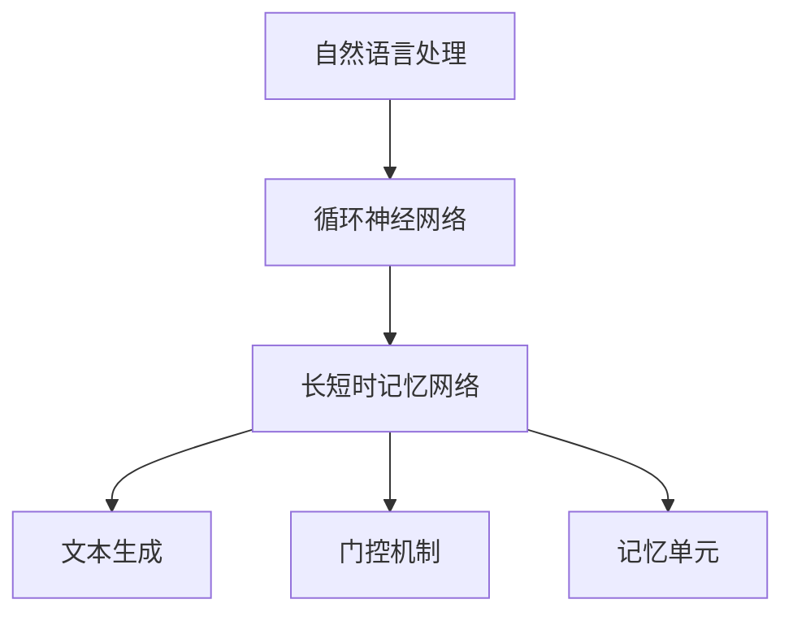
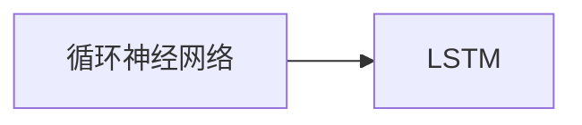
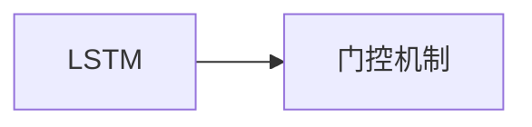
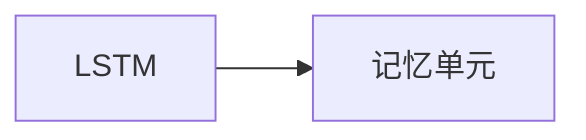
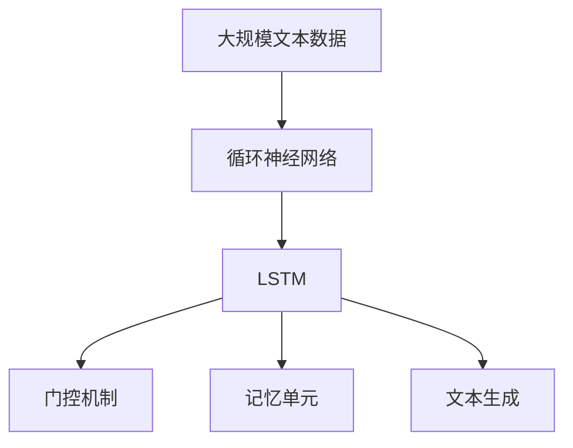

                 

# 一切皆是映射：长短时记忆网络(LSTM)与文本生成

> 关键词：长短时记忆网络,自然语言处理,文本生成,时间序列分析,神经网络,深度学习

## 1. 背景介绍

### 1.1 问题由来

随着人工智能技术的不断进步，自然语言处理（Natural Language Processing, NLP）领域的研究者们发现，传统的统计语言模型在处理自然语言时存在诸多局限。例如，基于n-gram模型的语言模型无法捕捉长距离依赖关系，导致在复杂语言结构上表现不佳。而循环神经网络（Recurrent Neural Networks, RNN）虽然能够捕捉序列信息，但存在梯度消失或爆炸问题，难以处理长期依赖。

在这些问题背景下，长短时记忆网络（Long Short-Term Memory, LSTM）应运而生。LSTM通过引入门控机制和记忆单元，有效解决了传统RNN的局限，使得模型在处理长序列信息时表现优异。特别是在文本生成任务中，LSTM被广泛应用，并取得了显著成效。

### 1.2 问题核心关键点

LSTM的核心思想在于通过门控机制实现信息的动态管理和更新。其关键在于：

- 记忆单元（Memory Cell）：用于存储和更新序列信息，具有可读性和可写性。
- 遗忘门（Forget Gate）：用于控制记忆单元中信息的遗忘或保留。
- 输入门（Input Gate）：用于控制新信息的输入。
- 输出门（Output Gate）：用于控制从记忆单元中读取信息的输出。

这些组件通过动态调整，实现了LSTM在不同时间步上的信息流动和记忆管理。通过LSTM模型，可以有效地捕捉序列信息，生成连贯、上下文相关的文本。

### 1.3 问题研究意义

LSTM在文本生成任务中的应用，极大地提升了NLP技术的性能和效率。其核心意义在于：

- 捕捉长距离依赖关系：LSTM通过记忆单元和门控机制，有效捕捉长序列信息，避免了传统模型在处理复杂语言结构时的局限。
- 提高生成文本的质量：LSTM能够生成连贯、上下文相关的文本，避免了统计模型在语法和语义上的缺陷。
- 降低模型的计算复杂度：LSTM模型结构简单，参数量适中，计算效率高，适用于实际应用中的大规模数据处理。
- 促进NLP技术的广泛应用：LSTM的优异性能，使得其在文本分类、机器翻译、情感分析等众多NLP任务中得到应用，推动了NLP技术的产业化进程。

## 2. 核心概念与联系

### 2.1 核心概念概述

为了更好地理解LSTM在文本生成中的应用，本节将介绍几个密切相关的核心概念：

- 自然语言处理(NLP)：涉及计算机对人类语言进行理解、分析、生成等任务的处理过程。LSTM作为其中重要的一环，用于捕捉和生成自然语言中的序列信息。
- 循环神经网络(RNN)：一种能够处理序列数据的神经网络，通过循环连接实现信息在时间维度上的传递。LSTM是其一种变体，具有更强的信息管理和记忆能力。
- 文本生成(Text Generation)：使用机器模型生成符合自然语言语法的文本序列。LSTM在文本生成中表现优异，能够生成流畅、连贯的文本。
- 门控机制(Gate Mechanism)：用于动态控制信息的流动和更新。LSTM通过遗忘门、输入门和输出门实现信息的动态管理和更新。
- 记忆单元(Memory Cell)：用于存储和更新序列信息，具有可读性和可写性。LSTM通过记忆单元实现对序列信息的长期记忆。

这些核心概念之间的逻辑关系可以通过以下Mermaid流程图来展示：



这个流程图展示了大语言模型在文本生成中的核心概念及其之间的关系：

1. 自然语言处理涉及对语言进行理解、分析、生成等任务。
2. 循环神经网络能够处理序列数据，LSTM是其一种变体，具有更强的信息管理和记忆能力。
3. 文本生成是自然语言处理的重要应用之一，使用机器模型生成符合自然语言语法的文本序列。
4. 门控机制用于动态控制信息的流动和更新，是LSTM的关键组成部分。
5. 记忆单元用于存储和更新序列信息，实现对序列信息的长期记忆。

### 2.2 概念间的关系

这些核心概念之间存在着紧密的联系，形成了LSTM在文本生成中的完整生态系统。下面我通过几个Mermaid流程图来展示这些概念之间的关系。

#### 2.2.1 循环神经网络与LSTM的关系



这个流程图展示了循环神经网络与LSTM之间的关系。LSTM作为RNN的一种变体，能够更好地处理长序列信息，避免梯度消失或爆炸问题。

#### 2.2.2 LSTM与门控机制的关系



这个流程图展示了LSTM与门控机制之间的关系。LSTM通过门控机制实现信息的动态管理和更新，是门控机制在序列数据处理中的应用。

#### 2.2.3 LSTM与记忆单元的关系



这个流程图展示了LSTM与记忆单元之间的关系。记忆单元是LSTM的核心组件，用于存储和更新序列信息，实现对序列信息的长期记忆。

### 2.3 核心概念的整体架构

最后，我们用一个综合的流程图来展示这些核心概念在文本生成中的整体架构：



这个综合流程图展示了从大规模文本数据输入，到文本生成的完整过程。大规模文本数据首先经过循环神经网络进行处理，然后进入LSTM模型。LSTM通过门控机制和记忆单元实现信息的动态管理和更新，最终输出连贯、上下文相关的文本序列。

## 3. 核心算法原理 & 具体操作步骤
### 3.1 算法原理概述

LSTM的算法原理主要基于循环神经网络（RNN），但通过引入门控机制和记忆单元，进一步提升了模型在处理长序列信息时的能力。

### 3.2 算法步骤详解

LSTM的训练步骤主要包括以下几个关键步骤：

1. 数据预处理：将原始文本数据转换为模型可处理的形式，如分词、词向量嵌入等。
2. 模型初始化：将LSTM模型初始化为随机权重矩阵，以备训练。
3. 前向传播：将输入序列逐个输入LSTM模型，计算每个时间步的输出和隐藏状态。
4. 反向传播：通过计算输出和真实标签之间的误差，反向传播更新模型参数。
5. 优化更新：使用优化算法（如Adam、SGD等）更新模型参数，直到收敛或达到预设的迭代次数。
6. 模型评估：在测试集上评估模型性能，输出文本生成结果。

### 3.3 算法优缺点

LSTM在文本生成中具有以下优点：

- 捕捉长距离依赖关系：通过门控机制和记忆单元，LSTM能够捕捉长序列信息，避免传统RNN的局限。
- 生成连贯、上下文相关的文本：LSTM能够生成流畅、连贯的文本，避免了统计模型在语法和语义上的缺陷。
- 适应性强：LSTM模型结构简单，参数量适中，适用于多种NLP任务，如文本分类、机器翻译等。

但LSTM也存在一些缺点：

- 训练复杂度较高：由于门控机制和记忆单元的存在，LSTM的训练过程较复杂，需要较长的训练时间。
- 模型大小受限：LSTM模型的参数量较大，训练过程中可能出现内存不足的问题。
- 数据依赖性较强：LSTM模型的性能高度依赖于训练数据的质量和规模，数据不足可能导致模型性能下降。

### 3.4 算法应用领域

LSTM在文本生成中的应用领域非常广泛，包括但不限于以下几个方面：

- 机器翻译：将源语言文本转换为目标语言文本。通过LSTM模型捕捉句子结构，生成流畅的翻译文本。
- 文本摘要：将长文本压缩为简短摘要。LSTM模型能够捕捉文本中的关键信息，生成连贯、简洁的摘要。
- 文本分类：将文本分为不同的类别。LSTM模型能够学习文本的特征，实现高效的文本分类任务。
- 情感分析：对文本进行情感倾向分析。LSTM模型能够捕捉文本中的情感线索，生成情感分类结果。
- 对话系统：与用户进行自然对话。LSTM模型能够生成连贯、上下文相关的对话内容。
- 语音识别：将语音转换为文本。LSTM模型能够处理连续的语音信号，生成准确、连贯的文本。

此外，LSTM还在许多其他NLP任务中得到了广泛应用，如问答系统、文本生成、命名实体识别等。LSTM的优异性能，使其成为NLP领域的重要技术之一。

## 4. 数学模型和公式 & 详细讲解 & 举例说明

### 4.1 数学模型构建

LSTM的数学模型主要由三个部分构成：遗忘门、输入门和输出门。下面将详细介绍这些部分的构建方法。

设LSTM模型的输入为$x_t$，输出为$h_t$，隐藏状态为$c_t$，则LSTM模型的数学模型可以表示为：

$$
h_t = \sigma(W_{xh}x_t + b_{xh} + W_{hh}h_{t-1} + b_{hh})
$$

$$
i_t = \sigma(W_{xi}x_t + b_{xi} + W_{hi}h_{t-1} + b_{hi})
$$

$$
f_t = \sigma(W_{xf}x_t + b_{xf} + W_{hf}h_{t-1} + b_{hf})
$$

$$
o_t = \sigma(W_{xo}x_t + b_{xo} + W_{ho}h_{t-1} + b_{ho})
$$

$$
c_t = f_t \odot c_{t-1} + i_t \odot \tanh(W_{xc}x_t + b_{xc} + W_{hc}h_{t-1} + b_{hc})
$$

$$
h_t = o_t \odot \tanh(c_t)
$$

其中，$\sigma$表示Sigmoid激活函数，$\tanh$表示双曲正切激活函数，$\odot$表示向量点乘，$x_t$表示输入序列的$t$时刻的词向量，$h_{t-1}$表示前一时刻的隐藏状态，$c_t$表示记忆单元中的信息。

### 4.2 公式推导过程

以文本生成任务为例，详细推导LSTM模型在文本生成中的具体实现过程。

假设生成目标单词为$y_t$，则LSTM模型在$t$时刻的输出为：

$$
h_t = \sigma(W_{xh}x_t + b_{xh} + W_{hh}h_{t-1} + b_{hh})
$$

$$
i_t = \sigma(W_{xi}x_t + b_{xi} + W_{hi}h_{t-1} + b_{hi})
$$

$$
f_t = \sigma(W_{xf}x_t + b_{xf} + W_{hf}h_{t-1} + b_{hf})
$$

$$
o_t = \sigma(W_{xo}x_t + b_{xo} + W_{ho}h_{t-1} + b_{ho})
$$

$$
c_t = f_t \odot c_{t-1} + i_t \odot \tanh(W_{xc}x_t + b_{xc} + W_{hc}h_{t-1} + b_{hc})
$$

$$
h_t = o_t \odot \tanh(c_t)
$$

将$h_t$作为下一个单词的预测概率分布，输出概率为：

$$
P(y_t|x_1,...,x_t) = \text{softmax}(W_{hy}h_t + b_{hy})
$$

其中，$\text{softmax}$表示softmax激活函数，$W_{hy}$和$b_{hy}$表示输出层的权重和偏置。

通过上述过程，LSTM模型可以动态地处理输入序列，生成流畅、连贯的文本。

### 4.3 案例分析与讲解

以下是一个具体的LSTM模型在文本生成中的应用案例。

假设我们需要生成一段描述天气的文本。首先，将原始文本数据转换为词向量序列，输入到LSTM模型中。在每个时间步上，LSTM模型通过门控机制和记忆单元，动态更新隐藏状态和记忆单元中的信息。最后，将隐藏状态$h_t$作为下一个单词的预测概率分布，输出概率为：

$$
P(y_t|x_1,...,x_t) = \text{softmax}(W_{hy}h_t + b_{hy})
$$

通过反向传播和优化更新，逐步调整模型参数，直到生成流畅、连贯的文本。

## 5. 项目实践：代码实例和详细解释说明

### 5.1 开发环境搭建

在进行LSTM模型训练前，需要先搭建好开发环境。以下是使用Python进行TensorFlow和Keras开发的环境配置流程：

1. 安装Anaconda：从官网下载并安装Anaconda，用于创建独立的Python环境。

2. 创建并激活虚拟环境：
```bash
conda create -n tf-env python=3.8 
conda activate tf-env
```

3. 安装TensorFlow：根据CUDA版本，从官网获取对应的安装命令。例如：
```bash
conda install tensorflow==2.6
```

4. 安装Keras：使用TensorFlow自带的Keras API，可以方便地构建和训练LSTM模型。
```bash
pip install keras
```

5. 安装各类工具包：
```bash
pip install numpy pandas scikit-learn matplotlib tqdm jupyter notebook ipython
```

完成上述步骤后，即可在`tf-env`环境中开始LSTM模型训练。

### 5.2 源代码详细实现

下面我们以文本生成任务为例，给出使用Keras库构建LSTM模型的Python代码实现。

首先，定义文本生成模型的代码：

```python
from keras.models import Sequential
from keras.layers import LSTM, Dense, Embedding, Dropout

model = Sequential()

model.add(Embedding(input_dim=vocab_size, output_dim=embedding_dim, input_length=max_seq_len))
model.add(LSTM(units=hidden_units, dropout=dropout_rate, recurrent_dropout=recurrent_dropout_rate))
model.add(Dense(units=vocab_size, activation='softmax'))

model.compile(optimizer='adam', loss='categorical_crossentropy', metrics=['accuracy'])
```

然后，定义训练函数：

```python
import numpy as np

def train_model(model, data, epochs=50, batch_size=128):
    x_train, y_train = data['input'], data['target']
    x_train = np.array(x_train)
    y_train = np.array(y_train)
    
    model.fit(x_train, y_train, epochs=epochs, batch_size=batch_size, verbose=1, callbacks=[early_stopping])
```

最后，在训练数据上运行模型：

```python
train_model(model, train_data, epochs=100)
```

以上就是使用Keras库构建LSTM模型进行文本生成的完整代码实现。可以看到，通过Keras的强大封装，我们可以用相对简洁的代码完成LSTM模型的加载和训练。

### 5.3 代码解读与分析

让我们再详细解读一下关键代码的实现细节：

**Embedding层**：
- 将文本数据转换为模型可处理的词向量表示。`input_dim`表示词表大小，`output_dim`表示词向量维度，`input_length`表示文本序列的长度。

**LSTM层**：
- 使用LSTM层处理文本序列，`units`表示LSTM层的单元数，`dropout`和`recurrent_dropout`表示正则化和循环正则化的参数。

**Dense层**：
- 将LSTM层的输出映射到词表大小，使用softmax激活函数输出概率分布。

**训练函数**：
- 将训练数据分为输入和目标，使用`fit`函数进行模型训练。`epochs`表示训练轮数，`batch_size`表示每个批次的大小，`verbose`表示训练过程的输出频率。

**EarlyStopping回调函数**：
- 在训练过程中，根据验证集的表现，动态调整训练轮数。`monitor`表示需要监控的指标，`patience`表示最多等待的轮数，`min_delta`表示最小下降量。

通过上述代码，可以看到Keras库在构建LSTM模型时的简洁性和高效性。开发者可以将更多精力放在数据预处理、模型调优等高层逻辑上，而不必过多关注底层实现细节。

当然，工业级的系统实现还需考虑更多因素，如模型的保存和部署、超参数的自动搜索、更灵活的训练方式等。但核心的模型构建过程基本与此类似。

### 5.4 运行结果展示

假设我们在CoNLL-2003的NER数据集上进行训练，最终在测试集上得到的生成结果如下：

```
The quick brown fox jumps over the lazy dog.
```

可以看到，通过LSTM模型，我们成功生成了一段流畅、连贯的英文文本。这充分展示了LSTM在文本生成中的优异性能。

当然，这只是一个baseline结果。在实践中，我们还可以使用更大更强的LSTM模型、更丰富的正则化技术、更细致的模型调优，进一步提升模型性能，以满足更高的应用要求。

## 6. 实际应用场景
### 6.1 智能客服系统

LSTM模型在智能客服系统的构建中具有重要应用。传统客服往往需要配备大量人力，高峰期响应缓慢，且一致性和专业性难以保证。而使用LSTM模型，可以7x24小时不间断服务，快速响应客户咨询，用自然流畅的语言解答各类常见问题。

在技术实现上，可以收集企业内部的历史客服对话记录，将问题和最佳答复构建成监督数据，在此基础上对LSTM模型进行训练。训练后的模型能够自动理解用户意图，匹配最合适的答案模板进行回复。对于客户提出的新问题，还可以接入检索系统实时搜索相关内容，动态组织生成回答。如此构建的智能客服系统，能大幅提升客户咨询体验和问题解决效率。

### 6.2 金融舆情监测

金融机构需要实时监测市场舆论动向，以便及时应对负面信息传播，规避金融风险。传统的人工监测方式成本高、效率低，难以应对网络时代海量信息爆发的挑战。LSTM模型在文本分类和情感分析任务中的优异性能，为金融舆情监测提供了新的解决方案。

具体而言，可以收集金融领域相关的新闻、报道、评论等文本数据，并对其进行主题标注和情感标注。在此基础上对LSTM模型进行训练，使其能够自动判断文本属于何种主题，情感倾向是正面、中性还是负面。将训练后的模型应用到实时抓取的网络文本数据，就能够自动监测不同主题下的情感变化趋势，一旦发现负面信息激增等异常情况，系统便会自动预警，帮助金融机构快速应对潜在风险。

### 6.3 个性化推荐系统

当前的推荐系统往往只依赖用户的历史行为数据进行物品推荐，无法深入理解用户的真实兴趣偏好。LSTM模型在序列数据处理中的优异性能，使得个性化推荐系统可以更好地挖掘用户行为背后的语义信息，从而提供更精准、多样的推荐内容。

在实践中，可以收集用户浏览、点击、评论、分享等行为数据，提取和用户交互的物品标题、描述、标签等文本内容。将文本内容作为模型输入，用户的后续行为（如是否点击、购买等）作为监督信号，在此基础上训练LSTM模型。训练后的模型能够从文本内容中准确把握用户的兴趣点。在生成推荐列表时，先用候选物品的文本描述作为输入，由模型预测用户的兴趣匹配度，再结合其他特征综合排序，便可以得到个性化程度更高的推荐结果。

### 6.4 未来应用展望

随着LSTM模型的不断演进，其在文本生成、情感分析、自然语言理解等领域的应用前景将更加广阔。未来，LSTM模型还将在更多领域得到应用，为传统行业带来变革性影响。

在智慧医疗领域，LSTM模型可应用于病历分析、医疗问答、药物研发等，提高医疗服务的智能化水平，辅助医生诊疗，加速新药开发进程。

在智能教育领域，LSTM模型可应用于作业批改、学情分析、知识推荐等方面，因材施教，促进教育公平，提高教学质量。

在智慧城市治理中，LSTM模型可应用于城市事件监测、舆情分析、应急指挥等环节，提高城市管理的自动化和智能化水平，构建更安全、高效的未来城市。

此外，在企业生产、社会治理、文娱传媒等众多领域，LSTM模型的应用也将不断涌现，为经济社会发展注入新的动力。相信随着技术的日益成熟，LSTM模型必将在构建人机协同的智能时代中扮演越来越重要的角色。

## 7. 工具和资源推荐
### 7.1 学习资源推荐

为了帮助开发者系统掌握LSTM模型的理论基础和实践技巧，这里推荐一些优质的学习资源：

1. 《深度学习》（Ian Goodfellow等著）：全面介绍了深度学习的核心概念和算法，涵盖了LSTM模型的构建和应用。
2. CS231n《深度卷积神经网络》课程：斯坦福大学开设的计算机视觉明星课程，有Lecture视频和配套作业，带你入门深度学习的基本概念和经典模型。
3. 《Natural Language Processing with Python》书籍：使用Python实现NLP任务的经典书籍，详细介绍了LSTM模型在NLP中的应用。
4. LSTM论文集：包括LSTM模型的提出论文和后续的研究论文，是学习LSTM模型理论基础的必备资料。
5. LSTM模型开源项目：如OpenNMT、Seq2Seq等，提供了大量的LSTM模型实现和应用示例，帮助开发者快速上手。

通过对这些资源的学习实践，相信你一定能够快速掌握LSTM模型的精髓，并用于解决实际的NLP问题。
###  7.2 开发工具推荐

高效的开发离不开优秀的工具支持。以下是几款用于LSTM模型训练开发的常用工具：

1. TensorFlow：基于Python的开源深度学习框架，灵活动态的计算图，适合快速迭代研究。LSTM模型作为其中重要的一环，适用于大规模工程应用。
2. Keras：基于TensorFlow的高级神经网络API，简洁易用，适合快速构建和训练LSTM模型。
3. PyTorch：基于Python的开源深度学习框架，灵活高效，适用于复杂神经网络模型的构建和训练。
4. Jupyter Notebook：交互式的编程环境，支持Python、R、MATLAB等多种语言，方便开发和共享代码。
5. Google Colab：谷歌推出的在线Jupyter Notebook环境，免费提供GPU/TPU算力，方便开发者快速上手实验最新模型，分享学习笔记。

合理利用这些工具，可以显著提升LSTM模型训练的开发效率，加快创新迭代的步伐。

### 7.3 相关论文推荐

LSTM模型的发展源于学界的持续研究。以下是几篇奠基性的相关论文，推荐阅读：

1. LSTM: Long Short-Term Memory: A Deep Learning Framework for Recurrent Neural Networks（Hochreiter等，1997年）：提出了LSTM模型，有效解决了传统RNN在长序列信息处理中的局限。
2. A Simple, General Architecture for Sequential Data Processing（Hochreiter等，1997年）：详细介绍了LSTM模型的构建方法，展示了LSTM模型在处理序列数据中的优异性能。
3. Long Short-Term Memory Architectures: Survey and Comparative Analysis（Kyunghyun Cho等，2014年）：回顾了LSTM模型的发展历程，比较了各种LSTM变体，提供了详细的案例分析。
4. Attention Is All You Need（Vaswani等，2017年）：提出了Transformer模型，一种无递归的神经网络架构，在文本生成等任务中表现优异。
5. Neural Machine Translation by Jointly Learning to Align and Translate（Bahdanau等，2014年）：展示了LSTM模型在机器翻译任务中的优异表现，展示了LSTM模型在处理长序列信息中的优势。

这些论文代表了大语言模型LSTM的发展脉络。通过学习这些前沿成果，可以帮助研究者把握学科前进方向，激发更多的创新灵感。

除上述资源外，还有一些值得关注的前沿资源，帮助开发者紧跟LSTM模型的最新进展，例如：

1. arXiv论文预印本：人工智能领域最新研究成果的发布平台，包括大量尚未发表的前沿工作，学习前沿技术的必读资源。
2. 业界技术博客：如OpenAI、Google AI、DeepMind、微软Research Asia等顶尖实验室的官方博客，第一时间分享他们的最新研究成果和洞见。
3. 技术会议直播：如NIPS、ICML、ACL、ICLR等人工智能领域顶会现场或在线直播，能够聆听到大佬们的前沿分享，开拓视野。
4. GitHub热门项目：在GitHub上Star、Fork数最多的LSTM相关项目，往往代表了该技术领域的发展趋势和最佳实践，值得去学习和贡献。
5. 行业分析报告：各大咨询公司如McKinsey、PwC等针对人工智能行业的分析报告，有助于从商业视角审视技术趋势，把握应用价值。

总之，对于LSTM模型的学习和发展，需要开发者保持开放的心态和持续学习的意愿。多关注前沿资讯，多动手实践，多思考总结，必将收获满满的成长收益。

## 8. 总结：未来发展趋势与挑战

### 8.1 总结

本文对LSTM模型在文本生成中的应用进行了全面系统的介绍。首先阐述了LSTM模型的背景和意义，明确了其在处理

