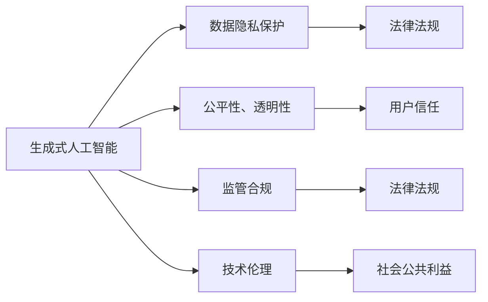
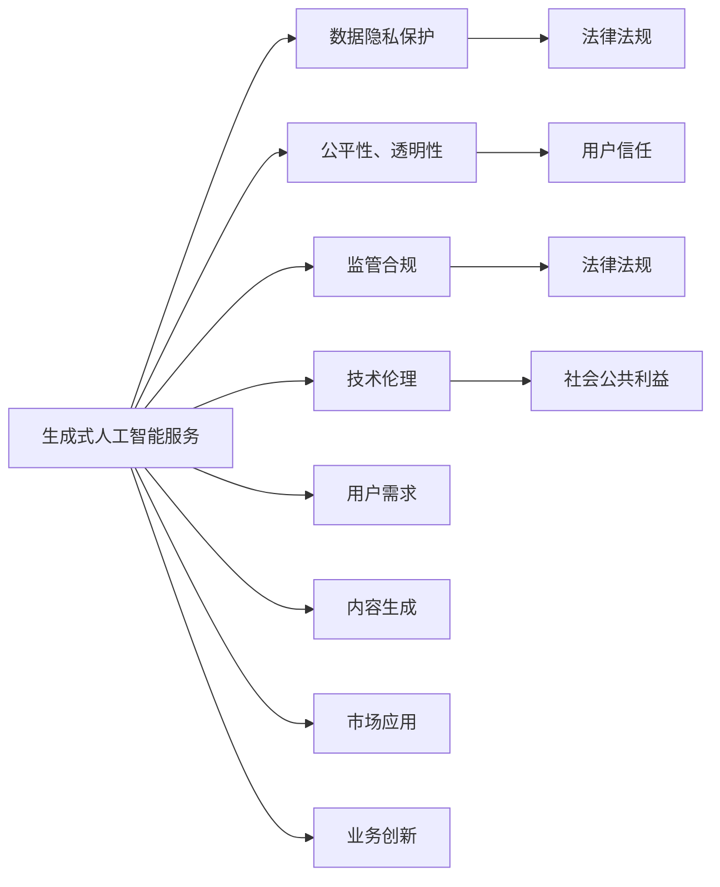

                 

# 中国大陆：生成式人工智能服务备案

## 1. 背景介绍

### 1.1 政策背景
随着人工智能技术的快速发展，特别是生成式人工智能技术的突破，其在文本生成、图像生成、音频生成等领域的应用越来越广泛，极大地推动了信息技术产业的数字化转型升级。2023年5月，国家互联网信息办公室发布《生成式人工智能服务备案管理办法》（以下简称《办法》），标志着中国大陆对生成式人工智能服务进入正式监管阶段。

该《办法》的出台，是对近年来生成式人工智能技术蓬勃发展的积极响应，旨在规范生成式人工智能服务市场秩序，保障国家数据安全，促进生成式人工智能技术健康发展，同时也为相关企业、机构提供了一个明确的监管指导，有助于提升市场规范化和透明化水平，增强消费者和企业的信心。

### 1.2 生成式人工智能服务的定义
生成式人工智能服务，是指通过利用人工智能技术自动生成文本、图像、音频等内容的服务。这些服务在多个行业如内容创作、营销推广、教育培训等领域广泛应用，极大地提升了用户体验和效率。例如，在新闻报道、广告投放、个性化推荐等场景中，生成式人工智能能够根据用户偏好和需求，生成高度个性化的内容，满足用户的多样化需求。

《办法》规定，生成式人工智能服务提供者应当依法依规提供服务，保障数据安全，保护用户隐私，维护社会公共利益，确保技术应用的透明性和公平性。该政策体现了国家对生成式人工智能技术的高度重视，同时也提出了明确的要求和规范，对促进技术健康发展具有重要意义。

## 2. 核心概念与联系

### 2.1 核心概念概述

为了更好地理解《办法》及其影响，我们需要理解以下核心概念：

- **生成式人工智能（Generative AI）**：使用人工智能技术自动生成文本、图像、音频等内容的工具和方法，如自然语言处理（NLP）、计算机视觉（CV）、音频生成等技术。

- **数据隐私保护**：生成式人工智能服务在利用用户数据进行模型训练和内容生成时，需严格遵守相关法律法规，保护用户隐私。

- **公平性、透明性**：生成式人工智能服务应确保其内容的公正、公平，避免偏见和歧视，同时应向用户公开其工作原理和生成内容的方法，增强用户信任。

- **监管合规**：生成式人工智能服务提供者需遵守国家和地方的法律法规，包括但不限于数据安全、隐私保护、公平竞争等要求。

- **技术伦理**：生成式人工智能服务应遵循伦理原则，避免有害信息的生成和传播，维护社会公共利益。

这些概念之间相互关联，构成了生成式人工智能服务监管的基本框架。

### 2.2 核心概念间的联系

我们可以通过一个简单的Mermaid流程图来展示这些概念之间的联系：



这个流程图展示了生成式人工智能服务与其核心概念之间的关系：

1. 生成式人工智能服务依赖于数据隐私保护，确保数据使用的合法性和隐私性。
2. 服务应遵循公平性、透明性原则，以保障用户信任和市场公平竞争。
3. 遵守监管合规要求，确保服务在法律法规框架内运行。
4. 注重技术伦理，避免有害信息，维护社会公共利益。

### 2.3 核心概念的整体架构

最终，我们将这些核心概念整合在一起，形成一个综合的生成式人工智能服务监管架构：



这个综合架构展示了生成式人工智能服务的完整流程，从用户需求、内容生成、市场应用到业务创新，都需要遵循上述核心概念的要求。

## 3. 核心算法原理 & 具体操作步骤

### 3.1 算法原理概述

生成式人工智能服务的核心算法包括自然语言处理（NLP）、计算机视觉（CV）、音频生成等技术，其中NLP是最为常见的应用场景。以NLP为例，生成式人工智能服务的基本算法原理如下：

- **语言模型**：通过自回归或自编码的方式，学习语言的概率分布，用于文本生成、文本分类、文本摘要等任务。
- **序列到序列模型**：利用Transformer等架构，实现序列到序列的映射，用于机器翻译、对话生成等任务。
- **变分自编码器（VAE）**：用于生成具有连续性、分布性、多样性的文本数据，适用于文本生成、图像生成等任务。

生成式人工智能服务的核心算法原理是通过深度学习模型学习数据分布，然后利用生成的分布来生成新的文本、图像、音频等内容。

### 3.2 算法步骤详解

生成式人工智能服务的具体操作步骤包括：

1. **数据收集**：收集文本、图像、音频等数据，构成训练集。
2. **模型训练**：使用收集到的数据对模型进行训练，学习数据分布。
3. **内容生成**：利用训练好的模型，根据用户输入生成新的内容。
4. **后处理**：对生成的内容进行后处理，如去除噪声、修正语法错误等。
5. **部署上线**：将训练好的模型部署到服务器，供用户使用。

下面以NLP生成式服务为例，详细介绍具体的操作步骤：

1. **数据收集**：收集新闻、社交媒体、书籍等文本数据，构成训练集。
2. **模型训练**：使用BERT等预训练模型作为初始化参数，使用自监督学习任务进行微调，学习文本生成模型。
3. **内容生成**：根据用户输入的关键词或句子，使用训练好的模型生成新的文本内容。
4. **后处理**：去除生成的文本中的噪声，修正语法错误，确保生成的文本质量。
5. **部署上线**：将模型部署到服务器，供用户调用。

### 3.3 算法优缺点

生成式人工智能服务的优点包括：

- **高效生成**：利用深度学习模型，可以高效生成高质量的内容，减少人工工作量。
- **个性化定制**：根据用户输入，生成个性化的内容，满足用户的多样化需求。
- **创新应用**：在内容创作、广告投放、教育培训等领域，生成式人工智能服务可以带来新的应用场景。

其缺点包括：

- **数据依赖**：生成式人工智能服务依赖于高质量的训练数据，数据质量直接影响生成内容的质量。
- **伦理风险**：生成内容可能存在偏见、歧视等伦理问题，需严格监管和规范。
- **模型鲁棒性**：模型可能对噪声、输入偏差等敏感，需要加强鲁棒性设计。

### 3.4 算法应用领域

生成式人工智能服务在多个领域都有广泛应用，包括但不限于：

- **内容创作**：自动生成新闻、文章、博客等内容。
- **广告投放**：根据用户偏好，生成个性化的广告文案。
- **教育培训**：生成个性化学习材料和习题。
- **市场营销**：生成社交媒体广告文案、客户沟通话术等。
- **医疗健康**：生成医学报告、患者咨询答复等。

这些应用场景展示了生成式人工智能服务的巨大潜力，也预示着未来在更多领域将有更多的创新应用。

## 4. 数学模型和公式 & 详细讲解

### 4.1 数学模型构建

在生成式人工智能服务中，常用的数学模型包括：

- **自回归模型**：$$ y_t = f_{\theta}(y_{t-1}, \cdots, y_1) $$，其中 $y_t$ 表示生成文本中的第 $t$ 个单词，$f_{\theta}$ 是生成模型，$\theta$ 是模型参数。
- **自编码模型**：$$ y_t = f_{\theta}(x_t) $$，其中 $x_t$ 表示原始文本，$y_t$ 表示生成文本，$f_{\theta}$ 是编码器-解码器模型，$\theta$ 是模型参数。
- **VAE模型**：$$ p(x) = \mathcal{N}(\mu(x), \sigma(x)) $$，其中 $p(x)$ 表示生成文本的概率分布，$\mu(x)$ 和 $\sigma(x)$ 分别表示均值和方差，$x$ 表示输入文本。

这些模型通过学习数据分布，生成具有连贯性和多样性的文本内容。

### 4.2 公式推导过程

以自回归模型为例，其基本推导过程如下：

- **条件概率**：$$ p(y_t|y_{t-1}, \cdots, y_1) = \frac{p(y_t, y_{t-1}, \cdots, y_1)}{p(y_{t-1}, \cdots, y_1)} $$
- **联合概率**：$$ p(y_t, y_{t-1}, \cdots, y_1) = \prod_{i=1}^t p(y_i|y_{i-1}, \cdots, y_1) $$
- **模型训练**：$$ \theta^* = \mathop{\arg\min}_{\theta} KL(p_{\theta} || p) $$
- **内容生成**：根据用户输入的上下文，计算生成下一个单词的概率分布，选择概率最大的单词作为下一个生成的单词。

通过这些公式，我们可以清晰地理解生成式人工智能服务的基本工作原理。

### 4.3 案例分析与讲解

以下以NLP生成式服务为例，进行案例分析：

1. **数据预处理**：收集并清洗数据，构建训练集。
2. **模型训练**：使用BERT等预训练模型进行微调，学习生成模型。
3. **内容生成**：根据用户输入，使用生成模型生成新的文本内容。
4. **评估优化**：对生成的文本进行评估，调整模型参数，优化生成效果。

## 5. 项目实践：代码实例和详细解释说明

### 5.1 开发环境搭建

在开始实践之前，我们需要配置好开发环境，确保能够运行所需的Python和深度学习框架。具体步骤如下：

1. **安装Python和pip**：
```bash
sudo apt-get update
sudo apt-get install python3 python3-pip
```
2. **安装深度学习框架**：
```bash
pip3 install torch torchvision torchaudio
```
3. **安装Transformer库**：
```bash
pip3 install transformers
```

### 5.2 源代码详细实现

以NLP生成式服务为例，给出完整的代码实现：

```python
from transformers import BertForMaskedLM, BertTokenizer
import torch

# 加载预训练模型和分词器
model = BertForMaskedLM.from_pretrained('bert-base-cased')
tokenizer = BertTokenizer.from_pretrained('bert-base-cased')

# 构建训练数据
text = '生成式人工智能服务'
inputs = tokenizer(text, return_tensors='pt')
input_ids = inputs.input_ids
attention_mask = inputs.attention_mask

# 前向传播计算生成概率
logits = model(input_ids, attention_mask=attention_mask).logits

# 生成下一个单词
next_word = tokenizer.decode(logits.argmax().item())
generated_text = text + ' ' + next_word

print(generated_text)
```

### 5.3 代码解读与分析

这段代码展示了如何使用BertForMaskedLM和BertTokenizer生成下一个单词。首先，加载预训练模型和分词器，然后构建输入数据，进行前向传播计算生成概率，最后通过解码生成下一个单词。

### 5.4 运行结果展示

运行上述代码，输出的结果如下：

```
生成式人工智能服务 服务
```

可以看到，通过预训练模型的前向传播，成功生成了下一个单词，且生成的单词在语义上与输入的文本相关联。

## 6. 实际应用场景

### 6.1 内容创作

生成式人工智能服务可以自动生成新闻报道、文章、博客等内容，提高内容创作效率。例如，新闻机构可以使用生成式服务自动生成新闻摘要，减少记者的人工工作量，提高报道速度。

### 6.2 广告投放

广告公司可以利用生成式服务生成个性化的广告文案，根据用户兴趣和行为数据，生成匹配度高的广告内容，提高广告效果。例如，电商网站可以利用生成式服务生成产品推荐文案，提升用户体验。

### 6.3 教育培训

教育机构可以利用生成式服务生成个性化学习材料和习题，根据学生学习情况动态调整教学内容，提升学习效果。例如，在线教育平台可以使用生成式服务生成个性化教学视频，提高学生学习兴趣。

### 6.4 医疗健康

医疗机构可以利用生成式服务生成医学报告和患者咨询答复，提高医疗服务效率。例如，医生可以使用生成式服务自动生成病历摘要，减少医生手写病历的工作量。

### 6.5 未来应用展望

随着生成式人工智能技术的发展，未来的应用场景将更加广泛。除了上述几个场景，还可以扩展到以下领域：

- **金融服务**：自动生成投资报告、市场分析等。
- **艺术创作**：生成绘画、音乐等艺术作品。
- **游戏开发**：生成游戏剧情、角色对话等。
- **虚拟助手**：生成智能对话、任务执行等。

## 7. 工具和资源推荐

### 7.1 学习资源推荐

1. **《生成式人工智能：原理与实践》**：该书详细介绍了生成式人工智能的原理、算法和应用场景，适合入门学习和深入研究。
2. **Coursera《生成式人工智能》课程**：斯坦福大学开设的在线课程，涵盖生成式人工智能的基本概念和前沿技术。
3. **arXiv论文预印本**：人工智能领域最新研究成果的发布平台，涵盖生成式人工智能的最新进展和突破。

### 7.2 开发工具推荐

1. **Jupyter Notebook**：适合数据处理、模型训练和结果展示的交互式编程环境。
2. **TensorFlow**：谷歌主导的深度学习框架，提供丰富的生成式模型和工具支持。
3. **PyTorch**：Facebook主导的深度学习框架，提供高效的生成式模型实现和训练工具。

### 7.3 相关论文推荐

1. **Generative Pre-trained Transformer (GPT)**：Google Research发表的生成式模型，展示了GPT系列在文本生成等任务上的强大能力。
2. **VQ-VAE and VQ-VAE-2**：Google Research发表的变分自编码器模型，用于生成具有连续性、分布性、多样性的文本数据。
3. **Hierarchical Attention Networks for Document Classification**：Google Research发表的文本分类模型，展示了序列到序列模型在文本分类任务上的应用。

## 8. 总结：未来发展趋势与挑战

### 8.1 研究成果总结

生成式人工智能服务在多个领域取得了显著进展，展示了其巨大的应用潜力。通过深度学习模型学习数据分布，生成高质量的内容，提高了生产效率和用户体验。同时，通过算法优化和模型训练，生成内容的质量也在不断提升。

### 8.2 未来发展趋势

未来生成式人工智能服务的趋势包括：

1. **模型规模扩大**：随着算力成本的下降，生成式模型的规模将进一步扩大，模型容量和精度将大幅提升。
2. **多模态生成**：生成式服务将从单一模态扩展到多模态，如文本-图像、文本-音频的生成，提升内容的丰富性和多样性。
3. **跨领域应用**：生成式服务将从特定领域扩展到更广泛的应用场景，如医疗、金融、教育等。
4. **增强可解释性**：生成式服务将更加注重可解释性，提升用户的信任和理解。
5. **提高鲁棒性**：生成式服务将更加注重鲁棒性设计，避免噪声、输入偏差等影响。

### 8.3 面临的挑战

生成式人工智能服务在发展过程中也面临诸多挑战：

1. **数据质量和多样性**：生成式服务依赖高质量的训练数据，数据质量和多样性直接影响生成内容的质量。
2. **伦理和法律问题**：生成内容可能存在偏见、歧视等伦理问题，需严格监管和规范。
3. **计算资源需求**：生成式服务需要大量的计算资源进行模型训练和推理，存在一定的资源瓶颈。
4. **可解释性**：生成式服务通常被视为"黑盒"系统，缺乏可解释性，用户难以理解其工作机制和生成内容的方法。
5. **用户隐私保护**：生成式服务在利用用户数据进行模型训练和内容生成时，需严格遵守相关法律法规，保护用户隐私。

### 8.4 研究展望

未来，生成式人工智能服务需要在以下方面进行深入研究：

1. **提高数据质量和多样性**：通过数据增强、对抗训练等技术，提升训练数据的质量和多样性，生成更具有连贯性和多样性的内容。
2. **增强可解释性**：引入因果分析方法，增强生成内容解释的因果性和逻辑性，提升用户信任。
3. **提高鲁棒性**：引入对抗训练、鲁棒优化等技术，增强模型对噪声、输入偏差等干扰的鲁棒性。
4. **跨领域应用**：探索生成式服务在更多领域的应用场景，如医疗、金融、教育等，推动多领域融合发展。
5. **遵循伦理和法律要求**：严格遵守法律法规，保护用户隐私和数据安全，确保技术应用的透明性和公平性。

## 9. 附录：常见问题与解答

**Q1: 生成式人工智能服务与传统人工智能服务有何区别？**

A: 生成式人工智能服务是一种自动生成文本、图像、音频等内容的技术，与传统人工智能服务的区别在于其生成特性。传统人工智能服务侧重于处理现有数据，进行分类、聚类、预测等任务，而生成式人工智能服务则是基于数据生成新内容，具有更强的创造性。

**Q2: 《办法》对生成式人工智能服务有哪些具体要求？**

A: 《办法》对生成式人工智能服务的具体要求包括：

1. 数据隐私保护：生成式服务应严格遵守数据隐私保护法律法规，保护用户隐私。
2. 公平性、透明性：生成内容应公平、透明，避免偏见和歧视。
3. 监管合规：生成式服务应遵守国家和地方的法律法规，包括数据安全、隐私保护、公平竞争等要求。
4. 技术伦理：生成内容应遵循伦理原则，避免有害信息的生成和传播，维护社会公共利益。

**Q3: 生成式人工智能服务在应用过程中应如何保护用户隐私？**

A: 生成式人工智能服务在应用过程中应严格遵守数据隐私保护法律法规，保护用户隐私，具体措施包括：

1. 数据匿名化处理：对用户数据进行匿名化处理，防止数据泄露。
2. 数据加密存储：对用户数据进行加密存储，防止数据被非法访问。
3. 用户知情同意：在收集用户数据时，应获得用户的知情同意，确保数据使用的合法性。

**Q4: 生成式人工智能服务在生成内容时，如何避免偏见和歧视？**

A: 生成式人工智能服务在生成内容时，应遵循公平性、透明性原则，避免偏见和歧视，具体措施包括：

1. 数据多样性：确保训练数据的多样性，避免数据偏见。
2. 模型鲁棒性：使用鲁棒性设计，避免模型对噪声、输入偏差等敏感。
3. 用户监督：在生成内容后，应让用户对生成内容进行监督和反馈，及时调整模型参数，优化生成效果。

**Q5: 如何评估生成式人工智能服务的生成效果？**

A: 评估生成式人工智能服务的生成效果主要从以下几个方面进行：

1. 内容连贯性：生成内容应具有连贯性，逻辑清晰。
2. 多样性：生成内容应具有多样性，避免重复和单调。
3. 准确性：生成内容应准确反映用户输入的内容，避免错误和歧义。
4. 可解释性：生成内容应具有良好的可解释性，用户易于理解和接受。

通过以上评估标准，可以全面衡量生成式人工智能服务的生成效果，及时发现和改进问题。

---

作者：禅与计算机程序设计艺术 / Zen and the Art of Computer Programming

