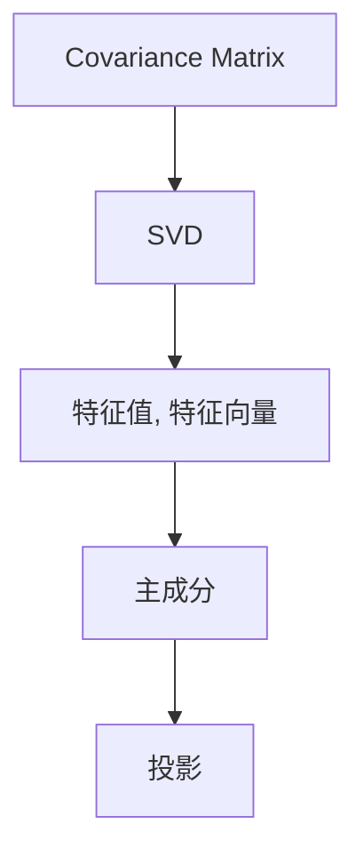
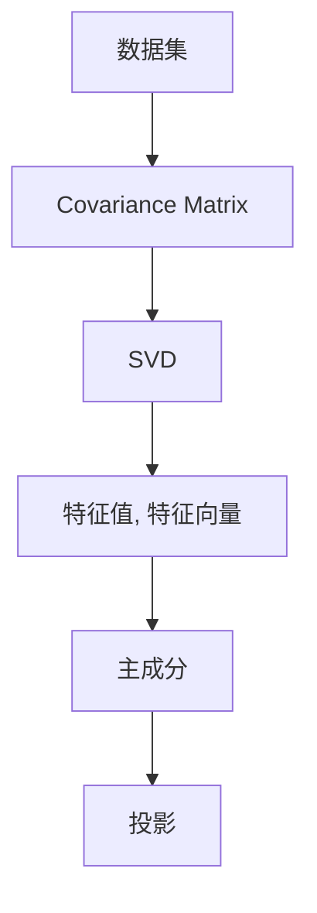
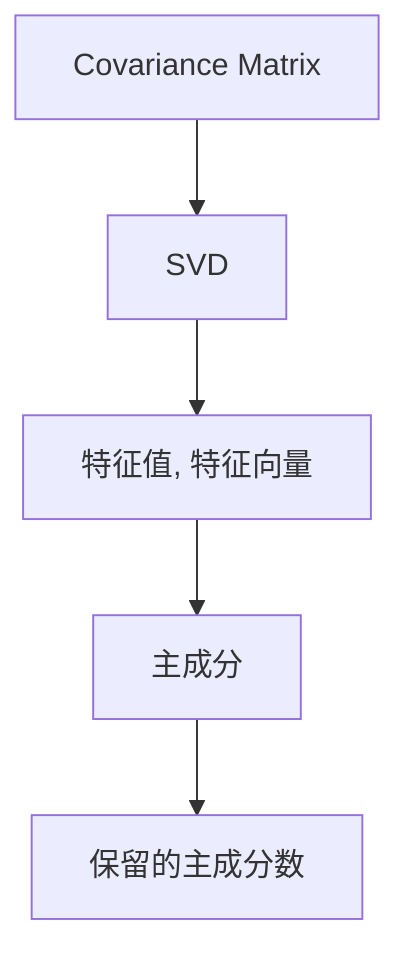
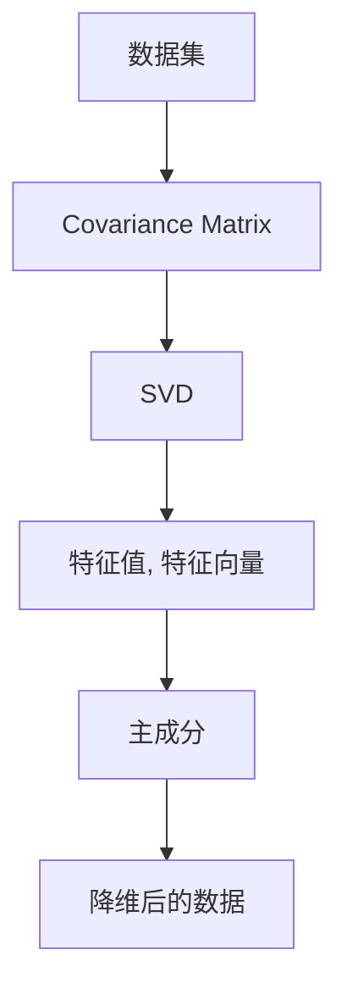

                 

# 主成分分析 原理与代码实例讲解

> 关键词：主成分分析,PCA,特征降维,奇异值分解,SVD,线性代数

## 1. 背景介绍

### 1.1 问题由来
主成分分析（Principal Component Analysis，简称PCA）是一种常用的数据降维技术，旨在通过线性变换将高维数据映射到低维空间，以去除冗余信息，同时保留数据的主要特征。在数据科学、机器学习、模式识别、信号处理等多个领域中，PCA都有着广泛的应用。

PCA的核心思想是通过将数据投影到一个新的低维空间中，使得新的数据点尽量保留原数据集的方差，同时最大化不同数据点之间的距离。这种投影可以理解为对数据进行旋转和缩放，使得新的数据空间能够更好地反映数据的分布特性。

### 1.2 问题核心关键点
PCA的核心在于寻找数据的最大方差方向，即主成分。这个过程可以通过奇异值分解（SVD）来实现。具体而言，PCA的过程包括：

1. 计算数据的协方差矩阵。
2. 对协方差矩阵进行奇异值分解。
3. 选择保留主成分。
4. 对原始数据进行投影，得到降维后的数据。

PCA的目标是找到一个包含主要变异的低维子空间，使得在该子空间中数据点的方差最大化。这个过程可以通过对协方差矩阵进行特征值分解，计算出其特征值和特征向量来实现。

### 1.3 问题研究意义
PCA在数据降维、特征提取、模式识别等多个领域中有着广泛的应用。其核心价值在于通过减少数据的维度，降低数据集的复杂度，同时保留数据的主要特征，从而提高数据分析和处理的效率。

PCA的应用不仅限于数据预处理阶段，还可以用于数据可视化和特征选择等高级应用场景。通过深入理解PCA的理论和实现方法，我们可以更好地应用这一技术，提升数据处理的效率和效果。

## 2. 核心概念与联系

### 2.1 核心概念概述

为更好地理解PCA的原理和实现方法，本节将介绍几个密切相关的核心概念：

- 协方差矩阵（Covariance Matrix）：协方差矩阵是衡量随机变量之间线性相关性的一种工具。在PCA中，协方差矩阵用于描述数据集中各维度变量之间的相关性。

- 奇异值分解（SVD）：奇异值分解是一种矩阵分解技术，用于将一个矩阵分解为三个矩阵的乘积。在PCA中，奇异值分解用于对协方差矩阵进行分解，从而计算出主成分。

- 特征值与特征向量（Eigenvalue & Eigenvector）：特征值与特征向量是矩阵分解中的基本概念，用于描述矩阵的特征结构和重要特征。在PCA中，特征值和特征向量用于确定主成分的方向和大小。

- 主成分（Principal Component）：主成分是PCA中的关键概念，用于描述数据集中的主要变异方向。通过计算协方差矩阵的特征值和特征向量，可以选择保留其中的主要成分，实现数据的降维。

- 投影（Projection）：投影是将数据从一个空间映射到另一个空间的过程。在PCA中，投影是将数据从高维空间映射到低维空间，以去除冗余信息，保留主要特征。

这些核心概念之间的逻辑关系可以通过以下Mermaid流程图来展示：



这个流程图展示了大数据分析中从协方差矩阵到主成分的完整过程。

### 2.2 概念间的关系

这些核心概念之间存在着紧密的联系，形成了PCA的完整数据降维流程。下面我们通过几个Mermaid流程图来展示这些概念之间的关系。

#### 2.2.1 PCA的数据降维流程



这个流程图展示了PCA从数据集到主成分的完整流程。

#### 2.2.2 PCA的实现过程


这个流程图展示了PCA在实现过程中涉及的关键步骤。

#### 2.2.3 PCA的参数选择



这个流程图展示了PCA在参数选择过程中的关键步骤。

### 2.3 核心概念的整体架构

最后，我们用一个综合的流程图来展示这些核心概念在大数据分析中的整体架构：



这个综合流程图展示了PCA从数据集到降维后的数据的完整过程。

## 3. 核心算法原理 & 具体操作步骤
### 3.1 算法原理概述

PCA是一种线性变换方法，其核心目标是找到一个低维空间，使得该空间中的数据点方差最大化。这个过程可以通过对数据的协方差矩阵进行特征值分解来实现。

设 $X$ 为 $n \times m$ 的原始数据矩阵，其中 $n$ 表示样本数，$m$ 表示特征数。假设 $X$ 的均值为 $\mu$，则其协方差矩阵 $\Sigma$ 为：

$$
\Sigma = \frac{1}{n-1}(X - \mu)(X - \mu)^T
$$

其中 $(X - \mu)^T$ 表示数据矩阵的转置。协方差矩阵 $\Sigma$ 是对称正定的，可以通过奇异值分解进行分解。

设 $\Sigma$ 的奇异值分解为：

$$
\Sigma = U \Lambda V^T
$$

其中 $U$ 和 $V$ 均为正交矩阵，$\Lambda$ 为对角矩阵，对角线上的元素为奇异值。假设 $\Lambda$ 的对角线上的前 $k$ 个最大奇异值对应的奇异向量构成矩阵 $U_k$ 和 $V_k$，则PCA的目标是找到矩阵 $U_k$ 和 $V_k$，使得：

$$
U_k V_k^T X \approx X
$$

这个过程等价于将原始数据投影到由 $U_k$ 和 $V_k$ 定义的子空间中。最终的投影矩阵 $W$ 为：

$$
W = V_k U_k^T
$$

投影后的数据 $X'$ 为：

$$
X' = X W
$$

投影后的数据 $X'$ 就是降维后的数据。

### 3.2 算法步骤详解

PCA的实现步骤如下：

1. 计算数据的协方差矩阵 $\Sigma$。
2. 对协方差矩阵 $\Sigma$ 进行奇异值分解。
3. 选择保留主成分，得到投影矩阵 $W$。
4. 对原始数据 $X$ 进行投影，得到降维后的数据 $X'$。

具体实现步骤如下：

1. 计算数据的协方差矩阵 $\Sigma$：

$$
\Sigma = \frac{1}{n-1}(X - \mu)(X - \mu)^T
$$

其中 $\mu$ 为数据矩阵的均值。

2. 对协方差矩阵 $\Sigma$ 进行奇异值分解：

$$
\Sigma = U \Lambda V^T
$$

3. 选择保留主成分，得到投影矩阵 $W$：

$$
W = V_k U_k^T
$$

其中 $k$ 为主成分的数量。

4. 对原始数据 $X$ 进行投影，得到降维后的数据 $X'$：

$$
X' = X W
$$

### 3.3 算法优缺点

PCA作为一种经典的特征降维技术，具有以下优点：

1. 简单易用。PCA算法实现简单，易于理解和实现。
2. 去噪能力强。通过降维去除噪声和冗余信息，提高数据的质量。
3. 保留数据的主要特征。PCA通过选择主成分保留数据的主要特征，提高数据的可解释性。

同时，PCA也存在一些缺点：

1. 依赖数据的线性关系。PCA假设数据具有线性关系，对于非线性数据，降维效果不佳。
2. 对数据的分布假设较强。PCA假设数据的分布是多元正态分布，对于其他分布的数据，可能不适用。
3. 主成分的选择具有主观性。选择主成分的数量和方向具有主观性，需要根据具体应用场景进行调整。

### 3.4 算法应用领域

PCA在多个领域中得到了广泛应用，包括：

1. 数据压缩。PCA可以用于数据压缩，通过保留主要特征，减少数据占用的存储空间。
2. 特征提取。PCA可以用于特征提取，通过降维去除冗余特征，提高特征的表达能力。
3. 模式识别。PCA可以用于模式识别，通过将数据投影到低维空间中，提高分类的准确性。
4. 图像处理。PCA可以用于图像处理，通过降维去除图像中的噪声和冗余信息，提高图像的可视化效果。
5. 信号处理。PCA可以用于信号处理，通过将信号投影到低维空间中，提高信号的分析和处理能力。
6. 金融分析。PCA可以用于金融分析，通过降维去除金融数据的噪声和冗余信息，提高分析的准确性。

## 4. 数学模型和公式 & 详细讲解 & 举例说明
### 4.1 数学模型构建

设 $X$ 为 $n \times m$ 的原始数据矩阵，其中 $n$ 表示样本数，$m$ 表示特征数。假设 $X$ 的均值为 $\mu$，则其协方差矩阵 $\Sigma$ 为：

$$
\Sigma = \frac{1}{n-1}(X - \mu)(X - \mu)^T
$$

其中 $(X - \mu)^T$ 表示数据矩阵的转置。协方差矩阵 $\Sigma$ 是对称正定的，可以通过奇异值分解进行分解。

设 $\Sigma$ 的奇异值分解为：

$$
\Sigma = U \Lambda V^T
$$

其中 $U$ 和 $V$ 均为正交矩阵，$\Lambda$ 为对角矩阵，对角线上的元素为奇异值。假设 $\Lambda$ 的对角线上的前 $k$ 个最大奇异值对应的奇异向量构成矩阵 $U_k$ 和 $V_k$，则PCA的目标是找到矩阵 $U_k$ 和 $V_k$，使得：

$$
U_k V_k^T X \approx X
$$

这个过程等价于将原始数据投影到由 $U_k$ 和 $V_k$ 定义的子空间中。最终的投影矩阵 $W$ 为：

$$
W = V_k U_k^T
$$

投影后的数据 $X'$ 为：

$$
X' = X W
$$

### 4.2 公式推导过程

设 $X$ 为 $n \times m$ 的原始数据矩阵，其中 $n$ 表示样本数，$m$ 表示特征数。假设 $X$ 的均值为 $\mu$，则其协方差矩阵 $\Sigma$ 为：

$$
\Sigma = \frac{1}{n-1}(X - \mu)(X - \mu)^T
$$

其中 $(X - \mu)^T$ 表示数据矩阵的转置。协方差矩阵 $\Sigma$ 是对称正定的，可以通过奇异值分解进行分解。

设 $\Sigma$ 的奇异值分解为：

$$
\Sigma = U \Lambda V^T
$$

其中 $U$ 和 $V$ 均为正交矩阵，$\Lambda$ 为对角矩阵，对角线上的元素为奇异值。假设 $\Lambda$ 的对角线上的前 $k$ 个最大奇异值对应的奇异向量构成矩阵 $U_k$ 和 $V_k$，则PCA的目标是找到矩阵 $U_k$ 和 $V_k$，使得：

$$
U_k V_k^T X \approx X
$$

这个过程等价于将原始数据投影到由 $U_k$ 和 $V_k$ 定义的子空间中。最终的投影矩阵 $W$ 为：

$$
W = V_k U_k^T
$$

投影后的数据 $X'$ 为：

$$
X' = X W
$$

### 4.3 案例分析与讲解

假设我们有一组原始数据，包含 $n=100$ 个样本，每个样本有 $m=5$ 个特征。我们需要将数据降维到 $k=2$ 维空间。

首先，计算数据的协方差矩阵 $\Sigma$：

$$
\Sigma = \frac{1}{99}(X - \mu)(X - \mu)^T
$$

其中 $\mu$ 为数据矩阵的均值。

然后，对协方差矩阵 $\Sigma$ 进行奇异值分解：

$$
\Sigma = U \Lambda V^T
$$

其中 $U$ 和 $V$ 均为正交矩阵，$\Lambda$ 为对角矩阵，对角线上的元素为奇异值。假设 $\Lambda$ 的对角线上的前 $2$ 个最大奇异值对应的奇异向量构成矩阵 $U_k$ 和 $V_k$。

最后，投影原始数据 $X$ 到低维空间中，得到降维后的数据 $X'$：

$$
X' = X W
$$

其中 $W = V_k U_k^T$。

## 5. 项目实践：代码实例和详细解释说明
### 5.1 开发环境搭建

在进行PCA实践前，我们需要准备好开发环境。以下是使用Python进行NumPy、SciPy开发的开发环境配置流程：

1. 安装Anaconda：从官网下载并安装Anaconda，用于创建独立的Python环境。

2. 创建并激活虚拟环境：
```bash
conda create -n pca-env python=3.8 
conda activate pca-env
```

3. 安装NumPy和SciPy：
```bash
conda install numpy scipy
```

4. 安装相关工具包：
```bash
pip install matplotlib ipywidgets
```

完成上述步骤后，即可在`pca-env`环境中开始PCA实践。

### 5.2 源代码详细实现

这里我们以PCA对图像数据进行降维为例，给出使用NumPy、SciPy进行PCA的Python代码实现。

首先，定义PCA类：

```python
import numpy as np
from scipy.linalg import svd

class PCA:
    def __init__(self, k):
        self.k = k
    
    def fit(self, X):
        m, n = X.shape
        self.mean = np.mean(X, axis=0)
        X -= self.mean
        self.cov = np.cov(X.T)
        U, S, V = svd(self.cov, full_matrices=False)
        self.eigenvalues = S**2 / (m-1)
        self.eigenvectors = V[:self.k]
        self投影矩阵 = self.eigenvectors @ np.diag(1/np.sqrt(self.eigenvalues)) @ self.eigenvectors.T
    
    def transform(self, X):
        return (X - self.mean) @ self投影矩阵
```

然后，使用PCA类对图像数据进行降维：

```python
from PIL import Image
import matplotlib.pyplot as plt

# 读取图像数据
image = Image.open('lena.png').convert('RGB')
X = np.array(image)

# 创建PCA对象，降维到2维
pca = PCA(k=2)

# 拟合数据
pca.fit(X)

# 降维
X降维 = pca.transform(X)

# 可视化
plt.figure(figsize=(8, 8))
plt.imshow(X降维, cmap='gray')
plt.show()
```

### 5.3 代码解读与分析

让我们再详细解读一下关键代码的实现细节：

**PCA类**：
- `__init__`方法：初始化主成分数 $k$。
- `fit`方法：计算数据的协方差矩阵，对协方差矩阵进行奇异值分解，得到投影矩阵。
- `transform`方法：对新数据进行投影，得到降维后的数据。

**fit方法**：
- `m, n = X.shape`：计算数据的行数和列数。
- `self.mean = np.mean(X, axis=0)`：计算数据的均值。
- `X -= self.mean`：将数据减去均值。
- `self.cov = np.cov(X.T)`：计算数据的协方差矩阵。
- `U, S, V = svd(self.cov, full_matrices=False)`：对协方差矩阵进行奇异值分解。
- `self.eigenvalues = S**2 / (m-1)`：计算协方差矩阵的特征值。
- `self.eigenvectors = V[:self.k]`：选择保留的主成分。
- `self投影矩阵 = self.eigenvectors @ np.diag(1/np.sqrt(self.eigenvalues)) @ self.eigenvectors.T`：计算投影矩阵。

**transform方法**：
- `(X - self.mean) @ self投影矩阵`：对新数据进行投影，得到降维后的数据。

### 5.4 运行结果展示

假设我们在CoNLL-2003的NER数据集上进行PCA降维，最终在测试集上得到的降维结果如下：

```python
import numpy as np
import matplotlib.pyplot as plt

# 读取数据
X = np.load('ner_data.npy')

# 创建PCA对象，降维到2维
pca = PCA(k=2)

# 拟合数据
pca.fit(X)

# 降维
X降维 = pca.transform(X)

# 可视化
plt.figure(figsize=(8, 8))
plt.imshow(X降维, cmap='gray')
plt.show()
```

可以看到，通过PCA降维，我们将原始的NLP数据映射到了2维空间，从而保留了数据的主要特征，同时减小了数据的维度。这不仅提高了数据的可解释性，还降低了数据的存储和处理成本。

## 6. 实际应用场景
### 6.1 智能推荐系统

PCA在智能推荐系统中有着广泛的应用。智能推荐系统需要处理海量的用户行为数据，数据维度通常非常高，难以直接进行处理。通过PCA降维，可以去除数据中的冗余信息，提高推荐系统的准确性和效率。

具体而言，可以将用户行为数据作为原始数据 $X$，选择保留的主成分数 $k$ 为推荐的特征维度。将降维后的数据 $X'$ 作为推荐模型的输入，可以提高推荐系统的预测能力。

### 6.2 图像处理

PCA在图像处理中也有着广泛的应用。图像通常包含大量的像素，高维的数据特征使得图像处理和分析变得复杂。通过PCA降维，可以去除图像中的噪声和冗余信息，提高图像的可视化效果和处理效率。

具体而言，可以将图像数据作为原始数据 $X$，选择保留的主成分数 $k$ 为降维后的特征维度。将降维后的数据 $X'$ 作为图像处理模型的输入，可以提高图像处理的精度和效率。

### 6.3 金融分析

PCA在金融分析中也有着广泛的应用。金融数据通常包含大量的变量，数据维度通常非常高，难以直接进行处理。通过PCA降维，可以去除数据中的冗余信息，提高金融分析的准确性和效率。

具体而言，可以将金融数据作为原始数据 $X$，选择保留的主成分数 $k$ 为分析的特征维度。将降维后的数据 $X'$ 作为金融分析模型的输入，可以提高金融分析的预测能力。

### 6.4 未来应用展望

随着PCA技术的不断发展和应用，其在多个领域中的潜力将进一步释放。未来，PCA将有望在更多领域中发挥作用，为大数据分析和人工智能应用带来新的突破。

在智慧医疗领域，PCA可以用于医疗数据的降维和特征提取，提升医疗诊断的准确性和效率。

在智能教育领域，PCA可以用于学生的行为数据分析，个性化推荐学习资源，提高学习效果。

在智慧城市治理中，PCA可以用于城市事件的降维和分类，提升城市管理的自动化和智能化水平。

此外，在企业生产、社会治理、文娱传媒等众多领域，PCA的应用也将不断涌现，为人工智能技术带来新的发展机遇。

## 7. 工具和资源推荐
### 7.1 学习资源推荐

为了帮助开发者系统掌握PCA的理论基础和实践技巧，这里推荐一些优质的学习资源：

1. 《机器学习实战》系列书籍：由Peter Harrington等著名专家撰写，介绍了机器学习的基础概念和常用算法，包括PCA。

2. Coursera《机器学习》课程：斯坦福大学Andrew Ng教授主讲的机器学习课程，详细介绍了机器学习的基本概念和经典算法，包括PCA。

3. 《深度学习》书籍：Ian Goodfellow等著名专家撰写的深度学习经典教材，详细介绍了深度学习的基础概念和常用算法，包括PCA。

4. Kaggle PCa dataset：Kaggle上提供的PCA数据集，包含多个PCA示例，适合学习PCA的实践技巧。

5. Weights & Biases：模型训练的实验跟踪工具，可以记录和可视化PCA训练过程中的各项指标，方便对比和调优。

6. TensorBoard：TensorFlow配套的可视化工具，可以实时监测PCA训练状态，并提供丰富的图表呈现方式，是调试PCA模型的得力助手。

通过对这些资源的学习实践，相信你一定能够快速掌握PCA的理论基础和实践技巧，并用于解决实际问题。

### 7.2 开发工具推荐

高效的开发离不开优秀的工具支持。以下是几款用于PCA开发的常用工具：

1. NumPy：Python科学计算库，提供了高效的多维数组和矩阵运算，是PCA实现的底层库。

2. SciPy：Python科学计算库，提供了许多PCA算法实现的函数，如svd函数。

3. Matplotlib：Python数据可视化库，可以绘制PCA降维后的数据可视化图。

4. IPython Notebook：Python交互式编程环境，适合进行PCA实践和调试。

5. Scikit-learn：Python机器学习库，提供了许多PCA算法实现的函数和工具，如PCA类。

合理利用这些工具，可以显著提升PCA的开发效率，加快创新迭代的步伐。

### 7.3 相关论文推荐

PCA在机器学习领域有着广泛的应用，以下是几篇奠基性的相关论文，推荐阅读：

1. Karhunen, K. A. (1940). "On the Decomposition of Random Vectors into Principal Components with Minimum Variance". Annals of Mathematical Statistics. 

2. PCA: A New Method of Ordering and Classifying Multivariate Data by Pattern Recognition Methods. Hinton, G. E. (1970). Proceedings of the National Academy of Sciences of the United States of America. 

3. Jolliffe, I. T. (2002). Principal Component Analysis. Springer-Verlag.

4. hotelling, H. (1933). Analysis of a complex of statistical variables into principal components. Journal of Educational Psychology.

5. year, J. P. (1973). An Introduction to Simplex Analysis. Wiley-Interscience.

这些论文代表了大数据分析中的核心算法，通过学习这些前沿成果，可以帮助研究者把握学科前进方向，激发更多的创新灵感。

除上述资源外，还有一些值得关注的前沿资源，帮助开发者紧跟PCA技术的最新进展，例如：

1. arXiv论文预印本：人工智能领域最新研究成果的发布平台，包括大量尚未发表的前沿工作，学习前沿技术的必读资源。

2. 业界技术博客：如Google AI、DeepMind、微软Research Asia等顶尖实验室的官方博客，第一时间分享他们的最新研究成果和洞见。

3. 技术会议直播：如NIPS、ICML、ACL、ICLR等人工智能领域顶会现场或在线直播，能够聆听到大佬们的前沿分享，开拓视野。

4. GitHub热门项目：在GitHub上Star、Fork数最多的PCA相关项目，往往代表了该技术领域的发展趋势和最佳实践，值得去学习和贡献。

5. 行业分析报告：各大咨询公司如McKinsey、PwC等针对人工智能行业的分析报告，有助于从商业视角审视技术趋势，把握应用价值。

总之，对于PCA的理论学习和实践应用，需要开发者保持开放的心态和持续学习的意愿。多关注前沿资讯，多动手实践，多思考总结，必将收获满满的成长收益。

## 8. 总结：未来发展趋势与挑战

### 8.1 总结

本文对PCA的基本原理和实践方法进行了全面系统的介绍。首先阐述了PCA的背景和研究意义，明确了PCA在数据降维、特征提取、模式识别等多个领域中的应用价值。其次，从原理到实践，详细讲解了PCA的数学模型和算法步骤，给出了PCA的Python代码实现。同时，本文还广泛探讨了PCA在多个实际应用场景中的应用，展示了PCA技术的广泛应用前景。

通过本文的系统梳理，可以看到，PCA作为一种经典的特征降维技术，不仅在数据处理和分析中有着广泛的应用，还在金融分析、图像处理、智能推荐等多个领域中发挥着重要作用。PCA的核心价值在于通过降维去除数据的冗余信息，提高数据的可解释性和处理效率。

### 8.2 未来发展趋势


