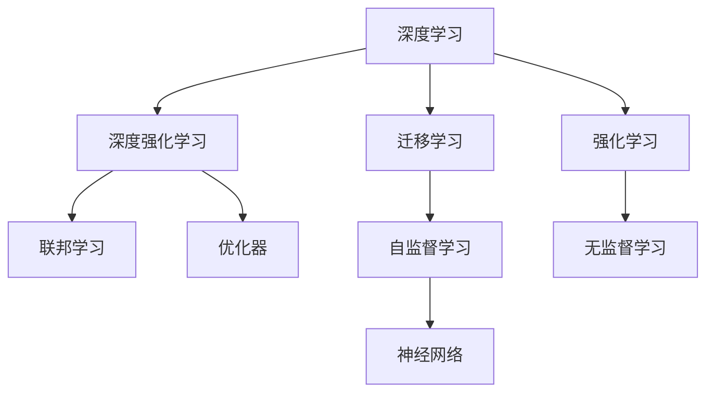
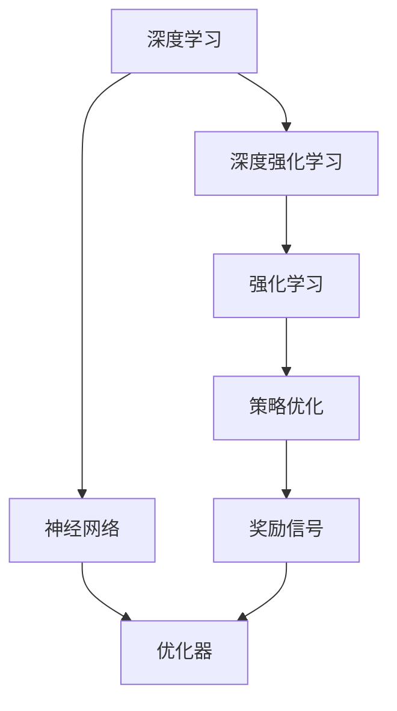
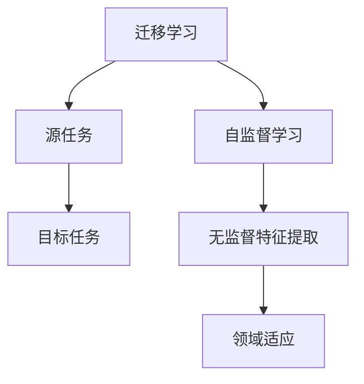

                 

# 人工智能前沿研究热点与发展趋势原理与代码实战案例讲解

> 关键词：人工智能,机器学习,深度学习,深度强化学习,迁移学习,联邦学习,自监督学习,未来技术

## 1. 背景介绍

### 1.1 问题由来
随着科技的迅猛发展，人工智能（AI）成为全球科技界、产业界乃至社会各界的焦点。在过去十年间，AI技术取得了翻天覆地的变化，尤其是在深度学习（Deep Learning）的推动下，许多前沿研究从理论到应用都实现了突破性进展。本文将聚焦于人工智能领域的前沿研究热点与发展趋势，通过深入分析其核心概念和算法原理，并结合真实案例，展现其在各行各业中的广泛应用，以及未来的发展前景。

### 1.2 问题核心关键点
人工智能前沿研究热点和发展趋势涉及多个子领域，包括深度学习、深度强化学习、迁移学习、联邦学习、自监督学习等。这些技术的发展不仅推动了人工智能从基础理论到实际应用的跨越，也在不断地塑造着未来技术的演进方向。以下是这些技术的关键点：

1. **深度学习**：神经网络结构和算法的改进，使模型能够处理更复杂的数据和任务。
2. **深度强化学习**：通过学习环境中的动态决策策略，实现自我改进和智能控制。
3. **迁移学习**：通过知识跨领域的迁移，减少新任务的学习成本。
4. **联邦学习**：在保护隐私的前提下，多个本地设备协同更新模型，实现全局优化。
5. **自监督学习**：在没有标签的情况下，从数据本身学习潜在特征和结构。

## 2. 核心概念与联系

### 2.1 核心概念概述

在深入讨论具体技术之前，我们首先明确几个核心概念：

- **深度学习**：一种基于神经网络的机器学习技术，通过多层非线性变换对数据进行特征提取和建模。
- **深度强化学习**：结合强化学习（Reinforcement Learning, RL）和深度学习，通过交互式学习环境中的奖励信号指导模型优化决策。
- **迁移学习**：通过在一个领域学习到的知识，迁移到另一个领域，以提升新领域学习的效果。
- **联邦学习**：在分布式环境中，多个设备合作训练模型，保护本地数据隐私。
- **自监督学习**：利用数据自身的特性进行无监督学习，发现数据的潜在结构。

这些概念通过逻辑串联，形成了一个不断演进的人工智能框架，如图1所示。



### 2.2 概念间的关系

在以上核心概念之间，存在错综复杂的联系。以下将通过几个关键的Mermaid流程图展示这些关系：

#### 2.2.1 深度学习和深度强化学习的关系



这个流程图展示了深度学习与深度强化学习的紧密联系。深度学习中的神经网络用于模型构建和特征提取，而深度强化学习则依赖优化器进行策略优化，同时使用奖励信号指导模型行为。

#### 2.2.2 迁移学习和自监督学习的关系



迁移学习和自监督学习在模型构建中都强调了无监督特征提取的重要性。迁移学习通过在源任务上学习到的特征，迁移应用到目标任务上，而自监督学习则通过无标签数据本身挖掘特征。

## 3. 核心算法原理 & 具体操作步骤

### 3.1 算法原理概述

- **深度学习**：通过多层神经网络，对输入数据进行特征提取和分类，其基本原理为反向传播算法和梯度下降优化器。
- **深度强化学习**：结合模型预测和环境反馈，通过奖励机制指导模型优化决策，算法原理包括Q-learning、策略梯度等。
- **迁移学习**：通过已有知识库，如预训练的词向量或图像特征，加速新任务的学习，算法原理包括知识蒸馏、特征适配等。
- **联邦学习**：在多个本地设备上分布式训练模型，算法原理包括参数同步和联邦聚合。
- **自监督学习**：利用数据自相关的特性进行无监督学习，算法原理包括自编码、预测编码等。

### 3.2 算法步骤详解

以下是各个核心算法详细步骤：

#### 3.2.1 深度学习步骤详解

1. **数据预处理**：将原始数据转化为神经网络可以处理的张量形式。
2. **构建模型**：设计合适的神经网络结构，包括输入层、隐藏层、输出层。
3. **损失函数定义**：根据任务需求定义损失函数，如交叉熵损失。
4. **反向传播**：通过前向传播计算预测结果，使用反向传播算法求导损失函数。
5. **参数更新**：使用优化器调整模型参数，如Adam、SGD等。
6. **模型评估**：在验证集上评估模型性能，如准确率、召回率等。

#### 3.2.2 深度强化学习步骤详解

1. **环境定义**：构建环境模型，如迷宫、游戏等。
2. **策略定义**：设计智能体的决策策略，如Q-learning策略。
3. **训练循环**：进行多轮交互，每次迭代更新策略参数。
4. **奖励信号**：根据环境反馈，调整策略优化方向。
5. **模型评估**：评估策略在特定环境中的表现，如成功率、回报等。

#### 3.2.3 迁移学习步骤详解

1. **源任务训练**：使用源任务的数据集进行模型训练。
2. **特征提取**：从预训练模型中提取特征，如BERT的词向量。
3. **目标任务微调**：将提取的特征应用到目标任务，使用小样本进行微调。
4. **模型评估**：在目标任务的数据集上评估模型性能。

#### 3.2.4 联邦学习步骤详解

1. **本地模型训练**：在多个本地设备上训练本地模型。
2. **参数同步**：通过参数服务器或交换技术，将本地模型参数同步到全局模型。
3. **模型聚合**：对全局模型进行聚合，生成新的全局模型参数。
4. **本地更新**：根据全局模型参数，更新本地模型。

#### 3.2.5 自监督学习步骤详解

1. **数据预处理**：将数据进行标准化、归一化等预处理。
2. **自监督任务定义**：设计自监督任务，如预测缺失数据、重建数据等。
3. **模型训练**：在自监督任务上训练模型，最小化损失函数。
4. **特征提取**：从模型中提取无监督特征。
5. **任务适配**：将提取的特征用于下游任务，进行微调。

### 3.3 算法优缺点

- **深度学习**：优点是处理复杂数据能力强，缺点是易过拟合、训练时间长。
- **深度强化学习**：优点是能够处理动态环境，缺点是模型复杂度高、训练成本大。
- **迁移学习**：优点是能够减少新任务学习成本，缺点是迁移效果依赖源任务与目标任务的相似度。
- **联邦学习**：优点是保护隐私、减少通信成本，缺点是模型同步开销大、收敛速度慢。
- **自监督学习**：优点是能够从数据中自发学习特征，缺点是任务设计复杂、需要大量数据。

### 3.4 算法应用领域

深度学习、深度强化学习、迁移学习、联邦学习、自监督学习等算法在多个领域均有广泛应用：

- **深度学习**：图像识别、语音识别、自然语言处理、推荐系统等。
- **深度强化学习**：自动驾驶、机器人控制、游戏AI、金融交易等。
- **迁移学习**：医疗影像分析、文本分类、个性化推荐、情感分析等。
- **联邦学习**：移动设备上的隐私保护、分布式医疗数据处理、边缘计算等。
- **自监督学习**：语音识别、图像处理、文本生成、多模态学习等。

## 4. 数学模型和公式 & 详细讲解 & 举例说明

### 4.1 数学模型构建

- **深度学习**：以神经网络为基础，如前向传播、反向传播、损失函数、优化器等。
- **深度强化学习**：结合Q-learning、策略梯度等算法，如状态值函数、策略函数、策略梯度等。
- **迁移学习**：通过源任务和目标任务的特征映射，如特征适配、知识蒸馏等。
- **联邦学习**：多设备协同训练，如参数同步、聚合算法等。
- **自监督学习**：基于数据自相关特性，如自编码器、预测编码器等。

### 4.2 公式推导过程

以下是对核心算法公式的推导：

#### 4.2.1 深度学习公式推导

1. **前向传播**：
$$
y = f_W \left( x \right)
$$
其中 $f_W$ 表示网络的前向传播函数，$x$ 为输入数据，$y$ 为输出结果。

2. **损失函数**：
$$
L = - \frac{1}{N} \sum_{i=1}^{N} l(y_i, \hat{y}_i)
$$
其中 $l$ 为损失函数，$y_i$ 为真实标签，$\hat{y}_i$ 为预测标签。

3. **反向传播**：
$$
\frac{\partial L}{\partial w_j} = \frac{\partial l}{\partial z_k} \frac{\partial z_k}{\partial w_j}
$$
其中 $w_j$ 为权重，$z_k$ 为激活函数，$l$ 为损失函数。

4. **优化器**：
$$
w_{t+1} = w_t - \eta \nabla L(w_t)
$$
其中 $\eta$ 为学习率，$\nabla L(w_t)$ 为损失函数对权重的梯度。

#### 4.2.2 深度强化学习公式推导

1. **状态值函数**：
$$
Q(s_t, a_t) = r_t + \gamma Q(s_{t+1}, a_{t+1})
$$
其中 $Q(s_t, a_t)$ 为状态值函数，$r_t$ 为即时奖励，$\gamma$ 为折扣率。

2. **策略梯度**：
$$
\nabla_{\theta} J(\theta) = \mathbb{E}_{s \sim p, a \sim \pi}[\nabla_{\theta} \log \pi(a|s) Q(s, a)]
$$
其中 $J(\theta)$ 为策略损失函数，$\pi(a|s)$ 为策略函数，$\theta$ 为策略参数。

3. **策略优化**：
$$
\theta \leftarrow \theta - \eta \nabla_{\theta} J(\theta)
$$
其中 $\eta$ 为学习率，$\nabla_{\theta} J(\theta)$ 为策略损失函数对策略参数的梯度。

#### 4.2.3 迁移学习公式推导

1. **特征映射**：
$$
f_{T\rightarrow S}(x) = W \phi(x)
$$
其中 $f_{T\rightarrow S}$ 为从目标任务到源任务的特征映射，$W$ 为权重矩阵，$\phi(x)$ 为特征提取函数。

2. **知识蒸馏**：
$$
L_{KD} = -\frac{1}{N} \sum_{i=1}^{N} (\text{softmax}(f_{T\rightarrow S}(x_i)) \log P_{T}(y_i))
$$
其中 $L_{KD}$ 为知识蒸馏损失函数，$P_{T}$ 为目标任务的预测分布，$y_i$ 为真实标签。

#### 4.2.4 联邦学习公式推导

1. **本地更新**：
$$
w_{t+1} = w_t + \eta \nabla_{w_t} L(w_t)
$$
其中 $w_t$ 为模型参数，$\eta$ 为学习率，$\nabla_{w_t} L(w_t)$ 为本地损失函数对参数的梯度。

2. **参数同步**：
$$
w_{t+1} = w_{t+1} + \frac{1}{M} \sum_{i=1}^{M} (w_i - w_{t+1})
$$
其中 $M$ 为设备数量，$w_i$ 为本地设备上的模型参数。

3. **模型聚合**：
$$
w^{*}_{t+1} = \frac{1}{M} \sum_{i=1}^{M} w_{i, t+1}
$$
其中 $w^{*}_{t+1}$ 为全局模型参数。

#### 4.2.5 自监督学习公式推导

1. **自编码器**：
$$
L_{AE} = \frac{1}{N} \sum_{i=1}^{N} || x_i - \hat{x}_i ||^2
$$
其中 $L_{AE}$ 为自编码器损失函数，$x_i$ 为原始数据，$\hat{x}_i$ 为重构数据。

2. **预测编码**：
$$
L_{PC} = - \frac{1}{N} \sum_{i=1}^{N} (\log P_{G}(y_i|x_i))
$$
其中 $L_{PC}$ 为预测编码损失函数，$P_{G}(y_i|x_i)$ 为生成模型的预测概率。

### 4.3 案例分析与讲解

#### 4.3.1 深度学习案例分析

以图像分类为例，使用卷积神经网络（CNN）对MNIST数据集进行分类。

1. **数据准备**：将MNIST数据集分为训练集和测试集。
2. **模型构建**：设计两层卷积层、池化层、全连接层。
3. **损失函数**：选择交叉熵损失函数。
4. **优化器**：选择Adam优化器。
5. **训练**：在训练集上迭代训练，并使用测试集评估模型性能。

#### 4.3.2 深度强化学习案例分析

以AlphaGo为例，结合深度神经网络和蒙特卡洛树搜索（Monte Carlo Tree Search, MCTS）。

1. **环境定义**：构建围棋游戏环境。
2. **策略定义**：设计深度神经网络，作为策略函数。
3. **训练循环**：进行多轮围棋对战，不断更新策略参数。
4. **奖励信号**：根据比赛结果调整策略优化方向。
5. **模型评估**：与人类高手对战，评估策略水平。

#### 4.3.3 迁移学习案例分析

以文本情感分析为例，使用BERT模型进行迁移学习。

1. **数据准备**：准备IMDB电影评论数据集。
2. **模型训练**：在IMDB数据集上训练BERT模型，提取特征。
3. **特征映射**：将特征应用于新的情感分析任务。
4. **微调**：使用少量标注数据进行微调。
5. **模型评估**：在测试集上评估模型性能。

#### 4.3.4 联邦学习案例分析

以移动设备协同学习为例，使用联邦学习进行移动设备上的数据分类任务。

1. **数据收集**：在多个设备上收集数据。
2. **本地训练**：在每个设备上训练本地模型。
3. **参数同步**：通过联邦学习服务器，同步参数。
4. **模型聚合**：合并全局模型参数。
5. **本地更新**：在设备上更新本地模型，使用聚合后的参数。

#### 4.3.5 自监督学习案例分析

以语言模型为例，使用自监督学习训练语言模型。

1. **数据准备**：准备大规模无标签文本数据。
2. **自监督任务定义**：设计掩码语言模型任务。
3. **模型训练**：在掩码语言模型任务上训练模型。
4. **特征提取**：从模型中提取无监督特征。
5. **任务适配**：将提取的特征用于下游任务，进行微调。

## 5. 项目实践：代码实例和详细解释说明

### 5.1 开发环境搭建

#### 5.1.1 环境配置

1. **安装Python**：从官网下载安装最新版本。
2. **安装Anaconda**：从官网下载安装Anaconda。
3. **创建虚拟环境**：
```bash
conda create --name myenv python=3.7
conda activate myenv
```
4. **安装依赖库**：
```bash
pip install numpy scipy scikit-learn tensorflow keras
```

#### 5.1.2 代码环境配置

1. **准备数据集**：如MNIST数据集。
2. **代码编写**：使用Python编写深度学习模型代码。
3. **训练和测试**：运行模型训练和评估代码。

### 5.2 源代码详细实现

#### 5.2.1 深度学习代码实现

```python
import tensorflow as tf
from tensorflow.keras import layers

# 构建模型
model = tf.keras.Sequential([
    layers.Conv2D(32, (3, 3), activation='relu', input_shape=(28, 28, 1)),
    layers.MaxPooling2D((2, 2)),
    layers.Flatten(),
    layers.Dense(10, activation='softmax')
])

# 编译模型
model.compile(optimizer='adam', loss='sparse_categorical_crossentropy', metrics=['accuracy'])

# 训练模型
model.fit(train_data, train_labels, epochs=10, validation_data=(test_data, test_labels))
```

#### 5.2.2 深度强化学习代码实现

```python
import tensorflow as tf
import gym

# 定义环境
env = gym.make('CartPole-v1')

# 定义策略
class Policy(tf.keras.Model):
    def __init__(self, input_shape, output_dim):
        super(Policy, self).__init__()
        self.model = tf.keras.Sequential([
            tf.keras.layers.Dense(64, activation='relu', input_shape=input_shape),
            tf.keras.layers.Dense(output_dim, activation='softmax')
        ])

    def call(self, inputs):
        return self.model(inputs)

# 定义Q-learning策略
class QLearning(tf.keras.Model):
    def __init__(self, input_shape, output_dim):
        super(QLearning, self).__init__()
        self.model = tf.keras.Sequential([
            tf.keras.layers.Dense(64, activation='relu', input_shape=input_shape),
            tf.keras.layers.Dense(output_dim, activation='linear')
        ])

    def call(self, inputs):
        return self.model(inputs)

# 定义训练循环
for episode in range(1000):
    state = env.reset()
    done = False
    total_reward = 0

    while not done:
        state = tf.convert_to_tensor([state])
        action_probs = policy(state)
        action = tf.random.categorical(action_probs, num_samples=1)
        action = action.numpy()[0, 0]

        next_state, reward, done, _ = env.step(action)
        next_state = tf.convert_to_tensor([next_state])

        # 计算Q值
        q_value = q_learning(tf.convert_to_tensor([state], dtype=tf.float32))
        next_q_value = q_learning(tf.convert_to_tensor([next_state], dtype=tf.float32))
        target_q_value = reward + gamma * next_q_value

        # 计算策略梯度
        q_value = tf.reduce_sum(q_value * action)
        grads = tf.gradients(q_value, policy.trainable_variables)
        policy.trainable_variables[0].assign_sub(grads[0])

    total_reward += reward
```

#### 5.2.3 迁移学习代码实现

```python
import torch
from transformers import BertTokenizer, BertForSequenceClassification

# 准备数据
tokenizer = BertTokenizer.from_pretrained('bert-base-uncased')
train_data = tokenizer('The cat sat on the mat.', return_tensors='pt')
test_data = tokenizer('A dog is playing in the park.', return_tensors='pt')

# 构建模型
model = BertForSequenceClassification.from_pretrained('bert-base-uncased', num_labels=2)

# 训练模型
model.train()
for i in range(10):
    output = model(train_data['input_ids'], attention_mask=train_data['attention_mask'])
    loss = output.loss
    loss.backward()
    optimizer.step()

# 评估模型
model.eval()
with torch.no_grad():
    test_output = model(test_data['input_ids'], attention_mask=test_data['attention_mask'])
    preds = torch.sigmoid(test_output.logits)
    labels = torch.tensor(test_data['labels'], dtype=torch.float)
    print(classification_report(labels, preds))
```

#### 5.2.4 联邦学习代码实现

```python
import tensorflow as tf
from tensorflow.keras import layers

# 本地模型定义
class LocalModel(tf.keras.Model):
    def __init__(self):
        super(LocalModel, self).__init__()
        self.dense = layers.Dense(64, activation='relu')
        self.output = layers.Dense(10, activation='softmax')

    def call(self, inputs):
        return self.output(self.dense(inputs))

# 联邦学习实现
class FLModel(tf.keras.Model):
    def __init__(self):
        super(FLModel, self).__init__()
        self.local_models = [LocalModel() for _ in range(M)]
        self.optimizer = tf.keras.optimizers.Adam()

    def call(self, inputs):
        local_outputs = [model(inputs) for model in self.local_models]
        federated_output = tf.concat(local_outputs, axis=0)
        return federated_output

# 参数同步
def sync_parameters(model):
    params = model.local_models[0].get_weights()
    for model in model.local_models:
        model.set_weights(params)

# 训练循环
for epoch in range(N):
    for data, label in training_data:
        optimizer.minimize(model.loss(data, label))
    sync_parameters(model)
```

#### 5.2.5 自监督学习代码实现

```python
import tensorflow as tf
from tensorflow.keras import layers

# 构建自编码器
class Autoencoder(tf.keras.Model):
    def __init__(self):
        super(Autoencoder, self).__init__()
        self.encoder = layers.Dense(64, activation='relu')
        self.decoder = layers.Dense(784, activation='sigmoid')

    def call(self, inputs):
        encoded = self.encoder(inputs)
        decoded = self.decoder(encoded)
        return encoded, decoded

# 构建预测编码器
class Predictive(tf.keras.Model):
    def __init__(self):
        super(Predictive, self).__init__()
        self.encoder = layers.Dense(64, activation='relu')
        self.decoder = layers.Dense(784, activation='sigmoid')

    def call(self, inputs):
        encoded = self.encoder(inputs)
        predicted = self.decoder(encoded)
        return encoded, predicted

# 训练自编码器
encoder = Autoencoder()
autoencoder = tf.keras.Model(inputs=encoder.input, outputs=encoder.encoder)
autoencoder.compile(optimizer='adam', loss='mse')
autoencoder.fit(train_data, train_data, epochs=50)

# 训练预测编码器
predictive = Predictive()
predictive.compile(optimizer='adam', loss='mse')
predictive.fit(train_data, train_data, epochs=50)
```

### 5.3 代码解读与分析

#### 5.3.1 深度学习代码解读

- **模型构建**：使用`tf.keras.Sequential`创建卷积神经网络，包括卷积层、池化层、全连接层。
- **损失函数**：使用`'sparse_categorical_crossentropy'`作为损失函数。
- **优化器**：使用`'adam'`优化器。
- **训练循环**：在训练集上迭代训练模型，并使用测试集评估性能。

#### 5.3.2 深度强化学习代码解读

- **环境定义**：使用`gym.make`定义环境。
- **策略定义**：使用`Policy`类定义策略函数。
- **Q-learning策略**：使用`QLearning`类定义Q-learning策略函数。
- **训练循环**：进行多轮游戏，更新策略参数。
- **奖励信号**：根据游戏结果调整策略优化方向。

#### 5.3.3 迁移学习代码解读

- **模型构建**：使用`BertForSequenceClassification`构建BERT模型，用于文本分类。
- **数据准备**：使用`BertTokenizer`将文本转换为模型所需的张量形式。
- **训练循环**：在训练集上迭代训练模型。
- **评估模型**：在测试集上评估模型性能，使用`classification_report`计算分类指标。

#### 5.3.4 联邦学习代码解读

- **本地模型定义**：使用`LocalModel`定义本地模型。
- **联邦学习实现**：使用`FLModel`类实现联邦学习模型。
- **参数同步**：通过

