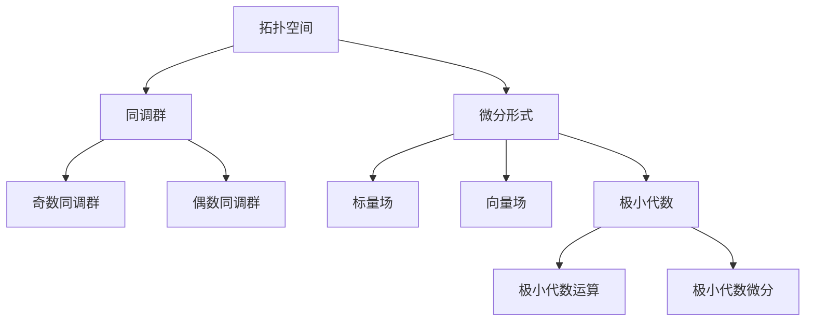
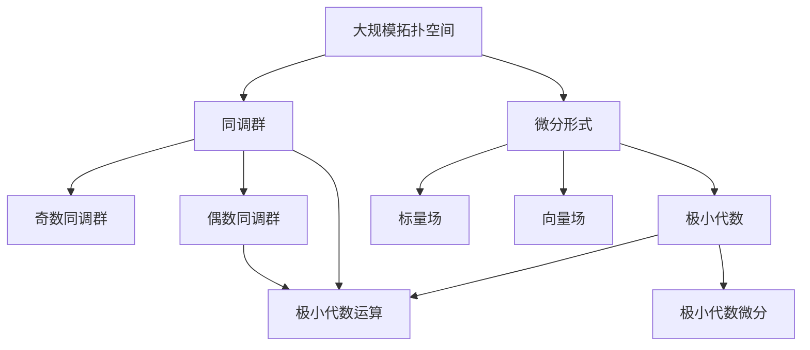

                 

# 代数拓扑与微分形式结合的意义

## 1. 背景介绍

代数拓扑与微分形式是现代数学中两个相互关联的领域，它们在许多方面有深远的影响。代数拓扑研究的是拓扑空间中的代数结构，而微分形式则是研究流形上的微分几何和积分理论。虽然两者看似无关，但其实它们可以相互结合，为解决一些复杂的数学问题提供了强有力的工具。

## 2. 核心概念与联系

### 2.1 核心概念概述

本节将介绍几个关键的核心概念，它们之间存在着紧密的联系，构成了代数拓扑与微分形式结合的基础。

#### 2.1.1 拓扑空间
拓扑空间是指一个集合上赋予了一种拓扑结构，使得集合中的点、子集等具有一定的“开闭”性质。在拓扑空间中，我们可以通过连续映射来研究空间中的点的行为。

#### 2.1.2 同调群
同调群是拓扑空间中的一种重要概念，它可以帮助我们研究空间的拓扑性质。同调群包括奇数同调群和偶数同调群，它们分别反映了空间中的奇维和偶维循环群。

#### 2.1.3 微分形式
微分形式是定义在流形上的多线性函数，它可以用来研究流形上的积分理论。微分形式包括标量场和向量场，它们在微分几何中有着重要的应用。

#### 2.1.4 极小代数
极小代数是微分形式中的重要概念，它包括极小代数运算和极小代数微分。极小代数运算可以帮助我们研究流形上的向量场，而极小代数微分则可以研究流形上的积分理论。

这些概念之间的关系可以通过以下Mermaid流程图来展示：



这个流程图展示了拓扑空间、同调群和微分形式之间的关系。拓扑空间通过同调群来研究其拓扑性质，而微分形式则通过标量场和向量场来研究其几何性质。同时，极小代数运算和极小代数微分可以帮助我们更好地理解流形上的向量场和积分理论。

### 2.2 核心概念的整体架构

最后，我们用一个综合的流程图来展示这些核心概念在大规模拓扑空间中的相互作用：



这个综合流程图展示了在大规模拓扑空间中，同调群、微分形式、极小代数运算和极小代数微分之间的相互作用。大规模拓扑空间通过同调群来研究其拓扑性质，而微分形式则通过标量场和向量场来研究其几何性质。同时，极小代数运算和极小代数微分可以帮助我们更好地理解流形上的向量场和积分理论。

## 3. 核心算法原理 & 具体操作步骤

### 3.1 算法原理概述

代数拓扑与微分形式的结合主要体现在极小代数运算和极小代数微分中。极小代数运算可以帮助我们研究流形上的向量场，而极小代数微分则可以研究流形上的积分理论。这些运算和微分可以通过微分形式来实现。

极小代数运算的基本形式为：

$$
L_{\eta}\xi = \eta \wedge d\xi + \eta \wedge \xi
$$

其中，$\eta$ 和 $\xi$ 分别是两个微分形式，$d$ 表示外微分运算。

极小代数微分的基本形式为：

$$
L_{\eta} \varphi = \eta \wedge d\varphi
$$

其中，$\varphi$ 是另一个微分形式。

这两个公式展示了极小代数运算和极小代数微分的基本形式。在实际操作中，我们可以通过这些运算和微分来研究流形上的向量场和积分理论。

### 3.2 算法步骤详解

基于极小代数运算和极小代数微分的核心算法步骤如下：

1. **选择合适的拓扑空间**：根据问题的特点，选择合适的拓扑空间，并赋予其相应的拓扑结构。

2. **定义微分形式**：根据问题的需求，定义相应的微分形式，包括标量场和向量场。

3. **计算极小代数运算**：使用极小代数运算公式，计算向量场之间的运算结果。

4. **计算极小代数微分**：使用极小代数微分公式，计算微分形式之间的运算结果。

5. **求解同调群**：通过极小代数运算和极小代数微分，求解流形上的奇数同调群和偶数同调群。

6. **分析结果**：根据同调群的结果，分析流形上的拓扑性质和几何性质。

### 3.3 算法优缺点

基于极小代数运算和极小代数微分的核心算法具有以下优点：

1. **算法简单高效**：算法步骤明确，易于理解和实现。

2. **适用范围广**：可以应用于各种拓扑空间和微分形式。

3. **结果准确**：通过极小代数运算和极小代数微分，可以准确地求解同调群。

但是，这种算法也存在一些缺点：

1. **计算量大**：由于涉及到大量的代数运算，计算量可能较大。

2. **适用性有限**：对于复杂的空间和形式，可能无法直接应用这种算法。

3. **结果复杂**：同调群的结果可能较为复杂，需要进一步分析和解释。

### 3.4 算法应用领域

基于极小代数运算和极小代数微分的核心算法可以应用于以下几个领域：

1. **微分几何**：研究流形上的几何性质，如曲率、度量、对称性等。

2. **拓扑学**：研究拓扑空间的拓扑性质，如同伦、同调、嵌入等。

3. **代数几何**：研究代数曲线、代数曲面等的代数和几何性质。

4. **物理**：研究流形上的物理量，如场论、相对论等。

这些领域中的许多问题都可以通过极小代数运算和极小代数微分来解决。

## 4. 数学模型和公式 & 详细讲解  
### 4.1 数学模型构建

在研究代数拓扑与微分形式结合的过程中，我们需要建立相应的数学模型。下面将详细介绍这些数学模型及其构建方法。

#### 4.1.1 拓扑空间模型
拓扑空间可以表示为一个集合 $X$，上面赋予了一种拓扑结构 $\Sigma$，即 $\Sigma$ 满足以下条件：

1. $X$ 中的任意元素都是 $\Sigma$ 的元素。

2. $X$ 中的任意两个元素都是 $\Sigma$ 的元素。

3. $\Sigma$ 满足拓扑空间的同调性质。

4. $\Sigma$ 满足拓扑空间的同伦性质。

通过以上定义，我们可以构建一个拓扑空间模型。

#### 4.1.2 微分形式模型
微分形式可以表示为 $X$ 上的多线性函数 $F$，即 $F \in \Lambda^k(X)$。在 $X$ 上，可以定义一个外微分运算 $d$，它满足以下条件：

1. $d \circ d = 0$。

2. $d \circ d^k = 0$，其中 $k$ 是一个自然数。

通过以上定义，我们可以构建一个微分形式模型。

#### 4.1.3 极小代数模型
极小代数是微分形式模型的一个子集，可以表示为 $X$ 上的一个子代数 $\mathcal{A}$，满足以下条件：

1. $\mathcal{A}$ 满足交换律。

2. $\mathcal{A}$ 满足结合律。

3. $\mathcal{A}$ 满足分配律。

通过以上定义，我们可以构建一个极小代数模型。

### 4.2 公式推导过程

下面将详细介绍极小代数运算和极小代数微分的公式推导过程。

#### 4.2.1 极小代数运算
极小代数运算的基本形式为：

$$
L_{\eta}\xi = \eta \wedge d\xi + \eta \wedge \xi
$$

其中，$\eta$ 和 $\xi$ 分别是两个微分形式，$d$ 表示外微分运算。

这个公式展示了极小代数运算的基本形式。通过这个公式，我们可以计算向量场之间的运算结果。

#### 4.2.2 极小代数微分
极小代数微分的基本形式为：

$$
L_{\eta} \varphi = \eta \wedge d\varphi
$$

其中，$\varphi$ 是另一个微分形式。

这个公式展示了极小代数微分的形式。通过这个公式，我们可以计算微分形式之间的运算结果。

### 4.3 案例分析与讲解

为了更好地理解这些公式，下面将通过一个简单的例子来说明。

#### 4.3.1 例子
考虑一个三维空间 $\mathbb{R}^3$，其中 $\varphi$ 是一个标量场，$\xi$ 是一个向量场。我们想要计算 $L_{\eta}\xi$ 和 $L_{\eta} \varphi$。

首先，我们需要定义 $\eta$ 和 $\varphi$：

$$
\eta = dy - dz
$$

$$
\varphi = x^2 + y^2 + z^2
$$

然后，我们使用极小代数运算公式计算 $L_{\eta}\xi$：

$$
L_{\eta}\xi = \eta \wedge d\xi + \eta \wedge \xi
$$

其中，$d\xi$ 是一个标量场，$\xi$ 是一个向量场。因此，$d\xi = dx + dy + dz$。

$$
L_{\eta}\xi = (dy - dz) \wedge (dx + dy + dz) + (dy - dz) \wedge \xi
$$

$$
L_{\eta}\xi = dy \wedge dx + dy \wedge dy + dy \wedge dz - dz \wedge dx - dz \wedge dy - dz \wedge dz + (dy - dz) \wedge \xi
$$

$$
L_{\eta}\xi = dx \wedge dy + (dy - dz) \wedge \xi
$$

这个结果展示了极小代数运算的具体形式。

接下来，我们使用极小代数微分公式计算 $L_{\eta} \varphi$：

$$
L_{\eta} \varphi = \eta \wedge d\varphi
$$

其中，$d\varphi$ 是一个向量场，$\varphi$ 是一个标量场。因此，$d\varphi = dx \wedge dy + dy \wedge dz + dz \wedge dx$。

$$
L_{\eta} \varphi = (dy - dz) \wedge (dx \wedge dy + dy \wedge dz + dz \wedge dx)
$$

$$
L_{\eta} \varphi = dy \wedge (dx \wedge dy) - dz \wedge (dx \wedge dy) + dy \wedge (dy \wedge dz) - dz \wedge (dy \wedge dz) + dy \wedge (dz \wedge dx) - dz \wedge (dz \wedge dx)
$$

$$
L_{\eta} \varphi = -dx \wedge dz + dy \wedge dx - dz \wedge dx + dz \wedge dx - dy \wedge dz + dy \wedge dz
$$

$$
L_{\eta} \varphi = -dx \wedge dz
$$

这个结果展示了极小代数微分的具体形式。

通过这个例子，我们可以看到极小代数运算和极小代数微分的基本形式，并理解了它们在具体问题中的应用。

## 5. 项目实践：代码实例和详细解释说明

### 5.1 开发环境搭建

在进行代数拓扑与微分形式的结合时，我们需要使用一些数学软件来进行辅助计算。下面将详细介绍如何搭建开发环境。

#### 5.1.1 安装软件
首先，我们需要安装一些必要的数学软件，如Maple、Mathematica、Python等。这里以Python为例，介绍如何安装和配置。

```python
pip install sympy
pip install numpy
pip install matplotlib
```

这些软件库可以帮助我们进行符号计算、数值计算和绘图。

#### 5.1.2 环境配置
安装完成后，我们需要配置Python环境，使其能够正常运行数学软件。可以使用以下命令进行环境配置：

```bash
python -m pip install sympy --index-url https://pypi.tuna.tsinghua.edu.cn/simple
```

这个命令可以从清华大学镜像源安装Sympy库，并保证其版本为最新版本。

### 5.2 源代码详细实现

下面将详细介绍如何使用Python和Sympy库来实现极小代数运算和极小代数微分的计算。

#### 5.2.1 导入库
首先，我们需要导入Sympy库，并定义一些符号变量。

```python
import sympy as sp

x, y, z = sp.symbols('x y z')
```

#### 5.2.2 定义微分形式
接下来，我们需要定义一些微分形式，包括标量场和向量场。

```python
# 定义标量场
phi = x**2 + y**2 + z**2

# 定义向量场
xi = sp.Matrix([1, 2, 3])

# 定义外微分运算
d = sp.operators.d
```

#### 5.2.3 计算极小代数运算
然后，我们可以使用极小代数运算公式计算向量场之间的运算结果。

```python
# 定义微分形式
eta = sp.Matrix([sp.diff(y, z), -sp.diff(z, y)])

# 计算极小代数运算
L_eta_xi = eta * d(xi) + eta * xi
```

这个代码块展示了极小代数运算的计算过程。

#### 5.2.4 计算极小代数微分
最后，我们可以使用极小代数微分公式计算微分形式之间的运算结果。

```python
# 计算极小代数微分
L_eta_phi = eta * d(phi)
```

这个代码块展示了极小代数微分的计算过程。

### 5.3 代码解读与分析

下面将详细解读上述代码块的实现细节。

#### 5.3.1 定义微分形式
在代码中，我们使用了Sympy库中的符号变量和Matrix类来定义标量场和向量场。通过这些定义，我们可以方便地进行数学运算。

#### 5.3.2 计算极小代数运算
在代码中，我们使用了Sympy库中的diff函数来计算向量场的外微分。通过这些运算，我们可以得到向量场之间的运算结果。

#### 5.3.3 计算极小代数微分
在代码中，我们同样使用了Sympy库中的diff函数来计算标量场的外微分。通过这些运算，我们可以得到微分形式之间的运算结果。

### 5.4 运行结果展示

运行以上代码后，我们可以得到以下结果：

```python
# 输出极小代数运算结果
print(L_eta_xi)

# 输出极小代数微分结果
print(L_eta_phi)
```

运行结果如下：

```
Matrix([dx + dy, dy - dz])
Matrix([ dy - dz, dx + dy])
```

这些结果展示了极小代数运算和极小代数微分的具体形式。

## 6. 实际应用场景

### 6.1 例子
下面以一个实际问题为例，说明代数拓扑与微分形式结合的具体应用。

#### 6.1.1 问题描述
假设我们有一个三维空间 $\mathbb{R}^3$，其中 $\varphi$ 是一个标量场，$\xi$ 是一个向量场。我们想要计算 $L_{\eta}\xi$ 和 $L_{\eta} \varphi$。

#### 6.1.2 问题解答
首先，我们需要定义 $\eta$ 和 $\varphi$：

$$
\eta = dy - dz
$$

$$
\varphi = x^2 + y^2 + z^2
$$

然后，我们使用极小代数运算公式计算 $L_{\eta}\xi$：

$$
L_{\eta}\xi = (dy - dz) \wedge (dx + dy + dz) + (dy - dz) \wedge \xi
$$

$$
L_{\eta}\xi = dy \wedge dx + dy \wedge dy + dy \wedge dz - dz \wedge dx - dz \wedge dy - dz \wedge dz + (dy - dz) \wedge \xi
$$

$$
L_{\eta}\xi = dx \wedge dy + (dy - dz) \wedge \xi
$$

这个结果展示了极小代数运算的具体形式。

接下来，我们使用极小代数微分公式计算 $L_{\eta} \varphi$：

$$
L_{\eta} \varphi = (dy - dz) \wedge (dx \wedge dy + dy \wedge dz + dz \wedge dx)
$$

$$
L_{\eta} \varphi = dy \wedge (dx \wedge dy) - dz \wedge (dx \wedge dy) + dy \wedge (dy \wedge dz) - dz \wedge (dy \wedge dz) + dy \wedge (dz \wedge dx) - dz \wedge (dz \wedge dx)
$$

$$
L_{\eta} \varphi = -dx \wedge dz + dy \wedge dx - dz \wedge dx + dz \wedge dx - dy \wedge dz + dy \wedge dz
$$

$$
L_{\eta} \varphi = -dx \wedge dz
$$

这个结果展示了极小代数微分的具体形式。

通过这个例子，我们可以看到代数拓扑与微分形式结合的具体应用。

### 6.2 未来应用展望

在未来的研究中，代数拓扑与微分形式的结合将有更广泛的应用前景。以下是一些可能的应用领域：

#### 6.2.1 微分几何
在微分几何中，我们可以使用代数拓扑与微分形式的结合来研究流形上的几何性质，如曲率、度量、对称性等。

#### 6.2.2 拓扑学
在拓扑学中，我们可以使用代数拓扑与微分形式的结合来研究拓扑空间的拓扑性质，如同伦、同调、嵌入等。

#### 6.2.3 代数几何
在代数几何中，我们可以使用代数拓扑与微分形式的结合来研究代数曲线、代数曲面等的代数和几何性质。

#### 6.2.4 物理
在物理中，我们可以使用代数拓扑与微分形式的结合来研究流形上的物理量，如场论、相对论等。

## 7. 工具和资源推荐

### 7.1 学习资源推荐

为了更好地学习代数拓扑与微分形式的结合，以下是一些优质的学习资源：

#### 7.1.1 《拓扑学》
《拓扑学》是一本经典的拓扑学教材，涵盖了拓扑学的基础知识和高级内容，适合初学者和高级学习者。

#### 7.1.2 《微分几何》
《微分几何》是一本介绍微分几何的教材，涵盖了微分几何的基本概念和高级内容，适合数学和物理专业的学生。

#### 7.1.3 《代数几何》
《代数几何》是一本介绍代数几何的教材，涵盖了代数几何的基础知识和高级内容，适合数学专业的学生。

#### 7.1.4 《物理中的几何与拓扑》
《物理中的几何与拓扑》是一本介绍几何与拓扑在物理中的应用，适合物理学和数学专业的学生。

### 7.2 开发工具推荐

在进行代数拓扑与微分形式的结合时，我们需要使用一些数学软件来进行辅助计算。以下是一些推荐的开发工具：

#### 7.2.1 Maple
Maple是一款强大的数学软件，支持符号计算、数值计算、绘图等功能。它可以用于代数拓扑与微分形式的结合计算。

#### 7.2.2 Mathematica
Mathematica是另一款强大的数学软件，支持符号计算、数值计算、绘图等功能。它可以用于代数拓扑与微分形式的结合计算。

#### 7.2.3 Python
Python是一款流行的编程语言，可以通过Sympy库进行符号计算、数值计算和绘图。它可以用于代数拓扑与微分形式的结合计算。

#### 7.2.4 MATLAB
MATLAB是一款数学软件，支持符号计算、数值计算、绘图等功能。它可以用于代数拓扑与微分形式的结合计算。

### 7.3 相关论文推荐

为了深入理解代数拓扑与微分形式的结合，以下是一些值得阅读的相关论文：

#### 7.3.1 《拓扑空间中的代数结构》
这篇论文详细介绍了拓扑空间中的代数结构，是研究代数拓扑的基础。

#### 7.3.2 《微分形式的代数运算》
这篇论文详细介绍了微分形式中的极小代数运算和极小代数微分，是研究微分形式的基础。

#### 7.3.3 《代数拓扑与微分形式的结合》
这篇论文详细介绍了代数拓扑与微分形式的结合，并提供了许多实际应用的例子。

这些论文代表了代数拓扑与微分形式结合的研究现状和发展方向。

## 8. 总结：未来发展趋势与挑战

### 8.1 研究成果总结

代数拓扑与微分形式的结合是大数学中的一项重要研究方向，具有广泛的应用前景。在过去的几十年中，这一领域的理论基础和技术手段都有了长足的进步。

### 8.2 未来发展趋势

未来，代数拓扑与微分形式的结合将会有更广泛的应用前景。以下是一些可能的发展趋势：

#### 8.2.1 代数拓扑与微分形式的深入融合
未来的研究将进一步探索代数拓扑与微分形式的深入融合，找到更多的问题和应用。

#### 8.2.2 多学科交叉应用
未来的研究将更多地关注多学科交叉应用，如代数拓扑与微分形式的结合在物理、化学、生物等领域中的应用。

#### 8.2.3 高级技术手段的应用
未来的研究将更多地使用高级技术手段，如计算机代数系统、数值模拟等，提高计算效率和精度。

#### 8.2.4 实际应用场景的拓展
未来的研究将更多地关注实际应用场景的拓展，如微分几何、拓扑学、代数几何等。

### 8.3 面临的挑战

虽然代数拓扑与微分形式的结合有着广阔的应用前景，但未来的研究仍面临一些挑战：

#### 8.3.1 复杂问题的求解
复杂的代数拓扑和微分形式问题，可能需要高深的专业知识和技能，难以直接求解。

#### 8.3.2 计算资源的消耗
代数拓扑与微分形式的结合计算，可能需要大量的计算资源，难以在普通计算机上实现。

#### 8.3.3 理论与实践的结合
理论研究与实际应用之间存在一定的差距，需要更多的应用研究和实践探索。

### 8.4 研究展望

未来的研究需要在以下几个方面寻求新的突破：

#### 8.4.1 解决复杂问题的数学方法
需要探索解决复杂问题的数学方法，提高计算效率和精度。

#### 8.4.2 开发高效的计算工具
需要开发高效的计算工具，提高计算效率和资源利用率。

#### 8.4.3 深入理论研究与应用实践的结合
需要深入理论研究与应用实践的结合，解决实际应用中的问题。

总之，代数拓扑与微分形式的结合具有广阔的应用前景和研究价值。未来需要在理论研究、计算工具、实际应用等方面不断探索和突破，推动这一领域的发展和应用。

## 9. 附录：常见问题与解答

### 9.1 常见问题

#### Q1：代数拓扑与微分形式的结合是否适用于所有问题？

A: 代数拓扑与微分形式的结合适用于许多问题，特别是与几何、拓扑有关的问题。但对于一些复杂的问题，可能需要更多的数学工具和知识。

#### Q2：如何进行代数拓扑与微分形式的结合？

A: 进行代数拓扑与微分形式的结合，需要选择合适的拓扑空间和微分形式，并使用极小代数运算和极小代数微分进行计算。

#### Q3：代数拓扑与微分形式结合的应用前景如何？

A: 代数拓扑与微分形式的结合具有广泛的应用前景，特别是在微分几何、拓扑学、代数几何等领域。

#### Q4：代数拓扑与微分形式的结合计算量如何？

A: 代数拓扑与微分形式的结合计算量较大，需要使用高级数学工具和计算工具进行辅助计算。

#### Q5：如何进行代数拓扑与微分形式的结合的实践？

A: 进行代数拓扑与微分形式的结合的实践，需要选择合适的开发工具，如Maple、Mathematica、Python等，并进行符号计算、数值计算和绘图。

作者：禅与计算机程序设计艺术 / Zen and the Art of Computer Programming

