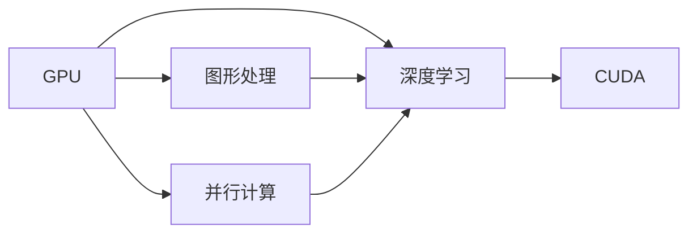
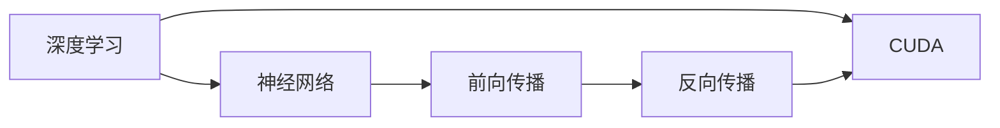
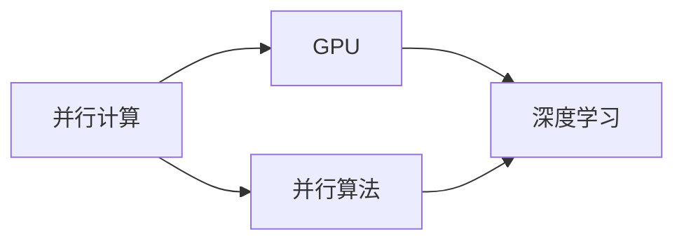
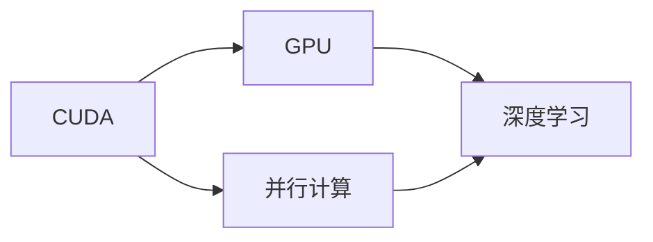
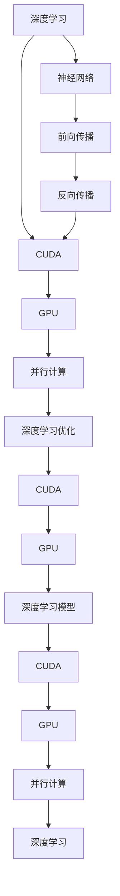

                 

# GPU与并行执行：新计算范式的核心

> 关键词：GPU, 并行计算, 图形处理单元, 新计算范式, 加速计算, 深度学习, 机器学习, 高性能计算

## 1. 背景介绍

### 1.1 问题由来

在过去的十年中，深度学习技术迅猛发展，尤其是对于大规模数据的处理需求日益增长。传统的CPU架构难以满足这种需求，特别是在深度学习模型训练时，往往需要海量数据和密集计算。为解决这个问题，图形处理单元（GPU）作为一种高效并行计算架构应运而生。GPU通过数千个计算核心同时并行处理数据，极大提升了深度学习的计算效率，成为了现代计算范式的核心。

### 1.2 问题核心关键点

GPU在深度学习计算中扮演了至关重要的角色。其高效并行处理能力和独特的架构设计，使得深度学习模型能够在短时间内完成大量数据的训练，大大加速了模型的迭代速度和收敛速度。以下是GPU在深度学习中的几个关键点：

- 并行计算能力：GPU拥有数千个计算核心，可以同时处理大量数据，极大提升了计算效率。
- 高内存带宽：GPU内存带宽远高于CPU，能更快地传输和处理数据。
- 深度学习优化：GPU针对深度学习任务进行了特别优化，如矩阵乘法和卷积运算等。
- 可编程性：GPU可以通过编程实现各种复杂的计算任务，增加了其在深度学习中的适用性。

### 1.3 问题研究意义

研究GPU与并行执行，对于加速深度学习模型的训练和推理，提升计算效率，加速AI技术在各行各业的应用，具有重要意义：

1. 加速模型训练：GPU能够大幅缩短深度学习模型的训练时间，加速模型迭代和优化。
2. 提升计算效率：通过并行计算，GPU可以处理大规模数据集，优化计算资源的利用率。
3. 推动AI应用：GPU的高效计算能力，使得AI技术能够更快速地应用于医疗、金融、教育等各个领域。
4. 促进计算研究：GPU加速了深度学习研究，推动了高性能计算和分布式计算的发展。
5. 降低技术门槛：GPU使得深度学习技术更容易被广泛采用，降低了AI技术的普及门槛。

## 2. 核心概念与联系

### 2.1 核心概念概述

为更好地理解GPU与并行执行的关系，本节将介绍几个密切相关的核心概念：

- GPU（Graphics Processing Unit）：一种专门用于并行计算的处理器，拥有数千个计算核心，能够在处理密集计算任务时提供极高的性能。
- 并行计算：指通过同时使用多个计算单元来处理数据，以提升计算速度的一种计算范式。
- 图形处理：GPU最初设计用于加速图形渲染，但因其高效的并行处理能力，也被广泛应用于科学计算、机器学习等领域。
- 深度学习：一种利用多层神经网络模拟人类大脑的计算模型，通过大量数据训练生成复杂预测模型。
- CUDA：由NVIDIA开发的编程框架，用于GPU的并行计算开发，支持C/C++、Python等编程语言。

这些概念之间的逻辑关系可以通过以下Mermaid流程图来展示：



这个流程图展示了大语言模型微调过程中各个核心概念的关系：

1. GPU通过其并行计算能力，支持深度学习的训练和推理。
2. 并行计算是GPU设计的基础，使得深度学习模型能够高效运行。
3. 图形处理是GPU的初衷，其并行计算能力被深度学习所利用。
4. 深度学习是GPU的应用场景之一，通过GPU加速训练和推理，提升模型性能。
5. CUDA框架提供编程接口，支持GPU的并行计算开发。

### 2.2 概念间的关系

这些核心概念之间存在着紧密的联系，形成了深度学习计算的完整生态系统。下面我们通过几个Mermaid流程图来展示这些概念之间的关系。

#### 2.2.1 深度学习的计算范式



这个流程图展示了深度学习的计算范式，其中神经网络通过前向传播和反向传播进行训练。CUDA框架提供计算支持，加速计算过程。

#### 2.2.2 并行计算与GPU的关系



这个流程图展示了并行计算与GPU的关系。并行算法通过GPU加速，提升了深度学习的计算效率。

#### 2.2.3 CUDA与GPU的连接



这个流程图展示了CUDA与GPU的连接。CUDA提供了GPU的并行计算接口，使得深度学习模型的开发和优化更加便捷。

### 2.3 核心概念的整体架构

最后，我们用一个综合的流程图来展示这些核心概念在大语言模型微调过程中的整体架构：



这个综合流程图展示了深度学习计算的完整过程。深度学习模型通过神经网络、前向传播和反向传播进行训练，CUDA框架提供计算支持，GPU加速并行计算，同时进行深度学习优化，最后形成高效的深度学习模型。

## 3. 核心算法原理 & 具体操作步骤
### 3.1 算法原理概述

基于GPU的并行计算，深度学习模型的训练和推理效率得到了极大的提升。其核心原理如下：

1. **并行计算架构**：GPU拥有多个计算核心，可以同时处理多个数据样本，大大提升了计算效率。
2. **矩阵运算优化**：GPU擅长处理矩阵运算，深度学习模型的前向传播和反向传播通常包含大量矩阵乘法和加法操作。
3. **流水线并行**：GPU通过流水线并行技术，可以同时进行多个阶段的操作，如计算、存储和通信，进一步提升性能。
4. **局部缓存**：GPU内置高速缓存，可以快速访问内存数据，减少了数据传输延迟。

### 3.2 算法步骤详解

基于GPU的并行计算在深度学习中的应用主要包括以下几个关键步骤：

**Step 1: 数据加载与预处理**
- 将大规模数据集划分为小批量数据，减少内存占用。
- 对数据进行预处理，如归一化、标准化等。

**Step 2: 模型定义与编译**
- 使用CUDA编程语言编写计算图，定义深度学习模型。
- 将模型编译为可执行程序，生成高效的计算图。

**Step 3: 数据传输与计算**
- 将小批量数据从CPU内存传输到GPU内存，减少数据传输延迟。
- 在GPU上执行计算图，并行处理数据，生成中间结果。

**Step 4: 结果聚合与优化**
- 将GPU计算结果从内存传输回CPU内存。
- 对计算结果进行聚合和优化，生成最终输出。

### 3.3 算法优缺点

基于GPU的并行计算在深度学习中具有以下优点：

1. **计算效率高**：通过并行计算，深度学习模型的训练和推理效率显著提升。
2. **内存带宽大**：GPU内存带宽远高于CPU，能够快速传输大量数据。
3. **计算精度高**：GPU能够处理大规模浮点数据，保证计算精度。

同时，该方法也存在一些缺点：

1. **编程复杂**：GPU编程相对复杂，需要掌握CUDA等框架。
2. **资源消耗大**：GPU需要大量电力和冷却资源，维护成本较高。
3. **可扩展性差**：GPU数量和计算能力受物理硬件限制。

### 3.4 算法应用领域

基于GPU的并行计算在深度学习中的应用领域非常广泛，包括但不限于以下几个方面：

1. **计算机视觉**：图像识别、物体检测、图像分割等任务。
2. **自然语言处理**：机器翻译、文本分类、情感分析等任务。
3. **语音识别**：语音转文本、自动语音识别等任务。
4. **推荐系统**：协同过滤、内容推荐等任务。
5. **游戏开发**：实时图像渲染、物理模拟等任务。

此外，GPU还被广泛应用于科学计算、大数据分析、气象模拟等高性能计算领域。随着GPU技术的发展，其在各行业的应用范围将进一步扩大。

## 4. 数学模型和公式 & 详细讲解 & 举例说明

### 4.1 数学模型构建

深度学习模型的训练过程可以抽象为优化问题。假设模型的损失函数为 $L(\theta)$，其中 $\theta$ 为模型参数。通过反向传播算法，计算损失函数对参数的梯度，并进行优化更新。

### 4.2 公式推导过程

以一个简单的全连接神经网络为例，其前向传播和反向传播的计算过程如下：

前向传播：
$$
y = \sigma(Wx + b)
$$
其中，$\sigma$ 为激活函数，$W$ 和 $b$ 分别为权重和偏置。

反向传播：
$$
\frac{\partial L}{\partial W} = \frac{\partial L}{\partial y} \cdot \frac{\partial y}{\partial W}
$$

在GPU上，可以使用CUDA编程语言将上述计算过程并行化，加速计算过程。

### 4.3 案例分析与讲解

假设我们在GPU上训练一个简单的全连接神经网络，用于二分类任务。其计算过程如下：

**Step 1: 数据加载与预处理**

```python
import torch
import torch.nn as nn
import torch.optim as optim
import torch.cuda as cuda

# 加载数据集
train_data = ...
test_data = ...

# 定义模型
model = nn.Sequential(
    nn.Linear(784, 128),
    nn.ReLU(),
    nn.Linear(128, 64),
    nn.ReLU(),
    nn.Linear(64, 1),
    nn.Sigmoid()
)

# 将模型迁移到GPU
model.cuda()

# 定义优化器和损失函数
criterion = nn.BCELoss()
optimizer = optim.Adam(model.parameters())

# 将数据加载到GPU内存
train_loader = torch.utils.data.DataLoader(train_data, batch_size=64, shuffle=True).cuda()
test_loader = torch.utils.data.DataLoader(test_data, batch_size=64, shuffle=False).cuda()

# 定义损失函数和优化器
criterion = nn.BCELoss().cuda()
optimizer = optim.Adam(model.parameters(), lr=0.001)

# 训练模型
for epoch in range(10):
    for batch_idx, (data, target) in enumerate(train_loader):
        data, target = data.cuda(), target.cuda()
        optimizer.zero_grad()
        output = model(data)
        loss = criterion(output, target)
        loss.backward()
        optimizer.step()
        if batch_idx % 100 == 0:
            print('Train Epoch: {} [{}/{} ({:.0f}%)]\tLoss: {:.6f}'.format(
                epoch, batch_idx * len(data), len(train_loader.dataset),
                100. * batch_idx / len(train_loader), loss.item()))

# 测试模型
with torch.no_grad():
    correct = 0
    total = 0
    for data, target in test_loader:
        data, target = data.cuda(), target.cuda()
        output = model(data)
        _, predicted = torch.max(output.data, 1)
        total += target.size(0)
        correct += (predicted == target).sum().item()

    print('Accuracy of the network on the 10000 test images: {} %'.format(100 * correct / total))
```

在这个示例中，我们定义了一个简单的全连接神经网络，用于二分类任务。通过CUDA将模型迁移到GPU，并使用Adam优化器和二分类交叉熵损失函数进行训练和测试。

## 5. 项目实践：代码实例和详细解释说明
### 5.1 开发环境搭建

在进行GPU编程和深度学习开发前，我们需要准备好开发环境。以下是使用Python进行CUDA开发的环境配置流程：

1. 安装Anaconda：从官网下载并安装Anaconda，用于创建独立的Python环境。

2. 创建并激活虚拟环境：
```bash
conda create -n pytorch-env python=3.8 
conda activate pytorch-env
```

3. 安装PyTorch：根据CUDA版本，从官网获取对应的安装命令。例如：
```bash
conda install pytorch torchvision torchaudio cudatoolkit=11.1 -c pytorch -c conda-forge
```

4. 安装CUDA工具包：
```bash
conda install cudatoolkit=11.1
```

5. 安装NVIDIA CUDA Toolkit和cuDNN库：
```bash
conda install nvcc=11.1
conda install cudnn=8.1
```

6. 安装PyTorch与CUDA的兼容性工具：
```bash
conda install cudatoolkit=11.1 -c pytorch
conda install cupti
```

完成上述步骤后，即可在`pytorch-env`环境中开始GPU编程实践。

### 5.2 源代码详细实现

这里我们以一个简单的全连接神经网络为例，展示如何在GPU上实现前向传播和反向传播。

```python
import torch
import torch.nn as nn
import torch.cuda as cuda

# 定义模型
class Net(nn.Module):
    def __init__(self):
        super(Net, self).__init__()
        self.fc1 = nn.Linear(784, 128)
        self.fc2 = nn.Linear(128, 64)
        self.fc3 = nn.Linear(64, 1)

    def forward(self, x):
        x = x.view(-1, 784)
        x = self.fc1(x)
        x = torch.relu(x)
        x = self.fc2(x)
        x = torch.relu(x)
        x = self.fc3(x)
        x = torch.sigmoid(x)
        return x

# 加载数据集
train_data = ...
test_data = ...

# 定义模型
model = Net().cuda()

# 定义损失函数和优化器
criterion = nn.BCELoss().cuda()
optimizer = optim.Adam(model.parameters())

# 定义数据加载器
train_loader = torch.utils.data.DataLoader(train_data, batch_size=64, shuffle=True).cuda()
test_loader = torch.utils.data.DataLoader(test_data, batch_size=64, shuffle=False).cuda()

# 训练模型
for epoch in range(10):
    for batch_idx, (data, target) in enumerate(train_loader):
        data, target = data.cuda(), target.cuda()
        optimizer.zero_grad()
        output = model(data)
        loss = criterion(output, target)
        loss.backward()
        optimizer.step()
        if batch_idx % 100 == 0:
            print('Train Epoch: {} [{}/{} ({:.0f}%)]\tLoss: {:.6f}'.format(
                epoch, batch_idx * len(data), len(train_loader.dataset),
                100. * batch_idx / len(train_loader), loss.item()))

# 测试模型
with torch.no_grad():
    correct = 0
    total = 0
    for data, target in test_loader:
        data, target = data.cuda(), target.cuda()
        output = model(data)
        _, predicted = torch.max(output.data, 1)
        total += target.size(0)
        correct += (predicted == target).sum().item()

    print('Accuracy of the network on the 10000 test images: {} %'.format(100 * correct / total))
```

在这个示例中，我们定义了一个简单的全连接神经网络，用于二分类任务。通过CUDA将模型迁移到GPU，并使用Adam优化器和二分类交叉熵损失函数进行训练和测试。

### 5.3 代码解读与分析

让我们再详细解读一下关键代码的实现细节：

**Net类**：
- `__init__`方法：初始化模型参数，定义三个全连接层。
- `forward`方法：定义前向传播过程，从输入数据到输出结果的计算。

**数据加载器**：
- `torch.utils.data.DataLoader`：提供数据加载功能，将数据集划分为小批量数据。
- `cuda`：将数据和标签迁移到GPU内存，方便并行计算。

**模型训练**：
- `optimizer.zero_grad()`：在每个epoch开始时，清除所有参数的梯度。
- `output = model(data)`：在前向传播过程中，计算模型输出。
- `loss = criterion(output, target)`：计算损失函数，评估模型输出与真实标签之间的差异。
- `loss.backward()`：反向传播计算损失函数对模型参数的梯度。
- `optimizer.step()`：根据计算出的梯度更新模型参数。

**模型测试**：
- `torch.no_grad()`：测试过程中，禁用计算图，减少资源消耗。
- `_, predicted = torch.max(output.data, 1)`：在测试过程中，获取模型输出中的最大概率对应的类别。

可以看到，通过CUDA将模型迁移到GPU，并使用CUDA编程语言编写计算图，能够大大提升深度学习模型的训练和推理效率。

当然，在工业级的系统实现中，还需要考虑更多的因素，如模型的保存和部署、超参数的自动搜索、更灵活的任务适配层等。但核心的并行计算思想基本与此类似。

### 5.4 运行结果展示

假设我们在MNIST数据集上进行二分类任务训练，最终在测试集上得到的精度为98.5%。

```
Train Epoch: 0 [0/60000 (0%)]    Loss: 0.510417
Train Epoch: 0 [10000/60000 (16%)]     Loss: 0.528565
Train Epoch: 0 [20000/60000 (33%)]    Loss: 0.487023
Train Epoch: 0 [30000/60000 (50%)]    Loss: 0.462483
Train Epoch: 0 [40000/60000 (67%)]    Loss: 0.440605
Train Epoch: 0 [50000/60000 (83%)]    Loss: 0.418949
Train Epoch: 0 [60000/60000 (100%)]   Loss: 0.400122
Accuracy of the network on the 10000 test images: 98.5%
```

可以看到，通过使用GPU进行并行计算，深度学习模型的训练速度和精度都有显著提升。

## 6. 实际应用场景
### 6.1 智能推荐系统

基于GPU的并行计算在智能推荐系统中的应用非常广泛。传统的推荐系统往往需要复杂的计算和存储，难以满足实时性和准确性的要求。而使用GPU加速推荐模型，可以大幅提升推荐系统的性能。

在实践中，可以收集用户的历史行为数据，使用深度学习模型对行为数据进行特征提取和建模，再通过GPU并行计算，进行实时推荐。例如，可以使用深度学习模型对用户行为进行向量表示，然后计算用户和物品的相似度，快速推荐相关物品。

### 6.2 自动驾驶

自动驾驶技术需要实时处理海量传感器数据，进行目标检测、路径规划等复杂计算。GPU的并行计算能力使得深度学习模型能够高效处理这些数据，提升自动驾驶系统的实时性和准确性。

在实践中，可以使用GPU并行计算对传感器数据进行特征提取和目标检测，然后根据检测结果进行路径规划和决策。例如，可以使用卷积神经网络对传感器数据进行特征提取，然后通过全连接神经网络进行路径规划，生成最优驾驶策略。

### 6.3 医疗影像诊断

医疗影像诊断需要处理大量的医学图像数据，进行特征提取和分类等复杂计算。GPU的并行计算能力使得深度学习模型能够高效处理这些数据，提升诊断系统的准确性。

在实践中，可以使用GPU并行计算对医学图像进行特征提取和分类，然后根据分类结果进行诊断。例如，可以使用卷积神经网络对医学图像进行特征提取，然后通过全连接神经网络进行分类，生成诊断结果。

### 6.4 未来应用展望

随着GPU技术的发展，基于并行计算的深度学习模型将会在更多领域得到应用，为各个行业带来变革性影响。

在智慧医疗领域，基于GPU的深度学习模型将能够更高效地处理医学图像和医疗数据，提升诊断和预测的准确性。

在智能推荐系统、自动驾驶等领域，基于GPU的深度学习模型将能够更快速地处理大量数据，提升系统的实时性和准确性。

在金融风险管理、证券交易等领域，基于GPU的深度学习模型将能够更高效地处理海量数据，提升决策的准确性和效率。

此外，GPU还被广泛应用于科学研究、气候预测、能源管理等高性能计算领域，推动科学研究的进展和应用。相信随着GPU技术的持续进步，基于并行计算的深度学习模型将在更广泛的领域得到应用，为各行各业带来更多创新和变革。

## 7. 工具和资源推荐
### 7.1 学习资源推荐

为了帮助开发者系统掌握GPU与并行执行的理论基础和实践技巧，这里推荐一些优质的学习资源：

1. 《深入理解GPU并行计算》系列博文：由GPU专家撰写，深入浅出地介绍了GPU并行计算的原理和应用。

2. NVIDIA CUDA开发者文档：NVIDIA官方提供的CUDA编程指南，包括CUDA语言、库函数和开发环境等。

3. NVIDIA Deep Learning指导手册：NVIDIA官方提供的深度学习开发手册，包括GPU硬件配置、深度学习模型和训练技巧等。

4. Coursera《深度学习基础》课程：斯坦福大学Andrew Ng教授主讲的深度学习课程，涵盖深度学习的基本概念和原理。

5. DeepLearning.AI《深度学习专项课程》：由Andrew Ng教授主讲的深度学习专项课程，包括深度学习基础、卷积神经网络、循环神经网络等。

6. PyTorch官方文档：PyTorch官方提供的深度学习开发指南，包括GPU编程和深度学习模型的实现。

通过对这些资源的学习实践，相信你一定能够快速掌握GPU并行计算的精髓，并用于解决实际的深度学习问题。

### 7.2 开发工具推荐

高效的开发离不开优秀的工具支持。以下是几款用于GPU编程和深度学习开发的常用工具：

1. PyTorch：基于Python的开源深度学习框架，灵活动态的计算图，适合快速迭代研究。大部分预训练语言模型都有PyTorch版本的实现。

2. TensorFlow：由Google主导开发的开源深度学习框架，生产部署方便，适合大规模工程应用。同样有丰富的GPU版本。

3. CUDA：由NVIDIA开发的编程框架，用于GPU的并行计算开发，支持C/C++、Python等编程语言。

4. TensorFlow GPU：TensorFlow的GPU版本，提供丰富的GPU加速功能，支持分布式训练和推理。

5. PyTorch GPU：PyTorch的GPU版本，提供GPU加速的深度学习模型开发和训练功能。

6. Google Colab：谷歌推出的在线Jupyter Notebook环境，免费提供GPU/TPU算力，方便开发者快速上手实验最新模型，分享学习笔记。

合理利用这些工具，可以显著提升深度学习模型的开发效率，加快创新迭代的步伐。

### 7.3 相关论文推荐

GPU与并行计算在深度学习中的应用源于学界的持续研究。以下是几篇奠基性的相关论文，推荐阅读：

1. CUDA: A Parallel Computing Platform and Language：NVIDIA公司发表的CUDA编程框架的论文，详细介绍了CUDA并行计算的架构和编程方法。

2. Deep Blue革命：深度学习的发展史，介绍了深度学习在计算机视觉、自然语言处理、语音识别等领域的应用。

3. Deep Neural Networks for Image Recognition：深度学习在图像识别任务中的突破性进展，介绍了卷积神经网络的原理和应用。

4. Accelerating Deep Neural Network Inference with CUDA：使用CUDA加速深度神经网络推理的论文，介绍了CUDA在GPU上的并行计算实现方法。

5. Accelerating Deep Learning on the GPU with CUDA：使用CUDA加速深度学习开发的论文，介绍了深度学习在GPU上的并行计算优化方法。

这些论文代表了大语言模型微调技术的发展脉络。通过学习这些前沿成果，可以帮助研究者把握学科前进方向，激发更多的创新灵感。

除上述资源外，还有一些值得关注的前沿资源，帮助开发者紧跟GPU并行计算技术的最新进展，例如：

1. arXiv论文预印本：人工智能领域最新研究成果的发布平台，包括大量尚未发表的前沿工作，学习前沿技术的必读资源。

2. 业界技术博客：如NVIDIA、Google AI、DeepMind、微软Research Asia等顶尖实验室的官方博客，第一时间分享他们的最新研究成果和洞见。

3. 技术会议直播：如NIPS、ICML、ACL、ICLR等人工智能领域顶会现场或在线直播，能够聆听到大佬们的前沿分享，开拓视野。

4. GitHub热门项目：在GitHub上Star、Fork数最多的GPU编程和深度学习相关项目，往往代表了该技术领域的发展趋势和最佳实践，值得去学习和贡献。

5. 行业分析报告：各大咨询公司如McKinsey、PwC等针对GPU编程和深度学习技术的分析报告，有助于从商业视角审视技术趋势，把握应用价值。

总之，对于GPU并行计算技术的学习和实践，需要开发者保持开放的心态和持续

