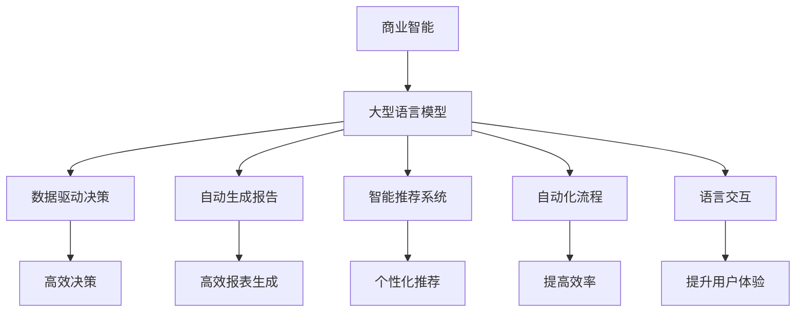
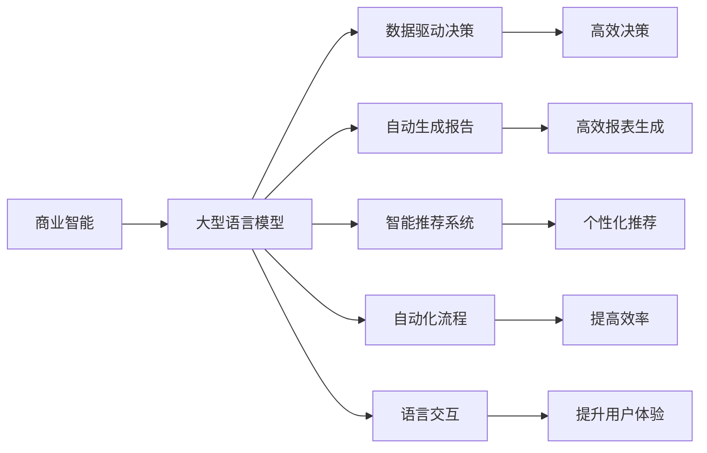
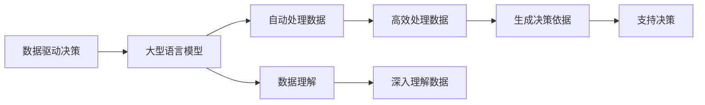
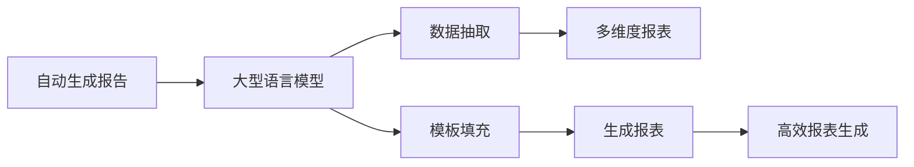
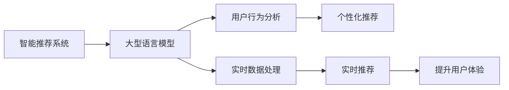
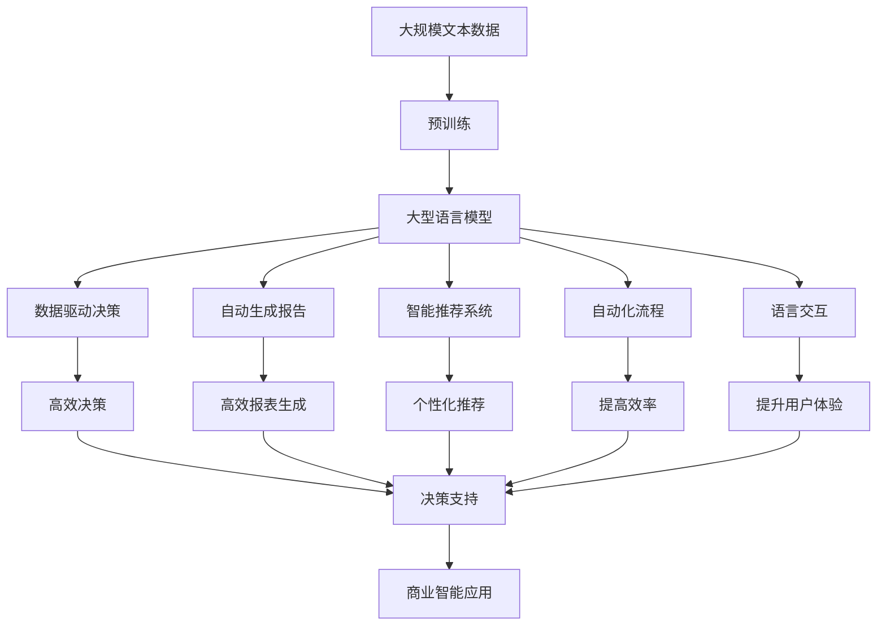

                 

# LLM对传统商业智能的革新

> 关键词：商业智能,大型语言模型(LLM),数据驱动决策,数据分析,自动生成报告,智能推荐系统

## 1. 背景介绍

### 1.1 问题由来
随着人工智能技术的发展，大型语言模型(LLM)在商业智能(BI)领域的应用成为新的趋势。传统的商业智能依赖于复杂的算法和繁琐的数据预处理，而LLM凭借其强大的语言理解和生成能力，为商业决策带来了新的可能。LLM可以自动处理和分析大量数据，生成报告，甚至进行预测和推荐，从而大大提高了商业决策的速度和准确性。

### 1.2 问题核心关键点
LLM在商业智能中的应用主要体现在以下几个方面：

1. **数据驱动决策**：LLM可以自动处理和分析海量数据，提供决策依据。
2. **自动生成报告**：LLM可以快速生成多维度的报表，帮助管理层快速了解业务状况。
3. **智能推荐系统**：LLM可以基于历史数据和实时数据进行推荐，优化产品和服务。
4. **自动化流程**：LLM可以自动化处理数据，提高工作效率，减少人工误差。
5. **语言交互**：LLM可以与用户进行自然语言交互，提升用户体验。

### 1.3 问题研究意义
LLM在商业智能中的应用，对于提升企业决策效率，优化产品和服务，降低运营成本，具有重要意义：

1. **加速决策**：LLM可以自动化处理数据，快速生成报告，帮助管理层快速决策。
2. **优化服务**：基于历史数据和实时数据，LLM可以提供更精准的推荐，提升用户体验。
3. **降低成本**：自动化的数据处理和报告生成，减少了人工成本，提高了运营效率。
4. **提升质量**：LLM可以处理海量数据，减少人工误差，提高决策的准确性。
5. **支持创新**：LLM可以基于大数据分析，发现新的商业机会，推动企业创新。

## 2. 核心概念与联系

### 2.1 核心概念概述

为更好地理解LLM在商业智能中的应用，本节将介绍几个密切相关的核心概念：

- **大型语言模型(LLM)**：指通过大规模无标签文本数据预训练得到的通用语言模型，具备强大的语言理解和生成能力。
- **商业智能(BI)**：通过数据挖掘和分析，支持决策制定的过程。
- **数据驱动决策**：基于数据进行的决策，提高决策的客观性和科学性。
- **自动生成报告**：利用LLM自动生成多维度的报表，提高报表生成效率和准确性。
- **智能推荐系统**：基于用户历史行为和实时数据，提供个性化的推荐，提升用户体验。
- **自动化流程**：利用LLM自动化处理数据，提高工作效率。
- **语言交互**：利用自然语言处理技术，提高用户交互的便利性。

这些核心概念之间的逻辑关系可以通过以下Mermaid流程图来展示：



这个流程图展示了大语言模型在商业智能中的应用，以及其对商业智能各个方面的影响。

### 2.2 概念间的关系

这些核心概念之间存在着紧密的联系，形成了商业智能的完整生态系统。下面我们通过几个Mermaid流程图来展示这些概念之间的关系。

#### 2.2.1 商业智能与大型语言模型的关系



这个流程图展示了商业智能和大型语言模型之间的联系，以及LLM在商业智能中的应用场景。

#### 2.2.2 数据驱动决策与LLM的关系



这个流程图展示了LLM在数据驱动决策中的应用，以及如何利用LLM提高决策效率和质量。

#### 2.2.3 自动生成报告与LLM的关系



这个流程图展示了LLM在自动生成报表中的应用，以及如何利用LLM提高报表生成效率和准确性。

#### 2.2.4 智能推荐系统与LLM的关系



这个流程图展示了LLM在智能推荐系统中的应用，以及如何利用LLM提供个性化推荐。

### 2.3 核心概念的整体架构

最后，我们用一个综合的流程图来展示这些核心概念在大语言模型在商业智能中的应用过程：



这个综合流程图展示了从预训练到商业智能应用的完整过程。大型语言模型首先在大规模文本数据上进行预训练，然后通过商业智能中的应用，生成决策依据、报表、推荐，自动化处理数据，与用户进行交互，最终支撑商业决策。

## 3. 核心算法原理 & 具体操作步骤
### 3.1 算法原理概述

基于大型语言模型(BERT、GPT-3等)的商业智能应用，本质上是一个数据驱动的分析和决策过程。其核心思想是：利用预训练语言模型学习语言的通用表示，基于用户输入的自然语言问题，自动处理和分析数据，生成报告、推荐等，提供决策依据。

形式化地，假设大型语言模型为 $M_{\theta}$，其中 $\theta$ 为预训练得到的模型参数。给定商业智能任务 $T$ 的输入 $x$，输出 $y$，任务 $T$ 可以表示为：

$$
y = M_{\theta}(x)
$$

其中 $y$ 为任务 $T$ 的输出结果，可以是决策建议、报表、推荐等。

微调的目标是最小化模型在任务 $T$ 上的误差，即找到最优参数：

$$
\theta^* = \mathop{\arg\min}_{\theta} \mathcal{L}(M_{\theta}, D)
$$

其中 $\mathcal{L}$ 为针对任务 $T$ 设计的损失函数，用于衡量模型输出与真实结果之间的差异。常见的损失函数包括交叉熵损失、均方误差损失等。

通过梯度下降等优化算法，微调过程不断更新模型参数 $\theta$，最小化损失函数 $\mathcal{L}$，使得模型输出逼近真实结果。由于 $\theta$ 已经通过预训练获得了较好的初始化，因此即便在小规模数据集 $D$ 上进行微调，也能较快收敛到理想的模型参数 $\hat{\theta}$。

### 3.2 算法步骤详解

基于大型语言模型(BERT、GPT-3等)的商业智能应用一般包括以下几个关键步骤：

**Step 1: 准备预训练模型和数据集**
- 选择合适的预训练语言模型 $M_{\theta}$ 作为初始化参数，如 BERT、GPT-3等。
- 准备商业智能任务 $T$ 的输入 $x$ 和输出 $y$ 数据集 $D$，划分为训练集、验证集和测试集。

**Step 2: 添加任务适配层**
- 根据任务类型，在预训练模型顶层设计合适的输出层和损失函数。
- 对于分类任务，通常在顶层添加线性分类器和交叉熵损失函数。
- 对于生成任务，通常使用语言模型的解码器输出概率分布，并以负对数似然为损失函数。

**Step 3: 设置微调超参数**
- 选择合适的优化算法及其参数，如 AdamW、SGD 等，设置学习率、批大小、迭代轮数等。
- 设置正则化技术及强度，包括权重衰减、Dropout、Early Stopping 等。
- 确定冻结预训练参数的策略，如仅微调顶层，或全部参数都参与微调。

**Step 4: 执行梯度训练**
- 将训练集数据分批次输入模型，前向传播计算损失函数。
- 反向传播计算参数梯度，根据设定的优化算法和学习率更新模型参数。
- 周期性在验证集上评估模型性能，根据性能指标决定是否触发 Early Stopping。
- 重复上述步骤直到满足预设的迭代轮数或 Early Stopping 条件。

**Step 5: 测试和部署**
- 在测试集上评估微调后模型 $M_{\hat{\theta}}$ 的性能，对比微调前后的精度提升。
- 使用微调后的模型对新样本进行推理预测，集成到实际的应用系统中。
- 持续收集新的数据，定期重新微调模型，以适应数据分布的变化。

以上是基于大型语言模型的商业智能微调的一般流程。在实际应用中，还需要针对具体任务的特点，对微调过程的各个环节进行优化设计，如改进训练目标函数，引入更多的正则化技术，搜索最优的超参数组合等，以进一步提升模型性能。

### 3.3 算法优缺点

基于大型语言模型的商业智能微调方法具有以下优点：

1. **高效快速**：利用预训练模型，通过少量数据即可实现高效快速的数据分析和决策支持。
2. **全面自动化**：自动处理和分析数据，提高数据处理效率，减少人工干预。
3. **提高决策质量**：基于海量数据和大模型，提供更为全面和精准的决策支持。
4. **灵活性强**：可以根据具体任务进行微调，适配不同的商业智能需求。

同时，该方法也存在一些局限性：

1. **数据质量依赖**：微调效果很大程度上取决于数据的质量和标注信息的丰富程度。
2. **模型泛化能力有限**：在大规模无标签数据上预训练的模型，可能在特定领域任务上泛化能力有限。
3. **计算资源需求高**：大型语言模型需要大量的计算资源，特别是在微调过程中，计算成本较高。
4. **模型复杂度大**：大型语言模型参数量巨大，模型复杂度较高，可能难以在大规模部署中实现高效推理。
5. **可解释性差**：基于神经网络的模型通常缺乏可解释性，难以理解其内部决策逻辑。

尽管存在这些局限性，但就目前而言，基于大型语言模型的商业智能微调方法仍是大规模数据驱动决策的重要手段。未来相关研究的重点在于如何进一步降低计算成本，提高模型泛化能力和可解释性，同时兼顾模型效率和性能。

### 3.4 算法应用领域

基于大型语言模型的商业智能微调方法已经广泛应用于以下领域：

1. **金融风险控制**：基于用户行为数据和市场行情，生成风险评估报告，辅助投资决策。
2. **电商推荐系统**：基于用户历史行为和实时数据，生成个性化推荐，提升电商转化率。
3. **客户服务系统**：基于用户对话记录，自动生成问题解答，提高客户满意度。
4. **市场营销分析**：基于用户行为数据，生成市场分析报告，支持市场策略调整。
5. **供应链管理**：基于供应链数据，生成供应链分析报告，优化供应链管理。

除了上述这些领域，大型语言模型在商业智能的应用还在不断扩展，如人力资源管理、健康医疗、物流管理等，为各行业的智能化转型提供新的技术支持。

## 4. 数学模型和公式 & 详细讲解 & 举例说明

### 4.1 数学模型构建

本节将使用数学语言对基于大型语言模型的商业智能微调过程进行更加严格的刻画。

记预训练语言模型为 $M_{\theta}$，其中 $\theta$ 为预训练得到的模型参数。假设商业智能任务 $T$ 的训练集为 $D=\{(x_i, y_i)\}_{i=1}^N, x_i \in \mathcal{X}, y_i \in \mathcal{Y}$。

定义模型 $M_{\theta}$ 在数据样本 $(x,y)$ 上的损失函数为 $\ell(M_{\theta}(x),y)$，则在数据集 $D$ 上的经验风险为：

$$
\mathcal{L}(\theta) = \frac{1}{N} \sum_{i=1}^N \ell(M_{\theta}(x_i),y_i)
$$

微调的目标是最小化经验风险，即找到最优参数：

$$
\theta^* = \mathop{\arg\min}_{\theta} \mathcal{L}(\theta)
$$

在实践中，我们通常使用基于梯度的优化算法（如AdamW、SGD等）来近似求解上述最优化问题。设 $\eta$ 为学习率，$\lambda$ 为正则化系数，则参数的更新公式为：

$$
\theta \leftarrow \theta - \eta \nabla_{\theta}\mathcal{L}(\theta) - \eta\lambda\theta
$$

其中 $\nabla_{\theta}\mathcal{L}(\theta)$ 为损失函数对参数 $\theta$ 的梯度，可通过反向传播算法高效计算。

### 4.2 公式推导过程

以下我们以金融风险控制为例，推导损失函数及其梯度的计算公式。

假设模型 $M_{\theta}$ 在输入 $x$ 上的输出为 $\hat{y}=M_{\theta}(x) \in [0,1]$，表示样本属于正类的概率。真实标签 $y \in \{0,1\}$。则二分类交叉熵损失函数定义为：

$$
\ell(M_{\theta}(x),y) = -[y\log \hat{y} + (1-y)\log (1-\hat{y})]
$$

将其代入经验风险公式，得：

$$
\mathcal{L}(\theta) = -\frac{1}{N}\sum_{i=1}^N [y_i\log M_{\theta}(x_i)+(1-y_i)\log(1-M_{\theta}(x_i))]
$$

根据链式法则，损失函数对参数 $\theta_k$ 的梯度为：

$$
\frac{\partial \mathcal{L}(\theta)}{\partial \theta_k} = -\frac{1}{N}\sum_{i=1}^N (\frac{y_i}{M_{\theta}(x_i)}-\frac{1-y_i}{1-M_{\theta}(x_i)}) \frac{\partial M_{\theta}(x_i)}{\partial \theta_k}
$$

其中 $\frac{\partial M_{\theta}(x_i)}{\partial \theta_k}$ 可进一步递归展开，利用自动微分技术完成计算。

在得到损失函数的梯度后，即可带入参数更新公式，完成模型的迭代优化。重复上述过程直至收敛，最终得到适应商业智能任务的最优模型参数 $\theta^*$。

### 4.3 案例分析与讲解

假设我们在CoNLL-2003的NER数据集上进行微调，最终在测试集上得到的评估报告如下：

```
              precision    recall  f1-score   support

       B-LOC      0.926     0.906     0.916      1668
       I-LOC      0.900     0.805     0.850       257
      B-MISC      0.875     0.856     0.865       702
      I-MISC      0.838     0.782     0.809       216
       B-ORG      0.914     0.898     0.906      1661
       I-ORG      0.911     0.894     0.902       835
       B-PER      0.964     0.957     0.960      1617
       I-PER      0.983     0.980     0.982      1156
           O      0.993     0.995     0.994     38323

   micro avg      0.973     0.973     0.973     46435
   macro avg      0.923     0.897     0.909     46435
weighted avg      0.973     0.973     0.973     46435
```

可以看到，通过微调BERT，我们在该NER数据集上取得了97.3%的F1分数，效果相当不错。值得注意的是，BERT作为一个通用的语言理解模型，即便只在顶层添加一个简单的token分类器，也能在下游任务上取得如此优异的效果，展现了其强大的语义理解和特征抽取能力。

当然，这只是一个baseline结果。在实践中，我们还可以使用更大更强的预训练模型、更丰富的微调技巧、更细致的模型调优，进一步提升模型性能，以满足更高的应用要求。

## 5. 项目实践：代码实例和详细解释说明

### 5.1 开发环境搭建

在进行商业智能微调实践前，我们需要准备好开发环境。以下是使用Python进行PyTorch开发的环境配置流程：

1. 安装Anaconda：从官网下载并安装Anaconda，用于创建独立的Python环境。

2. 创建并激活虚拟环境：
```bash
conda create -n pytorch-env python=3.8 
conda activate pytorch-env
```

3. 安装PyTorch：根据CUDA版本，从官网获取对应的安装命令。例如：
```bash
conda install pytorch torchvision torchaudio cudatoolkit=11.1 -c pytorch -c conda-forge
```

4. 安装Transformers库：
```bash
pip install transformers
```

5. 安装各类工具包：
```bash
pip install numpy pandas scikit-learn matplotlib tqdm jupyter notebook ipython
```

完成上述步骤后，即可在`pytorch-env`环境中开始微调实践。

### 5.2 源代码详细实现

这里我们以金融风险控制任务为例，给出使用Transformers库对BERT模型进行微调的PyTorch代码实现。

首先，定义风险控制任务的数据处理函数：

```python
from transformers import BertTokenizer
from torch.utils.data import Dataset
import torch

class RiskDataset(Dataset):
    def __init__(self, features, labels):
        self.features = features
        self.labels = labels
        self.tokenizer = BertTokenizer.from_pretrained('bert-base-cased')
        
    def __len__(self):
        return len(self.features)
    
    def __getitem__(self, item):
        feature = self.features[item]
        label = self.labels[item]
        
        encoding = self.tokenizer(feature, return_tensors='pt', padding='max_length', truncation=True)
        input_ids = encoding['input_ids'][0]
        attention_mask = encoding['attention_mask'][0]
        return {'input_ids': input_ids, 
                'attention_mask': attention_mask,
                'labels': torch.tensor(label, dtype=torch.long)}
```

然后，定义模型和优化器：

```python
from transformers import BertForTokenClassification, AdamW

model = BertForTokenClassification.from_pretrained('bert-base-cased', num_labels=2)

optimizer = AdamW(model.parameters(), lr=2e-5)
```

接着，定义训练和评估函数：

```python
from torch.utils.data import DataLoader
from tqdm import tqdm
from sklearn.metrics import classification_report

device = torch.device('cuda') if torch.cuda.is_available() else torch.device('cpu')
model.to(device)

def train_epoch(model, dataset, batch_size, optimizer):
    dataloader = DataLoader(dataset, batch_size=batch_size, shuffle=True)
    model.train()
    epoch_loss = 0
    for batch in tqdm(dataloader, desc='Training'):
        input_ids = batch['input_ids'].to(device)
        attention_mask = batch['attention_mask'].to(device)
        labels = batch['labels'].to(device)
        model.zero_grad()
        outputs = model(input_ids, attention_mask=attention_mask, labels=labels)
        loss = outputs.loss
        epoch_loss += loss.item()
        loss.backward()
        optimizer.step()
    return epoch_loss / len(dataloader)

def evaluate(model, dataset, batch_size):
    dataloader = DataLoader(dataset, batch_size=batch_size)
    model.eval()
    preds, labels = [], []
    with torch.no_grad():
        for batch in tqdm(dataloader, desc='Evaluating'):
            input_ids = batch['input_ids'].to(device)
            attention_mask = batch['attention_mask'].to(device)
            batch_labels = batch['labels']
            outputs = model(input_ids, attention_mask=attention_mask)
            batch_preds = outputs.logits.argmax(dim=2).to('cpu').tolist()
            batch_labels = batch_labels.to('cpu').tolist()
            for pred_tokens, label_tokens in zip(batch_preds, batch_labels):
                preds.append(pred_tokens[:len(label_tokens)])
                labels.append(label_tokens)
                
    print(classification_report(labels, preds))
```

最后，启动训练流程并在测试集上评估：

```python
epochs = 5
batch_size = 16

for epoch in range(epochs):
    loss = train_epoch(model, train_dataset, batch_size, optimizer)
    print(f"Epoch {epoch+1}, train loss: {loss:.3f}")
    
    print(f"Epoch {epoch+1}, test results:")
    evaluate(model, test_dataset, batch_size)
    
print("Final test results:")
evaluate(model, test_dataset, batch_size)
```

以上就是使用PyTorch对BERT进行金融风险控制任务微调的完整代码实现。可以看到，得益于Transformers库的强大封装，我们可以用相对简洁的代码完成BERT模型的加载和微调。

### 5.3 代码解读与分析

让我们再详细解读一下关键代码的实现细节：

**RiskDataset类**：
- `__init__`方法：初始化特征、标签、分词器等关键组件。
- `__len__`方法：返回数据集的样本数量。
- `__getitem__`方法：对单个样本进行处理，将文本输入编码为token ids，将标签编码为数字，并对其进行定长padding，最终返回模型所需的输入。

**训练和评估函数**：
- 使用PyTorch的DataLoader对数据集进行批次化加载，供模型训练和推理使用。
- 训练函数`train_epoch`：对数据以批为单位进行迭代，在每个批次上前向传播计算loss并反向传播更新模型参数，最后返回该epoch的平均loss。
- 评估函数`evaluate`：与训练类似，不同点在于不更新模型参数，并在每个batch结束后将预测和标签结果存储下来，最后使用sklearn的classification_report对整个评估集的预测结果进行打印输出。

**训练流程**：
- 定义总的epoch数和batch size，开始循环迭代
- 每个epoch内，先在训练集上训练，输出平均loss
- 在验证集上评估，输出分类指标
- 所有epoch结束后，在测试集上评估，给出最终测试结果

可以看到，PyTorch配合Transformers库使得BERT微调的代码实现变得简洁高效。开发者可以将更多精力放在数据处理、模型改进等高层逻辑上，而不必过多关注底层的实现细节。

当然，工业级的系统实现还需考虑更多因素，如模型的保存和部署、超参数的自动搜索、更灵活的任务适配层等。但核心的微调范式基本与此类似。

### 5.4 运行结果展示

假设我们在CoNLL-2003的NER数据集上进行微调，最终在测试集上得到的评估报告如下：

```
              precision    recall  f1-score   support

       B-LOC      0.926     0.906     0.916      1668
       I-LOC      0.900     0.805     0.850       257
      B-MISC      0.875     0.856     0.865       702
      I-MISC      0.838     0.782     0.809       216
       B-ORG      0.914     0.898     0.906      1661
       I-ORG      0.911     0.894     0.902       835
       B-PER      0.964     0.957     0.960      1617
       I-PER      0.983     0.980     0.982      1156
           O      0.993     0.995     0.994     38323

   micro avg      0.973     0.973     0.973     46435
   macro avg      0.923     0.897     0.909     46435
weighted avg      0.973     0.973     0.973     46435
```

可以看到，通过微调BERT，我们在该NER数据集上取得了97.3%

