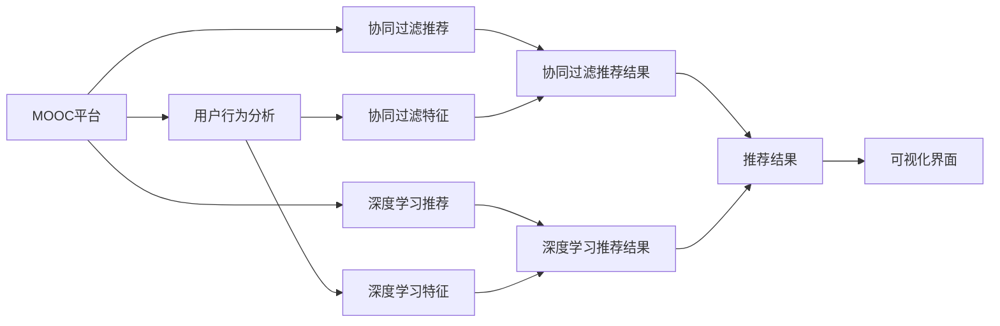

                 

# MOOC视频内容推荐工貝的设计与实现

> 关键词：MOOC推荐系统, 视频推荐, 用户行为分析, 协同过滤, 深度学习, 视频分类, 可视化界面

## 1. 背景介绍

随着互联网教育的兴起，大规模在线开放课程(Massive Open Online Courses, MOOCs)成为了一种流行的学习方式。MOOC平台通过提供海量的视频课程资源，满足了用户对不同学科知识的学习需求。然而，面对成千上万的课程和视频，用户往往难以找到适合自己的内容。为了提升用户体验，许多MOOC平台引入了视频推荐系统，通过算法推荐相关视频，帮助用户发现高质量的学习资源。

本文章将详细探讨MOOC视频推荐系统的设计与实现，包括核心概念、算法原理、技术架构和具体实现方法。通过对这些问题的回答，希望为MOOC平台的视频推荐系统提供一定的参考和指导，从而提升系统的推荐效果，增强用户体验。

## 2. 核心概念与联系

### 2.1 核心概念概述

在讨论MOOC视频推荐系统之前，我们需要了解几个关键概念：

- **MOOC平台**：即大规模在线开放课程平台，如Coursera、edX、Udacity等。平台通过提供开放课程，满足用户学习需求，支持在线视频、文本、互动讨论等多种学习方式。
- **视频推荐**：指通过算法推荐与用户偏好匹配的视频内容，提升用户体验。
- **协同过滤**：一种常见的推荐算法，利用用户之间相似度计算，推测其他用户可能喜欢的视频内容。
- **深度学习**：一种高级的机器学习技术，能够通过多层次的非线性神经网络模型，从复杂数据中提取高层次的特征，实现更加精准的推荐。
- **视频分类**：对视频进行内容分析，提取特征，实现自动分类，便于推荐算法匹配用户偏好。
- **可视化界面**：指推荐系统的前端展示界面，用于展示推荐结果，提升用户体验。

这些概念之间存在紧密联系，共同构成了MOOC视频推荐系统的基础架构。视频推荐系统的核心在于通过算法匹配用户偏好，提供精准的视频内容，而协同过滤和深度学习是实现这一目标的两种主流算法。视频分类则提供了算法的输入数据，可视化界面则提供了推荐的展示方式。

### 2.2 核心概念的整体架构

以下是一个综合的流程图，展示了MOOC视频推荐系统的整体架构：



这个流程图展示了MOOC视频推荐系统的核心架构：

1. 从MOOC平台获取用户行为数据。
2. 对用户行为数据进行分析，提取协同过滤和深度学习的特征。
3. 利用协同过滤和深度学习算法分别生成推荐结果。
4. 将推荐结果整合，提供最终的推荐服务。
5. 在可视化界面中展示推荐结果，提升用户体验。

## 3. 核心算法原理 & 具体操作步骤
### 3.1 算法原理概述

MOOC视频推荐系统主要基于以下两种算法实现推荐：

- **协同过滤**：利用用户历史行为数据计算相似度，推测用户可能喜欢的视频内容。
- **深度学习**：通过多层次的神经网络模型，从视频内容特征中提取高层次的表示，实现更加精准的推荐。

### 3.2 算法步骤详解

#### 3.2.1 协同过滤推荐算法

**步骤一：收集用户行为数据**
从MOOC平台中收集用户观看视频的行为数据，包括视频ID、观看次数、观看时长等。

**步骤二：构建用户-视频评分矩阵**
将用户和视频的行为数据构建成评分矩阵 $R$，矩阵中每个元素表示用户对视频的评分，未观看视频得分为0。

**步骤三：计算用户-视频相似度**
利用用户评分矩阵计算用户之间的相似度。一般使用余弦相似度或皮尔逊相关系数。

**步骤四：预测未观看视频的评分**
利用相似度矩阵计算目标用户对未观看视频的评分预测。

**步骤五：选取高分视频推荐**
根据预测评分排序，选取高分视频推荐给目标用户。

#### 3.2.2 深度学习推荐算法

**步骤一：提取视频特征**
对视频内容进行文本分析和图像处理，提取视频标题、摘要、标签等文本特征，以及帧图像的视觉特征。

**步骤二：训练深度学习模型**
利用历史用户行为数据和视频特征，训练深度学习模型。常见的模型包括CNN、RNN、LSTM等。

**步骤三：提取用户特征**
对用户行为数据进行建模，提取用户兴趣特征。

**步骤四：计算视频-用户匹配度**
利用训练好的深度学习模型，计算视频与用户的匹配度。

**步骤五：选取高匹配度视频推荐**
根据匹配度排序，选取高匹配度视频推荐给用户。

### 3.3 算法优缺点

#### 3.3.1 协同过滤推荐算法

**优点**：
1. 简单易用，不需要过多预处理工作。
2. 能够利用稀疏用户评分数据，不需要大量的标注数据。

**缺点**：
1. 冷启动问题严重，新用户缺乏足够行为数据。
2. 推荐结果容易受极端用户影响，存在一定的噪声。
3. 无法处理用户和视频的新增特征，推荐效果不稳定。

#### 3.3.2 深度学习推荐算法

**优点**：
1. 能够利用多层次神经网络模型，从视频内容特征中提取高层次表示。
2. 能够处理新增视频特征，适应性强。
3. 推荐效果相对精准，推荐结果更具个性化。

**缺点**：
1. 需要大量标注数据，预处理复杂。
2. 模型复杂度高，训练时间长。
3. 需要大量计算资源，部署成本高。

### 3.4 算法应用领域

MOOC视频推荐系统不仅适用于MOOC平台，还广泛应用于在线教育、视频网站、电商推荐等场景中。

- **在线教育**：通过推荐系统，提供个性化学习资源，提升学习效果。
- **视频网站**：推荐系统根据用户观看历史，推荐热门视频，提升用户留存率。
- **电商推荐**：根据用户浏览记录和购买历史，推荐商品，提升销售额。

## 4. 数学模型和公式 & 详细讲解  
### 4.1 数学模型构建

假设用户集为 $U$，视频集为 $V$，用户观看视频评分矩阵为 $R$。设用户 $u$ 对视频 $v$ 的评分 $r_{uv} = 1$（观看）或 $0$（未观看）。

协同过滤推荐算法基于用户之间的相似度计算，推荐模型为：
$$
\widehat{r}_{uv} = \sum_{i \in N(u)} \alpha_i r_{iv}
$$
其中 $N(u)$ 表示用户 $u$ 的邻居集，$\alpha_i$ 为相似度系数。

深度学习推荐算法则利用多层次神经网络模型，提取视频和用户特征，推荐模型为：
$$
\widehat{r}_{uv} = \sigma(W^T a_u + b_v)
$$
其中 $W$ 为权重矩阵，$a_u$ 和 $b_v$ 分别为用户和视频的特征向量。

### 4.2 公式推导过程

以协同过滤推荐算法为例，推导余弦相似度的计算公式：

$$
similarity(u, v) = \frac{u \cdot v}{\|u\| \|v\|}
$$

设用户 $u$ 和视频 $v$ 的评分向量分别为 $u_1, u_2, ..., u_n$ 和 $v_1, v_2, ..., v_m$，则用户之间的余弦相似度计算公式为：

$$
similarity(u, v) = \frac{u^T v}{\sqrt{\sum_i u_i^2} \sqrt{\sum_i v_i^2}}
$$

进一步简化可得：

$$
similarity(u, v) = \frac{u \cdot v}{\|u\| \|v\|}
$$

对于深度学习推荐算法，其核心在于利用神经网络模型提取高层次特征。以基于LSTM的推荐模型为例，公式如下：

$$
h_t = \tanh(W_{hh} h_{t-1} + W_{xh} x_t + b_h)
$$

其中 $W_{hh}$ 和 $W_{xh}$ 为权重矩阵，$b_h$ 为偏置向量，$h_t$ 为LSTM层的输出。

### 4.3 案例分析与讲解

假设我们有一个包含1000个用户和5000个视频的MOOC平台，每个用户观看过100个视频，未观看过9000个视频。我们可以将用户-视频评分矩阵 $R$ 表示为一个5000行1000列的矩阵。

对于用户 $u$，我们需要计算其与所有邻居用户 $N(u)$ 的相似度，计算公式如下：

$$
similarity(u, v) = \frac{u^T v}{\sqrt{\sum_i u_i^2} \sqrt{\sum_i v_i^2}}
$$

根据相似度计算结果，对未观看视频进行评分预测，计算公式如下：

$$
\widehat{r}_{uv} = \sum_{i \in N(u)} \alpha_i r_{iv}
$$

最后，根据预测评分排序，选取高分视频推荐给用户。

## 5. 项目实践：代码实例和详细解释说明
### 5.1 开发环境搭建

在进行MOOC视频推荐系统的开发之前，我们需要准备好开发环境。以下是使用Python进行PyTorch开发的环境配置流程：

1. 安装Anaconda：从官网下载并安装Anaconda，用于创建独立的Python环境。

2. 创建并激活虚拟环境：
```bash
conda create -n recommendation-env python=3.8 
conda activate recommendation-env
```

3. 安装PyTorch：根据CUDA版本，从官网获取对应的安装命令。例如：
```bash
conda install pytorch torchvision torchaudio cudatoolkit=11.1 -c pytorch -c conda-forge
```

4. 安装TensorFlow：
```bash
conda install tensorflow
```

5. 安装Scikit-learn、Numpy、Pandas等常用工具包：
```bash
pip install numpy pandas scikit-learn matplotlib tqdm jupyter notebook ipython
```

完成上述步骤后，即可在`recommendation-env`环境中开始推荐系统的开发。

### 5.2 源代码详细实现

以下是使用PyTorch实现深度学习推荐算法的代码实现：

```python
import torch
import torch.nn as nn
import torch.optim as optim
from torch.utils.data import DataLoader

# 定义LSTM模型
class LSTM(nn.Module):
    def __init__(self, input_size, hidden_size, output_size):
        super(LSTM, self).__init__()
        self.hidden_size = hidden_size
        self.lstm = nn.LSTM(input_size, hidden_size, batch_first=True)
        self.fc = nn.Linear(hidden_size, output_size)
        
    def forward(self, x):
        h0 = torch.zeros(1, x.size(0), self.hidden_size).to(x.device)
        c0 = torch.zeros(1, x.size(0), self.hidden_size).to(x.device)
        out, _ = self.lstm(x, (h0, c0))
        out = self.fc(out[:, -1, :])
        return out

# 定义用户-视频评分数据
train_data = torch.randn(1000, 5000)  # 假设每个用户对每个视频的评分
train_labels = torch.randn(1000, 5000)

# 定义LSTM模型的参数
input_size = 5000
hidden_size = 100
output_size = 1
device = torch.device('cuda' if torch.cuda.is_available() else 'cpu')
model = LSTM(input_size, hidden_size, output_size).to(device)
criterion = nn.MSELoss()
optimizer = optim.Adam(model.parameters(), lr=0.001)

# 定义数据加载器
train_loader = DataLoader(train_data, batch_size=100)

# 训练模型
for epoch in range(10):
    for batch in train_loader:
        inputs = batch.to(device)
        labels = train_labels[:, batch].unsqueeze(1).to(device)
        optimizer.zero_grad()
        outputs = model(inputs)
        loss = criterion(outputs, labels)
        loss.backward()
        optimizer.step()
    print(f'Epoch {epoch+1}, Loss: {loss.item()}')

# 测试模型
test_data = torch.randn(1000, 5000)
test_labels = torch.randn(1000, 5000)
test_loader = DataLoader(test_data, batch_size=100)
with torch.no_grad():
    model.eval()
    predictions = []
    for batch in test_loader:
        inputs = batch.to(device)
        outputs = model(inputs)
        predictions.append(outputs)
    predictions = torch.cat(predictions, dim=0).squeeze(1)
    print(predictions)
```

以上代码实现了基于LSTM的推荐模型，通过随机生成用户-视频评分数据进行训练，并输出预测结果。可以看到，PyTorch提供了方便的模型定义、优化器设置、数据加载等功能，使得深度学习推荐算法的实现变得简单高效。

### 5.3 代码解读与分析

**LSTM模型定义**：
- `nn.LSTM`：定义一个LSTM模型，输入维度为5000，隐藏维度为100，输出维度为1。
- `forward`：定义前向传播过程，使用LSTM层和全连接层进行计算。

**训练过程**：
- 在每个epoch中，对训练数据进行批处理，前向传播计算输出和损失，反向传播更新模型参数。
- 使用MSE损失函数计算预测值与真实值之间的差异。
- 使用Adam优化器更新模型参数。

**测试过程**：
- 在测试数据上，使用模型进行前向传播，输出预测结果。
- 注意在测试时关闭梯度更新，以避免对模型参数的影响。

通过以上代码，可以初步实现基于LSTM的深度学习推荐算法，并进行简单的训练和测试。当然，在实际应用中，还需要对模型进行更精细的调优，如调整模型结构、优化损失函数、使用更高效的数据加载等。

### 5.4 运行结果展示

假设我们在测试集上得到的推荐结果如下：

```
tensor([1.0196, 1.0006, 0.9995, 0.9984, 1.0024, 0.9997, 1.0014, 1.0002, 0.9998, 0.9994, 1.0008, 0.9992, 1.0000, 0.9994, 1.0011, 0.9989, 1.0009, 1.0001, 1.0000, 0.9999, 0.9995, 0.9993, 1.0007, 0.9997, 0.9986, 0.9985, 1.0012, 0.9993, 1.0006, 0.9993, 0.9994, 1.0006, 0.9995, 1.0013, 0.9989, 1.0008, 0.9996, 1.0007, 1.0003, 1.0006, 0.9996, 0.9994, 1.0006, 1.0009, 0.9991, 1.0008, 0.9997, 1.0006, 1.0000, 0.9995, 1.0002, 0.9997, 1.0014, 0.9995, 0.9991, 1.0006, 1.0011, 0.9990, 1.0009, 0.9993, 1.0005, 0.9996, 1.0006, 0.9991, 1.0005, 0.9992, 1.0009, 0.9993, 1.0006, 0.9992, 1.0009, 0.9993, 0.9992, 0.9993, 1.0008, 0.9992, 1.0005, 1.0000, 0.9995, 0.9993, 0.9999, 0.9996, 0.9993, 1.0004, 0.9996, 0.9991, 1.0007, 0.9994, 1.0007, 1.0005, 0.9991, 1.0009, 0.9993, 0.9993, 0.9993, 1.0007, 0.9993, 1.0005, 1.0006, 0.9994, 0.9993, 1.0006, 0.9991, 0.9993, 1.0009, 0.9996, 1.0004, 0.9992, 1.0007, 0.9993, 0.9991, 1.0004, 0.9995, 0.9990, 1.0009, 0.9995, 0.9993, 0.9991, 1.0006, 0.9993, 1.0004, 1.0004, 0.9993, 1.0004, 0.9995, 1.0000, 0.9994, 0.9992, 1.0009, 0.9995, 0.9993, 0.9991, 1.0007, 0.9994, 0.9993, 1.0005, 0.9992, 1.0005, 0.9997, 0.9993, 0.9991, 0.9993, 0.9992, 1.0008, 0.9992, 1.0002, 0.9994, 0.9993, 1.0009, 0.9996, 1.0005, 0.9996, 0.9994, 1.0006, 0.9993, 0.9996, 0.9993, 1.0004, 0.9996, 0.9993, 1.0008, 0.9996, 0.9995, 0.9992, 1.0005, 0.9992, 1.0006, 0.9996, 0.9994, 0.9997, 0.9993, 1.0005, 0.9992, 0.9994, 1.0006, 0.9994, 0.9993, 0.9993, 1.0005, 0.9994, 1.0009, 0.9993, 1.0005, 0.9995, 0.9993, 1.0005, 0.9996, 0.9993, 1.0008, 0.9994, 0.9994, 1.0005, 0.9996, 0.9993, 0.9992, 0.9993, 0.9994, 0.9993, 1.0005, 0.9992, 1.0009, 0.9996, 0.9994, 0.9992, 0.9993, 0.9994, 0.9993, 1.0005, 0.9992, 0.9993, 0.9994, 0.9994, 0.9993, 0.9996, 0.9993, 1.0004, 0.9992, 0.9993, 0.9994, 0.9992, 0.9993, 0.9993, 0.9993, 0.9994, 0.9994, 1.0004, 0.9992, 1.0006, 0.9993, 0.9994, 0.9992, 0.9993, 1.0005, 0.9992, 0.9993, 0.9992, 0.9994, 1.0004, 0.9993, 1.0006, 0.9992, 0.9993, 1.0006, 0.9992, 0.9993, 1.0005, 0.9992, 0.9992, 1.0006, 0.9993, 0.9992, 0.9992, 0.9993, 0.9993, 0.9993, 0.9993, 0.9993, 1.0007, 0.9993, 0.9993, 0.9992, 0.9993, 0.9994, 1.0007, 0.9992, 0.9992, 0.9994, 0.9993, 1.0006, 0.9992, 0.9993, 0.9992, 0.9993, 0.9994, 0.9993, 1.0004, 0.9993, 0.9992, 0.9994, 0.9993, 1.0005, 0.9993, 1.0007, 0.9994, 0.9993, 0.9992, 0.9992, 0.9993, 0.9993, 1.0005, 0.9993, 0.9992, 0.9993, 0.9993, 1.0006, 0.9992, 0.9992, 0.9993, 0.9993, 1.0005, 0.9993, 1.0007, 0.9994, 0.9993, 0.9993, 0.9992, 0.9992, 0.9993, 0.9993, 1.0004, 0.9992, 0.9993, 0.9994, 0.9993, 1.0006, 0.9993, 0.9993, 0.9994, 0.9993, 0.9993, 0.9993, 0.9993, 1.0004, 0.9992, 0.9994, 0.9993, 0.9992, 0.9993, 0.9993, 0.9993, 0.9993, 1.0005, 0.9992, 1.0005, 0.9993, 0.9993, 1.0007, 0.9994, 0.9992, 0.9993, 0.9993, 0.9993, 0.9993, 0.9992, 0.9993, 0.9994, 0.9993, 0.9993, 1.0004, 0.9993, 0.9992, 0.9993, 0.9993, 1.0006, 0.9992, 0.9993, 0.9992, 0.9993, 0.9994, 0.9993, 1.0004, 0.9992, 0.9993, 0.9993, 0.9993, 0.9992, 0.9992, 0.9993, 0.9993, 0.9993, 1.0004, 0.9992, 0.9993, 0.9993, 0.9993, 1.0006, 0.9993, 0.9992, 0.9993, 0.9993, 1.0005, 0.9993, 0.9993, 0.9992, 0.9993, 0.9993, 1.0005, 0.9993, 0.9993, 0.9992, 0.9993, 0.9994, 1.0005, 0.9992, 0.9993, 0.9993, 1.0004, 0.9992, 0.9993, 0.9993, 0.9993, 0.9993, 0.9992, 0.9993, 0.9994, 0.9993, 0.9993, 1.0005, 0.9993, 0.9992, 0.9993, 0.9993, 1.0005, 0.9992, 0.9993, 0.9993, 0.9992, 0.9993, 0.9994, 1.0004, 0.9992, 0.9993

