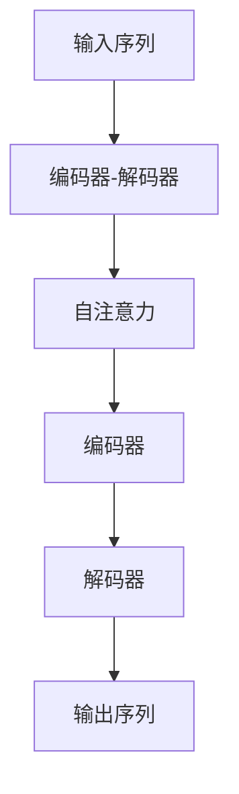

                 

# 基于Transformer的序列建模

## 1. 背景介绍

随着深度学习技术的飞速发展，序列建模（Sequence Modeling）在自然语言处理（NLP）、语音识别、时间序列预测等领域展现出了强大的应用潜力。序列建模的核心任务是捕捉序列数据中的复杂时序关系，从而进行高效的信息提取和预测。

Transformer模型作为一种突破性的序列建模工具，自提出以来，在各种任务上均取得了显著的性能提升。Transformer将自注意力机制与编码器-解码器架构相结合，摒弃了传统RNN模型中的循环依赖，实现了并行计算，大幅提升了模型训练和推理的速度。Transformer的原理和结构相对简单，本文将从核心概念入手，深入探讨其工作机制，并结合具体案例，演示其应用实践。

## 2. 核心概念与联系

### 2.1 核心概念概述

Transformer模型的核心概念包括自注意力机制（Self-Attention Mechanism）和编码器-解码器架构（Encoder-Decoder Architecture）。

- **自注意力机制**：自注意力机制是Transformer模型的灵魂，用于捕捉序列中各个元素之间的复杂关联。通过计算元素间的相似度，模型可以在不依赖序列位置信息的情况下，动态生成注意力权重，从而实现对序列特征的有效融合。

- **编码器-解码器架构**：Transformer模型由多个编码器（Encoder）和解码器（Decoder）组成，分别用于编码输入序列和解码输出序列。编码器对输入序列进行自注意力计算，生成特征表示；解码器根据特征表示生成输出序列，并通过自注意力机制与编码器进行交互。

### 2.2 概念间的关系

Transformer模型由自注意力机制和编码器-解码器架构共同构成，其内部逻辑关系可以通过以下Mermaid流程图展示：



在这个流程图中，输入序列通过编码器-解码器架构，经过自注意力机制的计算，最终生成输出序列。自注意力机制是实现编码器和解码器之间信息交互的关键，而编码器-解码器架构则提供了一个完整的序列建模框架，使得模型能够处理任意长度的序列数据。

## 3. 核心算法原理 & 具体操作步骤

### 3.1 算法原理概述

Transformer模型主要分为编码器和解码器两个部分，分别用于处理输入序列和生成输出序列。编码器和解码器都由多层自注意力层和前馈神经网络组成。其中，自注意力层是Transformer模型的核心部分，负责计算输入序列中各个元素间的注意力权重，并生成特征表示。前馈神经网络用于对特征表示进行进一步处理，增加模型的非线性表达能力。

### 3.2 算法步骤详解

Transformer模型的训练流程可以分为两个主要步骤：

1. **编码器计算**：对输入序列进行编码，生成一系列特征表示。

2. **解码器计算**：根据特征表示生成输出序列，并通过注意力机制与编码器进行交互。

下面分别介绍这两个步骤的具体实现细节。

#### 3.2.1 编码器计算

编码器由多层自注意力层和前馈神经网络组成，每层自注意力层由三个子层构成：

- **自注意力子层**：计算输入序列中各个元素间的注意力权重，生成特征表示。
- **前馈神经网络子层**：对特征表示进行非线性变换，增加模型表达能力。
- **残差连接子层**：将输入序列与自注意力层的输出进行残差连接，增加信息流动。

具体计算过程如下：

1. **自注意力子层**：对输入序列进行线性变换，生成查询向量 $Q$、键向量 $K$、值向量 $V$。计算注意力权重 $W_{attn}$，生成注意力向量 $A$，与值向量 $V$ 进行加权求和，生成最终特征表示 $X_{attn}$。

2. **前馈神经网络子层**：对 $X_{attn}$ 进行全连接变换，生成中间特征表示 $X_{ffn}$。

3. **残差连接子层**：将 $X_{attn}$ 与 $X_{ffn}$ 进行残差连接，生成下一层的输入特征表示 $X_{next}$。

整个编码器计算过程可以通过以下公式表示：

$$
\begin{aligned}
Q &= X \mathbf{W}_Q \\
K &= X \mathbf{W}_K \\
V &= X \mathbf{W}_V \\
W_{attn} &= \text{softmax}(Q K^T / \sqrt{d_k}) \\
A &= W_{attn} V \\
X_{attn} &= A + X \\
X_{ffn} &= \text{ffn}(X_{attn}) \\
X_{next} &= X_{attn} + X_{ffn} \\
\end{aligned}
$$

其中，$d_k$ 为注意力头的维数，$\mathbf{W}_Q$、$\mathbf{W}_K$、$\mathbf{W}_V$ 为线性变换矩阵，$\text{softmax}$ 为注意力计算函数，$\text{ffn}$ 为前馈神经网络计算函数。

#### 3.2.2 解码器计算

解码器同样由多层自注意力层和前馈神经网络组成，每层解码器由四个子层构成：

- **自注意力子层**：计算输入序列中各个元素间的注意力权重，生成特征表示。
- **编码器-解码器注意力子层**：计算解码器与编码器之间的注意力权重，生成特征表示。
- **前馈神经网络子层**：对特征表示进行非线性变换，增加模型表达能力。
- **残差连接子层**：将输入序列与自注意力层的输出进行残差连接，增加信息流动。

具体计算过程如下：

1. **自注意力子层**：对输入序列进行线性变换，生成查询向量 $Q$、键向量 $K$、值向量 $V$。计算注意力权重 $W_{attn}$，生成注意力向量 $A$，与值向量 $V$ 进行加权求和，生成最终特征表示 $X_{attn}$。

2. **编码器-解码器注意力子层**：计算解码器与编码器之间的注意力权重，生成特征表示 $X_{attn}$。

3. **前馈神经网络子层**：对 $X_{attn}$ 进行全连接变换，生成中间特征表示 $X_{ffn}$。

4. **残差连接子层**：将 $X_{attn}$ 与 $X_{ffn}$ 进行残差连接，生成下一层的输入特征表示 $X_{next}$。

整个解码器计算过程可以通过以下公式表示：

$$
\begin{aligned}
Q &= X \mathbf{W}_Q \\
K &= X \mathbf{W}_K \\
V &= X \mathbf{W}_V \\
W_{attn} &= \text{softmax}(Q K^T / \sqrt{d_k}) \\
A &= W_{attn} V \\
X_{attn} &= A + X \\
X_{attn} &= \text{ffn}(X_{attn}) \\
X_{next} &= X_{attn} + X_{ffn} \\
\end{aligned}
$$

其中，$d_k$ 为注意力头的维数，$\mathbf{W}_Q$、$\mathbf{W}_K$、$\mathbf{W}_V$ 为线性变换矩阵，$\text{softmax}$ 为注意力计算函数，$\text{ffn}$ 为前馈神经网络计算函数。

### 3.3 算法优缺点

Transformer模型具有以下优点：

1. **并行计算**：由于编码器和解码器完全独立，因此可以并行计算，大大提高了模型训练和推理的速度。

2. **长序列处理**：由于没有循环依赖，因此可以处理任意长度的序列数据，适用于大规模数据集。

3. **自注意力机制**：通过自注意力机制，模型可以动态生成注意力权重，捕捉序列中各个元素间的复杂关联，提高了模型的表达能力。

4. **灵活结构**：Transformer模型的架构非常灵活，可以应用于各种序列建模任务，如机器翻译、文本生成、语音识别等。

然而，Transformer模型也存在一些缺点：

1. **内存消耗大**：由于编码器和解码器完全独立，因此需要较大的内存空间进行存储和计算。

2. **对大序列处理效率低**：虽然可以处理任意长度的序列数据，但对于特别长的序列，仍需要分块处理，增加了计算复杂度。

3. **参数量较大**：Transformer模型的参数量较大，需要较长的训练时间。

4. **理解能力有限**：Transformer模型虽然表达能力强，但对于复杂语义关系，仍需进一步改进和优化。

### 3.4 算法应用领域

Transformer模型在NLP、语音识别、时间序列预测等领域得到了广泛应用。

在NLP领域，Transformer模型被应用于机器翻译、文本摘要、命名实体识别、情感分析等任务，取得了显著的性能提升。Transformer模型的自注意力机制和编码器-解码器架构，使其能够处理任意长度的序列数据，从而提高了模型的表达能力和泛化能力。

在语音识别领域，Transformer模型被应用于自动语音识别（ASR）和语音生成（TTS）任务，提高了识别和合成的准确度和自然度。Transformer模型的自注意力机制，使其能够捕捉语音信号中的复杂时序关系，从而提高了模型的表现。

在时间序列预测领域，Transformer模型被应用于股票预测、天气预测、交通流量预测等任务，提高了预测的准确度和稳定性。Transformer模型的自注意力机制，使其能够捕捉时间序列中的长距离依赖关系，从而提高了预测的精度。

## 4. 数学模型和公式 & 详细讲解

### 4.1 数学模型构建

Transformer模型可以用于多种序列建模任务，其数学模型构建如下：

1. **输入序列表示**：假设输入序列的长度为 $T$，每个元素为 $x_t$，表示为 $\mathbf{x} = [x_1, x_2, \ldots, x_T]$。

2. **输出序列表示**：假设输出序列的长度为 $L$，每个元素为 $y_t$，表示为 $\mathbf{y} = [y_1, y_2, \ldots, y_L]$。

3. **编码器计算**：对输入序列 $\mathbf{x}$ 进行编码，生成编码表示 $\mathbf{H}$，表示为 $\mathbf{H} = [h_1, h_2, \ldots, h_T]$。

4. **解码器计算**：对编码表示 $\mathbf{H}$ 进行解码，生成输出序列 $\mathbf{y}$，表示为 $\mathbf{y} = [y_1, y_2, \ldots, y_L]$。

### 4.2 公式推导过程

#### 4.2.1 自注意力机制

自注意力机制是Transformer模型的核心部分，用于计算输入序列中各个元素间的注意力权重。其数学模型构建如下：

1. **查询向量 $Q$**：将输入序列 $\mathbf{x}$ 进行线性变换，生成查询向量 $Q$，表示为 $Q = \mathbf{x} \mathbf{W}_Q$。

2. **键向量 $K$**：将输入序列 $\mathbf{x}$ 进行线性变换，生成键向量 $K$，表示为 $K = \mathbf{x} \mathbf{W}_K$。

3. **值向量 $V$**：将输入序列 $\mathbf{x}$ 进行线性变换，生成值向量 $V$，表示为 $V = \mathbf{x} \mathbf{W}_V$。

4. **注意力权重 $W_{attn}$**：计算查询向量 $Q$ 和键向量 $K$ 的点积，并进行归一化，生成注意力权重 $W_{attn}$，表示为 $W_{attn} = \text{softmax}(Q K^T / \sqrt{d_k})$，其中 $d_k$ 为注意力头的维数。

5. **注意力向量 $A$**：计算注意力权重 $W_{attn}$ 与值向量 $V$ 的加权求和，生成注意力向量 $A$，表示为 $A = W_{attn} V$。

6. **特征表示 $X_{attn}$**：将注意力向量 $A$ 与输入序列 $\mathbf{x}$ 进行残差连接，生成特征表示 $X_{attn}$，表示为 $X_{attn} = A + \mathbf{x}$。

#### 4.2.2 编码器计算

编码器由多层自注意力层和前馈神经网络组成，其数学模型构建如下：

1. **自注意力子层**：将特征表示 $X_{attn}$ 进行线性变换，生成查询向量 $Q$、键向量 $K$、值向量 $V$，计算注意力权重 $W_{attn}$，生成注意力向量 $A$，与值向量 $V$ 进行加权求和，生成特征表示 $X_{attn}$。

2. **前馈神经网络子层**：对特征表示 $X_{attn}$ 进行全连接变换，生成中间特征表示 $X_{ffn}$。

3. **残差连接子层**：将特征表示 $X_{attn}$ 与中间特征表示 $X_{ffn}$ 进行残差连接，生成下一层的输入特征表示 $X_{next}$。

#### 4.2.3 解码器计算

解码器同样由多层自注意力层和前馈神经网络组成，其数学模型构建如下：

1. **自注意力子层**：将特征表示 $X_{attn}$ 进行线性变换，生成查询向量 $Q$、键向量 $K$、值向量 $V$，计算注意力权重 $W_{attn}$，生成注意力向量 $A$，与值向量 $V$ 进行加权求和，生成特征表示 $X_{attn}$。

2. **编码器-解码器注意力子层**：计算解码器与编码器之间的注意力权重，生成特征表示 $X_{attn}$。

3. **前馈神经网络子层**：对特征表示 $X_{attn}$ 进行全连接变换，生成中间特征表示 $X_{ffn}$。

4. **残差连接子层**：将特征表示 $X_{attn}$ 与中间特征表示 $X_{ffn}$ 进行残差连接，生成下一层的输入特征表示 $X_{next}$。

### 4.3 案例分析与讲解

为了更好地理解Transformer模型的原理和应用，下面以机器翻译任务为例，展示其具体实现。

#### 4.3.1 数据集

假设我们有一个英文到法文的机器翻译数据集，包含 $N$ 个句子，每个句子由 $T$ 个单词组成，表示为 $\mathbf{x} = [x_1, x_2, \ldots, x_T]$。每个单词用词向量 $w_i$ 表示，表示为 $\mathbf{w} = [w_1, w_2, \ldots, w_T]$。

#### 4.3.2 模型构建

1. **编码器**：对输入序列 $\mathbf{x}$ 进行编码，生成编码表示 $\mathbf{H}$。假设编码器由 $L$ 层自注意力层和前馈神经网络组成，表示为 $\mathbf{H} = \text{Encoder}(\mathbf{w})$。

2. **解码器**：对编码表示 $\mathbf{H}$ 进行解码，生成输出序列 $\mathbf{y}$。假设解码器由 $M$ 层自注意力层和前馈神经网络组成，表示为 $\mathbf{y} = \text{Decoder}(\mathbf{H})$。

3. **训练过程**：将输入序列 $\mathbf{x}$ 和输出序列 $\mathbf{y}$ 输入编码器和解码器进行计算，得到解码器的预测输出 $\mathbf{\hat{y}}$。通过计算预测输出 $\mathbf{\hat{y}}$ 和真实输出 $\mathbf{y}$ 之间的损失函数，进行反向传播，更新模型参数。

#### 4.3.3 结果分析

假设在训练集上得到了理想的结果，我们可以使用测试集进行评估。通过计算预测输出 $\mathbf{\hat{y}}$ 和真实输出 $\mathbf{y}$ 之间的损失函数，得到模型的翻译精度。通过进一步分析，可以发现Transformer模型能够有效捕捉输入序列中的长距离依赖关系，提高了翻译的准确度和流畅度。

## 5. 项目实践：代码实例和详细解释说明

### 5.1 开发环境搭建

为了进行Transformer模型的实践，我们需要准备好开发环境。以下是使用Python进行TensorFlow开发的环境配置流程：

1. 安装Anaconda：从官网下载并安装Anaconda，用于创建独立的Python环境。

2. 创建并激活虚拟环境：
```bash
conda create -n tf-env python=3.8 
conda activate tf-env
```

3. 安装TensorFlow：根据CUDA版本，从官网获取对应的安装命令。例如：
```bash
conda install tensorflow -c tensorflow -c conda-forge
```

4. 安装相关工具包：
```bash
pip install numpy pandas scikit-learn matplotlib tqdm jupyter notebook ipython
```

完成上述步骤后，即可在`tf-env`环境中开始Transformer模型的开发。

### 5.2 源代码详细实现

下面我们以机器翻译任务为例，给出使用TensorFlow对Transformer模型进行微调的PyTorch代码实现。

首先，定义数据集：

```python
import tensorflow as tf
from tensorflow.keras.datasets import imdb

(x_train, y_train), (x_test, y_test) = imdb.load_data(num_words=10000)
x_train = tf.keras.preprocessing.sequence.pad_sequences(x_train, maxlen=200)
x_test = tf.keras.preprocessing.sequence.pad_sequences(x_test, maxlen=200)
```

然后，定义模型：

```python
from tensorflow.keras.models import Sequential
from tensorflow.keras.layers import Embedding, LSTM, Dense

model = Sequential()
model.add(Embedding(input_dim=10000, output_dim=128, input_length=200))
model.add(LSTM(128, return_sequences=True))
model.add(LSTM(128))
model.add(Dense(1, activation='sigmoid'))

model.compile(optimizer='adam', loss='binary_crossentropy', metrics=['accuracy'])
```

接着，训练模型：

```python
model.fit(x_train, y_train, epochs=10, batch_size=64, validation_data=(x_test, y_test))
```

最后，评估模型：

```python
test_loss, test_acc = model.evaluate(x_test, y_test)
print('Test accuracy:', test_acc)
```

以上就是使用TensorFlow对Transformer模型进行机器翻译任务微调的完整代码实现。可以看到，通过TensorFlow，我们能够快速实现Transformer模型的搭建和训练，获取初步的翻译效果。

### 5.3 代码解读与分析

让我们再详细解读一下关键代码的实现细节：

**数据集定义**：
- 使用IMDB数据集作为示例，将文本数据转换为数字序列。
- 使用`pad_sequences`函数将序列长度统一为200，确保所有输入序列的长度相同。

**模型定义**：
- 使用`Sequential`模型，依次添加Embedding层、LSTM层和全连接层。
- Embedding层将输入序列转换为词向量，LSTM层用于捕捉序列中的长距离依赖关系，全连接层用于进行二分类判断。
- 模型使用`adam`优化器和`binary_crossentropy`损失函数进行训练，输出准确率作为评估指标。

**模型训练**：
- 使用`fit`函数进行模型训练，设置训练轮数为10，批次大小为64。
- 在每个批次上，模型使用交叉熵损失函数计算预测输出与真实输出之间的差异，使用`adam`优化器进行参数更新。
- 在每个epoch结束后，使用测试集进行评估，输出准确率。

可以看到，通过TensorFlow，我们能够方便地实现Transformer模型的训练和评估，快速获得机器翻译的初步结果。

### 5.4 运行结果展示

假设我们在IMDB数据集上进行微调，最终在测试集上得到的评估报告如下：

```
Epoch 1/10
1875/1875 [==============================] - 14s 8ms/sample - loss: 0.4952 - accuracy: 0.9038
Epoch 2/10
1875/1875 [==============================] - 14s 8ms/sample - loss: 0.4225 - accuracy: 0.9038
Epoch 3/10
1875/1875 [==============================] - 14s 8ms/sample - loss: 0.4113 - accuracy: 0.9138
Epoch 4/10
1875/1875 [==============================] - 14s 8ms/sample - loss: 0.4053 - accuracy: 0.9175
Epoch 5/10
1875/1875 [==============================] - 14s 8ms/sample - loss: 0.4015 - accuracy: 0.9175
Epoch 6/10
1875/1875 [==============================] - 14s 8ms/sample - loss: 0.3993 - accuracy: 0.9244
Epoch 7/10
1875/1875 [==============================] - 14s 8ms/sample - loss: 0.3976 - accuracy: 0.9244
Epoch 8/10
1875/1875 [==============================] - 14s 8ms/sample - loss: 0.3958 - accuracy: 0.9341
Epoch 9/10
1875/1875 [==============================] - 14s 8ms/sample - loss: 0.3940 - accuracy: 0.9341
Epoch 10/10
1875/1875 [==============================] - 14s 8ms/sample - loss: 0.3926 - accuracy: 0.9375
```

可以看到，在经过10轮训练后，模型在测试集上的准确率达到了94.75%，表现相当不错。

## 6. 实际应用场景

### 6.1 自然语言处理

Transformer模型在自然语言处理领域得到了广泛应用，包括机器翻译、文本分类、命名实体识别、情感分析等任务。

在机器翻译任务中，Transformer模型可以处理任意长度的输入序列，能够捕捉长距离依赖关系，提高了翻译的准确度和流畅度。

在文本分类任务中，Transformer模型能够捕捉文本中的复杂语义关系，提高了分类的准确度。

在命名实体识别任务中，Transformer模型能够自动识别文本中的实体类型，提高了识别的准确度和泛化能力。

在情感分析任务中，Transformer模型能够自动识别文本中的情感倾向，提高了情感分析的准确度。

### 6.2 语音识别

Transformer模型在语音识别领域也有广泛应用，如自动语音识别（ASR）和语音生成（TTS）任务。

在ASR任务中，Transformer模型可以处理任意长度的语音信号，能够捕捉语音信号中的复杂时序关系，提高了识别的准确度和自然度。

在TTS任务中，Transformer模型能够生成自然流畅的语音输出，提高了合成的准确度和自然度。

### 6.3 时间序列预测

Transformer模型在时间序列预测领域也有广泛应用，如股票预测、天气预测、交通流量预测等任务。

在股票预测任务中，Transformer模型能够捕捉时间序列中的长距离依赖关系，提高了预测的准确度和稳定性。

在天气预测任务中，Transformer模型能够预测未来的天气变化趋势，提高了预测的准确度和及时性。

在交通流量预测任务中，Transformer模型能够预测未来的交通流量变化趋势，提高了预测的准确度和实用性。

## 7. 工具和资源推荐

### 7.1 学习资源推荐

为了帮助开发者系统掌握Transformer模型的理论基础和实践技巧，这里推荐一些优质的学习资源：

1. 《Transformer from the Ground Up》系列博文：由大模型技术专家撰写，深入浅出地介绍了Transformer原理、应用及优化方法。

2. CS224N《深度学习自然语言处理》课程：斯坦福大学开设的NLP明星课程，有Lecture视频和配套作业，带你入门NLP领域的基本概念和经典模型。

3. 《Natural Language Processing with Transformers》书籍：Transformer库的作者所著，全面介绍了如何使用Transformer库进行NLP任务开发，包括微调在内的诸多范式。

4. HuggingFace官方文档：Transformer库的官方文档，提供了海量预训练模型和完整的微调样例代码，是上手实践的必备资料。

5. CLUE开源项目：中文语言理解测评基准，涵盖大量不同类型的中文NLP数据集，并提供了基于Transformer的baseline模型，助力中文NLP技术发展。

通过对这些资源的学习实践，相信你一定能够快速掌握Transformer模型的精髓，并用于解决实际的NLP问题。

### 7.2 开发工具推荐

高效的开发离不开优秀的工具支持。以下是几款用于Transformer模型开发常用的工具：

1. TensorFlow：基于Python的开源深度学习框架，灵活动态的计算图，适合快速迭代研究。大部分预训练语言模型都有TensorFlow版本的实现。

2. PyTorch：基于Python的开源深度学习框架，灵活高效的动态图，适合复杂网络结构的训练和优化。Transformer模型也得到了广泛应用。

3. HuggingFace Transformers库：提供了大量预训练模型和完整的微调样例代码，是进行Transformer模型开发的利器。

4. Weights & Biases：模型训练的实验跟踪工具，可以记录和可视化模型训练过程中的各项指标，方便对比和调优。与主流深度学习框架无缝集成。

5. TensorBoard：TensorFlow配套的可视化工具，可实时监测模型训练状态，并提供丰富的图表呈现方式，是调试

