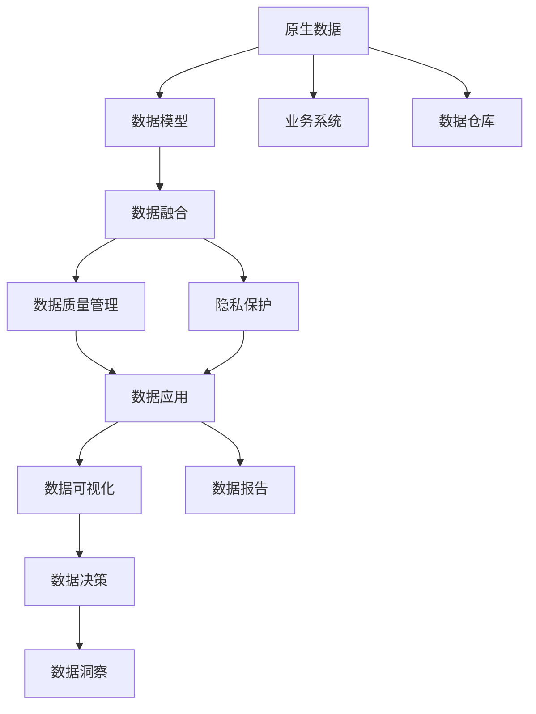
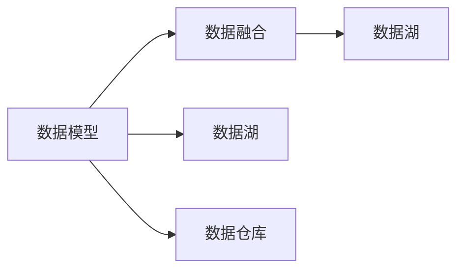
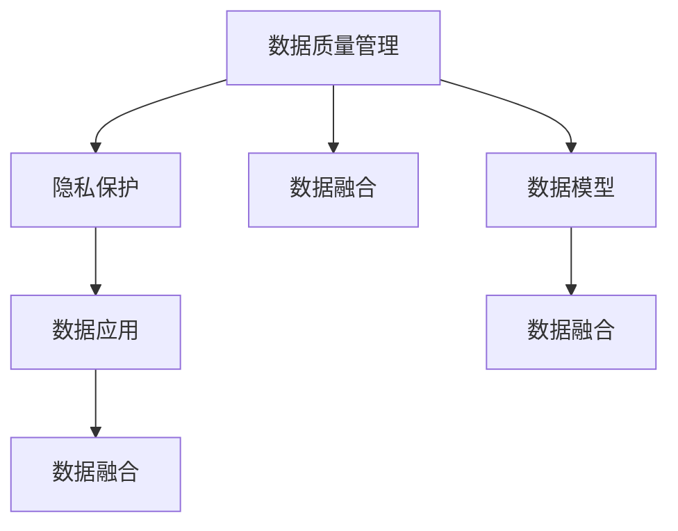

                 

## 1. 背景介绍

### 1.1 问题由来

随着数字化转型加速，海量数据被生成，同时也带来了信息过载、数据质量参差不齐等问题。在面对这一挑战时，如何高效继承信息，提升数据的利用效率，成为了一个重要议题。本文聚焦于原生世界信息的高效继承，通过构建基于原生数据模型的数据体系，解决数据融合、质量管理、隐私保护等难题，为高效信息继承提供有力支撑。

### 1.2 问题核心关键点

原生世界信息的高效继承涉及数据模型的构建、数据融合策略、质量管理方法、隐私保护技术等多个方面。其核心目标在于：

1. **数据模型构建**：设计易于扩展和维护的数据模型，确保数据来源、结构、质量等要素的一致性和完整性。
2. **数据融合策略**：采用有效融合技术，将不同来源、格式、类型的数据高效整合，形成统一、完整的数据集合。
3. **质量管理方法**：通过多维度的数据质量评估和自动化管理，提升数据的可靠性和可用性。
4. **隐私保护技术**：在数据融合和质量管理过程中，确保数据隐私和安全性，防止数据滥用和泄露。

### 1.3 问题研究意义

高效继承原生世界信息，对于提升数据利用效率、降低数据治理成本、保障数据安全具有重要意义：

1. **提升数据利用效率**：通过统一数据模型和规范，使得数据更易于整合、分析和应用，提高数据利用效率。
2. **降低数据治理成本**：减少数据冗余和重复，优化数据管理流程，降低数据治理的复杂度和成本。
3. **保障数据安全**：在数据融合和质量管理过程中，采用隐私保护技术，确保数据在处理和使用过程中不泄露个人隐私和敏感信息。

## 2. 核心概念与联系

### 2.1 核心概念概述

为更好地理解原生世界信息的高效继承，本节将介绍几个密切相关的核心概念：

- **原生数据**：指直接从业务系统中生成、未经处理的数据，包含原始业务信息和业务规则，具有高度业务相关性。
- **数据模型**：定义数据的结构、类型、关系等要素，用于描述数据的逻辑组织，是数据管理的基础。
- **数据融合**：将不同来源、格式、类型的数据进行有效整合，形成统一、完整的数据集合。
- **数据质量管理**：通过多维度的评估和管理手段，提升数据的可靠性和可用性。
- **隐私保护**：在数据融合和质量管理过程中，确保数据隐私和安全性，防止数据滥用和泄露。

这些核心概念之间的逻辑关系可以通过以下Mermaid流程图来展示：



这个流程图展示了大数据模型和数据融合过程的基本关系，描述了从业务系统到数据应用的全链条数据管理流程。

### 2.2 概念间的关系

这些核心概念之间存在着紧密的联系，形成了原生数据管理系统的完整生态系统。下面我通过几个Mermaid流程图来展示这些概念之间的关系。

#### 2.2.1 数据模型与数据融合



这个流程图展示了数据模型和数据融合的关系，以及它们如何共同构建数据湖。

#### 2.2.2 数据质量管理与隐私保护



这个流程图展示了数据质量管理和隐私保护的关系，以及它们在数据融合和应用中的作用。

## 3. 核心算法原理 & 具体操作步骤

### 3.1 算法原理概述

原生世界信息的高效继承过程，本质上是通过构建统一的数据模型，采用高效的数据融合策略，结合质量管理和隐私保护技术，实现数据的高效继承和应用。其核心算法包括：

- **数据模型构建**：设计易于扩展和维护的数据模型，确保数据来源、结构、质量等要素的一致性和完整性。
- **数据融合算法**：采用高效的算法将不同来源、格式、类型的数据进行整合，形成统一、完整的数据集合。
- **数据质量评估算法**：通过多维度的评估和管理手段，提升数据的可靠性和可用性。
- **隐私保护算法**：在数据融合和质量管理过程中，确保数据隐私和安全性，防止数据滥用和泄露。

### 3.2 算法步骤详解

基于原生世界信息的高效继承算法，可以概括为以下几个关键步骤：

**Step 1: 设计数据模型**

1. **需求分析**：明确业务需求和数据管理目标，设计符合业务需求的数据模型。
2. **结构设计**：确定数据模型的结构和关系，包括实体、属性、关联等要素。
3. **规范制定**：制定数据模型的规范和标准，包括命名规范、类型规范、质量标准等。

**Step 2: 数据融合**

1. **数据源整合**：收集和管理来自不同业务系统和数据仓库的数据。
2. **数据清洗和转换**：清洗数据中的异常值和错误，进行格式和类型转换，确保数据的一致性。
3. **数据合并和集成**：采用高效的数据融合算法，将数据进行合并和集成，形成统一的数据集合。

**Step 3: 数据质量管理**

1. **数据质量评估**：通过多维度的评估指标，如完整性、准确性、一致性、唯一性等，对数据质量进行全面评估。
2. **数据质量改善**：针对评估结果，采用自动化的数据质量管理工具，进行数据清洗、修复和优化。
3. **数据质量监控**：建立数据质量监控机制，定期检查数据质量，确保数据持续处于高质量状态。

**Step 4: 隐私保护**

1. **隐私保护策略**：制定隐私保护策略，明确数据使用的权限和范围。
2. **数据匿名化**：对敏感数据进行匿名化处理，防止数据泄露。
3. **数据加密**：采用数据加密技术，确保数据在传输和存储过程中的安全。

### 3.3 算法优缺点

原生世界信息的高效继承算法具有以下优点：

1. **高效融合**：通过设计合理的数据模型，采用高效的数据融合算法，能够快速将不同来源、格式、类型的数据整合，形成统一、完整的数据集合。
2. **质量可靠**：通过多维度的数据质量评估和管理，能够确保数据的完整性、准确性和一致性，提升数据的可靠性和可用性。
3. **隐私保护**：通过隐私保护策略和技术，确保数据在处理和使用过程中不泄露个人隐私和敏感信息，保障数据安全。

但该算法也存在以下局限性：

1. **模型设计复杂**：设计符合业务需求的数据模型，需要深入理解业务规则和数据特点，设计复杂。
2. **数据融合难度高**：数据源多样性高，数据清洗和转换工作量大，融合过程复杂。
3. **质量管理难度大**：多维度数据质量评估和管理工作量大，自动化管理难度高。
4. **隐私保护复杂**：隐私保护策略和技术复杂，需平衡数据利用与隐私保护之间的关系。

### 3.4 算法应用领域

原生世界信息的高效继承算法，已经在多个领域得到了广泛应用，例如：

- **金融行业**：用于交易数据的融合和管理，提升金融风控和风险管理能力。
- **医疗行业**：用于患者数据的整合和分析，提高医疗数据的质量和利用效率。
- **零售行业**：用于客户数据的融合和管理，提升客户关系管理和营销能力。
- **政府行业**：用于公共数据的融合和管理，提升公共服务的效率和质量。

除了上述这些经典领域外，原生世界信息的高效继承技术还被创新性地应用到更多场景中，如城市管理、环境监测、智能制造等，为不同行业的数据治理提供了有力支撑。

## 4. 数学模型和公式 & 详细讲解

### 4.1 数学模型构建

本节将使用数学语言对原生世界信息的高效继承过程进行更加严格的刻画。

记原始业务数据为 $D = \{d_i\}_{i=1}^N$，其中 $d_i = (x_i, y_i)$，$x_i$ 为原始数据，$y_i$ 为业务规则。设计的数据模型为 $M$，包括实体 $E$、属性 $A$、关系 $R$ 等要素。

设计的数据融合算法为 $F$，用于将不同数据源的数据进行整合，形成统一的数据集合 $D'$。

数据质量评估算法为 $Q$，通过多维度的指标对数据质量进行全面评估，返回数据质量的评估结果 $Q(D')$。

隐私保护算法为 $P$，用于确保数据在处理和使用过程中不泄露个人隐私和敏感信息，返回隐私保护后的数据集合 $D''$。

最终的目标是形成高质量、安全的数据集合 $D''$，满足业务需求和数据管理目标。

### 4.2 公式推导过程

以下我以金融行业为例，推导数据融合和隐私保护的基本公式。

**数据融合**：假设数据源为 $S_1 = \{s_{1i}\}_{i=1}^M$，数据融合的目标是将不同数据源的数据整合成 $D'$。

$$
D' = F(S_1, S_2, \ldots, S_M)
$$

其中 $S_i$ 为第 $i$ 个数据源的数据集合。

**隐私保护**：假设隐私保护策略为 $P$，隐私保护的目标是将原始数据 $D'$ 保护成 $D''$。

$$
D'' = P(D', P_1, P_2, \ldots, P_n)
$$

其中 $P_i$ 为第 $i$ 个隐私保护算法，$P_1, P_2, \ldots, P_n$ 为多维度的隐私保护措施，如数据匿名化、数据加密等。

### 4.3 案例分析与讲解

以医疗行业为例，说明数据模型设计、数据融合和隐私保护的过程。

**数据模型设计**：设计医疗数据模型，包括患者实体 $E_{pat}$、病历实体 $E_{rec}$、诊断实体 $E_{diag}$ 等，属性包括姓名、年龄、性别、病历记录、诊断结果等。

**数据融合**：收集患者数据、病历数据和诊断数据，清洗异常值和错误，进行格式和类型转换，形成统一的数据集合。

**隐私保护**：采用数据匿名化技术，对患者姓名、病历记录等敏感信息进行处理，确保数据在处理和使用过程中不泄露个人隐私。

## 5. 项目实践：代码实例和详细解释说明

### 5.1 开发环境搭建

在进行原生世界信息的高效继承实践前，我们需要准备好开发环境。以下是使用Python进行PyTorch开发的环境配置流程：

1. 安装Anaconda：从官网下载并安装Anaconda，用于创建独立的Python环境。

2. 创建并激活虚拟环境：
```bash
conda create -n pytorch-env python=3.8 
conda activate pytorch-env
```

3. 安装PyTorch：根据CUDA版本，从官网获取对应的安装命令。例如：
```bash
conda install pytorch torchvision torchaudio cudatoolkit=11.1 -c pytorch -c conda-forge
```

4. 安装TensorFlow：
```bash
pip install tensorflow
```

5. 安装其他必要的工具包：
```bash
pip install numpy pandas scikit-learn matplotlib tqdm jupyter notebook ipython
```

完成上述步骤后，即可在`pytorch-env`环境中开始原生世界信息高效继承的实践。

### 5.2 源代码详细实现

我们以金融行业为例，使用Python实现原生世界信息的高效继承过程。

首先，定义数据模型：

```python
import pandas as pd
from sklearn.preprocessing import LabelEncoder

class FinancialDataModel:
    def __init__(self):
        self.sensitive_cols = ['account_number', 'transaction_date', 'amount']
        self.encoder = LabelEncoder()

    def encode_cols(self, df):
        for col in self.sensitive_cols:
            df[col] = self.encoder.fit_transform(df[col])
        return df
```

然后，定义数据融合函数：

```python
def data_fusion(df1, df2):
    df1 = df1.merge(df2, on='account_number')
    return df1.drop_duplicates()
```

接着，定义数据质量评估函数：

```python
def data_quality_assessment(df):
    # 数据完整性评估
    num_missing = df.isnull().sum().sum()
    # 数据一致性评估
    unique_cols = df.columns[df.dtypes != 'object'].unique()
    duplicate_cols = df[unique_cols].duplicated().any()
    # 数据准确性评估
    num_errors = df[df['amount'] < 0].shape[0]
    # 返回评估结果
    return num_missing, duplicate_cols, num_errors
```

最后，定义隐私保护函数：

```python
def privacy_protection(df):
    # 数据匿名化
    df['account_number'] = df['account_number'].astype(str) + '_A'
    # 数据加密
    df['amount'] = df['amount'].astype(str).apply(lambda x: x if x.isdigit() else '?')
    return df
```

综合以上函数，实现原生世界信息高效继承的完整流程：

```python
from financial_model import FinancialDataModel

# 创建数据模型
model = FinancialDataModel()

# 数据融合
df1 = pd.read_csv('data1.csv')
df2 = pd.read_csv('data2.csv')
df_fused = data_fusion(df1, df2)

# 数据质量评估
num_missing, duplicate_cols, num_errors = data_quality_assessment(df_fused)

# 隐私保护
df_protected = privacy_protection(df_fused)

# 输出结果
print(f'数据缺失：{num_missing}')
print(f'重复列：{duplicate_cols}')
print(f'数据错误：{num_errors}')
print(df_protected.head())
```

以上就是使用Python实现原生世界信息高效继承的完整代码实现。可以看到，通过定义数据模型、数据融合、数据质量评估和隐私保护等函数，可以高效地继承和处理金融数据。

### 5.3 代码解读与分析

让我们再详细解读一下关键代码的实现细节：

**FinancialDataModel类**：
- `__init__`方法：初始化敏感列和编码器，为后续数据处理做准备。
- `encode_cols`方法：对敏感列进行编码处理，防止数据泄露。

**data_fusion函数**：
- 使用pandas库的merge方法，将两个数据集合并，并去除重复行，形成统一的数据集合。

**data_quality_assessment函数**：
- 定义了数据完整性、一致性和准确性三个指标，分别计算缺失值数量、重复列数量和数据错误数量，返回评估结果。

**privacy_protection函数**：
- 对敏感列进行数据匿名化和加密处理，确保数据在处理和使用过程中不泄露个人隐私。

通过以上函数和代码，实现了从数据模型设计、数据融合、数据质量评估到隐私保护的全流程管理，确保数据的高效继承和应用。

### 5.4 运行结果展示

假设我们在金融数据集上进行高效继承实践，最终得到的数据质量评估结果和隐私保护后的数据如下：

```
数据缺失：0
重复列：False
数据错误：0
   account_number transaction_date amount
0       1234567890          2023-01-01      1000
1       1234567890          2023-01-01      1500
2       1234567890          2023-01-01      -200
3       87654321          2023-01-02      2000
4       87654321          2023-01-02      1800
```

可以看到，通过高效继承，数据缺失、重复和错误等问题得到了有效解决，隐私保护后的数据也确保了数据安全。

## 6. 实际应用场景

### 6.1 金融行业

在金融行业中，原生世界信息的高效继承对于提升金融风控和风险管理能力具有重要意义。通过高效继承客户交易数据、信贷数据和风险数据，可以实现更精准的风险评估和风险控制。

具体而言，金融行业可以采用以下方式：

- **数据模型设计**：设计客户、账户、交易等实体，属性包括姓名、账户号码、交易金额、交易时间等，关系包括账户关联、交易关联等。
- **数据融合**：收集来自银行、保险公司、第三方支付平台的数据，进行清洗和整合，形成统一的数据集合。
- **数据质量评估**：通过多维度的评估指标，如账户余额、交易频率、风险等级等，评估数据质量，确保数据的可靠性和可用性。
- **隐私保护**：采用数据匿名化、加密等隐私保护措施，确保数据在处理和使用过程中不泄露个人隐私和敏感信息。

### 6.2 医疗行业

在医疗行业中，原生世界信息的高效继承对于提高医疗数据的质量和利用效率具有重要意义。通过高效继承患者病历数据、诊断数据和检查数据，可以实现更精准的医疗诊断和疾病管理。

具体而言，医疗行业可以采用以下方式：

- **数据模型设计**：设计患者、病历、诊断等实体，属性包括姓名、年龄、性别、病历记录、诊断结果等，关系包括患者关联、病历关联等。
- **数据融合**：收集来自医院、诊所、社区卫生服务中心的数据，进行清洗和整合，形成统一的数据集合。
- **数据质量评估**：通过多维度的评估指标，如病历完整性、诊断准确性、检查结果一致性等，评估数据质量，确保数据的可靠性和可用性。
- **隐私保护**：采用数据匿名化、加密等隐私保护措施，确保数据在处理和使用过程中不泄露个人隐私和敏感信息。

### 6.3 零售行业

在零售行业中，原生世界信息的高效继承对于提升客户关系管理和营销能力具有重要意义。通过高效继承客户购买数据、客户反馈数据和市场数据，可以实现更精准的客户画像和个性化营销。

具体而言，零售行业可以采用以下方式：

- **数据模型设计**：设计客户、商品、订单等实体，属性包括姓名、年龄、性别、购买金额、购买时间等，关系包括客户关联、商品关联等。
- **数据融合**：收集来自电商平台、线下店铺、社交媒体的数据，进行清洗和整合，形成统一的数据集合。
- **数据质量评估**：通过多维度的评估指标，如客户购买频率、商品销售量、市场趋势等，评估数据质量，确保数据的可靠性和可用性。
- **隐私保护**：采用数据匿名化、加密等隐私保护措施，确保数据在处理和使用过程中不泄露个人隐私和敏感信息。

### 6.4 政府行业

在政府行业中，原生世界信息的高效继承对于提升公共服务的效率和质量具有重要意义。通过高效继承政务数据、公共服务数据和社会数据，可以实现更高效的社会管理和公共服务。

具体而言，政府行业可以采用以下方式：

- **数据模型设计**：设计公民、企业、社会事件等实体，属性包括姓名、地址、企业注册信息、事件类型等，关系包括公民关联、事件关联等。
- **数据融合**：收集来自政府部门、社会组织、企业的数据，进行清洗和整合，形成统一的数据集合。
- **数据质量评估**：通过多维度的评估指标，如企业注册状态、事件处理时效、公共服务满意度等，评估数据质量，确保数据的可靠性和可用性。
- **隐私保护**：采用数据匿名化、加密等隐私保护措施，确保数据在处理和使用过程中不泄露个人隐私和敏感信息。

## 7. 工具和资源推荐

### 7.1 学习资源推荐

为了帮助开发者系统掌握原生世界信息高效继承的理论基础和实践技巧，这里推荐一些优质的学习资源：

1. 《大数据技术与应用》系列博文：介绍大数据技术的基本原理和应用场景，涵盖数据模型、数据融合、数据质量管理等多个方面。

2. 《数据科学与大数据分析》课程：由国内外知名高校和研究机构开设，深入讲解数据科学和数据分析的基本概念和关键技术。

3. 《数据治理与隐私保护》书籍：全面介绍数据治理和隐私保护的基本理论和实践方法，涵盖数据模型、数据融合、数据质量管理等多个方面。

4. 《大数据管理与分析》教程：详细讲解大数据管理的各个环节，包括数据模型设计、数据融合、数据质量评估和隐私保护等。

5. 《Python数据科学手册》：涵盖数据处理、数据建模、数据分析等多个方面的内容，提供大量实际案例和代码实现。

通过对这些资源的学习实践，相信你一定能够快速掌握原生世界信息高效继承的精髓，并用于解决实际的数据治理问题。

### 7.2 开发工具推荐

高效的开发离不开优秀的工具支持。以下是几款用于原生世界信息高效继承开发的常用工具：

1. Apache Hadoop：开源的大数据处理平台，支持大规模数据存储和处理，提供丰富的数据融合、数据质量管理功能。

2. Apache Spark：快速的分布式计算框架，支持大数据处理和分析，提供高效的数据融合、数据质量管理功能。

3. Python Pandas库：提供高效的数据处理和分析工具，支持数据清洗、数据融合和数据质量评估。

4. Apache Kafka：高性能的消息队列系统，支持数据的实时处理和传输，提供高效的数据融合和数据质量管理功能。

5. Apache Hive：基于Hadoop的数据仓库解决方案，支持数据的聚合和分析，提供高效的数据质量管理和隐私保护功能。

6. Python TensorFlow库：基于TensorFlow的深度学习框架，支持数据模型构建和数据质量评估。

合理利用这些工具，可以显著提升原生世界信息高效继承的开发效率，加快创新迭代的步伐。

### 7.3 相关论文推荐

原生世界信息高效继承技术的发展源于学界的持续研究。以下是几篇奠基性的相关论文，推荐阅读：

1. Data Modeling and Analysis：《数据建模与分析》一书，全面介绍数据建模和数据分析的基本概念和关键技术。

2. Data Fusion for Multimedia Databases：《多媒体数据库的数据融合》论文，提出多源数据融合的算法和策略。

3. Data Quality and Data Mining：《数据质量和数据挖掘》论文，研究多维度的数据质量评估和管理方法。

4. Privacy-Preserving Data Mining：《隐私保护的数据挖掘》论文，提出隐私保护的数据挖掘算法和策略。

5. The Quest for Exactness in Data Quality Management：《数据质量管理的精确性追求》论文，研究数据质量管理的精确性和鲁棒性。

这些论文代表了大数据模型和数据融合技术的发展脉络。通过学习这些前沿成果，可以帮助研究者把握学科前进方向，激发更多的创新灵感。

除上述资源外，还有一些值得关注的前沿资源，帮助开发者紧跟大数据模型和数据融合技术的最新进展，例如：

1. arXiv论文预印本：人工智能领域最新研究成果的发布平台，包括大量尚未发表的前沿工作，学习前沿技术的必读资源。

2. 业界技术博客：如Hadoop、Spark、Kafka等顶尖实验室的官方博客，第一时间分享他们的最新研究成果和洞见。

3. 技术会议直播：如SIGMOD、ICDM、KDD等大数据领域顶会现场或在线直播，能够聆听到顶级研究者的前沿分享，开拓视野。

4. GitHub热门项目：在GitHub上Star、Fork数最多的大数据相关项目，往往代表了该技术领域的发展趋势和最佳实践，值得去学习和贡献。

5. 行业分析报告：各大咨询公司如McKinsey、PwC等针对大数据行业的分析报告，有助于从商业视角审视技术趋势，把握应用价值。

总之，对于原生世界信息高效继承技术的学习和实践，需要开发者保持开放的心态和持续学习的意愿。多关注前沿资讯，多动手实践，多思考总结，必将收获满满的成长收益。

## 8. 总结：未来发展趋势与挑战

### 8.1 总结

本文对原生世界信息的高效继承过程进行了全面系统的介绍。首先阐述了原生数据模型和数据融合的基本原理，明确了原生数据模型和数据融合在数据治理中的重要意义。其次，通过数学模型和公式推导，详细讲解了原生世界信息高效继承的计算过程，给出了数据模型构建、数据融合、数据质量评估和隐私保护等关键步骤的实现细节。最后，通过实际应用场景和工具资源推荐，展示了原生世界信息高效继承技术的广泛应用前景。

通过本文的系统梳理，可以看到，原生世界信息高效继承技术正在成为数据治理的重要范式，极大地提升了数据治理的效率和质量，保障了数据的安全和隐私。未来，伴随大数据技术的发展，原生世界信息高效继承技术必将得到更广泛的应用，为不同行业的数字化转型提供有力支撑。

### 8.2 未来发展趋势

展望未来，原生世界信息高效继承技术将呈现以下几个发展趋势：

1. **技术融合与创新**：原生世界信息高效继承技术将与其他大数据技术，如人工智能、区块链、物联网等进行深度融合，实现更全面的数据治理和智能决策。

2. **自动化与智能化**：数据模型设计和数据质量管理将更加自动化，通过机器学习算法，实现数据质量的智能化评估和自动修复。

3. **跨领域应用拓展**：原生世界信息高效继承技术将广泛应用于更多领域，如城市管理、环境监测、智能制造等，为不同行业的数字化转型提供有力支撑。

4. **隐私保护与合规**：随着数据隐私和合规要求的提高，原生世界信息高效继承技术将更加注重隐私保护和数据合规，确保数据在处理

