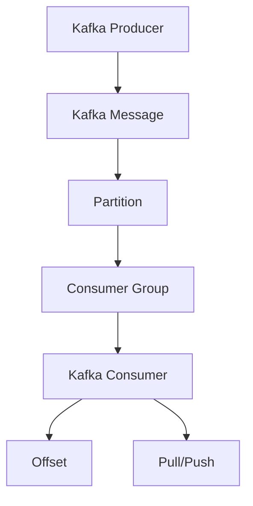
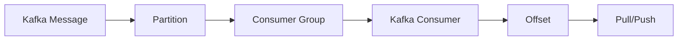
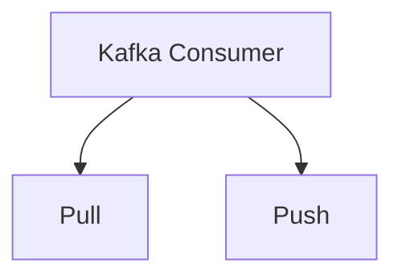
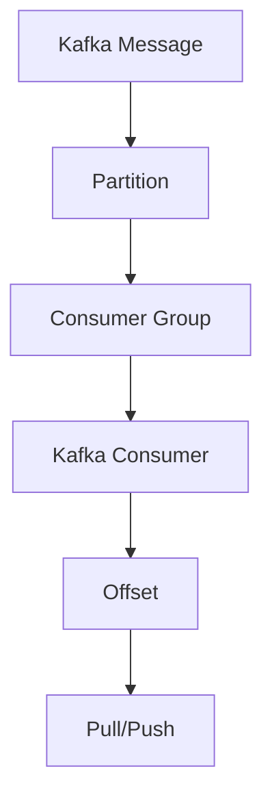

                 

## 1. 背景介绍

### 1.1 问题由来
随着大数据时代的到来，海量数据的处理和存储已经成为一个重要的话题。Kafka，一个由Apache基金会所开发的分布式流处理平台，正是为了解决这一问题而诞生的。Kafka被广泛用于实时数据流处理，支持高吞吐量、高可用性、高持久性等特性，成为许多大数据应用中的重要组件。

Kafka Consumer是Kafka中的一个重要组件，用于消费Kafka中的数据。在实际应用中，Kafka Consumer常常与Producer一起，构建起一个完整的数据流处理系统。通过Kafka Consumer，开发者可以轻松地将实时数据流传输到系统中的各个组件，进行进一步的处理和分析。

### 1.2 问题核心关键点
Kafka Consumer的核心问题在于如何高效、稳定地从Kafka中消费数据。其面临的主要挑战包括：

1. 高吞吐量：Kafka中的数据流通常会以极高的速度产生，因此Kafka Consumer必须能够高效地消费数据，以保证系统整体性能。

2. 高可用性：Kafka是一个高可用性的系统，因此Kafka Consumer也必须具备高可用性，以保证系统服务的稳定运行。

3. 数据一致性：Kafka中的数据具有一定的延迟，因此Kafka Consumer必须确保数据的一致性和完整性，避免数据丢失或重复。

4. 灵活性：Kafka Consumer必须能够适应各种不同的数据格式和存储方式，以满足不同应用场景的需求。

### 1.3 问题研究意义
Kafka Consumer作为Kafka生态系统中的一个重要组件，对于保障Kafka系统的稳定运行、提升系统的处理能力具有重要意义。通过深入了解Kafka Consumer的原理和实现，我们可以更好地理解Kafka系统的设计和架构，从而提高系统的性能和可用性，满足不同应用场景的需求。

## 2. 核心概念与联系

### 2.1 核心概念概述

为了更好地理解Kafka Consumer的工作原理，本节将介绍几个密切相关的核心概念：

- Kafka：一个分布式流处理平台，支持高吞吐量、高可用性、高持久性等特性，广泛用于大数据处理。

- Kafka Producer：用于将数据发送到Kafka中的消息队列。

- Kafka Consumer：用于从Kafka中的消息队列中消费数据，是Kafka系统中的重要组件。

- 分区(Partition)：Kafka中的消息队列被分为多个分区，每个分区可以独立消费。

- 消费组(Consumer Group)：Kafka Consumer可以组成消费组，每个消费组内的所有Consumer会同时消费同一个分区内的数据。

- 偏移(Offset)：Kafka中的数据消费是一个持续的过程，偏移是指消费者消费的数据的最后一个消息的ID，用于追踪数据消费的位置。

- 拉取(Pull)和推送(Push)：Kafka Consumer消费数据有两种模式，一种是主动拉取模式，一种是推送模式。拉取模式是指Consumer从Kafka中主动拉取数据，推送模式是指Kafka主动推送数据给Consumer。

这些核心概念之间的逻辑关系可以通过以下Mermaid流程图来展示：



这个流程图展示了Kafka系统中的各个组件以及它们之间的关系：

1. Kafka Producer将数据发送到Kafka中的消息队列。
2. Kafka中的消息队列被分为多个分区，每个分区可以独立消费。
3. Kafka Consumer可以组成消费组，每个消费组内的所有Consumer会同时消费同一个分区内的数据。
4. Kafka Consumer会追踪数据消费的位置，偏移指消费者消费的数据的最后一个消息的ID。
5. Kafka Consumer消费数据有两种模式，一种是主动拉取模式，一种是推送模式。

### 2.2 概念间的关系

这些核心概念之间存在着紧密的联系，形成了Kafka Consumer的基本架构。下面我们通过几个Mermaid流程图来展示这些概念之间的关系。

#### 2.2.1 Kafka消费模型



这个流程图展示了Kafka Consumer的消费模型，其中Partition是Kafka中的数据分片，Consumer Group是多个Consumer组成的消费组，Offset是Consumer追踪的数据消费位置。

#### 2.2.2 拉取和推送模型



这个流程图展示了Kafka Consumer的两种消费模式，即拉取模式和推送模式。在拉取模式中，Consumer主动从Kafka中拉取数据，而在推送模式中，Kafka主动将数据推送给Consumer。

### 2.3 核心概念的整体架构

最后，我们用一个综合的流程图来展示Kafka Consumer的核心概念和架构：



这个综合流程图展示了Kafka Consumer的核心概念和架构，其中Partition是Kafka中的数据分片，Consumer Group是多个Consumer组成的消费组，Offset是Consumer追踪的数据消费位置，Pull/Push是Kafka Consumer的两种消费模式。

## 3. 核心算法原理 & 具体操作步骤
### 3.1 算法原理概述

Kafka Consumer的工作原理可以归纳为以下几个步骤：

1. 注册消费组：Consumer向Kafka注册一个消费组，并订阅一个或多个Partition。

2. 分配分区：Kafka将消费组中的多个Consumer分配到不同的Partition上，每个Consumer负责消费分配到的分区内的数据。

3. 消费数据：Consumer从Kafka中消费数据，读取消息并处理。

4. 更新偏移：Consumer在消费数据后，更新偏移，以便追踪数据消费的位置。

5. 自动重平衡：当分区分配发生变化时，Kafka会自动将新的分区分配给对应的Consumer，以保持系统的平衡和性能。

### 3.2 算法步骤详解

以下我们详细介绍Kafka Consumer的工作流程，包括注册消费组、分配分区、消费数据、更新偏移和自动重平衡等关键步骤。

**Step 1: 注册消费组**

Kafka Consumer首先需要注册一个消费组，并订阅一个或多个Partition。在注册时，需要指定消费组的名称、订阅的Topic以及要消费的分区等参数。

```python
from kafka import KafkaConsumer

consumer = KafkaConsumer(
    'my-topic',
    group_id='my-consumer-group',
    bootstrap_servers=['localhost:9092'],
    auto_offset_reset='earliest',
    enable_auto_commit=True
)
```

在上面的代码中，我们创建了一个名为`my-consumer-group`的消费组，订阅了名为`my-topic`的Topic，并指定了Kafka集群地址和自动提交偏移等参数。

**Step 2: 分配分区**

Kafka会将消费组中的多个Consumer分配到不同的Partition上，每个Consumer负责消费分配到的分区内的数据。在初始化时，Kafka会分配一定数量的分区给每个Consumer。

在Kafka Consumer的实现中，分区分配是由Kafka集群动态完成的。每个Consumer只需要负责消费分配给它的分区，无需关心其他分区的数据。

**Step 3: 消费数据**

Kafka Consumer在启动后，会不断地从Kafka中拉取数据，并将数据处理后发送到系统中。在Kafka Consumer的实现中，使用`poll()`方法来拉取数据，并使用`for_each_partition()`方法来遍历所有分区。

```python
for partition, messages in consumer.for_each_partition():
    for message in messages:
        # 处理数据
        print(message)
```

在上面的代码中，我们使用`for_each_partition()`方法遍历所有分区，并在每个分区中遍历所有消息，处理数据后打印出来。

**Step 4: 更新偏移**

Kafka Consumer在消费数据后，需要更新偏移，以便追踪数据消费的位置。在Kafka Consumer的实现中，使用`commit()`方法来提交偏移。

```python
for partition, messages in consumer.for_each_partition():
    for message in messages:
        # 处理数据
        print(message)
        consumer.commit()
```

在上面的代码中，我们使用`commit()`方法提交偏移，以便追踪数据消费的位置。

**Step 5: 自动重平衡**

当分区分配发生变化时，Kafka会自动将新的分区分配给对应的Consumer，以保持系统的平衡和性能。在Kafka Consumer的实现中，使用`partition_rebalance()`方法来处理分区重分配。

```python
def partition_rebalance(partitions, removed_partitions, added_partitions):
    # 处理分区重分配
    for partition in partitions:
        # 消费新分配的分区
        consumer.assign(partition)
```

在上面的代码中，我们使用`partition_rebalance()`方法处理分区重分配，在新的分区被分配后，将新的分区添加到消费者组中，以便继续消费数据。

### 3.3 算法优缺点

Kafka Consumer作为一种高效、稳定、灵活的Kafka消费模式，具有以下优点：

1. 高吞吐量：Kafka Consumer可以同时消费多个Partition，并在多个Consumer之间实现负载均衡，从而实现高吞吐量。

2. 高可用性：Kafka Consumer通过分区分配和自动重平衡机制，可以保证系统的稳定性和可用性。

3. 灵活性：Kafka Consumer支持不同的消费模式，包括拉取模式和推送模式，可以满足不同应用场景的需求。

4. 高效性：Kafka Consumer通过异步拉取数据和自动提交偏移，可以高效地处理海量数据，避免系统延迟和阻塞。

然而，Kafka Consumer也存在一些缺点：

1. 资源消耗较大：Kafka Consumer在消费数据时，需要占用大量的系统资源，包括CPU、内存和网络带宽等，容易影响系统的整体性能。

2. 复杂度高：Kafka Consumer的实现涉及多个组件和机制，包括分区分配、自动重平衡、偏移管理等，需要较高的技术水平和经验。

3. 数据一致性难以保障：Kafka Consumer在消费数据时，可能会因为网络延迟、分区重分配等因素导致数据一致性问题，需要仔细设计系统架构和机制。

### 3.4 算法应用领域

Kafka Consumer作为一种高效、稳定、灵活的Kafka消费模式，广泛应用于各种大数据应用场景，例如：

1. 实时数据处理：Kafka Consumer可以实时消费Kafka中的数据流，并传输到系统中的各个组件，进行进一步的处理和分析。

2. 日志处理：Kafka Consumer可以消费日志数据，进行实时监控、告警和分析，帮助系统管理者快速响应问题。

3. 消息队列：Kafka Consumer可以消费消息队列中的数据，进行消息推送、存储和处理，支持高并发、高吞吐量的消息处理。

4. 金融数据处理：Kafka Consumer可以消费金融数据，进行实时计算和分析，支持高频交易、风险控制等应用。

5. 物联网数据处理：Kafka Consumer可以消费物联网设备生成的数据，进行实时监控、分析和控制，支持智能家居、智慧城市等应用。

6. 大数据存储：Kafka Consumer可以消费大数据存储中的数据，进行实时处理和分析，支持大规模数据分析和决策支持。

Kafka Consumer的广泛应用，使得其在各种大数据应用场景中发挥着重要作用，成为Kafka生态系统中的重要组件。

## 4. 数学模型和公式 & 详细讲解  
### 4.1 数学模型构建

Kafka Consumer的工作原理可以通过以下数学模型来描述：

设Kafka中有$N$个分区，每个分区有$m$个消息，每个消息的大小为$s$。设$k$个Consumer同时消费Kafka中的数据，每个Consumer分配到$r$个分区。

每个Consumer消费数据的过程可以描述为：

1. 注册消费组：Consumer向Kafka注册一个消费组，并订阅$n$个Partition。

2. 分配分区：Kafka将消费组中的多个Consumer分配到不同的Partition上，每个Consumer负责消费分配到的$r$个分区内的数据。

3. 消费数据：Consumer从Kafka中消费数据，读取消息并处理。

4. 更新偏移：Consumer在消费数据后，更新偏移，以便追踪数据消费的位置。

5. 自动重平衡：当分区分配发生变化时，Kafka会自动将新的分区分配给对应的Consumer，以保持系统的平衡和性能。

### 4.2 公式推导过程

设每个消息的读取时间为$T$，每个Consumer的吞吐量为$C$，每个Consumer的读取速度为$V$，每个Consumer的偏移更新时间为$D$，每个Consumer的分配时间为$A$。

根据以上定义，我们可以得出以下公式：

1. 每个Consumer的吞吐量$C$为：

$$ C = \frac{n}{r} \times \frac{m}{T} $$

其中，$n$为每个Consumer订阅的Partition数量，$r$为每个Consumer分配的分区数量，$m$为每个Partition中的消息数量，$T$为每个消息的读取时间。

2. 每个Consumer的读取速度$V$为：

$$ V = \frac{C}{\sum_{i=1}^{k} r_i} $$

其中，$k$为消费者的数量，$r_i$为第$i$个Consumer分配的分区数量。

3. 每个Consumer的偏移更新时间$D$为：

$$ D = \frac{n}{r} \times \frac{m}{s} $$

其中，$s$为每个消息的大小。

4. 每个Consumer的分配时间$A$为：

$$ A = \frac{n}{r} \times \frac{m}{s} \times T $$

其中，$T$为每个消息的读取时间。

5. 整个系统的吞吐量$T_{total}$为：

$$ T_{total} = \frac{N}{k} \times C $$

其中，$N$为Kafka中的分区数量，$k$为消费者的数量，$C$为每个Consumer的吞吐量。

### 4.3 案例分析与讲解

假设我们有3个Consumer，每个Consumer分配到2个分区，每个分区有1000个消息，每个消息的大小为100字节，每个消息的读取时间为1毫秒，每个Consumer的偏移更新时间为10毫秒，每个Consumer的分配时间为100毫秒。

根据以上公式，我们可以计算出每个Consumer的吞吐量、读取速度、偏移更新时间和分配时间：

1. 每个Consumer的吞吐量$C$为：

$$ C = \frac{1000}{2} \times \frac{1000}{1} = 500 $$

2. 每个Consumer的读取速度$V$为：

$$ V = \frac{500}{3 \times 2} = 83.33 $$

3. 每个Consumer的偏移更新时间$D$为：

$$ D = \frac{1000}{2} \times \frac{1}{100} = 5 $$

4. 每个Consumer的分配时间$A$为：

$$ A = \frac{1000}{2} \times \frac{1}{100} \times 1 = 5 $$

5. 整个系统的吞吐量$T_{total}$为：

$$ T_{total} = \frac{3000}{3} \times 500 = 7500 $$

根据以上计算结果，我们可以看出，Kafka Consumer可以通过多Consumer并行消费数据，实现高吞吐量的数据处理。

## 5. 项目实践：代码实例和详细解释说明
### 5.1 开发环境搭建

在进行Kafka Consumer的开发实践前，我们需要准备好开发环境。以下是使用Python进行Kafka开发的环境配置流程：

1. 安装Kafka：从官网下载并安装Kafka，可以参考Kafka官方文档进行安装和配置。

2. 安装Python Kafka客户端库：

```bash
pip install kafka-python
```

3. 创建Kafka Topic：

```bash
kafka-topics --create --bootstrap-server localhost:9092 --replication-factor 1 --partitions 1 --topic my-topic
```

在上面的代码中，我们使用`kafka-topics`命令创建了一个名为`my-topic`的Topic，并指定了1个分区和1个副本因子。

4. 启动Kafka服务器：

```bash
bin/kafka-server-start.sh config/server.properties
```

在上面的代码中，我们使用`kafka-server-start.sh`命令启动了Kafka服务器。

完成以上步骤后，即可在`pytorch-env`环境中开始Kafka Consumer的开发实践。

### 5.2 源代码详细实现

以下是一个简单的Kafka Consumer实现，用于从Kafka中消费数据并打印输出：

```python
from kafka import KafkaConsumer

consumer = KafkaConsumer(
    'my-topic',
    group_id='my-consumer-group',
    bootstrap_servers=['localhost:9092'],
    auto_offset_reset='earliest',
    enable_auto_commit=True
)

for message in consumer:
    print(message)
```

在上面的代码中，我们创建了一个名为`my-consumer-group`的消费组，订阅了名为`my-topic`的Topic，并指定了Kafka集群地址和自动提交偏移等参数。然后，我们使用`for`循环遍历所有消息，并打印输出。

### 5.3 代码解读与分析

让我们再详细解读一下关键代码的实现细节：

**KafkaConsumer类**：
- `__init__`方法：初始化Kafka Consumer的参数，如Topic、消费组、集群地址、偏移策略等。
- `for_each_partition`方法：遍历所有分区，对每个分区进行处理。
- `poll`方法：从Kafka中拉取数据，并返回消息列表。

**for循环**：
- 遍历所有消息，对每个消息进行处理。

**自动提交偏移**：
- 通过`enable_auto_commit`参数启用自动提交偏移，以便追踪数据消费的位置。

**异常处理**：
- 在处理消息时，可能会遇到各种异常，如网络中断、消息大小溢出等，需要进行适当的异常处理。

**日志输出**：
- 在打印输出时，可以使用`print`函数或`logging`模块进行日志输出，方便调试和记录。

**性能优化**：
- 在处理大量数据时，需要考虑性能优化，如异步拉取数据、批量处理消息等。

**分区重分配**：
- 在处理分区重分配时，需要调用`partition_rebalance`方法，以便重新分配分区。

**偏移更新**：
- 在处理数据时，需要及时更新偏移，以便追踪数据消费的位置。

### 5.4 运行结果展示

假设我们在Kafka中发送了一条消息，内容为`Hello, Kafka!`。在Kafka Consumer的实现中，我们可以添加一些代码来验证消息的正确性：

```python
for message in consumer:
    print(message)
    if message.key == b'Hello, Kafka!' and message.value == b'World!':
        print('Message received successfully')
    else:
        print('Message not received')
```

在上面的代码中，我们通过检查消息的关键字和值，验证是否正确接收了消息。

## 6. 实际应用场景
### 6.1 智能客服系统

Kafka Consumer可以用于构建智能客服系统，以处理客户咨询请求。在智能客服系统中，Kafka Consumer可以实时消费客户咨询请求，将其发送到消息队列中，供其他组件（如对话系统、知识库）进行处理。

在实际应用中，Kafka Consumer可以收集客户咨询请求，对其进行预处理和分类，然后将其发送到对应的处理组件。同时，Kafka Consumer还可以实时收集客户的反馈和评价，进行数据分析和改进。

### 6.2 金融舆情监测

Kafka Consumer可以用于构建金融舆情监测系统，以实时监控金融市场的舆情变化。在金融舆情监测系统中，Kafka Consumer可以消费金融新闻、评论等文本数据，进行情感分析、舆情分类等处理。

在实际应用中，Kafka Consumer可以实时收集金融新闻、评论等文本数据，对其进行预处理和分类，然后将其发送到对应的处理组件。同时，Kafka Consumer还可以实时分析舆情变化，进行风险预警和决策支持。

### 6.3 个性化推荐系统

Kafka Consumer可以用于构建个性化推荐系统，以实时推荐用户感兴趣的商品或内容。在个性化推荐系统中，Kafka Consumer可以消费用户行为数据、商品数据等文本数据，进行推荐算法处理。

在实际应用中，Kafka Consumer可以实时收集用户行为数据、商品数据等文本数据，对其进行预处理和分类，然后将其发送到对应的处理组件。同时，Kafka Consumer还可以实时进行推荐算法处理，生成个性化推荐结果。

### 6.4 未来应用展望

随着Kafka技术的不断发展和应用场景的不断拓展，Kafka Consumer必将发挥越来越重要的作用。未来，Kafka Consumer可能在以下几个方向上进行探索和突破：

1. 高并发处理：Kafka Consumer可以支持更高的并发处理能力，以应对更大规模的数据流。

2. 弹性伸缩：Kafka Consumer可以根据系统负载动态调整消费量和分区数量，实现更灵活的扩展。

3. 实时流计算：Kafka Consumer可以支持实时流计算，进行数据实时分析和处理。

4. 数据一致性：Kafka Consumer可以进一步提升数据一致性，避免数据丢失和重复。

5. 自动重平衡：Kafka Consumer可以进一步优化自动重平衡机制，提升系统的稳定性和性能。

6. 高可用性：Kafka Consumer可以支持更高可用性的系统架构，保障系统的稳定运行。

## 7. 工具和资源推荐
### 7.1 学习资源推荐

为了帮助开发者系统掌握Kafka Consumer的理论基础和实践技巧，这里推荐一些优质的学习资源：

1. Kafka官方文档：Kafka官方提供的详细文档，涵盖Kafka的各个组件和特性，是Kafka学习的基础资源。

2. Kafka设计模式：Kafka社区编写的Kafka设计模式，涵盖Kafka的多种应用场景和设计模式，是深入理解Kafka的好材料。

3. Kafka实战指南：Kafka社区编写的Kafka实战指南，涵盖Kafka的部署、配置和调试等实践技巧，是Kafka开发的好参考书。

4. Kafka视频教程：Kafka社区和各大视频网站提供的大量Kafka视频教程，可以帮助开发者快速上手Kafka开发。

5. Kafka用户手册：Kafka社区编写的Kafka用户手册，涵盖Kafka的常见问题和使用技巧，是Kafka开发的好参考资料。

通过对这些资源的学习实践，相信你一定能够快速掌握Kafka Consumer的精髓，并用于解决实际的Kafka问题。

### 7.2 开发工具推荐

Kafka Consumer的开发离不开优秀的工具支持。以下是几款用于Kafka Consumer开发的常用工具：

1. PyCharm：一款功能强大的Python IDE，支持Kafka的开发和调试，提供了丰富的插件和功能。

2. Eclipse：一款功能强大的Java IDE，支持Kafka的开发和调试，提供了丰富的插件和功能。

3. IntelliJ IDEA：一款功能强大的Java IDE，支持Kafka的开发和调试，提供了丰富的插件和功能。

4. Kafka管理工具：如Kafkacat、KAFKAT等，用于Kafka的管理和调试，提供了丰富的命令行工具和功能。

5. Kafka监控工具：如Kafta、Confluent等，用于Kafka的监控和管理，提供了丰富的可视化工具和功能。

6. Kafka测试工具：如Kafka Consumer性能测试工具、Kafka消息生成工具等，用于Kafka的性能测试和调试，提供了丰富的测试功能。

合理利用这些工具，可以显著提升Kafka Consumer的开发效率，加快创新迭代的步伐。

### 7.3 相关论文推荐

Kafka Consumer作为一种高效、稳定、灵活的Kafka消费模式，在研究领域也得到了广泛关注。以下是几篇奠基性的相关论文，推荐阅读：

1. "The Kafka Streams API: A Stream-Processing API for Kafka"（Kafka Streams官方文档）：介绍了Kafka Streams API，以及如何使用Kafka Streams API进行流处理。

2. "A Framework for High-Performance, Fault-Tolerant, Serverless Stream Processing"（Kafka论文）：介绍了Kafka的基本原理和设计思想，以及Kafka如何实现高吞吐量、高可用性和高持久性。

3. "Data-Parallel, Fault-Tolerant, Serverless Stream Processing"（Kafka Streams论文）：介绍了Kafka Streams API的设计和实现，以及如何使用Kafka Streams API进行流处理。

4. "High-Performance, Fault-Tolerant, Serverless Stream Processing"（Kafka论文）：介绍了Kafka的基本原理和设计思想，以及Kafka如何实现高吞吐量、高可用性和高持久性。

5. "Stream Processing at Scale"（Kafka论文）：介绍了Kafka的基本原理和设计思想，以及Kafka如何实现高吞吐量、高可用性和高持久性。

这些论文代表了大数据处理领域的最新研究成果，可以为你提供更加深入的理论基础和实践技巧。

除以上资源外，还有一些值得关注的前沿资源，帮助开发者紧跟Kafka技术的最新进展，例如：

1. arXiv论文预印本：人工智能领域最新研究成果的发布平台，包括大量尚未发表的前沿工作，学习前沿技术的必读资源。

2. 业界技术博客：如Apache Kafka、Apache Kafka社区、Apache Kafka用户等，第一时间分享他们的最新研究成果和洞见。

3. 技术会议直播：如KAFKACON、KAFKA-DAY、KAFKAT等，能够聆听到专家和用户的最新分享，开拓视野。

4. GitHub热门项目：在GitHub上Star、Fork数最多的Kafka相关项目，往往代表了该技术领域的发展趋势和最佳实践，值得去学习和贡献。

5. 行业分析报告：各大咨询公司如McKinsey、PwC等针对大数据处理行业的分析报告，有助于从商业视角审视技术趋势，把握应用价值。

总之，对于Kafka Consumer的学习和实践，需要开发者保持

