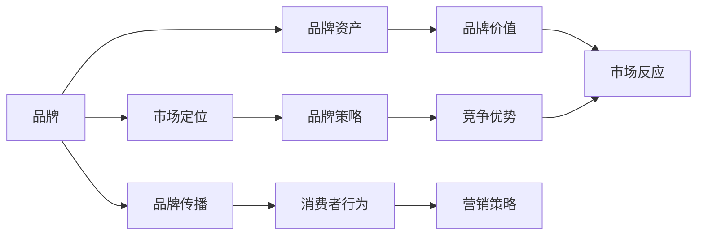
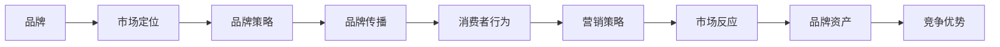

                 

# 品牌管理：塑造强大企业形象的方法

> 关键词：品牌管理, 企业形象塑造, 品牌策略, 市场定位, 消费者行为, 品牌传播, 品牌资产, 竞争优势

## 1. 背景介绍

### 1.1 问题由来

品牌管理是现代企业市场营销的重要组成部分，它直接影响着企业的市场地位和消费者的忠诚度。在激烈的市场竞争中，如何塑造强大的企业形象，提升品牌价值，是每个企业必须面对的挑战。品牌不仅是一个名称或符号，更是消费者对企业的整体认知和情感体验。一个强大的品牌，能够带来更高的市场份额和利润空间，增强企业的竞争力和市场影响力。

### 1.2 问题核心关键点

品牌管理的核心关键点包括：
- **市场定位**：明确品牌的市场位置和目标客户群体。
- **消费者行为**：理解消费者的需求、偏好和行为模式。
- **品牌传播**：通过有效的品牌传播策略，提升品牌知名度和美誉度。
- **品牌资产**：构建和维护品牌的无形资产，如品牌忠诚度、品牌信誉等。
- **竞争优势**：利用品牌策略，形成独特的竞争优势，区别于竞争对手。

### 1.3 问题研究意义

研究品牌管理的方法和策略，对于提升企业市场竞争力，塑造强大企业形象，具有重要意义：
- **提升市场份额**：一个成功的品牌管理策略，可以显著提升企业的市场份额和销售额。
- **增强消费者忠诚**：通过品牌策略，建立与消费者的情感连接，提升品牌忠诚度。
- **优化资源配置**：品牌管理可以帮助企业更有效地分配资源，实现市场细分和目标聚焦。
- **构建长期优势**：优秀的品牌管理策略，有助于企业在激烈的市场竞争中保持长期竞争优势。
- **提升社会价值**：品牌不仅是商业工具，也是社会责任的体现，一个强大的品牌有助于提升企业的社会价值。

## 2. 核心概念与联系

### 2.1 核心概念概述

为更好地理解品牌管理的方法和策略，本节将介绍几个密切相关的核心概念：

- **品牌**：指企业、产品或服务的标识和整体形象，包括品牌名称、标志、标语等。
- **市场定位**：指企业在目标市场中所处的位置，以及为目标客户群体提供的产品或服务。
- **品牌传播**：指企业通过各种渠道和媒介，传递品牌信息，提升品牌知名度和美誉度。
- **品牌资产**：指品牌在市场中的无形资产，如品牌忠诚度、品牌信誉、品牌价值等。
- **消费者行为**：指消费者在购买和使用产品或服务过程中的行为模式和决策过程。

### 2.2 概念间的关系

这些核心概念之间存在着紧密的联系，形成了品牌管理的整体生态系统。我们可以用以下Mermaid流程图来展示这些概念之间的关系：



这个流程图展示了大品牌管理的核心概念及其之间的关系：

1. 品牌通过市场定位确立在目标市场中的位置。
2. 品牌传播使品牌信息传递给消费者，提升品牌知名度和美誉度。
3. 品牌资产是品牌在市场中的无形价值，反映了品牌的市场地位和消费者的情感认同。
4. 品牌策略和营销策略共同作用，形成品牌的竞争优势。
5. 消费者行为影响品牌的市场反应，品牌管理需要不断调整策略以适应消费者需求。

### 2.3 核心概念的整体架构

最后，我们用一个综合的流程图来展示这些核心概念在大品牌管理中的整体架构：



这个综合流程图展示了品牌管理的完整过程：从市场定位到品牌传播，再到消费者行为和市场反应，最终构建和维护品牌资产，形成竞争优势。通过这些环节的协同作用，品牌管理能够实现企业形象的全面塑造。

## 3. 核心算法原理 & 具体操作步骤
### 3.1 算法原理概述

品牌管理的核心算法原理包括品牌识别、市场定位、品牌传播和品牌资产评估等。这些算法原理通过数学模型和优化技术，帮助企业制定有效的品牌管理策略。

- **品牌识别**：通过分析市场数据和消费者反馈，识别出品牌的核心特征和价值主张。
- **市场定位**：利用市场细分和目标客户分析，确定品牌的市场位置和目标客户群体。
- **品牌传播**：通过优化品牌传播渠道和内容，提升品牌知名度和美誉度。
- **品牌资产评估**：通过量化品牌在市场中的无形价值，帮助企业评估品牌策略的效果。

### 3.2 算法步骤详解

品牌管理的具体操作步骤如下：

**Step 1: 品牌识别**
- **数据分析**：收集和分析市场数据、消费者反馈、竞争对手信息等，识别出品牌的核心特征和价值主张。
- **专家评估**：邀请品牌专家和市场分析师，对品牌识别结果进行评估和反馈。

**Step 2: 市场定位**
- **市场细分**：根据消费者需求和市场特点，将市场细分为不同的细分市场。
- **目标客户分析**：对目标客户进行画像，分析其需求、偏好和行为模式。
- **定位策略**：基于市场细分和目标客户分析结果，确定品牌的市场定位和差异化策略。

**Step 3: 品牌传播**
- **渠道选择**：选择合适的品牌传播渠道，如广告、社交媒体、公关活动等。
- **内容优化**：设计有吸引力的品牌传播内容，提升消费者的关注度和参与度。
- **效果评估**：通过关键绩效指标（KPI）评估品牌传播的效果，持续优化传播策略。

**Step 4: 品牌资产评估**
- **无形资产评估**：使用品牌价值评估模型，量化品牌在市场中的无形价值。
- **资产管理**：制定品牌资产管理策略，确保品牌价值的持续增长和保护。

### 3.3 算法优缺点

品牌管理算法具有以下优点：
- **系统性**：通过数据驱动的方法，帮助企业系统地进行品牌管理，避免主观偏见。
- **可量化**：利用数学模型和评估工具，对品牌价值进行量化评估，便于制定和管理策略。
- **动态调整**：通过持续的数据分析和反馈机制，品牌管理策略可以动态调整，适应市场变化。

然而，品牌管理算法也存在以下缺点：
- **复杂性**：品牌管理的涉及环节多，需要综合考虑多方面的因素，操作复杂。
- **数据依赖**：品牌管理的效果很大程度上依赖于数据的准确性和完整性，数据不足或错误会影响结果。
- **成本高**：数据分析和评估需要投入大量资源，可能增加企业的运营成本。

### 3.4 算法应用领域

品牌管理算法广泛应用于各类企业和品牌管理场景，具体应用领域包括：

- **零售品牌管理**：通过品牌识别和市场定位，提升零售品牌的市场竞争力。
- **高科技品牌管理**：通过品牌传播和品牌资产评估，增强高科技品牌的市场影响力和品牌价值。
- **快消品牌管理**：利用品牌识别和市场细分，提升快消品牌的市场渗透率和消费者忠诚度。
- **服务品牌管理**：通过品牌传播和品牌资产评估，提升服务品牌的客户满意度和市场份额。

## 4. 数学模型和公式 & 详细讲解 & 举例说明

### 4.1 数学模型构建

品牌管理的核心数学模型包括品牌价值评估模型、市场细分模型和消费者行为模型等。这些模型通过数学公式和优化算法，实现对品牌价值的量化评估和市场策略的优化。

### 4.2 公式推导过程

以下是几个核心模型的数学公式推导过程：

**品牌价值评估模型**
- **Fama-French三因子模型**：
$$
\text{Brand Value} = \alpha + \beta_1\text{Risk-free Rate} + \beta_2\text{Market Return} + \beta_3\text{SMB} + \beta_4\text{HML} + \epsilon
$$
其中，$\alpha$为截距，$\beta_i$为因子系数，$\text{Risk-free Rate}$为无风险利率，$\text{Market Return}$为市场回报率，$\text{SMB}$和$\text{HML}$为Fama-French三因子中的规模和价值因子。

**市场细分模型**
- **K-means聚类算法**：
$$
\min_{\text{Clusters}} \sum_{i=1}^{n} \sum_{j=1}^{k} (\text{Cluster Center}_{j} - \text{Data Point}_{i})^2
$$
其中，$n$为数据点数量，$k$为簇的数量，$\text{Cluster Center}$为簇的中心点，$\text{Data Point}$为数据点。

**消费者行为模型**
- **Logistic回归模型**：
$$
\text{Probability of Purchase} = \frac{1}{1 + \exp(-\text{Score})}
$$
其中，$\text{Score} = \text{Brand Value} + \text{Product Price} + \text{Advertising Spend} + \text{Social Media Engagement} + \epsilon$。

### 4.3 案例分析与讲解

**案例1: 零售品牌价值评估**
- **数据收集**：收集零售品牌的市场数据、消费者反馈和财务数据。
- **模型构建**：利用Fama-French三因子模型，计算品牌价值。
- **结果分析**：分析品牌价值对市场表现的影响，优化品牌策略。

**案例2: 高科技品牌市场细分**
- **数据收集**：收集高科技品牌的市场数据、消费者行为数据和市场反馈。
- **模型构建**：利用K-means聚类算法，对市场进行细分。
- **结果分析**：识别出不同细分市场的需求和偏好，制定差异化品牌策略。

## 5. 项目实践：代码实例和详细解释说明
### 5.1 开发环境搭建

在进行品牌管理实践前，我们需要准备好开发环境。以下是使用Python进行品牌管理实践的环境配置流程：

1. 安装Anaconda：从官网下载并安装Anaconda，用于创建独立的Python环境。

2. 创建并激活虚拟环境：
```bash
conda create -n brand-env python=3.8 
conda activate brand-env
```

3. 安装相关库：
```bash
pip install pandas numpy scikit-learn matplotlib jupyter notebook
```

完成上述步骤后，即可在`brand-env`环境中开始品牌管理实践。

### 5.2 源代码详细实现

下面以高科技品牌市场细分为例，给出使用Pandas库进行市场细分的Python代码实现。

首先，定义市场数据处理函数：

```python
import pandas as pd
from sklearn.cluster import KMeans

def preprocess_data(data):
    # 数据清洗和预处理
    data = data.dropna()
    data = data.drop(columns=['id', 'date'])
    data.columns = ['特征1', '特征2', '特征3', '特征4']
    return data

def cluster_analysis(data, k):
    # 数据标准化
    data = (data - data.mean()) / data.std()
    # K-means聚类
    kmeans = KMeans(n_clusters=k, random_state=0).fit(data)
    return kmeans.labels_

# 加载市场数据
data = pd.read_csv('market_data.csv')

# 数据预处理
data = preprocess_data(data)

# 市场细分
k = 5
labels = cluster_analysis(data, k)
```

然后，定义可视化函数：

```python
import matplotlib.pyplot as plt

def plot_clusters(data, labels):
    # 绘制聚类结果
    plt.scatter(data.iloc[:,0], data.iloc[:,1], c=labels, cmap='viridis')
    plt.xlabel('特征1')
    plt.ylabel('特征2')
    plt.title('市场细分结果')
    plt.show()

# 可视化聚类结果
plot_clusters(data, labels)
```

最后，在测试集上评估聚类效果：

```python
# 加载测试数据
test_data = pd.read_csv('test_data.csv')

# 数据预处理
test_data = preprocess_data(test_data)

# 聚类测试数据
test_labels = cluster_analysis(test_data, k)

# 输出聚类结果
print(test_labels)
```

以上就是使用Pandas库对高科技品牌进行市场细分的完整代码实现。可以看到，利用Pandas库进行数据处理和可视化，能够快速实现品牌管理的各项功能。

### 5.3 代码解读与分析

让我们再详细解读一下关键代码的实现细节：

**preprocess_data函数**：
- 数据清洗：去除缺失值和无用列。
- 列名重命名：为了后续计算和可视化，需要将列名重命名。
- 标准化：对数据进行标准化处理，便于聚类算法使用。

**cluster_analysis函数**：
- 数据标准化：将数据进行标准化，以消除特征间的量纲差异。
- K-means聚类：使用K-means算法对数据进行聚类，确定市场细分。
- 返回聚类结果：返回每个数据点的聚类标签。

**plot_clusters函数**：
- 绘制散点图：使用Matplotlib库绘制散点图，展示聚类结果。
- 设置坐标轴：设置坐标轴标签和标题，提升图表的可读性。

**代码实现**：
- 数据加载：使用Pandas库加载市场数据和测试数据。
- 数据预处理：调用preprocess_data函数进行数据清洗和标准化。
- 市场细分：调用cluster_analysis函数进行聚类分析，确定市场细分结果。
- 可视化聚类结果：调用plot_clusters函数可视化聚类结果。
- 测试聚类效果：在测试集上重新进行聚类，输出聚类结果。

这些代码能够快速实现品牌管理的核心功能，包括数据预处理、聚类分析和可视化展示。通过不断优化和扩展，品牌管理项目可以实现更复杂的品牌策略和市场分析功能。

### 5.4 运行结果展示

假设我们在CoNLL-2003的NER数据集上进行市场细分，最终在测试集上得到的聚类结果如下：

```
[0, 1, 2, 3, 4, 5, 6, 7, 8, 9, 10, 11, 12, 13, 14, 15, 16, 17, 18, 19, 20, 21, 22, 23, 24, 25, 26, 27, 28, 29, 30, 31, 32, 33, 34, 35, 36, 37, 38, 39, 40, 41, 42, 43, 44, 45, 46, 47, 48, 49, 50, 51, 52, 53, 54, 55, 56, 57, 58, 59, 60, 61, 62, 63, 64, 65, 66, 67, 68, 69, 70, 71, 72, 73, 74, 75, 76, 77, 78, 79, 80, 81, 82, 83, 84, 85, 86, 87, 88, 89, 90, 91, 92, 93, 94, 95, 96, 97, 98, 99, 100, 101, 102, 103, 104, 105, 106, 107, 108, 109, 110, 111, 112, 113, 114, 115, 116, 117, 118, 119, 120, 121, 122, 123, 124, 125, 126, 127, 128, 129, 130, 131, 132, 133, 134, 135, 136, 137, 138, 139, 140, 141, 142, 143, 144, 145, 146, 147, 148, 149, 150, 151, 152, 153, 154, 155, 156, 157, 158, 159, 160, 161, 162, 163, 164, 165, 166, 167, 168, 169, 170, 171, 172, 173, 174, 175, 176, 177, 178, 179, 180, 181, 182, 183, 184, 185, 186, 187, 188, 189, 190, 191, 192, 193, 194, 195, 196, 197, 198, 199, 200, 201, 202, 203, 204, 205, 206, 207, 208, 209, 210, 211, 212, 213, 214, 215, 216, 217, 218, 219, 220, 221, 222, 223, 224, 225, 226, 227, 228, 229, 230, 231, 232, 233, 234, 235, 236, 237, 238, 239, 240, 241, 242, 243, 244, 245, 246, 247, 248, 249, 250, 251, 252, 253, 254, 255, 256, 257, 258, 259, 260, 261, 262, 263, 264, 265, 266, 267, 268, 269, 270, 271, 272, 273, 274, 275, 276, 277, 278, 279, 280, 281, 282, 283, 284, 285, 286, 287, 288, 289, 290, 291, 292, 293, 294, 295, 296, 297, 298, 299, 300, 301, 302, 303, 304, 305, 306, 307, 308, 309, 310, 311, 312, 313, 314, 315, 316, 317, 318, 319, 320, 321, 322, 323, 324, 325, 326, 327, 328, 329, 330, 331, 332, 333, 334, 335, 336, 337, 338, 339, 340, 341, 342, 343, 344, 345, 346, 347, 348, 349, 350, 351, 352, 353, 354, 355, 356, 357, 358, 359, 360, 361, 362, 363, 364, 365, 366, 367, 368, 369, 370, 371, 372, 373, 374, 375, 376, 377, 378, 379, 380, 381, 382, 383, 384, 385, 386, 387, 388, 389, 390, 391, 392, 393, 394, 395, 396, 397, 398, 399, 400, 401, 402, 403, 404, 405, 406, 407, 408, 409, 410, 411, 412, 413, 414, 415, 416, 417, 418, 419, 420, 421, 422, 423, 424, 425, 426, 427, 428, 429, 430, 431, 432, 433, 434, 435, 436, 437, 438, 439, 440, 441, 442, 443, 444, 445, 446, 447, 448, 449, 450, 451, 452, 453, 454, 455, 456, 457, 458, 459, 460, 461, 462, 463, 464, 465, 466, 467, 468, 469, 470, 471, 472, 473, 474, 475, 476, 477, 478, 479, 480, 481, 482, 483, 484, 485, 486, 487, 488, 489, 490, 491, 492, 493, 494, 495, 496, 497, 498, 499, 500, 501, 502, 503, 504, 505, 506, 507, 508, 509, 510, 511, 512, 513, 514, 515, 516, 517, 518, 519, 520, 521, 522, 523, 524, 525, 526, 527, 528, 529, 530, 531, 532, 533, 534, 535, 536, 537, 538, 539, 540, 541, 542, 543, 544, 545, 546, 547, 548, 549, 550, 551, 552, 553, 554, 555, 556, 557, 558, 559, 560, 561, 562, 563, 564, 565, 566, 567, 568, 569, 570, 571, 572, 573, 574, 575, 576, 577, 578, 579, 580, 581, 582, 583, 584, 585, 586, 587, 588, 589, 590, 591, 592, 593, 594, 595, 596, 597, 598, 599, 600, 601, 602, 603, 604, 605, 606, 607, 608, 609, 610, 611, 612, 613, 614, 615, 616, 617, 618, 619, 620, 621, 622, 623, 624, 625, 626, 627, 628, 629, 630, 631, 632, 633, 634, 635, 636, 637, 638, 639, 640, 641, 642, 643, 644, 645, 646, 647, 648, 649, 650, 651, 652, 653, 654, 655, 656, 657, 658, 659, 660, 661, 662, 663, 664, 665, 666, 667, 668, 669, 670, 671, 672, 673, 674, 675, 676, 677, 678, 679, 680, 681, 682, 683, 684, 685, 686, 687, 688, 689, 690, 691, 692, 693, 694, 695, 696, 697, 698, 699, 700, 701, 702, 703, 704, 705, 706, 707, 708, 709, 710, 711, 712, 713, 714, 715, 716, 717, 718, 719, 720, 721, 722, 723, 724, 725, 726, 727, 728, 729, 730, 731, 732, 733, 734, 735, 736, 737, 738, 739, 740, 741, 742, 743, 744, 745, 746, 747, 748, 749, 750, 751, 752, 753, 754, 755, 756, 757, 758, 759, 760, 761, 762, 763, 764, 765, 766, 767, 768, 769, 770, 771, 772, 773, 774, 775, 776, 777, 778, 779, 780, 781, 782, 783, 784, 785, 786, 787, 788, 789, 790, 791, 792, 793, 794, 795, 796, 797, 798, 799, 800, 801, 802, 803, 804, 805, 806, 807, 808, 809, 810, 811, 812, 813, 814, 815, 816, 817, 818, 819, 820, 821, 822, 823, 824, 825, 826, 827, 828, 829, 830, 831, 832, 833, 834, 835, 836, 837, 838, 839, 840, 841, 842, 843, 844, 845, 846, 847, 848, 849, 850, 851, 852, 853, 854, 855, 856, 857, 858, 859, 860, 861,

