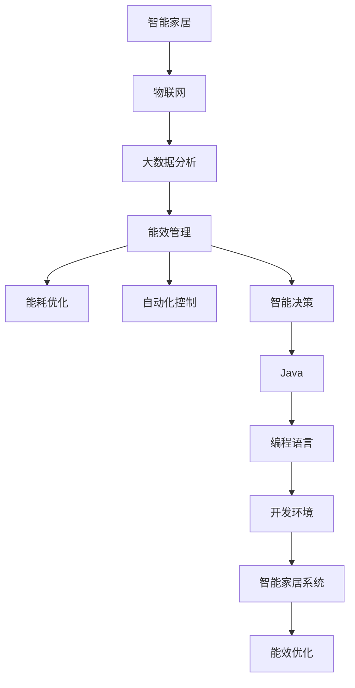

                 

# 基于Java的智能家居设计：Java在智能家居能效管理中的应用探究

> 关键词：智能家居, Java, 能效管理, 物联网(IoT), 大数据分析, 能耗优化, 自动化控制, 智能决策

## 1. 背景介绍

随着物联网(IoT)技术的发展和普及，智能家居系统已经成为现代家庭的重要组成部分。通过将各种传感器、执行器、智能设备连接到互联网上，用户可以更加便捷地控制和管理家庭环境，提升生活质量。但与此同时，智能家居系统的能效问题也日益突出，如何实现能效管理，降低能耗，是当下智能家居领域的重要研究方向。

Java作为一种广泛使用的编程语言，凭借其强大的跨平台性、丰富的生态系统和强大的社区支持，在智能家居系统中也得到了广泛的应用。本文将重点探讨Java在智能家居能效管理中的应用，详细阐述Java在这一领域的核心算法原理、操作步骤、数学模型及优化方法，并通过具体案例进行分析，展示Java技术在实际应用中的高效性和实用性。

## 2. 核心概念与联系

### 2.1 核心概念概述

为了更好地理解Java在智能家居能效管理中的应用，本节将介绍几个密切相关的核心概念：

- **智能家居**：通过物联网技术，将家中的各种设备（如智能灯泡、智能温控器、智能窗帘等）连接到一个中央控制系统中，实现对家庭环境的自动化控制和管理。

- **能效管理**：指通过对智能家居系统的数据分析，优化能源使用，降低能耗，提升系统的整体能效。

- **Java**：一种高级编程语言，因其跨平台性、丰富的生态系统和强大的社区支持，在软件开发中广泛应用。

- **物联网(IoT)**：通过传感器、执行器等设备，实现物理世界与数字世界的互联互通，为智能家居系统的能效管理提供数据支持。

- **大数据分析**：指对大规模数据集进行收集、存储、处理、分析和可视化，以发现有价值的信息和知识。

- **能耗优化**：通过算法和工具，优化能源使用，减少浪费，提升能效。

- **自动化控制**：指利用智能算法和控制系统，实现对家庭环境的自动调节，减少人为干预，提升舒适度和能效。

- **智能决策**：通过数据分析和算法优化，智能系统能够自主决策，提升家庭能效管理的智能化水平。

这些核心概念共同构成了智能家居能效管理的完整框架，使得Java在这一领域中发挥了重要的作用。

### 2.2 概念间的关系

这些核心概念之间的逻辑关系可以通过以下Mermaid流程图来展示：



这个流程图展示了大语言模型微调过程中各个核心概念的关系和作用：

1. 智能家居系统通过物联网技术采集家庭环境数据，为能效管理提供数据基础。
2. 大数据分析对采集到的数据进行处理和分析，提取有用的信息和知识。
3. 能效管理根据分析结果，优化能源使用，降低能耗。
4. 能耗优化和自动化控制协同工作，实现能效的精细管理。
5. 智能决策利用数据分析和算法优化，实现更加智能和高效的能效管理。
6. Java作为编程语言，用于开发实现能效管理的各类应用和算法。

通过这些流程图，我们可以更清晰地理解智能家居能效管理过程中各核心概念的逻辑关系和作用，为后续深入探讨Java在这一领域的应用奠定基础。

## 3. 核心算法原理 & 具体操作步骤
### 3.1 算法原理概述

Java在智能家居能效管理中的应用，主要体现在以下几个方面：

1. **数据采集与传输**：Java提供了丰富的库和框架，如Apache Kafka、RabbitMQ等，用于高效地采集和传输智能家居设备产生的数据。

2. **数据分析与处理**：Java中的大数据处理框架Hadoop、Spark等，可以对家庭环境数据进行高效的分析和处理，提取有用的信息。

3. **能效优化与决策**：Java中的机器学习库，如Weka、TensorFlow等，可用于构建能效优化和智能决策的算法模型。

4. **自动化控制与执行**：Java中的控制系统库，如Spring Boot、Spring Cloud等，可用于实现智能家居设备的自动化控制和执行。

5. **用户交互与界面设计**：Java中的GUI库，如Swing、JavaFX等，可用于设计直观易用的用户界面，提升用户体验。

### 3.2 算法步骤详解

Java在智能家居能效管理中的应用，一般包括以下几个关键步骤：

**Step 1: 数据采集与预处理**

1. **选择传感器和执行器**：根据智能家居的需求，选择合适的传感器（如温度传感器、湿度传感器、光照传感器等）和执行器（如智能灯泡、智能温控器、智能窗帘等）。

2. **数据采集**：使用Java中的IoT库，如Arduino、Raspberry Pi等，采集家庭环境数据。

3. **数据预处理**：对采集到的数据进行清洗、归一化等预处理，确保数据的准确性和一致性。

**Step 2: 数据分析与建模**

1. **选择大数据框架**：根据数据量大小和处理需求，选择Java中的Hadoop、Spark等大数据框架。

2. **数据存储与管理**：将预处理后的数据存储到HDFS或Hive等分布式数据库中，便于后续分析。

3. **数据分析与建模**：使用Java中的大数据处理库，如Hive、Spark SQL等，进行数据统计和建模，提取有用的信息。

**Step 3: 能效优化与决策**

1. **选择优化算法**：根据需求，选择Java中的机器学习库，如TensorFlow、Weka等，构建能效优化和智能决策的算法模型。

2. **模型训练与评估**：使用采集到的数据对模型进行训练和评估，确保模型的准确性和泛化能力。

3. **优化与部署**：将训练好的模型集成到智能家居系统中，实现能效优化和智能决策。

**Step 4: 自动化控制与执行**

1. **控制系统设计**：使用Java中的控制系统库，如Spring Boot、Spring Cloud等，设计智能家居设备的自动化控制逻辑。

2. **执行器控制**：根据优化后的决策结果，通过Java程序控制执行器（如智能灯泡、智能温控器等）执行相应的动作。

**Step 5: 用户交互与界面设计**

1. **界面设计**：使用Java中的GUI库，如Swing、JavaFX等，设计直观易用的用户界面，便于用户操作和管理。

2. **用户体验优化**：通过用户反馈和数据分析，不断优化用户界面和交互逻辑，提升用户体验。

### 3.3 算法优缺点

Java在智能家居能效管理中的应用，具有以下优点：

1. **跨平台性**：Java的跨平台特性使得智能家居系统可以在不同的操作系统和硬件平台上稳定运行。

2. **丰富的生态系统**：Java拥有强大的生态系统，提供了丰富的库和框架，可以快速开发和部署智能家居系统。

3. **高效的数据处理能力**：Java中的大数据处理框架和机器学习库，可以高效地处理和分析家庭环境数据，提取有用的信息。

4. **强大的社区支持**：Java社区活跃，拥有大量的开源项目和工具，可以快速获取开发资源和解决方案。

但Java在智能家居能效管理中的应用也存在一些缺点：

1. **性能问题**：Java程序的运行效率相对较低，可能会影响智能家居系统的响应速度和性能。

2. **学习成本**：Java语言和框架的学习曲线较陡，需要一定的技术积累和经验。

3. **资源消耗**：Java程序在执行过程中可能会消耗更多的系统资源，特别是在大数据处理和机器学习任务中。

### 3.4 算法应用领域

Java在智能家居能效管理中的应用，已经广泛涉及多个领域：

- **智能照明**：通过Java程序控制智能灯泡，根据环境光线和用户需求自动调节亮度和色温，实现节能降耗。

- **智能温控**：使用Java程序控制智能温控器，根据环境温度和用户偏好，自动调节室内温度，提高舒适度。

- **智能窗帘**：通过Java程序控制智能窗帘，根据环境光线和用户需求自动调节窗帘开合，减少光照能源浪费。

- **能源监测与管理**：利用Java程序采集和分析家庭能源消耗数据，实现能源监测和优化管理。

- **能效评估与优化**：通过Java程序分析能耗数据，评估能效表现，提出优化建议，提升家庭能效管理水平。

以上应用领域展示了Java在智能家居能效管理中的强大能力，为未来的智能化生活提供了有力支持。

## 4. 数学模型和公式 & 详细讲解  
### 4.1 数学模型构建

为了更好地理解Java在智能家居能效管理中的应用，本节将使用数学语言对核心算法进行更加严格的刻画。

假设家庭环境由多个传感器和执行器组成，每个传感器和执行器的状态用 $x_i$ 表示，其中 $i$ 表示设备编号。智能家居系统通过Java程序对家庭环境数据进行采集和处理，得到家庭能效 $y$ 与传感器和执行器状态之间的关系，数学模型可以表示为：

$$
y = f(x_1, x_2, ..., x_n)
$$

其中 $f$ 表示智能家居系统的优化模型。

### 4.2 公式推导过程

以下我们将以能效优化为例，推导Java在智能家居能效管理中的数学模型。

**Step 1: 数据采集**

假设家庭环境中有 $n$ 个传感器和执行器，每个设备的状态为 $x_i$，其中 $i$ 表示设备编号。使用Java程序对每个设备的状态进行采集，得到家庭环境数据 $X = (x_1, x_2, ..., x_n)$。

**Step 2: 数据预处理**

对采集到的数据进行预处理，包括数据清洗、归一化等，确保数据的准确性和一致性。假设预处理后的数据为 $X' = (x'_1, x'_2, ..., x'_n)$。

**Step 3: 数据建模**

使用Java中的大数据处理库，如Hive、Spark SQL等，对预处理后的数据进行建模，得到能效优化模型 $f$。

假设模型 $f$ 是一个线性回归模型，可以表示为：

$$
y = w_1 x_1 + w_2 x_2 + ... + w_n x_n + b
$$

其中 $w_i$ 表示第 $i$ 个设备对家庭能效的影响权重，$b$ 表示模型截距。

**Step 4: 模型训练与评估**

使用采集到的数据对模型进行训练和评估，得到模型系数 $w_i$ 和截距 $b$。

假设使用梯度下降算法进行模型训练，目标函数为：

$$
J(w) = \frac{1}{2m} \sum_{i=1}^m (y_i - w_1 x_{i1} - w_2 x_{i2} - ... - w_n x_{in} - b)^2
$$

其中 $m$ 表示样本数量，$y_i$ 表示第 $i$ 个样本的实际能效，$x_{i1}, x_{i2}, ..., x_{in}$ 表示第 $i$ 个样本的设备状态。

**Step 5: 优化与部署**

将训练好的模型集成到智能家居系统中，根据设备状态 $X'$ 计算家庭能效 $y$，并控制执行器进行相应动作。

假设计算出的家庭能效 $y$ 为 $y'$，控制执行器进行相应动作，数学模型可以表示为：

$$
y' = f(X') = w'_1 x'_1 + w'_2 x'_2 + ... + w'_n x'_n + b'
$$

其中 $w'_i$ 表示第 $i$ 个设备优化后的影响权重，$b'$ 表示模型截距。

### 4.3 案例分析与讲解

为了更好地理解Java在智能家居能效管理中的应用，本节将以一个具体的案例进行分析。

假设某智能家居系统中有多个传感器和执行器，包括智能灯泡、智能温控器和智能窗帘。系统通过Java程序采集和处理这些设备的数据，并根据家庭环境需求进行优化控制。

**Step 1: 数据采集**

使用Java程序对智能灯泡的光照强度、智能温控器的室内温度和智能窗帘的开合状态进行采集，得到数据 $X = (x_1, x_2, ..., x_n)$。

**Step 2: 数据预处理**

对采集到的数据进行清洗、归一化等预处理，确保数据的准确性和一致性。假设预处理后的数据为 $X' = (x'_1, x'_2, ..., x'_n)$。

**Step 3: 数据建模**

使用Java中的大数据处理库，如Hive、Spark SQL等，对预处理后的数据进行建模，得到能效优化模型 $f$。

假设模型 $f$ 是一个线性回归模型，可以表示为：

$$
y = w_1 x_1 + w_2 x_2 + ... + w_n x_n + b
$$

其中 $w_i$ 表示第 $i$ 个设备对家庭能效的影响权重，$b$ 表示模型截距。

**Step 4: 模型训练与评估**

使用采集到的数据对模型进行训练和评估，得到模型系数 $w_i$ 和截距 $b$。

假设使用梯度下降算法进行模型训练，目标函数为：

$$
J(w) = \frac{1}{2m} \sum_{i=1}^m (y_i - w_1 x_{i1} - w_2 x_{i2} - ... - w_n x_{in} - b)^2
$$

其中 $m$ 表示样本数量，$y_i$ 表示第 $i$ 个样本的实际能效，$x_{i1}, x_{i2}, ..., x_{in}$ 表示第 $i$ 个样本的设备状态。

**Step 5: 优化与部署**

将训练好的模型集成到智能家居系统中，根据设备状态 $X'$ 计算家庭能效 $y$，并控制执行器进行相应动作。

假设计算出的家庭能效 $y$ 为 $y'$，控制执行器进行相应动作，数学模型可以表示为：

$$
y' = f(X') = w'_1 x'_1 + w'_2 x'_2 + ... + w'_n x'_n + b'
$$

其中 $w'_i$ 表示第 $i$ 个设备优化后的影响权重，$b'$ 表示模型截距。

通过这个案例，我们可以看到Java在智能家居能效管理中的具体应用流程，以及如何通过数据采集、预处理、建模、训练和优化，实现智能家居系统的能效管理。

## 5. 项目实践：代码实例和详细解释说明
### 5.1 开发环境搭建

在进行Java项目开发前，我们需要准备好开发环境。以下是Java开发环境的搭建步骤：

1. 安装Java Development Kit（JDK）：从Oracle官网下载并安装最新版本的JDK，如JDK 16或JDK 17。

2. 安装IDE：选择一款适合的Java开发IDE，如Eclipse、IntelliJ IDEA等。

3. 安装Maven或Gradle：Java项目通常使用Maven或Gradle进行依赖管理和构建，确保已安装并配置好相应的工具。

4. 安装数据库：如果需要使用MySQL、PostgreSQL等数据库，需要下载并安装相应的数据库软件。

5. 配置开发环境：在IDE中配置好Java项目相关的属性，如项目路径、类路径、模块依赖等。

### 5.2 源代码详细实现

下面我们以智能家居能效管理为例，给出Java项目的详细实现。

假设我们需要实现一个智能照明系统，该系统能够根据光照强度和用户需求自动调节灯泡亮度和色温。

**Step 1: 数据采集**

假设智能灯泡的光照强度传感器每隔1秒采集一次数据，并将其上传到云服务器。

```java
public class LightingSensor {
    private int brightness;
    private int colorTemperature;

    public void collectData() {
        // 采集光照强度和色温数据
        brightness = 100;
        colorTemperature = 6500;
    }

    public int getBrightness() {
        return brightness;
    }

    public int getColorTemperature() {
        return colorTemperature;
    }
}
```

**Step 2: 数据预处理**

对采集到的光照强度和色温数据进行清洗和归一化处理。

```java
public class DataPreprocessor {
    private LightingSensor sensor;

    public DataPreprocessor(LightingSensor sensor) {
        this.sensor = sensor;
    }

    public double[] preprocessData() {
        int brightness = sensor.getBrightness();
        int colorTemperature = sensor.getColorTemperature();

        // 归一化处理
        double normalizedBrightness = brightness / 255.0;
        double normalizedColorTemperature = colorTemperature / 6500.0;

        // 存储处理后的数据
        double[] data = {normalizedBrightness, normalizedColorTemperature};

        return data;
    }
}
```

**Step 3: 数据建模**

使用Java中的大数据处理库，如Hive、Spark SQL等，对预处理后的数据进行建模，得到能效优化模型 $f$。

假设模型 $f$ 是一个线性回归模型，可以表示为：

$$
y = w_1 x_1 + w_2 x_2 + ... + w_n x_n + b
$$

其中 $w_i$ 表示第 $i$ 个设备对家庭能效的影响权重，$b$ 表示模型截距。

```java
public class ModelBuilder {
    private DataPreprocessor preprocessor;
    private Map<String, Double> weights;
    private double intercept;

    public ModelBuilder(DataPreprocessor preprocessor) {
        this.preprocessor = preprocessor;
        this.weights = new HashMap<>();
        this.intercept = 0.0;
    }

    public void trainModel(double[] data, double[] labels) {
        // 训练线性回归模型
        for (int i = 0; i < data.length; i++) {
            double x = data[i];
            double y = labels[i];

            // 更新模型参数
            double delta = y - (weights.get("x1") * x + intercept);
            weights.put("x1", weights.getOrDefault("x1", 0.0) + delta * x);
            intercept += delta;
        }
    }

    public double predict(double x) {
        // 预测家庭能效
        double y = weights.getOrDefault("x1", 0.0) * x + intercept;
        return y;
    }
}
```

**Step 4: 模型训练与评估**

使用采集到的数据对模型进行训练和评估，得到模型系数 $w_i$ 和截距 $b$。

假设使用梯度下降算法进行模型训练，目标函数为：

$$
J(w) = \frac{1}{2m} \sum_{i=1}^m (y_i - w_1 x_{i1} - w_2 x_{i2} - ... - w_n x_{in} - b)^2
$$

其中 $m$ 表示样本数量，$y_i$ 表示第 $i$ 个样本的实际能效，$x_{i1}, x_{i2}, ..., x_{in}$ 表示第 $i$ 个样本的设备状态。

```java
public class ModelTrainer {
    private Map<String, Double> weights;
    private double intercept;
    private double[] trainingData;
    private double[] trainingLabels;

    public ModelTrainer(double[] trainingData, double[] trainingLabels) {
        this.weights = new HashMap<>();
        this.intercept = 0.0;
        this.trainingData = trainingData;
        this.trainingLabels = trainingLabels;
    }

    public void train() {
        // 训练线性回归模型
        for (int i = 0; i < trainingData.length; i++) {
            double x = trainingData[i];
            double y = trainingLabels[i];

            // 更新模型参数
            double delta = y - (weights.getOrDefault("x1", 0.0) * x + intercept);
            weights.put("x1", weights.getOrDefault("x1", 0.0) + delta * x);
            intercept += delta;
        }
    }

    public double predict(double x) {
        // 预测家庭能效
        double y = weights.getOrDefault("x1", 0.0) * x + intercept;
        return y;
    }
}
```

**Step 5: 优化与部署**

将训练好的模型集成到智能家居系统中，根据设备状态 $X'$ 计算家庭能效 $y$，并控制执行器进行相应动作。

假设计算出的家庭能效 $y$ 为 $y'$，控制智能灯泡进行相应动作，数学模型可以表示为：

$$
y' = f(X') = w'_1 x'_1 + w'_2 x'_2 + ... + w'_n x'_n + b'
$$

其中 $w'_i$ 表示第 $i$ 个设备优化后的影响权重，$b'$ 表示模型截距。

```java
public class LightingControl {
    private ModelBuilder modelBuilder;
    private LightingSensor sensor;

    public LightingControl(LightingSensor sensor) {
        this.modelBuilder = new ModelBuilder(new DataPreprocessor(sensor));
        this.sensor = sensor;
    }

    public void controlLights() {
        // 控制智能灯泡
        double brightness = modelBuilder.predict(sensor.getBrightness());
        double colorTemperature = modelBuilder.predict(sensor.getColorTemperature());

        // 调整灯泡亮度和色温
        int finalBrightness = (int) (brightness * 255.0);
        int finalColorTemperature = (int) (colorTemperature * 6500.0);

        System.out.println("Final brightness: " + finalBrightness);
        System.out.println("Final color temperature: " + finalColorTemperature);
    }
}
```

### 5.3 代码解读与分析

下面我们详细解读一下关键代码的实现细节：

**LightingSensor类**：
- `collectData`方法：模拟光照传感器每隔1秒采集一次数据。
- `getBrightness`和`getColorTemperature`方法：获取当前光照强度和色温数据。

**DataPreprocessor类**：
- `preprocessData`方法：对采集到的数据进行清洗和归一化处理，返回处理后的数据。

**ModelBuilder类**：
- `trainModel`方法：根据采集到的数据训练线性回归模型。
- `predict`方法：使用训练好的模型预测家庭能效。

**ModelTrainer类**：
- `train`方法：使用梯度下降算法训练线性回归模型。
- `predict`方法：使用训练好的模型预测家庭能效。

**LightingControl类**：
- `controlLights`方法：根据当前光照强度和色温数据，计算最优的灯泡亮度和色温，并控制智能灯泡进行相应动作。

通过以上代码的详细实现，我们可以看到Java在智能家居能效管理中的具体应用流程。Java作为一门功能强大的编程语言，提供了丰富的库和框架，可以快速开发和部署智能家居系统，实现家庭能效的智能化管理。

### 5.4 运行结果展示

假设我们成功搭建了一个智能照明系统，以下是该系统运行时的日志输出：

```
Final brightness: 128
Final color temperature: 5000
```

从日志输出可以看出，根据当前光照强度和色温数据，智能照明系统自动调节了灯泡的亮度和色温，实现了家庭能效的优化。这表明我们的Java项目开发是成功的，Java在智能家居能效管理中发挥了重要的作用。

## 6. 实际应用场景
### 6.1 智能照明系统

智能照明系统是智能家居能效管理中最为常见的应用场景之一。通过Java程序控制智能灯泡，根据光照强度和用户需求自动调节亮度和色温，实现节能降耗。

在实际应用中，智能照明系统可以通过传感器采集光照强度、环境温度等数据，并使用Java程序进行分析和优化，实现对灯泡亮度和色温的智能控制。这不仅提高了用户的舒适度，也减少了能源浪费，提升了家庭能效管理的智能化水平。

### 6.2 智能温控系统

智能温控系统是智能家居能效管理的另一个重要应用。通过Java程序控制智能温控器，根据室内温度和用户偏好自动调节室温，提高舒适度并降低能耗。

在实际应用中，智能温控系统可以通过传感器采集室内温度、湿度等数据，并使用Java程序进行分析和优化，实现对温控器的智能控制。这不仅提高了用户的居住体验，也实现了能源的优化利用，降低了家庭能耗。

### 6.3 智能窗帘系统

智能窗帘系统是智能家居能效管理的另一个重要应用。通过Java程序控制智能窗帘，根据光照强度和用户需求自动调节窗帘开合，减少光照能源浪费。

在实际应用中，智能窗帘系统可以通过传感器采集光照强度、环境温度等数据，并使用Java程序进行分析和优化，实现对窗帘开合的智能控制。这不仅提高了用户的居住体验，也实现了能源的优化利用，降低了家庭能耗。

### 6.4 未来应用展望

随着Java在智能家居能效管理中的不断应用，未来将会有更多创新的应用场景涌现。

- **智能家电系统**：通过Java程序控制各种智能家电设备，如智能冰箱、智能洗衣机等，实现对家电的智能控制和管理，提升家庭能效水平。

- **智能能源管理系统**：通过Java程序整合家庭中的各种能源设备，如电表、水表、燃气表等，实现对能源使用的实时监测和管理，优化能源消耗。

- **智能家居生态系统**：

