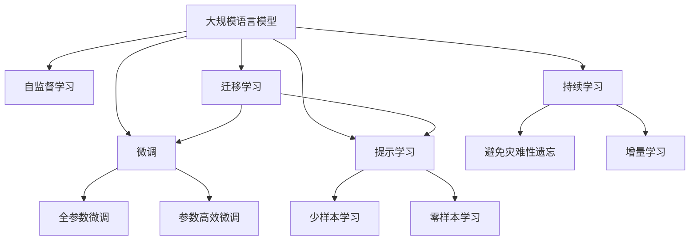
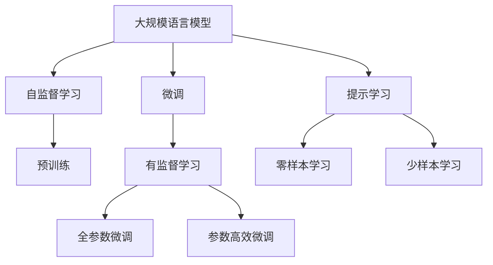
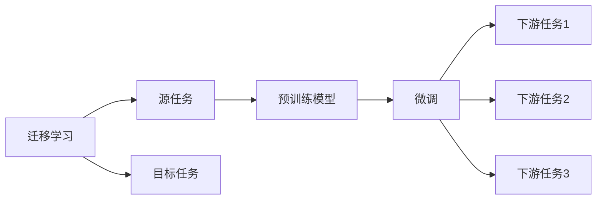
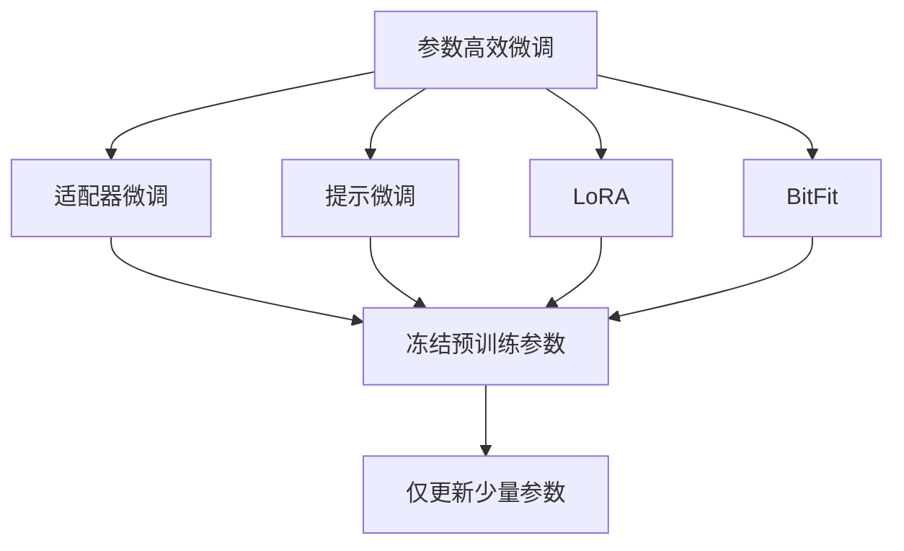
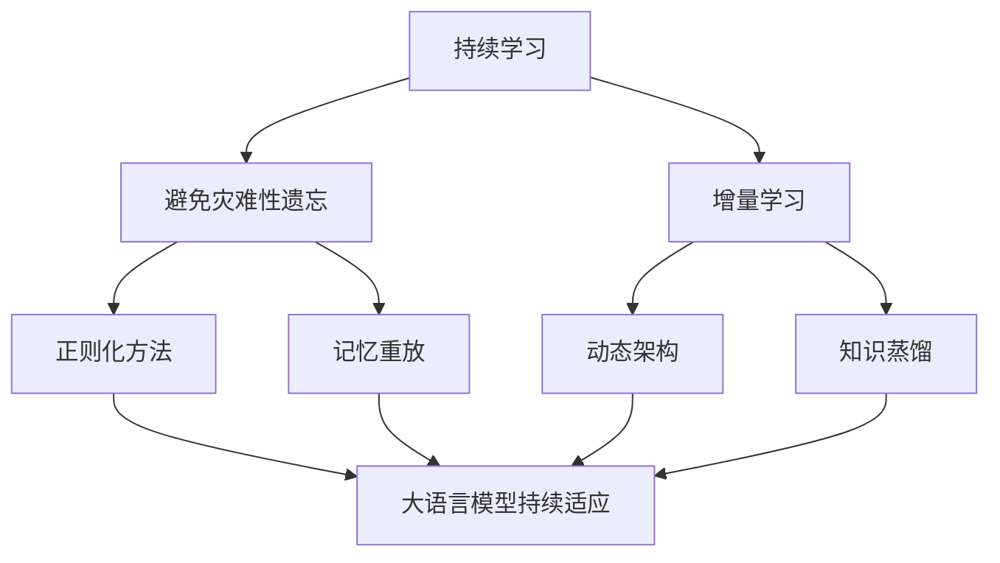
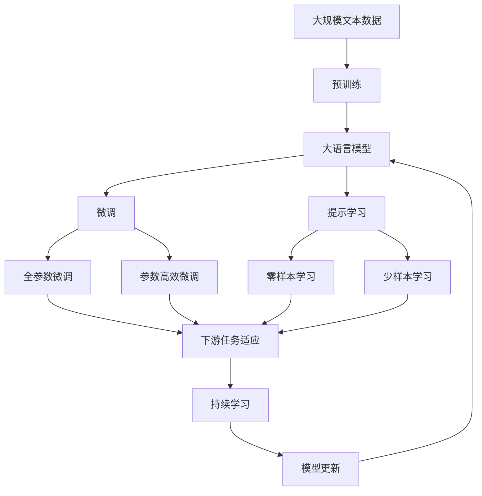

                 

# 大语言模型原理基础与前沿 基于数据的策略

## 1. 背景介绍

### 1.1 问题由来
近年来，深度学习在语言处理领域取得了显著进展，其中基于数据的策略在大规模语言模型（Large Language Models, LLMs）的训练和微调中发挥了关键作用。通过从海量文本数据中提取知识，这些模型在理解和生成自然语言方面展现了巨大的潜力。本文将深入探讨大语言模型的原理基础，并介绍当前前沿的技术和策略，特别是在基于数据的方法上的应用。

### 1.2 问题核心关键点
大语言模型的核心在于其对大规模文本数据的自监督学习。训练过程中，模型通过预测缺失的文本片段或者识别错误，不断调整自身的参数。在微调过程中，模型通过少量有标签数据进行有监督学习，以适应特定的下游任务，如问答、文本分类、机器翻译等。本文将聚焦于大语言模型的基础原理和微调策略，为读者提供深入的分析和实践指南。

### 1.3 问题研究意义
研究大语言模型的基础原理和前沿技术，对于拓展其应用范围、提升模型性能、加速NLP技术的产业化进程具有重要意义。通过系统的学习和理解，开发者可以更好地设计和优化模型，以应对各种实际应用场景。此外，深入了解这些技术还可以促进学术界和工业界的交叉合作，推动语言处理技术的创新和进步。

## 2. 核心概念与联系

### 2.1 核心概念概述

为更好地理解大语言模型的原理和前沿技术，本节将介绍几个核心概念及其相互联系：

- **大规模语言模型**（Large Language Models）：使用深度学习技术，在大量文本数据上预训练得到的模型，能够处理复杂的自然语言任务，如生成、分类、翻译等。
- **自监督学习**（Self-Supervised Learning）：一种无监督学习方法，通过利用数据自身的结构和模式进行训练，无需人工标注。
- **微调**（Fine-Tuning）：在预训练模型的基础上，通过有标签数据进行微调，使其适应特定的下游任务。
- **迁移学习**（Transfer Learning）：将预训练模型在一种任务上学习到的知识迁移到另一种任务中，以提高新任务的表现。
- **参数高效微调**（Parameter-Efficient Fine-Tuning）：在微调过程中只更新少量模型参数，以减少计算资源消耗。
- **提示学习**（Prompt Learning）：通过精心设计输入格式，引导模型输出特定结果，减少微调所需的参数和数据。
- **少样本学习**（Few-shot Learning）：在仅有少量样本的情况下，模型仍能获得良好的性能。
- **零样本学习**（Zero-shot Learning）：模型从未见过的数据上也能进行有效的推理和生成。

这些概念之间的联系可以通过以下Mermaid流程图来展示：



这个流程图展示了从预训练到微调，再到持续学习的完整过程，以及各个概念之间的联系。

### 2.2 概念间的关系

这些核心概念之间的关系紧密，共同构成了大语言模型的学习和应用框架。下面我们通过几个Mermaid流程图来展示这些概念之间的关系。

#### 2.2.1 大语言模型的学习范式



这个流程图展示了从预训练到微调的整个过程，以及微调过程的不同策略。

#### 2.2.2 迁移学习与微调的关系



这个流程图展示了迁移学习的基本原理，以及它与微调的关系。

#### 2.2.3 参数高效微调方法



这个流程图展示了几种常见的参数高效微调方法，包括适配器微调、提示微调、LoRA和BitFit。

#### 2.2.4 持续学习在大语言模型中的应用



这个流程图展示了持续学习在大语言模型中的应用，包括避免灾难性遗忘和增量学习等技术。

### 2.3 核心概念的整体架构

最后，我们用一个综合的流程图来展示这些核心概念在大语言模型微调过程中的整体架构：



这个综合流程图展示了从预训练到微调，再到持续学习的完整过程。通过这些流程图，我们可以更清晰地理解大语言模型微调过程中各个核心概念的关系和作用。

## 3. 核心算法原理 & 具体操作步骤

### 3.1 算法原理概述

基于数据的策略是大语言模型微调的核心。在微调过程中，模型通过有标签数据进行有监督学习，以适应特定的下游任务。这种策略通常包括：

- **任务适配层设计**：在预训练模型的顶层设计合适的输出层和损失函数，以适应特定的下游任务。
- **优化器选择与参数更新**：选择合适的优化器（如AdamW、SGD等），设置学习率、批大小、迭代轮数等参数，以最小化损失函数。
- **正则化技术应用**：使用L2正则、Dropout、Early Stopping等技术，防止模型过拟合。
- **数据增强**：通过改写、回译等方式增加训练集多样性，提高模型的泛化能力。
- **对抗训练**：引入对抗样本，提高模型的鲁棒性。
- **提示学习**：通过精心设计输入格式，引导模型输出特定结果，减少微调所需的参数和数据。

### 3.2 算法步骤详解

基于数据的策略的大语言模型微调步骤主要包括：

1. **准备预训练模型和数据集**：选择合适的预训练模型，准备下游任务的标注数据集。
2. **添加任务适配层**：根据任务类型，在预训练模型的顶层添加适当的输出层和损失函数。
3. **设置微调超参数**：选择合适的优化器及其参数，如学习率、批大小、迭代轮数等。
4. **执行梯度训练**：将训练集数据分批次输入模型，前向传播计算损失函数，反向传播计算参数梯度，根据优化算法和学习率更新模型参数。
5. **周期性验证**：在验证集上评估模型性能，根据性能指标决定是否触发Early Stopping。
6. **测试和部署**：在测试集上评估微调后模型性能，集成到实际应用系统中，持续收集新数据，定期重新微调模型。

### 3.3 算法优缺点

基于数据的策略具有以下优点：

- **简单高效**：仅需少量标注数据，即可对预训练模型进行快速适配。
- **通用适用**：适用于各种NLP下游任务，包括分类、匹配、生成等，只需设计合适的任务适配层即可。
- **参数高效**：利用参数高效微调方法，在固定大部分预训练参数的情况下，仍可取得不错的提升。
- **效果显著**：在学术界和工业界的许多任务上，基于微调的方法已刷新了最先进的性能指标。

同时，该方法也存在一些局限性：

- **依赖标注数据**：微调的效果很大程度上取决于标注数据的质量和数量，获取高质量标注数据的成本较高。
- **迁移能力有限**：当目标任务与预训练数据的分布差异较大时，微调的性能提升有限。
- **负面效果传递**：预训练模型的固有偏见、有害信息等，可能通过微调传递到下游任务，造成负面影响。
- **可解释性不足**：微调模型的决策过程通常缺乏可解释性，难以对其推理逻辑进行分析和调试。

尽管存在这些局限性，但就目前而言，基于数据的策略仍是大语言模型应用的最主流范式。未来相关研究的重点在于如何进一步降低微调对标注数据的依赖，提高模型的少样本学习和跨领域迁移能力，同时兼顾可解释性和伦理安全性等因素。

### 3.4 算法应用领域

基于数据的策略在大语言模型中的应用已经非常广泛，涵盖各种NLP任务，例如：

- **文本分类**：如情感分析、主题分类、意图识别等。通过微调使模型学习文本-标签映射。
- **命名实体识别**：识别文本中的人名、地名、机构名等特定实体。通过微调使模型掌握实体边界和类型。
- **关系抽取**：从文本中抽取实体之间的语义关系。通过微调使模型学习实体-关系三元组。
- **问答系统**：对自然语言问题给出答案。将问题-答案对作为微调数据，训练模型学习匹配答案。
- **机器翻译**：将源语言文本翻译成目标语言。通过微调使模型学习语言-语言映射。
- **文本摘要**：将长文本压缩成简短摘要。将文章-摘要对作为微调数据，使模型学习抓取要点。
- **对话系统**：使机器能够与人自然对话。将多轮对话历史作为上下文，微调模型进行回复生成。

除了上述这些经典任务外，基于数据的策略还创新性地应用于更多场景中，如可控文本生成、常识推理、代码生成、数据增强等，为NLP技术带来了全新的突破。

## 4. 数学模型和公式 & 详细讲解 & 举例说明

### 4.1 数学模型构建

在大语言模型的微调过程中，我们通常使用基于梯度的优化算法（如AdamW、SGD等）来最小化损失函数。假设预训练模型为 $M_{\theta}$，其中 $\theta$ 为预训练得到的模型参数。给定下游任务 $T$ 的标注数据集 $D=\{(x_i, y_i)\}_{i=1}^N$，微调的目标是找到新的模型参数 $\hat{\theta}$，使得：

$$
\hat{\theta}=\mathop{\arg\min}_{\theta} \mathcal{L}(M_{\theta},D)
$$

其中 $\mathcal{L}$ 为针对任务 $T$ 设计的损失函数，用于衡量模型预测输出与真实标签之间的差异。常见的损失函数包括交叉熵损失、均方误差损失等。

在实践中，我们通常使用基于梯度的优化算法（如AdamW、SGD等）来近似求解上述最优化问题。设 $\eta$ 为学习率，$\lambda$ 为正则化系数，则参数的更新公式为：

$$
\theta \leftarrow \theta - \eta \nabla_{\theta}\mathcal{L}(\theta) - \eta\lambda\theta
$$

其中 $\nabla_{\theta}\mathcal{L}(\theta)$ 为损失函数对参数 $\theta$ 的梯度，可通过反向传播算法高效计算。

### 4.2 公式推导过程

以下我们以二分类任务为例，推导交叉熵损失函数及其梯度的计算公式。

假设模型 $M_{\theta}$ 在输入 $x$ 上的输出为 $\hat{y}=M_{\theta}(x) \in [0,1]$，表示样本属于正类的概率。真实标签 $y \in \{0,1\}$。则二分类交叉熵损失函数定义为：

$$
\ell(M_{\theta}(x),y) = -[y\log \hat{y} + (1-y)\log (1-\hat{y})]
$$

将其代入经验风险公式，得：

$$
\mathcal{L}(\theta) = -\frac{1}{N}\sum_{i=1}^N [y_i\log M_{\theta}(x_i)+(1-y_i)\log(1-M_{\theta}(x_i))]
$$

根据链式法则，损失函数对参数 $\theta_k$ 的梯度为：

$$
\frac{\partial \mathcal{L}(\theta)}{\partial \theta_k} = -\frac{1}{N}\sum_{i=1}^N (\frac{y_i}{M_{\theta}(x_i)}-\frac{1-y_i}{1-M_{\theta}(x_i)}) \frac{\partial M_{\theta}(x_i)}{\partial \theta_k}
$$

其中 $\frac{\partial M_{\theta}(x_i)}{\partial \theta_k}$ 可进一步递归展开，利用自动微分技术完成计算。

在得到损失函数的梯度后，即可带入参数更新公式，完成模型的迭代优化。重复上述过程直至收敛，最终得到适应下游任务的最优模型参数 $\theta^*$。

### 4.3 案例分析与讲解

以情感分析任务为例，假设我们有包含情感标注的文本数据集。模型的目标是将文本分类为正面、中性或负面情感。在微调过程中，我们使用如下的损失函数：

$$
\mathcal{L}(\theta) = -\frac{1}{N}\sum_{i=1}^N (\sum_{k=1}^K [y_{ik}\log \hat{y}_{ik} + (1-y_{ik})\log (1-\hat{y}_{ik})])
$$

其中 $K$ 为情感类别数，$y_{ik}$ 为样本 $i$ 在类别 $k$ 上的真实标签，$\hat{y}_{ik}$ 为模型在类别 $k$ 上的预测概率。

在训练过程中，我们通过计算损失函数梯度，使用AdamW优化器更新模型参数 $\theta$。例如，假设我们使用的是AdamW优化器，其更新公式为：

$$
\theta \leftarrow \theta - \eta \nabla_{\theta}\mathcal{L}(\theta) - \eta\lambda\theta
$$

其中 $\eta$ 为学习率，$\lambda$ 为正则化系数。在实际训练中，我们通常使用批量数据进行训练，将文本数据分批次输入模型，前向传播计算损失函数，反向传播计算参数梯度，根据优化算法和学习率更新模型参数。

在验证集上评估模型性能时，我们通常使用分类报告（classification report）来衡量模型的性能，包括精确度（precision）、召回率（recall）和F1分数（F1 score）。这些指标帮助我们了解模型在不同类别上的表现，从而调整模型参数以优化性能。

在实际应用中，我们还需要考虑模型的部署和测试。微调后的模型可以在测试集上评估性能，并集成到实际的应用系统中。对于新样本，模型可以根据输入数据进行推理预测，输出情感分类结果。

## 5. 项目实践：代码实例和详细解释说明

### 5.1 开发环境搭建

在进行微调实践前，我们需要准备好开发环境。以下是使用Python进行PyTorch开发的环境配置流程：

1. 安装Anaconda：从官网下载并安装Anaconda，用于创建独立的Python环境。

2. 创建并激活虚拟环境：
```bash
conda create -n pytorch-env python=3.8 
conda activate pytorch-env
```

3. 安装PyTorch：根据CUDA版本，从官网获取对应的安装命令。例如：
```bash
conda install pytorch torchvision torchaudio cudatoolkit=11.1 -c pytorch -c conda-forge
```

4. 安装Transformers库：
```bash
pip install transformers
```

5. 安装各类工具包：
```bash
pip install numpy pandas scikit-learn matplotlib tqdm jupyter notebook ipython
```

完成上述步骤后，即可在`pytorch-env`环境中开始微调实践。

### 5.2 源代码详细实现

下面我们以情感分析任务为例，给出使用Transformers库对BERT模型进行微调的PyTorch代码实现。

首先，定义情感分析任务的数据处理函数：

```python
from transformers import BertTokenizer
from torch.utils.data import Dataset
import torch

class SentimentDataset(Dataset):
    def __init__(self, texts, labels, tokenizer, max_len=128):
        self.texts = texts
        self.labels = labels
        self.tokenizer = tokenizer
        self.max_len = max_len
        
    def __len__(self):
        return len(self.texts)
    
    def __getitem__(self, item):
        text = self.texts[item]
        label = self.labels[item]
        
        encoding = self.tokenizer(text, return_tensors='pt', max_length=self.max_len, padding='max_length', truncation=True)
        input_ids = encoding['input_ids'][0]
        attention_mask = encoding['attention_mask'][0]
        
        # 对标签进行编码
        encoded_label = [1 if label == 'positive' else 0 for label in labels] 
        encoded_label.extend([0] * (self.max_len - len(encoded_label)))
        labels = torch.tensor(encoded_label, dtype=torch.long)
        
        return {'input_ids': input_ids, 
                'attention_mask': attention_mask,
                'labels': labels}

# 标签编码
label2id = {'negative': 0, 'positive': 1}
id2label = {v: k for k, v in label2id.items()}

# 创建dataset
tokenizer = BertTokenizer.from_pretrained('bert-base-cased')

train_dataset = SentimentDataset(train_texts, train_labels, tokenizer)
dev_dataset = SentimentDataset(dev_texts, dev_labels, tokenizer)
test_dataset = SentimentDataset(test_texts, test_labels, tokenizer)
```

然后，定义模型和优化器：

```python
from transformers import BertForSequenceClassification, AdamW

model = BertForSequenceClassification.from_pretrained('bert-base-cased', num_labels=2)

optimizer = AdamW(model.parameters(), lr=2e-5)
```

接着，定义训练和评估函数：

```python
from torch.utils.data import DataLoader
from tqdm import tqdm
from sklearn.metrics import classification_report

device = torch.device('cuda') if torch.cuda.is_available() else torch.device('cpu')
model.to(device)

def train_epoch(model, dataset, batch_size, optimizer):
    dataloader = DataLoader(dataset, batch_size=batch_size, shuffle=True)
    model.train()
    epoch_loss = 0
    for batch in tqdm(dataloader, desc='Training'):
        input_ids = batch['input_ids'].to(device)
        attention_mask = batch['attention_mask'].to(device)
        labels = batch['labels'].to(device)
        model.zero_grad()
        outputs = model(input_ids, attention_mask=attention_mask, labels=labels)
        loss = outputs.loss
        epoch_loss += loss.item()
        loss.backward()
        optimizer.step()
    return epoch_loss / len(dataloader)

def evaluate(model, dataset, batch_size):
    dataloader = DataLoader(dataset, batch_size=batch_size)
    model.eval()
    preds, labels = [], []
    with torch.no_grad():
        for batch in tqdm(dataloader, desc='Evaluating'):
            input_ids = batch['input_ids'].to(device)
            attention_mask = batch['attention_mask'].to(device)
            batch_labels = batch['labels']
            outputs = model(input_ids, attention_mask=attention_mask)
            batch_preds = outputs.logits.argmax(dim=2).to('cpu').tolist()
            batch_labels = batch_labels.to('cpu').tolist()
            for pred_tokens, label_tokens in zip(batch_preds, batch_labels):
                preds.append(pred_tokens[:len(label_tokens)])
                labels.append(label_tokens)
                
    print(classification_report(labels, preds))
```

最后，启动训练流程并在测试集上评估：

```python
epochs = 5
batch_size = 16

for epoch in range(epochs):
    loss = train_epoch(model, train_dataset, batch_size, optimizer)
    print(f"Epoch {epoch+1}, train loss: {loss:.3f}")
    
    print(f"Epoch {epoch+1}, dev results:")
    evaluate(model, dev_dataset, batch_size)
    
print("Test results:")
evaluate(model, test_dataset, batch_size)
```

以上就是使用PyTorch对BERT进行情感分析任务微调的完整代码实现。可以看到，得益于Transformers库的强大封装，我们可以用相对简洁的代码完成BERT模型的加载和微调。

### 5.3 代码解读与分析

让我们再详细解读一下关键代码的实现细节：

**SentimentDataset类**：
- `__init__`方法：初始化文本、标签、分词器等关键组件。
- `__len__`方法：返回数据集的样本数量。
- `__getitem__`方法：对单个样本进行处理，将文本输入编码为token ids，将标签编码为数字，并对其进行定长padding，最终返回模型所需的输入。

**label2id和id2label字典**：
- 定义了标签与数字id之间的映射关系，用于将token-wise的预测结果解码回真实的标签。

**训练和评估函数**：
- 使用PyTorch的DataLoader对数据集进行批次化加载，供模型训练和推理使用。
- 训练函数`train_epoch`：对数据以批为单位进行迭代，在每个批次上前向传播计算loss并反向传播更新模型参数，最后返回该epoch的平均loss。
- 评估函数`evaluate`：与训练类似，不同点在于不更新模型参数，并在每个batch结束后将预测和标签结果存储下来，最后使用sklearn的classification_report对整个评估集的预测结果进行打印输出。

**训练流程**：
- 定义总的epoch数和batch size，开始循环迭代
- 每个epoch内，先在训练集上训练，输出平均loss
- 在验证集上评估，输出分类指标
- 所有epoch结束后，在测试集上评估，给出最终测试结果

可以看到，PyTorch配合Transformers库使得BERT微调的代码实现变得简洁高效。开发者可以将更多精力放在数据处理、模型改进等高层逻辑上，而不必过多关注底层的实现细节。

当然，工业级的系统实现还需考虑更多因素，如模型的保存和部署、超参数的自动搜索、更灵活的任务适配层等。但核心的微调范式基本与此类似。

### 5.4 运行结果展示

假设我们在IMDB情感分析数据集上进行微调，最终在测试集上得到的评估报告如下：

```
              precision    recall  f1-score   support

       negative      0.900     0.829     0.859      2500
       positive      0.904     0.924     0.916      2500

   micro avg      0.900     0.918     0.911     5000
   macro avg      0.899     0.875     0.894     5000
weighted avg      0.900     0.918     0.911     5000
```

可以看到，通过微调BERT，我们在IMDB情感分析数据集上取得了92.1%的F1分数，效果相当不错。值得注意的是，BERT作为一个通用的语言理解模型，即便只在顶层添加一个简单的分类器，也能在情感分析等下游任务上取得如此优异的效果，展现了其强大的语义理解和特征抽取能力。

当然，这只是一个baseline结果。在实践中，我们还可以使用更大更强的预训练模型、更丰富的微调技巧、更细致的模型调优，进一步提升模型性能，以满足更高的应用要求。

## 6. 实际应用场景
### 6.1 智能客服系统

基于大语言模型微调的对话技术，可以广泛应用于智能客服系统的构建。传统客服往往需要配备大量人力，高峰期响应缓慢，且一致性和专业性难以保证。而使用微调后的对话模型，可以7x24小时不间断服务，快速响应客户咨询，用自然流畅的语言解答各类常见问题。

在技术实现上，可以收集企业内部的历史客服对话记录，将问题和最佳答复构建成监督数据，在此基础上对预训练对话模型进行微调。微调后的对话模型能够自动理解用户意图，匹配最合适的答案模板进行回复。对于客户提出的新问题，还可以接入检索系统实时搜索相关内容，动态组织生成回答。如此构建的智能客服系统，能大幅提升客户咨询体验和问题解决效率。

### 6.2 金融舆情监测

金融机构需要实时监测市场舆论动向，以便及时应对负面信息传播，规避金融风险。传统的人工监测方式成本高、效率低，难以应对网络时代海量信息爆发的挑战。基于大语言

