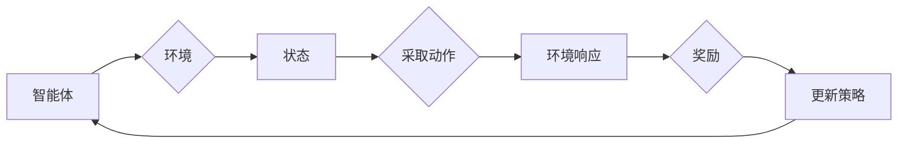

# 强化学习：在航空航天中的应用

> 关键词：强化学习，航空航天，飞行控制，自动驾驶，决策优化，模拟仿真，安全可靠性

## 1. 背景介绍

航空航天工业是现代科技发展的重要领域，其涉及的技术复杂，对系统的可靠性、安全性和效率要求极高。随着人工智能技术的快速发展，强化学习（Reinforcement Learning, RL）作为一种强大的机器学习范式，逐渐成为航空航天领域研究的热点。强化学习通过让智能体在与环境的交互中学习最优策略，为航空航天系统的自主决策、控制优化和任务规划提供了新的解决方案。

### 1.1 问题的由来

航空航天系统通常包括飞机、卫星、无人机等复杂设备，其运行过程中涉及大量的决策和操作。这些决策和操作需要考虑诸多因素，如飞行环境、设备状态、任务目标等。传统的航空航天系统通常采用硬编码的控制策略，难以适应复杂多变的飞行环境。

强化学习作为一种数据驱动的决策方法，通过智能体与环境之间的交互学习，能够自动适应动态变化的环境，并找到最优或近似最优的决策策略。这使得强化学习在航空航天领域的应用具有显著的优势。

### 1.2 研究现状

近年来，强化学习在航空航天领域取得了显著的研究成果。以下是一些主要的研究方向和应用案例：

- 飞行控制：利用强化学习实现自动驾驶、飞行路径规划、避障等。
- 系统健康监测与故障诊断：利用强化学习实现故障预测、故障隔离和故障修复。
- 无人机编队飞行：利用强化学习实现无人机之间的协同控制、队形保持等。
- 卫星任务规划：利用强化学习实现卫星轨道规划、任务分配等。

### 1.3 研究意义

强化学习在航空航天领域的应用具有重要的理论意义和实际应用价值：

- 理论意义：推动强化学习算法在复杂动态环境中的应用研究，丰富强化学习理论。
- 实际应用价值：提高航空航天系统的自主性和智能化水平，降低运营成本，提升系统可靠性。

### 1.4 本文结构

本文将围绕强化学习在航空航天领域的应用展开，主要内容包括：

- 核心概念与联系
- 核心算法原理与具体操作步骤
- 数学模型和公式
- 项目实践
- 实际应用场景
- 工具和资源推荐
- 总结与展望

## 2. 核心概念与联系

### 2.1 核心概念

强化学习是一种通过智能体与环境交互学习最优策略的机器学习范式。以下是强化学习中的几个核心概念：

- 智能体（Agent）：执行特定任务的实体，如无人机、卫星等。
- 环境（Environment）：智能体所处的环境，包括状态、动作和奖励。
- 状态（State）：描述智能体当前所处的环境状态。
- 动作（Action）：智能体可以执行的操作。
- 奖励（Reward）：环境对智能体动作的反馈，用于指导智能体学习最优策略。
- 策略（Policy）：智能体在给定状态下采取的动作。
- 值函数（Value Function）：描述智能体在某个状态下采取特定动作的长期累积奖励。
- 策略梯度（Policy Gradient）：用于优化策略的梯度下降方法。

### 2.2 Mermaid 流程图

以下是一个强化学习的基本流程图，展示了智能体与环境之间的交互过程：



### 2.3 核心概念联系

强化学习中的核心概念紧密联系，共同构成了一个完整的机器学习系统。智能体通过与环境交互，感知状态，选择动作，获取奖励，并不断更新策略，最终实现最优决策。

## 3. 核心算法原理 & 具体操作步骤

### 3.1 算法原理概述

强化学习算法的核心思想是利用奖励信号引导智能体学习最优策略。以下是几种常见的强化学习算法：

- Q-Learning：通过值函数逼近来学习最优策略。
- Deep Q-Network (DQN)：结合深度学习技术，将值函数逼近扩展到高维空间。
- Policy Gradient：直接优化策略梯度，无需值函数逼近。
- Actor-Critic：结合策略梯度和价值函数逼近，同时优化策略和值函数。

### 3.2 算法步骤详解

以下以DQN算法为例，介绍强化学习的基本操作步骤：

**Step 1: 初始化**  
- 初始化智能体、环境、策略网络、目标网络等。

**Step 2: 迭代训练**  
- 1.智能体随机选取一个状态。
- 2.根据策略网络选取一个动作。
- 3.智能体执行动作，进入新的状态，并获得奖励。
- 4.将当前状态、动作、奖励、下一个状态存储到经验池中。
- 5.从经验池中随机抽取一批经验。
- 6.使用目标网络预测下一状态的值函数，作为当前状态的预期奖励。
- 7.使用策略网络计算当前状态和动作的价值函数。
- 8.计算损失函数，并通过反向传播算法更新策略网络参数。

**Step 3: 评估**  
- 使用测试数据评估智能体的性能。

### 3.3 算法优缺点

#### 优点：

- 不需要大量标记数据，适合处理高维、动态环境。
- 能够学习到复杂、非线性的决策策略。
- 能够自动适应动态变化的环境。

#### 缺点：

- 训练过程可能需要较长时间，对计算资源要求较高。
- 稳定性较差，容易陷入局部最优解。
- 难以解释决策过程。

### 3.4 算法应用领域

强化学习在航空航天领域的应用领域广泛，以下是一些具体的应用案例：

- 飞行控制：自动驾驶、飞行路径规划、避障等。
- 系统健康监测与故障诊断：故障预测、故障隔离和故障修复。
- 无人机编队飞行：无人机之间的协同控制、队形保持等。
- 卫星任务规划：卫星轨道规划、任务分配等。

## 4. 数学模型和公式 & 详细讲解 & 举例说明

### 4.1 数学模型构建

强化学习中的数学模型主要包括以下内容：

- 状态空间：$S = \{s_1, s_2, ..., s_n\}$
- 动作空间：$A = \{a_1, a_2, ..., a_m\}$
- 奖励函数：$R: S \times A \rightarrow \mathbb{R}$
- 策略函数：$\pi: S \rightarrow A$
- 值函数：$V: S \rightarrow \mathbb{R}$ 或 $Q: S \times A \rightarrow \mathbb{R}$

### 4.2 公式推导过程

以下以Q-Learning算法为例，介绍强化学习中的公式推导过程。

**Q-Learning目标函数**：

$$
Q^*(s, a) = \max_{a'} \left[ R(s, a) + \gamma \max_{a'} Q^*(s', a') \right]
$$

其中，$R(s, a)$ 表示智能体在状态 $s$ 执行动作 $a$ 后获得的奖励，$\gamma$ 表示未来奖励的折扣因子，$Q^*(s, a)$ 表示在最优策略下，智能体在状态 $s$ 执行动作 $a$ 的长期累积奖励。

**Q-Learning更新公式**：

$$
Q(s, a) \leftarrow Q(s, a) + \alpha [R(s, a) + \gamma \max_{a'} Q(s', a') - Q(s, a)]
$$

其中，$\alpha$ 表示学习率。

### 4.3 案例分析与讲解

以下以自动驾驶为例，分析强化学习在航空航天领域的应用。

**自动驾驶场景**：

- **状态空间**：车辆位置、速度、加速度、路况信息等。
- **动作空间**：转向、加速、刹车、换挡等。
- **奖励函数**：安全行驶距离、行驶速度、油耗等。

**强化学习算法**：

- 使用DQN算法进行训练，将状态、动作、奖励作为输入，学习最优策略。

**案例分析**：

通过强化学习训练，自动驾驶系统可以学会在复杂的路况下安全、高效地行驶。例如，在遇到紧急情况时，系统能够自动减速、刹车，避免碰撞；在高速公路上，系统能够保持稳定的车速和车道，减少油耗。

## 5. 项目实践：代码实例和详细解释说明

### 5.1 开发环境搭建

以下以Python为例，介绍强化学习项目的开发环境搭建：

1. 安装Python：从Python官网下载并安装Python。
2. 安装PyTorch：使用pip安装PyTorch。
3. 安装OpenAI Gym：使用pip安装OpenAI Gym。

### 5.2 源代码详细实现

以下是一个简单的强化学习自动驾驶项目示例：

```python
import gym
import torch
import torch.nn as nn
import torch.optim as optim

# 定义DQN算法
class DQN(nn.Module):
    def __init__(self, input_dim, action_dim, hidden_dim):
        super(DQN, self).__init__()
        self.fc1 = nn.Linear(input_dim, hidden_dim)
        self.fc2 = nn.Linear(hidden_dim, action_dim)

    def forward(self, x):
        x = torch.relu(self.fc1(x))
        x = self.fc2(x)
        return x

# 加载环境
env = gym.make('CartPole-v1')

# 初始化DQN模型、目标网络、优化器
model = DQN(4, 2, 64)
target_model = DQN(4, 2, 64)
target_model.load_state_dict(model.state_dict())
target_model.eval()
optimizer = optim.Adam(model.parameters(), lr=0.001)

# 训练模型
for episode in range(1000):
    state = env.reset()
    done = False
    total_reward = 0
    while not done:
        state = torch.tensor(state, dtype=torch.float32).unsqueeze(0)
        action = model(state).argmax()
        next_state, reward, done, _ = env.step(action)
        next_state = torch.tensor(next_state, dtype=torch.float32).unsqueeze(0)
        Q_next = target_model(next_state).max()
        Q_current = model(state).gather(1, action.unsqueeze(0)).squeeze(0)
        Q_target = reward + gamma * Q_next
        loss = (Q_current - Q_target).pow(2)
        loss.backward()
        optimizer.step()
        state = next_state
        total_reward += reward
    print(f"Episode {episode}, Total Reward: {total_reward}")
```

### 5.3 代码解读与分析

以上代码演示了使用PyTorch实现DQN算法的简单自动驾驶项目。以下是代码关键部分解读：

- `DQN` 类：定义了DQN模型结构，包括两个全连接层。
- `gym.make('CartPole-v1')`：加载CartPole环境，这是一个经典的强化学习控制问题，智能体需要控制一个杆子保持平衡。
- `optimizer`：定义了Adam优化器，用于更新模型参数。
- `for episode in range(1000)`：循环进行1000个训练周期。
- `state = env.reset()`：重置环境，并获取初始状态。
- `while not done`：在当前状态执行动作，直到任务完成。
- `action = model(state).argmax()`：使用DQN模型选择动作。
- `loss = (Q_current - Q_target).pow(2)`：计算损失函数，并使用反向传播算法更新模型参数。

### 5.4 运行结果展示

运行上述代码，可以看到自动驾驶系统在CartPole环境下逐渐学会了保持杆子平衡。

## 6. 实际应用场景

### 6.1 飞行控制

强化学习在飞行控制领域的应用主要包括以下方面：

- 自动驾驶：实现无人机的自主飞行，包括起飞、巡航、降落等。
- 飞行路径规划：在保证安全的前提下，优化飞行路径，降低燃油消耗。
- 避障：在复杂飞行环境中，自动识别并避开障碍物。
- 起飞和降落控制：优化起飞和降落过程中的操纵，提高飞行安全性。

### 6.2 系统健康监测与故障诊断

强化学习在系统健康监测与故障诊断领域的应用主要包括以下方面：

- 故障预测：预测设备可能出现故障的征兆，提前采取措施。
- 故障隔离：快速定位故障发生的位置，提高维修效率。
- 故障修复：根据故障诊断结果，自动选择合适的修复策略。

### 6.3 无人机编队飞行

强化学习在无人机编队飞行领域的应用主要包括以下方面：

- 协同控制：实现多架无人机之间的协同飞行，完成特定任务。
- 队形保持：在复杂环境中保持队形，提高飞行稳定性。
- 飞行路径规划：优化飞行路径，降低能耗。

### 6.4 卫星任务规划

强化学习在卫星任务规划领域的应用主要包括以下方面：

- 轨道规划：优化卫星轨道，提高任务执行效率。
- 任务分配：合理分配卫星资源，完成更多任务。
- 能量管理：优化能量分配，延长卫星使用寿命。

## 7. 工具和资源推荐

### 7.1 学习资源推荐

- 《Reinforcement Learning: An Introduction》
- 《Reinforcement Learning: Principles and Practice》
- 《Deep Reinforcement Learning Hands-On》
- 《Artificial Intelligence: A Modern Approach》

### 7.2 开发工具推荐

- PyTorch：用于深度学习开发的框架。
- OpenAI Gym：提供多种强化学习环境的平台。
- TensorFlow：用于深度学习开发的框架。

### 7.3 相关论文推荐

- Q-Learning (1989) by Richard S. Sutton and Andrew G. Barto
- Deep Q-Networks (2015) by Volodymyr Mnih et al.
- Asynchronous Advantage Actor-Critic (A3C) (2016) by Volodymyr Mnih et al.
- Soft Actor-Critic (SAC) (2018) by Tuomas Haarnoja et al.

## 8. 总结：未来发展趋势与挑战

### 8.1 研究成果总结

本文介绍了强化学习在航空航天领域的应用，从核心概念、算法原理到实际应用案例，全面分析了强化学习在航空航天领域的应用价值。通过本文的学习，读者可以了解到强化学习在飞行控制、系统健康监测与故障诊断、无人机编队飞行和卫星任务规划等领域的应用现状和前景。

### 8.2 未来发展趋势

未来，强化学习在航空航天领域的应用将呈现以下发展趋势：

- 算法创新：开发更加高效、稳定的强化学习算法，提高模型性能和鲁棒性。
- 跨领域应用：将强化学习应用于航空航天领域以外的其他领域，如智能制造、智能交通等。
- 硬件加速：利用专用硬件加速强化学习算法的运行，提高算法效率。
- 伦理与安全：关注强化学习在航空航天领域的伦理和安全问题，确保技术应用的安全性。

### 8.3 面临的挑战

尽管强化学习在航空航天领域具有广泛的应用前景，但在实际应用过程中仍面临着以下挑战：

- 算法复杂度高：强化学习算法通常较为复杂，对计算资源要求较高。
- 数据量需求大：强化学习算法需要大量数据进行训练，获取标注数据的成本较高。
- 模型可解释性差：强化学习模型的决策过程难以解释，难以满足航空航天领域的可靠性要求。
- 安全性和伦理问题：强化学习模型可能存在安全隐患，需要加强安全和伦理方面的研究。

### 8.4 研究展望

针对以上挑战，未来研究可以从以下几个方面进行探索：

- 简化算法：设计更加简单、高效的强化学习算法，降低算法复杂度。
- 数据高效利用：探索新的数据高效利用方法，降低数据需求。
- 模型可解释性：提高强化学习模型的可解释性，增强模型的可信度。
- 安全性和伦理问题：加强强化学习在航空航天领域的安全和伦理问题研究，确保技术应用的安全性。

通过不断技术创新和理论突破，强化学习在航空航天领域的应用将更加广泛，为航空航天工业的智能化发展提供有力支撑。

## 9. 附录：常见问题与解答

**Q1：强化学习在航空航天领域的应用前景如何？**

A：强化学习在航空航天领域的应用前景广阔，可以显著提高航空航天系统的自主性、智能化水平和安全性。随着技术的不断发展和应用推广，强化学习将成为航空航天工业的重要技术支撑。

**Q2：强化学习在航空航天领域的应用有哪些优势？**

A：强化学习在航空航天领域的应用具有以下优势：

- 自动适应动态环境，提高系统灵活性。
- 学习到复杂、非线性的决策策略。
- 避免硬编码控制策略，提高系统可维护性。
- 通过与专家知识相结合，提高系统可靠性。

**Q3：强化学习在航空航天领域的应用有哪些挑战？**

A：强化学习在航空航天领域的应用主要面临以下挑战：

- 训练数据获取困难，标注成本高。
- 模型可解释性差，难以满足可靠性要求。
- 算法复杂度高，对计算资源要求较高。
- 安全性和伦理问题需要关注。

**Q4：如何解决强化学习在航空航天领域的应用挑战？**

A：为解决强化学习在航空航天领域的应用挑战，可以从以下几个方面着手：

- 研究新的数据高效利用方法，降低数据需求。
- 设计更加简单、高效的强化学习算法，降低算法复杂度。
- 提高模型可解释性，增强模型的可信度。
- 加强安全和伦理问题研究，确保技术应用的安全性。

**Q5：强化学习在航空航天领域的应用案例有哪些？**

A：以下是一些强化学习在航空航天领域的应用案例：

- 无人机编队飞行
- 飞行控制
- 系统健康监测与故障诊断
- 卫星任务规划

作者：禅与计算机程序设计艺术 / Zen and the Art of Computer Programming