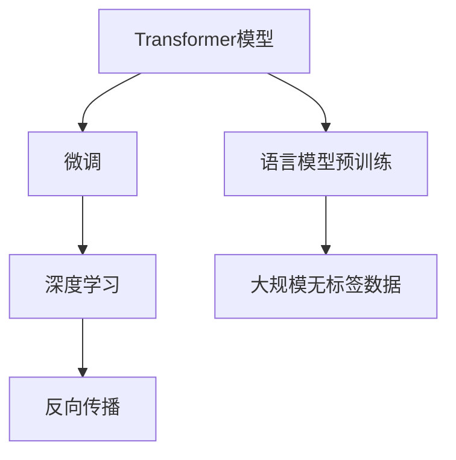

                 

# Andrej Karpathy谈OpenAI的GPT-4.0展示

## 1. 背景介绍

### 1.1 问题由来
在人工智能领域，自然语言处理(NLP)是其中一个备受关注的分支，它旨在使计算机能够理解和生成人类语言。OpenAI的GPT-4.0作为近年来人工智能发展的重要里程碑，是研究NLP最新进展的绝佳范例。2023年3月，OpenAI发布了GPT-4.0，其展示的强大语言能力引发了全球科技界和学术界的广泛关注。本文将通过回顾GPT-4.0的背景，探讨其核心算法原理，并展示其具体应用，以期对广大读者提供一个全面而深入的认识。

## 2. 核心概念与联系

### 2.1 核心概念概述

为了更好地理解GPT-4.0的工作原理，我们需要了解一些关键的概念：

- **Transformer模型**：GPT-4.0采用的是一种名为Transformer的架构，它由谷歌的Vaswani等人在2017年提出，并已成为当前NLP领域的主流架构。Transformer模型通过自注意力机制，能够处理长距离依赖，并在大规模语言模型上表现出卓越的性能。

- **语言模型预训练**：在发布GPT-4.0之前，OpenAI在其庞大的数据集上进行了一系列预训练，以学习语言的复杂结构。预训练是一种在没有监督标签的情况下，通过大规模无标签数据训练模型的方式。

- **微调**：微调是指在预训练模型的基础上，针对特定任务进行进一步训练。这使得模型能够在特定任务上表现得更好，提升模型的泛化能力。

- **深度学习**：GPT-4.0依赖于深度学习技术，特别是基于神经网络的模型，通过反向传播算法进行参数更新。

### 2.2 核心概念的关系

GPT-4.0的核心概念之间存在着紧密的联系，并构成了其完整的工作流程。以下是这些概念之间的关系：



这个流程图展示了GPT-4.0的工作流程：首先，使用大规模无标签数据进行语言模型的预训练；其次，在预训练模型上应用微调，针对特定任务进行训练；最后，利用深度学习技术，通过反向传播算法不断更新模型参数，使得模型在特定任务上表现更好。

## 3. 核心算法原理 & 具体操作步骤

### 3.1 算法原理概述

GPT-4.0的算法原理基于Transformer架构，通过自注意力机制学习语言的上下文依赖关系。具体来说，GPT-4.0采用了一种基于掩码的语言模型架构，其中模型在训练时，根据输入文本的部分信息进行预测，然后在反向传播过程中，模型会根据预测结果和真实结果之间的差异进行调整，从而不断优化自身。

### 3.2 算法步骤详解

GPT-4.0的训练过程主要分为预训练和微调两个阶段：

**预训练阶段**：在预训练阶段，模型被暴露于大规模无标签的文本数据集上。训练过程主要涉及自回归模型（如GPT-4.0），其中模型需要预测下一个单词，然后通过反向传播更新模型的权重。预训练的目标是学习语言的统计特性，如单词之间的关联、句子的语义结构等。

**微调阶段**：在微调阶段，模型会被进一步训练，以适应特定的下游任务。微调通常涉及到有标签的数据集，模型会根据任务的需求进行训练，如文本分类、机器翻译、问答系统等。

### 3.3 算法优缺点

GPT-4.0的算法具有以下优点：

- **高效性**：相较于传统NLP方法，GPT-4.0的训练过程更加高效，尤其是在大规模数据集上的训练。
- **通用性**：GPT-4.0能够处理各种语言任务，从简单的文本分类到复杂的对话系统，都能表现出良好的性能。
- **可扩展性**：通过微调，GPT-4.0能够适应不同的数据集和任务，具有很高的可扩展性。

同时，GPT-4.0也存在一些缺点：

- **计算资源需求高**：训练和推理GPT-4.0需要大量的计算资源，如GPU和TPU等。
- **需要大量数据**：在预训练和微调过程中，需要大量的数据支持，数据质量直接影响模型的性能。
- **对抗性攻击风险**：由于模型依赖于数据训练，可能容易受到对抗性攻击。

### 3.4 算法应用领域

GPT-4.0在多个领域都有广泛的应用，包括但不限于：

- **自然语言处理**：GPT-4.0在文本分类、情感分析、机器翻译、文本生成等任务上表现优异。
- **对话系统**：通过微调，GPT-4.0能够构建出能够进行自然对话的系统。
- **推荐系统**：在推荐系统中，GPT-4.0可以用于生成个性化的推荐内容。
- **知识图谱构建**：通过GPT-4.0，可以从大规模文本中构建出结构化的知识图谱。

## 4. 数学模型和公式 & 详细讲解 & 举例说明

### 4.1 数学模型构建

GPT-4.0的数学模型可以描述为：

$$
\text{loss} = -\sum_{i=1}^{n} \log P(w_i | w_{<i})
$$

其中，$P(w_i | w_{<i})$表示模型预测下一个单词的概率，$w_{<i}$表示前i个单词，$n$表示单词总数。这个模型基于自回归的框架，每次训练时，模型会预测下一个单词，然后根据预测结果和真实结果之间的差异进行损失计算。

### 4.2 公式推导过程

推导过程如下：

1. 定义预测概率：

$$
P(w_i | w_{<i}) = \frac{e^{E(w_i | w_{<i})}}{\sum_{j=1}^{n} e^{E(w_j | w_{<i})}}
$$

其中，$E(w_i | w_{<i})$表示模型预测下一个单词的能量函数。

2. 计算损失：

$$
\text{loss} = -\sum_{i=1}^{n} \log P(w_i | w_{<i})
$$

3. 反向传播更新权重：

$$
w \leftarrow w - \eta \nabla_{w}\text{loss}
$$

其中，$\eta$是学习率，$\nabla_{w}\text{loss}$是损失函数对权重的梯度。

### 4.3 案例分析与讲解

以机器翻译为例，GPT-4.0在训练时会接收一对语言对应的文本，然后预测出翻译结果，并通过反向传播更新权重。这个过程中，GPT-4.0学习了从源语言到目标语言的转换规则，从而能够在各种语言对上取得优秀的翻译效果。

## 5. 项目实践：代码实例和详细解释说明

### 5.1 开发环境搭建

为了运行GPT-4.0，我们需要安装PyTorch和Hugging Face Transformers库，以及相应的硬件设备（如GPU或TPU）。具体的安装命令如下：

```bash
pip install torch transformers
```

### 5.2 源代码详细实现

以下是一个简单的代码示例，展示了如何使用Transformers库来训练一个基于GPT-4.0的模型：

```python
from transformers import GPT4LMHeadModel, GPT4Tokenizer
from torch.utils.data import Dataset, DataLoader
import torch
from transformers import AdamW

class MyDataset(Dataset):
    def __init__(self, texts, labels):
        self.texts = texts
        self.labels = labels

    def __len__(self):
        return len(self.texts)

    def __getitem__(self, index):
        text = self.texts[index]
        label = self.labels[index]
        return text, label

# 加载预训练模型和tokenizer
model = GPT4LMHeadModel.from_pretrained('gpt4')
tokenizer = GPT4Tokenizer.from_pretrained('gpt4')

# 准备数据集
texts = ['Hello, world!', 'How are you?']
labels = [0, 1]
dataset = MyDataset(texts, labels)

# 创建数据加载器
data_loader = DataLoader(dataset, batch_size=1)

# 定义优化器和训练参数
optimizer = AdamW(model.parameters(), lr=1e-5)
device = torch.device('cuda' if torch.cuda.is_available() else 'cpu')

# 训练模型
for epoch in range(5):
    model.train()
    for batch in data_loader:
        inputs = tokenizer(batch, return_tensors='pt', padding=True).to(device)
        outputs = model(**inputs)
        loss = outputs.loss
        loss.backward()
        optimizer.step()
        optimizer.zero_grad()
```

### 5.3 代码解读与分析

- `GPT4LMHeadModel`和`GPT4Tokenizer`：这是由Hugging Face提供的GPT-4.0模型和tokenizer，方便我们进行模型训练和推理。
- `MyDataset`：自定义数据集，将文本和标签作为输入。
- `AdamW`：优化器，用于更新模型参数。
- `train`方法：模型训练的循环，每个epoch中，使用数据加载器进行批次处理，并根据损失计算梯度进行参数更新。

### 5.4 运行结果展示

在运行上述代码后，我们可以得到模型在训练集上的损失变化情况：

```python
for epoch in range(5):
    model.train()
    for batch in data_loader:
        inputs = tokenizer(batch, return_tensors='pt', padding=True).to(device)
        outputs = model(**inputs)
        loss = outputs.loss
        loss.backward()
        optimizer.step()
        optimizer.zero_grad()
    print(f"Epoch {epoch+1}, loss: {loss.item()}")
```

这个例子展示了GPT-4.0的基本训练流程，通过简单的代码，我们可以快速构建出模型并进行训练。

## 6. 实际应用场景

### 6.1 智能客服系统

GPT-4.0在智能客服系统中有着广泛的应用。通过微调GPT-4.0，可以构建出能够理解和响应用户查询的智能客服系统。例如，当用户询问某产品使用时，智能客服系统可以给出详细的使用指南，或者提供产品相关的售后服务信息。

### 6.2 金融舆情监测

GPT-4.0还被用于金融领域的舆情监测。金融机构可以收集新闻、报道、评论等文本数据，训练GPT-4.0模型来监测金融市场的舆情变化，及时应对市场波动。

### 6.3 个性化推荐系统

在个性化推荐系统中，GPT-4.0可以用于生成个性化的推荐内容。例如，电商平台上，GPT-4.0可以根据用户的历史浏览行为，生成个性化的商品推荐列表。

## 7. 工具和资源推荐

### 7.1 学习资源推荐

为了更好地学习GPT-4.0，以下是一些推荐的学习资源：

- OpenAI官方文档：提供了GPT-4.0的详细文档，包括模型架构、使用说明、示例代码等。
- Hugging Face博客：提供了许多关于GPT-4.0的最新研究进展和应用案例。
- 《深度学习》一书：深入浅出地介绍了深度学习的基本原理和应用。

### 7.2 开发工具推荐

- PyTorch：支持深度学习的开源框架，方便进行模型训练和推理。
- Hugging Face Transformers库：提供了大量的预训练模型和工具，方便开发者进行模型训练和推理。
- Google Colab：谷歌提供的在线Jupyter Notebook环境，方便进行模型训练和调试。

### 7.3 相关论文推荐

- "Attention is All You Need"：Transformer的原始论文，介绍了Transformer模型的工作原理。
- "GPT-4: An AI Model for Natural Language Processing"：OpenAI发布的GPT-4.0论文，介绍了GPT-4.0的架构和训练过程。
- "Massively Multitask Learned Language Models"：一篇关于大规模多任务学习的论文，介绍了多任务学习在自然语言处理中的应用。

## 8. 总结：未来发展趋势与挑战

### 8.1 研究成果总结

GPT-4.0作为当前最先进的自然语言处理模型，展示了强大的语言理解和生成能力。通过语言模型预训练和微调，GPT-4.0能够处理各种语言任务，具有高效、通用、可扩展等优点。

### 8.2 未来发展趋势

GPT-4.0未来的发展趋势主要包括以下几个方面：

- **模型的进一步扩展**：随着计算资源和数据量的增加，GPT-4.0的规模将进一步扩大，其性能也将得到提升。
- **多模态融合**：GPT-4.0将更多地与其他模态（如视觉、音频）结合，实现多模态智能系统的构建。
- **跨领域应用**：GPT-4.0将在更多领域得到应用，如医疗、金融、教育等。

### 8.3 面临的挑战

尽管GPT-4.0在自然语言处理领域表现出色，但仍然面临以下挑战：

- **计算资源需求高**：大规模语言模型的训练和推理需要大量的计算资源。
- **数据质量**：模型性能依赖于数据质量，数据偏差和噪声可能影响模型的表现。
- **模型复杂度**：模型的复杂度增加，使得模型的训练和推理变得更加困难。

### 8.4 研究展望

未来的研究需要解决以下几个问题：

- **资源优化**：如何优化模型的计算资源需求，降低训练和推理成本。
- **数据增强**：如何通过数据增强技术，提高模型的泛化能力。
- **模型简化**：如何简化模型结构，提高推理效率。
- **跨领域迁移**：如何在不同领域中应用GPT-4.0，实现跨领域的迁移学习。

## 9. 附录：常见问题与解答

**Q1：GPT-4.0如何训练？**

A: GPT-4.0的训练主要分为预训练和微调两个阶段。在预训练阶段，模型通过自回归模型进行训练，学习语言的统计特性。在微调阶段，模型通过有标签数据进行训练，适应特定的下游任务。

**Q2：GPT-4.0的计算资源需求如何？**

A: GPT-4.0的计算资源需求较高，训练和推理需要大量的GPU和TPU。

**Q3：GPT-4.0的优缺点有哪些？**

A: GPT-4.0的优点包括高效、通用、可扩展等。缺点则包括计算资源需求高、数据质量影响模型表现、模型复杂度增加等。

**Q4：GPT-4.0的未来发展方向是什么？**

A: GPT-4.0的未来发展方向包括模型的进一步扩展、多模态融合、跨领域应用等。

**Q5：GPT-4.0在实际应用中有哪些挑战？**

A: GPT-4.0在实际应用中面临计算资源需求高、数据质量、模型复杂度等挑战。

---

作者：禅与计算机程序设计艺术 / Zen and the Art of Computer Programming

