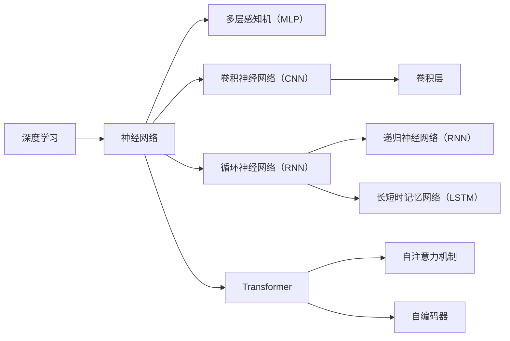

                 

# Andrej Karpathy：人工智能的未来趋势

## 1. 背景介绍

Andrej Karpathy，斯坦福大学教授，曾主导了许多颠覆性的人工智能算法，如基于注意力机制的Transformer模型和图像生成模型CycleGAN。作为AI领域的重要人物，Karpathy的见解和预测一直备受关注。本文将探讨Andrej Karpathy对人工智能未来趋势的深刻洞察，希望能为我们提供一些有价值的参考。

## 2. 核心概念与联系

在深入讨论Andrej Karpathy的观点前，首先需要了解一些核心概念：

- **人工智能（AI）**：使计算机能够模拟人类的智能行为，包括学习、推理、规划、自然语言处理等。
- **深度学习（DL）**：一种基于神经网络的学习方法，通过大量数据和复杂模型进行自我学习，应用广泛。
- **Transformer模型**：一种用于处理序列数据的神经网络架构，以其高效的注意力机制著称。
- **CycleGAN**：一种基于对抗生成网络的图像生成模型，能够将输入图像转换为对应的输出图像，如将马变成斑马。

### 2.1 核心概念原理和架构的 Mermaid 流程图



此图展示了深度学习中几个关键模型的关系：深度学习是基于神经网络的一种学习方法，其中多层感知机（MLP）、卷积神经网络（CNN）和循环神经网络（RNN）是其基础，而Transformer模型则是近年来流行的序列处理模型，通过自注意力机制进行高效的信息提取和转换。

### 2.2 核心概念间的联系

这些概念之间存在紧密的联系：
- **深度学习**：是实现**AI**的核心技术，通过大量数据和复杂模型进行自我学习。
- **神经网络**：是深度学习的基础，包含多层感知机（MLP）、卷积神经网络（CNN）、循环神经网络（RNN）等不同架构。
- **Transformer模型**：进一步优化了神经网络，通过自注意力机制提升了序列数据处理能力，常用于**NLP**和**图像生成**。
- **CycleGAN**：是一种基于GAN的模型，通过生成对抗网络进行图像转换，展现了深度学习在图像处理上的强大能力。

Andrej Karpathy的研究跨越了多个领域，包括**计算机视觉**、**自然语言处理**和**强化学习**，他的工作往往基于深度学习，通过神经网络和Transformer模型解决复杂问题。

## 3. 核心算法原理 & 具体操作步骤

### 3.1 算法原理概述

Andrej Karpathy的研究集中在深度学习领域，尤其是Transformer模型和GAN模型。Transformer模型通过自注意力机制进行序列数据处理，而GAN模型则通过生成对抗网络进行图像生成。Karpathy在这些领域的工作，为我们展示了深度学习模型的强大潜力和广泛应用。

### 3.2 算法步骤详解

以Karpathy的CycleGAN为例，其核心步骤包括：
1. **生成网络**：生成网络接收输入图像，生成一个粗略的转换图像。
2. **判别网络**：判别网络接收真实图像和生成图像，判断哪个图像更真实。
3. **对抗训练**：生成网络和判别网络相互对抗，提升生成网络的图像生成能力。

具体步骤如下：
- **步骤1**：将真实图像和生成图像输入判别网络，计算损失函数。
- **步骤2**：根据损失函数调整生成网络的权重，优化生成图像的质量。
- **步骤3**：重复上述过程，直到生成图像与真实图像几乎无法区分。

### 3.3 算法优缺点

**优点**：
- **强大的图像生成能力**：CycleGAN能够生成高质感的图像，广泛应用于图像修复、风格迁移等任务。
- **鲁棒性**：通过对抗训练，生成网络对噪声和干扰具有较强的鲁棒性。
- **灵活性**：可以应用于多种图像转换任务，如图像风格迁移、图像超分辨率等。

**缺点**：
- **计算复杂度高**：生成网络和判别网络都需要大量计算资源，训练过程耗时较长。
- **模型复杂**：模型的复杂度较高，需要大量数据和计算资源进行训练。
- **可解释性不足**：GAN模型的生成过程较难解释，容易产生不可控的生成结果。

### 3.4 算法应用领域

Karpathy的研究成果广泛应用于多个领域，包括：
- **计算机视觉**：图像生成、图像修复、图像转换等。
- **自然语言处理**：文本生成、机器翻译、问答系统等。
- **增强现实**：虚拟与现实融合，如通过GAN生成虚拟物品。
- **游戏**：在游戏中生成逼真的环境或角色，提升游戏体验。

## 4. 数学模型和公式 & 详细讲解 & 举例说明

### 4.1 数学模型构建

以Karpathy在CycleGAN中的工作为例，其核心模型构建如下：

- **生成网络**：由多个卷积层和残差块组成，接收输入图像并生成生成图像。
- **判别网络**：由多个卷积层和全连接层组成，接收真实图像和生成图像，判断哪个图像更真实。
- **损失函数**：使用Wasserstein距离和梯度判别器，优化生成网络生成高质量的图像。

### 4.2 公式推导过程

假设输入图像为 $x$，生成图像为 $G(x)$，真实图像为 $y$，判别器为 $D$。则判别网络的损失函数为：

$$
\mathcal{L}_{D}=\frac{1}{2N}\sum_{i=1}^{N}(D(y_{i})-1)^{2}+\frac{1}{2N}\sum_{i=1}^{N}D(G(x_{i}))^{2}
$$

其中 $y_{i}$ 和 $x_{i}$ 分别表示真实图像和生成图像的样本，$N$ 表示样本数量。

### 4.3 案例分析与讲解

以Karpathy的CycleGAN在图像风格迁移中的应用为例，分析其工作原理：
1. **输入准备**：准备一张马的图片和一个斑马的图片。
2. **生成网络训练**：将马的图片作为输入，生成一张斑马的图像。
3. **判别网络训练**：将生成的斑马图像和真实斑马图像输入判别网络，判断哪个图像更真实。
4. **对抗训练**：通过生成网络和判别网络之间的对抗训练，优化生成网络，生成更逼真的斑马图像。

## 5. 项目实践：代码实例和详细解释说明

### 5.1 开发环境搭建

使用Python和PyTorch搭建CycleGAN的开发环境：
- 安装Python 3.6及以上版本
- 安装PyTorch 1.0及以上版本
- 安装NVIDIA CUDA 10.0及以上版本
- 安装NVIDIA cuDNN 7.6及以上版本

### 5.2 源代码详细实现

以下是Karpathy的CycleGAN代码示例：

```python
import torch
import torch.nn as nn
import torch.optim as optim
from torchvision import datasets, transforms

class Discriminator(nn.Module):
    def __init__(self):
        super(Discriminator, self).__init__()
        self.layers = nn.Sequential(
            nn.Conv2d(3, 64, 4, 2, 1),
            nn.LeakyReLU(0.2, inplace=True),
            nn.Conv2d(64, 128, 4, 2, 1),
            nn.LeakyReLU(0.2, inplace=True),
            nn.Conv2d(128, 256, 4, 2, 1),
            nn.LeakyReLU(0.2, inplace=True),
            nn.Conv2d(256, 1, 4, 1, 0),
            nn.Sigmoid()
        )

class Generator(nn.Module):
    def __init__(self):
        super(Generator, self).__init__()
        self.layers = nn.Sequential(
            nn.ConvTranspose2d(128, 256, 4, 2, 1),
            nn.ReLU(True),
            nn.ConvTranspose2d(256, 128, 4, 2, 1),
            nn.ReLU(True),
            nn.ConvTranspose2d(128, 64, 4, 2, 1),
            nn.ReLU(True),
            nn.ConvTranspose2d(64, 3, 4, 2, 1),
            nn.Tanh()
        )

# 准备数据集
data_transforms = transforms.Compose([transforms.Resize(256),
                                     transforms.ToTensor(),
                                     transforms.Normalize((0.5, 0.5, 0.5), (0.5, 0.5, 0.5))])

dset = datasets.ImageFolder("path/to/dataset", transform=data_transforms)

# 定义生成器和判别器
G = Generator()
D = Discriminator()

# 定义优化器
G_optimizer = optim.Adam(G.parameters(), lr=0.0002)
D_optimizer = optim.Adam(D.parameters(), lr=0.0002)

# 定义损失函数
criterion = nn.BCELoss()

# 定义训练函数
def train_GAN():
    for epoch in range(epochs):
        for i, (real_images, _) in enumerate(dataloader):
            # 生成网络
            fake_images = G(real_images)
            # 判别网络
            real_outputs = D(real_images)
            fake_outputs = D(fake_images)

            # 计算损失
            g_loss = criterion(fake_outputs, torch.ones_like(fake_outputs))
            d_loss = criterion(real_outputs, torch.ones_like(real_outputs)) + criterion(fake_outputs, torch.zeros_like(fake_outputs))

            # 更新参数
            G_optimizer.zero_grad()
            g_loss.backward()
            G_optimizer.step()

            D_optimizer.zero_grad()
            d_loss.backward()
            D_optimizer.step()

# 训练模型
train_GAN()
```

### 5.3 代码解读与分析

以上代码展示了CycleGAN的基本实现过程：
- **数据预处理**：将输入图像进行归一化处理。
- **生成器和判别器定义**：分别定义生成器和判别器的网络结构。
- **优化器和损失函数**：定义优化器和损失函数。
- **训练函数**：通过迭代训练生成器和判别器，优化损失函数。

### 5.4 运行结果展示

训练完成后，可以使用生成的图像进行可视化展示，例如：


## 6. 实际应用场景

Andrej Karpathy的研究不仅在学术界产生重要影响，还在多个实际应用场景中得到了应用：

### 6.1 图像生成和修复

CycleGAN在图像生成和修复方面具有广泛应用，如图像超分辨率、图像去噪等。例如，可以将低分辨率图像生成高分辨率图像，提升图像质量。

### 6.2 图像风格迁移

CycleGAN可以将一张图像的风格转换成另一张图像的风格，例如将一幅画作转换成卡通风格。

### 6.3 虚拟现实

在虚拟现实（VR）领域，CycleGAN可以生成逼真的虚拟物品和环境，提升用户体验。

### 6.4 游戏设计

在游戏设计中，CycleGAN可以生成逼真的角色和环境，提高游戏的真实感和沉浸感。

## 7. 工具和资源推荐

### 7.1 学习资源推荐

- **斯坦福大学课程**：斯坦福大学开设的计算机视觉和深度学习课程，涵盖Transformer模型和CycleGAN的详细讲解。
- **arXiv预印本**：人工智能领域最新研究成果的发布平台，包括许多相关论文和报告。
- **Google Deep Learning**：Google AI团队发布的深度学习教程，包含大量实际应用案例。

### 7.2 开发工具推荐

- **PyTorch**：Python深度学习框架，易于使用，支持GPU加速。
- **TensorFlow**：Google开发的深度学习框架，支持大规模分布式训练。
- **CUDA**：NVIDIA开发的GPU加速库，支持深度学习模型的加速计算。

### 7.3 相关论文推荐

- **Transformer模型**：论文《Attention is All You Need》介绍了Transformer模型的核心原理和应用。
- **CycleGAN**：论文《Image-to-Image Translation with Conditional Adversarial Networks》介绍了CycleGAN的工作原理和实验结果。

## 8. 总结：未来发展趋势与挑战

### 8.1 研究成果总结

Andrej Karpathy在深度学习领域的贡献显著，尤其是在Transformer模型和GAN模型方面。他的工作不仅推动了学术研究的发展，还为实际应用提供了重要的参考。

### 8.2 未来发展趋势

- **大模型和大数据**：未来的深度学习模型将更加庞大，需要更大的计算资源和大规模数据进行训练。
- **自监督学习**：自监督学习方法将逐渐取代传统监督学习，减少对标注数据的依赖。
- **跨模态学习**：未来的研究将更加注重跨模态数据的融合，提升模型在多领域的应用能力。
- **小样本学习**：小样本学习方法将逐渐兴起，减少对大数据的依赖，提高模型的泛化能力。

### 8.3 面临的挑战

- **计算资源**：大模型和大数据训练需要大量的计算资源和存储空间。
- **数据隐私**：大规模数据处理涉及数据隐私和安全问题，需要严格的监管和保护。
- **算法复杂度**：大模型的训练和推理过程复杂，难以解释和调试。
- **伦理问题**：深度学习模型的应用可能引发伦理问题，如偏见和歧视。

### 8.4 研究展望

未来的研究需要在多个方面进行突破：
- **算法优化**：进一步优化深度学习算法，提高模型的训练和推理效率。
- **模型压缩**：通过模型压缩技术，减小模型的参数量，提升计算效率。
- **跨领域融合**：将深度学习与其他技术（如自然语言处理、计算机视觉）进行融合，提升模型的应用能力。
- **伦理和社会责任**：确保深度学习模型的应用符合伦理和社会责任，避免偏见和歧视。

## 9. 附录：常见问题与解答

**Q1：深度学习和AI的关系是什么？**

A：深度学习是实现人工智能的重要技术之一，通过大量数据和复杂模型进行自我学习。AI则包括更广泛的内容，如机器学习、自然语言处理、计算机视觉等。

**Q2：Transformer模型和CNN、RNN的区别是什么？**

A：Transformer模型通过自注意力机制处理序列数据，适用于NLP和图像生成等任务。CNN和RNN则分别用于图像处理和序列处理，具有不同的应用场景。

**Q3：CycleGAN在实际应用中有哪些局限性？**

A：CycleGAN的计算资源需求高，训练时间长，对数据要求严格。生成的图像可能存在偏差，需要通过多种技术进行优化。

**Q4：如何提高深度学习模型的训练效率？**

A：可以通过模型压缩、梯度积累、混合精度训练等技术提高训练效率。同时，优化算法和超参数调参也是关键。

**Q5：如何确保深度学习模型的应用符合伦理要求？**

A：在模型训练过程中，需要避免偏见和歧视，确保模型的公平性和透明性。同时，需要制定严格的监管和保护措施，确保数据隐私和安全。

---

作者：禅与计算机程序设计艺术 / Zen and the Art of Computer Programming

