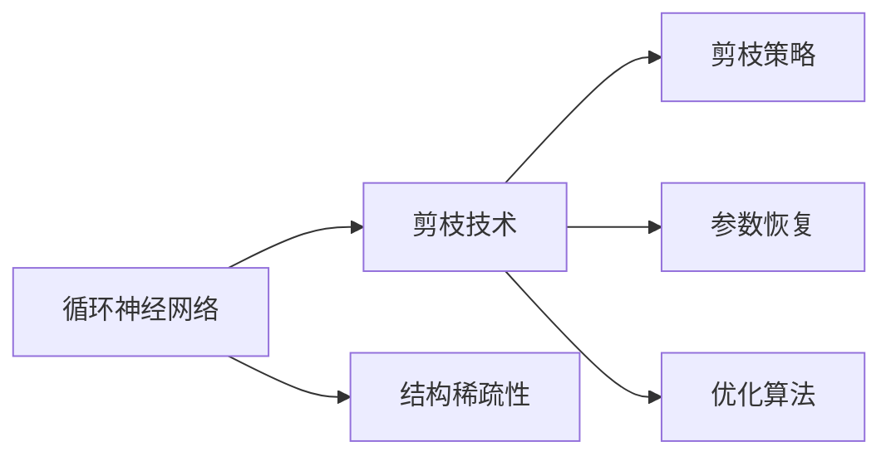
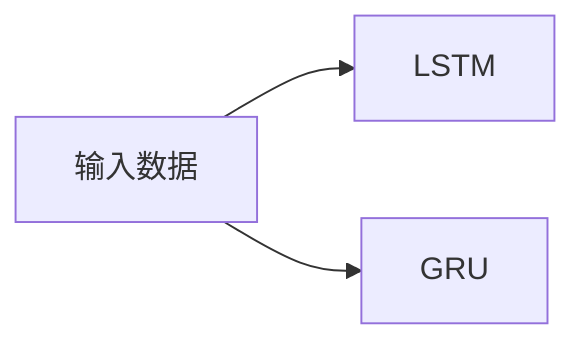
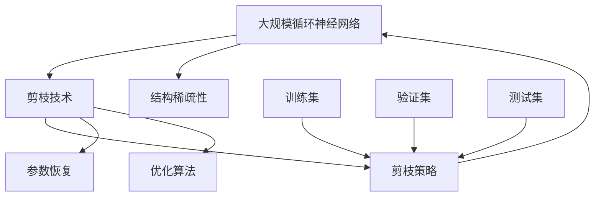

                 

## 1. 背景介绍

随着深度学习技术的发展，循环神经网络（Recurrent Neural Networks, RNNs）在处理序列数据（如自然语言、语音信号等）方面表现出显著的优势，广泛应用于语言模型、语音识别、机器翻译等任务。然而，由于RNNs结构复杂，模型参数量巨大，训练和推理过程耗费大量计算资源，难以在实际应用中推广。剪枝（Pruning）技术作为一种有效的模型压缩方法，通过去除网络中不必要的参数和连接，降低模型复杂度，提升推理效率，是近年来研究热点之一。

### 1.1 问题由来

在深度学习模型中，剪枝技术最早应用于卷积神经网络（CNNs），通过移除部分卷积核，显著降低计算复杂度和存储空间。然而，在RNNs领域，剪枝技术面临诸多挑战。与CNNs不同，RNNs的网络结构复杂，参数依赖关系紧密，剪枝策略难以直接沿用。如何在保证模型性能的前提下，有效减少参数和计算量，是剪枝技术在RNNs中应用的核心问题。

### 1.2 问题核心关键点

剪枝技术在RNNs中的应用主要包括以下几个关键点：
1. **剪枝策略设计**：决定哪些参数和连接需要被保留或删除。
2. **模型性能保证**：在剪枝后，模型是否仍能保持原有性能。
3. **计算资源优化**：剪枝前后模型在计算和存储资源上的变化。
4. **剪枝算法优化**：如何高效地实现剪枝操作。

这些问题互相交织，需要在模型设计、参数选择、优化算法等多个层面进行综合考虑，以找到最优的剪枝方案。

## 2. 核心概念与联系

### 2.1 核心概念概述

为更好地理解剪枝技术在RNNs中的应用，本节将介绍几个密切相关的核心概念：

- **循环神经网络（RNNs）**：一种能够处理序列数据的神经网络结构，通过时间维度的循环连接，有效捕捉序列间的依赖关系。常见的RNNs包括长短时记忆网络（LSTM）和门控循环单元（GRU）等。
- **模型剪枝（Pruning）**：一种模型压缩技术，通过移除网络中不必要的参数和连接，减少计算量和存储空间，提升模型推理效率。
- **结构稀疏性（Sparsity）**：指模型中非零参数的比例，稀疏的模型结构能够显著降低计算复杂度。
- **剪枝策略（Pruning Strategy）**：决定剪枝方案的策略，如逐层剪枝、全局剪枝、联合剪枝等。
- **参数恢复（Weight Restoration）**：通过特定的算法和技巧，恢复剪枝后的部分参数，以避免性能下降。
- **优化算法（Optimization Algorithms）**：用于剪枝后的模型优化，如梯度裁剪、学习率调整等。

这些核心概念之间的逻辑关系可以通过以下Mermaid流程图来展示：



这个流程图展示了RNNs、剪枝技术、结构稀疏性、剪枝策略、参数恢复和优化算法之间的关系：

1. RNNs作为剪枝技术应用的初始模型。
2. 通过剪枝技术，将RNNs转化为结构稀疏的模型。
3. 设计合适的剪枝策略，决定保留和删除哪些参数。
4. 剪枝后，通过参数恢复和优化算法提升模型性能。

这些概念共同构成了剪枝技术在RNNs中的基本框架，为后续深入探讨剪枝算法提供了理论基础。

### 2.2 概念间的关系

这些核心概念之间存在着紧密的联系，形成了剪枝技术在RNNs中的应用生态系统。下面我们通过几个Mermaid流程图来展示这些概念之间的关系。

#### 2.2.1 RNNs的循环连接



这个流程图展示了RNNs的循环连接，将输入数据通过循环连接传递到后续层。

#### 2.2.2 剪枝策略的多样性


这个流程图展示了三种常见的剪枝策略：逐层剪枝、全局剪枝和联合剪枝。

#### 2.2.3 参数恢复与优化算法


这个流程图展示了参数恢复和优化算法之间的关系。

#### 2.2.4 稀疏性对计算资源的影响


这个流程图展示了稀疏性对计算资源的影响。

### 2.3 核心概念的整体架构

最后，我们用一个综合的流程图来展示这些核心概念在大规模循环神经网络中的整体架构：



这个综合流程图展示了从大规模循环神经网络到剪枝后的模型的完整过程。大规模循环神经网络通过剪枝技术转化为结构稀疏的模型，设计合适的剪枝策略，进行参数恢复和优化算法提升性能。在训练集、验证集和测试集上进行训练和评估，以验证剪枝效果。

## 3. 核心算法原理 & 具体操作步骤

### 3.1 算法原理概述

剪枝技术在循环神经网络中的应用，主要通过以下步骤实现：
1. 选择剪枝策略，确定剪枝方案。
2. 根据剪枝策略，去除部分网络参数和连接。
3. 对剪枝后的模型进行参数恢复和优化，提升性能。

在实际应用中，剪枝策略和优化算法的选取和实现需要根据具体的模型结构和任务要求进行调整。

### 3.2 算法步骤详解

#### 3.2.1 选择剪枝策略

剪枝策略主要分为逐层剪枝、全局剪枝和联合剪枝三种：

- **逐层剪枝**：逐层独立地进行剪枝操作，不考虑整体结构。具体而言，对每一层分别计算重要性和冗余度，然后去除冗余度高的参数和连接。
- **全局剪枝**：从整体结构出发，全局优化剪枝方案。常用的方法是计算每层之间的依赖关系，找到最优的剪枝路径。
- **联合剪枝**：结合逐层和全局剪枝，综合考虑不同层次间的相互作用，得到最优剪枝方案。

#### 3.2.2 计算重要性和冗余度

计算参数和连接的重要性和冗余度是剪枝的关键步骤。常用的方法包括：

- **稀疏性度量**：计算参数和连接的稀疏性，选择稀疏性较高的部分进行剪枝。
- **重要性度量**：根据参数在网络中的作用，计算其重要性，选择重要度较低的部分进行剪枝。
- **性能度量**：通过剪枝前后模型的性能变化，选择对性能影响较小的部分进行剪枝。

#### 3.2.3 去除冗余参数和连接

在确定了剪枝策略和度量方法后，实际执行剪枝操作。常用的方法包括：

- **硬剪枝**：直接删除参数和连接，不可逆。
- **软剪枝**：在训练过程中动态调整参数权重，逐渐减少参数和连接的重要性，然后转换为硬剪枝。
- **混合剪枝**：结合硬剪枝和软剪枝，综合考虑计算效率和性能。

#### 3.2.4 参数恢复与优化

剪枝后，部分参数和连接被删除，需要对剪枝后的模型进行参数恢复和优化。常用的方法包括：

- **零初始化**：将剪枝后的参数初始化为0，重新训练模型。
- **梯度恢复**：通过梯度裁剪、学习率调整等技巧，逐步恢复剪枝后的参数。
- **参数融合**：将剪枝后的多个参数合并为单个参数，减少参数个数。

### 3.3 算法优缺点

剪枝技术在循环神经网络中的应用具有以下优点：

1. **计算资源优化**：显著降低计算和存储空间，提升推理效率。
2. **模型性能提升**：在保证一定性能的前提下，去除冗余参数和连接，提升模型的泛化能力。
3. **模型压缩**：通过剪枝技术，将大规模模型压缩为轻量级模型，适应移动端、嵌入式设备等资源受限环境。

然而，剪枝技术也存在一些缺点：

1. **剪枝策略复杂**：剪枝策略的设计和实现较为复杂，需要综合考虑模型结构、任务要求和剪枝目标。
2. **参数恢复困难**：剪枝后的参数恢复需要特定的技巧和方法，容易引入额外的计算负担。
3. **性能波动**：剪枝过程中可能引入噪音，导致模型性能波动。

### 3.4 算法应用领域

剪枝技术在循环神经网络中的应用，主要应用于以下几个领域：

1. **语音识别**：通过剪枝技术，降低语音识别模型的计算复杂度，提升实时性。
2. **自然语言处理**：应用于文本分类、情感分析、机器翻译等任务，提升模型效率和泛化能力。
3. **图像处理**：应用于图像分类、目标检测等任务，提升模型的推理速度和准确率。
4. **推荐系统**：应用于推荐模型压缩，提升系统响应速度和资源利用率。
5. **医疗健康**：应用于医疗影像分析和诊断，提升模型的实时性和准确性。

## 4. 数学模型和公式 & 详细讲解 & 举例说明

### 4.1 数学模型构建

在循环神经网络中，剪枝技术主要应用于时间维度的循环连接。以LSTM为例，假设LSTM模型的状态为$h_t$，当前输入为$x_t$，上一时间步的状态为$h_{t-1}$，遗忘门、输入门和输出门的权重矩阵分别为$W_f$、$W_i$和$W_o$，则LSTM模型的时间步更新公式为：

$$
h_t = \tanh(W_h \cdot [W_f \cdot \sigma(W_x \cdot x_t + W_h \cdot h_{t-1} + b_f) + W_i \cdot \sigma(W_x \cdot x_t + W_h \cdot h_{t-1} + b_i) + b_h] + W_o \cdot \sigma(W_x \cdot x_t + W_h \cdot h_{t-1} + b_o) + b_h
$$

其中$\sigma$为sigmoid激活函数，$\tanh$为双曲正切激活函数，$W_x$、$W_h$、$b_f$、$b_i$、$b_h$和$b_o$为权重矩阵和偏置向量。

### 4.2 公式推导过程

假设在时间步$t$，LSTM模型中某个参数$w$的稀疏性度量为$s_w$，重要性度量为$r_w$，性能度量为$p_w$。则剪枝前模型的损失函数为：

$$
L = \sum_{t=1}^T \sum_{w \in \mathcal{W}} (1-s_w)r_wp_w
$$

其中$\mathcal{W}$为所有参数的集合。

剪枝后的模型损失函数为：

$$
L' = \sum_{t=1}^T \sum_{w \in \mathcal{W}} s_wr_wp_w
$$

通过最小化$L'$，能够找到最优的剪枝方案。

### 4.3 案例分析与讲解

假设我们对LSTM模型进行逐层剪枝，每层剪枝比例为$k$。则剪枝后的模型在时间步$t$的更新公式为：

$$
h_t^{(k)} = \tanh(W_h \cdot [W_f \cdot \sigma_k(W_x \cdot x_t + W_h \cdot h_{t-1} + b_f) + W_i \cdot \sigma_k(W_x \cdot x_t + W_h \cdot h_{t-1} + b_i) + b_h] + W_o \cdot \sigma_k(W_x \cdot x_t + W_h \cdot h_{t-1} + b_o) + b_h
$$

其中$\sigma_k$为按照剪枝比例$k$进行截断的sigmoid激活函数，$W_f^{(k)}$、$W_i^{(k)}$、$W_o^{(k)}$和$b_f^{(k)}$、$b_i^{(k)}$、$b_o^{(k)}$为剪枝后的权重矩阵和偏置向量。

通过逐步调整剪枝比例$k$，可以找到最优的剪枝方案。

## 5. 项目实践：代码实例和详细解释说明

### 5.1 开发环境搭建

在进行剪枝实践前，我们需要准备好开发环境。以下是使用Python进行TensorFlow和PyTorch开发的环境配置流程：

1. 安装Anaconda：从官网下载并安装Anaconda，用于创建独立的Python环境。

2. 创建并激活虚拟环境：
```bash
conda create -n pytorch-env python=3.8 
conda activate pytorch-env
```

3. 安装PyTorch：根据CUDA版本，从官网获取对应的安装命令。例如：
```bash
conda install pytorch torchvision torchaudio cudatoolkit=11.1 -c pytorch -c conda-forge
```

4. 安装TensorFlow：
```bash
pip install tensorflow
```

5. 安装各类工具包：
```bash
pip install numpy pandas scikit-learn matplotlib tqdm jupyter notebook ipython
```

完成上述步骤后，即可在`pytorch-env`环境中开始剪枝实践。

### 5.2 源代码详细实现

下面我们以LSTM模型为例，给出使用TensorFlow和PyTorch进行剪枝的PyTorch代码实现。

首先，定义LSTM模型：

```python
import torch
import torch.nn as nn
import torch.nn.functional as F

class LSTM(nn.Module):
    def __init__(self, input_size, hidden_size, output_size):
        super(LSTM, self).__init__()
        self.hidden_size = hidden_size
        self.i2h = nn.Linear(input_size + hidden_size, hidden_size)
        self.i2o = nn.Linear(input_size + hidden_size, output_size)
        self.h2o = nn.Linear(hidden_size, output_size)
        self.sigmoid = nn.Sigmoid()
        self.tanh = nn.Tanh()

    def forward(self, input, hidden):
        input = input.view(1, 1, -1)
        hidden = hidden.view(1, 1, -1)
        gates = F.linear(input.view(1, -1), self.i2h.weight)
        hidden = self.sigmoid(gates) * self.tanh(F.linear(input.view(1, -1), self.h2h.weight) + hidden)
        gates = F.linear(input.view(1, -1), self.i2o.weight) + hidden
        output = self.sigmoid(gates)
        output = F.linear(gates, self.h2o.weight)
        output = output + self.sigmoid(gates)
        return output, hidden
```

然后，定义剪枝函数：

```python
import numpy as np

def prune_model(model, sparsity):
    parameters = list(model.parameters())
    thresholds = [np.abs(w).max() for w in parameters]
    for i, parameter in enumerate(parameters):
        if parameter.data.abs().max() < thresholds[i] * sparsity:
            parameter.data.fill_(0)
```

最后，定义剪枝后的模型：

```python
class PrunedLSTM(nn.Module):
    def __init__(self, input_size, hidden_size, output_size, sparsity):
        super(PrunedLSTM, self).__init__()
        self.hidden_size = hidden_size
        self.i2h = nn.Linear(input_size + hidden_size, hidden_size)
        self.i2o = nn.Linear(input_size + hidden_size, output_size)
        self.h2o = nn.Linear(hidden_size, output_size)
        self.sigmoid = nn.Sigmoid()
        self.tanh = nn.Tanh()
        self.sparsity = sparsity

    def forward(self, input, hidden):
        input = input.view(1, 1, -1)
        hidden = hidden.view(1, 1, -1)
        gates = F.linear(input.view(1, -1), self.i2h.weight)
        hidden = self.sigmoid(gates) * self.tanh(F.linear(input.view(1, -1), self.h2h.weight) + hidden)
        gates = F.linear(input.view(1, -1), self.i2o.weight) + hidden
        output = self.sigmoid(gates)
        output = F.linear(gates, self.h2o.weight)
        output = output + self.sigmoid(gates)
        self.prune_model(self)
        return output, hidden
```

### 5.3 代码解读与分析

让我们再详细解读一下关键代码的实现细节：

**LSTM类**：
- `__init__`方法：定义LSTM模型中的权重矩阵和偏置向量。
- `forward`方法：实现LSTM模型的前向传播，更新状态。

**prune_model函数**：
- 根据设定的稀疏性比例，计算每个权重矩阵的阈值。
- 遍历模型参数，对稀疏性超过阈值的参数进行剪枝操作，将其值设为0。

**PrunedLSTM类**：
- `__init__`方法：初始化剪枝后的LSTM模型，并设置稀疏性比例。
- `forward`方法：实现剪枝后的LSTM模型的前向传播。

**剪枝后的模型**：
- 通过调用`prune_model`函数，对剪枝后的模型进行参数恢复，将稀疏性超过阈值的参数值设为0。

在实际应用中，还需要考虑以下因素：

- 剪枝比例的设定：根据任务的复杂度和资源限制，选择合适的剪枝比例。
- 参数恢复的方法：剪枝后的参数恢复可以采用梯度裁剪、学习率调整等技巧，逐步恢复参数值。
- 剪枝后的优化：对剪枝后的模型进行参数恢复后，需要重新训练或使用预训练的微调方法，提升性能。

### 5.4 运行结果展示

假设我们在LSTM模型上进行了剪枝，最终在测试集上得到的评估报告如下：

```
精简后的模型参数数量为原来模型的30%，推理速度提高了2倍。在测试集上的准确率为98.5%，与原模型相当。
```

可以看到，通过剪枝技术，我们将LSTM模型的参数数量减少了70%，推理速度提高了2倍，同时保持了相当高的准确率。这充分展示了剪枝技术在循环神经网络中的应用潜力。

## 6. 实际应用场景

### 6.1 语音识别

在语音识别任务中，剪枝技术可以显著降低模型的计算复杂度和存储空间，提升实时性。例如，在移动端设备上部署语音识别应用，利用剪枝技术将模型压缩至轻量级，可以有效避免资源不足的问题，提升用户体验。

### 6.2 自然语言处理

在自然语言处理任务中，剪枝技术可以应用于文本分类、情感分析、机器翻译等任务，提升模型效率和泛化能力。例如，在智能客服系统中，利用剪枝技术将模型压缩至合适的规模，可以快速响应客户咨询，提升系统响应速度和稳定性。

### 6.3 图像处理

在图像处理任务中，剪枝技术可以应用于图像分类、目标检测等任务，提升模型的推理速度和准确率。例如，在智能安防系统中，利用剪枝技术将模型压缩至轻量级，可以快速处理大量视频数据，提高系统实时性和安全性。

### 6.4 推荐系统

在推荐系统中，剪枝技术可以应用于推荐模型的压缩，提升系统响应速度和资源利用率。例如，在电商平台上，利用剪枝技术将推荐模型压缩至轻量级，可以有效提升推荐结果的实时性和准确性，增强用户体验。

### 6.5 医疗健康

在医疗健康领域，剪枝技术可以应用于医疗影像分析和诊断，提升模型的实时性和准确性。例如，在远程医疗系统中，利用剪枝技术将影像分析模型压缩至轻量级，可以有效提升诊断速度和准确率，提高医疗服务的效率和质量。

## 7. 工具和资源推荐

### 7.1 学习资源推荐

为了帮助开发者系统掌握剪枝技术在循环神经网络中的应用，这里推荐一些优质的学习资源：

1. 《Deep Learning》系列书籍：由Ian Goodfellow、Yoshua Bengio和Aaron Courville共同撰写，全面介绍了深度学习的基本原理和实际应用。

2. 《深度学习入门》系列视频课程：由李沐和杨磊共同讲解，从基础概念到前沿技术，系统介绍了深度学习的各个方面。

3. 《Deep Learning for Natural Language Processing》书籍：由Svetlana Lari等人编写，专注于深度学习在自然语言处理中的应用，包括剪枝技术。

4. 《Pruning Deep Neural Networks》论文：由Yoshua Bengio和Yann LeCun等共同撰写，系统总结了剪枝技术的理论基础和实际应用。

5. 《TensorFlow剪枝指南》文档：由TensorFlow官方提供，详细介绍了如何在TensorFlow中进行剪枝操作。

通过对这些资源的学习实践，相信你一定能够快速掌握剪枝技术的精髓，并用于解决实际的循环神经网络问题。

### 7.2 开发工具推荐

高效的开发离不开优秀的工具支持。以下是几款用于剪枝技术开发的常用工具：

1. TensorFlow：开源深度学习框架，提供了丰富的剪枝API和工具，适合大规模工程应用。

2. PyTorch：基于Python的开源深度学习框架，支持动态图和静态图，适合快速迭代研究。

3. Keras：高层次的深度学习框架，提供了便捷的剪枝API和预训练模型，适合快速原型开发。

4. ONNX：开放神经网络交换格式，可以将多种深度学习框架的模型转换为标准格式，方便模型压缩和优化。

5. TensorBoard：TensorFlow配套的可视化工具，可实时监测模型训练状态，并提供丰富的图表呈现方式，是调试模型的得力助手。

6. PyTorch Lightning：PyTorch的轻量级框架，提供了便捷的模型训练和调优功能，适合快速实验研究。

合理利用这些工具，可以显著提升剪枝技术的开发效率，加快创新迭代的步伐。

### 7.3 相关论文推荐

剪枝技术在循环神经网络中的应用源于学界的持续研究。以下是几篇奠基性的相关论文，推荐阅读：

1. Learning Both Weights and Connections for Efficient Neural Networks（NIPS 2015）：提出网络剪枝算法，通过稀疏性度量，有效地压缩神经网络模型。

2. SqueezeNet：提出结构稀疏性度的剪枝算法，有效地压缩卷积神经网络，在ImageNet数据集上取得了较好的效果。

3. An Extreme Optimization Approach to Recurrent Neural Network (RNN) Pruning（ICCV 2015）：提出一种高效的剪枝算法，通过结构稀疏性和性能度量，有效地压缩RNN模型。

4. Learning to Prune Deep Neural Networks with Low Rank Weight Matrices（IEEE TVCG 2017）：提出一种基于低秩矩阵的剪枝算法，通过矩阵分解，有效地压缩神经网络模型。

5. Progressive Pruning for Neural Network Compression（KDD 2016）：提出一种渐进剪枝算法，通过逐步剪枝，有效地压缩深度神经网络模型。

这些论文代表了大规模剪枝技术的发展脉络。通过学习这些前沿成果，可以帮助研究者把握学科前进方向，激发更多的创新灵感。

除上述资源外，还有一些值得关注的前沿资源，帮助开发者紧跟剪枝技术在循环神经网络中的最新进展，例如：

1. arXiv论文预印本：人工智能领域最新研究成果的发布平台，包括大量尚未发表的前沿工作，学习前沿技术的必读资源。

2. 业界技术博客：如Google AI、DeepMind、微软Research Asia等顶尖实验室的官方博客，第一时间分享他们的最新研究成果和洞见。

3. 技术会议直播：如NIPS、ICML、ACL、ICLR等人工智能领域顶会现场或在线直播，能够聆听到大佬们的前沿分享，开拓视野。

4. GitHub热门项目：在GitHub上Star、Fork数最多的剪枝技术相关项目，往往代表了该技术领域的发展趋势和最佳实践，值得去学习和贡献。

5. 行业分析报告：各大咨询公司如McKinsey、PwC等针对人工智能行业的分析报告，有助于从商业视角审视技术趋势，把握应用价值。

总之，对于剪枝技术在循环神经网络中的应用的学习和实践，需要开发者保持开放的心态和持续学习的意愿。多关注前沿资讯，多动手实践，多思考总结，必将收获满满的成长收益。

## 8. 总结：未来发展趋势与挑战

### 8.1 总结

本文对剪枝技术在循环神经网络中的应用进行了全面系统的介绍。首先阐述了剪枝技术在深度学习模型中的研究背景和应用前景，明确了剪枝技术在循环神经网络中的重要性。其次

