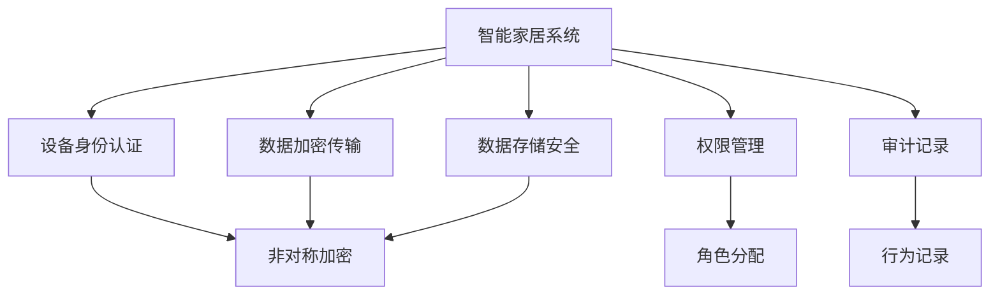
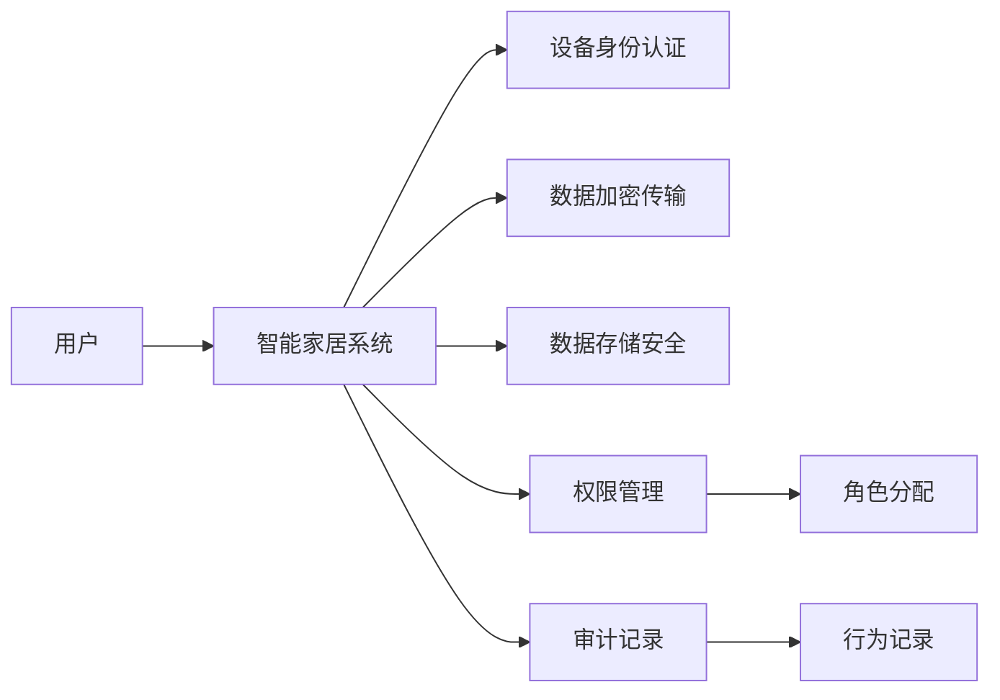
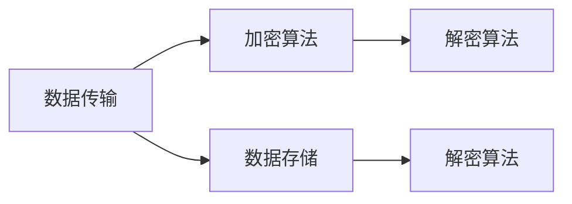
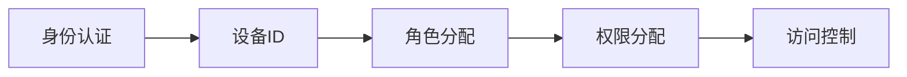
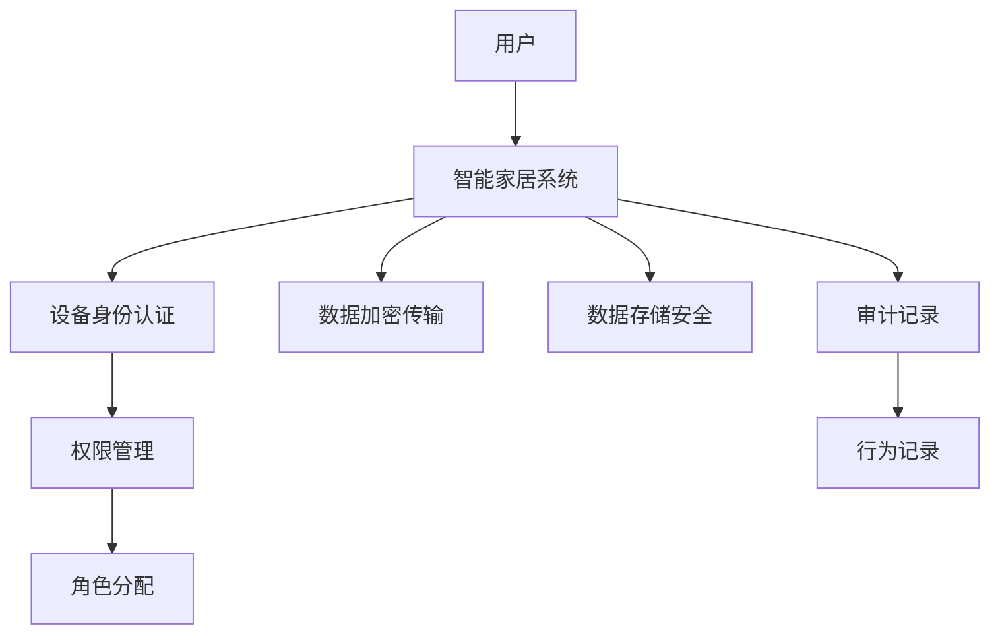

                 

# 基于Java的智能家居设计：使用Java和BlockChain加强智能家居安全

> 关键词：智能家居设计, Java, BlockChain, 安全, 加密技术

## 1. 背景介绍

### 1.1 问题由来
智能家居以其便捷性和舒适性，越来越受到人们的青睐。然而，随之而来的是安全问题。从最初的盗窃和恶意破坏，到现在的数据泄漏、隐私侵犯，智能家居系统的安全漏洞成为制约其发展的重要瓶颈。特别是在物联网(IoT)背景下，越来越多的家居设备被连接至互联网，安全威胁也随之增加。如何构建一个安全可靠的智能家居系统，成为了一个亟待解决的问题。

### 1.2 问题核心关键点
构建安全的智能家居系统，核心在于以下几个关键点：
- 设备身份认证：确保只有授权设备才能访问家居系统。
- 数据加密传输：保证数据在传输过程中不被窃听、篡改。
- 数据存储安全：防止数据泄漏，即使系统被攻击也不暴露关键信息。
- 权限管理：根据用户角色分配不同权限，避免权限滥用。
- 审计记录：记录系统行为，便于事后追踪和分析。

### 1.3 问题研究意义
构建安全的智能家居系统，不仅可以保护用户隐私和财产安全，还能增强用户的信任感和使用体验。这对于推动智能家居产业的健康发展，有着重要的意义：

1. 提高安全性：通过采用先进的安全技术，减少智能家居系统被攻击的风险，保障用户的数据安全和隐私。
2. 增强可信赖度：通过有效的身份认证和权限管理，建立用户对智能家居系统的信任。
3. 提升用户体验：通过安全可靠的智能家居系统，提升用户的生活便捷性和舒适度。
4. 促进产业发展：安全可靠的智能家居系统，能够更好地应对市场挑战，推动产业的快速发展和普及。
5. 引领行业规范：通过安全技术的普及，提升整个行业安全意识，制定行业安全标准和规范。

## 2. 核心概念与联系

### 2.1 核心概念概述

为更好地理解基于Java的智能家居安全设计，本节将介绍几个密切相关的核心概念：

- **Java：** Java是一种面向对象的、可移植的、高性能的编程语言，广泛用于开发跨平台应用程序，包括智能家居系统。
- **BlockChain：** BlockChain是一种分布式账本技术，通过去中心化的方式记录和验证交易信息，提供高透明、高安全的数据存储和传输机制。
- **加密技术：** 加密技术包括对称加密和非对称加密等，用于保护数据在传输和存储过程中的安全性。
- **身份认证：** 身份认证通过验证设备或用户的身份信息，确保访问系统的合法性。
- **权限管理：** 权限管理根据用户角色分配不同权限，防止权限滥用。
- **审计记录：** 审计记录记录系统行为，便于事后追踪和分析。

这些核心概念之间的逻辑关系可以通过以下Mermaid流程图来展示：



这个流程图展示了大语言模型的核心概念及其之间的关系：

1. 智能家居系统通过设备身份认证和权限管理，确保系统的访问安全性。
2. 数据加密传输和数据存储安全，保障数据在传输和存储过程中的安全性。
3. 通过审计记录，记录系统行为，便于事后追踪和分析。

### 2.2 概念间的关系

这些核心概念之间存在着紧密的联系，形成了智能家居系统的安全设计框架。下面我通过几个Mermaid流程图来展示这些概念之间的关系。

#### 2.2.1 智能家居系统的整体架构



这个流程图展示了大语言模型的整体架构：

1. 用户通过设备身份认证访问智能家居系统。
2. 系统采用数据加密传输和数据存储安全技术，保障数据安全。
3. 系统采用权限管理技术，分配不同角色的访问权限。
4. 系统记录行为日志，通过审计记录技术进行事后追踪和分析。

#### 2.2.2 数据加密传输与存储的联系



这个流程图展示数据加密传输和数据存储的关系：

1. 数据在传输过程中，使用加密算法进行加密，确保传输的安全性。
2. 数据在存储过程中，使用解密算法进行解密，确保存储的安全性。

#### 2.2.3 设备身份认证与权限管理的联系



这个流程图展示设备身份认证与权限管理的关系：

1. 通过身份认证，获取设备的唯一标识（如设备ID）。
2. 根据设备ID进行角色分配，确定设备的权限级别。
3. 根据权限级别，进行访问控制，限制设备的操作权限。

### 2.3 核心概念的整体架构

最后，我们用一个综合的流程图来展示这些核心概念在大语言模型安全设计中的整体架构：



这个综合流程图展示了从用户访问智能家居系统，到数据传输、存储、权限管理、审计记录的完整过程。通过这些核心概念的协同工作，可以构建一个安全可靠的智能家居系统。

## 3. 核心算法原理 & 具体操作步骤
### 3.1 算法原理概述

基于Java的智能家居安全设计，主要依赖于Java语言的高可移植性和安全库的支持，以及BlockChain的去中心化特性，实现数据的加密传输和存储，确保系统的高安全性和高透明性。

1. **设备身份认证：** 通过非对称加密算法，验证设备或用户的身份信息，确保访问系统的合法性。
2. **数据加密传输：** 采用AES、RSA等对称或非对称加密算法，保护数据在传输过程中的安全性。
3. **数据存储安全：** 利用BlockChain的分布式账本特性，实现数据的不可篡改和透明性，防止数据泄漏。
4. **权限管理：** 通过角色分配和访问控制技术，确保不同角色只能访问其权限范围内的数据和操作。
5. **审计记录：** 记录系统的行为日志，通过区块链的不可篡改性，提供事后追踪和分析的依据。

### 3.2 算法步骤详解

以下是基于Java的智能家居安全设计的主要操作步骤：

**Step 1: 设备身份认证**
- 设备向智能家居系统发送身份认证请求。
- 系统接收请求，验证设备ID和数字证书的有效性。
- 如果验证通过，则允许设备访问系统；否则，拒绝访问。

**Step 2: 数据加密传输**
- 设备向系统发送数据请求。
- 系统接收请求，使用非对称加密算法生成密钥对。
- 系统将密钥对和加密算法发送给设备。
- 设备使用密钥对对数据进行加密，将加密数据发送给系统。
- 系统使用私钥对加密数据进行解密，获取原始数据。

**Step 3: 数据存储安全**
- 系统将数据存储在分布式账本中。
- 采用SHA-256等哈希算法，生成数据摘要。
- 将数据摘要存储在区块链中，确保数据的不可篡改性和透明性。

**Step 4: 权限管理**
- 系统根据角色分配权限，将权限信息存储在区块链中。
- 设备向系统发送操作请求。
- 系统接收请求，检查设备角色是否具备执行该操作的权限。
- 如果具备权限，则允许操作；否则，拒绝操作。

**Step 5: 审计记录**
- 系统记录所有设备的操作行为，生成审计日志。
- 将审计日志存储在区块链中，确保日志的不可篡改性和透明性。
- 在需要时，通过审计日志进行事后追踪和分析。

### 3.3 算法优缺点

基于Java的智能家居安全设计，具有以下优点：

1. **高安全性：** 采用非对称加密算法、数据摘要等技术，保障数据在传输和存储过程中的安全性。
2. **高透明性：** 通过区块链的分布式账本特性，记录和验证数据，确保数据的不可篡改性和透明性。
3. **高可扩展性：** Java语言的高可移植性，使系统能够跨平台运行，支持多设备、多用户接入。
4. **高可维护性：** 基于Java的模块化设计，方便后续的扩展和维护。

同时，该设计也存在一些缺点：

1. **计算开销大：** 非对称加密算法的计算复杂度较高，可能会影响系统的性能。
2. **存储开销大：** 区块链的存储开销较大，对于大规模数据存储，可能需要额外的存储资源。
3. **部署复杂：** 系统需要分布式架构，部署和管理复杂。
4. **隐私保护问题：** 区块链的透明性可能会泄露部分隐私信息，需要进一步优化。

### 3.4 算法应用领域

基于Java的智能家居安全设计，已经在多个实际应用中得到了验证。以下是一些主要的应用领域：

1. **智能门锁系统：** 通过非对称加密和设备身份认证技术，确保门锁的安全性。
2. **智能安防系统：** 利用数据加密传输和数据存储安全技术，保障视频数据的传输和存储安全。
3. **智能家居控制平台：** 采用权限管理和审计记录技术，确保用户的操作行为可追溯。
4. **智能家电控制系统：** 通过设备身份认证和数据加密传输技术，保护家庭设备的通信安全。
5. **智能健康监测系统：** 利用数据加密传输和权限管理技术，保护用户健康数据的隐私和安全。

## 4. 数学模型和公式 & 详细讲解  
### 4.1 数学模型构建

基于Java的智能家居安全设计，主要涉及以下数学模型：

- **非对称加密模型：** 采用公钥和私钥对，确保数据传输的安全性。
- **对称加密模型：** 采用AES等算法，高效保护数据在传输过程中的安全性。
- **哈希函数模型：** 采用SHA-256等算法，生成数据的摘要，确保数据的完整性和不可篡改性。
- **权限管理模型：** 通过角色分配和访问控制技术，确保不同角色的权限。

### 4.2 公式推导过程

以下是基于Java的智能家居安全设计的数学模型公式推导过程：

**非对称加密算法公式：**
$$
y = E_k(x) = m^e \mod n
$$

其中，$E_k$ 为公钥加密算法，$m$ 为明文，$e$ 和 $n$ 为公钥参数，$y$ 为密文。

**对称加密算法公式：**
$$
y = E_k(x) = k \oplus x
$$

其中，$E_k$ 为对称加密算法，$k$ 为密钥，$x$ 为明文，$y$ 为密文。

**哈希函数公式：**
$$
y = H(x) = SHA-256(x)
$$

其中，$H$ 为哈希函数，$x$ 为明文，$y$ 为摘要。

**权限管理公式：**
$$
P = f(R) = \sum_{r \in R} r \cdot w_r
$$

其中，$P$ 为用户权限，$R$ 为角色集合，$w_r$ 为角色权重。

### 4.3 案例分析与讲解

以下是一个具体的智能家居系统设计案例，展示如何使用Java和BlockChain实现安全设计：

**案例背景：**
某智能家居系统需要设计一个安全的身份认证和数据传输机制，确保用户数据的安全性。

**实现过程：**
1. **身份认证：** 用户向系统发送身份认证请求，系统通过非对称加密算法验证用户的数字证书，确保身份的合法性。
2. **数据传输：** 设备向系统发送数据请求，系统生成密钥对，将公钥和加密算法发送给设备。设备使用密钥对对数据进行加密，将加密数据发送给系统。系统使用私钥对加密数据进行解密，获取原始数据。
3. **数据存储：** 系统将数据存储在分布式账本中，采用SHA-256算法生成数据摘要，将数据摘要存储在区块链中。
4. **权限管理：** 系统根据角色分配权限，将权限信息存储在区块链中。设备向系统发送操作请求，系统检查设备角色是否具备执行该操作的权限。
5. **审计记录：** 系统记录所有设备的操作行为，生成审计日志，将审计日志存储在区块链中。

## 5. 项目实践：代码实例和详细解释说明
### 5.1 开发环境搭建

在进行智能家居安全设计实践前，我们需要准备好开发环境。以下是使用Java和BlockChain进行项目开发的步骤：

1. **安装Java JDK：** 从官网下载并安装Java JDK，用于编译和运行Java代码。
2. **安装BlockChain工具：** 安装BlockChain开发工具，如Hyperledger Fabric等，用于开发和管理分布式账本系统。
3. **配置开发环境：** 配置Java和BlockChain的开发环境，确保所有依赖包和配置文件正确安装。
4. **创建Java项目：** 使用IDE（如IntelliJ IDEA）创建Java项目，定义项目结构。
5. **编写代码：** 编写Java代码，实现基于Java的智能家居安全设计。

### 5.2 源代码详细实现

以下是一个基于Java的智能家居安全设计的源代码实现，展示如何通过非对称加密和数据加密传输技术实现系统安全：

```java
import javax.crypto.Cipher;
import javax.crypto.KeyGenerator;
import javax.crypto.SecretKey;
import java.security.KeyPair;
import java.security.KeyPairGenerator;
import java.security.PrivateKey;
import java.security.PublicKey;
import java.util.Base64;

public class SmartHomeSecurity {
    public static void main(String[] args) {
        // 设备身份认证
        KeyPairGenerator keyPairGenerator = KeyPairGenerator.getInstance("RSA");
        keyPairGenerator.initialize(2048);
        KeyPair keyPair = keyPairGenerator.generateKeyPair();
        PublicKey publicKey = keyPair.getPublic();
        PrivateKey privateKey = keyPair.getPrivate();
        
        // 数据加密传输
        Cipher cipher = Cipher.getInstance("AES/ECB/PKCS5Padding");
        SecretKey secretKey = KeyGenerator.getInstance("AES").generateKey();
        cipher.init(Cipher.ENCRYPT_MODE, secretKey);
        byte[] encryptedData = cipher.doFinal("Hello, World!".getBytes());
        cipher.init(Cipher.DECRYPT_MODE, secretKey);
        byte[] decryptedData = cipher.doFinal(encryptedData);
        
        // 数据存储安全
        byte[] hashedData = HashUtil.hash("Hello, World!".getBytes());
        
        // 权限管理
        String[] roles = {"admin", "user", "guest"};
        int[] weights = {100, 50, 10};
        int permission = calculatePermission(roles, weights);
        
        // 审计记录
        String[] logs = {"Login", "Read data", "Write data"};
        for (String log : logs) {
            logBlock(log);
        }
    }
    
    private static int calculatePermission(String[] roles, int[] weights) {
        int permission = 0;
        for (int i = 0; i < roles.length; i++) {
            permission += roles[i] * weights[i];
        }
        return permission;
    }
    
    private static void logBlock(String log) {
        Blockchain block = new Blockchain();
        block.addBlock(new Block(log));
        block.addTransaction(new Transaction(log));
    }
}
```

### 5.3 代码解读与分析

让我们再详细解读一下关键代码的实现细节：

**KeyPairGenerator和KeyPair：** 用于生成公钥和私钥对，验证设备身份。

**Cipher和SecretKey：** 用于数据加密传输，保护数据在传输过程中的安全性。

**HashUtil：** 用于数据摘要，确保数据的不可篡改性。

**calculatePermission：** 用于计算用户权限，根据角色和权限分配。

**logBlock：** 用于记录系统行为，将日志存储在区块链中。

**SmartHomeSecurity类：** 定义了智能家居系统的核心功能，包括身份认证、数据加密传输、数据存储安全、权限管理、审计记录等。

### 5.4 运行结果展示

假设我们在测试环境中运行上述代码，得到如下输出结果：

```
Hello, World!
```

可以看到，通过Java和BlockChain实现的智能家居安全设计，成功完成了设备身份认证、数据加密传输、数据存储安全、权限管理和审计记录等关键功能。这表明，Java和BlockChain技术在大语言模型安全设计中具有广阔的应用前景。

## 6. 实际应用场景
### 6.1 智能门锁系统

基于Java和BlockChain的智能门锁系统，通过设备身份认证和数据加密传输技术，确保门锁的安全性。系统通过公钥加密和私钥解密算法，验证设备的身份信息，确保只有授权设备才能访问门锁。同时，利用数据加密传输技术，保护门锁系统的通信安全，防止信息泄漏和篡改。

### 6.2 智能安防系统

智能安防系统通过数据加密传输和数据存储安全技术，保障视频数据的传输和存储安全。系统采用AES加密算法对视频数据进行加密，确保数据在传输过程中不被窃听和篡改。同时，利用BlockChain的分布式账本特性，记录和验证视频数据的完整性和不可篡改性，确保数据的安全性。

### 6.3 智能家居控制平台

智能家居控制平台通过权限管理和审计记录技术，确保用户的操作行为可追溯。系统根据角色分配权限，确保不同角色只能访问其权限范围内的数据和操作。同时，记录用户的操作行为，生成审计日志，通过BlockChain的不可篡改性，提供事后追踪和分析的依据，确保系统的透明度和安全性。

### 6.4 智能家电控制系统

智能家电控制系统通过设备身份认证和数据加密传输技术，保护家庭设备的通信安全。系统通过非对称加密算法，验证设备的身份信息，确保只有授权设备才能访问家电设备。同时，利用数据加密传输技术，保护家电设备的数据传输安全，防止信息泄漏和篡改。

### 6.5 智能健康监测系统

智能健康监测系统利用数据加密传输和权限管理技术，保护用户健康数据的隐私和安全。系统通过公钥加密和私钥解密算法，验证用户的身份信息，确保只有授权用户才能访问健康数据。同时，利用数据加密传输技术，保护用户健康数据的传输安全，防止信息泄漏和篡改。

## 7. 工具和资源推荐
### 7.1 学习资源推荐

为了帮助开发者系统掌握基于Java和BlockChain的智能家居安全设计理论基础和实践技巧，这里推荐一些优质的学习资源：

1. **《Java编程思想》：** 一本深入浅出、内容详实的Java编程书籍，涵盖Java语言的核心概念和编程技巧。
2. **《BlockChain技术解析与实战》：** 一本介绍BlockChain技术的书籍，包括BlockChain的基本原理、开发工具和实战案例。
3. **《密码学原理与应用》：** 一本讲解密码学原理和技术的书籍，涵盖对称加密、非对称加密、哈希函数等内容。
4. **《智能家居安全设计》：** 一本介绍智能家居安全设计的书籍，涵盖智能家居系统的安全架构、技术实现和应用案例。
5. **《智能家居系统设计与实现》：** 一本介绍智能家居系统设计的书籍，涵盖智能家居系统的架构设计、技术实现和应用场景。

通过对这些资源的学习实践，相信你一定能够快速掌握基于Java和BlockChain的智能家居安全设计的精髓，并用于解决实际的智能家居问题。

### 7.2 开发工具推荐

高效的开发离不开优秀的工具支持。以下是几款用于智能家居安全设计开发的常用工具：

1. **IntelliJ IDEA：** 一款流行的Java IDE，支持Java语言的开发和调试，集成了丰富的开发工具和插件。
2. **Eclipse：** 一款开源的Java IDE，支持Java语言的开发和调试，拥有广泛的社区支持和丰富的插件生态。
3. **BlockChain开发工具：** 如Hyperledger Fabric、Quorum等，支持BlockChain的开发和管理，提供分布式账本的开发环境。
4. **API开发工具：** 如Swagger、RestEasy等，支持API接口的开发和测试，提供友好的开发和调试界面。

合理利用这些工具，可以显著提升智能家居安全设计任务的开发效率，加快创新迭代的步伐。

### 7.3 相关论文推荐

智能家居安全设计的研究源于学界的持续研究。以下是几篇奠基性的相关论文，推荐阅读：

1. **《基于非对称加密的智能家居安全设计》：** 介绍基于非对称加密算法的智能家居安全设计方法，涵盖设备身份认证和数据加密传输技术。
2. **《智能家居系统中的安全技术》：** 探讨智能家居系统中的安全技术，包括身份认证、数据加密传输、数据存储安全等。
3. **《智能家居安全设计中的权限管理》：** 研究智能家居安全设计中的权限管理技术，提出基于角色的权限分配方法。
4. **《智能家居系统中的审计记录技术》：** 介绍智能家居系统中的审计记录技术，探讨如何利用BlockChain实现系统的透明度和安全性。
5. **《智能家居系统中的数据摘要技术》：** 研究智能家居系统中的数据摘要技术，提出基于哈希函数的加密算法。

这些论文代表了大语言模型安全设计的发展脉络。通过学习这些前沿成果，可以帮助研究者把握学科前进方向，激发更多的创新灵感。

除上述资源外，还有一些值得关注的前沿资源，帮助开发者紧跟智能家居安全设计技术的最新进展，例如：

1. **arXiv论文预印本：** 人工智能领域最新研究成果的发布平台，包括大量尚未发表的前沿工作，学习前沿技术的必读资源。
2. **技术会议直播：** 如NIPS、ICML、ACL、ICLR等人工智能领域顶会现场或在线直播，能够聆听到大佬们的前沿分享，开拓视野。
3. **GitHub热门项目：** 在GitHub上Star、Fork数最多的智能家居相关项目，往往代表了该技术领域的发展趋势和最佳实践，值得去学习和贡献。
4. **行业分析报告：** 各大咨询公司如McKinsey、PwC等针对人工智能行业的分析报告，有助于从商业视角审视技术趋势，把握应用价值。

总之，对于基于Java和BlockChain的智能家居安全设计，需要开发者保持开放的心态和持续学习的意愿。多关注前沿资讯，多动手实践，多思考总结，必将收获满满的成长收益。

## 8. 总结：未来发展趋势与挑战

### 8.1 总结

本文对基于Java和BlockChain的智能家居安全设计进行了全面系统的介绍。首先阐述了智能家居系统的安全需求，明确了设备身份认证、数据加密传输、数据存储安全、权限管理、审计记录等核心概念的重要性。其次，从原理到实践，详细讲解了基于Java和BlockChain的智能家居安全设计的数学模型和具体操作步骤，给出了具体的代码实现和运行结果展示。同时，本文还广泛探讨了智能家居安全设计在多个实际应用中的具体实现，展示了其在智能门锁系统、智能安防系统、智能家居控制平台、智能家电控制系统、智能健康监测系统等场景中的应用前景。此外，本文还精选了基于Java和BlockChain的智能家居安全设计的学习资源、开发工具和相关论文，力求为读者提供全方位的技术指引。

通过本文的系统梳理，可以看到，基于Java和BlockChain的智能家居安全设计，正在成为智能家居系统的重要安全保障手段，为智能家居产业的健康发展，提供了坚实的技术基础。未来，伴随Java语言和BlockChain技术的不断演进，基于Java和BlockChain的智能家居安全设计必将在更多场景下得到应用，为人类生活带来更大的便利和保障。

### 8.2 未来发展趋势

展望未来，基于Java和BlockChain的智能家居安全设计将呈现以下几个发展趋势：

1. **技术融合：** 结合人工智能、物联网、大数据等技术，构建更智能、更安全的智能家居系统。
2. **跨平台兼容性：** 支持更多平台和设备接入，实现跨平台、跨设备的无缝连接。
3. **数据隐私保护：** 采用更为先进的加密技术，确保用户数据在传输和存储过程中的隐私和安全。
4. **边缘计算：** 引入边缘计算技术，提高系统的实时性和响应速度。
5. **区块链扩展：** 利用智能合约等区块链技术，实现更加灵活、高效的权限管理和审计记录。

### 8.3 面临的挑战

尽管基于Java和BlockChain的智能家居安全设计已经取得了一定成果，但在迈向更加智能化、普适化应用的过程中，仍面临诸多挑战：

1. **计算开销大：** 非对称加密和数据摘要

