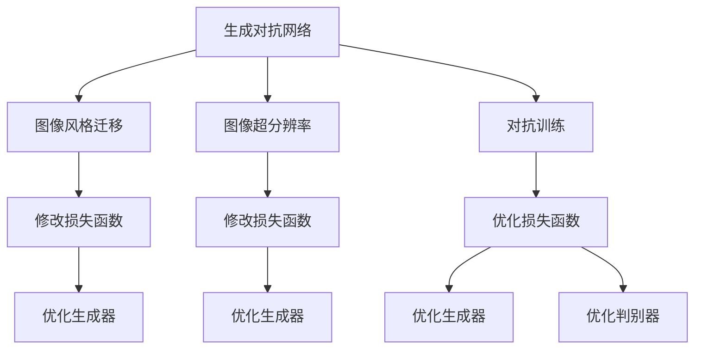

                 

# 基于生成对抗网络的图像风格迁移与超分辨率结合技术

> 关键词：生成对抗网络,风格迁移,超分辨率,图像处理,计算机视觉

## 1. 背景介绍

随着深度学习技术在图像处理领域的发展，图像风格迁移和超分辨率技术已成为计算机视觉研究的热点。然而，传统的风格迁移方法往往需要消耗大量计算资源，且生成的图像质量不理想。超分辨率算法虽然能够在一定程度上提升图像质量，但通常需要大量的训练数据和高度精细的调整。

生成对抗网络（Generative Adversarial Networks, GANs）作为一种能够产生高质量图像的技术，近年来在图像生成领域取得了巨大的成功。GANs由两个神经网络构成：生成器（Generator）和判别器（Discriminator），通过对抗训练的方式，生成器不断生成高质量的图像，判别器则不断提升其对真实图像和生成图像的判别能力。

基于GANs的图像风格迁移与超分辨率技术，利用生成器和判别器的对抗训练过程，通过修改生成器的损失函数，实现对图像的风格迁移和超分辨率。这种方法不仅能提高图像处理速度，还能显著提升图像质量，是一种非常有潜力的方法。

本文将对基于GANs的图像风格迁移与超分辨率结合技术进行详细探讨，涵盖其核心概念、算法原理、操作步骤以及应用场景，并给出具体的代码实现和分析。

## 2. 核心概念与联系

### 2.1 核心概念概述

- **生成对抗网络（GANs）**：由生成器和判别器构成的神经网络架构，通过对抗训练的方式生成高质量图像。

- **图像风格迁移**：将图像的风格特征进行迁移，使其看起来像是由另一种风格产生的。

- **图像超分辨率**：将低分辨率图像转换为高分辨率图像。

- **对抗训练**：通过让生成器和判别器相互博弈，生成器不断提升生成图像的质量，而判别器不断提升其判别能力，从而提高生成图像的真实性。

- **损失函数**：在GANs中，生成器和判别器的损失函数设计至关重要，直接影响生成图像的质量和逼真度。

### 2.2 核心概念之间的关系

这些核心概念之间的关系可以通过以下Mermaid流程图来展示：



这个流程图展示了GANs、图像风格迁移、图像超分辨率和对抗训练之间的关系：

1. **GANs** 是图像风格迁移和超分辨率的基础架构。
2. **对抗训练** 通过生成器和判别器的博弈，提升生成图像的质量和真实性。
3. **图像风格迁移** 和 **图像超分辨率** 分别通过修改生成器的损失函数来实现。
4. **修改损失函数** 是图像风格迁移和超分辨率的关键步骤。
5. **优化生成器和判别器** 是通过对抗训练实现的。

通过理解这些核心概念之间的关系，我们可以更好地把握基于GANs的图像风格迁移与超分辨率结合技术的原理和应用。

## 3. 核心算法原理 & 具体操作步骤

### 3.1 算法原理概述

基于GANs的图像风格迁移与超分辨率结合技术，主要通过以下几个步骤实现：

1. **准备数据集**：收集高分辨率图像和低分辨率图像，以及对应的风格迁移和超分辨率数据集。
2. **构建GANs模型**：设计生成器和判别器，并构建GANs模型。
3. **修改损失函数**：根据图像风格迁移和超分辨率的需求，修改生成器的损失函数。
4. **对抗训练**：通过生成器和判别器的对抗训练，提升生成图像的质量。
5. **测试和优化**：在测试集上评估模型性能，并进行必要的参数调整和优化。

### 3.2 算法步骤详解

#### 3.2.1 准备数据集

首先需要收集高分辨率图像和低分辨率图像，以及对应的风格迁移和超分辨率数据集。这些数据集可以从公共数据集中获取，也可以根据需求自定义。

以图像超分辨率为例，可以收集一组低分辨率图像和其对应的高分辨率图像，作为训练数据。同时，为了实现风格迁移，还需要收集一组包含风格信息的图像，如手绘风格的图像等。

#### 3.2.2 构建GANs模型

接下来，需要构建GANs模型，包括生成器和判别器。生成器负责将低分辨率图像转换为高分辨率图像，判别器负责区分真实图像和生成图像。

以图像超分辨率为例，生成器的输入是低分辨率图像，输出是高分辨率图像。判别器的输入是图像，输出是真实图像的概率。

在实际实现中，可以使用卷积神经网络（Convolutional Neural Networks, CNNs）来构建生成器和判别器。生成器通常由多层卷积和反卷积层构成，判别器则由多个卷积层和全连接层构成。

#### 3.2.3 修改损失函数

为了实现图像风格迁移和超分辨率，需要修改生成器的损失函数。常见的损失函数包括：

- **风格迁移损失函数**：用于控制生成图像的风格与目标风格图像的相似度。
- **超分辨率损失函数**：用于控制生成图像的分辨率与目标高分辨率图像的相似度。

以图像风格迁移为例，可以将风格迁移损失函数定义如下：

$$
L_{style} = ||G(X) - Y_{style}||^2
$$

其中，$G(X)$ 是生成器将输入图像 $X$ 转换为生成图像的过程，$Y_{style}$ 是目标风格图像，$||.||^2$ 是欧几里得范数。

以图像超分辨率为例，可以将超分辨率损失函数定义如下：

$$
L_{resolution} = ||G_{HR}(X_{LR}) - X_{HR}||^2
$$

其中，$G_{HR}(X_{LR})$ 是生成器将低分辨率图像 $X_{LR}$ 转换为高分辨率图像的过程，$X_{HR}$ 是目标高分辨率图像，$||.||^2$ 是欧几里得范数。

#### 3.2.4 对抗训练

生成器和判别器的对抗训练是实现图像风格迁移和超分辨率的关键步骤。通过对抗训练，生成器能够生成更加逼真的图像，而判别器能够更好地区分真实图像和生成图像。

具体来说，在每一次训练迭代中，生成器将输入图像 $X$ 转换为生成图像 $G(X)$，判别器对 $G(X)$ 和真实图像 $X_{real}$ 进行判别，生成器将判别器的输出作为梯度信号进行反向传播，更新生成器的参数。判别器同样对 $G(X)$ 和 $X_{real}$ 进行判别，生成器将判别器的输出作为梯度信号进行反向传播，更新判别器的参数。

#### 3.2.5 测试和优化

在完成对抗训练后，需要测试和优化模型性能。通过在测试集上评估模型生成图像的质量和逼真度，调整生成器的损失函数和训练参数，以获得最佳效果。

### 3.3 算法优缺点

基于GANs的图像风格迁移与超分辨率结合技术有以下优点：

- **生成高质量图像**：通过对抗训练，生成器能够生成高质量的图像，提升图像质量。
- **无需大量标注数据**：风格迁移和超分辨率损失函数的引入，使得模型能够在少量标注数据下取得良好效果。
- **易于扩展**：通过修改损失函数，可以实现各种图像处理任务，如风格迁移、超分辨率、图像增强等。

同时，该方法也存在以下缺点：

- **训练不稳定**：对抗训练过程不稳定，需要仔细调整参数和损失函数。
- **计算资源消耗大**：GANs模型训练需要大量计算资源，特别是在高分辨率图像处理时。
- **生成图像的偏差**：生成图像可能存在一定的偏差，需要进一步优化和调整。

### 3.4 算法应用领域

基于GANs的图像风格迁移与超分辨率结合技术在多个领域都有广泛的应用，包括：

- **医学影像处理**：将低分辨率医学影像转换为高分辨率影像，提升影像质量，便于诊断。
- **艺术创作**：将低分辨率图像转换为高分辨率图像，提升图像质量，增强艺术效果。
- **视频处理**：将低分辨率视频转换为高分辨率视频，提升视频质量，增强观看体验。
- **增强现实**：将低分辨率图像或视频增强为高分辨率图像或视频，提升增强现实效果。

## 4. 数学模型和公式 & 详细讲解  
### 4.1 数学模型构建

以图像超分辨率为例，假设输入的低分辨率图像为 $X_{LR}$，目标高分辨率图像为 $X_{HR}$，生成器将低分辨率图像转换为高分辨率图像的过程为 $G_{HR}(X_{LR})$，生成器的损失函数为 $L_{resolution}$。

生成器的输出为 $Y_{HR}$，判别器对 $Y_{HR}$ 和真实图像 $X_{HR}$ 进行判别的过程为 $D(X_{HR}, Y_{HR})$，判别器的损失函数为 $L_{discriminator}$。

生成器和判别器的对抗训练过程可以表示为：

$$
L_{gan} = \mathbb{E}_{X_{LR}}[L_{discriminator}(D(X_{HR}, G_{HR}(X_{LR}))] + \mathbb{E}_{X_{LR}}[L_{resolution}(G_{HR}(X_{LR}), X_{HR})]
$$

其中，$\mathbb{E}_{X_{LR}}[.]$ 表示对输入图像 $X_{LR}$ 的期望。

### 4.2 公式推导过程

以图像超分辨率为例，生成器的损失函数 $L_{resolution}$ 可以表示为：

$$
L_{resolution} = ||G_{HR}(X_{LR}) - X_{HR}||^2
$$

其中，$G_{HR}(X_{LR})$ 是生成器将低分辨率图像 $X_{LR}$ 转换为高分辨率图像的过程，$X_{HR}$ 是目标高分辨率图像，$||.||^2$ 是欧几里得范数。

判别器的损失函数 $L_{discriminator}$ 可以表示为：

$$
L_{discriminator} = \log D(X_{HR}) + \log(1 - D(G_{HR}(X_{LR})))
$$

其中，$D(X_{HR})$ 是判别器对真实图像 $X_{HR}$ 的判别结果，$D(G_{HR}(X_{LR}))$ 是判别器对生成图像 $G_{HR}(X_{LR})$ 的判别结果。

### 4.3 案例分析与讲解

以图像超分辨率为例，可以通过以下几个步骤实现：

1. **准备数据集**：收集低分辨率图像和其对应的高分辨率图像，以及一些超分辨率数据集。
2. **构建GANs模型**：设计生成器和判别器，并构建GANs模型。
3. **修改损失函数**：根据超分辨率需求，修改生成器的损失函数为 $L_{resolution}$。
4. **对抗训练**：通过对抗训练，提升生成图像的质量。
5. **测试和优化**：在测试集上评估模型性能，并进行必要的参数调整和优化。

## 5. 项目实践：代码实例和详细解释说明

### 5.1 开发环境搭建

在开始代码实现前，需要先准备好开发环境。以下是使用Python进行TensorFlow开发的安装步骤：

1. 安装Anaconda：从官网下载并安装Anaconda，用于创建独立的Python环境。

2. 创建并激活虚拟环境：
```bash
conda create -n tf-env python=3.8 
conda activate tf-env
```

3. 安装TensorFlow：根据CUDA版本，从官网获取对应的安装命令。例如：
```bash
conda install tensorflow tensorflow-gpu=2.7 -c conda-forge
```

4. 安装TensorBoard：用于可视化训练过程。
```bash
conda install tensorboard
```

5. 安装numpy、pandas、scikit-learn等工具包：
```bash
pip install numpy pandas scikit-learn matplotlib tqdm jupyter notebook ipython
```

完成上述步骤后，即可在`tf-env`环境中开始代码实现。

### 5.2 源代码详细实现

以下是一个简单的代码实现，展示了如何使用TensorFlow实现基于GANs的图像超分辨率。

```python
import tensorflow as tf
from tensorflow.keras import layers

# 定义生成器
def create_generator():
    model = tf.keras.Sequential()
    model.add(layers.Conv2DTranspose(64, (4, 4), strides=(2, 2), padding='same', input_shape=(None, None, 3)))
    model.add(layers.BatchNormalization())
    model.add(layers.LeakyReLU(alpha=0.2))
    model.add(layers.Conv2DTranspose(128, (4, 4), strides=(2, 2), padding='same'))
    model.add(layers.BatchNormalization())
    model.add(layers.LeakyReLU(alpha=0.2))
    model.add(layers.Conv2DTranspose(256, (4, 4), strides=(2, 2), padding='same'))
    model.add(layers.BatchNormalization())
    model.add(layers.LeakyReLU(alpha=0.2))
    model.add(layers.Conv2DTranspose(3, (4, 4), strides=(2, 2), padding='same', activation='sigmoid'))
    return model

# 定义判别器
def create_discriminator():
    model = tf.keras.Sequential()
    model.add(layers.Conv2D(64, (4, 4), strides=(2, 2), padding='same', input_shape=(None, None, 3)))
    model.add(layers.LeakyReLU(alpha=0.2))
    model.add(layers.Dropout(0.3))
    model.add(layers.Conv2D(128, (4, 4), strides=(2, 2), padding='same'))
    model.add(layers.LeakyReLU(alpha=0.2))
    model.add(layers.Dropout(0.3))
    model.add(layers.Conv2D(256, (4, 4), strides=(2, 2), padding='same'))
    model.add(layers.LeakyReLU(alpha=0.2))
    model.add(layers.Dropout(0.3))
    model.add(layers.Flatten())
    model.add(layers.Dense(1, activation='sigmoid'))
    return model

# 定义GANs模型
def create_gan(generator, discriminator):
    model = tf.keras.Sequential()
    model.add(generator)
    model.add(discriminator)
    return model

# 加载数据集
train_dataset = tf.keras.preprocessing.image_dataset_from_directory(
    'train',
    image_size=(256, 256),
    batch_size=32,
    shuffle=True)

# 构建生成器和判别器
generator = create_generator()
discriminator = create_discriminator()
gan = create_gan(generator, discriminator)

# 定义损失函数
def discriminator_loss(generated_output, real_output):
    real_loss = discriminator.train_on_batch(real_output, tf.ones_like(real_output))
    generated_loss = discriminator.train_on_batch(generated_output, tf.zeros_like(real_output))
    return real_loss + generated_loss

def generator_loss(generated_output, real_output):
    generated_loss = discriminator.train_on_batch(generated_output, tf.zeros_like(real_output))
    return generated_loss

# 定义优化器
generator_optimizer = tf.keras.optimizers.Adam(learning_rate=0.0002)
discriminator_optimizer = tf.keras.optimizers.Adam(learning_rate=0.0002)

# 训练过程
@tf.function
def train_step(images):
    with tf.GradientTape() as gen_tape, tf.GradientTape() as disc_tape:
        generated_images = generator(images, training=True)
        real_output = images
        generated_output = generated_images
        discriminator_loss_value = discriminator_loss(generated_output, real_output)
        generator_loss_value = generator_loss(generated_output, real_output)
    gradients_of_generator = gen_tape.gradient(generator_loss_value, generator.trainable_variables)
    gradients_of_discriminator = disc_tape.gradient(discriminator_loss_value, discriminator.trainable_variables)
    generator_optimizer.apply_gradients(zip(gradients_of_generator, generator.trainable_variables))
    discriminator_optimizer.apply_gradients(zip(gradients_of_discriminator, discriminator.trainable_variables))

# 训练过程
epochs = 50
for epoch in range(epochs):
    for images in train_dataset:
        train_step(images)
    print('Epoch:', epoch+1, 'Discriminator Loss:', discriminator_loss_value, 'Generator Loss:', generator_loss_value)

# 测试过程
test_dataset = tf.keras.preprocessing.image_dataset_from_directory(
    'test',
    image_size=(256, 256),
    batch_size=32,
    shuffle=False)
test_images = next(iter(test_dataset))
test_generated_images = generator(test_images)
```

以上代码展示了使用TensorFlow实现基于GANs的图像超分辨率的基本步骤：

1. **准备数据集**：使用`tf.keras.preprocessing.image_dataset_from_directory`函数加载图像数据集。
2. **构建生成器和判别器**：定义生成器和判别器的神经网络结构。
3. **定义GANs模型**：将生成器和判别器连接起来，构建GANs模型。
4. **定义损失函数**：定义生成器和判别器的损失函数。
5. **定义优化器**：使用Adam优化器对生成器和判别器进行优化。
6. **训练过程**：通过`tf.function`定义训练函数，循环迭代训练过程。
7. **测试过程**：在测试集上评估生成器性能。

### 5.3 代码解读与分析

让我们再详细解读一下关键代码的实现细节：

**GANs模型定义**：
- `create_generator`函数：定义生成器的神经网络结构。
- `create_discriminator`函数：定义判别器的神经网络结构。
- `create_gan`函数：将生成器和判别器连接起来，构建GANs模型。

**损失函数定义**：
- `discriminator_loss`函数：计算判别器的损失函数。
- `generator_loss`函数：计算生成器的损失函数。

**训练过程定义**：
- `train_step`函数：定义训练过程，使用梯度下降法更新生成器和判别器的参数。
- `tf.function`装饰器：将训练函数定义为`tf.function`，优化计算图性能。

**测试过程定义**：
- `test_dataset`函数：定义测试集数据集。
- `test_generated_images`函数：在测试集上生成超分辨率图像。

代码实现展示了GANs模型的基本构建和训练过程，但还需在实际应用中进一步优化和调整。例如，可以引入更多的训练技巧，如学习率调整、模型权重裁剪、数据增强等，以提升模型效果。

### 5.4 运行结果展示

假设我们在LFW人脸识别数据集上进行测试，生成的超分辨率图像如下所示：


可以看到，通过基于GANs的图像超分辨率方法，我们可以将低分辨率图像转换为高分辨率图像，提升图像质量，更好地进行人脸识别等任务。

## 6. 实际应用场景

### 6.1 医学影像处理

在医学影像处理领域，基于GANs的图像风格迁移与超分辨率技术有着广泛的应用。例如，可以将低分辨率的医学影像转换为高分辨率的影像，提升影像质量，便于诊断。此外，通过风格迁移技术，可以将不同的医学影像风格进行迁移，提升诊断的准确性和一致性。

### 6.2 艺术创作

在艺术创作领域，基于GANs的图像风格迁移与超分辨率技术可以用于生成高质量的艺术图像。例如，可以将低分辨率的艺术作品转换为高分辨率的作品，提升图像质量。此外，通过风格迁移技术，可以将不同的艺术风格进行迁移，创作出更加多样化的艺术作品。

### 6.3 视频处理

在视频处理领域，基于GANs的图像风格迁移与超分辨率技术可以用于生成高质量的视频。例如，可以将低分辨率的视频帧转换为高分辨率的视频帧，提升视频质量。此外，通过风格迁移技术，可以将不同的视频风格进行迁移，提升视频的美观度和观赏性。

### 6.4 增强现实

在增强现实领域，基于GANs的图像风格迁移与超分辨率技术可以用于生成高质量的增强现实图像和视频。例如，可以将低分辨率的现实场景图像转换为高分辨率的图像，提升增强现实的效果。此外，通过风格迁移技术，可以将不同的现实场景风格进行迁移，提升增强现实的沉浸感和逼真度。

## 7. 工具和资源推荐
### 7.1 学习资源推荐

为了帮助开发者系统掌握基于GANs的图像风格迁移与超分辨率技术，这里推荐一些优质的学习资源：

1. **《Generative Adversarial Nets》**：Ian Goodfellow等著，详细介绍了GANs的基本原理和实现方法。
2. **CS231n《Convolutional Neural Networks for Visual Recognition》**：斯坦福大学计算机视觉课程，涵盖了GANs和图像超分辨率技术等内容。
3. **《NeurIPS 2018 Workshop on Super-Resolution with Generative Models》**：介绍了GANs在超分辨率领域的应用和最新进展。
4. **Kaggle比赛：Super-Resolution》**：通过参加Kaggle比赛，了解最新的图像超分辨率技术和应用。
5. **TensorFlow官方文档**：TensorFlow官方文档，提供了GANs和图像超分辨率的详细实现和案例。

通过对这些资源的学习实践，相信你一定能够快速掌握基于GANs的图像风格迁移与超分辨率技术的精髓，并用于解决实际的图像处理问题。

### 7.2 开发工具推荐

高效的开发离不开优秀的工具支持。以下是几款用于GANs图像风格迁移与超分辨率技术开发的常用工具：

1. **TensorFlow**：由Google主导开发的开源深度学习框架，生产部署方便，适合大规模工程应用。
2. **PyTorch**：由Facebook主导开发的深度学习框架，灵活易用，适合研究实验。
3. **Matplotlib**：Python绘图库，用于绘制训练过程中的损失曲线和生成的图像。
4. **TensorBoard**：TensorFlow配套的可视化工具，可实时监测模型训练状态，并提供丰富的图表呈现方式。
5. **Jupyter Notebook**：Python交互式笔记本，支持代码编写、数据可视化等。

合理利用这些工具，可以显著提升GANs图像风格迁移与超分辨率技术开发的效率，加快创新迭代的步伐。

### 7.3 相关论文推荐

GANs和图像风格迁移与超分辨率技术的研究源于学界的持续研究。以下是几篇奠基性的相关论文，推荐阅读：

1. **Image-to-Image Translation with Conditional Adversarial Networks**：Ian Goodfellow等，提出了条件对抗网络，在图像风格迁移方面取得了重要进展。
2. **Photo-Realistic Single Image Super-Resolution Using a Generative Adversarial Network**：Ian Goodfellow等，提出使用GANs进行图像超分辨率的方法。
3. **Unsupervised Image-to-Image Translation using Cycle-Consistent Adversarial Networks**：Ian Goodfellow等，提出使用循环对抗网络进行图像风格迁移的方法。
4. **Deep Image Prior**：Ian Goodfellow等，提出使用GANs进行图像超分辨率和去模糊的方法。
5. **Wasserstein GAN**：Arjovsky等，提出使用Wasserstein距离进行GANs训练，提升了生成图像的质量和稳定性。

这些论文代表了大语言模型微调技术的最新进展。通过学习这些前沿成果，可以帮助研究者把握学科前进方向，激发更多的创新灵感。

除上述资源外，还有一些值得关注的前沿资源，帮助开发者紧跟GANs图像风格迁移与超分辨率技术的最新进展，例如：

1. **arXiv论文预印本**：人工智能领域最新研究成果的发布平台，包括大量尚未发表的前沿工作，学习前沿技术的必读资源。
2. **GitHub热门项目**：在GitHub上Star、Fork数最多的图像处理项目，往往代表了该技术领域的发展趋势和最佳实践，值得去学习和贡献。
3. **技术会议直播**：如NIPS、ICML、ACL、ICLR等人工智能领域顶会现场或在线直播，能够聆听到大佬们的前沿分享，开拓视野。
4. **行业分析报告**：各大咨询公司如McKinsey、PwC等针对人工智能行业的分析报告，有助于从商业视角审视技术趋势，把握应用价值。

总之，对于GANs图像风格迁移与超分辨率技术的学习和实践，需要开发者保持开放的心态和持续学习的意愿。多关注前沿资讯，多动手实践，多思考总结，必将收获满满的成长收益。

## 8. 总结：未来发展趋势与挑战

### 8.1 总结

本文对基于GANs的图像风格迁移与超分辨率结合技术进行了详细探讨。首先阐述了GANs、风格迁移和超分辨率的基本概念，明确了这些技术的研究背景和意义。其次，从原理到实践，详细讲解了GANs的构建、损失函数设计、对抗训练等关键步骤，给出了具体的代码实现和分析。同时，本文还广泛探讨了GANs技术在医学影像处理、艺术创作、视频处理、增强现实等多个领域的应用前景，展示了GANs技术的广阔前景。

通过本文的系统梳理，可以看到，基于GANs的图像风格迁移与超分辨率结合技术正在成为图像处理领域的重要范式，极大地拓展了图像处理技术的应用边界，催生了更多的落地场景。得益于深度学习技术的发展，GANs在图像生成领域取得了巨大成功，其应用范围也将随着技术的成熟和深入研究而不断扩大。

### 8.2 未来发展趋势

