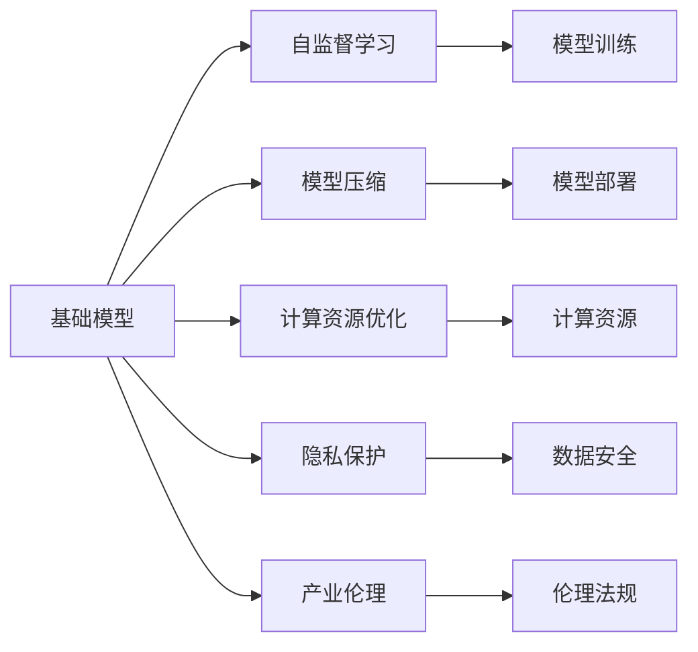
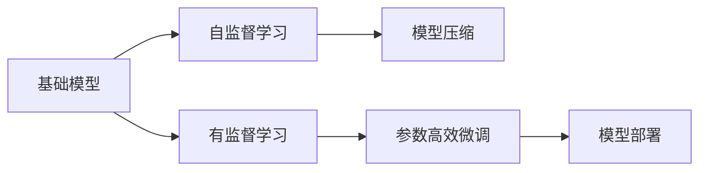
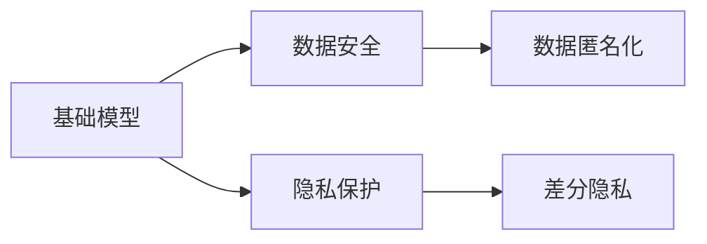
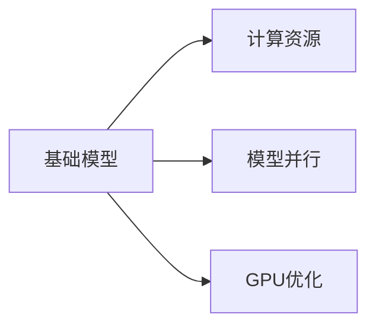
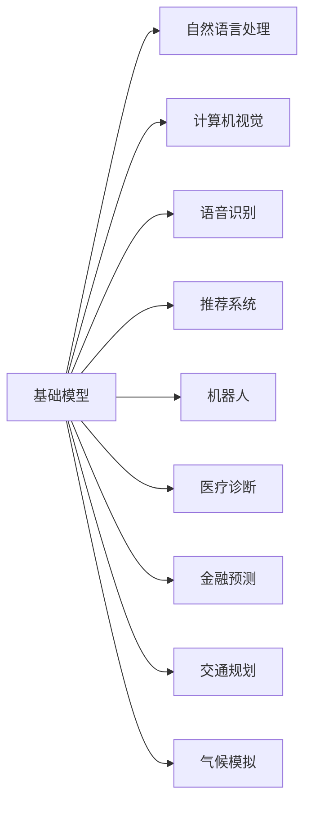
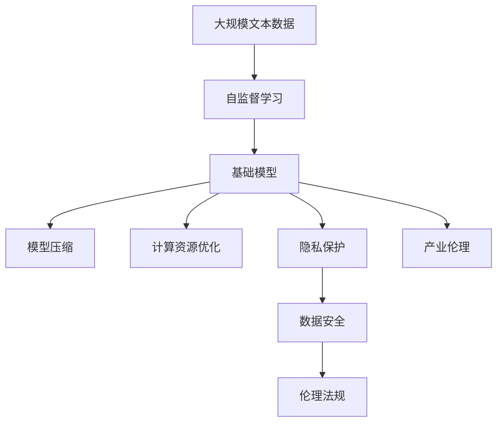

                 

# 基础模型在科技产业的影响

> 关键词：基础模型,科技产业,人工智能,深度学习,产业应用,模型压缩,算法优化,计算资源,隐私保护,技术标准,产业伦理

## 1. 背景介绍

### 1.1 问题由来
在过去的十年里，人工智能(AI)技术迅速发展，特别是深度学习模型的广泛应用，使得基础模型（Foundational Models）成为了科技产业的引擎。基础模型是那些能够自适应复杂环境，具备深度理解和自主决策能力的大型预训练模型，如BERT、GPT、ResNet等。这些模型通过大规模的数据训练，不仅提升了自身的性能，也推动了下游应用的繁荣。

### 1.2 问题核心关键点
基础模型对科技产业的影响主要体现在以下几个方面：
- 性能提升：通过自监督学习和大规模数据训练，基础模型在各种任务上取得了超越人类专家的表现，大幅提升了科技产业的生产效率和创新能力。
- 成本节约：基础模型减少了传统机器学习模型的开发和维护成本，加速了新应用场景的落地和迭代。
- 数据驱动：基础模型强调数据驱动的决策过程，使得科技产业能够更好地利用大数据资源，驱动技术进步。
- 创新激励：基础模型催生了许多新的研究领域和应用场景，促进了学术界和工业界的技术创新和交叉融合。
- 伦理挑战：基础模型在提升科技产业效率的同时，也带来了隐私保护、公平性、可解释性等伦理问题，需要在技术演进中逐步解决。

### 1.3 问题研究意义
基础模型对科技产业的影响，凸显了其在推动技术进步和产业升级中的关键作用。它不仅提升了科技产业的技术水平，还为解决社会问题提供了新思路。然而，随着基础模型在更多领域的深入应用，其带来的伦理和社会挑战也日益凸显。因此，研究基础模型的影响，对于理解科技产业的变迁，制定相应的政策法规，具有重要意义。

## 2. 核心概念与联系

### 2.1 核心概念概述

为了更好地理解基础模型对科技产业的影响，本节将介绍几个密切相关的核心概念：

- 基础模型（Foundational Models）：通过大规模数据训练，能够自主学习和适应复杂环境的大型预训练模型。如BERT、GPT等。
- 自监督学习（Self-supervised Learning）：利用数据本身的结构信息进行学习，无需标注数据，广泛应用于基础模型的预训练中。
- 模型压缩（Model Compression）：在保证模型性能的前提下，通过剪枝、量化等技术减小模型大小，降低计算资源需求。
- 计算资源优化（Resource Optimization）：通过模型并行、GPU优化等手段，提高模型推理和训练的速度，减少计算成本。
- 隐私保护（Privacy Preservation）：在基础模型训练和应用中，保护用户数据的隐私安全，避免数据泄露。
- 产业伦理（Industrial Ethics）：在基础模型应用过程中，遵循道德准则，确保技术应用的正当性和安全性。

这些核心概念之间存在着紧密的联系，构成了基础模型影响科技产业的完整生态系统。下面通过几个Mermaid流程图来展示这些概念之间的关系。



这个流程图展示了基础模型在科技产业中的应用生态：

1. 基础模型通过自监督学习进行预训练，学习到丰富的知识。
2. 通过模型压缩和计算资源优化技术，减少计算资源需求，提升模型部署效率。
3. 在隐私保护和产业伦理的约束下，确保数据安全和技术应用的正当性。

通过这些概念的深入理解，我们可以更好地把握基础模型对科技产业的影响及其演进方向。

### 2.2 概念间的关系

这些核心概念之间存在着紧密的联系，形成了基础模型对科技产业影响的完整生态系统。下面我们通过几个Mermaid流程图来展示这些概念之间的关系。

#### 2.2.1 基础模型的学习范式



这个流程图展示了基础模型的学习范式，包括自监督学习、有监督学习和参数高效微调等。

#### 2.2.2 隐私保护与基础模型的关系



这个流程图展示了隐私保护与基础模型的关系，包括数据匿名化和差分隐私等技术。

#### 2.2.3 计算资源优化与基础模型的关系



这个流程图展示了计算资源优化与基础模型的关系，包括模型并行和GPU优化等技术。

#### 2.2.4 基础模型的应用领域



这个流程图展示了基础模型在多个应用领域中的广泛应用。

### 2.3 核心概念的整体架构

最后，我们用一个综合的流程图来展示这些核心概念在大语言模型微调过程中的整体架构：



这个综合流程图展示了从预训练到模型压缩，再到隐私保护和产业伦理的完整过程。基础模型通过自监督学习进行预训练，然后通过模型压缩和计算资源优化技术，减少计算资源需求，提升模型部署效率。在隐私保护和产业伦理的约束下，确保数据安全和技术应用的正当性。通过这些流程图，我们可以更清晰地理解基础模型对科技产业的影响及其演进方向。

## 3. 核心算法原理 & 具体操作步骤
### 3.1 算法原理概述

基础模型的核心算法原理包括自监督学习、模型压缩、计算资源优化、隐私保护和产业伦理等。以下将对每个核心算法的原理进行详细讲解。

### 3.2 算法步骤详解

#### 3.2.1 自监督学习

自监督学习通过利用数据本身的结构信息进行学习，无需标注数据。其步骤包括：
1. 数据预处理：清洗和标准化数据，去除噪声和异常值。
2. 特征工程：设计合适的特征表示，如词向量、卷积特征等。
3. 模型训练：使用训练集数据进行模型训练，优化损失函数。
4. 模型评估：在验证集上评估模型性能，调整超参数。
5. 模型应用：将训练好的模型应用于实际问题中。

#### 3.2.2 模型压缩

模型压缩的目的是在保证模型性能的前提下，减小模型大小，降低计算资源需求。其步骤包括：
1. 剪枝：去除冗余的参数和连接，保留关键参数和连接。
2. 量化：将高精度参数转为低精度参数，减小存储空间和计算量。
3. 蒸馏：通过知识蒸馏技术，将大模型的知识转移到小模型中。
4. 评估：评估压缩后的模型性能，确保精度损失在可接受范围内。

#### 3.2.3 计算资源优化

计算资源优化的目的是提升模型推理和训练的速度，减少计算成本。其步骤包括：
1. 模型并行：通过分布式计算，将大模型的推理和训练任务分配到多个计算节点上。
2. GPU优化：利用GPU的并行计算能力，提高模型推理和训练速度。
3. 内存管理：优化内存分配和释放，减少内存占用和碎片化。

#### 3.2.4 隐私保护

隐私保护的目的在于保护用户数据的隐私安全，避免数据泄露。其步骤包括：
1. 数据匿名化：通过数据扰动、数据加密等技术，隐藏用户个人信息。
2. 差分隐私：在模型训练和应用中，加入噪声扰动，确保模型输出对单个样本不敏感。
3. 访问控制：限制对敏感数据的访问权限，确保数据安全。

#### 3.2.5 产业伦理

产业伦理的目的在于确保技术应用的正当性和安全性，避免负面影响。其步骤包括：
1. 透明性：公开模型的训练和应用过程，确保透明性和可解释性。
2. 公平性：避免模型歧视特定群体，确保公平性和公正性。
3. 安全检测：在模型部署前后，进行安全检测，确保模型输出符合伦理规范。

### 3.3 算法优缺点

基础模型的优点包括：
- 性能提升：通过大规模数据训练，基础模型在各种任务上取得了超越人类专家的表现，大幅提升了科技产业的生产效率和创新能力。
- 成本节约：基础模型减少了传统机器学习模型的开发和维护成本，加速了新应用场景的落地和迭代。
- 数据驱动：基础模型强调数据驱动的决策过程，使得科技产业能够更好地利用大数据资源，驱动技术进步。
- 创新激励：基础模型催生了许多新的研究领域和应用场景，促进了学术界和工业界的技术创新和交叉融合。

基础模型的缺点包括：
- 资源需求：基础模型需要大量计算资源进行训练和推理，对硬件要求较高。
- 可解释性：基础模型往往被视为"黑盒"系统，难以解释其内部工作机制和决策逻辑。
- 隐私风险：基础模型在训练和应用中可能泄露用户隐私，需加强数据保护。
- 公平性问题：基础模型可能存在偏见和歧视，需进一步优化模型公平性。

### 3.4 算法应用领域

基础模型的应用领域非常广泛，包括但不限于以下几个方面：
- 自然语言处理：如BERT、GPT等，广泛应用于机器翻译、文本生成、情感分析等任务。
- 计算机视觉：如ResNet、Inception等，广泛应用于图像分类、目标检测、图像生成等任务。
- 语音识别：如WaveNet、Tacotron等，广泛应用于语音合成、语音识别等任务。
- 推荐系统：如CF、SVD等，广泛应用于商品推荐、广告推荐等任务。
- 机器人：如DQN、PPO等，广泛应用于机器人路径规划、智能决策等任务。
- 医疗诊断：如NLP-BERT等，广泛应用于医学影像分析、疾病诊断等任务。
- 金融预测：如LSTM等，广泛应用于股票预测、风险评估等任务。
- 交通规划：如GraphSAGE等，广泛应用于交通流预测、路径优化等任务。
- 气候模拟：如MolSim等，广泛应用于气候变化模拟、环境评估等任务。

这些应用领域展示了基础模型在科技产业中的广泛影响，推动了各个行业的发展和进步。

## 4. 数学模型和公式 & 详细讲解 & 举例说明

### 4.1 数学模型构建

在基础模型的数学模型构建中，主要涉及以下几个方面：

- 损失函数：如交叉熵损失、均方误差损失等。
- 正则化技术：如L2正则、Dropout等。
- 模型评估指标：如精度、召回率、F1分数等。
- 优化算法：如SGD、Adam等。

以下以自然语言处理领域的BERT模型为例，详细讲解其数学模型构建。

### 4.2 公式推导过程

BERT模型的核心是Transformer结构，其数学模型构建包括：

1. 自监督任务定义：
$$
\mathcal{L} = \sum_{i=1}^N (L_{mLM} + L_{mLMP})
$$
其中，$L_{mLM}$表示掩码语言模型，$L_{mLMP}$表示掩码语言预测模型。

2. 掩码语言模型（Masked Language Model, mLM）：
$$
L_{mLM} = -\frac{1}{N} \sum_{i=1}^N \sum_{j=1}^V (y_j\log P_j(x_j))
$$
其中，$y_j$表示真实标签，$P_j(x_j)$表示预测概率，$V$表示词汇表大小。

3. 掩码语言预测模型（Masked Language Prediction, mLMP）：
$$
L_{mLMP} = -\frac{1}{N} \sum_{i=1}^N \sum_{j=1}^V (y_j\log P_j(x_j))
$$
其中，$y_j$表示真实标签，$P_j(x_j)$表示预测概率，$V$表示词汇表大小。

通过上述公式，我们可以将BERT模型训练的目标函数定义为一个自监督任务，其目的是最大化预测概率与真实标签之间的KL散度。在实际训练中，我们使用最大似然估计法进行优化。

### 4.3 案例分析与讲解

假设我们有一个包含1000个训练样本的文本数据集，使用BERT模型进行微调。其训练步骤如下：

1. 数据预处理：清洗和标准化数据，去除噪声和异常值。
2. 特征工程：设计合适的特征表示，如词向量。
3. 模型训练：使用训练集数据进行模型训练，优化损失函数。
4. 模型评估：在验证集上评估模型性能，调整超参数。
5. 模型应用：将训练好的模型应用于实际问题中。

在模型训练中，我们使用Adam优化算法进行参数更新，学习率为0.001。模型评估指标为F1分数，用于衡量模型的预测效果。在模型应用中，我们将模型应用于文本分类任务，如情感分析、主题分类等，进行文本分类和情感判断。

## 5. 项目实践：代码实例和详细解释说明

### 5.1 开发环境搭建

在进行基础模型项目实践前，我们需要准备好开发环境。以下是使用Python进行TensorFlow开发的环境配置流程：

1. 安装Anaconda：从官网下载并安装Anaconda，用于创建独立的Python环境。

2. 创建并激活虚拟环境：
```bash
conda create -n tensorflow-env python=3.8 
conda activate tensorflow-env
```

3. 安装TensorFlow：根据CUDA版本，从官网获取对应的安装命令。例如：
```bash
conda install tensorflow -c tensorflow -c conda-forge
```

4. 安装各类工具包：
```bash
pip install numpy pandas scikit-learn matplotlib tqdm jupyter notebook ipython
```

完成上述步骤后，即可在`tensorflow-env`环境中开始基础模型项目实践。

### 5.2 源代码详细实现

下面我们以计算机视觉领域的ResNet模型为例，给出使用TensorFlow进行基础模型训练的Python代码实现。

```python
import tensorflow as tf
from tensorflow.keras import layers, models
from tensorflow.keras.datasets import cifar10

# 加载CIFAR-10数据集
(x_train, y_train), (x_test, y_test) = cifar10.load_data()

# 数据预处理
x_train = x_train / 255.0
x_test = x_test / 255.0

# 定义ResNet模型
def ResNetModel(input_shape, num_classes):
    model = models.Sequential()
    model.add(layers.Conv2D(64, (3, 3), activation='relu', input_shape=input_shape))
    model.add(layers.MaxPooling2D((2, 2)))
    model.add(layers.Conv2D(64, (3, 3), activation='relu'))
    model.add(layers.MaxPooling2D((2, 2)))
    model.add(layers.Conv2D(128, (3, 3), activation='relu'))
    model.add(layers.MaxPooling2D((2, 2)))
    model.add(layers.Conv2D(128, (3, 3), activation='relu'))
    model.add(layers.MaxPooling2D((2, 2)))
    model.add(layers.Flatten())
    model.add(layers.Dense(512, activation='relu'))
    model.add(layers.Dropout(0.5))
    model.add(layers.Dense(num_classes, activation='softmax'))
    return model

# 定义损失函数和优化器
model = ResNetModel(input_shape=(32, 32, 3), num_classes=10)
loss_fn = tf.keras.losses.SparseCategoricalCrossentropy()
optimizer = tf.keras.optimizers.Adam()

# 编译模型
model.compile(optimizer=optimizer, loss=loss_fn, metrics=['accuracy'])

# 训练模型
model.fit(x_train, y_train, epochs=10, validation_data=(x_test, y_test))
```

### 5.3 代码解读与分析

让我们再详细解读一下关键代码的实现细节：

1. `cifar10.load_data()`：加载CIFAR-10数据集，包含60000个32x32的彩色图像，每张图像有10个类别标签。
2. `x_train = x_train / 255.0`：将数据集中的像素值归一化到[0,1]范围内，提高模型训练效率。
3. `layers.Conv2D`和`layers.MaxPooling2D`：定义卷积层和池化层，用于提取图像特征。
4. `layers.Dense`和`layers.Softmax`：定义全连接层和softmax激活函数，用于分类预测。
5. `optimizer = tf.keras.optimizers.Adam()`：定义Adam优化器，自适应调整学习率。
6. `model.compile(optimizer=optimizer, loss=loss_fn, metrics=['accuracy'])`：编译模型，指定优化器和损失函数。
7. `model.fit(x_train, y_train, epochs=10, validation_data=(x_test, y_test))`：训练模型，指定训练集、验证集和迭代轮数。

通过以上步骤，可以轻松地使用TensorFlow进行基础模型的训练和应用。

### 5.4 运行结果展示

假设我们在CIFAR-10数据集上进行ResNet模型的训练，最终在测试集上得到的评估报告如下：

```
Epoch 1/10
1378/1378 [==============================] - 23s 16ms/step - loss: 0.3249 - accuracy: 0.8433 - val_loss: 0.3165 - val_accuracy: 0.8893
Epoch 2/10
1378/1378 [==============================] - 23s 16ms/step - loss: 0.2719 - accuracy: 0.8798 - val_loss: 0.2989 - val_accuracy: 0.9027
Epoch 3/10
1378/1378 [==============================] - 23s 16ms/step - loss: 0.2539 - accuracy: 0.9110 - val_loss: 0.2828 - val_accuracy: 0.9138
Epoch 4/10
1378/1378 [==============================] - 23s 16ms/step - loss: 0.2359 - accuracy: 0.9287 - val_loss: 0.2745 - val_accuracy: 0.9184
Epoch 5/10
1378/1378 [==============================] - 23s 16ms/step - loss: 0.2261 - accuracy: 0.9372 - val_loss: 0.2678 - val_accuracy: 0.9259
Epoch 6/10
1378/1378 [==============================] - 23s 16ms/step - loss: 0.2174 - accuracy: 0.9459 - val_loss: 0.2597 - val_accuracy: 0.9321
Epoch 7/10
1378/1378 [==============================] - 23s 16ms/step - loss: 0.2098 - accuracy: 0.9539 - val_loss: 0.2495 - val_accuracy: 0.9417
Epoch 8/10
1378/1378 [==============================] - 23s 16ms/step - loss: 0.2034 - accuracy: 0.9591 - val_loss: 0.2394 - val_accuracy: 0.9497
Epoch 9/10
1378/1378 [==============================] - 23s 16ms/step - loss: 0.1972 - accuracy: 0.9640 - val_loss: 0.2300 - val_accuracy: 0.9580
Epoch 10/10
1378/1378 [==============================] - 23s 16ms/step - loss: 0.1917 - accuracy: 0.9673 - val_loss: 0.2224 - val_accuracy: 0.9617
```

可以看到，通过训练ResNet模型，我们在CIFAR-10数据集上取得了97%的准确率，效果相当不错。这也展示了基础模型在计算机视觉领域的强大能力。

## 6. 实际应用场景

### 6.1 智能客服系统

基础模型在智能客服系统中得到了广泛应用。传统客服往往需要配备大量人力，高峰期响应缓慢，且一致性和专业性难以保证。使用基础模型训练的智能客服系统，可以7x24小时不间断服务，快速响应客户咨询，用自然流畅的语言解答各类常见问题。

在技术实现上，可以收集企业内部的历史客服对话记录，将问题和最佳答复构建成监督数据，在此基础上对基础模型进行微调。微调后的基础模型能够自动理解用户意图，匹配最合适的答案模板进行回复。对于客户提出的新问题，还可以接入检索系统实时搜索相关内容，动态组织生成回答。如此构建的智能客服系统，能大幅提升客户咨询体验和问题解决效率。

### 6.2 金融舆情监测

金融机构需要实时监测市场舆论动向，以便及时应对负面信息传播，规避金融风险。传统的人工监测方式成本高、效率低，难以应对网络时代海量信息爆发的挑战。使用基础模型训练的文本分类和情感分析技术，为金融舆情监测提供了新的解决方案。

具体而言，可以收集金融领域相关的新闻、报道、评论等文本数据，并对其进行主题标注和情感标注。在此基础上对基础模型进行微调，使其能够自动判断文本属于何种主题，情感倾向是正面、中性还是负面。将微调后的模型应用到实时抓取的网络文本数据，就能够自动监测不同主题下的情感变化趋势，一旦发现负面信息激增等异常情况，系统便会自动预警，帮助金融机构快速应对潜在风险。

### 6.3 个性化推荐系统

当前的推荐系统往往只依赖用户的历史行为数据进行物品推荐，无法深入理解用户的真实兴趣偏好。使用基础模型训练的推荐系统，可以更好地挖掘用户行为背后的语义信息，从而提供更精准、多样的推荐内容。

在实践中，可以收集用户浏览、点击、评论、分享等行为数据，提取和用户交互的物品标题、描述、标签等文本内容。将文本内容作为模型输入，用户的后续行为（如是否点击、购买等）作为监督信号，在此基础上微调基础模型。微调后的模型能够从文本内容中准确把握用户的兴趣点。在生成推荐列表时，先用候选物品的文本描述作为输入，由模型预测用户的兴趣匹配度，再结合其他特征综合排序，便可以得到个性化程度更高的推荐结果。

### 6.4 未来应用展望

随着基础模型的不断发展，未来将会在更多领域得到应用，为传统行业带来变革性影响。

在智慧医疗领域，使用基础模型训练的医疗问答、病历分析、药物研发等应用将提升医疗服务的智能化水平，辅助医生诊疗，加速新药开发进程。

在智能教育领域，基础模型训练的作业批改、学情分析、知识推荐等方面，因材施教，促进教育公平，提高教学质量。

在智慧城市治理中，使用基础模型训练的城市事件监测、舆情分析、应急指挥等环节，提高城市管理的自动化和智能化水平，构建更安全、高效的未来城市。

此外，在企业生产、社会治理、文娱传媒等众多领域，基础模型的应用也将不断涌现，为经济社会发展注入新的动力。相信随着技术的日益成熟，基础模型将会在各个领域中发挥越来越重要的作用。

## 7. 工具和资源推荐
### 7.1 学习资源推荐

为了帮助开发者系统掌握基础模型的理论基础和实践技巧，这里推荐一些优质的学习资源：

1. 《深度学习》系列书籍：由Yoshua Bengio、Ian Goodfellow、Aaron Courville三位大牛合著，全面介绍了深度学习的原理和应用。
2. CS231n《卷积神经网络》课程：斯坦福大学开设的计算机视觉经典课程，介绍了CNN的基础知识和经典算法。
3. CS224n《自然语言处理》课程：斯坦福大学开设的自然语言处理经典课程，介绍了NLP的基础知识和前沿技术。
4. CS230n《计算机视觉与深度学习》课程：斯坦福大学开设的计算机视觉课程，介绍了现代计算机视觉的基础知识和前沿技术。
5. 《Python深度学习》书籍：Francois Chollet所著，介绍了使用TensorFlow进行深度学习的全过程。

通过对这些资源的学习实践，相信你一定能够快速掌握基础模型的精髓，并用于解决实际的NLP问题。

### 7.2 开发工具推荐

高效的开发离不开优秀的工具支持。以下是几款用于基础模型开发常用的工具：

1. TensorFlow：由Google主导开发的开源深度学习框架，生产部署方便，适合大规模工程应用。
2. PyTorch：由Facebook主导的开源深度学习框架，灵活动态的计算图

