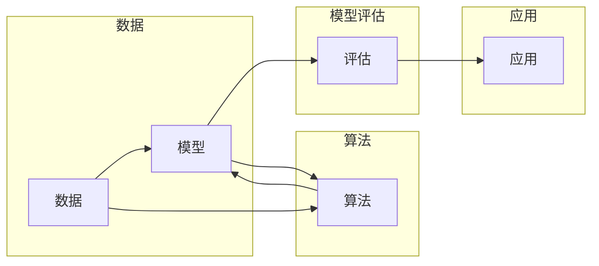

> 机器学习，算法原理，代码实战，深度学习，监督学习，无监督学习，强化学习，应用案例

# 机器学习算法原理与代码实战案例讲解

## 1. 背景介绍

随着信息技术的飞速发展，机器学习技术在各个领域的应用日益广泛。机器学习作为一种使计算机系统能够从数据中学习并做出决策的技术，已经成为推动社会进步的重要力量。本文将深入探讨机器学习的基本原理，并通过代码实战案例讲解如何将理论知识应用于实际问题。

## 2. 核心概念与联系

### 2.1 核心概念原理

在机器学习领域，核心概念包括：

- **数据**：机器学习的基石，包括特征和标签。特征描述了数据的属性，标签是数据的目标或结果。
- **模型**：机器学习算法学习到的规律，用于对未知数据进行预测或分类。
- **算法**：用于训练模型的方法，如监督学习、无监督学习和强化学习。
- **评估**：使用测试集来衡量模型的性能，常用的指标有准确率、召回率、F1分数等。

### 2.2 架构的 Mermaid 流程图



## 3. 核心算法原理 & 具体操作步骤

### 3.1 算法原理概述

机器学习算法主要分为以下几类：

- **监督学习**：通过已标记的训练数据来训练模型。
- **无监督学习**：通过未标记的数据来学习数据的内在结构。
- **强化学习**：通过与环境交互来学习策略。

### 3.2 算法步骤详解

#### 监督学习

1. **数据预处理**：清洗、归一化、特征选择等。
2. **模型选择**：选择合适的模型，如线性回归、决策树、支持向量机等。
3. **模型训练**：使用训练数据训练模型。
4. **模型评估**：使用测试集评估模型性能。
5. **模型调整**：根据评估结果调整模型参数或选择更合适的模型。

#### 无监督学习

1. **数据预处理**：与监督学习类似，但可能不需要标签。
2. **模型选择**：选择合适的无监督学习算法，如聚类、降维、异常检测等。
3. **模型训练**：使用数据训练模型。
4. **模型评估**：评估模型的性能，但评估指标与监督学习不同。

#### 强化学习

1. **环境定义**：定义环境状态、动作空间和奖励函数。
2. **策略学习**：使用策略梯度、深度Q网络等方法学习最优策略。
3. **评估**：评估策略在环境中的性能。

### 3.3 算法优缺点

#### 监督学习

- 优点：易于理解和实现，性能稳定。
- 缺点：需要大量的标记数据，难以处理复杂问题。

#### 无监督学习

- 优点：不需要标记数据，可以用于探索数据的结构。
- 缺点：性能不如监督学习，难以直接应用于实际任务。

#### 强化学习

- 优点：可以学习到复杂的决策策略。
- 缺点：需要大量的训练时间和计算资源，难以评估。

### 3.4 算法应用领域

机器学习算法在各个领域都有广泛的应用，包括：

- 金融：信用评分、风险控制、算法交易等。
- 医疗：疾病诊断、药物发现、健康监测等。
- 交通：自动驾驶、交通流量预测、智能交通系统等。
- 教育：个性化推荐、智能教育系统、教育数据分析等。

## 4. 数学模型和公式 & 详细讲解 & 举例说明

### 4.1 数学模型构建

机器学习模型通常由数学公式表示。以下是一些常见的数学模型：

- **线性回归**：$y = \beta_0 + \beta_1x_1 + \beta_2x_2 + ... + \beta_nx_n + \epsilon$
- **逻辑回归**：$P(y=1) = \sigma(\beta_0 + \beta_1x_1 + \beta_2x_2 + ... + \beta_nx_n)$
- **支持向量机**：$f(x) = \sum_{i=1}^n \alpha_i y_i \phi(x)^T \phi(x_i)$

### 4.2 公式推导过程

以线性回归为例，推导目标函数和梯度下降算法：

目标函数：$J(\theta) = \frac{1}{2m} \sum_{i=1}^m (h_\theta(x^{(i)}) - y^{(i)})^2$

梯度下降：$\theta_j = \theta_j - \alpha \frac{\partial J(\theta)}{\partial \theta_j}$

### 4.3 案例分析与讲解

假设我们要使用线性回归预测房价。以下是一个简单的Python代码示例：

```python
import numpy as np
from sklearn.linear_model import LinearRegression

# 生成随机数据
X = np.random.rand(100, 1) * 100
y = 5 + 3 * X + np.random.randn(100, 1) * 2

# 创建线性回归模型
model = LinearRegression()

# 训练模型
model.fit(X, y)

# 预测
X_new = np.array([[50]])
y_pred = model.predict(X_new)

print(f"预测房价：{y_pred[0]}")
```

## 5. 项目实践：代码实例和详细解释说明

### 5.1 开发环境搭建

- 安装Python
- 安装必要的库，如NumPy、Scikit-learn、Matplotlib等

### 5.2 源代码详细实现

以下是一个简单的线性回归模型实现：

```python
import numpy as np

class LinearRegression:
    def __init__(self, learning_rate=0.01, epochs=1000):
        self.learning_rate = learning_rate
        self.epochs = epochs
        self.weights = None
        self.bias = None

    def fit(self, X, y):
        self.weights = np.zeros(X.shape[1])
        self.bias = 0

        m = len(X)
        for _ in range(self.epochs):
            model_predictions = X.dot(self.weights) + self.bias
            error = model_predictions - y

            model_weights_gradient = (1/m) * X.T.dot(error)
            model_bias_gradient = (1/m) * np.sum(error)

            self.weights -= self.learning_rate * model_weights_gradient
            self.bias -= self.learning_rate * model_bias_gradient

    def predict(self, X):
        return X.dot(self.weights) + self.bias
```

### 5.3 代码解读与分析

- `__init__`方法：初始化模型参数。
- `fit`方法：使用梯度下降算法训练模型。
- `predict`方法：使用训练好的模型进行预测。

### 5.4 运行结果展示

```python
# 生成随机数据
X = np.random.rand(100, 1) * 100
y = 5 + 3 * X + np.random.randn(100, 1) * 2

# 创建线性回归模型
model = LinearRegression()

# 训练模型
model.fit(X, y)

# 预测
X_new = np.array([[50]])
y_pred = model.predict(X_new)

print(f"预测房价：{y_pred[0]}")
```

## 6. 实际应用场景

机器学习算法在各个领域都有广泛的应用，以下是一些案例：

- **金融**：使用机器学习进行风险评估、欺诈检测、信用评分等。
- **医疗**：使用机器学习进行疾病诊断、药物发现、健康监测等。
- **零售**：使用机器学习进行客户细分、推荐系统、库存管理等。
- **交通**：使用机器学习进行自动驾驶、交通流量预测、智能交通系统等。

## 7. 工具和资源推荐

### 7.1 学习资源推荐

- 《机器学习》 - 周志华
- 《深度学习》 - Ian Goodfellow、Yoshua Bengio、Aaron Courville
- 《Python机器学习》 - Sebastian Raschka

### 7.2 开发工具推荐

- NumPy
- Scikit-learn
- TensorFlow
- PyTorch

### 7.3 相关论文推荐

- "A Few Useful Things to Know about Machine Learning" - Pedro Domingos
- "Playing Atari with Deep Reinforcement Learning" - Volodymyr Mnih等
- "ImageNet Classification with Deep Convolutional Neural Networks" - Alex Krizhevsky等

## 8. 总结：未来发展趋势与挑战

### 8.1 研究成果总结

机器学习技术在各个领域取得了显著的成果，推动了社会的进步。随着技术的不断发展，机器学习将在更多领域发挥重要作用。

### 8.2 未来发展趋势

- **小样本学习**：在数据量有限的情况下，使模型能够有效学习。
- **无监督学习**：进一步探索无监督学习算法在各个领域的应用。
- **可解释性**：提高机器学习模型的透明度和可解释性。

### 8.3 面临的挑战

- **数据质量问题**：数据的质量直接影响模型的性能。
- **计算资源**：训练和部署大型模型需要大量的计算资源。
- **可解释性**：提高模型的透明度和可解释性是一个重要的挑战。

### 8.4 研究展望

未来，机器学习技术将在更多领域得到应用，推动社会的进步。同时，研究者需要克服各种挑战，使机器学习技术更加成熟、可靠。

## 9. 附录：常见问题与解答

**Q1：机器学习和深度学习有什么区别？**

A：机器学习是一个更广泛的领域，包括深度学习。深度学习是机器学习的一个子集，使用深度神经网络来学习数据的复杂模式。

**Q2：如何选择合适的机器学习算法？**

A：选择合适的算法取决于具体问题、数据类型和可用资源。

**Q3：机器学习模型如何评估？**

A：使用测试集评估模型的性能，常用的指标有准确率、召回率、F1分数等。

**Q4：机器学习项目的流程是怎样的？**

A：机器学习项目的流程包括数据收集、数据预处理、模型选择、模型训练、模型评估、模型部署等。

---

作者：禅与计算机程序设计艺术 / Zen and the Art of Computer Programming