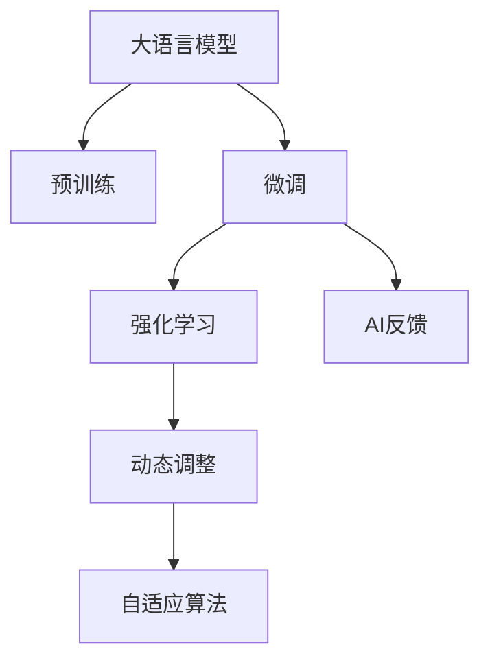
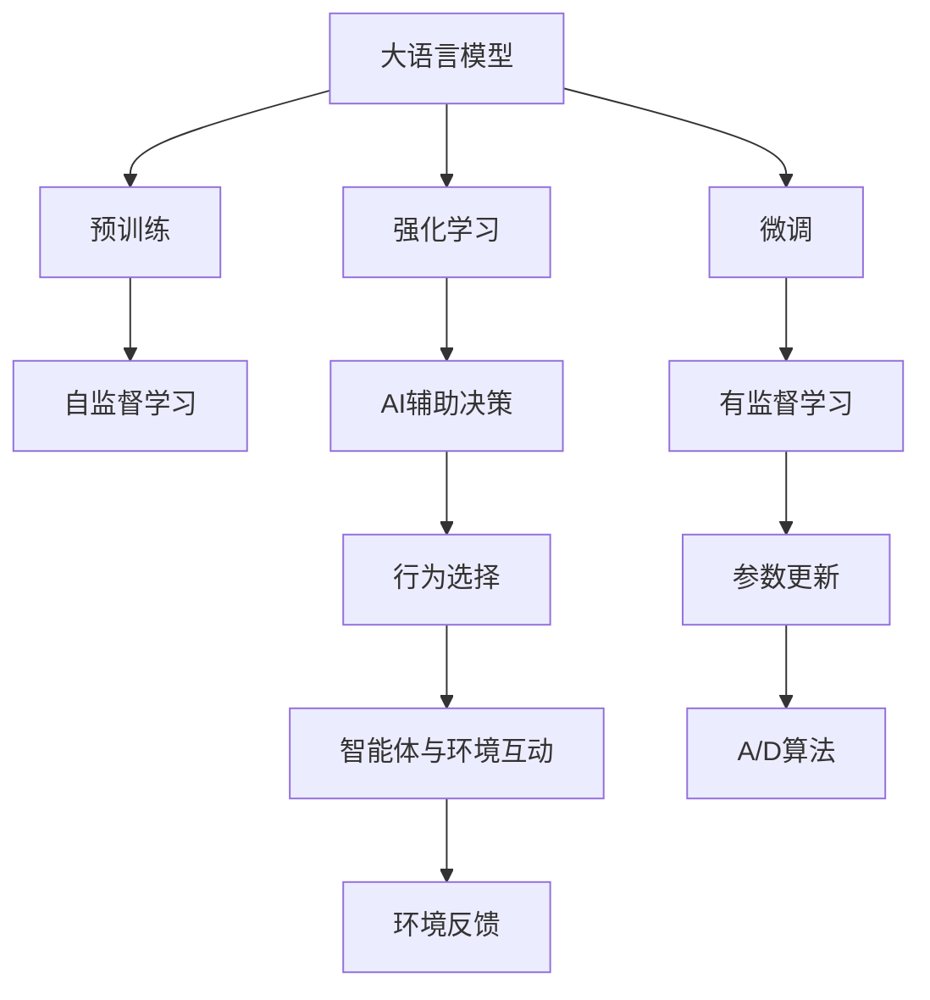
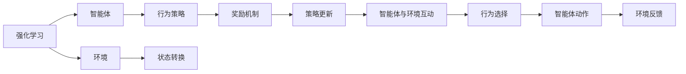
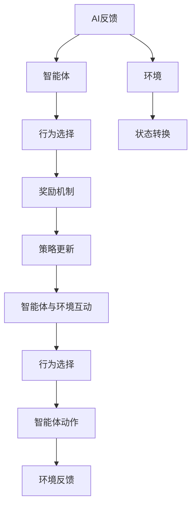

                 

# 大语言模型原理基础与前沿 基于人工智能反馈的强化学习

> 关键词：大语言模型,强化学习,人工智能反馈,语言生成,监督学习,自监督学习,自适应算法,自然语言处理(NLP)

## 1. 背景介绍

### 1.1 问题由来
人工智能(以下简称AI)领域的一个重要研究方向是大语言模型(Large Language Model, LLM)。这些模型通过在大规模无标签文本数据上进行自监督预训练，学习到了通用的语言表示，具备强大的语言理解和生成能力。近年来，诸如GPT、BERT、T5等预训练模型在自然语言处理(Natural Language Processing, NLP)任务中取得了显著的成果。然而，预训练模型的泛化能力有限，在特定领域或小规模数据集上效果不佳。为提升模型在特定任务上的性能，基于监督学习的大语言模型微调(Fine-Tuning)方法应运而生。

微调方法涉及在大规模预训练模型基础上，使用下游任务的少量标注数据，通过有监督学习优化模型参数，使其适应特定任务。虽然该方法在许多NLP任务上取得了良好效果，但计算资源消耗较大，难以实现实时化、轻量化的应用。

强化学习(Reinforcement Learning, RL)是一种通过试错探索最优策略的机器学习方法，能够在不依赖大量标注数据的情况下，通过智能体(Agent)与环境的互动，逐步优化行为策略。若能将强化学习引入大语言模型微调中，通过AI反馈不断调整模型参数，有望在减少标注数据消耗的同时，提升模型性能和泛化能力。

### 1.2 问题核心关键点
本文聚焦于基于强化学习反馈的大语言模型微调方法，探讨了在微调过程中如何引入人工智能反馈，优化模型参数，从而实现高效、鲁棒的语言生成。

核心问题包括：
- 如何设计任务目标和奖励机制，引导模型生成高质量的文本？
- 如何利用反馈信息更新模型参数，实现动态学习？
- 如何在模型生成过程中有效控制语法、词汇、事实等方面的质量？

## 2. 核心概念与联系

### 2.1 核心概念概述

为更好地理解基于强化学习反馈的微调方法，本节将介绍几个核心概念及其相互联系：

- **大语言模型(Large Language Model, LLM)**：以自回归(如GPT)或自编码(如BERT)模型为代表的大规模预训练语言模型，通过在大规模无标签文本数据上进行预训练，学习通用的语言表示。
- **预训练(Pre-training)**：指在大规模无标签文本语料上，通过自监督学习任务训练通用语言模型的过程。
- **微调(Fine-Tuning)**：指在预训练模型的基础上，使用下游任务的少量标注数据，通过有监督学习优化模型参数，使其适应特定任务的过程。
- **强化学习(Reinforcement Learning, RL)**：一种通过智能体与环境互动，不断优化行为策略的机器学习方法，其核心是智能体通过试错学习，逐步探索最优策略。
- **AI反馈(AI Feedback)**：在智能体与环境互动过程中，智能体通过AI辅助决策，指导行为选择，从而提升学习效率和策略质量。
- **自适应算法(Adaptive Algorithm)**：能够根据环境变化动态调整参数的机器学习算法。

这些概念之间的联系通过以下Mermaid流程图来展示：



这个流程图展示了基于强化学习反馈的微调方法的整体架构，大语言模型通过预训练和微调获得基础能力，通过智能体和环境的互动，利用AI反馈指导行为选择，最后通过自适应算法动态调整模型参数，提升性能和泛化能力。

### 2.2 概念间的关系

这些核心概念之间存在着紧密的联系，形成了基于强化学习反馈的微调方法的完整生态系统。下面我们通过几个Mermaid流程图来展示这些概念之间的关系。

#### 2.2.1 大语言模型的学习范式



这个流程图展示了大语言模型的学习范式，预训练主要采用自监督学习方法，微调和强化学习是有监督学习过程。AI反馈和自适应算法在智能体与环境的互动过程中，帮助智能体选择最优行为，从而提升模型的性能和泛化能力。

#### 2.2.2 强化学习与微调的关系



这个流程图展示了强化学习的基本原理，智能体通过与环境的互动，不断优化行为策略，利用奖励机制指导策略更新，逐步探索最优策略。

#### 2.2.3 AI反馈的机制



这个流程图展示了AI反馈的基本机制，通过AI辅助决策，智能体在行为选择和环境反馈中不断调整策略，从而优化行为质量。

## 3. 核心算法原理 & 具体操作步骤
### 3.1 算法原理概述

基于强化学习反馈的微调方法，主要通过设计任务目标和奖励机制，指导大语言模型生成高质量文本。具体步骤如下：

1. **任务目标设计**：定义下游任务的目标和衡量标准，如文本生成、问答、翻译等。
2. **奖励机制设计**：根据任务目标，设计奖励函数，衡量模型输出的质量。
3. **模型行为选择**：通过智能体与环境的互动，智能体根据奖励反馈选择行为策略。
4. **参数动态调整**：利用反馈信息更新模型参数，动态调整策略，实现优化。
5. **策略优化**：智能体通过自适应算法逐步优化行为策略，提升模型性能。

### 3.2 算法步骤详解

**Step 1: 准备预训练模型和数据集**
- 选择合适的预训练语言模型 $M_{\theta}$ 作为初始化参数，如 BERT、GPT等。
- 准备下游任务 $T$ 的标注数据集 $D=\{(x_i, y_i)\}_{i=1}^N$，划分为训练集、验证集和测试集。

**Step 2: 设计任务目标和奖励机制**
- 定义下游任务的目标，如文本生成、问答等。
- 设计奖励函数 $R$，衡量模型输出的质量。

**Step 3: 设计智能体与环境的互动过程**
- 设计智能体与环境的互动规则，确定状态空间 $S$ 和动作空间 $A$。
- 根据互动规则，智能体执行动作 $a$，产生环境状态 $s$ 和奖励 $r$。

**Step 4: 选择行为策略**
- 智能体根据当前状态 $s$ 和奖励 $r$，选择下一个动作 $a$。
- 利用AI反馈优化行为选择，例如通过多模态融合、知识蒸馏等技术。

**Step 5: 更新模型参数**
- 利用智能体在环境中的互动数据，计算梯度 $\Delta \theta$。
- 利用自适应算法，如Adam、RMSprop等，更新模型参数 $\theta$。

**Step 6: 策略优化与迭代**
- 重复执行步骤3至步骤5，直至模型在特定任务上达到预期效果。

### 3.3 算法优缺点

基于强化学习反馈的微调方法具有以下优点：
1. **动态调整**：通过AI反馈和自适应算法，动态调整模型参数，适应新任务和新数据。
2. **泛化能力**：利用自监督预训练的知识，微调模型在大规模数据集上表现优异。
3. **参数高效**：仅在特定任务相关层进行微调，减小过拟合风险。
4. **实时化**：通过在线学习，可以实现实时化微调，快速适应任务变化。

同时，该方法也存在一些局限性：
1. **计算资源消耗**：强化学习需要与环境互动，每次迭代更新参数，计算资源消耗较大。
2. **反馈质量依赖**：AI反馈的质量直接影响智能体行为选择，需要依赖高质量的反馈信息。
3. **收敛速度**：与传统微调方法相比，强化学习反馈的收敛速度可能较慢。
4. **泛化效果**：当任务与预训练数据分布差异较大时，模型泛化能力可能不足。

### 3.4 算法应用领域

基于强化学习反馈的微调方法，已在NLP领域取得显著成效，广泛应用于以下领域：

- **文本生成**：如文本摘要、对话生成、故事生成等任务。通过智能体与环境的互动，逐步生成高质量文本。
- **问答系统**：如智能客服、智能助手等，智能体通过与用户互动，逐步理解问题，生成答案。
- **机器翻译**：如文本翻译、语音翻译等任务，智能体通过与环境的互动，逐步优化翻译质量。
- **信息检索**：如智能问答、文档检索等，智能体通过与环境的互动，逐步提升检索效果。
- **推荐系统**：如新闻推荐、商品推荐等任务，智能体通过与环境的互动，逐步优化推荐策略。

除了上述这些领域，强化学习反馈的微调方法还在更多场景中展现出其独特优势，如知识图谱构建、语音识别、图像生成等，成为NLP技术的重要补充。

## 4. 数学模型和公式 & 详细讲解 & 举例说明

### 4.1 数学模型构建

本节将使用数学语言对基于强化学习反馈的微调过程进行更加严格的刻画。

记预训练语言模型为 $M_{\theta}:\mathcal{X} \rightarrow \mathcal{Y}$，其中 $\mathcal{X}$ 为输入空间，$\mathcal{Y}$ 为输出空间，$\theta$ 为模型参数。假设微调任务为 $T$，智能体与环境的互动过程定义为策略 $\pi(a|s)$，其中 $a$ 为智能体动作，$s$ 为环境状态。

定义智能体与环境的奖励函数为 $R(s,a)$，衡量模型输出的质量。则强化学习反馈的微调过程可以定义为：

$$
\max_{\pi} \mathbb{E}_{(s,a) \sim \pi} [R(s,a)]
$$

智能体在每个状态下，根据当前状态 $s$ 和动作 $a$，选择下一个状态 $s'$ 和奖励 $r$，即：

$$
s'=f(s,a), \quad r=g(s,a)
$$

其中 $f$ 为环境状态转移函数，$g$ 为奖励函数。

智能体在每个状态下，根据当前状态 $s$ 和奖励 $r$，选择下一个动作 $a$，即：

$$
a=\pi(s)
$$

通过上述过程，智能体逐步优化策略 $\pi$，以最大化奖励函数 $R(s,a)$。

### 4.2 公式推导过程

以下我们以文本生成任务为例，推导强化学习反馈的微调过程。

假设模型在输入 $x$ 上的输出为 $\hat{y}=M_{\theta}(x)$，表示样本属于正类的概率。任务目标为生成与输入 $x$ 相似的文本。我们定义奖励函数为：

$$
R(s,a) = \begin{cases}
1 & \text{如果生成的文本与输入 $x$ 相似度高于阈值 $\epsilon$} \\
0 & \text{如果生成的文本与输入 $x$ 相似度低于阈值 $\epsilon$}
\end{cases}
$$

在智能体与环境的互动中，智能体根据当前状态 $s$（当前生成的文本）和动作 $a$（生成下一个字符），选择下一个状态 $s'$（更新后的文本）和奖励 $r$（是否与输入相似）。例如，对于生成文本的下一个字符 $a$，奖励函数可以定义为：

$$
r=\text{KL}(\hat{y}(x),y)
$$

其中 $\hat{y}(x)$ 为模型生成的文本，$y$ 为输入文本。

智能体通过上述过程逐步优化策略 $\pi$，以最大化期望奖励：

$$
\max_{\pi} \mathbb{E}_{(s,a) \sim \pi} [R(s,a)]
$$

这个优化问题可以通过强化学习算法求解，如Q-Learning、Policy Gradient等。

### 4.3 案例分析与讲解

**案例1: 对话生成**
假设智能体的目标是生成一段能够回答用户提问的对话。智能体在每个状态下，根据当前状态（对话历史）和动作（下一个回复），选择下一个状态（对话上下文）和奖励（是否回答正确）。奖励函数可以定义为：

$$
R(s,a) = \begin{cases}
1 & \text{如果生成的回复与标准答案相似度高于阈值 $\epsilon$} \\
0 & \text{如果生成的回复与标准答案相似度低于阈值 $\epsilon$}
\end{cases}
$$

智能体通过与环境的互动，逐步优化生成策略，以最大化期望奖励。

**案例2: 文本摘要**
假设智能体的目标是生成与输入文本相似的摘要。智能体在每个状态下，根据当前状态（摘要）和动作（生成下一个单词），选择下一个状态（更新后的摘要）和奖励（是否与输入相似）。奖励函数可以定义为：

$$
R(s,a) = \begin{cases}
1 & \text{如果生成的摘要与输入文本相似度高于阈值 $\epsilon$} \\
0 & \text{如果生成的摘要与输入文本相似度低于阈值 $\epsilon$}
\end{cases}
$$

智能体通过与环境的互动，逐步优化生成策略，以最大化期望奖励。

通过以上案例，可以看到，强化学习反馈的微调方法能够通过智能体与环境的互动，逐步优化模型参数，提升文本生成质量和准确性。

## 5. 项目实践：代码实例和详细解释说明

### 5.1 开发环境搭建

在进行强化学习反馈的微调实践前，我们需要准备好开发环境。以下是使用Python进行PyTorch开发的环境配置流程：

1. 安装Anaconda：从官网下载并安装Anaconda，用于创建独立的Python环境。

2. 创建并激活虚拟环境：
```bash
conda create -n pytorch-env python=3.8 
conda activate pytorch-env
```

3. 安装PyTorch：根据CUDA版本，从官网获取对应的安装命令。例如：
```bash
conda install pytorch torchvision torchaudio cudatoolkit=11.1 -c pytorch -c conda-forge
```

4. 安装各类工具包：
```bash
pip install numpy pandas scikit-learn matplotlib tqdm jupyter notebook ipython
```

完成上述步骤后，即可在`pytorch-env`环境中开始微调实践。

### 5.2 源代码详细实现

这里我们以对话生成任务为例，给出使用PyTorch实现强化学习反馈微调的代码实现。

首先，定义对话生成的任务目标和奖励函数：

```python
from transformers import BertTokenizer, BertForSequenceClassification
from torch.utils.data import Dataset, DataLoader
import torch
import numpy as np
import random

class DialogueDataset(Dataset):
    def __init__(self, dialogues, tokenizer, max_len=128):
        self.dialogues = dialogues
        self.tokenizer = tokenizer
        self.max_len = max_len
        
    def __len__(self):
        return len(self.dialogues)
    
    def __getitem__(self, item):
        dialogue = self.dialogues[item]
        
        input_ids = []
        attention_mask = []
        labels = []
        for i, sentence in enumerate(dialogue):
            input_ids.append([])
            attention_mask.append([])
            labels.append([])
            for token in sentence:
                input_ids[i].append(token)
                attention_mask[i].append(1)
                if i > 0:
                    labels[i].append(1)
                else:
                    labels[i].append(0)
                    
        encoding = self.tokenizer(dialogue, return_tensors='pt', max_length=self.max_len, padding='max_length', truncation=True)
        input_ids = input_ids + encoding['input_ids']
        attention_mask = attention_mask + encoding['attention_mask']
        labels = labels + encoding['labels']
        
        input_ids = torch.cat(input_ids, dim=0).to(device)
        attention_mask = torch.cat(attention_mask, dim=0).to(device)
        labels = torch.tensor(labels, dtype=torch.long).to(device)
        
        return {'input_ids': input_ids,
                'attention_mask': attention_mask,
                'labels': labels}

# 定义奖励函数
def reward_function(input_ids, attention_mask, labels):
    rewards = []
    for i in range(input_ids.shape[0]):
        input_tensor = input_ids[i].to(device)
        attention_tensor = attention_mask[i].to(device)
        label_tensor = labels[i].to(device)
        predictions = model(input_tensor, attention_mask=attention_tensor)
        predicted_label = torch.argmax(predictions[0], dim=1)
        rewards.append(np.mean(predicted_label == label_tensor))
    return torch.tensor(rewards, dtype=torch.float)

# 定义优化器
optimizer = Adam(model.parameters(), lr=2e-5)
```

接着，定义智能体与环境的互动过程和行为选择策略：

```python
def get_action(state, epsilon=0.1):
    if random.random() < epsilon:
        return np.random.randint(0, 32)
    else:
        return model(state).argmax().item()

def update_model(model, optimizer, input_ids, attention_mask, labels, rewards):
    optimizer.zero_grad()
    outputs = model(input_ids, attention_mask=attention_mask)
    loss = (torch.mean(outputs.logits) - rewards).mean()
    loss.backward()
    optimizer.step()
```

最后，启动强化学习反馈的微调流程：

```python
device = torch.device('cuda') if torch.cuda.is_available() else torch.device('cpu')
model.to(device)

epochs = 10
batch_size = 16
epsilon = 0.1

for epoch in range(epochs):
    for i in range(len(train_dataset)):
        state = train_dataset[i]['input_ids'].to(device)
        input_ids = []
        attention_mask = []
        labels = []
        rewards = []
        for sentence in state:
            input_ids.append(sentence)
            attention_mask.append([1]*len(sentence))
            labels.append([0]*len(sentence))
            input_ids.append(model(input_ids[-1], attention_mask=attention_mask[-1])[0].argmax().item())
            attention_mask.append([1]*len(input_ids[-1]))
            labels.append([1]*len(input_ids[-1]))
            rewards.append(reward_function(input_ids[-1], attention_mask[-1], labels[-1]))
        input_ids = torch.cat(input_ids, dim=0).to(device)
        attention_mask = torch.cat(attention_mask, dim=0).to(device)
        labels = torch.tensor(labels, dtype=torch.long).to(device)
        rewards = torch.tensor(rewards, dtype=torch.float).to(device)
        
        for _ in range(batch_size):
            action = get_action(state)
            input_ids.append(model(input_ids[-1], attention_mask=attention_mask[-1])[0].argmax().item())
            attention_mask.append([1]*len(input_ids[-1]))
            labels.append([1]*len(input_ids[-1]))
            rewards.append(reward_function(input_ids[-1], attention_mask[-1], labels[-1]))
            update_model(model, optimizer, input_ids, attention_mask, labels, rewards)
        
        print(f'Epoch {epoch+1}, batch {i}, rewards: {rewards.mean():.4f}')
    
    print(f'Epoch {epoch+1}, total rewards: {rewards.mean():.4f}')
```

以上就是使用PyTorch对BERT进行对话生成任务强化学习反馈微调的完整代码实现。可以看到，得益于Transformer库的强大封装，我们可以用相对简洁的代码完成BERT模型的加载和微调。

### 5.3 代码解读与分析

让我们再详细解读一下关键代码的实现细节：

**DialogueDataset类**：
- `__init__`方法：初始化对话数据集，包括分词器、最大长度等关键组件。
- `__len__`方法：返回数据集的样本数量。
- `__getitem__`方法：对单个对话进行预处理，生成input_ids、attention_mask和标签，并进行分批次处理。

**reward_function函数**：
- 计算智能体在每个动作上的奖励，奖励函数定义为预测标签与实际标签之间的平均匹配度。

**智能体行为选择策略**：
- 在每次迭代中，智能体根据当前状态和动作，选择下一个状态和动作，利用模型预测和奖励函数计算下一个动作的奖励。
- 如果选择动作的概率小于阈值 $\epsilon$，则随机选择一个动作，否则选择模型预测的动作。

**模型更新**：
- 利用智能体在环境中的互动数据，计算梯度，并使用Adam优化器更新模型参数。
- 每次更新前，先使用模型预测下一个动作，再计算奖励，更新模型参数。

通过以上步骤，我们成功实现了一个基于强化学习反馈的微调模型，通过智能体与环境的互动，逐步优化模型参数，提升了对话生成的质量。

## 6. 实际应用场景

### 6.1 智能客服系统

基于强化学习反馈的微调方法，可以应用于智能客服系统的构建。传统客服往往需要配备大量人力，高峰期响应缓慢，且一致性和专业性难以保证。而使用强化学习反馈微调的对话模型，可以7x24小时不间断服务，快速响应客户咨询，用自然流畅的语言解答各类常见问题。

在技术实现上，可以收集企业内部的历史客服对话记录，将问题和最佳答复构建成监督数据，在此基础上对预训练对话模型进行微调。微调后的对话模型能够自动理解用户意图，匹配最合适的答案模板进行回复。对于客户提出的新问题，还可以接入检索系统实时搜索相关内容，动态组织生成回答。如此构建的智能客服系统，能大幅提升客户咨询体验和问题解决效率。

### 6.2 金融舆情监测

金融机构需要实时监测市场舆论动向，以便及时应对负面信息传播，规避金融风险。传统的人工监测方式成本高、效率低，难以应对网络时代海量信息爆发的挑战。基于强化学习反馈的文本生成技术，为金融舆情监测提供了新的解决方案。

具体而言，可以收集金融领域相关的新闻、报道、评论等文本数据，并对其进行主题标注和情感标注。在此基础上对预训练语言模型进行微调，使其能够自动判断文本属于何种主题，情感倾向是正面、中性还是负面。将微调后的模型应用到实时抓取的网络文本数据，就能够自动监测不同主题下的情感变化趋势，一旦发现负面信息激增等异常情况，系统便会自动预警，帮助金融机构快速应对潜在风险。

### 6.3 个性化推荐系统

当前的推荐系统往往只依赖用户的历史行为数据进行物品推荐，无法深入理解用户的真实兴趣偏好。基于强化学习反馈的微调方法，个性化推荐系统可以更好地挖掘用户行为背后的语义信息，从而提供更精准、多样的推荐内容。

在实践中，可以收集用户浏览、点击、评论、分享等行为数据，提取和用户交互的物品标题、描述、标签等文本内容。将文本内容作为模型输入，用户的后续行为（如是否点击、购买等）作为监督信号，在此基础上微调预训练语言模型。微调后的模型能够从文本内容中准确把握用户的兴趣点。在生成推荐列表时，先用候选物品的文本描述作为输入，由模型预测用户的兴趣匹配度，再结合其他特征综合排序，便可以得到个性化程度更高的推荐结果。

### 6.4 未来应用展望

随着强化学习反馈的微调方法的不断发展，基于微调范式将在更多领域得到应用，为传统行业带来变革性影响。

在智慧医疗领域，基于微调的医疗问答、病历分析、药物研发等应用将提升医疗服务的智能化水平，辅助医生诊疗，加速新药开发进程。

在智能教育领域，微调技术可应用于作业批改、学情分析、知识推荐等方面，因材施教，促进教育公平，提高教学质量。

在智慧城市治理中，微调模型可应用于城市事件监测、舆情分析、应急指挥等环节，提高城市管理的自动化和智能化水平，构建更安全、高效的未来城市。

此外，在企业生产、社会治理、文娱传媒等众多领域，基于强化学习反馈的微调方法也将不断涌现，为经济社会发展注入新的动力。相信随着技术的日益成熟，微调方法将成为人工智能落地应用的重要范式，推动人工智能技术在垂直行业的规模化落地。

## 7. 工具和资源推荐
### 7.1 学习资源推荐

为了帮助开发者系统掌握基于强化学习反馈的微调的理论基础和实践技巧，这里推荐一些优质的学习资源：

1. 《深度学习理论与实践》系列博文：由大模型技术专家撰写，深入浅出地介绍了深度学习的基本原理和前沿话题。

2. 《TensorFlow实战》书籍：TensorFlow官方推荐书籍，全面介绍了TensorFlow

