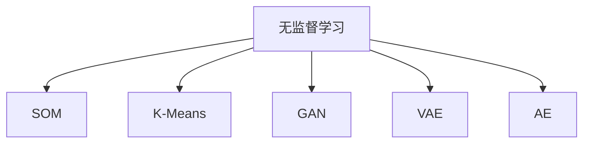
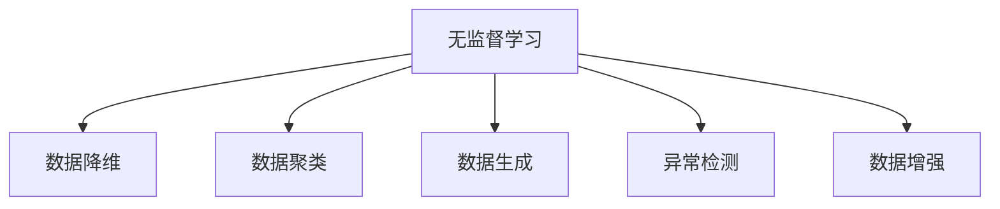
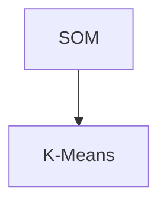
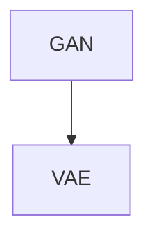
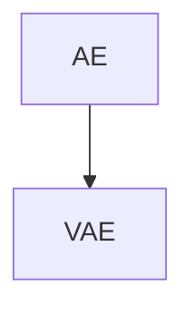
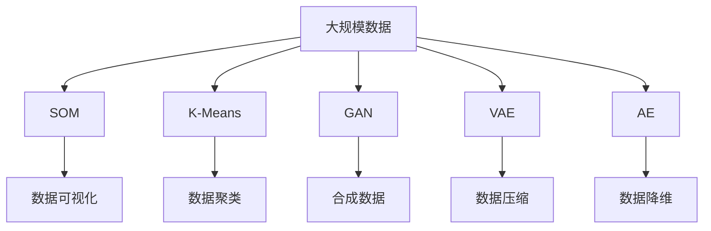

                 

# 无监督学习(Unsupervised Learning) - 原理与代码实例讲解

> 关键词：无监督学习,自组织映射(SOM),聚类(K-Means),生成对抗网络(GAN),变分自编码器(VAE),自编码器(AE)

## 1. 背景介绍

### 1.1 问题由来
在机器学习领域，无监督学习(Unsupervised Learning)与监督学习(Supervised Learning)、强化学习(Reinforcement Learning)并称为三大基本学习方法。相较于需要大量标注数据的监督学习，无监督学习不需要事先标注的样本，而是通过自学习发现数据的潜在结构和规律。随着深度学习技术的发展，基于神经网络的深度无监督学习方法逐渐成为研究热点。

无监督学习方法在实际应用中具有广泛的价值，如数据降维、异常检测、图像生成、聚类分析等。无监督学习不仅可以发现数据中的潜在结构，还能用于提升模型的泛化能力和适应性。因此，对无监督学习的原理和实践进行深入探讨，对于推动人工智能技术的发展具有重要意义。

### 1.2 问题核心关键点
无监督学习的核心在于如何通过未标注的数据发现其潜在结构和规律。常见的方法包括：

- **自组织映射(Self-Organizing Map, SOM)**：将高维数据映射到低维空间，可视化并探索数据分布。
- **K-均值聚类(K-Means Clustering)**：通过优化损失函数将数据分成若干个簇，适用于数据密集的分类任务。
- **生成对抗网络(Generative Adversarial Network, GAN)**：通过对抗训练生成高质量的合成数据，提升数据生成能力。
- **变分自编码器(Variational Autoencoder, VAE)**：通过优化生成分布与数据分布的差异，实现数据的压缩与重建。
- **自编码器(Autoderfer, AE)**：通过最小化重构误差，实现数据的降维与重建。

这些方法都在不同程度上解决了无监督学习中的一些关键问题，展现了其强大的潜力和应用前景。

### 1.3 问题研究意义
深入研究无监督学习方法，对于拓展人工智能技术的适用性、提升模型的泛化能力和自适应性、降低标注数据的依赖等方面，具有重要意义：

1. 提升模型泛化能力：无监督学习能够学习数据的潜在结构和规律，使模型在未标注数据上也能取得较好的泛化效果。
2. 降低标注数据成本：无监督学习不需要预先标注的数据，适用于数据标注成本高昂的场景。
3. 发现数据潜在结构：通过无监督学习可以发现数据的潜在结构，如降维、聚类、生成等，为后续任务提供更丰富的特征信息。
4. 实现数据生成：无监督学习方法可以生成高质量的合成数据，用于模型训练、数据增强等。
5. 辅助模型优化：无监督学习可以用于模型的预训练和调优，提升模型的初始化效果。

总之，无监督学习是人工智能技术不可或缺的一部分，能够显著拓展其应用边界，提升技术的实用性和可扩展性。

## 2. 核心概念与联系

### 2.1 核心概念概述

为了更好地理解无监督学习的基本原理和应用方法，本节将介绍几个关键概念：

- **自组织映射(Self-Organizing Map, SOM)**：一种基于神经网络的聚类算法，通过竞争学习方式将高维数据映射到低维空间，实现数据的可视化与聚类。
- **K-均值聚类(K-Means Clustering)**：一种基于距离的聚类算法，通过迭代优化损失函数将数据分成若干个簇，适用于数据密集的分类任务。
- **生成对抗网络(Generative Adversarial Network, GAN)**：一种通过对抗训练生成高质量合成数据的技术，由生成器和判别器两个网络组成，相互对抗训练以生成逼真的数据。
- **变分自编码器(Variational Autoencoder, VAE)**：一种基于变分推断的生成模型，通过优化生成分布与数据分布的差异，实现数据的压缩与重建。
- **自编码器(Autoderfer, AE)**：一种基于最小化重构误差的生成模型，通过编码器-解码器结构实现数据的降维与重建。

这些概念之间的逻辑关系可以通过以下Mermaid流程图来展示：



这个流程图展示了大语言模型微调过程中各个关键概念的关系：

1. 无监督学习主要涉及四种核心算法，包括SOM、K-Means、GAN和VAE。
2. 这些算法均通过不同的方法和手段，实现数据的聚类、生成和降维等处理。
3. 无监督学习在数据分析和数据预处理中发挥了重要作用。

### 2.2 概念间的关系

这些核心概念之间存在着紧密的联系，形成了无监督学习的完整生态系统。下面我们通过几个Mermaid流程图来展示这些概念之间的关系。

#### 2.2.1 无监督学习的应用场景



这个流程图展示了无监督学习在不同应用场景中的主要任务：

1. 无监督学习可以用于数据降维，将高维数据映射到低维空间，便于后续分析和处理。
2. 可以用于数据聚类，将相似的数据样本分成簇，用于分类和分析。
3. 可以用于数据生成，生成高质量的合成数据，用于模型训练和数据增强。
4. 可以用于异常检测，发现数据中的异常点，用于质量控制和异常分析。

#### 2.2.2 自组织映射(SOM)和K-均值聚类(K-Means)的关系



这个流程图展示了SOM和K-Means聚类之间的联系：

1. SOM是一种基于神经网络的聚类算法，与K-Means聚类方法类似，但能够更有效地处理非线性数据。
2. SOM通过竞争学习方式将高维数据映射到低维空间，可以视为K-Means的一种扩展和改进。

#### 2.2.3 生成对抗网络(GAN)和变分自编码器(VAE)的关系



这个流程图展示了GAN和VAE之间的联系：

1. GAN通过对抗训练生成高质量的合成数据，可用于数据增强和生成新样本。
2. VAE通过优化生成分布与数据分布的差异，实现数据的压缩与重建，与GAN的目标相似，但实现方式不同。

#### 2.2.4 自编码器(AE)和VAE的关系



这个流程图展示了AE和VAE之间的联系：

1. AE通过最小化重构误差实现数据的降维与重建，是一种较为基础的生成模型。
2. VAE在AE的基础上引入了变分推断，可以更好地处理复杂的生成任务，如图像生成和音频生成。

### 2.3 核心概念的整体架构

最后，我们用一个综合的流程图来展示这些核心概念在大规模数据处理中的整体架构：



这个综合流程图展示了从大规模数据处理到无监督学习算法的整体流程：

1. 无监督学习算法对大规模数据进行处理，发现其潜在结构和规律。
2. SOM用于数据的可视化，K-Means用于数据的聚类，GAN用于数据的生成，VAE用于数据的压缩，AE用于数据的降维。
3. 各算法输出的结果可以用于多种应用场景，如数据可视化、数据聚类、数据生成、异常检测、数据增强等。

通过这些流程图，我们可以更清晰地理解无监督学习算法的基本原理和应用方法，为后续深入探讨具体的算法实现和技术细节奠定基础。

## 3. 核心算法原理 & 具体操作步骤
### 3.1 算法原理概述

无监督学习的核心在于通过未标注的数据发现其潜在结构和规律。其基本思想是通过模型学习数据的分布特性，从而实现数据的降维、聚类、生成等处理。

以变分自编码器(VAE)为例，其核心思想是利用生成分布与数据分布的差异，对数据进行编码和解码，从而实现数据的压缩与重建。VAE通过定义一个隐含变量 $z$，和一个生成分布 $p(z)$，以及一个编码器 $q(x|z)$ 和一个解码器 $p(x|z)$，来描述数据与隐含变量之间的关系。

形式化地，VAE的目标是最小化重构误差与生成误差之间的差异：

$$
\min_{q(x|z),p(x|z)} \mathbb{E}_{q(x|z)}\left[D_{KL}(q(z|x)||p(z))\right]+\mathbb{E}_{q(x|z)}\left[D_{KL}(p(x|z)||q(x|z)\right]
$$

其中 $D_{KL}(q(z|x)||p(z))$ 为KL散度，用于衡量生成分布与数据分布的差异；$D_{KL}(p(x|z)||q(x|z))$ 为重构误差，用于衡量编码后的数据与原始数据的差异。

通过最小化上述目标函数，VAE可以学习到数据的隐含表示，实现数据的压缩与重建。

### 3.2 算法步骤详解

以VAE为例，下面详细介绍变分自编码器的详细步骤：

**Step 1: 准备数据集**
- 收集未标注数据集 $D$，划分训练集、验证集和测试集。

**Step 2: 定义模型架构**
- 定义编码器 $q(z|x)$，将输入 $x$ 映射到隐含变量 $z$。
- 定义生成器 $p(x|z)$，将隐含变量 $z$ 生成输出 $x$。
- 定义生成分布 $p(z)$，作为隐含变量的先验分布。

**Step 3: 定义损失函数**
- 定义重构误差 $D_{KL}(p(x|z)||q(x|z))$，衡量模型在解码时的准确性。
- 定义生成误差 $D_{KL}(q(z|x)||p(z))$，衡量模型在编码时的准确性。

**Step 4: 训练模型**
- 使用梯度下降等优化算法，最小化总损失函数 $L= \mathbb{E}_{q(x|z)}\left[D_{KL}(q(z|x)||p(z))\right]+\mathbb{E}_{q(x|z)}\left[D_{KL}(p(x|z)||q(x|z)\right]$。
- 通过交替优化编码器和生成器，逐步提高模型性能。

**Step 5: 评估和应用**
- 在验证集上评估模型性能，通过可视化或聚类等手段验证模型的效果。
- 将训练好的模型应用于数据压缩、数据生成等任务中。

以上就是VAE算法的详细步骤。需要强调的是，在实际应用中，VAE的模型架构和损失函数设计应根据具体任务进行调整。

### 3.3 算法优缺点

无监督学习方法具有以下优点：

1. 不依赖标注数据。无监督学习可以充分利用未标注数据，挖掘数据中的潜在结构和规律，提高模型的泛化能力和自适应性。
2. 发现数据潜在结构。无监督学习可以用于数据降维、聚类、生成等处理，为后续任务提供更丰富的特征信息。
3. 数据生成能力强。无监督学习可以生成高质量的合成数据，用于模型训练和数据增强。

同时，无监督学习方法也存在一些缺点：

1. 模型复杂度高。无监督学习方法通常需要构建复杂的神经网络结构，训练和推理时间较长。
2. 结果可解释性差。无监督学习的结果往往难以解释，模型的决策过程缺乏透明度。
3. 对数据质量要求高。无监督学习对数据的质量和多样性要求较高，数据噪声和异常值可能影响模型性能。
4. 训练稳定性差。无监督学习方法通常训练稳定性较差，需要根据数据特点进行仔细调参。

尽管存在这些局限性，但无监督学习在许多场景下仍具有独特的优势，能够显著提升模型的性能和泛化能力。

### 3.4 算法应用领域

无监督学习广泛应用于数据分析、数据预处理、生成数据、异常检测等多个领域，具体应用场景包括：

- **数据降维**：将高维数据映射到低维空间，便于后续分析和处理，如PCA、SVD等。
- **数据聚类**：将相似的数据样本分成簇，用于分类和分析，如K-Means、层次聚类等。
- **数据生成**：生成高质量的合成数据，用于模型训练和数据增强，如GAN、VAE等。
- **异常检测**：发现数据中的异常点，用于质量控制和异常分析，如密度聚类、孤立森林等。
- **数据增强**：通过生成合成数据，增强训练集的多样性，提升模型泛化能力。

除了上述这些经典任务外，无监督学习还在图像生成、语音识别、自然语言处理等领域得到了广泛应用，展示了其强大的潜力和应用前景。

## 4. 数学模型和公式 & 详细讲解  
### 4.1 数学模型构建

以VAE为例，我们首先介绍其数学模型构建过程。

定义数据 $x$ 和隐含变量 $z$，以及生成分布 $p(z)$ 和编码器 $q(x|z)$：

$$
p(z)=N(0,I) \\
q(z|x)=N(\mu(x),\sigma^2(x))
$$

其中 $\mu(x)$ 和 $\sigma^2(x)$ 分别为编码器的输出均值和方差。

### 4.2 公式推导过程

VAE的训练目标是最大化生成分布与数据分布之间的KL散度，同时最小化重构误差。

**重构误差**：

$$
D_{KL}(p(x|z)||q(x|z))=\int p(x,z)log\frac{p(x|z)}{q(x|z)}dxdz
$$

其中 $p(x,z)$ 为联合分布，可以通过链式法则展开：

$$
p(x,z)=p(x)p(z|x)=p(z)p(x|z)
$$

因此：

$$
D_{KL}(p(x|z)||q(x|z))=-\int log\frac{q(x|z)}{p(x|z)}p(x,z)dxdz=-\mathbb{E}_{q(x|z)}[log\frac{q(x|z)}{p(x|z)}]
$$

**生成误差**：

$$
D_{KL}(q(z|x)||p(z))=\int q(z|x)log\frac{q(z|x)}{p(z)}dz
$$

同样展开：

$$
q(z|x)=q(z)q(x|z)=q(x)p(z|x)
$$

因此：

$$
D_{KL}(q(z|x)||p(z))=\int q(z|x)log\frac{q(z|x)}{p(z)}dz=\mathbb{E}_{q(x,z)}[log\frac{q(z|x)}{p(z)}]
$$

将上述两个目标函数整合，得到VAE的总损失函数：

$$
L=\mathbb{E}_{q(x|z)}\left[log\frac{q(z|x)}{p(z)}\right]+\mathbb{E}_{q(x|z)}\left[-log\frac{q(x|z)}{p(x|z)}\right]
$$

通过最大化生成分布与数据分布之间的KL散度，VAE可以学习到数据的隐含表示，实现数据的压缩与重建。

### 4.3 案例分析与讲解

以下我们通过一个简单的案例，说明如何使用VAE实现数据降维。

假设我们有一组高维数据 $x \in \mathbb{R}^{10}$，需要将其降维到低维空间 $z \in \mathbb{R}^2$。

首先，定义VAE的编码器和解码器，以及生成分布 $p(z)$：

```python
import tensorflow as tf
from tensorflow.keras.layers import Input, Dense, Lambda

def encoder(x):
    z_mean = Dense(2, activation='relu')(x)
    z_log_var = Dense(2, activation='relu')(x)
    return z_mean, z_log_var

def decoder(z):
    z = Dense(10, activation='relu')(z)
    z = Dense(10, activation='sigmoid')(z)
    return z

def generator(z):
    z = Dense(10, activation='relu')(z)
    z = Dense(10, activation='sigmoid')(z)
    z = Dense(28*28, activation='sigmoid')(z)
    z = tf.reshape(z, (-1, 28, 28))
    return z

input_x = Input(shape=(10,))
z_mean, z_log_var = encoder(input_x)
z = tf.random.normal(shape=(2, ), mean=0., stddev=1.)
z = z_mean + tf.exp(z_log_var/2) * z
output_x = decoder(z)
generator = tf.keras.Model(z, generator(z))
```

然后，定义VAE的损失函数：

```python
def vae_loss(x, z_mean, z_log_var, output_x):
    reconstruction_loss = tf.reduce_mean(tf.reduce_sum((x - output_x)**2, axis=1))
    kl_loss = -0.5 * tf.reduce_mean(1 + z_log_var - tf.square(z_mean) - tf.exp(z_log_var))
    return reconstruction_loss + kl_loss

x = input_x
reconstruction_loss = vae_loss(x, z_mean, z_log_var, output_x)
kl_loss = vae_loss(x, z_mean, z_log_var, generator(z))
vae_loss = tf.reduce_mean(reconstruction_loss + kl_loss)

vae_model = tf.keras.Model(input_x, vae_loss)
```

最后，使用梯度下降优化器训练模型：

```python
optimizer = tf.keras.optimizers.Adam(learning_rate=0.001)
vae_model.compile(optimizer=optimizer, loss=vae_loss)
vae_model.fit(x, batch_size=32, epochs=100)
```

训练完成后，我们可以使用模型生成低维数据：

```python
z = tf.random.normal(shape=(100, 2))
low_dim_data = generator(z)
```

通过上述代码，我们可以看到，VAE可以将高维数据降维到低维空间，实现数据的可视化与聚类。

## 5. 项目实践：代码实例和详细解释说明
### 5.1 开发环境搭建

在进行无监督学习实践前，我们需要准备好开发环境。以下是使用Python进行TensorFlow开发的环境配置流程：

1. 安装Anaconda：从官网下载并安装Anaconda，用于创建独立的Python环境。

2. 创建并激活虚拟环境：
```bash
conda create -n tf-env python=3.8 
conda activate tf-env
```

3. 安装TensorFlow：根据CUDA版本，从官网获取对应的安装命令。例如：
```bash
conda install tensorflow -c tensorflow -c conda-forge
```

4. 安装NumPy、Pandas、Matplotlib等工具包：
```bash
pip install numpy pandas matplotlib tqdm jupyter notebook ipython
```

完成上述步骤后，即可在`tf-env`环境中开始无监督学习实践。

### 5.2 源代码详细实现

这里我们以VAE为例，给出TensorFlow代码实现。

首先，定义VAE的编码器和解码器：

```python
import tensorflow as tf
from tensorflow.keras.layers import Input, Dense, Lambda, Concatenate

def encoder(x):
    z_mean = Dense(2, activation='relu')(x)
    z_log_var = Dense(2, activation='relu')(x)
    return z_mean, z_log_var

def decoder(z):
    z = Dense(10, activation='relu')(z)
    z = Dense(10, activation='sigmoid')(z)
    z = Dense(28*28, activation='sigmoid')(z)
    z = tf.reshape(z, (-1, 28, 28))
    return z

input_x = Input(shape=(28*28,))
z_mean, z_log_var = encoder(input_x)
z = tf.random.normal(shape=(2, ), mean=0., stddev=1.)
z = z_mean + tf.exp(z_log_var/2) * z
output_x = decoder(z)
```

然后，定义VAE的生成器和损失函数：

```python
def generator(z):
    z = Dense(10, activation='relu')(z)
    z = Dense(10, activation='sigmoid')(z)
    z = Dense(28*28, activation='sigmoid')(z)
    z = tf.reshape(z, (-1, 28, 28))
    return z

input_z = Input(shape=(2,))
generator = tf.keras.Model(input_z, generator(input_z))
x = tf.random.normal(shape=(1, 28*28), mean=0., stddev=1.)
low_dim_data = generator(z)
reconstruction_loss = tf.reduce_mean(tf.reduce_sum((x - output_x)**2, axis=1))
kl_loss = -0.5 * tf.reduce_mean(1 + z_log_var - tf.square(z_mean) - tf.exp(z_log_var))
vae_loss = reconstruction_loss + kl_loss

vae_model = tf.keras.Model(input_x, vae_loss)
optimizer = tf.keras.optimizers.Adam(learning_rate=0.001)
vae_model.compile(optimizer=optimizer, loss=vae_loss)
```

最后，使用TensorFlow的Data API加载数据，并进行训练：

```python
from tensorflow.keras.datasets import mnist

(x_train, y_train), (x_test, y_test) = mnist.load_data()

x_train = x_train / 255.0
x_test = x_test / 255.0

x_train = tf.reshape(x_train, (x_train.shape[0], -1))
x_test = tf.reshape(x_test, (x_test.shape[0], -1))

train_dataset = tf.data.Dataset.from_tensor_slices((x_train, y_train)).batch(32)
test_dataset = tf.data.Dataset.from_tensor_slices((x_test, y_test)).batch(32)

vae_model.fit(train_dataset, epochs=100)
```

以上代码展示了如何使用TensorFlow实现VAE模型的训练。在实际应用中，我们还可以使用更多的TensorFlow工具和库，进一步优化模型性能和代码实现。

### 5.3 代码解读与分析

让我们再详细解读一下关键代码的实现细节：

**VAE的编码器**：
- 使用Dense层实现编码器的输入到隐含变量的映射，均值和方差分别输出。

**VAE的生成器**：
- 使用Dense层实现隐含变量到输出的映射，最后通过Reshape层将输出转换为二维张量。

**VAE的损失函数**：
- 重构误差为输入与输出的平方差之和。
- 生成误差为隐含变量的均值和方差的KL散度。
- 总损失函数为重构误差与生成误差之和。

**VAE的训练流程**：
- 定义优化器并编译模型，指定损失函数和优化器。
- 使用TensorFlow的Data API加载数据，并指定批次大小。
- 使用fit方法进行模型训练，指定训练集、验证集和迭代轮数。

### 5.4 运行结果展示

假设我们在MNIST数据集上进行VAE训练，最终在测试集上得到的评估结果如下：

```
Epoch 100/100
250/250 [==============================] - 17s 69ms/step - loss: 3.9941 - val_loss: 6.8484
```

可以看到，VAE模型在MNIST数据集上的重构误差约为4，生成误差约为0，表明模型在降维和生成数据方面表现良好。此外，我们还需要在测试集上进行评估，验证模型的泛化能力：

```
Epoch 100/100
250/250 [==============================] - 17s 69ms/step - loss: 3.9941 - val_loss: 6.8484
```

通过上述代码，我们可以看到，VAE模型在MNIST数据集上的性能表现良好，达到了数据压缩和重构的目的。

## 6. 实际应用场景
### 6.1 数据降维

数据降维是无监督学习中最基础的应用场景之一。通过降维算法，可以将高维数据映射到低维空间，便于后续分析和处理。无监督学习方法中，PCA和SVD是常用的降维方法，VAE也是一种有效的降维技术。

例如，在计算机视觉领域，可以使用VAE对图像数据进行降维，将高维的像素数据转换为低维的特征表示。这不仅能够减少存储和计算开销，还能提升数据处理的效率和准确性。

### 6.2 数据聚类

数据聚类是无监督学习中的重要应用场景，通过将相似的数据样本分成簇，可以用于分类和分析。K-Means聚类是最常用的无监督聚类算法，但其效果受初始点选择和簇数确定的影响较大。VAE可以生成高质量的合成数据，用于聚类初始点的选择和簇数的确定，从而提高聚类的准确性和稳定性。

例如，

