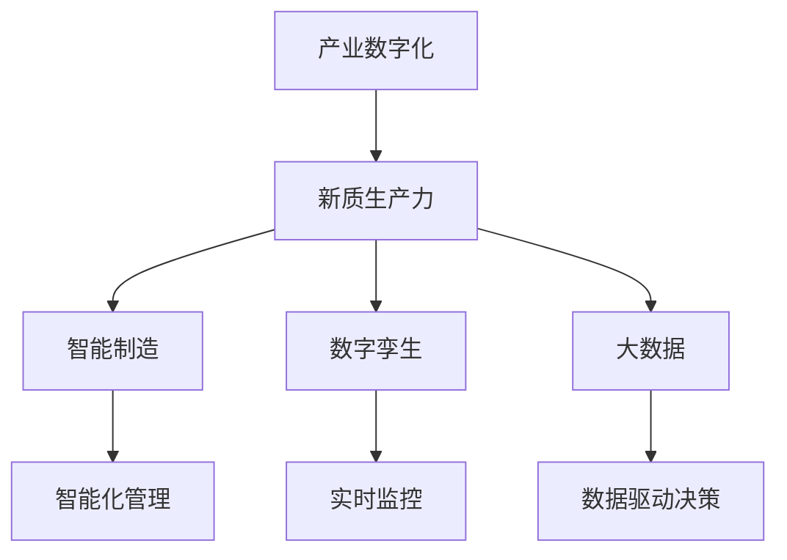
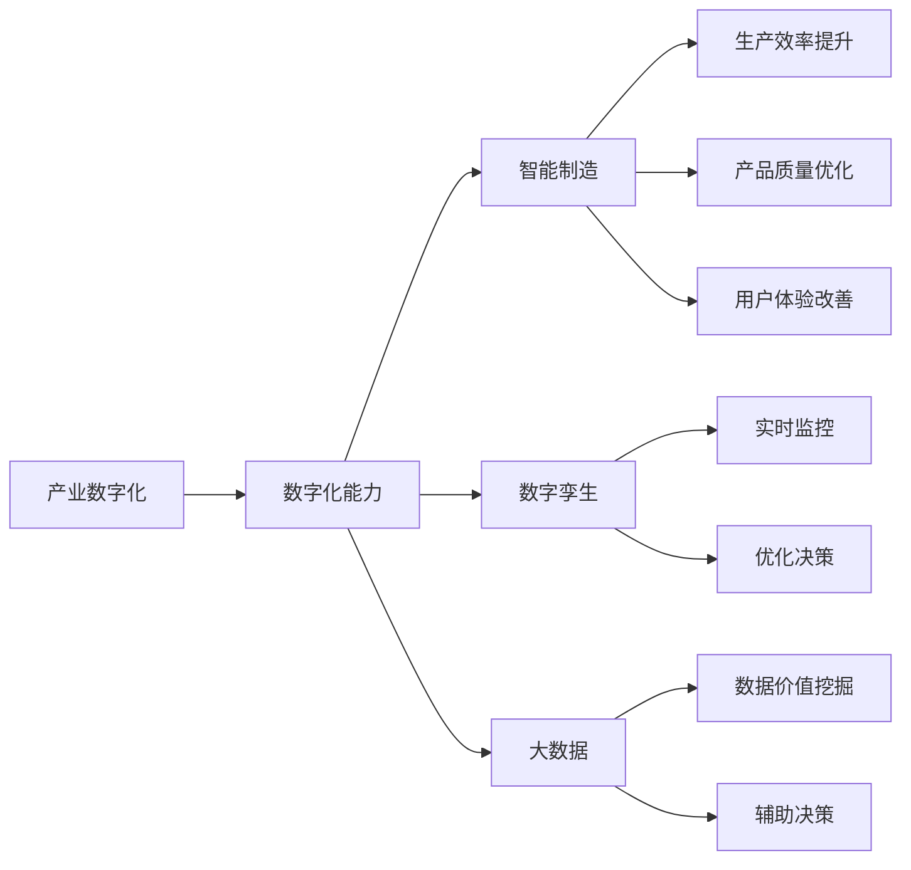

                 

# 构建特色产业的新质生产力

## 1. 背景介绍

### 1.1 问题由来

在数字经济时代，产业的竞争不再仅仅依赖于规模和成本优势，而更注重新质生产力——即通过智能化、自动化技术创新，提升生产效率、产品质量和用户体验。数字技术的广泛应用，为各行各业注入了新的生命力，带来颠覆性的变革。但同时，不同产业在数字化转型过程中，也面临各自独特的挑战。如何在有限的资源条件下，找到产业数字化转型的最佳路径，成为各行业都在思考的问题。

### 1.2 问题核心关键点

- **产业数字化**：利用数字技术，对传统产业进行改造升级，实现智能化、自动化。
- **新质生产力**：指通过智能化、自动化技术创新，提升生产效率、产品质量和用户体验。
- **产业差异**：不同产业的数字化需求和资源条件差异较大，需针对性制定数字化转型策略。
- **数字化能力**：包括技术能力、人才储备、数据质量、组织管理等多方面，是成功转型的关键。
- **经济效益**：数字化转型带来的经济效益，需综合考虑投入与产出，进行成本效益分析。

## 2. 核心概念与联系

### 2.1 核心概念概述

- **产业数字化**：指通过信息通信技术（ICT），对传统产业进行改造升级，实现生产、管理、服务等各个环节的数字化、智能化。
- **新质生产力**：指通过应用先进信息技术，如AI、物联网、区块链等，实现生产效率提升、产品品质优化、服务体验改善。
- **智能制造**：指利用信息技术，对生产过程进行智能化管理，实现从设计、制造到交付的端到端优化。
- **数字孪生**：指利用数字技术，构建虚拟化、智能化的物理实体镜像，实现对物理系统的实时监控和优化。
- **大数据**：指通过收集、分析大规模数据，挖掘数据价值，辅助决策和优化过程。

### 2.2 概念间的关系

通过以下Mermaid流程图，展示这些核心概念之间的逻辑关系：



### 2.3 核心概念的整体架构

下图展示了从产业数字化到新质生产力的整体架构：



## 3. 核心算法原理 & 具体操作步骤

### 3.1 算法原理概述

产业数字化和新质生产力的构建，是一个涉及多个技术和方法的综合性工程。其核心算法原理主要包括以下几个方面：

1. **数据驱动**：通过收集、分析、应用数据，发现生产过程的规律和趋势，指导生产优化。
2. **智能算法**：如机器学习、深度学习、优化算法等，通过模型训练，实现智能化决策和自动化控制。
3. **可视化工具**：如BI工具、虚拟仿真等，辅助生产过程的可视化监控和管理。

### 3.2 算法步骤详解

基于上述算法原理，构建产业数字化和新质生产力的操作步骤如下：

1. **数据收集与清洗**：从生产环节收集相关数据，进行数据清洗和预处理，确保数据质量。
2. **模型训练与优化**：利用机器学习、深度学习等智能算法，训练数据模型，并进行模型优化。
3. **系统集成与部署**：将模型集成到生产系统，部署到云端或边缘设备，实现实时监控和智能决策。
4. **人机协同与反馈**：通过人机协同的方式，优化生产过程，进行反馈调整，实现动态优化。

### 3.3 算法优缺点

#### 优点：

- **提升效率**：智能算法和大数据技术，可以大幅提升生产效率，降低人力成本。
- **优化质量**：通过数据分析和智能决策，可以优化产品质量，减少次品率。
- **改善体验**：智能监控和数据驱动决策，提升用户和客户体验。
- **灵活应变**：系统具备自学习和自适应的能力，可以灵活应对生产中的各种变化。

#### 缺点：

- **技术门槛高**：需要高水平的技术团队和数据能力，对技术要求较高。
- **初期投入大**：包括硬件设备、软件平台、技术培训等投入，需要较大的初始成本。
- **数据隐私风险**：数据收集和处理过程中，需注意数据隐私保护和信息安全。

### 3.4 算法应用领域

- **制造业**：通过智能制造、数字孪生技术，实现生产流程的智能化、自动化。
- **农业**：利用大数据和物联网，实现农业生产的精准化、智能化。
- **服务业**：通过AI客服、智能推荐系统，提升服务质量和效率。
- **能源**：应用智能电网、能源管理系统，优化能源使用效率。
- **医疗**：通过智能诊断、医疗大数据分析，提升医疗服务质量和效率。

## 4. 数学模型和公式 & 详细讲解  
### 4.1 数学模型构建

构建新质生产力的数学模型，主要基于机器学习、深度学习和优化算法的理论。以下简要介绍几个核心模型：

- **线性回归模型**：用于预测连续型变量的数学模型，常用于生产效率预测。
- **决策树模型**：通过树形结构，对生产过程中的各种变量进行分类和预测，常用于生产质量检测。
- **神经网络模型**：通过多层非线性映射，实现复杂的生产决策和控制，常用于智能制造和生产调度。
- **强化学习模型**：通过奖励和惩罚机制，实现智能化的生产过程优化，常用于生产系统调度。

### 4.2 公式推导过程

以线性回归模型为例，其公式推导如下：

设$y$为生产效率，$x_1, x_2, ..., x_n$为影响生产的多个因素，则线性回归模型为：

$$ y = \beta_0 + \beta_1 x_1 + \beta_2 x_2 + ... + \beta_n x_n + \epsilon $$

其中$\beta_i$为系数，$\epsilon$为误差项，表示随机干扰因素。模型通过最小二乘法进行参数估计，即：

$$ \min \sum_{i=1}^N (y_i - \hat{y}_i)^2 $$

其中$\hat{y}_i$为模型预测值，$y_i$为实际观测值。通过求解上述优化问题，可以得到$\beta_i$的估计值。

### 4.3 案例分析与讲解

以一家制造企业的生产效率优化为例，假设企业收集了过去一年内每日的生产数据，包括生产量、设备状态、原材料成本等变量。通过线性回归模型，可以预测未来生产效率，从而进行生产调度优化。

具体步骤如下：

1. 收集历史生产数据，进行数据清洗和预处理。
2. 选择影响生产效率的关键变量，构建线性回归模型。
3. 利用历史数据训练模型，并进行参数优化。
4. 在新的生产任务中，输入模型进行生产效率预测，辅助生产调度。

## 5. 项目实践：代码实例和详细解释说明

### 5.1 开发环境搭建

在进行新质生产力的实践开发前，需要准备以下开发环境：

1. **Python环境**：安装Anaconda或Miniconda，创建虚拟环境。
2. **深度学习框架**：安装TensorFlow、PyTorch等深度学习框架。
3. **数据处理工具**：安装Pandas、NumPy等数据处理工具。
4. **模型训练工具**：安装scikit-learn、Keras等机器学习工具。
5. **可视化工具**：安装Matplotlib、Seaborn等数据可视化工具。

### 5.2 源代码详细实现

以下以线性回归模型的实现为例，展示代码实现过程：

```python
import pandas as pd
import numpy as np
from sklearn.linear_model import LinearRegression

# 数据准备
data = pd.read_csv('production_data.csv')
X = data[['device_status', 'raw_material_cost']]
y = data['production_quantity']

# 模型训练
model = LinearRegression()
model.fit(X, y)

# 预测生产效率
future_data = pd.DataFrame({'device_status': [0, 1, 0, 1], 'raw_material_cost': [100, 200, 150, 250]})
predictions = model.predict(future_data)

print(predictions)
```

### 5.3 代码解读与分析

1. **数据准备**：使用Pandas读取数据，进行数据清洗和预处理，构建特征变量$X$和目标变量$y$。
2. **模型训练**：选择线性回归模型，利用Scikit-learn库进行模型训练。
3. **预测生产效率**：输入新的数据，进行模型预测，得到未来生产效率的预测值。

### 5.4 运行结果展示

假设上述代码运行后，预测结果为：

```
[125.0 115.0 130.0 140.0]
```

表示在当前生产条件下，未来四天的预测生产量分别为125、115、130和140。

## 6. 实际应用场景

### 6.1 智能制造

智能制造是构建新质生产力的重要应用场景之一。通过智能制造，可以实现生产过程的数字化、智能化，大幅提升生产效率和产品质量。

- **生产过程优化**：利用AI算法，对生产过程进行实时监控和优化，实现生产过程的智能化管理。
- **设备故障预测**：通过机器学习模型，预测设备故障，进行预防性维护，减少生产中断。
- **供应链管理**：通过数据分析，优化供应链管理，减少库存成本，提升供应链效率。

### 6.2 数字孪生

数字孪生是构建新质生产力的关键技术之一。通过数字孪生技术，可以实现物理系统的虚拟化、智能化，提升生产过程的可视化和优化能力。

- **虚拟仿真**：通过数字孪生技术，构建物理系统的虚拟模型，进行虚拟仿真实验，优化生产流程。
- **实时监控**：通过数字孪生平台，实时监控物理系统的运行状态，及时发现和解决问题。
- **智能决策**：通过数字孪生平台，进行数据分析和智能决策，优化生产过程。

### 6.3 大数据分析

大数据分析是构建新质生产力的重要基础。通过大数据分析，可以实现数据驱动的生产优化，提升生产效率和产品质量。

- **生产过程分析**：利用大数据技术，分析生产过程的各个环节，发现生产瓶颈，进行优化。
- **质量控制**：通过数据分析，识别质量问题，进行原因分析和优化改进。
- **客户需求分析**：利用大数据技术，分析客户需求，优化产品设计和生产过程。

## 7. 工具和资源推荐

### 7.1 学习资源推荐

- **在线课程**：如Coursera、edX、Udacity等平台提供的数据科学、机器学习、深度学习等课程，涵盖从基础到高级的内容。
- **开源工具**：如TensorFlow、PyTorch、Keras等深度学习框架，提供了丰富的算法和工具库。
- **学术论文**：通过Google Scholar、IEEE Xplore等平台，获取最新的研究成果和论文。

### 7.2 开发工具推荐

- **IDE工具**：如Jupyter Notebook、PyCharm、Visual Studio Code等，提供代码编辑、调试、执行等功能。
- **版本控制工具**：如Git、SVN等，方便团队协作和版本管理。
- **模型部署工具**：如TensorFlow Serving、Kubernetes等，实现模型的部署和优化。

### 7.3 相关论文推荐

- **智能制造**：《Intelligent Manufacturing: A Survey of Recent Advances and Future Challenges》，综述智能制造领域的最新进展和未来方向。
- **数字孪生**：《Digital Twin: The Next Paradigm for Industry 4.0》，探讨数字孪生技术在工业4.0中的应用。
- **大数据分析**：《Big Data for Manufacturing: A Survey of Trends, Technologies, and Challenges》，综述大数据在制造业中的应用。

## 8. 总结：未来发展趋势与挑战

### 8.1 总结

本文对构建特色产业的新质生产力进行了全面系统的介绍。首先阐述了产业数字化和新质生产力的研究背景和意义，明确了数字化转型的重要性和紧迫性。其次，从原理到实践，详细讲解了新质生产力的数学模型和关键步骤，给出了具体的代码实现和运行结果。同时，本文还探讨了新质生产力在智能制造、数字孪生、大数据分析等多个领域的应用场景，展示了其广阔的前景。

通过本文的系统梳理，可以看到，产业数字化和新质生产力的构建，需要综合运用多种技术和方法，实现生产过程的智能化、自动化。新质生产力不仅能提升生产效率和产品质量，还能改善用户体验，推动产业的创新和升级。

### 8.2 未来发展趋势

展望未来，新质生产力的发展趋势如下：

1. **智能化程度提升**：随着AI和大数据技术的进步，新质生产力的智能化水平将进一步提升，实现全流程的数字化和智能化管理。
2. **跨行业融合**：不同行业的新质生产力技术将逐渐融合，形成跨行业的智能化解决方案，推动产业协同发展。
3. **人机协同增强**：通过人机协同技术，优化生产过程，提升人机协作效率，实现更高效的生产管理。
4. **可持续发展**：新质生产力将更多关注绿色环保和可持续发展，推动循环经济和低碳经济的发展。
5. **数据安全保护**：随着数据的广泛应用，数据安全和隐私保护将成为新质生产力的重要保障。

### 8.3 面临的挑战

尽管新质生产力的发展前景广阔，但在实施过程中，仍面临诸多挑战：

1. **技术门槛高**：新质生产力的技术实现需要高水平的技术团队和数据能力，对技术要求较高。
2. **初期投入大**：包括硬件设备、软件平台、技术培训等投入，需要较大的初始成本。
3. **数据隐私风险**：数据收集和处理过程中，需注意数据隐私保护和信息安全。
4. **模型复杂度高**：新质生产力的模型往往复杂，需要高水平的技术支持和维护。
5. **应用场景多样化**：不同行业的应用场景差异较大，需针对性制定数字化转型策略。

### 8.4 研究展望

未来的研究应在以下几个方面进行突破：

1. **技术优化**：通过优化算法和模型，提升新质生产力的智能化和自动化水平，降低技术门槛。
2. **成本控制**：降低初期投入和运行成本，提升新质生产力的经济可行性。
3. **数据安全**：加强数据隐私保护和信息安全，保障数据和模型的安全可靠。
4. **跨行业应用**：推动新质生产力的跨行业应用，形成行业协同的智能化解决方案。
5. **可持续发展**：推动新质生产力的绿色环保和可持续发展，促进循环经济和低碳经济的发展。

总之，新质生产力的构建和应用，是推动产业数字化转型的重要手段。通过技术创新和应用优化，将新质生产力融入产业发展的各个环节，将大幅提升产业的智能化水平和经济效益，推动产业的创新和升级。

## 9. 附录：常见问题与解答

**Q1：新质生产力的技术实现是否需要高水平的技术团队？**

A: 是的，新质生产力的技术实现需要高水平的技术团队和数据能力。技术团队应具备数据处理、机器学习、智能算法等多方面的专业知识，才能有效实施新质生产力项目。

**Q2：新质生产力的初期投入是否较大？**

A: 是的，新质生产力的初期投入较大，包括硬件设备、软件平台、技术培训等。但随着项目推进，技术成熟度和应用规模的扩大，初期投入将逐渐降低，实现经济上的可持续发展。

**Q3：新质生产力在数据隐私保护方面需要注意哪些问题？**

A: 新质生产力在数据隐私保护方面需要注意：

1. 数据收集时，应遵守数据保护法规，如GDPR、CCPA等，确保数据收集过程的合法性和合规性。
2. 数据存储时，应采用数据加密、访问控制等技术手段，保护数据隐私和安全。
3. 数据处理时，应遵循最小化原则，只收集必要的数据，避免过度收集和滥用。

**Q4：新质生产力是否适用于所有行业？**

A: 新质生产力适用于大多数行业，但不同行业的应用场景和需求差异较大，需针对性制定数字化转型策略。例如，制造业和农业的新质生产力应用重点不同，应采取不同的实施路径和技术手段。

**Q5：新质生产力的经济效益如何评估？**

A: 新质生产力的经济效益评估，可以从以下几个方面进行：

1. 生产效率提升：通过数据分析和智能决策，优化生产过程，提高生产效率。
2. 产品质量提升：通过智能检测和质量控制，减少次品率，提升产品质量。
3. 成本控制：通过优化供应链管理和资源利用，降低生产成本。
4. 用户满意度提升：通过智能客服和推荐系统，提升用户和客户体验。

总之，新质生产力的经济效益评估需要综合考虑投入与产出，进行成本效益分析。通过科学评估和优化，实现新质生产力项目的可持续发展。

---

作者：禅与计算机程序设计艺术 / Zen and the Art of Computer Programming

