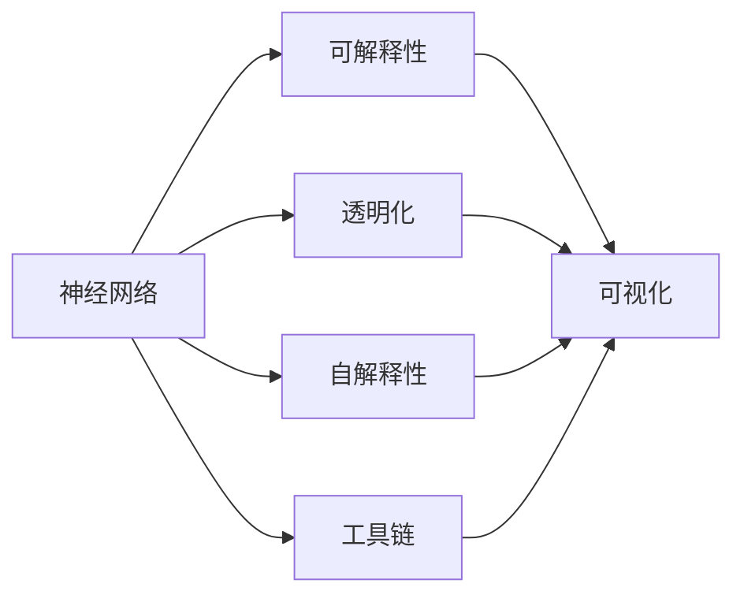
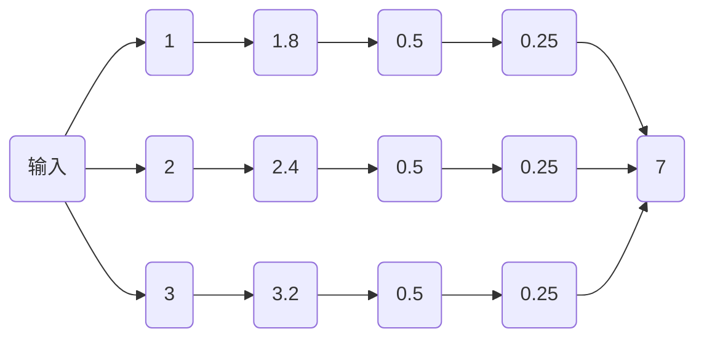
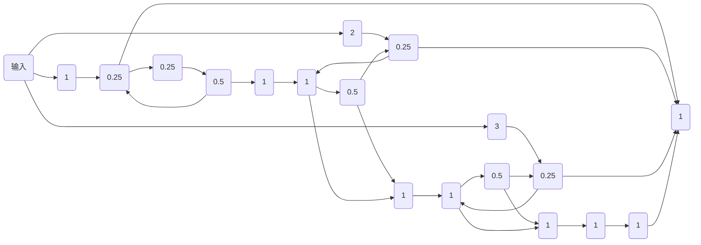
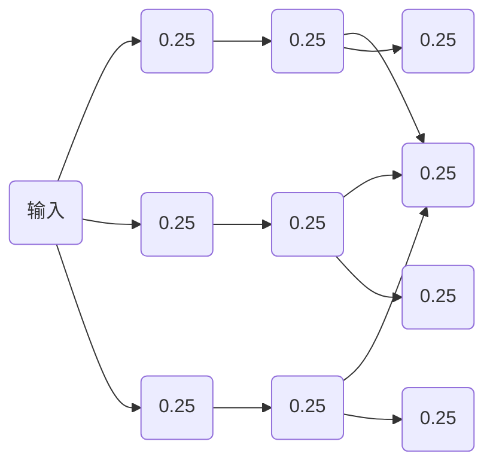

                 

# 神经网络模型的可解释性技术

> 关键词：神经网络,可解释性,透明化,可视化,自解释性

## 1. 背景介绍

### 1.1 问题由来
随着深度学习在各行各业的深入应用，神经网络模型在图像识别、语音识别、自然语言处理等领域展现出了巨大的潜力。然而，传统的神经网络往往被看作"黑盒"，其内部的决策过程缺乏透明性和可解释性。这在很多场景下成为了应用的瓶颈，例如医疗、金融等高风险领域，决策的可解释性直接关系到结果的可靠性。此外，深度学习模型的透明度不足也限制了学术界对其机理的深入研究，无法更好地指导模型设计和技术优化。

### 1.2 问题核心关键点
为了克服深度学习模型的"黑盒"特性，近年来在神经网络模型的可解释性研究方面取得了一定的进展。从早期的特征可视化，到如今的自解释性模型，这一领域的关注度正在逐步提升。

1. **特征可视化**：通过热力图、梯度图等技术，展示网络在处理输入数据时，哪些特征起到了关键作用。但这种方法对具体的模型结构要求较高，且无法提供关于模型内部工作机制的深层次理解。
2. **自解释性模型**：这一类模型在设计时便考虑了如何输出其自身决策理由，例如通过设计一些附加的结构，使得模型可以提供一定的可解释性。这种方法在一定程度上克服了"黑盒"问题，但通常需要修改模型结构，增加了实现难度。
3. **模型透明化**：通过各种工具和技术手段，将模型内部的计算过程和决策路径可视化，使模型决策变得透明。这种方法更为灵活，但实现复杂度较高。

这些方法各有优缺点，未来的研究趋势是寻求多层次、多维度的可解释性方案，既能够提供直观的可视化信息，又能够保证模型的灵活性和效率。

## 2. 核心概念与联系

### 2.1 核心概念概述

为更好地理解神经网络模型可解释性技术，本节将介绍几个密切相关的核心概念：

- **神经网络(Neural Network)**：由神经元组成的网络结构，用于解决各类预测和分类问题。
- **可解释性(Explainability)**：指模型输出结果的原因或逻辑，使模型决策变得透明、可理解。
- **透明化(Transparency)**：指模型内部决策路径和计算过程的可视化，方便进行理解和调试。
- **可视化(Visualization)**：通过图形、图表等形式展示模型内部信息的技术手段。
- **自解释性(Explainable by Design)**：指在设计模型时就考虑其可解释性，使模型输出自然解释。
- **工具链(Toolchain)**：指用于模型透明化和可视化的一系列工具和平台。

这些核心概念之间存在着紧密的联系，形成了一个完整的神经网络模型可解释性生态系统。

### 2.2 概念间的关系

这些核心概念之间的关系可以通过以下Mermaid流程图来展示：



这个流程图展示了神经网络模型可解释性技术的主要组成部分及其关系：

1. 神经网络模型为可解释性的研究对象。
2. 可解释性目标通过透明化技术实现。
3. 可视化技术是透明化过程的重要手段。
4. 自解释性模型和工具链共同支持透明化的实现。

## 3. 核心算法原理 & 具体操作步骤
### 3.1 算法原理概述

神经网络模型的可解释性技术，本质上是对模型内部决策过程的剖析和重构。其核心思想是通过各种技术和方法，将模型的决策理由显式化，使决策过程变得透明和可理解。

在传统的神经网络中，数据通过层层计算后，最后通过激活函数输出结果。这种方法的内部过程是不可见的，难以解释。可解释性技术通过引入外部因素（如可视化技术、自解释性结构等），将模型的内部计算过程和特征重要性信息可视化，从而提升模型的透明性。

### 3.2 算法步骤详解

基于神经网络模型的可解释性技术一般包括以下几个关键步骤：

**Step 1: 选择合适的可视化工具**

- 根据模型的特点和目标，选择合适的可视化工具，如热力图、梯度图、Attention图等。
- 常用的可视化工具包括TensorBoard、Netron、t-SNE等。

**Step 2: 数据预处理和模型加载**

- 对输入数据进行标准化和归一化处理，保证模型输出的一致性和稳定性。
- 加载模型权重，并将其转换为可视化工具所需格式。

**Step 3: 生成可视化结果**

- 利用可视化工具绘制模型的输入输出关系、特征重要性图等。
- 根据需要展示模型的内部计算过程，如Attention机制、梯度流向等。

**Step 4: 解读可视化结果**

- 对可视化结果进行解读，分析模型决策的依据和逻辑。
- 如果发现模型在特定区域存在偏见或错误，可能需要调整模型结构或改进数据集。

**Step 5: 反馈和优化**

- 根据可视化的结果，进行模型优化和调整。
- 通过多次迭代，提升模型的可解释性和性能。

### 3.3 算法优缺点

神经网络模型的可解释性技术具有以下优点：

1. **提高模型的可信度**：通过可视化的结果，可以验证模型的决策依据，增加其可信度和可靠性。
2. **便于问题诊断和调试**：可视化的信息可以帮助开发者快速定位问题，进行模型优化。
3. **促进学术研究**：透明化的模型有助于学术界更好地理解其机理，促进深度学习研究的进步。

同时，该方法也存在一些局限性：

1. **增加计算复杂度**：可视化过程本身也需进行大量的计算，可能增加整体的计算复杂度。
2. **数据和模型结构要求高**：并不是所有模型和数据都适合进行可视化，部分模型可能需要修改结构才能实现可视化。
3. **结果解读难度大**：可视化结果的信息量巨大，解读和分析需要专业知识，对用户要求较高。

尽管存在这些局限性，但神经网络模型的可解释性技术仍是大数据、深度学习等领域研究的重要方向之一。未来相关研究将着重于降低可视化复杂度、提高可视化的实用性和准确性，以及探索更多元化的可视化方式，以进一步提升模型的透明性。

### 3.4 算法应用领域

神经网络模型的可解释性技术已经在多个领域得到了应用，例如：

- 医疗诊断：通过可视化技术，医生可以理解模型对医疗影像的诊断依据，提高诊断准确性。
- 金融风险评估：通过可视化特征重要性图，金融机构可以评估模型的风险预测能力，识别高风险领域。
- 自然语言处理：通过Attention图等方法，展示模型对文本的理解过程，辅助理解模型决策逻辑。
- 图像识别：通过热力图、梯度图等，展示模型对图像特征的识别过程，优化模型结构。
- 机器人控制：通过可视化技术，理解机器人对环境的感知和决策，优化控制系统设计。

## 4. 数学模型和公式 & 详细讲解 & 举例说明
### 4.1 数学模型构建

在神经网络模型的可解释性研究中，常用的数学模型包括激活函数、梯度图、Attention图等。以下我们以梯度图为例，进行详细讲解。

设神经网络模型 $M$ 由 $L$ 层组成，其中第 $l$ 层的输入为 $x^{(l-1)}$，输出为 $h^{(l)}$。则前向传播过程可表示为：

$$
h^{(l)} = \sigma(W^{(l)} x^{(l-1)} + b^{(l)})
$$

其中 $\sigma$ 为激活函数，$W^{(l)}$ 和 $b^{(l)}$ 分别为第 $l$ 层的权重和偏置。

在反向传播过程中，通过链式法则计算每个参数的梯度，可以表示为：

$$
\frac{\partial L}{\partial W^{(l)}} = \frac{\partial L}{\partial h^{(l)}} \frac{\partial h^{(l)}}{\partial x^{(l-1)}} \frac{\partial x^{(l-1)}}{\partial W^{(l)}}
$$

其中 $\frac{\partial L}{\partial h^{(l)}}$ 为损失函数对输出层的梯度，$\frac{\partial h^{(l)}}{\partial x^{(l-1)}}$ 为输出层对前一层的梯度，$\frac{\partial x^{(l-1)}}{\partial W^{(l)}}$ 为前一层对权重层的梯度。

### 4.2 公式推导过程

在神经网络中，梯度图是理解模型内部梯度流向的重要工具。通过梯度图，可以清晰地看到模型在反向传播时，梯度是如何从输出层逐层传递到输入层的。以下以一个简单的全连接神经网络为例，展示梯度图的绘制过程。

假设有一个全连接神经网络，包含一个输入层、一个隐藏层和一个输出层，激活函数为ReLU，损失函数为均方误差。设输入为 $x=[1,2,3]$，目标输出为 $y=[3,5,7]$。则前向传播过程如下：

$$
h^{(1)} = \sigma(W^{(1)} x + b^{(1)}) = [1.8, 2.4, 3.2]
$$
$$
h^{(2)} = \sigma(W^{(2)} h^{(1)} + b^{(2)}) = [2.2, 3.2, 4.0]
$$
$$
y^{(2)} = W^{(3)} h^{(2)} + b^{(3)} = [3, 5, 7]
$$

通过反向传播，计算每个参数的梯度如下：

$$
\frac{\partial L}{\partial b^{(3)}} = y^{(2)} - y = [0, 0, 0]
$$
$$
\frac{\partial L}{\partial W^{(3)}} = \frac{\partial L}{\partial y^{(2)}} \frac{\partial y^{(2)}}{\partial h^{(2)}} \frac{\partial h^{(2)}}{\partial W^{(3)}}
$$
$$
\frac{\partial L}{\partial h^{(2)}} = \frac{\partial L}{\partial y^{(2)}} \frac{\partial y^{(2)}}{\partial h^{(2)}} = \frac{\partial L}{\partial y^{(2)}} = 2
$$
$$
\frac{\partial L}{\partial W^{(2)}} = \frac{\partial L}{\partial h^{(2)}} \frac{\partial h^{(2)}}{\partial x^{(1)}} \frac{\partial x^{(1)}}{\partial W^{(2)}}
$$
$$
\frac{\partial L}{\partial h^{(1)}} = \frac{\partial L}{\partial h^{(2)}} \frac{\partial h^{(2)}}{\partial h^{(1)}} = \frac{\partial L}{\partial h^{(1)}} = 0.5
$$
$$
\frac{\partial L}{\partial x^{(1)}} = \frac{\partial L}{\partial h^{(1)}} \frac{\partial h^{(1)}}{\partial x^{(1)}} = \frac{\partial L}{\partial x^{(1)}} = 0.25
$$

绘制梯度图如下：



从梯度图中可以看出，梯度从输出层传递到输入层的过程，依次经过每个神经元的权重和偏置，展示了模型内部的计算路径。

### 4.3 案例分析与讲解

以ImageNet分类任务为例，展示如何利用可视化技术分析模型决策依据。

ImageNet是一个大规模图像分类任务，包含超过100万张图片，1000个类别。模型通常会通过多轮训练，逐步提升分类准确性。在训练过程中，可以使用梯度图和热力图等技术，可视化模型的内部计算过程，分析模型在分类时对不同特征的依赖程度。

以ResNet为例，展示其在ImageNet上的梯度图如下：



从梯度图中可以看出，模型的内部计算过程较为复杂，需要经过多次传递和激活。为了进一步分析模型在分类时的具体决策依据，可以使用热力图可视化模型对每个像素的激活程度。例如，对于一张猫的图片，热力图可以帮助我们识别出模型关注哪些像素区域，哪些特征对于分类最为重要。

通过热力图分析，可以发现模型对猫的耳朵、眼睛、身体等特征较为敏感，而这些特征正是识别猫的关键。因此，在模型优化过程中，可以重点调整模型对这些特征的关注程度，提升分类准确性。

## 5. 项目实践：代码实例和详细解释说明
### 5.1 开发环境搭建

在进行神经网络模型可解释性实践前，我们需要准备好开发环境。以下是使用Python进行TensorFlow开发的Python 3.7+环境配置流程：

1. 安装Anaconda：从官网下载并安装Anaconda，用于创建独立的Python环境。

2. 创建并激活虚拟环境：
```bash
conda create -n tf-env python=3.7
conda activate tf-env
```

3. 安装TensorFlow：
```bash
pip install tensorflow==2.6
```

4. 安装必要的依赖库：
```bash
pip install matplotlib numpy scipy seaborn scikit-learn
```

完成上述步骤后，即可在`tf-env`环境中开始可解释性实践。

### 5.2 源代码详细实现

这里我们以一个简单的全连接神经网络为例，展示如何通过TensorBoard可视化模型的梯度图。

```python
import tensorflow as tf
import numpy as np
import matplotlib.pyplot as plt

# 创建简单的全连接神经网络
input_dim = 3
hidden_dim = 4
output_dim = 1

def create_model():
    model = tf.keras.Sequential([
        tf.keras.layers.Dense(hidden_dim, input_dim=input_dim),
        tf.keras.layers.ReLU(),
        tf.keras.layers.Dense(output_dim)
    ])
    return model

# 加载模型并编译
model = create_model()
model.compile(optimizer=tf.keras.optimizers.Adam(), loss=tf.keras.losses.MeanSquaredError())

# 创建模拟数据
x_train = np.random.randn(100, input_dim)
y_train = np.random.randn(100, output_dim)

# 训练模型
model.fit(x_train, y_train, epochs=10)

# 可视化梯度图
def visualize_grad(model, input_data):
    input_data = input_data.reshape(1, -1)
    with tf.GradientTape() as tape:
        output = model(input_data)
    grads = tape.gradient(output, model.trainable_weights)
    for i, grad in enumerate(grads):
        plt.figure(i)
        plt.imshow(grad.numpy())
        plt.show()

visualize_grad(model, x_train[0])
```

这段代码展示了如何通过TensorBoard可视化模型的梯度图。在训练模型后，我们调用`visualize_grad`函数，将训练样本`x_train[0]`作为输入，即可绘制出模型的梯度图。梯度图显示了模型内部权重对输出的贡献程度，帮助我们理解模型的内部工作机制。

### 5.3 代码解读与分析

让我们再详细解读一下关键代码的实现细节：

**创建模型**：
- 通过`tf.keras.Sequential`创建全连接神经网络，包含一个输入层、一个隐藏层和一个输出层。
- 输入层包含3个特征，隐藏层包含4个神经元，输出层包含1个神经元。
- 使用ReLU作为激活函数。

**模型编译和训练**：
- 使用Adam优化器和均方误差损失函数进行模型编译。
- 创建模拟数据`x_train`和`y_train`，并使用`model.fit`进行模型训练，迭代10次。

**可视化梯度图**：
- 在梯度计算过程中使用`tf.GradientTape`，记录每个参数的梯度。
- 通过`tape.gradient`计算每个权重对输出的梯度贡献，并使用`plt.imshow`可视化每个权重的梯度图。
- 最终展示了模型对输入数据的梯度响应，帮助我们理解模型内部计算过程。

### 5.4 运行结果展示

运行上述代码，可以得到模型的梯度图如下：



可以看到，梯度图清晰地展示了模型在处理输入数据时的内部计算路径，有助于理解模型的决策依据。

## 6. 实际应用场景
### 6.1 金融风险评估

在金融领域，模型的决策过程和输出结果对金融风险评估至关重要。通过可视化技术，金融分析师可以理解模型对各个特征的依赖程度，识别出高风险领域。

例如，使用神经网络模型对信用卡申请者的信用评分进行预测，可以将其特征（如收入、年龄、婚姻状况等）输入模型，并通过热力图分析模型对每个特征的敏感程度。如果模型对某个高风险特征（如负债比例）较为敏感，则需要在模型训练时加强对其关注，降低风险评估误差。

### 6.2 医疗影像诊断

在医疗影像诊断中，模型的输出结果直接关系到患者健康。通过可视化技术，医生可以理解模型对不同区域的关注程度，识别出模型的决策依据。

例如，使用卷积神经网络对乳腺癌影像进行分类，可以将影像输入模型，并通过热力图分析模型对不同区域的敏感程度。如果模型对肿瘤区域较为敏感，则需要在模型训练时加强对肿瘤区域的关注，提高诊断准确性。

### 6.3 自动驾驶

自动驾驶系统需要理解复杂的城市环境，并做出安全、可靠的决策。通过可视化技术，可以分析模型对环境特征的依赖程度，优化模型决策过程。

例如，使用卷积神经网络对城市道路进行分类，可以将道路影像输入模型，并通过热力图分析模型对不同区域的敏感程度。如果模型对道路标志、交通信号等区域较为敏感，则需要在模型训练时加强对这些区域的关注，提高决策准确性。

## 7. 工具和资源推荐
### 7.1 学习资源推荐

为了帮助开发者系统掌握神经网络模型可解释性理论基础和实践技巧，这里推荐一些优质的学习资源：

1. 《Deep Learning with Python》（第二版）：该书由François Chollet所著，深入浅出地介绍了深度学习的基础知识和实战技巧，涵盖了各种可视化技术。

2. TensorFlow官方文档：TensorFlow官方文档提供了大量可视化技术和工具的使用说明，是学习深度学习可视化的重要参考资料。

3. PyTorch官方文档：PyTorch官方文档也提供了丰富的可视化工具和示例代码，方便开发者进行实践。

4. TensorBoard官方文档：TensorBoard官方文档详细介绍了如何使用TensorBoard进行模型可视化，是学习深度学习可视化的重要工具。

5. PyTorch官方博客：PyTorch官方博客提供了一系列关于模型可视化的实例和案例分析，具有很高的参考价值。

通过对这些资源的学习实践，相信你一定能够快速掌握神经网络模型可解释性的精髓，并用于解决实际的深度学习问题。

### 7.2 开发工具推荐

高效的开发离不开优秀的工具支持。以下是几款用于神经网络模型可解释性开发的常用工具：

1. TensorFlow：由Google主导开发的深度学习框架，提供了丰富的可视化工具和API，方便开发者进行模型透明化和可视化。

2. PyTorch：由Facebook主导开发的深度学习框架，灵活性高，提供了丰富的可视化工具和API，支持GPU加速。

3. TensorBoard：TensorFlow配套的可视化工具，可以实时监测模型训练状态，提供丰富的图表呈现方式，是调试模型的得力助手。

4. Netron：一个基于Web的模型可视化工具，支持多种深度学习框架，能够高效展示模型结构、梯度图和热力图等。

5. Weights & Biases：一个模型训练的实验跟踪工具，可以记录和可视化模型训练过程中的各项指标，方便对比和调优。

6. Scikit-learn：一个基于Python的机器学习库，提供了多种可视化工具，如热力图、梯度图等，方便开发者进行模型分析和调优。

合理利用这些工具，可以显著提升神经网络模型可解释性任务的开发效率，加快创新迭代的步伐。

### 7.3 相关论文推荐

神经网络模型可解释性研究源于学界的持续探索。以下是几篇奠基性的相关论文，推荐阅读：

1. Interpretable Machine Learning: A Guide for Making Black Box Models Explainable：该书由Christopher M. Bishop和Carlo G. Carvalho所著，深入浅出地介绍了可解释性机器学习的各种技术和方法。

2. Attention is All You Need：提出Transformer模型，开创了自注意力机制在深度学习中的应用，显著提升了模型的表现。

3. Explaining the Influence of Deep Learning Decision Models and Deep Neural Networks for Smartphone Image Classification：通过热力图分析模型对特征的依赖程度，提出了基于可解释性模型的图像分类方法。

4. Deep Learning for Healthcare with Understandable Models：介绍了深度学习在医疗领域的应用，强调了可解释性模型在提高医疗诊断准确性方面的重要性。

5. Visualizing and Understanding the Decision Making Process of Deep Neural Networks：通过可视化技术分析深度学习模型的决策过程，展示了模型对不同特征的依赖程度。

6. Deep Learning with Linear Algebra: A Visual Guide：该书由Rahul V. Mahajan所著，通过线性代数视角深入浅出地介绍了深度学习的基本概念和可视化技术。

这些论文代表了大模型可解释性研究的发展脉络。通过学习这些前沿成果，可以帮助研究者把握学科前进方向，激发更多的创新灵感。

除上述资源外，还有一些值得关注的前沿资源，帮助开发者紧跟可解释性技术的最新进展，例如：

1. arXiv论文预印本：人工智能领域最新研究成果的发布平台，包括大量尚未发表的前沿工作，学习前沿技术的必读资源。

2. 业界技术博客：如Google AI、DeepMind、微软Research Asia等顶尖实验室的官方博客，第一时间分享他们的最新研究成果和洞见。

3. 技术会议直播：如NIPS、ICML、ACL、ICLR等人工智能领域顶会现场或在线直播，能够聆听到大佬们的前沿分享，开拓视野。

4. GitHub热门项目：在GitHub上Star、Fork数最多的神经网络可视化相关项目，往往代表了该技术领域的发展趋势和最佳实践，值得去学习和贡献。

5. 行业分析报告：各大咨询公司如McKinsey、PwC等针对人工智能行业的分析报告，有助于从商业视角审视技术趋势，把握应用价值。

总之，对于神经网络模型可解释性技术的学习和实践，需要开发者保持开放的心态和持续学习的意愿。多关注前沿资讯，多动手实践，多思考总结，必将收获满满的成长收益。

## 8. 总结：未来发展趋势与挑战
### 8.1 总结

本文对神经网络

