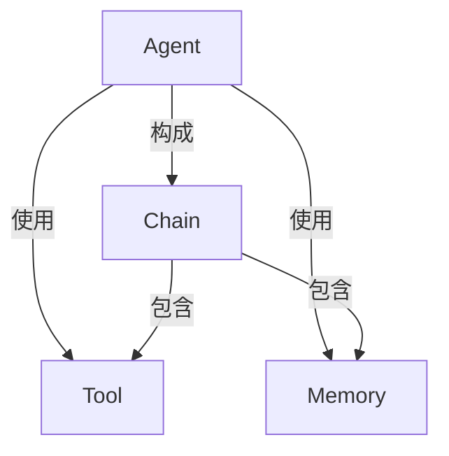
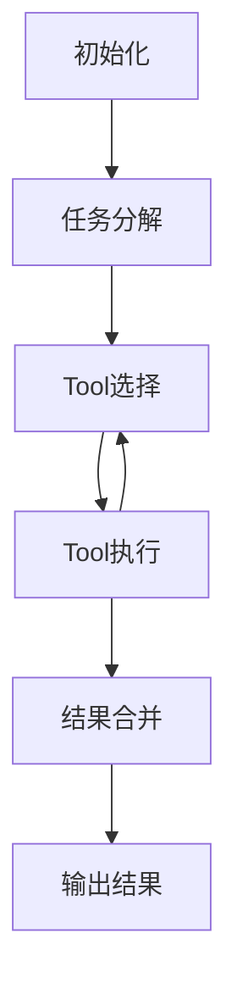

# 【LangChain编程：从入门到实践】LangChain简介

## 1. 背景介绍

### 1.1 问题的由来

在当今数字化时代，人工智能(AI)和大型语言模型(LLM)的应用越来越广泛。然而,将这些强大的AI模型集成到实际应用程序中仍然是一个巨大的挑战。开发人员需要处理各种复杂的任务,如数据预处理、模型选择、输出解析等,这些任务通常需要大量的样板代码和重复工作。

### 1.2 研究现状

为了简化AI应用程序的开发过程,出现了一些框架和库,旨在提供更高层次的抽象和工具。其中,LangChain是一个Python库,它为开发人员提供了一种简单而强大的方式来构建基于LLM的应用程序。

### 1.3 研究意义

LangChain的出现极大地降低了AI应用程序开发的复杂性,使开发人员能够更加专注于解决实际问题,而不是被繁琐的底层细节所困扰。通过提供模块化和可组合的构建块,LangChain使得构建、测试和部署AI应用程序变得更加高效和可靠。

### 1.4 本文结构

本文将全面介绍LangChain,包括其核心概念、算法原理、数学模型、代码实现、实际应用场景、工具和资源推荐等。我们将深入探讨LangChain如何简化AI应用程序的开发,并为读者提供从入门到实践的指导。

## 2. 核心概念与联系

LangChain的核心概念包括Agent、Tool、Memory和Chain。这些概念相互关联,共同构建了LangChain的框架。



- **Agent**:代表一个智能代理,它可以根据给定的指令执行特定的任务。Agent通过与Tool和Memory交互来完成任务。
- **Tool**:表示一个可执行的功能单元,如API调用、数据库查询或文本处理等。Agent可以调用多个Tool来完成复杂的任务。
- **Memory**:用于存储和检索与Agent相关的信息,如对话历史、中间结果等。Memory可以帮助Agent保持上下文和状态。
- **Chain**:将Agent、Tool和Memory组合在一起,形成一个可执行的流程链。Chain定义了Agent如何与Tool和Memory交互,以及执行任务的顺序。

这些核心概念的组合使LangChain具有极大的灵活性和可扩展性。开发人员可以根据需求定制和组合不同的Agent、Tool、Memory和Chain,从而构建出各种复杂的AI应用程序。

## 3. 核心算法原理 & 具体操作步骤

### 3.1 算法原理概述

LangChain的核心算法原理是基于**代理-环境交互**的范式。这种范式源自强化学习领域,将智能代理(Agent)视为与环境(Environment)进行交互的实体。在LangChain中,环境由Tool和Memory组成。

算法的基本思路是:

1. Agent根据给定的指令,确定需要执行的任务。
2. Agent查询可用的Tool和Memory,选择合适的Tool和Memory来执行任务。
3. Agent调用选定的Tool,并将结果存储在Memory中。
4. 重复步骤2和3,直到任务完成。
5. Agent返回最终结果。

在这个过程中,Agent通过与环境交互来完成任务,而环境则提供了必要的功能和信息支持。

### 3.2 算法步骤详解

LangChain的核心算法可以分为以下几个步骤:

1. **初始化**:创建Agent、Tool、Memory和Chain实例。
2. **任务分解**:Agent将给定的指令分解为一系列子任务。
3. **Tool选择**:Agent根据子任务的需求,从可用的Tool中选择合适的Tool。
4. **Tool执行**:Agent调用选定的Tool,并将结果存储在Memory中。
5. **结果合并**:Agent将各个子任务的结果合并,形成最终结果。
6. **输出结果**:Agent返回最终结果。

在步骤3和4中,Agent可能需要多次与Tool和Memory交互,以完成复杂的任务。这种迭代过程是LangChain算法的核心特征之一。



### 3.3 算法优缺点

**优点**:

- 模块化设计,易于扩展和定制。
- 支持多种LLM和Tool,可以集成各种功能。
- 提供了丰富的内置Agent、Tool和Memory实现。
- 支持自定义Agent逻辑,满足特殊需求。

**缺点**:

- 对于复杂任务,Agent可能需要进行多次迭代,导致性能下降。
- 算法的有效性依赖于Tool和Memory的质量和覆盖范围。
- 对于一些特殊场景,可能需要进行额外的定制和优化。

### 3.4 算法应用领域

LangChain的核心算法可以应用于各种领域,包括但不限于:

- 自然语言处理(NLP):如问答系统、文本摘要、情感分析等。
- 知识管理:如知识库构建、信息检索、知识图谱等。
- 任务自动化:如工作流程自动化、数据处理等。
- 智能助手:如个人助理、客户服务等。

无论是在企业级应用还是个人项目中,LangChain都可以为开发人员提供强大的支持,帮助他们更高效地构建基于LLM的AI应用程序。

## 4. 数学模型和公式 & 详细讲解 & 举例说明

### 4.1 数学模型构建

在LangChain中,Agent的行为可以用**马尔可夫决策过程(MDP)** 来建模。MDP是一种用于描述序列决策问题的数学框架,它由以下几个要素组成:

- 状态集合 $\mathcal{S}$
- 动作集合 $\mathcal{A}$
- 转移概率 $\mathcal{P}_{ss'}^a = \mathbb{P}(s' | s, a)$
- 奖励函数 $\mathcal{R}_s^a$

在LangChain的上下文中:

- 状态 $s \in \mathcal{S}$ 表示Agent当前的状态,包括任务进度、Memory中的信息等。
- 动作 $a \in \mathcal{A}$ 表示Agent可以执行的操作,如调用Tool、更新Memory等。
- 转移概率 $\mathcal{P}_{ss'}^a$ 描述了在执行动作 $a$ 时,从状态 $s$ 转移到状态 $s'$ 的概率。
- 奖励函数 $\mathcal{R}_s^a$ 定义了在状态 $s$ 执行动作 $a$ 时获得的奖励。

Agent的目标是找到一个策略 $\pi: \mathcal{S} \rightarrow \mathcal{A}$,使得在执行任务的过程中获得的累积奖励最大化。

### 4.2 公式推导过程

在MDP框架下,我们可以使用**值迭代**或**策略迭代**等算法来求解最优策略。以值迭代为例,我们定义状态值函数 $V(s)$ 表示在状态 $s$ 下遵循最优策略可获得的预期累积奖励:

$$V(s) = \max_{\pi} \mathbb{E}_{\pi} \left[ \sum_{t=0}^{\infty} \gamma^t R_{t} | s_0 = s \right]$$

其中 $\gamma \in [0, 1)$ 是折现因子,用于平衡即时奖励和长期奖励的权重。

通过应用**贝尔曼方程**,我们可以递归地计算出 $V(s)$:

$$V(s) = \max_{a} \mathcal{R}_s^a + \gamma \sum_{s'} \mathcal{P}_{ss'}^a V(s')$$

基于状态值函数,我们可以得到最优策略 $\pi^*(s) = \arg\max_a \left( \mathcal{R}_s^a + \gamma \sum_{s'} \mathcal{P}_{ss'}^a V(s') \right)$。

值迭代算法通过不断更新状态值函数,直到收敛于最优值函数,从而获得最优策略。

### 4.3 案例分析与讲解

考虑一个简单的问答任务,Agent需要从一个知识库中查找相关信息来回答问题。在这个场景中:

- 状态 $s$ 包括当前的问题、已查找的信息和剩余的知识库。
- 动作 $a$ 可以是查询知识库、组合信息或返回最终答案。
- 转移概率 $\mathcal{P}_{ss'}^a$ 取决于查询的结果和信息组合的质量。
- 奖励函数 $\mathcal{R}_s^a$ 可以根据答案的准确性和查询成本来设计。

假设Agent已经查找到了一些相关信息,它需要决定是继续查询还是直接给出答案。根据状态值函数,Agent可以比较两种动作的预期累积奖励,选择获得更高奖励的动作。

通过不断迭代这个过程,Agent最终会找到一个最优策略,在查询成本和答案质量之间达到平衡。

### 4.4 常见问题解答

**Q: 为什么要使用MDP模型?**

A: MDP模型为LangChain提供了一个坚实的理论基础,使Agent的行为可以在数学上进行建模和优化。它还允许我们借鉴强化学习领域的各种算法和技术,如值迭代、策略梯度等,从而提高Agent的性能。

**Q: 如何设计合适的奖励函数?**

A: 奖励函数的设计对Agent的行为有着重大影响。一般来说,奖励函数应该反映任务的目标,如答案的准确性、查询成本等。同时,也需要考虑长期奖励和即时奖励之间的权衡。在实践中,通常需要进行一些试验来调整奖励函数。

**Q: MDP模型是否适用于所有场景?**

A: MDP模型是一个通用的框架,可以应用于大多数场景。但是,对于一些特殊情况,如部分可观测环境或连续状态空间,可能需要使用其他模型,如部分可观测MDP或连续MDP。LangChain也提供了相应的支持和扩展。

## 5. 项目实践:代码实例和详细解释说明

### 5.1 开发环境搭建

在开始使用LangChain之前,我们需要先设置开发环境。以下是搭建步骤:

1. 安装Python(版本 >= 3.7)
2. 创建并激活虚拟环境:

```bash
python -m venv env
source env/bin/activate  # Windows: \env\Scripts\activate
```

3. 安装LangChain:

```bash
pip install langchain
```

4. 安装所需的LLM提供者,如OpenAI:

```bash
pip install openai
```

5. 配置LLM提供者的API密钥(如OpenAI API Key)。

完成上述步骤后,您就可以开始使用LangChain进行开发了。

### 5.2 源代码详细实现

下面是一个简单的LangChain代码示例,演示了如何构建一个基本的问答应用程序:

```python
from langchain.llms import OpenAI
from langchain.agents import initialize_agent, Tool
from langchain.agents import AgentType

# 初始化LLM
llm = OpenAI(temperature=0)

# 定义Tools
tools = [
    Tool(
        name="Wikipedia Search",
        func=lambda query: f"Wikipedia search result for: {query}",
        description="A Wikipedia search tool"
    )
]

# 初始化Agent
agent = initialize_agent(tools, llm, agent=AgentType.ZERO_SHOT_REACT_DESCRIPTION, verbose=True)

# 运行Agent
query = "What is the capital of France?"
result = agent.run(query)
print(result)
```

让我们逐步解释这段代码:

1. 首先,我们导入必要的模块和类。
2. 然后,我们初始化一个OpenAI LLM实例作为Agent的大脑。
3. 接下来,我们定义了一个名为"Wikipedia Search"的Tool,它模拟了Wikipedia搜索的功能。在实际应用中,您可以替换为真实的API调用或其他功能。
4. 使用`initialize_agent`函数,我们创建了一个Agent实例,并将Tools和LLM传递给它。这里我们使用了`Ag