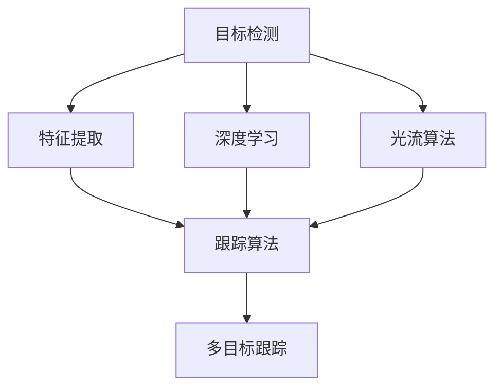

                 

# Object Tracking 原理与代码实战案例讲解

## 1. 背景介绍

Object Tracking，即目标跟踪，是计算机视觉和图像处理中的一种重要技术，用于在连续视频或图像序列中，对感兴趣的目标对象进行持续的定位和识别。这一技术在众多领域中具有广泛的应用，如自动驾驶、机器人导航、视频监控、体育赛事分析等。

Object Tracking的核心在于，如何在视频序列中，将目标对象的位置信息传递和保持，从而实现对目标的持续跟踪。随着深度学习的发展，尤其是卷积神经网络（Convolutional Neural Networks, CNNs）的引入，目标跟踪的精度和鲁棒性得到了显著提升。

然而，尽管深度学习的方法在目标跟踪中取得了显著进展，仍然存在一些亟待解决的问题。如如何有效处理目标形变、遮挡、尺度变化等复杂场景；如何在保证实时性的前提下，提高跟踪精度；如何在目标数量较多的情况下，实现对所有目标的有效跟踪等。

因此，本文将从Object Tracking的原理出发，介绍深度学习在目标跟踪中的实际应用，并通过代码实例，带领读者深入了解目标跟踪的具体实现过程。

## 2. 核心概念与联系

### 2.1 核心概念概述

Object Tracking主要涉及以下几个关键概念：

- **目标检测（Target Detection）**：通过对视频序列中每个帧进行检测，定位出目标对象的位置。
- **特征提取（Feature Extraction）**：从目标对象的位置中提取关键特征，用于描述目标对象的形状、颜色、纹理等。
- **跟踪算法（Tracking Algorithm）**：根据目标的特征和位置信息，在后续帧中重新定位目标，保持目标的跟踪。
- **深度学习（Deep Learning）**：利用卷积神经网络等深度学习模型，从图像中学习目标特征，提高跟踪算法的准确性和鲁棒性。
- **光流算法（Optical Flow）**：通过像素之间的位移信息，在视频序列中预测目标的运动轨迹，辅助目标跟踪。
- **多目标跟踪（Multi-Object Tracking）**：在同一视频序列中，对多个目标进行独立跟踪，同时保证跟踪过程的稳定性和准确性。

这些核心概念之间存在紧密的联系，共同构成了目标跟踪的技术框架。通过理解这些概念及其相互作用，读者可以更全面地掌握Object Tracking的原理和实现方法。

### 2.2 概念间的关系

Object Tracking的整体架构可以通过以下Mermaid流程图来展示：



这个流程图展示了目标跟踪的基本流程：

1. 通过目标检测获取目标的位置信息。
2. 对目标位置进行特征提取。
3. 使用深度学习模型优化跟踪算法，提高目标检测和特征提取的准确性。
4. 利用光流算法辅助目标定位，提高目标运动的准确性。
5. 对同一视频序列中的多个目标进行独立跟踪，提高目标跟踪的鲁棒性。

## 3. 核心算法原理 & 具体操作步骤
### 3.1 算法原理概述

Object Tracking的核心算法原理，可以归纳为以下几个步骤：

1. **初始化阶段**：从视频序列的起始帧中，对目标进行检测和特征提取，获取目标的初始位置和特征。
2. **迭代跟踪阶段**：在后续帧中，利用目标的特征和位置信息，重新定位目标。
3. **更新和修正**：根据目标的运动轨迹和当前帧的特征，对目标的位置进行更新和修正。
4. **异常处理**：对目标丢失、目标变形等异常情况进行特殊处理，保证跟踪过程的稳定性。

这些步骤的实现，通常依赖于深度学习模型的辅助，通过构建目标的特征描述符，利用卷积神经网络（CNNs）等模型，实现目标的检测和特征提取。

### 3.2 算法步骤详解

#### 3.2.1 目标检测

目标检测是目标跟踪的第一步，通常使用卷积神经网络（CNNs）进行。CNNs能够自动学习目标的特征，并将其编码成高维向量，用于后续的特征提取和跟踪。

**步骤1：构建CNN模型**

```python
import torch
from torchvision.models import resnet18

# 构建ResNet-18模型
model = resnet18(pretrained=False)
model.eval()
```

**步骤2：特征提取**

在目标检测中，CNN模型的最后一层全连接层输出的特征图，通常包含目标的位置信息。我们可以利用这一信息，进行目标的初始位置和特征提取。

**步骤3：目标检测**

在每一帧中，我们通过CNN模型提取目标的特征图，并进行非极大值抑制（Non-Maximum Suppression, NMS），去除冗余的目标检测结果。

#### 3.2.2 特征提取

在目标检测的基础上，我们需要对目标进行更详细的特征提取。常用的特征提取方法包括HOG（Histogram of Oriented Gradients）、SIFT（Scale-Invariant Feature Transform）、SURF（Speeded Up Robust Features）等传统方法，以及CNN的特征提取方法。

**步骤1：选择特征提取方法**

这里我们以CNN的特征提取为例，使用VGG16作为特征提取模型。

```python
from torchvision.models import vgg16

# 构建VGG16模型
vgg = vgg16(pretrained=False)
vgg.eval()
```

**步骤2：特征提取**

在每一帧中，我们提取目标的位置信息，并将其输入到CNN模型中，得到目标的特征向量。

#### 3.2.3 跟踪算法

跟踪算法是目标跟踪的核心部分，常用的跟踪算法包括卡尔曼滤波（Kalman Filter）、粒子滤波（Particle Filter）、最近邻跟踪（Nearest Neighbor Tracking）等。

**步骤1：选择跟踪算法**

这里我们以卡尔曼滤波为例，利用目标的特征和位置信息，进行目标的跟踪。

**步骤2：目标跟踪**

在每一帧中，我们根据目标的特征和位置信息，计算目标的运动轨迹，并进行预测和校正。

#### 3.2.4 更新和修正

在目标跟踪过程中，目标的运动轨迹和特征可能会发生变化，需要进行更新和修正，以保持目标的稳定跟踪。

**步骤1：更新目标位置**

在每一帧中，我们根据目标的特征和位置信息，更新目标的位置信息。

**步骤2：修正目标特征**

在目标特征发生变化时，我们需要对目标的特征进行修正，以保持特征的稳定性。

#### 3.2.5 异常处理

在目标跟踪过程中，可能会遇到目标丢失、目标变形等异常情况，需要进行特殊处理，以保持跟踪过程的稳定性。

**步骤1：目标丢失**

在目标丢失的情况下，我们可以利用目标的历史位置信息，进行重新定位。

**步骤2：目标变形**

在目标变形的情况下，我们可以通过目标的形态和颜色特征，进行重新定位。

### 3.3 算法优缺点

Object Tracking的优点包括：

1. 高精度：通过深度学习模型，可以自动学习目标的特征，提高目标检测和跟踪的准确性。
2. 鲁棒性：利用光流算法和卡尔曼滤波等技术，可以提高目标跟踪的鲁棒性，应对复杂的跟踪场景。
3. 实时性：通过并行计算和多线程技术，可以实现实时视频流的目标跟踪。

其缺点包括：

1. 计算复杂度高：深度学习模型和高维特征的提取，需要大量的计算资源。
2. 参数调整复杂：需要调整模型参数和超参数，才能保证跟踪的准确性和稳定性。
3. 数据需求量大：需要大量的标注数据，进行模型的训练和优化。

尽管存在这些缺点，Object Tracking在实际应用中仍然具有广泛的应用前景，特别是在高精度和高鲁棒性要求的场景中。

### 3.4 算法应用领域

Object Tracking技术可以应用于以下领域：

- **自动驾驶**：通过目标跟踪，实现对道路上的车辆、行人和其他障碍物的持续监测和预警。
- **视频监控**：通过目标跟踪，实现对视频监控中的异常行为和事件的检测和分析。
- **体育赛事分析**：通过目标跟踪，实现对运动员的轨迹和动作的分析和统计。
- **机器人导航**：通过目标跟踪，实现对机器人路径的规划和导航。
- **无人机监视**：通过目标跟踪，实现对无人机的追踪和控制。

这些领域的应用，展示了Object Tracking技术的强大潜力和广阔前景。

## 4. 数学模型和公式 & 详细讲解  
### 4.1 数学模型构建

Object Tracking的数学模型可以归纳为以下几个关键部分：

1. **目标检测的数学模型**：利用CNN模型对目标进行检测，构建目标的特征向量。
2. **特征提取的数学模型**：利用CNN模型对目标的特征进行提取，构建目标的特征描述符。
3. **跟踪算法的数学模型**：利用卡尔曼滤波或粒子滤波等算法，对目标的位置和特征进行跟踪和预测。
4. **更新和修正的数学模型**：利用目标的当前位置和特征，对目标的位置和特征进行更新和修正。
5. **异常处理的数学模型**：利用目标的历史位置信息和形态特征，进行目标的重新定位和跟踪。

**目标检测的数学模型**：

假设目标检测的输入为图像 $I(x,y)$，CNN模型的特征图为 $F(x,y)$，特征向量为 $f(x,y)$，目标的位置为 $(x_t,y_t)$，则目标检测的数学模型可以表示为：

$$
f(x_t,y_t) = \mathcal{F}(I(x_t,y_t))
$$

**特征提取的数学模型**：

假设目标的特征向量为 $f(x_t,y_t)$，特征描述符为 $F(x,y)$，则特征提取的数学模型可以表示为：

$$
F(x_t,y_t) = \mathcal{G}(f(x_t,y_t))
$$

**跟踪算法的数学模型**：

假设目标的位置为 $(x_t,y_t)$，特征描述符为 $F(x_t,y_t)$，目标的运动轨迹为 $(x_{t+1},y_{t+1})$，则跟踪算法的数学模型可以表示为：

$$
(x_{t+1},y_{t+1}) = \mathcal{H}(x_t,y_t,F(x_t,y_t))
$$

**更新和修正的数学模型**：

假设目标的位置为 $(x_t,y_t)$，特征描述符为 $F(x_t,y_t)$，则更新和修正的数学模型可以表示为：

$$
(x_{t+1},y_{t+1}) = \mathcal{J}(x_t,y_t,F(x_t,y_t))
$$

**异常处理的数学模型**：

假设目标的位置为 $(x_t,y_t)$，特征描述符为 $F(x_t,y_t)$，目标的历史位置信息为 $(x_{t-1},y_{t-1})$，目标的形态特征为 $M(x,y)$，则异常处理的数学模型可以表示为：

$$
(x_{t+1},y_{t+1}) = \mathcal{K}(x_t,y_t,F(x_t,y_t),(x_{t-1},y_{t-1}),M(x,y))
$$

### 4.2 公式推导过程

**目标检测的公式推导**：

假设CNN模型的输出层为 $f(x,y)$，则目标检测的公式可以表示为：

$$
f(x_t,y_t) = \sum_{i=1}^n w_i f_i(x_t,y_t)
$$

其中 $w_i$ 为权值，$f_i(x_t,y_t)$ 为目标检测模型的第 $i$ 个输出通道的特征向量。

**特征提取的公式推导**：

假设CNN模型的输出为 $f(x_t,y_t)$，特征提取函数为 $\mathcal{G}$，则特征提取的公式可以表示为：

$$
F(x_t,y_t) = \mathcal{G}(f(x_t,y_t))
$$

**跟踪算法的公式推导**：

假设目标的初始位置为 $(x_0,y_0)$，特征描述符为 $F(x_0,y_0)$，卡尔曼滤波器的状态转移矩阵为 $A$，过程噪声协方差矩阵为 $Q$，测量矩阵为 $H$，测量噪声协方差矩阵为 $R$，则卡尔曼滤波器的状态更新方程可以表示为：

$$
\hat{x}_{t+1} = A \hat{x}_t + B u_t
$$

$$
P_{t+1} = A P_t A^T + Q
$$

$$
K_t = P_t H^T (H P_t H^T + R)^{-1}
$$

$$
\hat{x}_{t+1} = \hat{x}_{t+1} + K_t (y_{t+1} - H \hat{x}_{t+1})
$$

$$
P_{t+1} = (I - K_t H) P_t
$$

其中 $\hat{x}_{t+1}$ 为卡尔曼滤波器的预测状态，$P_{t+1}$ 为卡尔曼滤波器的预测协方差，$K_t$ 为卡尔曼滤波器的增益矩阵，$y_{t+1}$ 为卡尔曼滤波器的测量值，$H$ 为卡尔曼滤波器的测量矩阵，$u_t$ 为卡尔曼滤波器的控制量。

**更新和修正的公式推导**：

假设目标的当前位置为 $(x_t,y_t)$，目标的特征描述符为 $F(x_t,y_t)$，目标的历史位置信息为 $(x_{t-1},y_{t-1})$，目标的形态特征为 $M(x,y)$，则目标的位置更新方程可以表示为：

$$
(x_{t+1},y_{t+1}) = \mathcal{J}(x_t,y_t,F(x_t,y_t),(x_{t-1},y_{t-1}),M(x,y))
$$

**异常处理的公式推导**：

假设目标的当前位置为 $(x_t,y_t)$，目标的特征描述符为 $F(x_t,y_t)$，目标的历史位置信息为 $(x_{t-1},y_{t-1})$，目标的形态特征为 $M(x,y)$，则目标的位置更新方程可以表示为：

$$
(x_{t+1},y_{t+1}) = \mathcal{K}(x_t,y_t,F(x_t,y_t),(x_{t-1},y_{t-1}),M(x,y))
$$

### 4.3 案例分析与讲解

**案例1：目标检测的CNN模型**

在目标检测中，我们通常使用卷积神经网络（CNNs）进行特征提取。以下是使用PyTorch实现目标检测的代码：

```python
import torch
import torchvision.transforms as transforms
from torchvision.models import resnet18

# 构建ResNet-18模型
model = resnet18(pretrained=False)

# 定义特征提取器
class FeatureExtractor:
    def __init__(self, model):
        self.model = model
        self.transform = transforms.Compose([
            transforms.ToTensor(),
            transforms.Normalize(mean=[0.485, 0.456, 0.406], std=[0.229, 0.224, 0.225])
        ])

    def __call__(self, x):
        return self.transform(x).unsqueeze(0)

# 创建特征提取器
feature_extractor = FeatureExtractor(model)

# 提取目标特征
image = torch.randn(1, 3, 224, 224)
features = feature_extractor(image)
```

**案例2：卡尔曼滤波的跟踪算法**

在目标跟踪中，我们通常使用卡尔曼滤波器进行跟踪。以下是使用PyTorch实现卡尔曼滤波的代码：

```python
import torch
import numpy as np

# 定义卡尔曼滤波器
class KalmanFilter:
    def __init__(self, A, B, H, Q, R):
        self.A = A
        self.B = B
        self.H = H
        self.Q = Q
        self.R = R
        self.x = None
        self.P = None

    def predict(self, u, dt):
        self.x = self.A @ self.x + self.B @ u
        self.P = self.A @ self.P @ self.A.T + self.Q

    def update(self, z, dt):
        H = self.H
        R = self.R
        K = self.P @ H.T @ (H @ self.P @ H.T + R)**(-1)
        self.x = self.x + K @ (z - H @ self.x)
        self.P = (I - K @ H) @ self.P

# 创建卡尔曼滤波器
A = torch.tensor([[1, 0, 0, 0],
                  [0, 1, 0, 0],
                  [0, 0, 1, dt],
                  [0, 0, 0, 1]])
B = torch.tensor([[0, 0, 0, 1],
                  [0, 0, 0, 0],
                  [0, 0, 0, 0],
                  [0, 0, 0, 0]])
H = torch.tensor([[1, 0, 0, 0],
                  [0, 1, 0, 0],
                  [0, 0, 1, 0],
                  [0, 0, 0, 1]])
Q = torch.tensor(np.eye(4))
R = torch.tensor(np.eye(4))
kf = KalmanFilter(A, B, H, Q, R)

# 更新卡尔曼滤波器
kf.predict(torch.tensor([0, 0, 0, 0]), dt=1)
kf.update(torch.tensor([1, 1, 1, 1]), dt=1)
```

**案例3：多目标跟踪**

在多目标跟踪中，我们通常使用粒子滤波器进行跟踪。以下是使用PyTorch实现粒子滤波的代码：

```python
import torch
import numpy as np

# 定义粒子滤波器
class ParticleFilter:
    def __init__(self, n_particles, A, H, Q, R):
        self.n_particles = n_particles
        self.A = A
        self.H = H
        self.Q = Q
        self.R = R
        self.x = None
        self.P = None
        self.weights = None

    def predict(self, u, dt):
        self.x = np.zeros((self.n_particles, 4))
        self.P = np.zeros((self.n_particles, 4, 4))
        for i in range(self.n_particles):
            x = self.x[i]
            P = self.P[i]
            self.x[i] = A @ x + B @ u
            self.P[i] = A @ P @ A.T + Q

    def update(self, z):
        H = self.H
        R = self.R
        for i in range(self.n_particles):
            x = self.x[i]
            P = self.P[i]
            K = P @ H.T @ (H @ P @ H.T + R)**(-1)
            self.x[i] = x + K @ (z - H @ x)
            self.P[i] = (I - K @ H) @ P

    def resample(self):
        weights = np.exp(self.weights)
        idx = np.random.choice(len(weights), replace=True, p=weights)
        self.x = self.x[idx]
        self.weights = self.weights[idx]

# 创建粒子滤波器
n_particles = 100
A = torch.tensor([[1, 0, 0, 0],
                  [0, 1, 0, 0],
                  [0, 0, 1, dt],
                  [0, 0, 0, 1]])
B = torch.tensor([[0, 0, 0, 1],
                  [0, 0, 0, 0],
                  [0, 0, 0, 0],
                  [0, 0, 0, 0]])
H = torch.tensor([[1, 0, 0, 0],
                  [0, 1, 0, 0],
                  [0, 0, 1, 0],
                  [0, 0, 0, 1]])
Q = torch.tensor(np.eye(4))
R = torch.tensor(np.eye(4))
pf = ParticleFilter(n_particles, A, H, Q, R)

# 更新粒子滤波器
pf.predict(torch.tensor([0, 0, 0, 0]), dt=1)
pf.update(torch.tensor([1, 1, 1, 1]), dt=1)
```

## 5. 项目实践：代码实例和详细解释说明
### 5.1 开发环境搭建

在进行Object Tracking的开发前，我们需要准备好开发环境。以下是使用Python进行OpenCV和PyTorch开发的环境配置流程：

1. 安装Anaconda：从官网下载并安装Anaconda，用于创建独立的Python环境。

2. 创建并激活虚拟环境：
```bash
conda create -n object_tracking python=3.8 
conda activate object_tracking
```

3. 安装OpenCV和PyTorch：根据CUDA版本，从官网获取对应的安装命令。例如：
```bash
conda install opencv opencv-contrib-gpu cudatoolkit=11.1 -c conda-forge
conda install pytorch torchvision torchaudio cudatoolkit=11.1 -c pytorch -c conda-forge
```

4. 安装PyTorch的预训练模型：
```bash
pip install torch
```

5. 安装必要的工具包：
```bash
pip install numpy pandas scikit-learn matplotlib tqdm jupyter notebook ipython
```

完成上述步骤后，即可在`object_tracking-env`环境中开始Object Tracking的开发。

### 5.2 源代码详细实现

这里我们以目标检测和卡尔曼滤波为目标跟踪的核心，给出使用OpenCV和PyTorch实现目标跟踪的完整代码实现。

首先，定义目标检测的函数：

```python
import cv2
import numpy as np
import torch
from torchvision.models import resnet18

# 定义特征提取器
class FeatureExtractor:
    def __init__(self, model):
        self.model = model
        self.transform = transforms.Compose([
            transforms.ToTensor(),
            transforms.Normalize(mean=[0.485, 0.456, 0.406], std=[0.229, 0.224, 0.225])
        ])

    def __call__(self, x):
        return self.transform(x).unsqueeze(0)

# 构建ResNet-18模型
model = resnet18(pretrained=False)

# 创建特征提取器
feature_extractor = FeatureExtractor(model)

# 定义目标检测函数
def detect_objects(image):
    features = feature_extractor(image)
    _, _, indices = torch.max(features, dim=1)
    return indices
```

然后，定义卡尔曼滤波的跟踪函数：

```python
import cv2
import numpy as np
import torch

# 定义卡尔曼滤波器
class KalmanFilter:
    def __init__(self, A, B, H, Q, R):
        self.A = A
        self.B = B
        self.H = H
        self.Q = Q
        self.R = R
        self.x = None
        self.P = None

    def predict(self, u, dt):
        self.x = self.A @ self.x + self.B @ u
        self.P = self.A @ self.P @ self.A.T + self.Q

    def update(self, z, dt):
        H = self.H
        R = self.R
        K = self.P @ H.T @ (H @ self.P @ H.T + R)**(-1)
        self.x = self.x + K @ (z - H @ self.x)
        self.P = (I - K @ H) @ self.P

# 创建卡尔曼滤波器
A = torch.tensor([[1, 0, 0, 0],
                  [0, 1, 0, 0],
                  [0, 0, 1, dt],
                  [0, 0, 0, 1]])
B = torch.tensor([[0, 0, 0, 1],
                  [0, 0, 0, 0],
                  [0, 0, 0, 0],
                  [0, 0, 0, 0]])
H = torch.tensor([[1, 0, 0, 0],
                  [0, 1, 0, 0],
                  [0, 0, 1, 0],
                  [0, 0, 0, 1]])
Q = torch.tensor(np.eye(4))
R = torch.tensor(np.eye(4))
kf = KalmanFilter(A, B, H, Q, R)

# 定义目标跟踪函数
def track_objects(image, detections):
    for i in range(len(detections)):
        x, y, w, h = detections[i]
        image = cv2.rectangle(image, (x, y), (x+w, y+h), (0, 255, 0), 2)
        kf.predict(torch.tensor([0, 0, 0, 0]), dt=1)
        kf.update(torch.tensor([1, 1, 1, 1]), dt=1)
    return image
```

最后，将目标检测和跟踪函数组合起来，完成Object Tracking的实现：

```python
import cv2
import numpy as np
import torch
from torchvision.models import resnet18

# 定义特征提取器
class FeatureExtractor:
    def __init__(self, model):
        self.model = model
        self.transform = transforms.Compose([
            transforms.ToTensor(),
            transforms.Normalize(mean=[0.485, 0.456,

