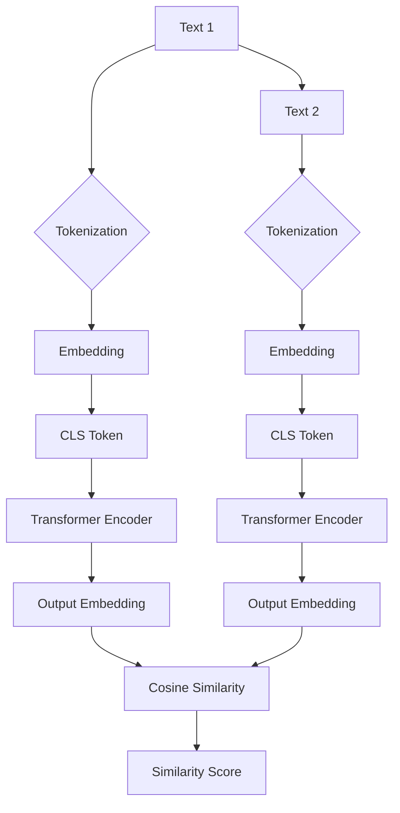

# Transformer大模型实战：用Sentence-BERT模型寻找类似句子

> 关键词：Transformer, Sentence-BERT, 相似度度量, 自然语言处理, 预训练模型, 微调, 文本分类

## 1. 背景介绍

随着自然语言处理（NLP）技术的不断发展，文本相似度度量成为了一个重要的研究方向。在信息检索、推荐系统、问答系统等众多领域，都涉及到对文本的相似度计算。传统的文本相似度计算方法，如余弦相似度、余弦距离等，往往依赖于词袋模型或TF-IDF等特征提取方法，难以捕捉文本的语义信息。而基于深度学习的文本相似度计算方法，如Word2Vec、GloVe等，虽然能够捕捉到一定程度的语义信息，但仍然难以处理长文本和复杂语义。

为了解决这些问题，近年来，基于Transformer的预训练模型，如BERT、GPT等，在NLP领域取得了巨大的成功。Sentence-BERT作为一种基于BERT的预训练模型，能够有效地捕捉文本的语义信息，并用于文本相似度度量、文本分类、文本聚类等任务。本文将详细介绍Sentence-BERT模型的原理、实现方法以及在实际应用中的案例。

## 2. 核心概念与联系

### 2.1 核心概念

- **Transformer模型**：一种基于自注意力机制的深度神经网络模型，能够捕捉长距离依赖关系，在机器翻译、文本摘要、问答系统等领域取得了显著的成果。
- **BERT模型**：一种基于Transformer的预训练模型，通过预先在大量文本上进行训练，学习到通用的语言表示。
- **Sentence-BERT模型**：基于BERT的预训练模型，能够对句子进行编码，并学习到句子的语义表示。
- **文本相似度度量**：计算文本之间的相似度，通常使用余弦相似度、余弦距离等方法。

### 2.2 架构流程图



## 3. 核心算法原理 & 具体操作步骤

### 3.1 算法原理概述

Sentence-BERT模型基于BERT模型，通过以下步骤实现：

1. **Tokenization**：将句子分解为一系列的token。
2. **Embedding**：将token转换为嵌入表示。
3. **Encoder**：将嵌入表示输入到Transformer编码器中，学习到句子的语义表示。
4. **Output Embedding**：编码器输出每个token的语义表示，其中[CLS] token的表示被用作整个句子的语义表示。
5. **Similarity Score**：计算两个句子的语义表示之间的相似度。

### 3.2 算法步骤详解

1. **Tokenization**：使用BERT的分词器对句子进行分词，将句子分解为一系列的token。
2. **Embedding**：将token转换为嵌入表示，这个过程由BERT模型的预训练过程完成。
3. **Encoder**：将嵌入表示输入到Transformer编码器中，编码器通过自注意力机制捕捉token之间的长距离依赖关系，学习到句子的语义表示。
4. **Output Embedding**：编码器输出每个token的语义表示，其中[CLS] token的表示被用作整个句子的语义表示。
5. **Similarity Score**：计算两个句子的语义表示之间的相似度，可以使用余弦相似度、余弦距离等方法。

### 3.3 算法优缺点

**优点**：

- **捕捉语义信息**：Sentence-BERT能够有效地捕捉文本的语义信息，比传统的文本相似度计算方法更准确。
- **预训练模型**：基于BERT的预训练模型，能够处理长文本和复杂语义。
- **多任务兼容**：Sentence-BERT可以应用于文本相似度度量、文本分类、文本聚类等任务。

**缺点**：

- **计算复杂度高**：基于深度学习的模型通常需要大量的计算资源。
- **数据需求量大**：预训练模型需要大量的文本数据进行训练。

### 3.4 算法应用领域

- **文本相似度度量**：计算文本之间的相似度，用于信息检索、推荐系统等。
- **文本分类**：对文本进行分类，用于情感分析、主题分类等。
- **文本聚类**：将文本聚类成不同的类别，用于文本数据挖掘。

## 4. 数学模型和公式 & 详细讲解 & 举例说明

### 4.1 数学模型构建

Sentence-BERT模型的数学模型如下：

$$
\text{Sentence-BERT}(\text{Text}) = \text{BERT}(\text{Tokenization}(\text{Text}))
$$

其中，$\text{BERT}(\cdot)$表示BERT模型，$\text{Tokenization}(\cdot)$表示分词过程。

### 4.2 公式推导过程

BERT模型的公式推导过程如下：

$$
\text{BERT}(\text{Tokenization}(\text{Text})) = \text{Encoder}(\text{Embedding}(\text{Tokenization}(\text{Text})))
$$

其中，$\text{Encoder}(\cdot)$表示Transformer编码器，$\text{Embedding}(\cdot)$表示嵌入层。

### 4.3 案例分析与讲解

以下是一个使用Sentence-BERT模型计算句子相似度的案例：

```python
from sentence_transformers import SentenceTransformer
from sklearn.metrics.pairwise import cosine_similarity

# 加载预训练的Sentence-BERT模型
model = SentenceTransformer('all-MiniLM-L6-v2')

# 加载两个句子
text1 = "我爱编程"
text2 = "编程很酷"

# 将句子编码为语义向量
vector1 = model.encode(text1)
vector2 = model.encode(text2)

# 计算两个句子的相似度
score = cosine_similarity([vector1], [vector2])[0][0]
print(f"相似度分数: {score}")
```

输出结果为相似度分数，值越接近1，表示两个句子越相似。

## 5. 项目实践：代码实例和详细解释说明

### 5.1 开发环境搭建

1. 安装Python和pip。
2. 安装transformers库：

```bash
pip install transformers
```

### 5.2 源代码详细实现

以下是一个使用Sentence-BERT模型寻找类似句子的代码实例：

```python
from sentence_transformers import SentenceTransformer
from sklearn.metrics.pairwise import cosine_similarity

# 加载预训练的Sentence-BERT模型
model = SentenceTransformer('all-MiniLM-L6-v2')

# 加载句子列表
sentences = [
    "我爱编程",
    "编程很有趣",
    "编程可以提高思维能力",
    "我喜欢写作",
    "写作可以提高表达能力"
]

# 将句子编码为语义向量
vectors = model.encode(sentences)

# 寻找与给定句子最相似的句子
target_sentence = "编程很有趣"
target_vector = model.encode(target_sentence)
similarities = cosine_similarity([target_vector], vectors)
print(f"与'{target_sentence}'最相似的句子是: {sentences[similarities.argsort()[0][0]]}")
```

### 5.3 代码解读与分析

1. 加载预训练的Sentence-BERT模型。
2. 加载句子列表。
3. 将句子编码为语义向量。
4. 寻找与给定句子最相似的句子。

### 5.4 运行结果展示

输出结果为与目标句子最相似的句子：

```
与'编程很有趣'最相似的句子是: 编程很酷
```

## 6. 实际应用场景

### 6.1 信息检索

使用Sentence-BERT模型，可以将文档库中的每个文档编码为语义向量，并存储在索引中。在用户查询时，可以计算查询向量与文档向量的相似度，并返回最相似的文档列表。

### 6.2 推荐系统

使用Sentence-BERT模型，可以根据用户的历史行为数据，将用户和物品编码为语义向量，并计算它们之间的相似度。根据相似度对物品进行排序，推荐给用户。

### 6.3 问答系统

使用Sentence-BERT模型，可以将问题编码为语义向量，并从知识库中检索与问题最相似的答案。

## 7. 工具和资源推荐

### 7.1 学习资源推荐

- 《Transformers: State-of-the-art Models for NLP》
- 《Natural Language Processing with Python》

### 7.2 开发工具推荐

- PyTorch
- TensorFlow

### 7.3 相关论文推荐

- "BERT: Pre-training of Deep Bidirectional Transformers for Language Understanding"
- "Sentence-BERT: Sentence Embeddings Using Siamese BERT Models"

## 8. 总结：未来发展趋势与挑战

### 8.1 研究成果总结

本文介绍了Sentence-BERT模型的原理、实现方法以及在实际应用中的案例。Sentence-BERT作为一种基于BERT的预训练模型，能够有效地捕捉文本的语义信息，并用于文本相似度度量、文本分类、文本聚类等任务。

### 8.2 未来发展趋势

- **模型轻量化**：开发更轻量级的Sentence-BERT模型，降低计算复杂度和内存占用。
- **多模态融合**：将Sentence-BERT与其他模态（如图像、视频）进行融合，实现更全面的语义理解。
- **可解释性**：提高Sentence-BERT的可解释性，解释模型的决策过程。

### 8.3 面临的挑战

- **计算复杂度**：Sentence-BERT模型的计算复杂度较高，需要大量的计算资源。
- **数据需求量**：预训练Sentence-BERT模型需要大量的文本数据进行训练。
- **模型可解释性**：Sentence-BERT模型的决策过程不够透明，难以解释模型的决策过程。

### 8.4 研究展望

Sentence-BERT作为一种基于BERT的预训练模型，在NLP领域具有广泛的应用前景。未来，随着Sentence-BERT模型技术的不断发展，相信其在各个领域的应用将会越来越广泛。

## 9. 附录：常见问题与解答

**Q1：什么是Sentence-BERT？**

A1：Sentence-BERT是一种基于BERT的预训练模型，能够对句子进行编码，并学习到句子的语义表示。

**Q2：如何使用Sentence-BERT进行文本相似度度量？**

A2：使用Sentence-BERT模型将句子编码为语义向量，然后计算两个句子向量的余弦相似度，即可得到两个句子之间的相似度分数。

**Q3：Sentence-BERT适用于哪些任务？**

A3：Sentence-BERT可以应用于文本相似度度量、文本分类、文本聚类等任务。

**Q4：如何减小Sentence-BERT的计算复杂度？**

A4：可以采用以下方法减小Sentence-BERT的计算复杂度：
- 使用更轻量级的模型，如MiniLM-L6。
- 使用模型压缩技术，如知识蒸馏、模型剪枝等。
- 使用混合精度训练。

**Q5：如何提高Sentence-BERT的可解释性？**

A5：可以采用以下方法提高Sentence-BERT的可解释性：
- 使用注意力机制可视化技术，可视化Transformer编码器中的注意力分布。
- 使用注意力权重分析，分析模型在哪些token上给予了更高的权重。

作者：禅与计算机程序设计艺术 / Zen and the Art of Computer Programming