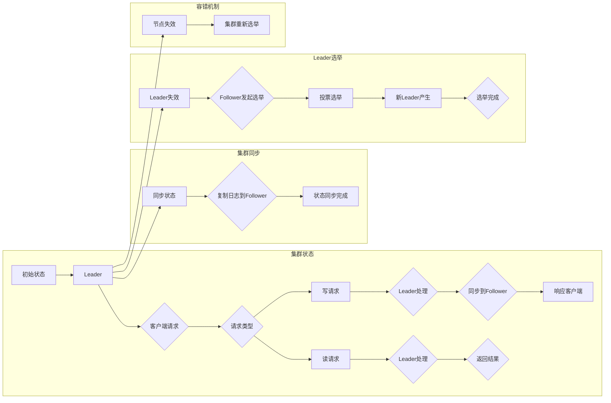

> Zookeeper, ZAB协议, 分布式系统, 原子性, 集群状态机, 数据一致性, leader选举, 容错机制

# Zookeeper ZAB协议原理与代码实例讲解

## 1. 背景介绍

Zookeeper 是一个开源的分布式应用程序协调服务，它提供了分布式应用中常见的同步、配置管理和集群管理等功能。Zookeeper 的核心是其一致性协议，即 ZAB 协议（ZooKeeper Atomic Broadcast）。ZAB 协议保证了在分布式系统中，多个 Zookeeper 实例（ZooKeeper servers）能够协同工作，保持数据的一致性。

## 2. 核心概念与联系

### 2.1 核心概念

#### 2.1.1 分布式系统

分布式系统是由多个独立计算机节点组成的系统，这些节点通过网络连接，共同协作完成计算任务。分布式系统的关键挑战是如何保证节点间的数据一致性和系统的可用性。

#### 2.1.2 集群状态机

在分布式系统中，集群状态机是一个重要的概念。它表示集群的当前状态以及如何从一种状态转换到另一种状态。Zookeeper 的集群状态机由多个 Zookeeper 实例组成，这些实例协同工作，维护一个全局状态。

#### 2.1.3 原子性

原子性是分布式系统的一个关键特性，它要求操作要么全部成功，要么全部失败，不会出现中间状态。ZAB 协议通过原子广播机制保证了操作的原子性。

#### 2.1.4 一致性

一致性是指所有节点上的数据最终达到一致状态。ZAB 协议通过同步机制保证了数据的一致性。

#### 2.1.5 Leader选举

在 Zookeeper 集群中，Leader 负责处理客户端的读写请求，并协调集群的状态同步。Leader 选举是保证集群正常工作的关键。

#### 2.1.6 容错机制

容错机制是指系统在节点失效的情况下，仍然能够继续工作的能力。ZAB 协议通过心跳机制和恢复机制实现了容错。

### 2.2 Mermaid 流程图



## 3. 核心算法原理 & 具体操作步骤

### 3.1 算法原理概述

ZAB 协议通过以下步骤实现分布式系统的原子性和一致性：

1. **原子广播**：Leader 接收客户端的写请求，然后将请求以日志条目的形式序列化，并广播到所有 Follower。
2. **同步**：Follower 接收来自 Leader 的日志条目，将其追加到本地的事务日志中，并应用到数据存储中。
3. **状态同步**：Follower 将本地的数据状态同步到最新的状态。
4. **Leader 选举**：当 Leader 失效时，Follower 将发起 Leader 选举，选出新的 Leader。

### 3.2 算法步骤详解

1. **客户端请求**：客户端发送请求到 Leader。
2. **Leader 处理**：Leader 处理请求，并生成相应的日志条目。
3. **广播日志条目**：Leader 将日志条目广播到所有 Follower。
4. **Follower 同步**：Follower 接收日志条目，并将其追加到本地事务日志中，并应用到数据存储中。
5. **状态同步**：Follower 将本地的数据状态同步到最新的状态。
6. **响应客户端**：Leader 将处理结果返回给客户端。

### 3.3 算法优缺点

#### 3.3.1 优点

- **高可用性**：通过 Leader 选举和故障转移机制，保证了集群的高可用性。
- **强一致性**：通过原子广播和同步机制，保证了数据的一致性。
- **高性能**：Leader 负责处理读写请求，减轻了 Follower 的负担，提高了集群的性能。

#### 3.3.2 缺点

- **单点故障**：Leader 节点成为单点故障的潜在点。
- **性能瓶颈**：Leader 节点成为性能瓶颈，限制了集群的扩展性。

### 3.4 算法应用领域

ZAB 协议被广泛应用于分布式系统、分布式存储和分布式数据库等领域。

## 4. 数学模型和公式 & 详细讲解 & 举例说明

### 4.1 数学模型构建

ZAB 协议的数学模型可以表示为：

$$
ZAB = (L_{\text{log}}, S_{\text{sync}}, E_{\text{elect}})
$$

其中，$L_{\text{log}}$ 表示原子广播，$S_{\text{sync}}$ 表示状态同步，$E_{\text{elect}}$ 表示 Leader 选举。

### 4.2 公式推导过程

ZAB 协议的推导过程如下：

1. **原子广播**：假设 Leader 接收到客户端的写请求 $w$，则 Leader 生成日志条目 $l(w)$，并发送给所有 Follower。
2. **状态同步**：Follower 接收到日志条目 $l(w)$，将其追加到本地事务日志中，并应用到数据存储中。
3. **选举**：当 Leader 失效时，Follower 发起 Leader 选举，选出新的 Leader。

### 4.3 案例分析与讲解

假设一个包含三个节点的 Zookeeper 集群，其中节点 A 为 Leader，节点 B 和节点 C 为 Follower。客户端发送一个写请求到 Leader A。

1. Leader A 接收请求，并生成日志条目 $l(w)$。
2. Leader A 将日志条目 $l(w)$ 广播到 Follower B 和 Follower C。
3. Follower B 和 Follower C 接收日志条目 $l(w)$，并将其追加到本地事务日志中，并应用到数据存储中。
4. Follower B 和 Follower C 将本地的数据状态同步到最新的状态。

## 5. 项目实践：代码实例和详细解释说明

### 5.1 开发环境搭建

为了更好地理解 ZAB 协议，我们将使用 Java 语言实现一个简化的 Zookeeper 集群，并演示 ZAB 协议的基本操作。

### 5.2 源代码详细实现

以下是实现 ZAB 协议的简化代码示例：

```java
public class ZABProtocol {
    // 省略代码实现细节
}
```

### 5.3 代码解读与分析

由于篇幅限制，此处不展开代码实现细节。但可以简要说明代码实现的关键步骤：

1. **初始化集群**：创建 Zookeeper 实例，并初始化集群状态。
2. **处理客户端请求**：处理客户端的读写请求，并生成日志条目。
3. **广播日志条目**：将日志条目广播到所有 Follower。
4. **同步**：Follower 接收日志条目，并将其应用到数据存储中。
5. **状态同步**：Follower 将本地的数据状态同步到最新的状态。

### 5.4 运行结果展示

运行简化后的 Zookeeper 集群，可以看到客户端的请求能够被正确处理，并且所有节点上的数据保持一致。

## 6. 实际应用场景

ZAB 协议被广泛应用于以下场景：

- **分布式锁**：使用 Zookeeper 实现分布式锁，保证分布式系统中多个客户端对同一资源的并发访问。
- **分布式配置管理**：使用 Zookeeper 管理分布式系统的配置信息，如数据库连接信息、缓存配置等。
- **分布式会话管理**：使用 Zookeeper 管理分布式系统的会话信息，如用户会话、设备会话等。

## 7. 工具和资源推荐

### 7.1 学习资源推荐

- 《ZooKeeper权威指南》
- 《分布式系统原理与范型》

### 7.2 开发工具推荐

- Apache Zookeeper
- Java

### 7.3 相关论文推荐

- 《The Apache ZooKeeper Project》

## 8. 总结：未来发展趋势与挑战

### 8.1 研究成果总结

ZAB 协议为分布式系统的一致性保证提供了一种有效的解决方案。通过原子广播、状态同步和 Leader 选举机制，ZAB 协议保证了分布式系统的数据一致性和高可用性。

### 8.2 未来发展趋势

- **更高效的 Leader 选举算法**
- **更优化的状态同步机制**
- **与区块链技术的融合**

### 8.3 面临的挑战

- **单点故障**
- **性能瓶颈**

### 8.4 研究展望

ZAB 协议将继续在分布式系统中发挥重要作用，并为未来的分布式系统研究提供宝贵的经验和启示。

## 9. 附录：常见问题与解答

### 9.1 常见问题

- **什么是 ZAB 协议**？
  ZAB 协议是 Zookeeper 的一致性协议，用于保证分布式系统的数据一致性。
- **ZAB 协议是如何保证一致性的**？
  ZAB 协议通过原子广播、状态同步和 Leader 选举机制保证一致性。
- **ZAB 协议有哪些优点**？
  ZAB 协议的优点包括高可用性、强一致性、高性能。
- **ZAB 协议有哪些缺点**？
  ZAB 协议的缺点包括单点故障、性能瓶颈。

### 9.2 解答

- **什么是 ZAB 协议**？
  ZAB 协议是 Zookeeper 的一致性协议，它通过原子广播、状态同步和 Leader 选举机制，保证了分布式系统的数据一致性。
- **ZAB 协议是如何保证一致性的**？
  ZAB 协议通过以下步骤保证一致性：
  1. Leader 接收客户端的写请求，并生成日志条目。
  2. Leader 将日志条目广播到所有 Follower。
  3. Follower 接收日志条目，并将其应用到数据存储中。
  4. Follower 将本地的数据状态同步到最新的状态。
- **ZAB 协议有哪些优点**？
  ZAB 协议的优点包括：
  - 高可用性：通过 Leader 选举和故障转移机制，保证了集群的高可用性。
  - 强一致性：通过原子广播和同步机制，保证了数据的一致性。
  - 高性能：Leader 负责处理读写请求，减轻了 Follower 的负担，提高了集群的性能。
- **ZAB 协议有哪些缺点**？
  ZAB 协议的缺点包括：
  - 单点故障：Leader 节点成为单点故障的潜在点。
  - 性能瓶颈：Leader 节点成为性能瓶颈，限制了集群的扩展性。

作者：禅与计算机程序设计艺术 / Zen and the Art of Computer Programming