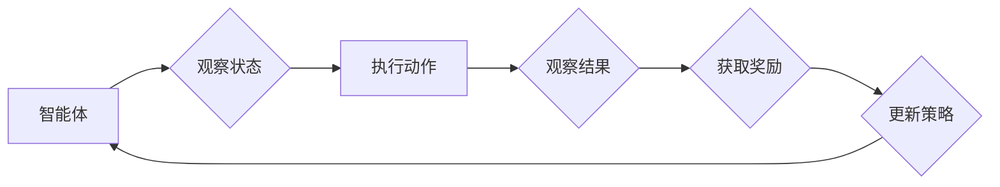
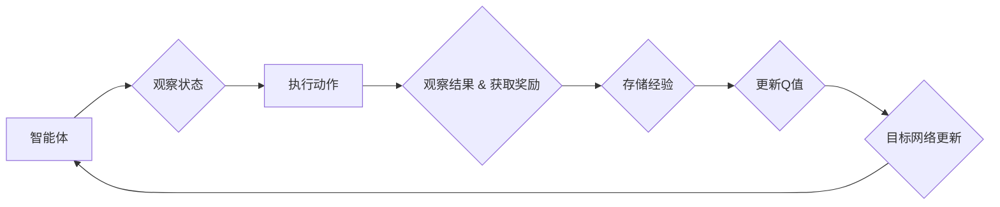

> 强化学习, 深度Q网络, DQN, 机器人, 无人驾驶, 机器人控制, 探索-利用平衡, 近似动态规划, 智能决策

# 一切皆是映射：DQN在机器人领域的实践：挑战与策略

### 1. 背景介绍

随着人工智能技术的飞速发展，机器人领域迎来了前所未有的机遇。机器人可以应用于制造业、服务业、医疗、家庭等多个领域，为人类生活带来便利。然而，机器人决策的复杂性和动态性给传统控制方法带来了挑战。强化学习作为一种先进的机器学习技术，通过智能体与环境交互，不断学习最优策略，为机器人控制提供了新的解决方案。其中，深度Q网络（Deep Q-Network，DQN）因其强大的学习和泛化能力，在机器人领域得到了广泛的应用。本文将深入探讨DQN在机器人领域的实践，分析其面临的挑战和相应的策略。

### 2. 核心概念与联系

#### 2.1 强化学习

强化学习是一种使智能体通过与环境交互来学习最优策略的机器学习方法。在强化学习中，智能体通过观察环境状态，选择动作，并根据动作的结果（奖励或惩罚）来调整策略，以达到最大化长期累积奖励的目标。

**Mermaid流程图：**



#### 2.2 深度Q网络（DQN）

DQN是深度学习与Q学习相结合的一种方法。它使用深度神经网络来近似Q值函数，即预测在特定状态下采取特定动作的预期奖励。DQN通过经验回放和目标网络等技术，有效地解决了传统Q学习中的样本效率低下和方差问题。

**Mermaid流程图：**



### 3. 核心算法原理 & 具体操作步骤

#### 3.1 算法原理概述

DQN算法的核心思想是使用深度神经网络来近似Q值函数，通过最大化Q值函数来学习最优策略。DQN的主要步骤如下：

1. 初始化参数：初始化智能体、Q网络、目标网络和经验回放缓冲区。
2. 选择动作：根据当前状态和Q网络，选择一个动作。
3. 执行动作：智能体执行选定的动作，并观察新的状态和奖励。
4. 存储经验：将当前状态、动作、新状态和奖励存储到经验回放缓冲区。
5. 更新Q值：从经验回放缓冲区中随机抽取经验样本，使用梯度下降算法更新Q网络参数。
6. 目标网络更新：定期更新目标网络，以减少梯度下降的方差。

#### 3.2 算法步骤详解

1. **经验回放缓冲区**：为了减少样本的相关性和方差，DQN使用经验回放缓冲区来存储经验样本。经验回放缓冲区可以防止智能体在训练过程中对特定样本产生过度依赖。
2. **目标网络**：目标网络用于生成目标Q值，以减少梯度下降的方差。目标网络的参数每隔一段时间与Q网络的参数进行同步。
3. **损失函数**：DQN使用均方误差（MSE）作为损失函数，用于衡量Q网络预测的Q值与目标Q值之间的差异。

#### 3.3 算法优缺点

**优点**：

- **样本效率高**：DQN通过经验回放缓冲区和目标网络，提高了样本效率，减少了方差。
- **适用性强**：DQN适用于连续和离散动作空间。
- **泛化能力强**：DQN可以学习到抽象的特征表示，具有较强的泛化能力。

**缺点**：

- **训练不稳定**：DQN的训练过程可能不稳定，需要仔细调整参数。
- **训练时间长**：DQN的训练过程可能需要较长时间。

#### 3.4 算法应用领域

DQN在机器人领域有着广泛的应用，例如：

- **无人驾驶**：DQN可以用于学习无人驾驶车辆的行驶策略。
- **机器人控制**：DQN可以用于控制机器人的移动、抓取等动作。
- **游戏**：DQN可以用于学习游戏的策略。

### 4. 数学模型和公式 & 详细讲解 & 举例说明

#### 4.1 数学模型构建

DQN的数学模型主要包括以下部分：

- **状态空间**：智能体所处的环境状态空间。
- **动作空间**：智能体可以采取的动作空间。
- **Q值函数**：在给定状态下，采取特定动作的预期奖励。
- **策略**：智能体在给定状态下选择动作的概率分布。

#### 4.2 公式推导过程

DQN的目标是最大化累积奖励，即：

$$
J(\theta) = \sum_{t=0}^\infty \gamma^t R_t
$$

其中，$J(\theta)$ 是策略 $\theta$ 的累积奖励，$R_t$ 是在时间步 $t$ 收到的奖励，$\gamma$ 是折扣因子。

Q值函数可以表示为：

$$
Q(s, a) = E[R_t | s, a]
$$

其中，$s$ 是状态，$a$ 是动作，$R_t$ 是在时间步 $t$ 收到的奖励。

#### 4.3 案例分析与讲解

以无人驾驶为例，我们可以将无人驾驶车辆的状态表示为车辆的位姿（位置和方向）、速度、加速度等，动作表示为车辆的油门、刹车、转向等控制信号。DQN通过学习Q值函数，来控制车辆的行驶策略。

### 5. 项目实践：代码实例和详细解释说明

#### 5.1 开发环境搭建

为了实践DQN在机器人领域的应用，我们需要搭建以下开发环境：

- **编程语言**：Python
- **深度学习框架**：TensorFlow或PyTorch
- **机器人仿真环境**：Gazebo或ROS

#### 5.2 源代码详细实现

以下是一个使用PyTorch实现DQN的简单示例：

```python
import torch
import torch.nn as nn
import torch.optim as optim

# 定义Q网络
class QNetwork(nn.Module):
    def __init__(self, input_size, output_size):
        super(QNetwork, self).__init__()
        self.fc1 = nn.Linear(input_size, 128)
        self.fc2 = nn.Linear(128, output_size)

    def forward(self, x):
        x = torch.relu(self.fc1(x))
        x = self.fc2(x)
        return x

# 定义DQN
class DQN:
    def __init__(self, input_size, output_size):
        self.q_network = QNetwork(input_size, output_size)
        self.target_network = QNetwork(input_size, output_size)
        self.optimizer = optim.Adam(self.q_network.parameters(), lr=0.001)
        self.criterion = nn.MSELoss()

    def select_action(self, state):
        with torch.no_grad():
            action_value = self.q_network(state)
            action = action_value.argmax()
        return action

    def update(self, batch):
        states, actions, rewards, next_states, dones = batch
        next_action_values = self.target_network(next_states).max(1)[0]
        target_values = rewards + (1 - dones) * next_action_values
        self.criterion(self.q_network(states).gather(1, actions), target_values)
        self.optimizer.zero_grad()
        self.criterion.backward()
        self.optimizer.step()

    def update_target_network(self):
        self.target_network.load_state_dict(self.q_network.state_dict())
```

#### 5.3 代码解读与分析

- `QNetwork`类定义了Q网络的结构，包括两个全连接层。
- `DQN`类定义了DQN的主要功能，包括选择动作、更新Q网络和更新目标网络。
- `select_action`方法用于在给定状态下选择动作。
- `update`方法用于更新Q网络，通过计算梯度下降来最小化损失函数。
- `update_target_network`方法用于更新目标网络，将Q网络的状态复制到目标网络。

#### 5.4 运行结果展示

在无人驾驶仿真环境中，我们可以运行DQN算法，并观察车辆的行驶轨迹。通过不断训练，DQN可以学会控制车辆按照期望的路径行驶。

### 6. 实际应用场景

#### 6.1 无人驾驶

无人驾驶是DQN在机器人领域最典型的应用之一。DQN可以用于学习车辆的行驶策略，包括油门、刹车和转向等控制信号。

#### 6.2 机器人控制

DQN可以用于控制机器人的移动、抓取等动作，例如，让机器人学习抓取不同形状的物体。

#### 6.3 游戏

DQN可以用于学习游戏的策略，例如，学习玩Atari 2600游戏。

### 7. 工具和资源推荐

#### 7.1 学习资源推荐

- 《Reinforcement Learning: An Introduction》
- 《Deep Reinforcement Learning》
- 《Deep Learning for Reinforcement Learning》

#### 7.2 开发工具推荐

- TensorFlow
- PyTorch
- OpenAI Gym

#### 7.3 相关论文推荐

- "Playing Atari with Deep Reinforcement Learning"
- "Human-level control through deep reinforcement learning"
- "Deep Q-Network"

### 8. 总结：未来发展趋势与挑战

#### 8.1 研究成果总结

DQN在机器人领域的应用取得了显著的成果，为机器人控制提供了新的思路。然而，DQN在训练稳定性、样本效率等方面仍存在一些挑战。

#### 8.2 未来发展趋势

- **改进训练稳定性**：通过改进算法、优化数据等方式，提高DQN的训练稳定性。
- **提高样本效率**：通过经验回放、数据增强等方式，提高DQN的样本效率。
- **拓展应用领域**：将DQN应用于更多机器人领域，如人机协作、智能家居等。

#### 8.3 面临的挑战

- **样本稀疏性**：在实际应用中，可能存在样本稀疏性问题，导致DQN难以收敛。
- **环境复杂性**：复杂环境的建模和状态空间表示是DQN应用的一大挑战。
- **稳定性问题**：DQN的训练过程可能不稳定，需要仔细调整参数。

#### 8.4 研究展望

随着深度学习和强化学习技术的不断发展，DQN在机器人领域的应用将会更加广泛。未来，DQN将与其他机器学习技术相结合，为机器人控制提供更加智能、高效、安全的解决方案。

---

作者：禅与计算机程序设计艺术 / Zen and the Art of Computer Programming