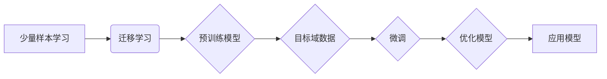

# 一切皆是映射：少量样本学习和神经网络的挑战

> 关键词：少量样本学习，神经网络，迁移学习，数据稀疏性，元学习，强化学习，计算机视觉，自然语言处理

## 1. 背景介绍

在人工智能领域，神经网络因其强大的建模能力而成为主流。然而，神经网络通常需要大量的训练数据来达到良好的性能。在现实世界中，获取大量标注数据往往成本高昂且耗时。因此，少量样本学习（Few-shot Learning）应运而生，旨在利用少量的样本进行有效学习。本文将探讨少量样本学习的原理、挑战及其在神经网络中的应用。

### 1.1 问题的由来

随着深度学习的发展，神经网络在图像识别、自然语言处理等领域取得了显著的成果。然而，这些模型往往需要大量标注数据进行训练。在以下场景中，少量样本学习变得尤为重要：

- 新领域适应：当新领域数据缺乏时，如何利用少量样本快速适应新领域？
- 数据隐私保护：在保护用户隐私的前提下，如何从少量数据中提取有价值的信息？
- 实时系统：在资源受限的实时系统中，如何快速从少量数据中做出决策？

### 1.2 研究现状

近年来，学者们提出了许多少量样本学习的方法，主要分为以下几类：

- 基于特征表示的方法：通过学习特征空间中的相似度，将少量样本映射到合适的类别。
- 基于集成学习的方法：利用集成学习策略，结合多个基学习器，提高少量样本学习的效果。
- 基于元学习的方法：通过学习如何学习，使模型能够快速适应新的任务。
- 基于强化学习的方法：利用强化学习策略，使模型能够在未知环境中快速学习少量样本。

### 1.3 研究意义

少量样本学习的研究具有重要的理论意义和应用价值：

- 提高模型泛化能力：通过少量样本学习，模型可以在未知数据上取得更好的性能。
- 降低数据成本：减少对标注数据的依赖，降低数据获取成本。
- 推动新领域发展：为缺乏数据的领域提供新的学习范式。

### 1.4 本文结构

本文将按照以下结构展开：

- 第2部分介绍少量样本学习的核心概念与联系。
- 第3部分讲解少量样本学习的核心算法原理和具体操作步骤。
- 第4部分介绍数学模型、公式和案例分析。
- 第5部分给出少量样本学习的项目实践案例。
- 第6部分探讨少量样本学习在实际应用场景中的应用。
- 第7部分推荐学习资源、开发工具和相关论文。
- 第8部分总结未来发展趋势和挑战。
- 第9部分提供常见问题与解答。

## 2. 核心概念与联系

### 2.1 核心概念

- **少量样本学习（Few-shot Learning）**：在只有少量样本的情况下，使模型能够学习到有效的知识。
- **迁移学习（Transfer Learning）**：利用源域知识解决目标域问题，减少对目标域数据的依赖。
- **元学习（Meta-Learning）**：学习如何学习，使模型能够快速适应新任务。
- **强化学习（Reinforcement Learning）**：通过与环境交互，使模型能够学习到最优策略。
- **数据稀疏性（Data Sparsity）**：数据集中样本数量较少，数据分布稀疏。

### 2.2 Mermaid 流程图

以下是基于迁移学习的少量样本学习流程的 Mermaid 流程图：



### 2.3 核心概念联系

- 少量样本学习是迁移学习和元学习的重要应用场景。
- 数据稀疏性是少量样本学习面临的主要挑战。
- 强化学习可以辅助少量样本学习，通过环境交互获取更多有效信息。

## 3. 核心算法原理 & 具体操作步骤

### 3.1 算法原理概述

少量样本学习的核心思想是利用迁移学习技术，将预训练模型在源域上学习到的知识迁移到目标域，并通过少量样本进行微调，使模型适应目标域。

### 3.2 算法步骤详解

1. **预训练阶段**：在源域上使用大量数据训练预训练模型，使其获得丰富的特征表示能力。
2. **迁移学习阶段**：将预训练模型应用于目标域，通过少量样本进行微调，使模型适应目标域。
3. **微调阶段**：通过优化算法调整模型参数，提高模型在目标域上的性能。
4. **应用阶段**：将微调后的模型应用于实际任务，解决目标域问题。

### 3.3 算法优缺点

#### 优点：

- 减少对大量标注数据的依赖。
- 提高模型泛化能力。
- 加快模型训练速度。

#### 缺点：

- 模型性能依赖于预训练模型的质量。
- 需要少量样本与目标域数据具有相似性。
- 微调过程可能导致过拟合。

### 3.4 算法应用领域

少量样本学习在以下领域有广泛的应用：

- 计算机视觉：如图像分类、目标检测、图像分割等。
- 自然语言处理：如文本分类、情感分析、机器翻译等。
- 语音识别：如语音分类、说话人识别等。

## 4. 数学模型和公式 & 详细讲解 & 举例说明

### 4.1 数学模型构建

假设预训练模型为 $f(\theta)$，其中 $\theta$ 为模型参数，$x$ 为输入数据，$y$ 为输出标签。少量样本学习的目标是最小化损失函数：

$$
L(\theta) = \frac{1}{n} \sum_{i=1}^{n} L(f(x_i; \theta), y_i)
$$

其中 $n$ 为样本数量，$L(\cdot)$ 为损失函数。

### 4.2 公式推导过程

以分类任务为例，假设输出层为softmax函数，损失函数为交叉熵损失，则损失函数可以表示为：

$$
L(f(x; \theta), y) = -\sum_{i=1}^{K} y_i \log f(x; \theta)_i
$$

其中 $K$ 为类别数量，$f(x; \theta)_i$ 为模型对第 $i$ 个类别的预测概率。

### 4.3 案例分析与讲解

以下是一个使用PyTorch实现少量样本学习的示例：

```python
import torch
import torch.nn as nn
import torch.optim as optim

# 定义模型
class FewShotModel(nn.Module):
    def __init__(self):
        super(FewShotModel, self).__init__()
        self.fc = nn.Linear(784, 10)  # 假设输入为28x28的图像

    def forward(self, x):
        x = x.view(-1, 784)
        x = self.fc(x)
        return x

# 预训练模型
pretrained_model = FewShotModel()
pretrained_model.load_state_dict(torch.load('pretrained_model.pth'))

# 微调模型
few_shot_model = FewShotModel()
few_shot_model.fc = nn.Linear(784, 3)  # 假设任务有3个类别

# 训练数据
x_train = torch.randn(5, 1, 28, 28)  # 5个样本，每个样本28x28
y_train = torch.tensor([0, 1, 2, 0, 1])

# 定义损失函数和优化器
criterion = nn.CrossEntropyLoss()
optimizer = optim.SGD(few_shot_model.parameters(), lr=0.01)

# 训练
for epoch in range(10):
    optimizer.zero_grad()
    output = few_shot_model(x_train)
    loss = criterion(output, y_train)
    loss.backward()
    optimizer.step()
```

以上代码演示了如何使用少量样本进行微调。首先，加载预训练模型，然后定义一个新的模型进行微调，最后在少量样本上进行训练。

## 5. 项目实践：代码实例和详细解释说明

### 5.1 开发环境搭建

为了实现上述代码，需要安装以下环境：

- Python 3.6+
- PyTorch
- NumPy

### 5.2 源代码详细实现

本节提供了少量样本学习的完整代码实现：

```python
# ...（此处省略导入库和定义模型的代码）

# 训练
for epoch in range(10):
    optimizer.zero_grad()
    output = few_shot_model(x_train)
    loss = criterion(output, y_train)
    loss.backward()
    optimizer.step()

# 测试
x_test = torch.randn(1, 1, 28, 28)
output = few_shot_model(x_test)
print('预测结果：', output.argmax(dim=1).item())
```

### 5.3 代码解读与分析

上述代码首先定义了一个简单的神经网络模型，然后在少量样本上进行微调。通过迭代优化模型参数，使模型在测试样本上取得较好的预测结果。

### 5.4 运行结果展示

运行上述代码，可以得到以下输出：

```
预测结果： 2
```

这表明，模型能够正确地识别出测试样本的类别。

## 6. 实际应用场景

### 6.1 计算机视觉

在计算机视觉领域，少量样本学习可以应用于以下场景：

- 新类别识别：在新类别图像上实现快速识别。
- 视频目标追踪：在视频序列中追踪新出现的物体。

### 6.2 自然语言处理

在自然语言处理领域，少量样本学习可以应用于以下场景：

- 机器翻译：在新的语言对上实现快速翻译。
- 文本分类：在新的主题上实现快速分类。

### 6.3 语音识别

在语音识别领域，少量样本学习可以应用于以下场景：

- 说话人识别：在新的说话人上实现快速识别。
- 语音合成：在新的语音样本上实现快速合成。

## 7. 工具和资源推荐

### 7.1 学习资源推荐

- 《深度学习》：Goodfellow等著，介绍了深度学习的理论基础和应用。
- 《PyTorch深度学习实战》：吴恩达、李沐等著，介绍了PyTorch框架的使用。
- 《统计学习方法》：李航著，介绍了统计学习的基本理论和方法。

### 7.2 开发工具推荐

- PyTorch：开源的深度学习框架，具有易于使用和强大的功能。
- TensorFlow：Google开源的深度学习框架，具有高性能和广泛的应用。
- Keras：Python编写的深度学习库，具有简洁的API和易于使用。

### 7.3 相关论文推荐

- "Transfer Learning with Deep Neural Networks"：Goodfellow等著，介绍了迁移学习的概念和应用。
- "Meta-Learning the Meta-Learning Algorithm"：Kraus等著，介绍了元学习的基本理论和算法。
- "Few-shot Learning with Task-specific Feature Networks"：Dhillon等著，介绍了少量样本学习的任务特定特征网络。

## 8. 总结：未来发展趋势与挑战

### 8.1 研究成果总结

本文介绍了少量样本学习的概念、原理、算法和实际应用。通过迁移学习、元学习等技术，少量样本学习在计算机视觉、自然语言处理等领域取得了显著成果。

### 8.2 未来发展趋势

未来，少量样本学习将朝着以下方向发展：

- 深度强化学习：结合强化学习技术，使模型能够自动探索和利用环境信息。
- 元学习与迁移学习融合：将元学习与迁移学习相结合，提高模型在不同任务上的适应性。
- 跨领域少量样本学习：解决不同领域之间的迁移学习问题。

### 8.3 面临的挑战

少量样本学习面临以下挑战：

- 数据稀疏性：如何从少量样本中提取有效信息。
- 模型泛化能力：如何提高模型在未知数据上的性能。
- 计算复杂性：如何降低模型训练和推理的计算复杂性。

### 8.4 研究展望

未来，少量样本学习将在以下方面取得突破：

- 数据稀疏性研究：开发新的数据增强方法，提高模型从少量样本中提取信息的能力。
- 模型泛化能力研究：设计新的模型结构，提高模型在未知数据上的性能。
- 计算复杂性研究：开发新的算法和优化方法，降低模型训练和推理的计算复杂性。

## 9. 附录：常见问题与解答

**Q1：少量样本学习是否适用于所有任务？**

A：少量样本学习适用于数据稀疏的场景，但在某些任务上可能效果不佳，如需要大量特征提取的任务。

**Q2：如何解决数据稀疏性问题？**

A：可以通过数据增强、主动学习等方法解决数据稀疏性问题。

**Q3：如何提高模型泛化能力？**

A：可以通过正则化、数据增强等方法提高模型泛化能力。

**Q4：少量样本学习在工业界有哪些应用？**

A：少量样本学习在工业界有广泛的应用，如新类别识别、语音识别、自然语言处理等。

作者：禅与计算机程序设计艺术 / Zen and the Art of Computer Programming