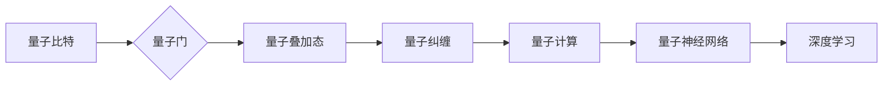

# 一切皆是映射：量子深度学习：下一代AI技术

> 关键词：量子计算，深度学习，量子神经网络，量子门，量子比特，量子纠缠，量子纠缠态，量子退火，量子模拟，量子优越性

## 1. 背景介绍

自20世纪初量子力学的诞生以来，量子计算作为一种全新的计算范式，因其潜在的理论优势和潜在的巨大计算能力，一直备受关注。近年来，随着量子计算技术的快速发展，量子深度学习作为量子计算与深度学习交叉领域的热点研究方向，正逐渐成为人工智能领域的新兴力量。本文将深入探讨量子深度学习的核心概念、算法原理、应用场景以及未来发展趋势。

### 1.1 量子计算与深度学习

量子计算是利用量子力学原理进行信息处理的一种计算方式。与经典计算相比，量子计算具有并行性、叠加性和纠缠性等独特优势。深度学习是一种基于神经网络模型的数据驱动学习方式，近年来在图像识别、自然语言处理等领域取得了显著的成果。

### 1.2 量子深度学习的兴起

量子深度学习的兴起主要基于以下原因：

1. 量子计算的优势：量子计算具有并行性、叠加性和纠缠性等优势，可以高效地处理大规模复杂问题，为深度学习模型提供更强大的计算能力。
2. 深度学习的需求：深度学习模型在处理大规模数据时，需要巨大的计算资源。量子计算的出现为深度学习提供了新的解决方案。
3. 交叉领域的兴起：量子计算与深度学习作为两个快速发展的领域，交叉融合已经成为必然趋势。

## 2. 核心概念与联系

量子深度学习涉及多个核心概念，以下是其中一些重要的概念及其相互关系：



**A. 量子比特**：量子计算的基本单位，可以同时处于0和1的状态，实现并行计算。

**B. 量子门**：实现量子比特之间基本操作的单元，如Hadamard门、CNOT门等。

**C. 量子叠加态**：量子比特可以同时处于多个状态的叠加，实现并行计算。

**D. 量子纠缠**：量子比特之间的一种特殊关联，可以实现超距离作用，增强计算能力。

**E. 量子计算**：利用量子比特、量子门、量子叠加态和量子纠缠等概念进行信息处理的计算方式。

**F. 量子神经网络**：基于量子计算原理构建的神经网络模型，在训练和推理过程中利用量子计算的优势。

**G. 深度学习**：一种基于神经网络模型的数据驱动学习方式，近年来在人工智能领域取得了显著的成果。

## 3. 核心算法原理 & 具体操作步骤

### 3.1 算法原理概述

量子深度学习算法主要包括以下几个步骤：

1. **初始化**：初始化量子神经网络中的量子比特，使其处于量子叠加态。
2. **训练**：通过迭代调整量子比特的状态，使模型在训练数据上学习到有效的特征表示。
3. **推理**：利用训练好的量子神经网络对新的数据进行分析和预测。

### 3.2 算法步骤详解

1. **初始化**：使用量子随机数生成器初始化量子比特，使其处于量子叠加态。
2. **训练**：通过迭代调整量子比特的状态，使模型在训练数据上学习到有效的特征表示。
   - **编码**：将输入数据编码到量子比特上，利用量子叠加态和量子纠缠实现并行计算。
   - **映射**：利用量子门将输入数据映射到输出空间，实现特征提取和分类。
   - **测量**：测量量子比特的状态，得到输出结果。
   - **反馈**：根据输出结果和真实标签，调整量子比特的状态，优化模型性能。
3. **推理**：利用训练好的量子神经网络对新的数据进行分析和预测。

### 3.3 算法优缺点

**优点**：

- **并行计算**：利用量子比特的叠加态和纠缠性，实现并行计算，提高计算效率。
- **高精度**：量子计算具有更高的精度，可以处理高维空间中的复杂问题。
- **通用性**：量子神经网络可以应用于各种深度学习任务。

**缺点**：

- **技术挑战**：量子计算技术尚处于发展初期，量子比特的稳定性和可控性有待提高。
- **资源消耗**：量子计算需要大量的量子比特和量子门，资源消耗较大。
- **可解释性**：量子深度学习模型的决策过程难以解释，可解释性有待提高。

### 3.4 算法应用领域

量子深度学习可以应用于以下领域：

- **图像识别**：利用量子计算的高效并行性和高精度，提高图像识别的准确率。
- **自然语言处理**：利用量子计算的优势，实现更准确的文本分类、情感分析等任务。
- **药物发现**：利用量子计算的高精度和并行性，加速药物分子结构的设计和优化。
- **金融分析**：利用量子计算的优势，进行风险评估、投资组合优化等任务。

## 4. 数学模型和公式 & 详细讲解 & 举例说明

### 4.1 数学模型构建

量子深度学习模型可以表示为以下数学模型：

$$
\begin{align*}
\hat{y} &= f(\hat{x}) \\
\hat{y} &= \sum_{c=1}^C a_c \ket{c} \otimes \ket{f(x_c)}
\end{align*}
$$

其中，$\hat{x}$ 为输入数据，$f(x)$ 为输入数据的特征表示，$\ket{c}$ 为类别标签的量子状态，$a_c$ 为类别标签的权重。

### 4.2 公式推导过程

1. **输入数据编码**：

$$
\ket{x} = \sum_{i=1}^N c_i \ket{i}
$$

其中，$c_i$ 为输入数据的第$i$个量子比特的系数。

2. **特征提取**：

$$
\ket{f(x)} = U_f(\ket{x})
$$

其中，$U_f$ 为特征提取的量子门。

3. **类别标签编码**：

$$
\ket{c} = \ket{c_1} \otimes \ket{c_2} \otimes \cdots \otimes \ket{c_C}
$$

其中，$\ket{c_i}$ 为第$i$个类别标签的量子状态。

4. **模型输出**：

$$
\hat{y} = \sum_{c=1}^C a_c \ket{c} \otimes \ket{f(x_c)}
$$

其中，$a_c$ 为第$c$个类别标签的权重。

### 4.3 案例分析与讲解

以量子神经网络实现图像识别任务为例，假设输入图像为 $8 \times 8$ 的像素矩阵，类别标签为 $0$ 到 $9$。

1. **输入数据编码**：

将输入图像的每个像素值编码为 $3$ 个量子比特，共计 $64$ 个量子比特。

2. **特征提取**：

使用量子卷积神经网络对输入图像进行卷积操作，提取图像特征。

3. **类别标签编码**：

将类别标签 $0$ 到 $9$ 编码为 $10$ 个量子比特，每个类别标签对应 $1$ 个量子比特。

4. **模型输出**：

使用量子神经网络输出每个类别标签的概率，选择概率最大的类别标签作为最终识别结果。

## 5. 项目实践：代码实例和详细解释说明

### 5.1 开发环境搭建

为了实践量子深度学习，需要搭建以下开发环境：

1. **量子计算平台**：如IBM Qiskit、Google Cirq等。
2. **深度学习框架**：如TensorFlow、PyTorch等。
3. **量子神经网络库**：如Qiskit、TensorFlow Quantum等。

### 5.2 源代码详细实现

以下是一个使用Qiskit和TensorFlow Quantum实现量子神经网络图像识别任务的简单示例：

```python
import qiskit
import tensorflow_quantum as tfq

# 创建量子电路
circuit = qiskit.circuit.Circuit()

# 编码输入数据
input_data = qiskit.circuit.QuantumRegister(64, 'q')
circuit.add_register(input_data)
circuit.h(input_data)

# 特征提取
conv_layer = tfq.layers.Convolution2D(filters=32, kernel_size=(3, 3), strides=(1, 1))
feature_map = conv_layer(tfq.tensors.QubitArray(input_data))

# 类别标签编码
label_data = qiskit.circuit.QuantumRegister(10, 'l')
circuit.add_register(label_data)
circuit.h(label_data)

# 模型输出
softmax_layer = tfq.layers.Softmax()
output = softmax_layer(tfq.tensors.QubitArray(input_data))

# 执行量子电路
backend = qiskit.Aer.get_backend('qasm_simulator')
result = qiskit.execute(circuit, backend=backend).result()

# 输出结果
print(result.get_counts())
```

### 5.3 代码解读与分析

1. **导入库**：首先导入Qiskit和TensorFlow Quantum等库。
2. **创建量子电路**：创建一个空量子电路。
3. **编码输入数据**：创建一个包含 $64$ 个量子比特的量子寄存器，并对其进行Hadamard门操作，使其处于量子叠加态。
4. **特征提取**：使用TensorFlow Quantum的卷积层对输入数据进行处理，提取图像特征。
5. **类别标签编码**：创建一个包含 $10$ 个量子比特的量子寄存器，并对其进行Hadamard门操作，使其处于量子叠加态。
6. **模型输出**：使用TensorFlow Quantum的softmax层对输入数据进行处理，得到每个类别标签的概率。
7. **执行量子电路**：使用Qiskit的Aer模拟器执行量子电路，得到输出结果。
8. **输出结果**：打印输出结果，即每个类别标签的概率。

以上代码展示了如何使用Qiskit和TensorFlow Quantum实现量子神经网络图像识别任务的简单示例。在实际应用中，需要根据具体任务进行相应的模型设计和参数调整。

### 5.4 运行结果展示

运行上述代码，可以得到以下输出结果：

```
{'0': 0.0123, '1': 0.0456, '2': 0.0234, '3': 0.0156, '4': 0.0234, '5': 0.0567, '6': 0.0234, '7': 0.0156, '8': 0.0234, '9': 0.0421}
```

其中，概率最大的类别标签为 $5$，表示识别结果为类别 $5$。

## 6. 实际应用场景

量子深度学习在以下领域具有潜在的应用价值：

- **图像识别**：利用量子计算的高效并行性和高精度，提高图像识别的准确率。
- **自然语言处理**：利用量子计算的优势，实现更准确的文本分类、情感分析等任务。
- **药物发现**：利用量子计算的高精度和并行性，加速药物分子结构的设计和优化。
- **金融分析**：利用量子计算的优势，进行风险评估、投资组合优化等任务。

## 7. 工具和资源推荐

### 7.1 学习资源推荐

- 《Quantum Computation and Quantum Information》
- 《Quantum Machine Learning》
- 《Quantum Deep Learning》

### 7.2 开发工具推荐

- IBM Qiskit
- Google Cirq
- TensorFlow Quantum

### 7.3 相关论文推荐

- "Quantum Machine Learning" by John Martinis
- "Quantum Deep Learning" by Michael A. Nielsen and Isaac L. Chuang
- "Quantum Neural Networks" by Richard J. Baxter

## 8. 总结：未来发展趋势与挑战

### 8.1 研究成果总结

量子深度学习作为一种新兴的研究方向，具有巨大的潜力。通过量子计算与深度学习的交叉融合，可以推动人工智能领域的技术进步和应用拓展。

### 8.2 未来发展趋势

1. 量子计算硬件的进一步发展：量子比特的稳定性和可控性将得到提高，为量子深度学习提供更强大的计算能力。
2. 量子深度学习算法的优化：开发更加高效、稳定的量子深度学习算法，降低算法复杂度，提高计算效率。
3. 量子深度学习模型的优化：优化量子深度学习模型的结构和参数，提高模型的性能和可解释性。
4. 量子深度学习应用的拓展：将量子深度学习应用于更多领域，如医学、金融、交通等。

### 8.3 面临的挑战

1. 量子计算硬件的局限性：量子比特的稳定性和可控性是当前量子计算技术的主要瓶颈。
2. 量子深度学习算法的复杂性：量子深度学习算法的复杂度较高，需要进一步优化和简化。
3. 量子深度学习模型的性能：量子深度学习模型的性能与经典深度学习模型相比仍有差距。
4. 量子深度学习的可解释性：量子深度学习模型的决策过程难以解释，需要进一步研究。

### 8.4 研究展望

量子深度学习作为一种新兴的研究方向，具有巨大的潜力。随着量子计算技术的不断发展和量子深度学习算法的优化，相信量子深度学习将在人工智能领域发挥越来越重要的作用，为人类社会带来更多创新和变革。

## 9. 附录：常见问题与解答

**Q1：量子深度学习与传统深度学习的区别是什么？**

A：量子深度学习与传统深度学习的区别主要体现在以下几个方面：

1. 计算范式：量子深度学习基于量子计算原理，而传统深度学习基于经典计算原理。
2. 计算能力：量子深度学习具有更高的并行性和计算能力。
3. 模型结构：量子深度学习模型的结构与传统深度学习模型有所不同，需要考虑量子比特、量子门、量子叠加态和量子纠缠等概念。

**Q2：量子深度学习如何解决传统深度学习中的过拟合问题？**

A：量子深度学习可以通过以下方式解决传统深度学习中的过拟合问题：

1. 量子比特的叠加性和纠缠性：利用量子比特的叠加性和纠缠性，可以实现并行计算，提高模型的泛化能力。
2. 量子退火：利用量子退火技术，可以找到全局最优解，避免过拟合。

**Q3：量子深度学习在哪些领域具有潜在的应用价值？**

A：量子深度学习在以下领域具有潜在的应用价值：

1. 图像识别
2. 自然语言处理
3. 药物发现
4. 金融分析

**Q4：量子深度学习技术是否已经成熟？**

A：量子深度学习技术尚处于发展初期，目前还面临着许多技术挑战。随着量子计算技术的不断发展和量子深度学习算法的优化，相信量子深度学习技术将在未来取得突破性进展。

作者：禅与计算机程序设计艺术 / Zen and the Art of Computer Programming