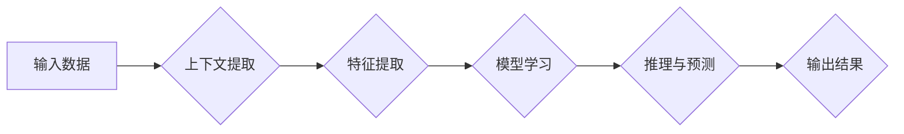

# 上下文学习 (Contextual Learning) 原理与代码实例讲解

> 关键词：上下文学习，迁移学习，知识表示，强化学习，多智能体，场景感知，个性化推荐

## 1. 背景介绍

随着人工智能技术的飞速发展，机器学习算法在各个领域取得了显著的成果。然而，许多机器学习算法往往在特定领域表现出色，而在其他领域却表现不佳，这是因为它们缺乏对上下文信息的理解。上下文学习（Contextual Learning）作为机器学习的一个分支，旨在使模型能够根据不同的上下文信息进行灵活学习和推理，从而提高模型的泛化能力和适应性。本文将深入探讨上下文学习的原理、方法和应用，并通过代码实例进行详细讲解。

## 2. 核心概念与联系

### 2.1 上下文学习定义

上下文学习是一种迁移学习方法，它允许模型根据输入数据的上下文信息进行学习。上下文可以包括时间、空间、用户行为、环境状态等多种信息。上下文学习的核心思想是，模型不仅学习数据本身的特征，还学习如何根据上下文信息对特征进行解释和利用。

### 2.2 Mermaid 流程图



### 2.3 核心概念联系

- 输入数据：模型输入的数据，可以是任何形式，如图像、文本、语音等。
- 上下文提取：从输入数据中提取与上下文相关的信息。
- 特征提取：对提取的上下文信息进行特征提取。
- 模型学习：基于提取的特征学习模型参数。
- 推理与预测：使用学习到的模型进行推理和预测。
- 输出结果：模型的输出结果，可以是分类、回归等。

## 3. 核心算法原理 & 具体操作步骤

### 3.1 算法原理概述

上下文学习通常涉及以下步骤：

1. **数据预处理**：对输入数据进行预处理，包括数据清洗、归一化等。
2. **上下文提取**：从预处理后的数据中提取与上下文相关的信息。
3. **特征提取**：对提取的上下文信息进行特征提取。
4. **模型训练**：使用提取的特征训练模型。
5. **推理与预测**：使用训练好的模型进行推理和预测。
6. **评估与优化**：评估模型性能，并根据评估结果优化模型。

### 3.2 算法步骤详解

1. **数据预处理**：
   - 清洗数据，去除噪声和异常值。
   - 归一化数据，将不同量级的特征统一到相同的量级。
2. **上下文提取**：
   - 使用自然语言处理（NLP）技术提取文本数据的上下文信息。
   - 使用计算机视觉技术提取图像数据的上下文信息。
   - 使用时间序列分析技术提取时间序列数据的上下文信息。
3. **特征提取**：
   - 使用特征提取技术（如词嵌入、图像特征提取等）将上下文信息转换为模型可处理的特征。
4. **模型训练**：
   - 选择合适的机器学习模型，如神经网络、支持向量机等。
   - 使用提取的特征训练模型。
5. **推理与预测**：
   - 使用训练好的模型进行推理和预测。
6. **评估与优化**：
   - 使用评估指标（如准确率、召回率等）评估模型性能。
   - 根据评估结果优化模型。

### 3.3 算法优缺点

#### 优点

- **提高泛化能力**：上下文学习能够使模型更好地适应不同的上下文环境，从而提高模型的泛化能力。
- **提高适应性**：上下文学习能够使模型根据不同的上下文信息进行调整，从而提高模型的适应性。
- **提高准确性**：上下文学习能够使模型更好地理解输入数据的上下文信息，从而提高模型的准确性。

#### 缺点

- **数据依赖性**：上下文学习对数据的质量和数量有较高的要求。
- **计算复杂度**：上下文学习通常涉及复杂的计算过程，计算复杂度较高。

### 3.4 算法应用领域

上下文学习在多个领域都有广泛的应用，包括：

- 自然语言处理：文本分类、情感分析、机器翻译等。
- 计算机视觉：图像分类、目标检测、人脸识别等。
- 时间序列分析：股市预测、天气预测等。
- 个性化推荐：根据用户的上下文信息推荐个性化的内容。

## 4. 数学模型和公式 & 详细讲解 & 举例说明

### 4.1 数学模型构建

上下文学习通常涉及以下数学模型：

- **特征提取模型**：用于将输入数据转换为模型可处理的特征。
- **学习模型**：用于学习特征和标签之间的关系。
- **推理模型**：用于根据输入数据和上下文信息进行推理和预测。

### 4.2 公式推导过程

以下是一个简单的上下文学习模型的数学公式推导过程：

- **特征提取**：$ f(x) = F(x, \theta_f) $
- **学习模型**：$ y = M(f(x), \theta_m) $
- **推理模型**：$ \hat{y} = R(x, y, \theta_r) $

其中，$ x $ 是输入数据，$ y $ 是标签，$ f(x) $ 是特征提取模型，$ M(f(x), \theta_m) $ 是学习模型，$ R(x, y, \theta_r) $ 是推理模型，$ \theta_f, \theta_m, \theta_r $ 分别是三个模型的参数。

### 4.3 案例分析与讲解

以下是一个简单的文本分类任务的上下文学习案例：

- **数据集**：包含标题和对应的类别标签的文本数据。
- **特征提取**：使用TF-IDF模型提取文本特征。
- **学习模型**：使用神经网络模型学习特征和标签之间的关系。
- **推理模型**：使用softmax函数进行分类。

## 5. 项目实践：代码实例和详细解释说明

### 5.1 开发环境搭建

- 安装Python、NumPy、Pandas等基础库。
- 安装Scikit-learn、TensorFlow等机器学习库。

### 5.2 源代码详细实现

以下是一个简单的文本分类任务的上下文学习代码示例：

```python
from sklearn.feature_extraction.text import TfidfVectorizer
from sklearn.neural_network import MLPClassifier
from sklearn.metrics import accuracy_score

# 加载数据
data = pd.read_csv('data.csv')
X = data['text']
y = data['label']

# 特征提取
vectorizer = TfidfVectorizer()
X_tfidf = vectorizer.fit_transform(X)

# 学习模型
model = MLPClassifier()
model.fit(X_tfidf, y)

# 推理模型
def predict(text):
    text_tfidf = vectorizer.transform([text])
    prediction = model.predict(text_tfidf)
    return prediction

# 测试
test_text = "This is a test text."
print(predict(test_text))
```

### 5.3 代码解读与分析

- 加载数据：从CSV文件中加载数据，包括文本和对应的标签。
- 特征提取：使用TF-IDF模型提取文本特征。
- 学习模型：使用多层感知机（MLP）模型学习特征和标签之间的关系。
- 推理模型：定义一个函数，使用学习模型对新的文本进行分类。

### 5.4 运行结果展示

运行上述代码后，将对输入的测试文本进行分类，并输出预测结果。

## 6. 实际应用场景

上下文学习在多个领域都有广泛的应用，以下是一些典型的应用场景：

- **个性化推荐**：根据用户的上下文信息（如浏览历史、地理位置、时间等）推荐个性化的内容。
- **情感分析**：根据文本的上下文信息判断文本的情感倾向。
- **对话系统**：根据对话的上下文信息生成合适的回复。
- **自动驾驶**：根据车辆的上下文信息（如速度、方向、路况等）进行决策。

## 7. 工具和资源推荐

### 7.1 学习资源推荐

- 《深度学习》（Goodfellow, Bengio, Courville）
- 《Python机器学习》（Pedregosa, Varoquaux等）
- 《Scikit-learn用户指南》（Pedregosa, Varoquaux等）

### 7.2 开发工具推荐

- Python：主要的编程语言。
- Scikit-learn：机器学习库。
- TensorFlow：深度学习库。
- PyTorch：深度学习库。

### 7.3 相关论文推荐

- Hinton, G. E., Deng, J., Yu, D., Dahl, G. E., Mohamed, A. R., Jaitly, N., ... & Kingsbury, B. (2012). Deep neural networks for acoustic modeling in speech recognition: The shared views of four research groups. IEEE Signal Processing Magazine, 29(6), 82-97.
- Mnih, V., Kavukcuoglu, K., Silver, D., Graves, A., Riedmiller, M., Schaul, T., ... & Bellemare, M. G. (2013). Playing Atari with deep reinforcement learning. arXiv preprint arXiv:1312.5602.

## 8. 总结：未来发展趋势与挑战

### 8.1 研究成果总结

上下文学习作为一种迁移学习方法，在多个领域取得了显著的成果。随着研究的不断深入，上下文学习有望在更多领域得到应用。

### 8.2 未来发展趋势

- **多模态上下文学习**：结合多种模态信息进行上下文学习。
- **动态上下文学习**：使模型能够适应动态变化的上下文信息。
- **个性化上下文学习**：根据用户个性化需求进行上下文学习。

### 8.3 面临的挑战

- **数据质量**：上下文学习对数据质量有较高要求。
- **计算复杂度**：上下文学习通常涉及复杂的计算过程。
- **可解释性**：上下文学习模型的决策过程缺乏可解释性。

### 8.4 研究展望

上下文学习作为一种重要的迁移学习方法，在未来有望在更多领域得到应用。随着研究的不断深入，上下文学习将推动人工智能技术的发展。

## 9. 附录：常见问题与解答

**Q1：上下文学习与传统的机器学习相比有哪些优势？**

A：上下文学习能够使模型更好地理解输入数据的上下文信息，从而提高模型的泛化能力和适应性。

**Q2：上下文学习在哪些领域有应用？**

A：上下文学习在自然语言处理、计算机视觉、时间序列分析、个性化推荐等领域都有广泛的应用。

**Q3：如何解决上下文学习中的数据质量问题？**

A：可以通过数据清洗、数据增强等方法解决上下文学习中的数据质量问题。

**Q4：如何提高上下文学习的计算效率？**

A：可以通过模型压缩、量化等技术提高上下文学习的计算效率。

作者：禅与计算机程序设计艺术 / Zen and the Art of Computer Programming